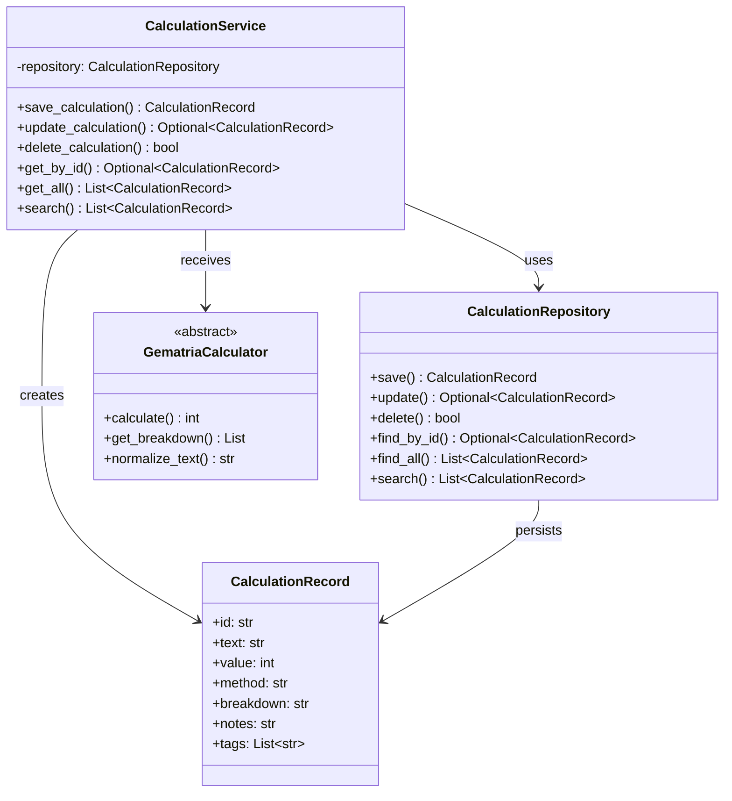
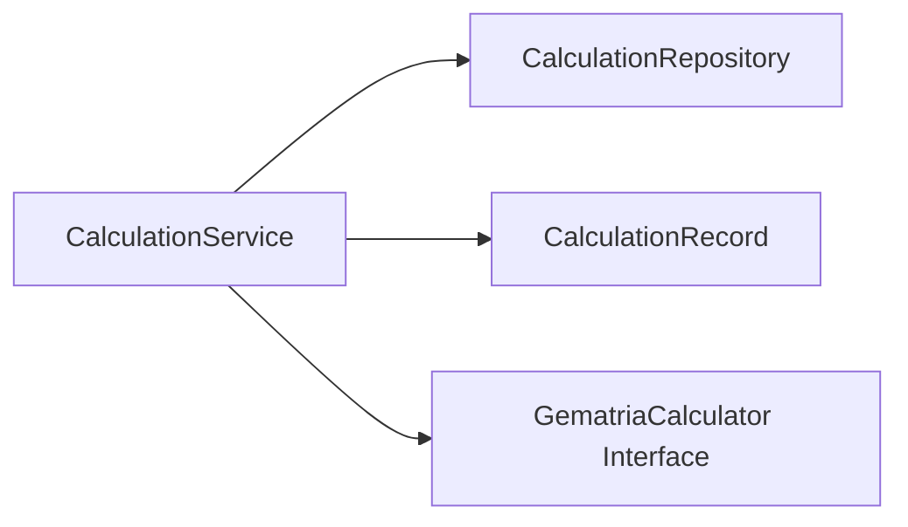

# Calculation Service API Reference

<!-- Last Verified: 2026-01-16 -->

<cite>
**Referenced Files in This Document**
- [calculation_service.py](file://src/pillars/gematria/services/calculation_service.py)
- [calculation_repository.py](file://src/pillars/gematria/repositories/sqlite_calculation_repository.py)
- [calculation_record.py](file://src/pillars/gematria/models/calculation_record.py)
- [base_calculator.py](file://src/shared/services/gematria/base_calculator.py)
</cite>

## Table of Contents
1. [Introduction](#introduction)
2. [Class Overview](#class-overview)
3. [Core Methods](#core-methods)
4. [Data Model](#data-model)
5. [Usage Examples](#usage-examples)
6. [Error Handling](#error-handling)
7. [Dependencies](#dependencies)
8. [Performance Considerations](#performance-considerations)

## Introduction

**`CalculationService`** is the **Service Layer Orchestrator** for gematria calculations. It acts as the intermediary between UI components and the calculation/persistence layers, providing a clean API for:
- Saving calculation results to the database
- Updating calculation metadata (notes, tags, ratings)
- Querying saved calculations
- Managing calculation history

**Architectural Role**: **Service (The Enumerator)**
- **Layer**: Service (business logic)
- **Responsibilities**: Orchestration, validation, persistence coordination
- **Dependencies**: Calculator strategies, CalculationRepository
- **Consumers**: UI windows (GematriaCalculatorWindow, SavedCalculationsWindow)

## Class Overview

```python
class CalculationService:
    """Service for managing calculation records."""
    
    def __init__(self, repository: Optional[CalculationRepository] = None):
        """
        Initialize the calculation service.
        
        Args:
            repository: Optional repository instance. Creates default if not provided.
        """
        self.repository = repository or CalculationRepository()
```

**Design Philosophy:**
- **Dependency Injection**: Repository can be injected for testing (mocking)
- **Default Instantiation**: Creates default repository if none provided
- **Stateless Operations**: All methods are idempotent and side-effect free (except persistence)

### Class Diagram



## Core Methods

### save_calculation

```python
def save_calculation(
    self,
    text: str,
    value: int,
    calculator: GematriaCalculator,
    breakdown: List[tuple],
    notes: str = "",
    source: str = "",
    tags: List[str] = None,
    category: str = "",
    user_rating: int = 0,
    is_favorite: bool = False,
) -> CalculationRecord:
```

**Purpose**: Persist a new calculation to the database with full metadata.

**Parameters:**
- `text` (str): Original input text (preserves case, diacritics)
- `value` (int): Calculated gematria value
- `calculator` (GematriaCalculator): The calculator instance used (provides `name` and `normalize_text`)
- `breakdown` (List[tuple]): Character-value pairs from `get_breakdown()`
  - Format: `[(char, value), (char, value), ...]`
  - Example: `[('א', 1), ('ב', 2)]`
- `notes` (str, optional): User annotations, commentary, or research notes
- `source` (str, optional): Biblical reference, document name, or citation
- `tags` (List[str], optional): User-defined tags for categorization
- `category` (str, optional): Broader classification (e.g., "Divine Names", "Prophetic")
- `user_rating` (int, optional): 0-5 star rating for significance
- `is_favorite` (bool, optional): Flag for quick access

**Returns**: `CalculationRecord` - The saved record with generated ID and timestamp

**Process Flow:**
1. Convert breakdown tuples to JSON-serializable format
2. Normalize text using calculator's normalization method
3. Create `CalculationRecord` instance with all metadata
4. Persist to repository
5. Return saved record (includes auto-generated ID and timestamp)

**Example Usage:**
```python
from shared.services.gematria.hebrew_calculator import HebrewGematriaCalculator

calculator = HebrewGematriaCalculator()
text = "אלהים"
value = calculator.calculate(text)
breakdown = calculator.get_breakdown(text)

service = CalculationService()
record = service.save_calculation(
    text=text,
    value=value,
    calculator=calculator,
    breakdown=breakdown,
    notes="The divine name in Genesis 1:1",
    source="Genesis 1:1",
    tags=["divine_name", "creation"],
    category="Theological",
    user_rating=5,
    is_favorite=True
)

print(f"Saved as ID: {record.id}")
```

**Internal Transformation:**
```python
# Breakdown conversion
breakdown_data = [
    {"char": char, "value": val} 
    for char, val in breakdown
]
breakdown_json = json.dumps(breakdown_data, ensure_ascii=False)

# Example result:
# '[{"char": "א", "value": 1}, {"char": "ל", "value": 30}, ...]'
```

### update_calculation

```python
def update_calculation(
    self,
    record_id: str,
    notes: Optional[str] = None,
    source: Optional[str] = None,
    tags: Optional[List[str]] = None,
    category: Optional[str] = None,
    user_rating: Optional[int] = None,
    is_favorite: Optional[bool] = None,
) -> Optional[CalculationRecord]:
```

**Purpose**: Update metadata for an existing calculation. Does **not** recalculate values.

**Parameters:**
- `record_id` (str): UUID of the record to update
- `notes` (Optional[str]): New notes (replaces existing)
- `source` (Optional[str]): New source reference
- `tags` (Optional[List[str]]): New tag list (replaces existing)
- `category` (Optional[str]): New category
- `user_rating` (Optional[int]): New rating (0-5)
- `is_favorite` (Optional[bool]): New favorite status

**Returns**: `Optional[CalculationRecord]` - Updated record, or `None` if not found

**Design Notes:**
- Only provided parameters are updated (partial update)
- `None` values are ignored (field remains unchanged)
- Maintains immutability of calculation data (text, value, breakdown)

**Example Usage:**
```python
# Add research notes to existing calculation
updated = service.update_calculation(
    record_id="550e8400-e29b-41d4-a716-446655440000",
    notes="Cross-reference with Sefer Yetzirah Chapter 2",
    tags=["sefer_yetzirah", "divine_name", "meditation"]
)

if updated:
    print(f"Updated: {updated.text} = {updated.value}")
else:
    print("Record not found")
```

### delete_calculation

```python
def delete_calculation(self, record_id: str) -> bool:
```

**Purpose**: Remove a calculation from the database permanently.

**Parameters:**
- `record_id` (str): UUID of the record to delete

**Returns**: `bool` - `True` if deleted, `False` if not found

**Example Usage:**
```python
success = service.delete_calculation("550e8400-e29b-41d4-a716-446655440000")
if success:
    print("Calculation deleted")
```

### get_by_id

```python
def get_by_id(self, record_id: str) -> Optional[CalculationRecord]:
```

**Purpose**: Retrieve a single calculation by its unique identifier.

**Parameters:**
- `record_id` (str): UUID of the record

**Returns**: `Optional[CalculationRecord]` - Record if found, `None` otherwise

**Example Usage:**
```python
record = service.get_by_id("550e8400-e29b-41d4-a716-446655440000")
if record:
    print(f"{record.text} = {record.value} ({record.method})")
```

### get_all

```python
def get_all(
    self,
    limit: Optional[int] = None,
    offset: int = 0,
    order_by: str = "created_at",
    ascending: bool = False
) -> List[CalculationRecord]:
```

**Purpose**: Retrieve all calculations with optional pagination and sorting.

**Parameters:**
- `limit` (Optional[int]): Maximum records to return (None = all)
- `offset` (int): Number of records to skip (for pagination)
- `order_by` (str): Field to sort by (`"created_at"`, `"value"`, `"text"`)
- `ascending` (bool): Sort direction (False = descending/newest first)

**Returns**: `List[CalculationRecord]` - Ordered list of records

**Example Usage:**
```python
# Get 50 most recent calculations
recent = service.get_all(limit=50, order_by="created_at", ascending=False)

# Get all favorites sorted by value
favorites = service.search(filters={"is_favorite": True}, order_by="value")
```

### search

```python
def search(
    self,
    filters: Dict[str, Any],
    limit: Optional[int] = None,
    order_by: str = "created_at",
    ascending: bool = False
) -> List[CalculationRecord]:
```

**Purpose**: Query calculations with flexible filtering criteria.

**Parameters:**
- `filters` (Dict[str, Any]): Filter conditions
  - Keys: `"value"`, `"method"`, `"text"`, `"tags"`, `"category"`, `"is_favorite"`, `"min_rating"`
  - Values: Exact match or comparison operators
- `limit` (Optional[int]): Maximum results
- `order_by` (str): Sort field
- `ascending` (bool): Sort direction

**Returns**: `List[CalculationRecord]` - Filtered results

**Filter Examples:**
```python
# Find all calculations with value 888
results = service.search(filters={"value": 888})

# Find Hebrew calculations with "divine" tag
results = service.search(filters={
    "method": "Hebrew Standard",
    "tags": ["divine_name"]
})

# Find highly-rated favorites
results = service.search(filters={
    "is_favorite": True,
    "min_rating": 4
})

# Text substring search
results = service.search(filters={
    "text": "אל"  # Finds any text containing "אל"
})
```

## Data Model

### CalculationRecord Structure

```python
@dataclass
class CalculationRecord:
    text: str                    # Original input text
    normalized_text: str         # Diacritic-stripped version
    value: int                   # Calculated gematria value
    language: str                # Calculator name (legacy field)
    method: str                  # Calculator name (e.g., "Hebrew Standard")
    notes: str                   # User annotations
    source: str                  # Citation or reference
    tags: List[str]              # User-defined tags
    breakdown: str               # JSON-encoded character breakdown
    character_count: int         # Number of significant characters
    category: str                # User category
    user_rating: int             # 0-5 star rating
    is_favorite: bool            # Favorite flag
    id: str                      # UUID (auto-generated)
    created_at: datetime         # Timestamp (auto-generated)
    updated_at: datetime         # Last modified timestamp
```

**Field Details:**

| Field | Type | Purpose | Example |
|-------|------|---------|---------|
| `text` | str | Original input | `"בְּרֵאשִׁית"` |
| `normalized_text` | str | Without diacritics | `"בראשית"` |
| `value` | int | Gematria sum | `913` |
| `method` | str | Calculator used | `"Hebrew Standard"` |
| `breakdown` | str | JSON character data | `'[{"char":"ב","value":2},...]'` |
| `tags` | List[str] | User keywords | `["genesis", "creation"]` |
| `user_rating` | int | Significance (0-5) | `5` |
| `is_favorite` | bool | Quick access flag | `True` |
| `created_at` | datetime | Creation timestamp | `2026-01-16T15:30:00Z` |

## Usage Examples

### Complete Calculation Workflow

```python
from shared.services.gematria.hebrew_calculator import HebrewGematriaCalculator
from pillars.gematria.services.calculation_service import CalculationService

# Initialize service and calculator
service = CalculationService()
calculator = HebrewGematriaCalculator()

# User input
text = "תורה"

# Perform calculation
value = calculator.calculate(text)
breakdown = calculator.get_breakdown(text)

# Save to database
record = service.save_calculation(
    text=text,
    value=value,
    calculator=calculator,
    breakdown=breakdown,
    notes="The Torah - the Five Books",
    source="Traditional",
    tags=["torah", "sacred_texts"],
    category="Biblical",
    user_rating=5,
    is_favorite=True
)

print(f"Saved: {record.text} = {record.value}")
print(f"ID: {record.id}")
print(f"Breakdown: {record.breakdown}")
```

### Batch Calculation and Storage

```python
words = ["אהבה", "יחוד", "שלום"]
calculator = HebrewGematriaCalculator()
service = CalculationService()

for word in words:
    value = calculator.calculate(word)
    breakdown = calculator.get_breakdown(word)
    
    service.save_calculation(
        text=word,
        value=value,
        calculator=calculator,
        breakdown=breakdown,
        category="Virtues"
    )

# Query all virtues
virtues = service.search(filters={"category": "Virtues"})
print(f"Saved {len(virtues)} virtue calculations")
```

### Searching by Value

```python
# Find all words with value 26 (יהוה = YHVH)
matches = service.search(filters={"value": 26})

for match in matches:
    print(f"{match.text} = {match.value} ({match.method})")
    print(f"  Source: {match.source}")
    print(f"  Notes: {match.notes}")
    print()
```

## Error Handling

### Exception Types

**ValueError**: Raised for invalid input
```python
# Invalid rating
service.save_calculation(..., user_rating=10)  # Raises ValueError (max is 5)
```

**KeyError**: Repository-level errors (database issues)
```python
try:
    record = service.save_calculation(...)
except KeyError as e:
    logger.error(f"Database save failed: {e}")
```

### Null Handling

```python
# Graceful None handling
record = service.get_by_id("nonexistent-id")
if record is None:
    print("Record not found")
else:
    print(f"Found: {record.text}")
```

### Validation Best Practices

```python
# Validate before saving
if not text.strip():
    raise ValueError("Text cannot be empty")

if not (0 <= user_rating <= 5):
    raise ValueError("Rating must be 0-5")

if tags and not isinstance(tags, list):
    raise TypeError("Tags must be a list")
```

## Dependencies

### Direct Dependencies



**Import Structure:**
```python
from ..models import CalculationRecord
from ..repositories import CalculationRepository
from shared.services.gematria.base_calculator import GematriaCalculator
```

### Dependency Injection Pattern

```python
# Production: Use default repository
service = CalculationService()

# Testing: Inject mock repository
mock_repo = MockCalculationRepository()
service = CalculationService(repository=mock_repo)

# Testing: Verify behavior
record = service.save_calculation(...)
assert mock_repo.save_called
```

## Performance Considerations

### Computational Complexity

- **save_calculation**: O(n) where n = text length (JSON serialization)
- **update_calculation**: O(1) database update
- **get_by_id**: O(1) indexed lookup
- **get_all**: O(k) where k = result count
- **search**: O(k) with index optimization

### Memory Profile

- **Service instance**: ~100 bytes (minimal state)
- **Repository instance**: Holds database connection (~1 KB)
- **CalculationRecord**: ~500 bytes - 2 KB depending on text/breakdown size

### Optimization Strategies

**1. Batch Insertion:**
```python
# Instead of N separate saves
for word in large_word_list:
    service.save_calculation(...)  # N database writes

# Use repository bulk insert
records = [create_record(word) for word in large_word_list]
service.repository.bulk_insert(records)  # 1 transaction
```

**2. Caching:**
```python
from functools import lru_cache

@lru_cache(maxsize=1000)
def get_by_value_cached(value: int):
    return service.search(filters={"value": value})
```

**3. Lazy Loading:**
```python
# Don't load all records at once
for i in range(0, total_records, batch_size):
    batch = service.get_all(limit=batch_size, offset=i)
    process_batch(batch)
```

---

**See Also:**
- [strategy_pattern.md](../architecture/strategy_pattern.md) - Calculator architecture
- [data_flow.md](../architecture/data_flow.md) - End-to-end process
- [calculation_record.md](calculation_record.md) - Data model details
- [GUIDES.md](../GUIDES.md) - Practical usage tutorials

**Revision History:**
- 2026-01-16: Initial comprehensive API documentation
