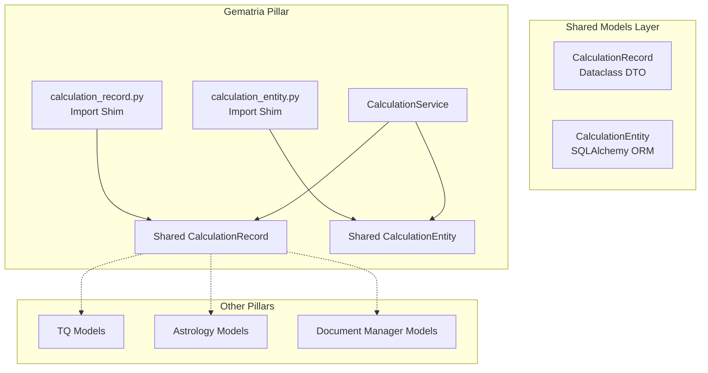
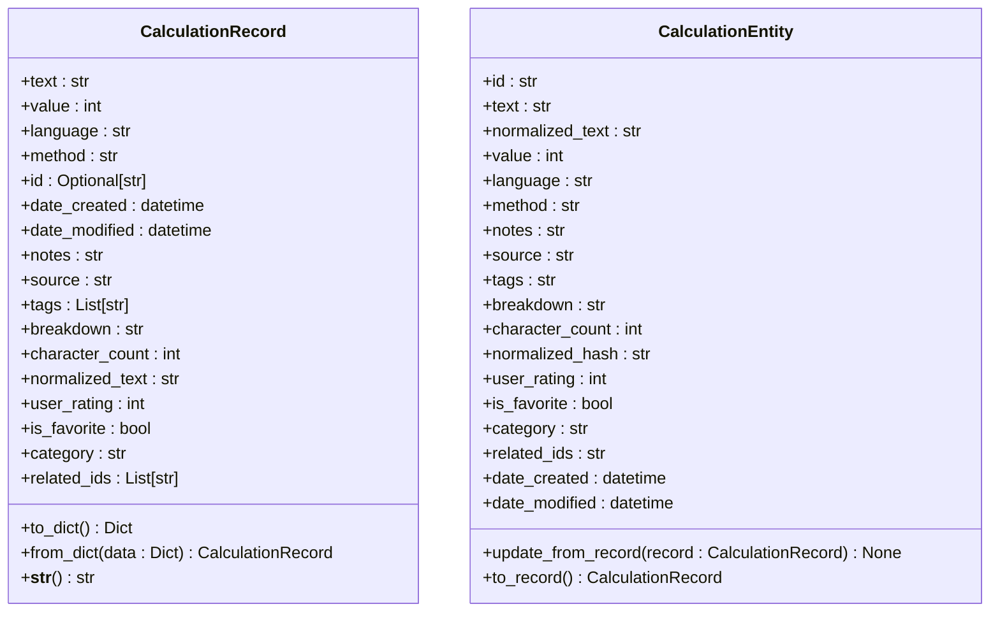
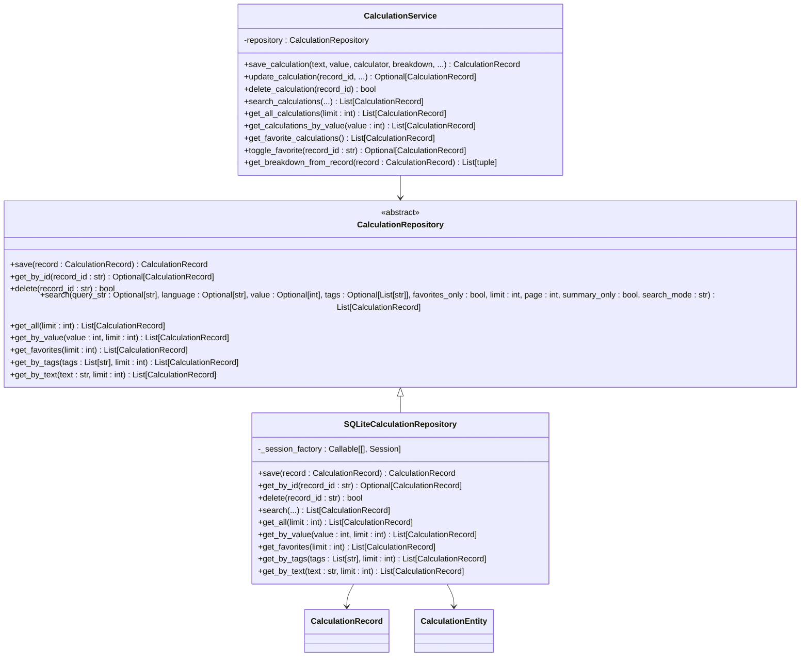
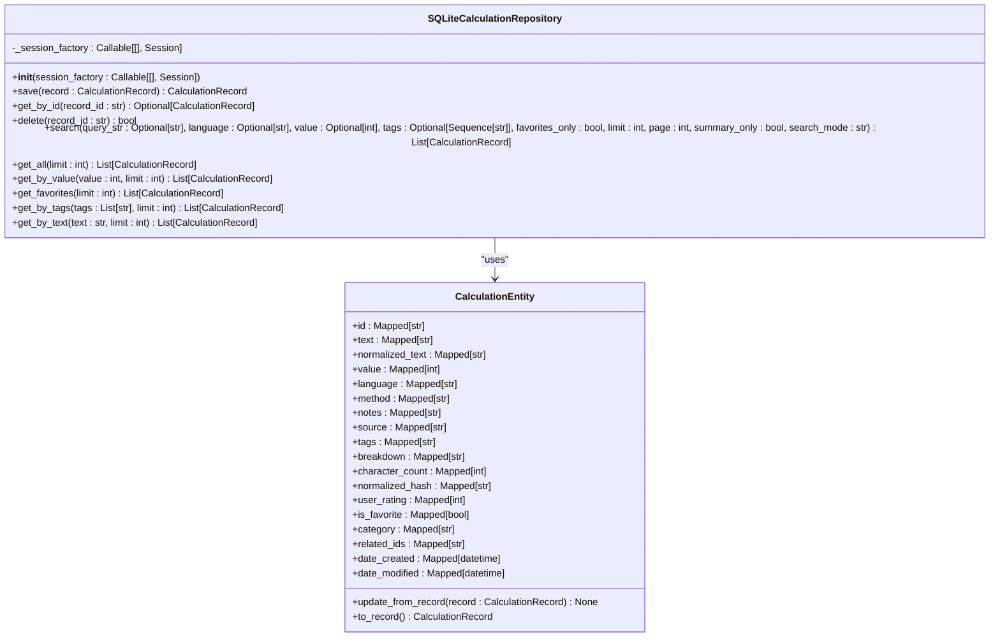
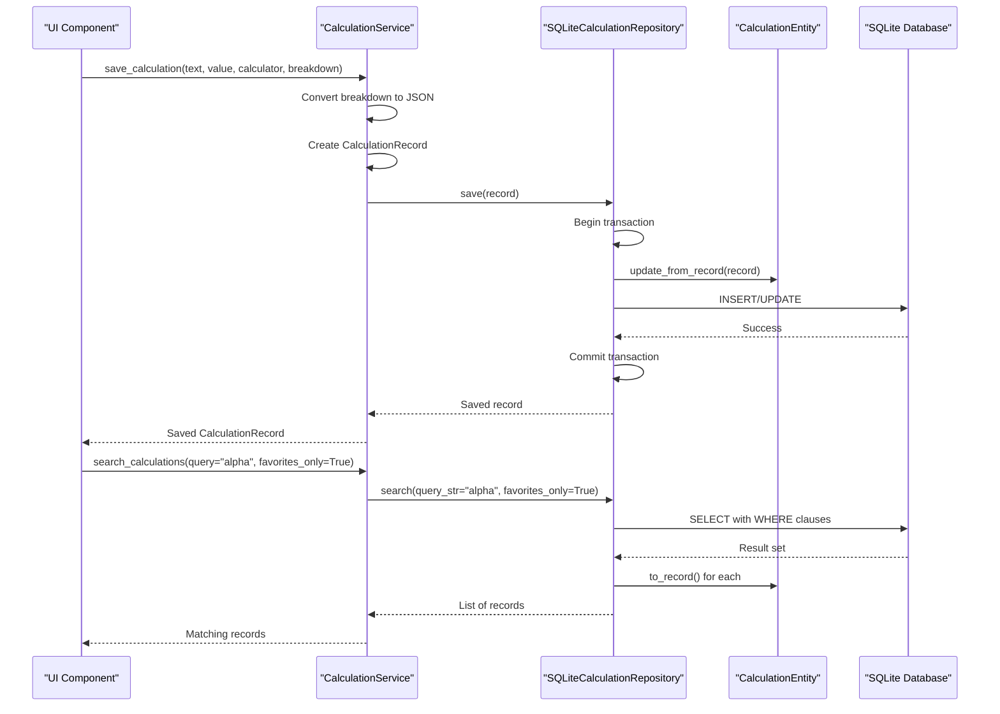
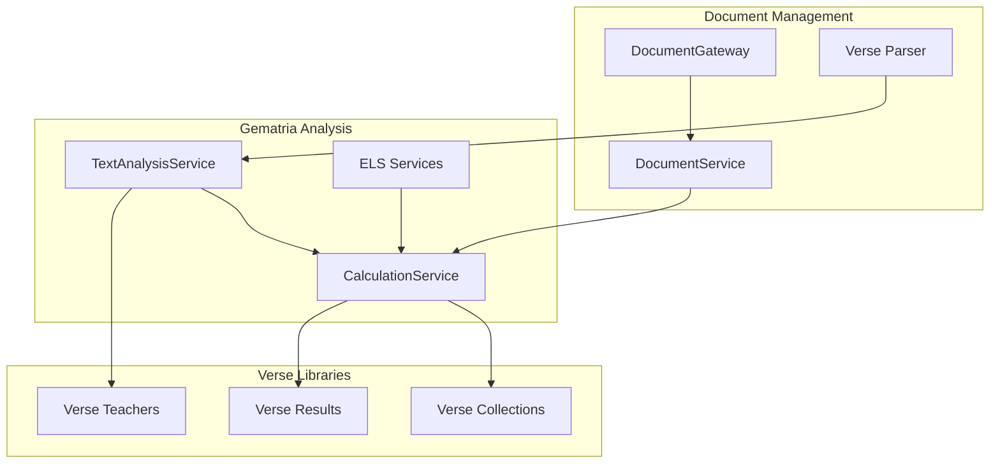
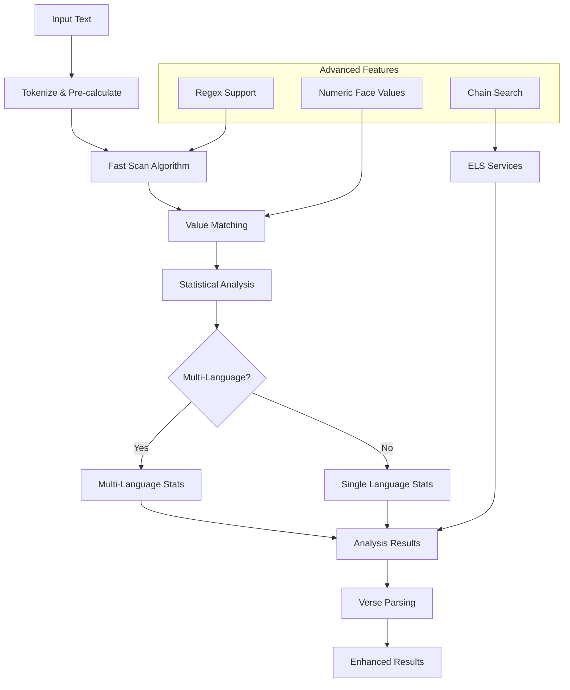
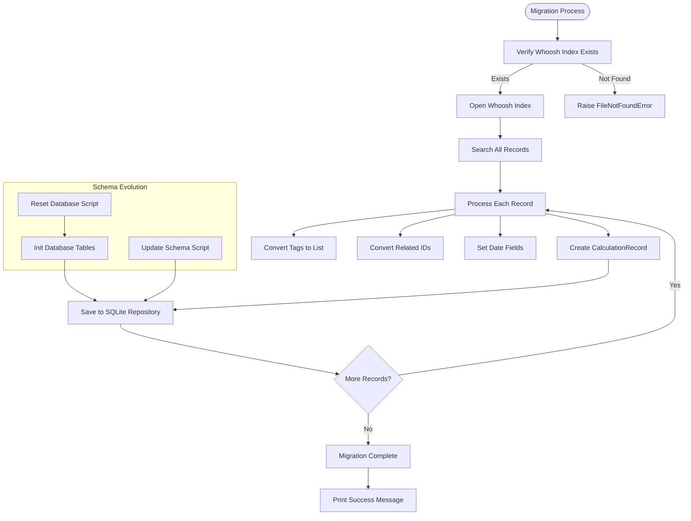

# Data Persistence and Repository

<cite>
**Referenced Files in This Document**
- [calculation_record.py](file://src/pillars/gematria/models/calculation_record.py)
- [calculation_entity.py](file://src/pillars/gematria/models/calculation_entity.py)
- [sqlite_calculation_repository.py](file://src/pillars/gematria/repositories/sqlite_calculation_repository.py)
- [calculation_service.py](file://src/pillars/gematria/services/calculation_service.py)
- [gematria.py](file://src/shared/models/gematria.py)
- [database.py](file://src/shared/database.py)
- [migrate_gematria_whoosh_to_sqlite.py](file://scripts/migrate_gematria_whoosh_to_sqlite.py)
- [update_db_schema.py](file://scripts/update_db_schema.py)
- [reset_database.py](file://scripts/reset_database.py)
- [document_service.py](file://src/pillars/gematria/services/document_service.py)
- [text_analysis_service.py](file://src/pillars/gematria/services/text_analysis_service.py)
- [verse_parser.py](file://src/pillars/gematria/utils/verse_parser.py)
- [document_gateway.py](file://src/pillars/gematria/services/document_gateway.py)
- [els_models.py](file://src/pillars/gematria/models/els_models.py)
</cite>

## Update Summary
**Changes Made**
- Added new section on Document Management and Verse Libraries integration
- Enhanced Repository Pattern Implementation with shared models architecture
- Updated SQLite Repository Details to reflect shared database models
- Added new section on Text Analysis and Data Flow Patterns
- Expanded Service Layer Integration to include document and ELS services
- Updated Database Migration documentation to cover new schema evolution patterns

## Table of Contents
1. [Introduction](#introduction)
2. [Shared Models Architecture](#shared-models-architecture)
3. [Data Model](#data-model)
4. [Repository Pattern Implementation](#repository-pattern-implementation)
5. [SQLite Repository Details](#sqlite-repository-details)
6. [Service Layer Integration](#service-layer-integration)
7. [Document Management and Verse Libraries](#document-management-and-verse-libraries)
8. [Text Analysis and Data Flow Patterns](#text-analysis-and-data-flow-patterns)
9. [Database Migration and Schema Evolution](#database-migration-and-schema-evolution)
10. [Conclusion](#conclusion)

## Introduction
The Data Persistence and Repository system in IsopGem implements a robust data storage solution using the Repository Pattern with SQLite as the primary storage mechanism. This system enables users to save, retrieve, search, and organize gematria calculations with rich metadata. The architecture separates concerns between data models, repository interfaces, and service logic, providing a clean abstraction layer over the underlying database. Originally using Whoosh for indexing, the system has migrated to SQLite with SQLAlchemy for improved data integrity, transaction management, and query capabilities. This documentation explains the implementation details, focusing on the CalculationRecord data model, repository pattern, and integration with the service layer. The system now includes comprehensive support for document management, verse libraries, and advanced text analysis workflows.

## Shared Models Architecture
The gematria system employs a shared models architecture to prevent circular dependencies and maintain pillar sovereignty. The core models are centralized in the shared models module, allowing multiple pillars to access the same data structures without tight coupling.

**Diagram sources**
- [gematria.py](file://src/shared/models/gematria.py#L24-L180)
- [calculation_record.py](file://src/pillars/gematria/models/calculation_record.py#L1-L7)
- [calculation_entity.py](file://src/pillars/gematria/models/calculation_entity.py#L1-L7)

**Section sources**
- [gematria.py](file://src/shared/models/gematria.py#L1-L180)
- [calculation_record.py](file://src/pillars/gematria/models/calculation_record.py#L1-L7)
- [calculation_entity.py](file://src/pillars/gematria/models/calculation_entity.py#L1-L7)

The shared models architecture provides several benefits:
- **Circular Dependency Prevention**: Multiple pillars can access the same models without creating import loops
- **Consistency**: All pillars use identical data structures, ensuring uniform behavior
- **Maintainability**: Changes to data models only need to be made in one location
- **Pillar Sovereignty**: Each pillar maintains its own service layer while sharing common data structures

## Data Model
The core of the persistence system is the CalculationRecord data model, which captures comprehensive information about gematria calculations. This model includes both calculation-specific data and extensive user metadata for organization and retrieval. The model has been moved to the shared models layer to support cross-pillar functionality.

**Diagram sources**
- [gematria.py](file://src/shared/models/gematria.py#L24-L180)

**Section sources**
- [gematria.py](file://src/shared/models/gematria.py#L24-L180)

The CalculationRecord class uses Python's dataclass decorator to define its structure with type hints for clarity. Key fields include:
- **Core calculation data**: text (the word/phrase calculated), value (the gematria result), language (e.g., "Hebrew (Standard)"), and method (e.g., "Standard Value")
- **Metadata**: id (unique identifier), date_created, and date_modified for tracking record lifecycle
- **Additional information**: notes (user annotations), source (reference material), and tags (searchable keywords)
- **Calculation details**: breakdown (JSON string of letter-value mappings), character_count, and normalized_text (cleaned version without diacritics)
- **User organization**: user_rating (0-5 stars), is_favorite (bookmark flag), category (user-defined grouping), and related_ids (connections to other calculations)

The CalculationEntity class serves as the database representation with proper SQLAlchemy column definitions, indexes, and constraints. The entity includes a normalized_hash field for efficient text searching and maintains JSON string representations for complex fields like tags and related_ids.

## Repository Pattern Implementation
The repository pattern is implemented through a clear separation between the abstract interface and concrete implementations. The CalculationRepository class provides the interface contract that the SQLite implementation follows, while the shared models ensure consistency across all repository implementations.

**Diagram sources**
- [sqlite_calculation_repository.py](file://src/pillars/gematria/repositories/sqlite_calculation_repository.py#L16-L222)
- [calculation_service.py](file://src/pillars/gematria/services/calculation_service.py#L11-L292)

**Section sources**
- [sqlite_calculation_repository.py](file://src/pillars/gematria/repositories/sqlite_calculation_repository.py#L16-L222)
- [calculation_service.py](file://src/pillars/gematria/services/calculation_service.py#L11-L292)

The repository abstracts data access operations, providing methods for CRUD operations and complex queries. Key features include:
- **Flexible search capabilities**: The search method supports multiple filter criteria including text queries, language, exact value, tags, and favorite status with different search modes (General, Exact, Regex, Wildcard)
- **Pagination**: Results can be paginated using the limit and page parameters
- **Performance optimization**: The summary_only parameter allows retrieval of lightweight records without full breakdown data
- **Transaction safety**: Operations use proper error handling with commit/rollback semantics
- **Search Modes**: Advanced search functionality with different matching strategies for precise control over query results

This interface enables the service layer to interact with data storage without knowledge of the underlying implementation, facilitating the migration from Whoosh to SQLite while maintaining compatibility.

## SQLite Repository Details
The SQLiteCalculationRepository provides a concrete implementation of the repository interface using SQLAlchemy ORM for database interactions. This implementation offers improved data integrity, transaction management, and query optimization compared to the previous Whoosh-based solution.

**Diagram sources**
- [sqlite_calculation_repository.py](file://src/pillars/gematria/repositories/sqlite_calculation_repository.py#L16-L222)
- [gematria.py](file://src/shared/models/gematria.py#L109-L180)

**Section sources**
- [sqlite_calculation_repository.py](file://src/pillars/gematria/repositories/sqlite_calculation_repository.py#L16-L222)
- [gematria.py](file://src/shared/models/gematria.py#L109-L180)

The implementation features:
- **SQLAlchemy ORM integration**: Uses the CalculationEntity model as the database representation, with proper column types, indexes, and constraints
- **Context manager pattern**: The `_session` method ensures proper transaction handling with automatic commit on success and rollback on exceptions
- **Efficient querying**: Uses SQLAlchemy's select construct with appropriate filtering and ordering (by date_modified descending)
- **Index optimization**: Database indexes on value, language, is_favorite, and normalized_hash fields enable fast queries
- **Lazy loading**: The CalculationEntity model converts to/from CalculationRecord only when needed, reducing memory overhead
- **Advanced search modes**: Supports multiple search strategies including exact matching, regex patterns, wildcard searches, and general contains queries

The repository handles the impedance mismatch between the domain model (CalculationRecord) and database model (CalculationEntity) through conversion methods (update_from_record and to_record), ensuring data consistency across the application layers.

## Service Layer Integration
The CalculationService integrates with the repository to provide business logic for managing calculations. This service layer abstracts the repository details from the application's UI components, providing a clean API for calculation management.

**Diagram sources**
- [calculation_service.py](file://src/pillars/gematria/services/calculation_service.py#L23-L78)
- [sqlite_calculation_repository.py](file://src/pillars/gematria/repositories/sqlite_calculation_repository.py#L44-L61)

**Section sources**
- [calculation_service.py](file://src/pillars/gematria/services/calculation_service.py#L11-L292)

Key integration points include:
- **Repository injection**: The service accepts a repository instance through dependency injection, enabling easy testing and potential swapping of implementations
- **Data transformation**: The service converts between domain objects and repository requirements, such as serializing the breakdown list to JSON
- **Business logic**: Implements features like toggle_favorite that combine retrieval, modification, and saving in a single atomic operation
- **Error handling**: Propagates repository exceptions while providing meaningful error context to the UI layer
- **Performance considerations**: Supports summary-only queries to reduce data transfer when full details aren't needed
- **Advanced features**: Includes sibling calculation detection and breakdown parsing utilities

The service layer also handles the conversion between the breakdown data structure (list of tuples) and its JSON representation, ensuring data integrity during storage and retrieval.

## Document Management and Verse Libraries
The gematria system integrates with the document management subsystem to provide comprehensive verse library support and analysis capabilities. This integration enables users to manage collections of documents alongside their gematria calculations.

**Diagram sources**
- [document_service.py](file://src/pillars/gematria/services/document_service.py#L8-L29)
- [document_gateway.py](file://src/pillars/gematria/services/document_gateway.py#L8-L17)
- [text_analysis_service.py](file://src/pillars/gematria/services/text_analysis_service.py#L275-L304)

**Section sources**
- [document_service.py](file://src/pillars/gematria/services/document_service.py#L1-L30)
- [document_gateway.py](file://src/pillars/gematria/services/document_gateway.py#L1-L17)
- [text_analysis_service.py](file://src/pillars/gematria/services/text_analysis_service.py#L275-L304)
- [verse_parser.py](file://src/pillars/gematria/utils/verse_parser.py#L1-L5)

The document management integration provides several key capabilities:
- **Document Retrieval**: The DocumentService abstracts document content access, providing clean APIs for UI components
- **Verse Parsing**: Advanced verse parsing capabilities support both local text parsing and document-based verse extraction
- **Verse Collections**: Integration with verse teacher services enables structured verse library management
- **Metadata Integration**: Documents can provide metadata that enhances gematria analysis results
- **Context-Aware Analysis**: Text analysis services can leverage document context for more accurate results

## Text Analysis and Data Flow Patterns
The TextAnalysisService implements sophisticated text analysis workflows that integrate with the calculation system and document management. This service provides advanced value matching, statistical analysis, and multi-language support.

**Diagram sources**
- [text_analysis_service.py](file://src/pillars/gematria/services/text_analysis_service.py#L20-L133)

**Section sources**
- [text_analysis_service.py](file://src/pillars/gematria/services/text_analysis_service.py#L1-L305)

The text analysis system includes several advanced patterns:
- **Fast Scan Algorithm**: Optimized sliding window approach for finding value matches in linear time
- **Multi-Language Support**: Automatic language detection and cipher selection for mixed-language texts
- **Statistical Analysis**: Comprehensive word and character counting with per-language breakdowns
- **Verse Integration**: Seamless integration with verse parsing for biblical and literary analysis
- **Advanced Search Modes**: Support for exact matching, regex patterns, and wildcard searches

The ELS (Equidistant Letter Sequence) models provide specialized data structures for advanced gematria research patterns, including chain searches and intervening letter analysis.

**Section sources**
- [els_models.py](file://src/pillars/gematria/models/els_models.py#L1-L116)

## Database Migration and Schema Evolution
The system includes comprehensive tools for database migration and schema evolution, addressing the transition from the legacy Whoosh storage to the current SQLite implementation.

**Diagram sources**
- [migrate_gematria_whoosh_to_sqlite.py](file://scripts/migrate_gematria_whoosh_to_sqlite.py#L1-L75)

**Section sources**
- [migrate_gematria_whoosh_to_sqlite.py](file://scripts/migrate_gematria_whoosh_to_sqlite.py#L1-L75)
- [update_db_schema.py](file://scripts/update_db_schema.py)
- [reset_database.py](file://scripts/reset_database.py)
- [database.py](file://src/shared/database.py)

The migration strategy includes:
- **Data migration script**: The migrate_gematria_whoosh_to_sqlite.py script transfers all existing calculations from Whoosh to SQLite, preserving all metadata and relationships
- **Schema evolution**: The update_db_schema.py script handles incremental database schema changes, allowing for non-destructive updates as new fields are added
- **Database initialization**: The init_db function in database.py creates all tables based on the SQLAlchemy models, ensuring the database structure matches the code definitions
- **Reset capabilities**: Scripts like reset_database.py provide safe mechanisms for database recreation during development or troubleshooting
- **Path management**: The system uses proper path resolution relative to the project root, avoiding issues with current working directory changes

The migration process demonstrates careful attention to data integrity, with proper error handling and transaction management to prevent partial migrations. The system also maintains backward compatibility by preserving the repository interface, allowing existing code to work with the new storage mechanism without modification.

## Conclusion
The Data Persistence and Repository system in IsopGem provides a robust foundation for storing and managing gematria calculations. By implementing the Repository Pattern with SQLite and SQLAlchemy, the system offers reliable data storage with efficient querying capabilities. The CalculationRecord data model captures comprehensive information about calculations, including rich metadata for organization and retrieval. The clear separation between the service layer, repository interface, and database implementation enables maintainable code and facilitates future enhancements. 

The shared models architecture prevents circular dependencies while maintaining consistency across multiple pillars. The integration with document management and verse libraries extends the system's capabilities beyond simple calculations to comprehensive text analysis and library management. Advanced text analysis services provide sophisticated algorithms for value matching, statistical analysis, and multi-language support.

Migration tools ensure data continuity from the previous storage system, while the architecture supports ongoing schema evolution. The system balances accessibility for beginners with technical depth for experienced developers, providing a solid foundation for the application's data management needs. The addition of ELS models and advanced search capabilities positions the system for future expansion in specialized gematria research applications.