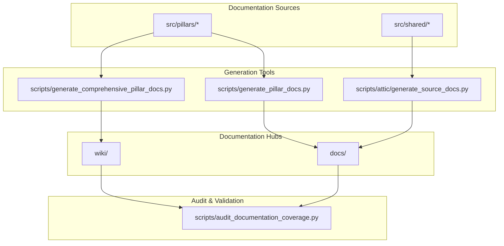
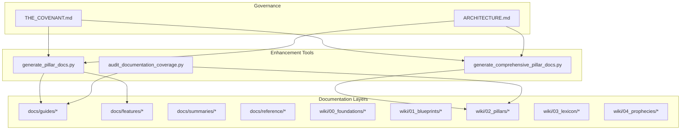
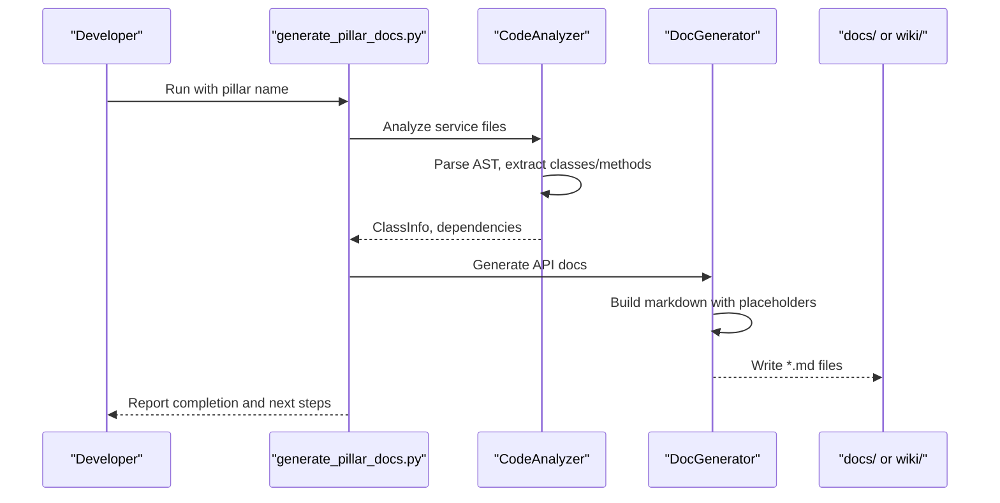
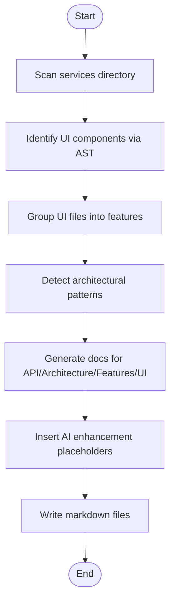
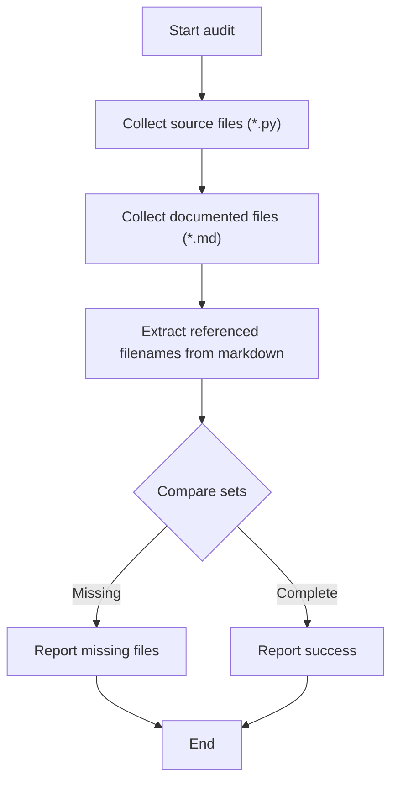
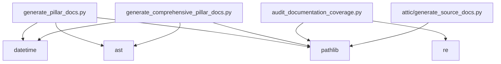

# Documentation Enhancement System

<cite>
**Referenced Files in This Document**
- [README.md](file://README.md)
- [docs/README.md](file://docs/README.md)
- [wiki/Home.md](file://wiki/Home.md)
- [wiki/_Sidebar.md](file://wiki/_Sidebar.md)
- [wiki/00_foundations/THE_COVENANT.md](file://wiki/00_foundations/THE_COVENANT.md)
- [wiki/01_blueprints/ARCHITECTURE.md](file://wiki/01_blueprints/ARCHITECTURE.md)
- [docs/guides/COMPREHENSIVE_ETYMOLOGY_SETUP.md](file://docs/guides/COMPREHENSIVE_ETYMOLOGY_SETUP.md)
- [docs/guides/ERROR_HANDLING_CHEATSHEET.md](file://docs/guides/ERROR_HANDLING_CHEATSHEET.md)
- [scripts/generate_pillar_docs.py](file://scripts/generate_pillar_docs.py)
- [scripts/generate_comprehensive_pillar_docs.py](file://scripts/generate_comprehensive_pillar_docs.py)
- [scripts/audit_documentation_coverage.py](file://scripts/audit_documentation_coverage.py)
- [scripts/attic/generate_source_docs.py](file://scripts/attic/generate_source_docs.py)
</cite>

## Table of Contents
1. [Introduction](#introduction)
2. [Project Structure](#project-structure)
3. [Core Components](#core-components)
4. [Architecture Overview](#architecture-overview)
5. [Detailed Component Analysis](#detailed-component-analysis)
6. [Dependency Analysis](#dependency-analysis)
7. [Performance Considerations](#performance-considerations)
8. [Troubleshooting Guide](#troubleshooting-guide)
9. [Conclusion](#conclusion)

## Introduction
This document describes the Documentation Enhancement System for IsopGem, a unified esoteric research platform. The system encompasses automated documentation generation, coverage auditing, and structured documentation architecture aligned with the project's Covenant and Blueprint principles. It provides a framework for maintaining high-quality, AI-assisted documentation across 10 sovereign pillars, ensuring architectural integrity, developer productivity, and long-term maintainability.

## Project Structure
The documentation ecosystem is organized into complementary layers:
- **Automated Generators**: Scripts that analyze source code and produce structured markdown skeletons with AI enhancement placeholders.
- **Coverage Audit**: A validator that compares source files against documented files to identify gaps.
- **Documentation Hubs**: Centralized wikis and docs directories that categorize content by purpose and audience.
- **Covenant & Blueprints**: Foundational governance and architectural principles that guide documentation standards.

**Diagram sources**
- [scripts/generate_pillar_docs.py](file://scripts/generate_pillar_docs.py#L505-L596)
- [scripts/generate_comprehensive_pillar_docs.py](file://scripts/generate_comprehensive_pillar_docs.py#L782-L800)
- [scripts/audit_documentation_coverage.py](file://scripts/audit_documentation_coverage.py#L1-L46)
- [docs/README.md](file://docs/README.md#L1-L82)

**Section sources**
- [README.md](file://README.md#L577-L629)
- [docs/README.md](file://docs/README.md#L1-L82)
- [wiki/Home.md](file://wiki/Home.md#L1-L131)

## Core Components
The Documentation Enhancement System comprises three pillars:

### 1. Automated Documentation Generators
- **generate_pillar_docs.py**: Creates API reference documentation for services, including class overviews, method signatures, dependencies, and AI-assisted enhancement placeholders. It generates INDEX.md and organizes output under api/, architecture/, features/, and ui_components/.
- **generate_comprehensive_pillar_docs.py**: Extends the basic generator to include architecture pattern docs, feature specifications, and UI component documentation. It identifies UI components, user-facing features, and architectural patterns via AST analysis.
- **attic/generate_source_docs.py**: Legacy source documentation generator that analyzes arbitrary Python files and produces categorized markdown summaries.

Key capabilities:
- AST-based extraction of classes, methods, docstrings, and decorators
- Dependency discovery from import statements
- Structured markdown templates with AI enhancement markers
- Consistent formatting and citation blocks

**Section sources**
- [scripts/generate_pillar_docs.py](file://scripts/generate_pillar_docs.py#L1-L596)
- [scripts/generate_comprehensive_pillar_docs.py](file://scripts/generate_comprehensive_pillar_docs.py#L1-L800)
- [scripts/attic/generate_source_docs.py](file://scripts/attic/generate_source_docs.py#L1-L294)

### 2. Coverage Audit System
- **audit_documentation_coverage.py**: Compares actual source files against documented files by scanning wiki and docs directories. It identifies missing documentation for source files and prints a summary report.

Operational flow:
- Walks src/pillars to collect source filenames
- Walks wiki and docs to extract referenced filenames from markdown
- Computes difference to highlight missing files
- Outputs counts and missing filenames for prioritization

**Section sources**
- [scripts/audit_documentation_coverage.py](file://scripts/audit_documentation_coverage.py#L1-L46)

### 3. Documentation Hubs and Governance
- **docs/**: Organized by purpose (guides, features, summaries, reference) with quick links and navigation.
- **wiki/**: The Akaschic Archive containing Foundations, Blueprints, Grimoires (per pillar), Lexicon, and Prophecies.
- **Covenant & Blueprints**: Define architectural laws, separation of concerns, and documentation standards that generators enforce.

**Section sources**
- [docs/README.md](file://docs/README.md#L1-L82)
- [wiki/Home.md](file://wiki/Home.md#L1-L131)
- [wiki/_Sidebar.md](file://wiki/_Sidebar.md#L1-L33)
- [wiki/00_foundations/THE_COVENANT.md](file://wiki/00_foundations/THE_COVENANT.md#L1-L86)
- [wiki/01_blueprints/ARCHITECTURE.md](file://wiki/01_blueprints/ARCHITECTURE.md#L1-L161)

## Architecture Overview
The Documentation Enhancement System adheres to IsopGem's architectural principles:

**Diagram sources**
- [wiki/00_foundations/THE_COVENANT.md](file://wiki/00_foundations/THE_COVENANT.md#L1-L86)
- [wiki/01_blueprints/ARCHITECTURE.md](file://wiki/01_blueprints/ARCHITECTURE.md#L1-L161)
- [scripts/generate_pillar_docs.py](file://scripts/generate_pillar_docs.py#L505-L596)
- [scripts/generate_comprehensive_pillar_docs.py](file://scripts/generate_comprehensive_pillar_docs.py#L782-L800)
- [scripts/audit_documentation_coverage.py](file://scripts/audit_documentation_coverage.py#L1-L46)

## Detailed Component Analysis

### Automated Documentation Generator (Basic)
The basic generator extracts code structure and produces API reference documentation:

Key features:
- AST parsing for class and method extraction
- Signature and parameter analysis
- Dependency discovery from imports
- AI enhancement placeholders for architecture, features, and UI components
- Consistent citation blocks and cross-references

**Diagram sources**
- [scripts/generate_pillar_docs.py](file://scripts/generate_pillar_docs.py#L65-L195)
- [scripts/generate_pillar_docs.py](file://scripts/generate_pillar_docs.py#L197-L318)
- [scripts/generate_pillar_docs.py](file://scripts/generate_pillar_docs.py#L505-L596)

**Section sources**
- [scripts/generate_pillar_docs.py](file://scripts/generate_pillar_docs.py#L1-L596)

### Comprehensive Documentation Generator
The comprehensive generator extends the basic generator to cover architecture, features, and UI components:

Capabilities:
- UI component analysis (signals, slots, widget usage)
- Feature identification by filename patterns
- Architecture pattern detection (strategy, adapter, MVC)
- Mermaid diagrams and sequence flows
- Extension points for AI enhancement

**Diagram sources**
- [scripts/generate_comprehensive_pillar_docs.py](file://scripts/generate_comprehensive_pillar_docs.py#L59-L267)
- [scripts/generate_comprehensive_pillar_docs.py](file://scripts/generate_comprehensive_pillar_docs.py#L270-L780)

**Section sources**
- [scripts/generate_comprehensive_pillar_docs.py](file://scripts/generate_comprehensive_pillar_docs.py#L1-L800)

### Coverage Audit Tool
The audit tool ensures documentation completeness:

**Diagram sources**
- [scripts/audit_documentation_coverage.py](file://scripts/audit_documentation_coverage.py#L1-L46)

**Section sources**
- [scripts/audit_documentation_coverage.py](file://scripts/audit_documentation_coverage.py#L1-L46)

### Documentation Hubs and Governance
- **docs/**: Organized by purpose with quick navigation and purpose-driven structure.
- **wiki/**: Hierarchical organization by halls (Foundations, Blueprints, Grimoires, Lexicon, Prophecies) with cross-references.
- **Covenant & Blueprints**: Define architectural laws and separation of concerns that generators enforce.

**Section sources**
- [docs/README.md](file://docs/README.md#L1-L82)
- [wiki/Home.md](file://wiki/Home.md#L1-L131)
- [wiki/_Sidebar.md](file://wiki/_Sidebar.md#L1-L33)
- [wiki/00_foundations/THE_COVENANT.md](file://wiki/00_foundations/THE_COVENANT.md#L1-L86)
- [wiki/01_blueprints/ARCHITECTURE.md](file://wiki/01_blueprints/ARCHITECTURE.md#L1-L161)

## Dependency Analysis
The documentation system has minimal runtime dependencies and relies on standard Python libraries:

**Diagram sources**
- [scripts/generate_pillar_docs.py](file://scripts/generate_pillar_docs.py#L18-L26)
- [scripts/generate_comprehensive_pillar_docs.py](file://scripts/generate_comprehensive_pillar_docs.py#L16-L24)
- [scripts/audit_documentation_coverage.py](file://scripts/audit_documentation_coverage.py#L1-L4)
- [scripts/attic/generate_source_docs.py](file://scripts/attic/generate_source_docs.py#L1-L4)

**Section sources**
- [scripts/generate_pillar_docs.py](file://scripts/generate_pillar_docs.py#L1-L50)
- [scripts/generate_comprehensive_pillar_docs.py](file://scripts/generate_comprehensive_pillar_docs.py#L1-L30)
- [scripts/audit_documentation_coverage.py](file://scripts/audit_documentation_coverage.py#L1-L10)
- [scripts/attic/generate_source_docs.py](file://scripts/attic/generate_source_docs.py#L1-L10)

## Performance Considerations
- **AST Parsing**: Both generators use Python's AST module for efficient code analysis. For large codebases, consider batching or limiting recursion depth.
- **File I/O**: The audit tool reads all markdown files to extract referenced filenames. For very large documentation sets, optimize regex patterns and consider caching.
- **Memory Efficiency**: The comprehensive generator stores UI components and features in memory; for extremely large projects, process files incrementally.
- **Scalability**: The system scales with the number of source files. Parallel processing of file analysis can improve throughput.

## Troubleshooting Guide
Common issues and resolutions:

- **Missing Documentation Gaps**:
  - Use the audit tool to identify missing files and prioritize documentation updates.
  - Focus on high-impact services and frequently used UI components.

- **Generator Failures**:
  - Verify Python 3.11+ compatibility and required modules.
  - Check for syntax errors in source files that may break AST parsing.

- **Coverage Mismatches**:
  - Ensure markdown references use the correct filename format.
  - Confirm that generated files are placed in the expected output directories.

- **Covenant Compliance**:
  - Review architectural laws and separation of concerns to maintain documentation standards.
  - Use the audit tool to detect documentation that violates project principles.

**Section sources**
- [scripts/audit_documentation_coverage.py](file://scripts/audit_documentation_coverage.py#L1-L46)
- [wiki/00_foundations/THE_COVENANT.md](file://wiki/00_foundations/THE_COVENANT.md#L1-L86)
- [wiki/01_blueprints/ARCHITECTURE.md](file://wiki/01_blueprints/ARCHITECTURE.md#L137-L161)

## Conclusion
The Documentation Enhancement System provides a robust, AI-assisted framework for maintaining high-quality documentation across IsopGem's 10 sovereign pillars. By combining automated generators, coverage auditing, and governance-aligned hubs, it ensures architectural integrity, developer productivity, and long-term maintainability. The system's modular design and adherence to the Covenant and Blueprints principles make it adaptable to evolving project needs while preserving the Temple's foundational values.