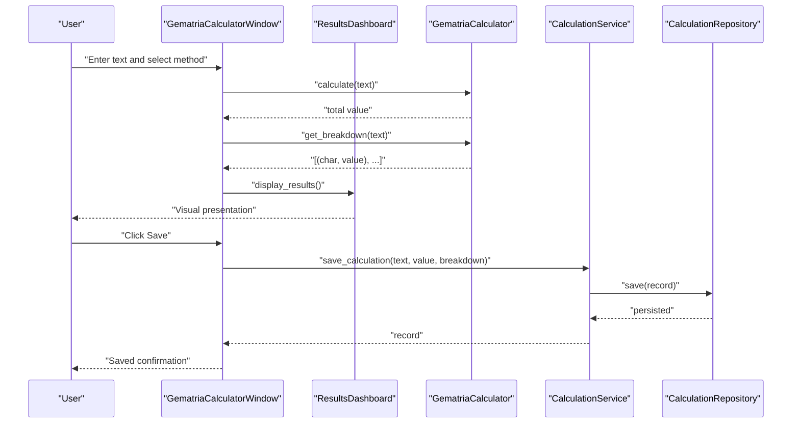
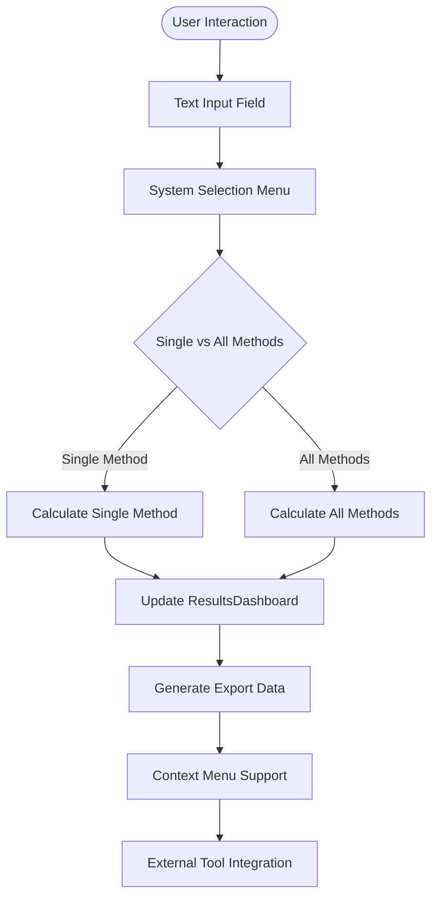
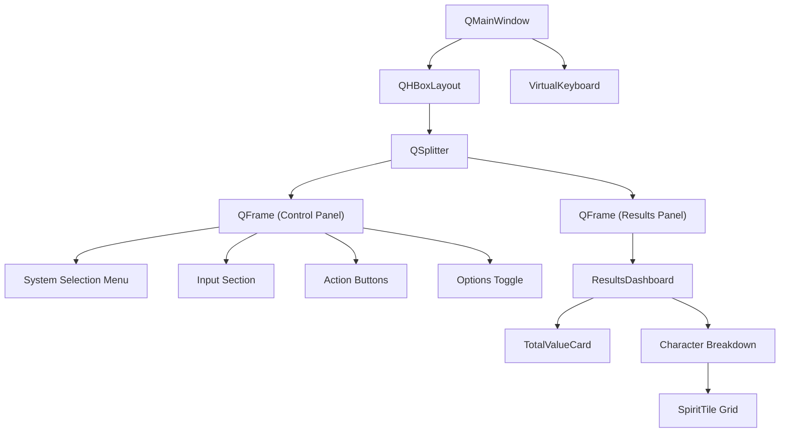
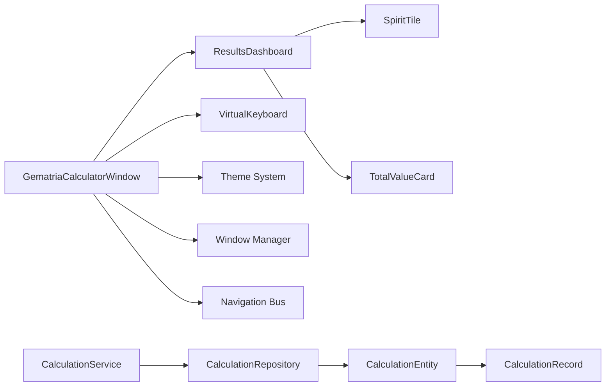

# Gematria Calculator

<cite>
**Referenced Files in This Document**
- [gematria_calculator_window.py](file://src/pillars/gematria/ui/gematria_calculator_window.py)
- [gematria_hub.py](file://src/pillars/gematria/ui/gematria_hub.py)
- [components.py](file://src/pillars/gematria/ui/components.py)
- [virtual_keyboard.py](file://src/shared/ui/virtual_keyboard.py)
- [keyboard_layouts.py](file://src/shared/ui/keyboard_layouts.py)
- [base_calculator.py](file://src/shared/services/gematria/base_calculator.py)
- [hebrew_calculator.py](file://src/pillars/gematria/services/hebrew_calculator.py)
- [greek_calculator.py](file://src/pillars/gematria/services/greek_calculator.py)
- [tq_calculator.py](file://src/pillars/gematria/services/tq_calculator.py)
- [calculation_service.py](file://src/pillars/gematria/services/calculation_service.py)
- [calculation_entity.py](file://src/pillars/gematria/models/calculation_entity.py)
- [calculation_record.py](file://src/pillars/gematria/models/calculation_record.py)
- [calculation_repository.py](file://src/pillars/gematria/repositories/calculation_repository.py)
- [calculator_window.md](file://wiki/02_pillars/gematria/ui_components/calculator_window.md)
</cite>

## Update Summary
**Changes Made**
- Enhanced UI component hierarchy documentation with detailed component analysis
- Added comprehensive state management section covering current calculation tracking
- Expanded keyboard shortcuts documentation with virtual keyboard integration
- Added visual design specifications for Hebrew and Greek letter-value assignments
- Updated integration points with ResultsDashboard and signal connections
- Enhanced troubleshooting guide with new UI-related issues
- Added documentation for the new card-based design system with tablet shadows
- Updated to include advanced export capabilities and external tool integration
- Documented the sophisticated calculator interface with responsive layout features

## Table of Contents
1. [Introduction](#introduction)
2. [Project Structure](#project-structure)
3. [Core Components](#core-components)
4. [Architecture Overview](#architecture-overview)
5. [Detailed Component Analysis](#detailed-component-analysis)
6. [UI Component Hierarchy](#ui-component-hierarchy)
7. [State Management](#state-management)
8. [Keyboard Shortcuts and Virtual Keyboard](#keyboard-shortcuts-and-virtual-keyboard)
9. [Visual Design Specifications](#visual-design-specifications)
10. [Integration Points](#integration-points)
11. [Dependency Analysis](#dependency-analysis)
12. [Performance Considerations](#performance-considerations)
13. [Troubleshooting Guide](#troubleshooting-guide)
14. [Conclusion](#conclusion)
15. [Appendices](#appendices)

## Introduction
This document explains the Gematria Calculator component as the primary interface for performing Hebrew, Greek, and English (TQ) gematria calculations. It details the enhanced calculator window implementation with comprehensive UI component hierarchy, state management, keyboard shortcuts, and visual design specifications for Hebrew and Greek letter-value assignments. The document covers the Strategy Pattern implementation where each calculator type inherits from the base GematriaCalculator abstract class and implements the calculate() method, along with the integration between calculator instances and the CalculationService for saving results.

The calculator window features a sophisticated card-based design system with tablet shadows, responsive layout capabilities, and advanced export functionalities that integrate seamlessly with external tools like the Emerald Tablet, RTF Editor, and MindScape.

## Project Structure
The Gematria Calculator spans UI, services, models, and repositories with enhanced component architecture:
- UI: GematriaCalculatorWindow orchestrates user input, method selection, and results display with sophisticated component hierarchy
- Services: Strategy Pattern calculators (Hebrew, Greek, TQ) inherit from GematriaCalculator
- Models: CalculationRecord and CalculationEntity define persisted data
- Repositories: CalculationRepository persists and searches records using Whoosh
- Integration: CalculationService coordinates saving and metadata management
- Components: ResultsDashboard, SpiritTile, and TotalValueCard provide enhanced visualization

```mermaid
graph TB
subgraph "Enhanced UI Architecture"
GCW["GematriaCalculatorWindow"]
RD["ResultsDashboard"]
ST["SpiritTile"]
TVC["TotalValueCard"]
VK["VirtualKeyboard"]
TB["Tablet Shadow Effects"]
END
subgraph "Services"
BC["GematriaCalculator (abstract)"]
HC["Hebrew calculators"]
GrC["Greek calculators"]
TQC["TQ calculators"]
END
subgraph "Models"
CR["CalculationRecord"]
CE["CalculationEntity"]
END
subgraph "Repositories"
Repo["CalculationRepository (Whoosh)"]
END
GCW --> RD
RD --> ST
RD --> TVC
GCW --> VK
GCW --> BC
GCW --> TQC
GCW --> HC
GCW --> GrC
GCW --> CS["CalculationService"]
CS --> Repo
Repo --> CE
CE --> CR
GCW --> TB
```

**Diagram sources**
- [gematria_calculator_window.py](file://src/pillars/gematria/ui/gematria_calculator_window.py#L26-L778)
- [components.py](file://src/pillars/gematria/ui/components.py#L12-L302)
- [virtual_keyboard.py](file://src/shared/ui/virtual_keyboard.py#L47-L183)
- [base_calculator.py](file://src/shared/services/gematria/base_calculator.py#L1-L115)
- [hebrew_calculator.py](file://src/pillars/gematria/services/hebrew_calculator.py#L1-L800)
- [greek_calculator.py](file://src/pillars/gematria/services/greek_calculator.py#L1-L888)
- [tq_calculator.py](file://src/pillars/gematria/services/tq_calculator.py#L1-L381)
- [calculation_service.py](file://src/pillars/gematria/services/calculation_service.py#L1-L292)
- [calculation_entity.py](file://src/pillars/gematria/models/calculation_entity.py#L1-L92)
- [calculation_repository.py](file://src/pillars/gematria/repositories/calculation_repository.py#L1-L329)

**Section sources**
- [gematria_calculator_window.py](file://src/pillars/gematria/ui/gematria_calculator_window.py#L1-L778)
- [gematria_hub.py](file://src/pillars/gematria/ui/gematria_hub.py#L1-L533)
- [components.py](file://src/pillars/gematria/ui/components.py#L1-L302)

## Core Components
- **GematriaCalculatorWindow**: Enhanced standalone calculator with sophisticated UI composition, state management, and integration capabilities
- **ResultsDashboard**: Centralized display component managing total value cards, character breakdown tiles, and comparison tables
- **SpiritTile**: Individual character display widget with hover effects and shadow enhancements
- **TotalValueCard**: Prominent total value display with gradient background and context menu support
- **VirtualKeyboard**: Language-specific keyboard integration with Hebrew and Greek layouts
- **GematriaCalculator (abstract)**: Defines the Strategy contract with normalize_text(), calculate(), get_letter_value(), and get_breakdown()
- **Concrete calculators**: Hebrew, Greek, TQ calculators with comprehensive method implementations
- **CalculationService**: Enhanced persistence layer with Whoosh integration and metadata management
- **CalculationRepository**: Advanced Whoosh-backed persistence with search capabilities

**Section sources**
- [gematria_calculator_window.py](file://src/pillars/gematria/ui/gematria_calculator_window.py#L26-L778)
- [components.py](file://src/pillars/gematria/ui/components.py#L12-L302)
- [virtual_keyboard.py](file://src/shared/ui/virtual_keyboard.py#L47-L183)
- [base_calculator.py](file://src/shared/services/gematria/base_calculator.py#L1-L115)
- [hebrew_calculator.py](file://src/pillars/gematria/services/hebrew_calculator.py#L1-L800)
- [greek_calculator.py](file://src/pillars/gematria/services/greek_calculator.py#L1-L888)
- [tq_calculator.py](file://src/pillars/gematria/services/tq_calculator.py#L1-L381)
- [calculation_service.py](file://src/pillars/gematria/services/calculation_service.py#L1-L292)
- [calculation_repository.py](file://src/pillars/gematria/repositories/calculation_repository.py#L1-L329)

## Architecture Overview
The enhanced calculator UI composes a sophisticated set of calculator instances with comprehensive state management and delegate calculation to the selected strategy. The ResultsDashboard serves as the central coordinator for all visual presentations, while the VirtualKeyboard provides language-specific input capabilities. Results are formatted and optionally saved via CalculationService, which persists records using CalculationRepository.



**Diagram sources**
- [gematria_calculator_window.py](file://src/pillars/gematria/ui/gematria_calculator_window.py#L448-L573)
- [components.py](file://src/pillars/gematria/ui/components.py#L193-L302)
- [calculation_service.py](file://src/pillars/gematria/services/calculation_service.py#L23-L79)
- [calculation_repository.py](file://src/pillars/gematria/repositories/calculation_repository.py#L67-L117)

## Detailed Component Analysis

### Strategy Pattern: GematriaCalculator and Concrete Implementations
The base calculator defines a comprehensive contract for all gematria calculation methods:
- **name**: Human-readable calculator name for UI display
- **normalize_text(text)**: Removes diacritical marks and accents for consistent comparison
- **calculate(text)**: Computes total value using the specific mapping algorithm
- **get_letter_value(char)**: Lookup single character value from language-specific mapping
- **get_breakdown(text)**: Returns ordered list of (char, value) tuples for detailed display

Concrete calculator implementations cover comprehensive calculation methods:
- **Hebrew calculators**: Standard, Sofit, Letter Value, Ordinal, Small Value, AtBash, Albam, Kolel, Square, Cube, Triangular, Integral Reduced, Ordinal Square, Full Value
- **Greek calculators**: Standard Isopsephy, Letter Value, Ordinal, Small Value, Kolel, Square, Cube, Triangular, Digital, Ordinal Square, Full Value, Reverse Substitution, Pair Matching, Next Letter
- **TQ calculators**: Standard, Reduced (digital root), Square, Triangular, Position (positional weighting)

**Section sources**
- [base_calculator.py](file://src/shared/services/gematria/base_calculator.py#L1-L115)
- [hebrew_calculator.py](file://src/pillars/gematria/services/hebrew_calculator.py#L1-L800)
- [greek_calculator.py](file://src/pillars/gematria/services/greek_calculator.py#L1-L888)
- [tq_calculator.py](file://src/pillars/gematria/services/tq_calculator.py#L1-L381)

### Enhanced UI: GematriaCalculatorWindow
The enhanced calculator window provides sophisticated user interaction with comprehensive state management:

**Core Responsibilities:**
- **Nested menu system** for Hebrew, Greek, English/TQ, Arabic, and Sanskrit calculators
- **"All Methods" mode** per language for comparative analysis
- **Real-time calculation** with immediate visual feedback
- **Virtual keyboard integration** with language-specific layouts
- **Context menu support** for result export and external integrations
- **State persistence** for current calculations and export data

**Advanced Features:**
- **Multi-language keyboard support** with Hebrew and Greek layouts
- **Dynamic UI theming** with tablet shadows and architectural styling
- **Export data management** for seamless integration with other tools
- **Window manager integration** for persistent window management
- **Responsive layout** with QSplitter for resizable panels
- **Background pattern integration** with configurable visual themes



**Diagram sources**
- [gematria_calculator_window.py](file://src/pillars/gematria/ui/gematria_calculator_window.py#L390-L554)

**Section sources**
- [gematria_calculator_window.py](file://src/pillars/gematria/ui/gematria_calculator_window.py#L26-L778)
- [gematria_hub.py](file://src/pillars/gematria/ui/gematria_hub.py#L249-L308)

### ResultsDashboard: Centralized Visualization
The ResultsDashboard serves as the central coordinator for all visual presentations:

**Components:**
- **TotalValueCard**: Prominent display of calculated values with gradient backgrounds
- **SpiritTile**: Individual character display with hover effects and shadow enhancements
- **Comparison Tables**: Structured presentation for multi-method analysis
- **Scrollable Layouts**: Responsive design for various content types

**Features:**
- **Dynamic content loading** based on calculation type
- **Context menu integration** for external tool access
- **Responsive grid layout** for character breakdown visualization
- **Export data formatting** for seamless integration

**Section sources**
- [components.py](file://src/pillars/gematria/ui/components.py#L12-L302)

## UI Component Hierarchy
The enhanced calculator implements a sophisticated component hierarchy with clear separation of concerns:

**Level 0: Application Container**
- QMainWindow serving as the root container
- Central widget with background pattern support
- Window manager integration for persistent management

**Level 1: Main Layout Structure**
- QHBoxLayout containing two panels: Control Panel and Results Panel
- QSplitter for resizable panel management
- Tablet-style styling with shadows and borders

**Level 2: Control Panel Components**
- System Selection Menu with nested submenus
- Input Section with virtual keyboard toggle
- Action buttons (Calculate, Save)
- Options toggle for character breakdown

**Level 3: Results Panel Components**
- ResultsDashboard as the central display component
- SpiritTile widgets for individual character display
- TotalValueCard for prominent value presentation
- Scrollable containers for responsive layouts

**Level 4: Specialized Components**
- VirtualKeyboard with language-specific layouts
- Context menu system for external integrations
- Theme integration with architectural styling
- Tablet shadow effects for depth perception



**Diagram sources**
- [gematria_calculator_window.py](file://src/pillars/gematria/ui/gematria_calculator_window.py#L60-L389)
- [components.py](file://src/pillars/gematria/ui/components.py#L152-L302)

**Section sources**
- [gematria_calculator_window.py](file://src/pillars/gematria/ui/gematria_calculator_window.py#L60-L389)
- [components.py](file://src/pillars/gematria/ui/components.py#L152-L302)

## State Management
The enhanced calculator implements comprehensive state management for calculation tracking and persistence:

**Current Calculation Tracking:**
- `current_text`: Stores the last processed text input
- `current_value`: Stores the calculated numeric value
- `current_breakdown`: Stores detailed character-by-character breakdown
- `last_export_data`: Stores formatted data for export operations

**Mode Management:**
- `current_calculator`: Currently selected calculator instance
- `_current_language`: Active language for "All Methods" mode
- `keyboard_visible`: Virtual keyboard visibility state

**UI State:**
- `system_button`: Dynamic button text reflecting current selection
- `save_button`: Enabled/disabled state based on calculation validity
- `show_breakdown_toggle`: User preference for character breakdown display

**Persistence Integration:**
- Automatic export data generation for external tool integration
- Seamless integration with CalculationService for database persistence
- Context menu support for selective external tool access

**Section sources**
- [gematria_calculator_window.py](file://src/pillars/gematria/ui/gematria_calculator_window.py#L29-L58)
- [gematria_calculator_window.py](file://src/pillars/gematria/ui/gematria_calculator_window.py#L448-L554)

## Keyboard Shortcuts and Virtual Keyboard
The enhanced calculator provides comprehensive keyboard integration with language-specific layouts:

**Virtual Keyboard Features:**
- **Language-specific layouts** for Hebrew, Greek, Arabic, and Sanskrit
- **Toggle integration** with system selection for automatic layout switching
- **Positioning intelligence** that follows target input fields
- **Styling integration** with the overall architectural theme

**Keyboard Layout Specifications:**
- **Hebrew Layout**: Traditional Aleph-Bet arrangement with final letter forms
- **Greek Layout**: Standard Greek alphabet with proper diacritical positioning
- **Arabic Layout**: Right-to-left arrangement suitable for Arabic script
- **Sanskrit Layout**: Devanagari script with proper vowel signs

**Integration Patterns:**
- Automatic layout switching based on calculator selection
- Context-aware positioning relative to input fields
- Seamless integration with existing text input mechanisms
- Support for both direct keyboard input and virtual keyboard interaction

**Section sources**
- [gematria_calculator_window.py](file://src/pillars/gematria/ui/gematria_calculator_window.py#L317-L447)
- [virtual_keyboard.py](file://src/shared/ui/virtual_keyboard.py#L47-L183)
- [keyboard_layouts.py](file://src/shared/ui/keyboard_layouts.py#L39-L94)

## Visual Design Specifications
The enhanced calculator implements a comprehensive visual design system with architectural themes:

**Color Palette Integration:**
- **Void Slate (#0f172a)**: Primary background for dark mode interface
- **Stone (#1e293b)**: Secondary background for panels and containers
- **Cloud (#f8fafc)**: High contrast text and highlights
- **Mist (#94a3b8)**: Subtle text and secondary elements
- **Focus (#3b82f6)**: Accent color for interactive elements
- **Ash (#334155)**: Border and divider colors

**Typography System:**
- **Primary Font**: Inter font family for modern, clean typography
- **Header Styles**: Progressive sizing from 28pt for main titles to 10pt for subtitles
- **Weight Variations**: 500-900 weights for visual hierarchy
- **Letter Spacing**: Strategic spacing for readability and architectural feel

**Component Styling:**
- **Tablet Shadows**: Drop shadow effects for depth perception
- **Gradient Backgrounds**: Subtle gradients for visual interest
- **Border Radius**: Consistent 12-24px radius for modern aesthetic
- **Hover Effects**: Smooth transitions for interactive elements

**Character Breakdown Visualization:**
- **SpiritTile Design**: 75x100 pixel tiles with centered character and value
- **Grid Layout**: 8-column responsive grid for optimal character display
- **Hover Effects**: Blue border enhancement with shadow effects
- **Value Display**: Hieroglyphic-inspired typography for numerical values

**Section sources**
- [gematria_calculator_window.py](file://src/pillars/gematria/ui/gematria_calculator_window.py#L16-L23)
- [components.py](file://src/pillars/gematria/ui/components.py#L30-L151)

## Integration Points
The enhanced calculator provides comprehensive integration with the broader system architecture:

**Service Layer Integration:**
```python
class GematriaCalculatorWindow:
    def __init__(self, calculators: List[GematriaCalculator], window_manager: WindowManager):
        self.window_manager = window_manager
        self.calculation_service = CalculationService()
        self.calculators = self._initialize_calculators()
```

**Signal Connections:**
- Internal signals: textChanged, clicked, toggled for UI responsiveness
- External signals: navigation_bus for window management integration
- Context menu signals: customContextMenuRequested for result export

**Window Manager Integration:**
- Persistent window registration with key-based lookup
- Lifecycle management through show/hide/close operations
- Integration with other system windows for data exchange

**External Tool Integration:**
- Emerald Tablet integration for data import/export
- MindScape integration for note creation and page insertion
- RTF Editor integration for formatted result export
- Quadset Analysis integration for mathematical analysis

**Section sources**
- [gematria_calculator_window.py](file://src/pillars/gematria/ui/gematria_calculator_window.py#L29-L58)
- [gematria_calculator_window.py](file://src/pillars/gematria/ui/gematria_calculator_window.py#L474-L610)
- [gematria_hub.py](file://src/pillars/gematria/ui/gematria_hub.py#L249-L308)

## Dependency Analysis
The enhanced calculator maintains clean dependency relationships with comprehensive integration:

**UI Dependencies:**
- GematriaCalculatorWindow depends on ResultsDashboard, VirtualKeyboard, and theme utilities
- ResultsDashboard depends on SpiritTile and TotalValueCard components
- VirtualKeyboard depends on keyboard_layouts for layout definitions

**Service Dependencies:**
- CalculationService depends on CalculationRepository and uses calculators for normalization
- Repository depends on Whoosh schema and CalculationEntity for persistence
- Models encapsulate data transfer and Whoosh document structure

**Integration Dependencies:**
- Window manager for persistent window management
- Navigation bus for external tool integration
- Theme system for consistent visual presentation



**Diagram sources**
- [gematria_calculator_window.py](file://src/pillars/gematria/ui/gematria_calculator_window.py#L1-L778)
- [components.py](file://src/pillars/gematria/ui/components.py#L1-L302)
- [virtual_keyboard.py](file://src/shared/ui/virtual_keyboard.py#L1-L183)
- [calculation_service.py](file://src/pillars/gematria/services/calculation_service.py#L1-L292)
- [calculation_repository.py](file://src/pillars/gematria/repositories/calculation_repository.py#L1-L329)

**Section sources**
- [gematria_calculator_window.py](file://src/pillars/gematria/ui/gematria_calculator_window.py#L1-L778)
- [components.py](file://src/pillars/gematria/ui/components.py#L1-L302)
- [virtual_keyboard.py](file://src/shared/ui/virtual_keyboard.py#L1-L183)
- [calculation_service.py](file://src/pillars/gematria/services/calculation_service.py#L1-L292)
- [calculation_repository.py](file://src/pillars/gematria/repositories/calculation_repository.py#L1-L329)

## Performance Considerations
The enhanced calculator implements several performance optimizations:

**Memory Management:**
- Efficient state tracking with minimal memory footprint
- Lazy loading of virtual keyboard components
- Proper cleanup of UI components in ResultsDashboard

**Calculation Performance:**
- Single-pass character iteration in calculate() method
- O(1) average lookup time for character-to-value mappings
- Breakdown preservation maintains order and duplicates for accuracy

**UI Responsiveness:**
- Asynchronous calculation processing to maintain UI responsiveness
- Efficient grid layout updates for character breakdown visualization
- Optimized virtual keyboard positioning and rendering

**Persistence Optimization:**
- JSON serialization of breakdown data with efficient caching
- Whoosh indexing optimized for frequent read operations
- Batch processing capabilities for bulk operations

**Multi-Method Mode Considerations:**
- Disabled save functionality in "All Methods" mode to prevent ambiguity
- Efficient comparison table generation with error handling
- Memory-conscious approach to storing multiple calculation results

## Troubleshooting Guide
Enhanced troubleshooting guide for the new calculator window implementation:

**UI Component Issues:**
- **Window not appearing**: Verify window manager registration and show/hide operations
- **Virtual keyboard not responding**: Check target input assignment and layout switching
- **Results not displaying**: Ensure ResultsDashboard is properly instantiated and connected
- **Menu items not working**: Verify signal connections and action triggers

**State Management Issues:**
- **Calculation not saved**: Check current_calculator state and save_button enablement
- **Export data missing**: Verify last_export_data generation and context menu triggers
- **Keyboard layout incorrect**: Ensure _select_calculator properly sets virtual keyboard layout
- **Breakdown not showing**: Check show_breakdown_toggle state and dashboard display logic

**Integration Issues:**
- **External tool integration failing**: Verify window manager keys and signal connections
- **Theme styling not applied**: Check color palette integration and stylesheet application
- **Navigation bus communication**: Ensure proper signal emission and window manager coordination

**Performance Issues:**
- **Slow calculations**: Verify single-pass iteration and O(1) lookup optimization
- **Memory leaks**: Check proper cleanup of UI components and event connections
- **UI freezing**: Ensure asynchronous processing for complex calculations

**Section sources**
- [gematria_calculator_window.py](file://src/pillars/gematria/ui/gematria_calculator_window.py#L448-L573)
- [components.py](file://src/pillars/gematria/ui/components.py#L181-L302)
- [virtual_keyboard.py](file://src/shared/ui/virtual_keyboard.py#L478-L493)

## Conclusion
The enhanced Gematria Calculator implements a sophisticated, architecturally-themed interface with comprehensive state management, virtual keyboard integration, and seamless external tool integration. The component hierarchy provides clear separation of concerns while maintaining efficient performance. The ResultsDashboard serves as a centralized visualization hub, while the Strategy Pattern ensures extensible calculator implementations. The enhanced UI provides both beginner accessibility and advanced functionality for experienced users, with comprehensive integration points for the broader system architecture.

The calculator window features a card-based design system with tablet shadows, responsive layout capabilities, and advanced export functionalities that integrate seamlessly with external tools like the Emerald Tablet, RTF Editor, and MindScape, making it a powerful and versatile tool for gematria analysis.

## Appendices

### UI Method Selection and Multi-Method Mode
The enhanced calculator provides sophisticated method selection with comprehensive language support:
- **Nested menu system** with Hebrew, Greek, English/TQ, Arabic, and Sanskrit submenus
- **"All Methods" functionality** for comparative analysis across calculation types
- **Dynamic UI updates** based on selection with automatic keyboard layout switching
- **Save functionality disabled** in multi-method mode to prevent ambiguous persistence

**Section sources**
- [gematria_calculator_window.py](file://src/pillars/gematria/ui/gematria_calculator_window.py#L390-L436)
- [gematria_hub.py](file://src/pillars/gematria/ui/gematria_hub.py#L252-L298)

### Visual Design System
The calculator implements a comprehensive architectural design system:
- **Color palette integration** with Void Slate, Stone, Cloud, and Focus accents
- **Typography hierarchy** from 28pt headers to 10pt footnotes
- **Component styling** with tablet shadows and gradient backgrounds
- **Character breakdown visualization** with responsive grid layouts

**Section sources**
- [gematria_calculator_window.py](file://src/pillars/gematria/ui/gematria_calculator_window.py#L16-L23)
- [components.py](file://src/pillars/gematria/ui/components.py#L30-L151)

### Virtual Keyboard Layouts
Comprehensive language support through specialized keyboard layouts:
- **Hebrew layout** with traditional Aleph-Bet arrangement and final forms
- **Greek layout** with proper diacritical positioning and shift support
- **Arabic layout** optimized for right-to-left script input
- **Sanskrit layout** supporting Devanagari script with vowel signs

**Section sources**
- [keyboard_layouts.py](file://src/shared/ui/keyboard_layouts.py#L39-L94)
- [virtual_keyboard.py](file://src/shared/ui/virtual_keyboard.py#L47-L183)

### Advanced Export Capabilities
The calculator provides sophisticated export functionality:
- **Context menu integration** for external tool access
- **Formatted export data** for seamless integration
- **Multiple export formats** including comparison tables and character breakdowns
- **External tool integration** with Emerald Tablet, RTF Editor, and MindScape

**Section sources**
- [gematria_calculator_window.py](file://src/pillars/gematria/ui/gematria_calculator_window.py#L592-L641)
- [components.py](file://src/pillars/gematria/ui/components.py#L156-L211)