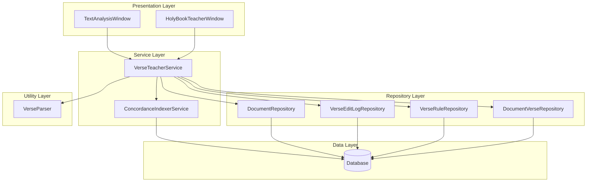
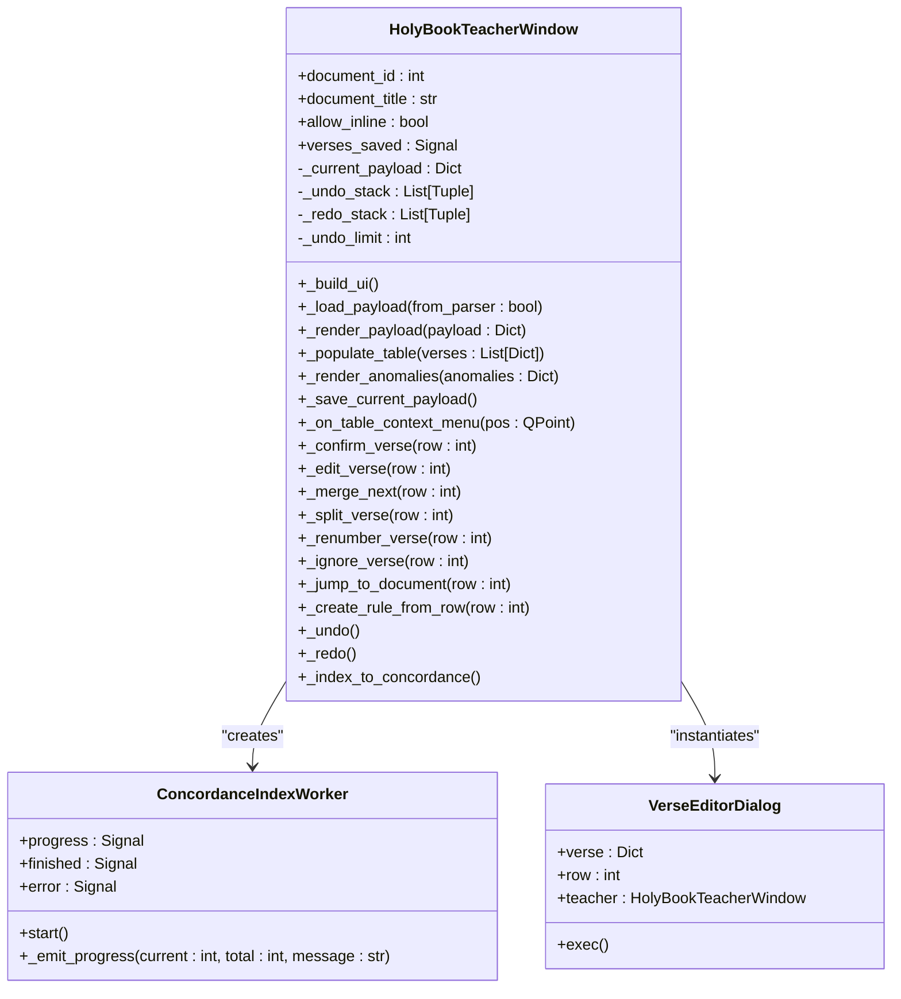
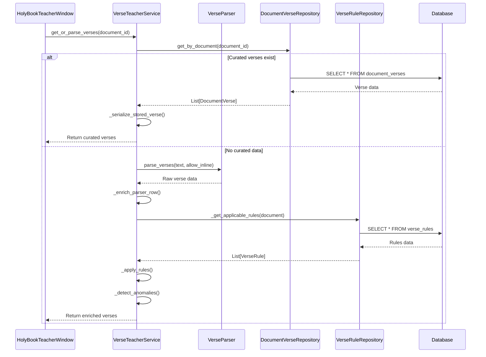
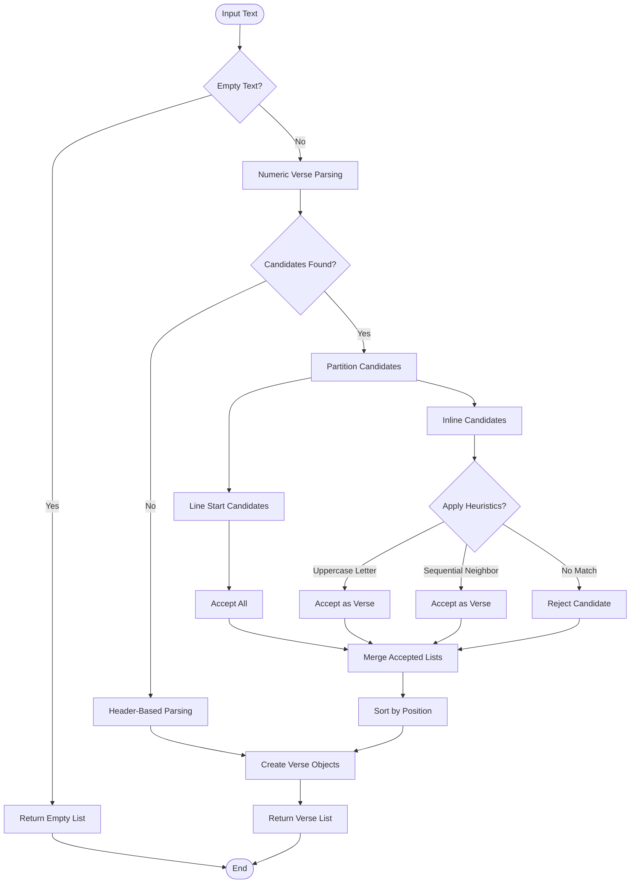
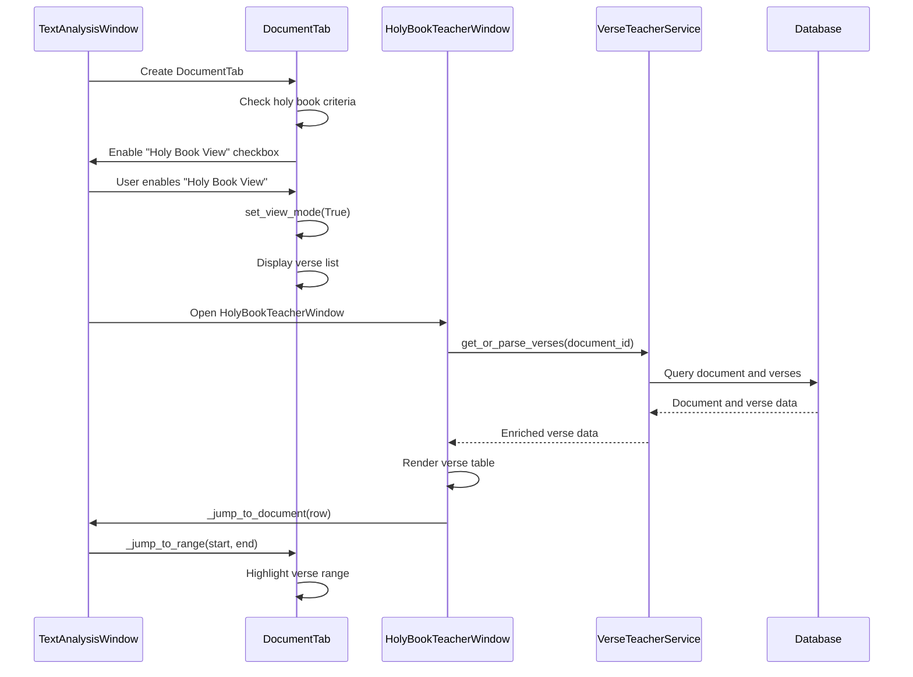
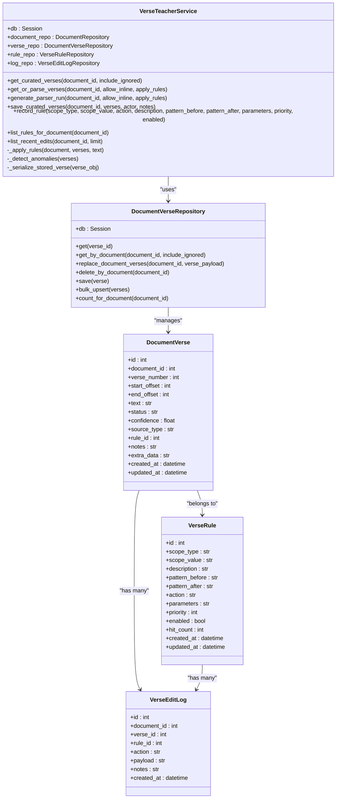
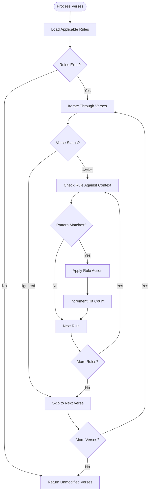
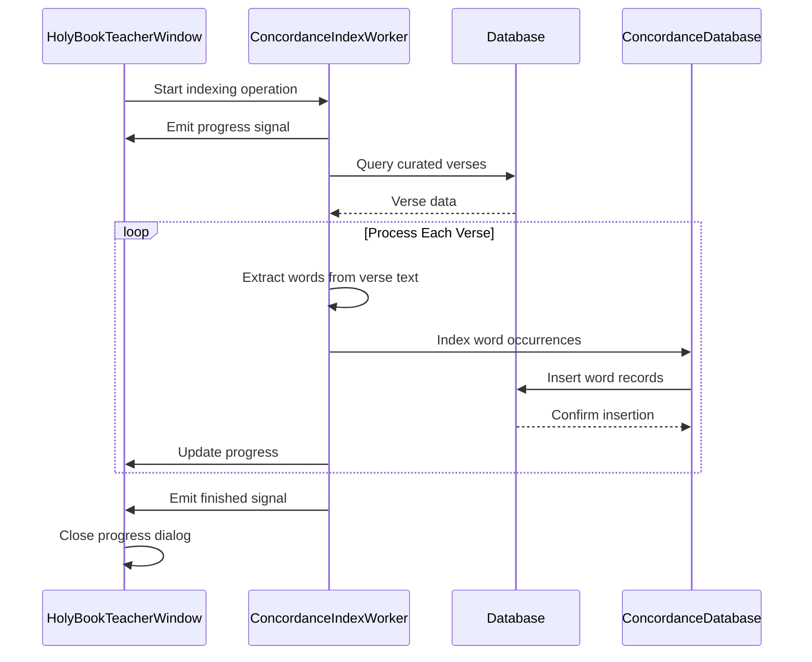

# Holy Book Teacher Mode

<cite>
**Referenced Files in This Document**
- [holy_book_teacher_window.py](file://src/pillars/gematria/ui/holy_book_teacher_window.py)
- [verse_teacher_service.py](file://src/shared/services/document_manager/verse_teacher_service.py)
- [document_verse_repository.py](file://src/shared/repositories/document_manager/document_verse_repository.py)
- [verse_parser.py](file://src/shared/utils/verse_parser.py)
- [document_verse.py](file://src/shared/models/document_manager/document_verse.py)
- [verse_rule_repository.py](file://src/shared/repositories/document_manager/verse_rule_repository.py)
- [verse_edit_log_repository.py](file://src/shared/repositories/document_manager/verse_edit_log_repository.py)
- [document_repository.py](file://src/shared/repositories/document_manager/document_repository.py)
- [concordance_indexer_service.py](file://src/shared/services/lexicon/concordance_indexer_service.py)
- [HOLY_BOOK_TEACHER_HELP.md](file://docs/features/HOLY_BOOK_TEACHER_HELP.md)
</cite>

## Update Summary
**Changes Made**
- Enhanced documentation with comprehensive implementation framework for the Holy Book Teacher Mode
- Added detailed component interactions and service layer design documentation
- Expanded rule matching algorithms and interactive analysis tools coverage
- Included new Concordance Indexing functionality and worker implementation
- Updated architecture diagrams to reflect current implementation
- Added technical depth for extension points and additional sacred texts support

## Table of Contents
1. [Introduction](#introduction)
2. [Core Components](#core-components)
3. [Architecture Overview](#architecture-overview)
4. [Detailed Component Analysis](#detailed-component-analysis)
5. [Integration with DocumentManager](#integration-with-documentmanager)
6. [Verse Teacher Service and Document Verse Repository Relationship](#verse-teacher-service-and-document-verse-repository-relationship)
7. [Rule Matching Algorithms and Heuristics](#rule-matching-algorithms-and-heuristics)
8. [Interactive Analysis Tools](#interactive-analysis-tools)
9. [Concordance Indexing System](#concordance-indexing-system)
10. [Common Issues and Solutions](#common-issues-and-solutions)
11. [Extension Points for Additional Sacred Texts](#extension-points-for-additional-sacred-texts)
12. [Conclusion](#conclusion)

## Introduction
The Holy Book Teacher Mode is a sophisticated feature designed to provide contextual gematria analysis of sacred texts through an integrated workflow that combines automated parsing with manual curation. This specialized mode enables users to explore numerical connections between biblical verses and other sacred texts by displaying verses alongside their numerical significance, correlation with textual content, and annotation capabilities. The system leverages the verse_teacher_service to coordinate parsing, rule application, and data persistence, while integrating tightly with the DocumentManager for seamless verse display and curation workflows.

The implementation provides advanced features including anomaly detection, undo/redo functionality, rule-based parsing, and interactive analysis tools that make it accessible to beginners while offering extensive technical depth for developers working with additional sacred texts and numerical analysis methods.

## Core Components
The Holy Book Teacher Mode comprises several interconnected components that work together to provide comprehensive verse analysis and curation capabilities:

**User Interface Layer**: The HolyBookTeacherWindow provides a comprehensive Qt-based interface featuring a verse preview table, anomaly detection panel, save options, and interactive controls for editing and managing verse data.

**Service Layer**: The VerseTeacherService acts as the core business logic coordinator, handling parser orchestration, rule application, data validation, and audit logging through a context-managed database session.

**Repository Layer**: Multiple specialized repositories manage data persistence for verses, parsing rules, and edit logs, providing CRUD operations and complex queries for verse management.

**Utility Layer**: The verse_parser module implements sophisticated algorithms for detecting verse markers in sacred texts using regex patterns and contextual heuristics.

**Model Layer**: SQLAlchemy models define the data structures for DocumentVerse, VerseRule, and VerseEditLog entities with proper relationships and indexing for optimal performance.

**Extension Layer**: The Concordance Indexing system provides advanced word indexing capabilities for connecting curated verses to the TQ Lexicon concordance.

**Section sources**
- [holy_book_teacher_window.py](file://src/pillars/gematria/ui/holy_book_teacher_window.py#L41-L946)
- [verse_teacher_service.py](file://src/shared/services/document_manager/verse_teacher_service.py#L20-L461)
- [document_verse_repository.py](file://src/shared/repositories/document_manager/document_verse_repository.py#L11-L141)
- [verse_parser.py](file://src/shared/utils/verse_parser.py#L18-L264)
- [document_verse.py](file://src/shared/models/document_manager/document_verse.py#L21-L106)

## Architecture Overview
The Holy Book Teacher Mode follows a layered architecture with clear separation between presentation, business logic, and data access layers. The system employs a service-oriented architecture pattern where the VerseTeacherService acts as the central coordinator, delegating responsibilities to specialized repositories and utilities.

**Diagram sources**
- [holy_book_teacher_window.py](file://src/pillars/gematria/ui/holy_book_teacher_window.py#L41-L946)
- [verse_teacher_service.py](file://src/shared/services/document_manager/verse_teacher_service.py#L20-L461)
- [document_verse_repository.py](file://src/shared/repositories/document_manager/document_verse_repository.py#L11-L141)
- [verse_parser.py](file://src/shared/utils/verse_parser.py#L18-L264)
- [concordance_indexer_service.py](file://src/shared/services/lexicon/concordance_indexer_service.py#L213-L253)

## Detailed Component Analysis

### HolyBookTeacherWindow Analysis
The HolyBookTeacherWindow provides a comprehensive user interface for reviewing, editing, and saving verse data with advanced interactive features. The interface displays verses in a sortable table with columns for verse number, status, start/end offsets, source type, confidence scores, and text content. Key features include:

**Advanced Editing Capabilities**:
- Context-sensitive actions for confirming, editing, merging, splitting, renumbering, and ignoring verses
- Real-time anomaly detection showing duplicates, missing numbers, and overlapping ranges
- Undo/redo functionality with configurable history limits and visual history display
- Interactive highlighting that synchronizes with the main document editor

**Rule Creation System**:
- Dynamic rule creation from selected verses with regex pattern specification
- Support for multiple rule actions (suppress, promote, renumber, note)
- Priority-based rule application with hit counting and audit trails

**Integration Features**:
- Bidirectional navigation between teacher interface and document editor
- Concordance indexing capability for connecting verses to lexical databases
- Help system with contextual assistance and troubleshooting guidance

**Diagram sources**
- [holy_book_teacher_window.py](file://src/pillars/gematria/ui/holy_book_teacher_window.py#L41-L946)

**Section sources**
- [holy_book_teacher_window.py](file://src/pillars/gematria/ui/holy_book_teacher_window.py#L41-L946)

### Verse Teacher Service Analysis
The VerseTeacherService serves as the central coordinator for all verse-related operations, implementing sophisticated business logic for parsing, rule application, and data management. The service provides:

**Core Operations**:
- Verse retrieval from curated storage or parser generation
- Rule-based verse processing with pattern matching and conditional logic
- Anomaly detection for data quality assurance
- Audit trail maintenance through edit logging

**Rule Processing Engine**:
- Multi-scope rule application (document, collection, global)
- Context-aware pattern matching with before/after text constraints
- Action-based verse modification (suppress, promote, renumber, note)
- Hit counting and performance monitoring

**Data Management**:
- Atomic transaction handling for verse replacement operations
- Comprehensive serialization for UI integration
- Batch operations for performance optimization

**Diagram sources**
- [verse_teacher_service.py](file://src/shared/services/document_manager/verse_teacher_service.py#L79-L140)
- [verse_parser.py](file://src/shared/utils/verse_parser.py#L18-L36)

**Section sources**
- [verse_teacher_service.py](file://src/shared/services/document_manager/verse_teacher_service.py#L20-L461)

### Verse Parser Analysis
The verse_parser implements sophisticated algorithms for detecting verse markers in sacred texts using a combination of regex pattern matching and contextual heuristics. The parser operates through multiple stages:

**Numeric Parsing Stage**:
- Pattern-based detection of numeric verse markers at line starts or inline
- Support for various punctuation formats (., :, ), -, etc.)
- Character position tracking for precise text boundary identification

**Contextual Heuristics**:
- Uppercase letter detection for sentence-start validation
- Sequential number pattern recognition for inline markers
- Line break and whitespace-aware positioning

**Fallback Mechanisms**:
- Header-based parsing for documents without numeric markers
- Unicode script detection for non-Latin text support
- Intelligent content segmentation and numbering

**Diagram sources**
- [verse_parser.py](file://src/shared/utils/verse_parser.py#L39-L143)

**Section sources**
- [verse_parser.py](file://src/shared/utils/verse_parser.py#L18-L264)

## Integration with DocumentManager
The Holy Book Teacher Mode integrates seamlessly with the DocumentManager through multiple touchpoints, providing a cohesive workflow from document selection to verse curation and analysis. The integration encompasses:

**Text Analysis Integration**:
- Automatic detection of holy book documents through tagging and collection membership
- Conditional activation of "Holy Book View" based on document characteristics
- Bidirectional navigation between teacher interface and main document editor

**Document Tab Coordination**:
- Dynamic switching between normal text view and verse list display
- Synchronized highlighting that shows verse boundaries in the main editor
- Context-aware toolbar availability and functionality

**Workflow Orchestration**:
- Seamless transition from document selection to parsing and curation
- Persistent state management across interface switches
- Real-time synchronization of editing actions

**Diagram sources**
- [holy_book_teacher_window.py](file://src/pillars/gematria/ui/holy_book_teacher_window.py#L517-L531)
- [verse_teacher_service.py](file://src/shared/services/document_manager/verse_teacher_service.py#L79-L105)

**Section sources**
- [holy_book_teacher_window.py](file://src/pillars/gematria/ui/holy_book_teacher_window.py#L517-L531)
- [verse_teacher_service.py](file://src/shared/services/document_manager/verse_teacher_service.py#L79-L105)

## Verse Teacher Service and Document Verse Repository Relationship
The relationship between VerseTeacherService and DocumentVerseRepository represents a classic service-layer pattern where the service coordinates business operations while the repository handles data persistence concerns. This separation provides several benefits:

**Service Responsibilities**:
- Business logic coordination and rule application
- Data enrichment and transformation for UI consumption
- Transaction management and audit logging
- Complex query orchestration across multiple repositories

**Repository Responsibilities**:
- Direct database access and manipulation
- Object-relational mapping and persistence
- Query optimization and indexing support
- Data integrity enforcement and validation

**Transaction Management**:
The service ensures atomic operations through context-managed database sessions, while the repository provides methods for bulk operations and complex queries. The replace_document_verses method exemplifies this pattern, performing atomic delete-then-insert operations to maintain data consistency.

**Diagram sources**
- [verse_teacher_service.py](file://src/shared/services/document_manager/verse_teacher_service.py#L20-L461)
- [document_verse_repository.py](file://src/shared/repositories/document_manager/document_verse_repository.py#L11-L141)
- [document_verse.py](file://src/shared/models/document_manager/document_verse.py#L21-L106)

**Section sources**
- [verse_teacher_service.py](file://src/shared/services/document_manager/verse_teacher_service.py#L20-L461)
- [document_verse_repository.py](file://src/shared/repositories/document_manager/document_verse_repository.py#L11-L141)
- [document_verse.py](file://src/shared/models/document_manager/document_verse.py#L21-L106)

## Rule Matching Algorithms and Heuristics
The rule matching system implements sophisticated pattern-based verse processing that enhances the basic parsing capabilities with contextual intelligence. The algorithm operates through multiple stages:

**Scope Resolution**:
Rules are collected from three hierarchical scopes: document-specific, collection-wide, and global rules. Each scope contributes rules based on specificity and applicability to the current document context.

**Pattern Matching**:
The system applies regex patterns to contextual text surrounding each verse marker. The matching window extends ±200 characters from the verse boundary to capture relevant linguistic context.

**Action Application**:
Based on matched patterns, rules can suppress unwanted markers, promote suspected markers, renumber verses, or add explanatory notes. Each action modifies verse properties while maintaining audit trails.

**Priority and Performance**:
Rules are processed in priority order, with hit counts tracked for performance monitoring. The system optimizes matching by limiting context windows and using compiled regex patterns.

**Diagram sources**
- [verse_teacher_service.py](file://src/shared/services/document_manager/verse_teacher_service.py#L296-L322)

**Section sources**
- [verse_teacher_service.py](file://src/shared/services/document_manager/verse_teacher_service.py#L296-L364)

## Interactive Analysis Tools
The Holy Book Teacher Mode provides several interactive analysis tools that enhance the user experience and enable sophisticated verse examination:

**Real-time Anomaly Detection**:
The system continuously monitors verse data for quality issues, reporting duplicates, missing numbers, and overlapping ranges. This detection helps maintain data integrity during manual curation.

**Undo/Redo System**:
A sophisticated state management system maintains up to five levels of undo/redo history, with visual indicators and keyboard shortcuts for efficient workflow management.

**Contextual Navigation**:
Bidirectional linking between the teacher interface and main document editor enables seamless navigation between verse boundaries and their textual context.

**Dynamic Rule Creation**:
Users can create parsing rules directly from verse examples, specifying regex patterns and desired actions. The system validates rule effectiveness and provides immediate feedback.

**Progressive Indexing**:
The Concordance Indexing system provides real-time progress feedback during word indexing operations, with cancellation support and error reporting.

**Section sources**
- [holy_book_teacher_window.py](file://src/pillars/gematria/ui/holy_book_teacher_window.py#L289-L307)
- [holy_book_teacher_window.py](file://src/pillars/gematria/ui/holy_book_teacher_window.py#L673-L735)

## Concordance Indexing System
The Concordance Indexing system represents a significant enhancement to the Holy Book Teacher Mode, providing advanced lexical analysis capabilities for connecting curated verses to the TQ Lexicon database. This system implements:

**Background Processing**:
The ConcordanceIndexWorker operates asynchronously, processing verses in the background while providing real-time progress updates through signals and progress dialogs.

**Batch Processing Strategy**:
Words from curated verses are extracted and processed in batches, with intelligent caching to avoid redundant processing and optimize database operations.

**Quality Assurance**:
The system includes validation mechanisms to ensure indexed words meet quality standards and handles edge cases such as duplicate entries and malformed data.

**Integration Points**:
The indexing process integrates with the existing audit trail system, maintaining records of indexing operations and providing traceability for research purposes.

**Diagram sources**
- [holy_book_teacher_window.py](file://src/pillars/gematria/ui/holy_book_teacher_window.py#L738-L807)
- [concordance_indexer_service.py](file://src/shared/services/lexicon/concordance_indexer_service.py#L213-L253)

**Section sources**
- [holy_book_teacher_window.py](file://src/pillars/gematria/ui/holy_book_teacher_window.py#L738-L807)
- [concordance_indexer_service.py](file://src/shared/services/lexicon/concordance_indexer_service.py#L213-L253)

## Common Issues and Solutions
Several common issues may arise when using the Holy Book Teacher Mode, each with specific diagnostic approaches and resolution strategies:

**Verse Reference Accuracy**:
- **Issue**: Verse boundaries may be slightly off due to parsing errors or formatting variations
- **Solution**: Use the "Jump to Document" feature to visually confirm text ranges, then employ "Set Start/End from Editor Selection" to precisely adjust offsets based on manual selections in the main editor

**Parsing Inconsistencies**:
- **Issue**: Documents with non-standard formatting may exhibit inconsistent verse detection
- **Solution**: Create targeted parsing rules using "Create Rule From This" feature, specifying regex patterns that identify context where numbers should or should not be treated as verse markers

**Missing Verses**:
- **Issue**: Some verses may be missed if they don't follow standard numbering patterns or use alternative formats
- **Solution**: Utilize "Split at Offset" feature to manually divide longer passages into individual verses, then use renumbering to assign appropriate verse numbers

**Duplicate Verse Numbers**:
- **Issue**: Multiple verses with identical numbers can occur in complex texts with embedded references
- **Solution**: Use the anomaly detection panel to identify duplicates, then manually renumber conflicting verses using the context menu's renumber option

**Performance with Large Documents**:
- **Issue**: Very large sacred texts may experience slow parsing and rendering performance
- **Solution**: Work with smaller text sections at a time, save curated verses frequently to avoid reprocessing entire documents, and consider disabling inline marker detection for extremely large texts

**Rule Conflicts**:
- **Issue**: Multiple rules may conflict when applied to the same verse context
- **Solution**: Review rule priority settings, disable conflicting rules, and use the rule hit count tracking to identify problematic rule combinations

**Section sources**
- [HOLY_BOOK_TEACHER_HELP.md](file://docs/features/HOLY_BOOK_TEACHER_HELP.md)

## Extension Points for Additional Sacred Texts
The Holy Book Teacher Mode provides extensive extension points for supporting additional sacred texts beyond the default biblical corpus. The modular architecture enables adaptation to various religious traditions and textual formats:

**Custom Parsing Algorithms**:
The system supports alternative parsing strategies through the verse_parser interface, allowing developers to implement specialized algorithms for texts with unique formatting conventions such as:
- Non-Latin script support with Unicode-aware parsing
- Hieroglyphic or cuneiform text processing
- Syntactic structures that don't rely on numeric markers
- Prose texts without explicit verse divisions

**Language-Specific Enhancements**:
The architecture accommodates different linguistic requirements through:
- Custom regex patterns for language-specific verse markers
- Cultural context awareness for proper verse boundary detection
- Translation and interlinear text processing capabilities
- Multi-script text handling for mixed-language documents

**Rule System Extensibility**:
The rule-based system can be extended to handle complex textual features found in various sacred writings:
- Historical context rules for ancient texts
- Literary genre-specific parsing rules
- Comparative analysis rules for multi-text studies
- Cross-reference detection and linking systems

**UI Customization Framework**:
The interface supports localization and cultural adaptation through:
- Multi-language text support
- Right-to-left script handling
- Traditional symbol and icon integration
- Cultural-specific color schemes and styling

**Data Model Flexibility**:
The SQLAlchemy-based data model can accommodate additional metadata fields for different religious contexts:
- Sacred text classification systems
- Author attribution and historical dating
- Canonical status and doctrinal alignment
- Regional variant and translation tracking

**Research Integration**:
The system provides hooks for advanced research features:
- Comparative analysis tools across multiple texts
- Statistical analysis of numerical patterns
- Cross-cultural study frameworks
- Machine learning integration for automated analysis

**Section sources**
- [verse_parser.py](file://src/shared/utils/verse_parser.py#L18-L264)
- [verse_teacher_service.py](file://src/shared/services/document_manager/verse_teacher_service.py#L296-L364)
- [document_verse.py](file://src/shared/models/document_manager/document_verse.py#L21-L106)

## Conclusion
The Holy Book Teacher Mode represents a comprehensive solution for contextual gematria analysis of sacred texts, combining sophisticated parsing algorithms with intuitive user interfaces and robust data management systems. The implementation demonstrates excellent architectural principles through clear separation of concerns, service-oriented design, and extensible framework architecture.

The system's strength lies in its ability to balance automation with human expertise, providing powerful tools for scholars and practitioners while maintaining accessibility for general users. The integration of rule-based processing, anomaly detection, and interactive analysis tools creates a workflow that supports both casual exploration and rigorous academic research.

The recent addition of Concordance Indexing capabilities significantly enhances the system's analytical power, enabling researchers to connect textual analysis with comprehensive lexical databases. This integration represents a model for how specialized tools can be combined to create comprehensive research environments.

With its modular design and extensive extension points, the Holy Book Teacher Mode provides a solid foundation for supporting diverse sacred texts and analysis methodologies. The system's architecture ensures maintainability, scalability, and adaptability to future research needs in the field of comparative religious studies and textual analysis.