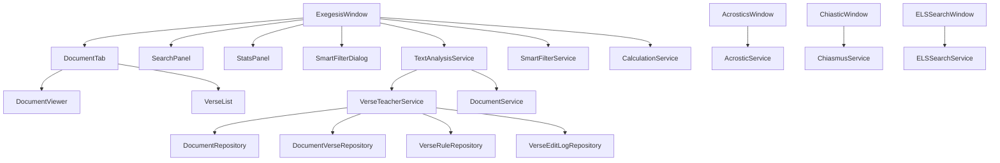
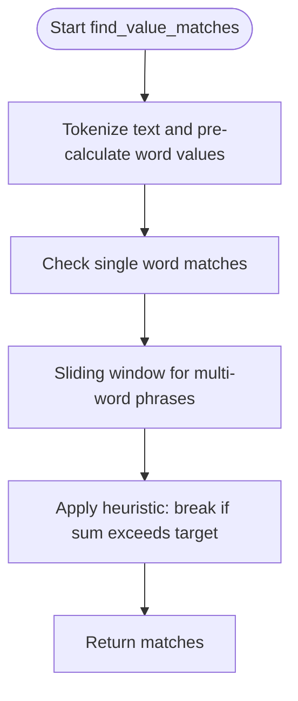
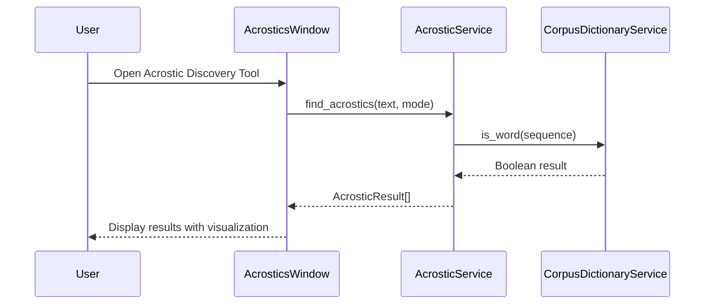
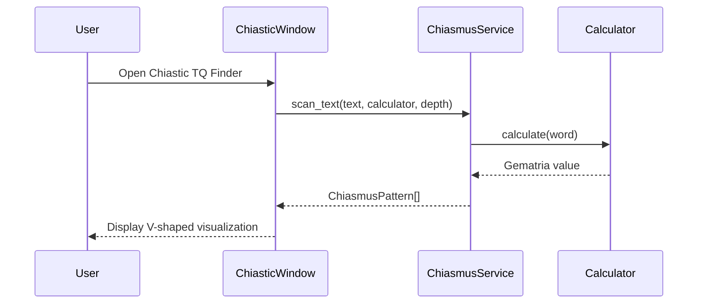
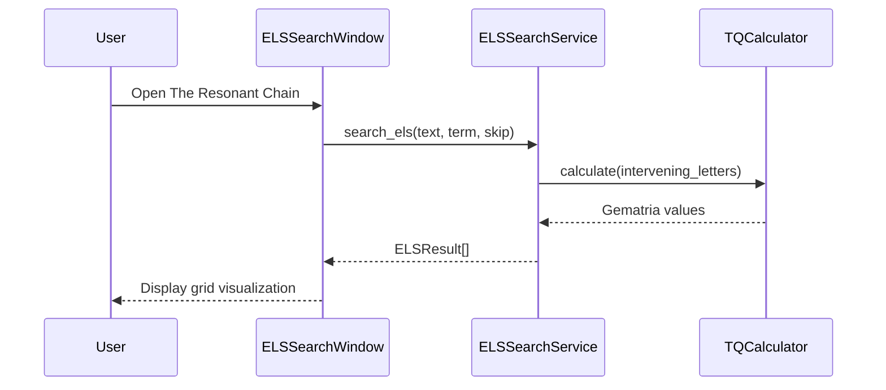
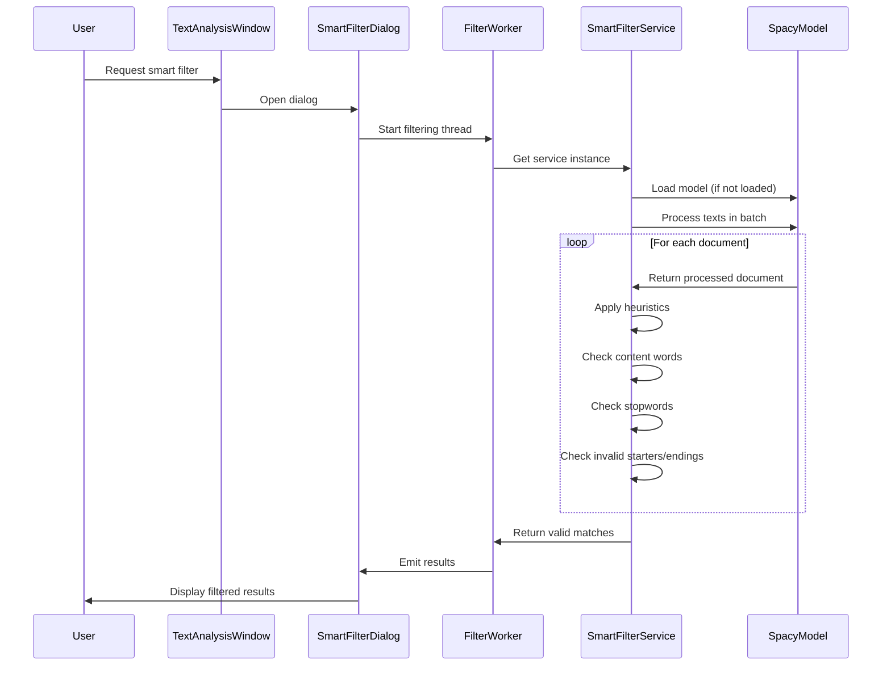
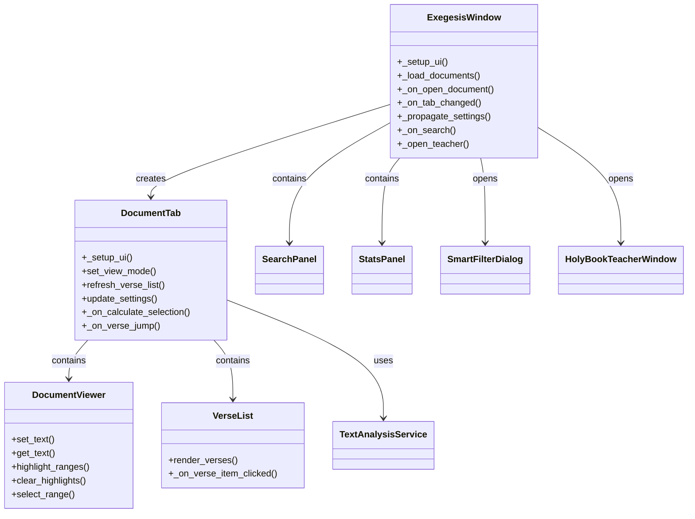

# Text Analysis System

<cite>
**Referenced Files in This Document**   
- [acrostic_service.py](file://src/pillars/gematria/services/acrostic_service.py)
- [chiasmus_service.py](file://src/pillars/gematria/services/chiasmus_service.py)
- [els_service.py](file://src/pillars/gematria/services/els_service.py)
- [acrostics_window.py](file://src/pillars/gematria/ui/acrostics_window.py)
- [chiastic_window.py](file://src/pillars/gematria/ui/chiastic_window.py)
- [els_search_window.py](file://src/pillars/gematria/ui/els_search_window.py)
- [text_analysis_window.py](file://src/pillars/gematria/ui/text_analysis/main_window.py)
- [text_analysis_service.py](file://src/pillars/gematria/services/text_analysis_service.py)
- [smart_filter_service.py](file://src/pillars/gematria/services/smart_filter_service.py)
- [verse_teacher_service.py](file://src/pillars/document_manager/services/verse_teacher_service.py)
- [document_tab.py](file://src/pillars/gematria/ui/text_analysis/document_tab.py)
- [search_panel.py](file://src/pillars/gematria/ui/text_analysis/search_panel.py)
- [smart_filter_dialog.py](file://src/pillars/gematria/ui/text_analysis/smart_filter_dialog.py)
- [verse_parser.py](file://src/pillars/gematria/utils/verse_parser.py)
- [base_calculator.py](file://src/pillars/gematria/services/base_calculator.py)
- [calculation_service.py](file://src/pillars/gematria/services/calculation_service.py)
</cite>

## Update Summary
**Changes Made**   
- Added new sections for acrostics, chiasmus, and ELS analysis capabilities
- Updated architecture overview to include new services and UI components
- Added new diagrams for acrostics, chiasmus, and ELS analysis workflows
- Updated core components section to include new analysis types
- Added performance considerations for new analysis methods

## Table of Contents
1. [Introduction](#introduction)
2. [Architecture Overview](#architecture-overview)
3. [Core Components](#core-components)
4. [Text Analysis Service](#text-analysis-service)
5. [Acrostic Analysis](#acrostic-analysis)
6. [Chiasmus Analysis](#chiasmus-analysis)
7. [ELS Analysis](#els-analysis)
8. [Smart Filter Service](#smart-filter-service)
9. [Integration with Document Manager](#integration-with-document-manager)
10. [Performance Considerations](#performance-considerations)
11. [Troubleshooting Guide](#troubleshooting-guide)
12. [Conclusion](#conclusion)

## Introduction

The Text Analysis System is an advanced feature that combines gematria calculations with document analysis from the Document Manager pillar. This system enables users to analyze verses and passages by applying multiple gematria methods to large texts, breaking them into segments for comprehensive analysis. The system integrates the TextAnalysisWindow with the DocumentManager to provide a seamless workflow for text analysis, pattern recognition, and contextual interpretation.

The system has been expanded to include acrostics, chiasmus, and Equidistant Letter Sequence (ELS) analysis capabilities with new services and UI components. These new features provide advanced text analysis methods for discovering hidden patterns and structures in sacred texts.

The system is designed to be accessible to beginners while providing sufficient technical depth for experienced developers. It addresses common issues such as performance bottlenecks when analyzing large documents and provides optimization strategies to ensure efficient processing.

**Section sources**
- [text_analysis_window.py](file://src/pillars/gematria/ui/text_analysis/main_window.py#L1-L465)

## Architecture Overview

The Text Analysis System follows a modular architecture with clear separation of concerns between UI components, services, and data models. The system is built around the ExegesisWindow (formerly TextAnalysisWindow), which serves as the main interface for users to interact with the text analysis features.

**Diagram sources**
- [text_analysis_window.py](file://src/pillars/gematria/ui/text_analysis/main_window.py#L24-L465)
- [document_tab.py](file://src/pillars/gematria/ui/text_analysis/document_tab.py#L13-L150)
- [search_panel.py](file://src/pillars/gematria/ui/text_analysis/search_panel.py#L9-L192)
- [smart_filter_dialog.py](file://src/pillars/gematria/ui/text_analysis/smart_filter_dialog.py#L21-L119)
- [text_analysis_service.py](file://src/pillars/gematria/services/text_analysis_service.py#L5-L185)
- [smart_filter_service.py](file://src/pillars/gematria/services/smart_filter_service.py#L5-L102)
- [verse_teacher_service.py](file://src/pillars/document_manager/services/verse_teacher_service.py#L20-L352)
- [acrostics_window.py](file://src/pillars/gematria/ui/acrostics_window.py#L1-L423)
- [acrostic_service.py](file://src/pillars/gematria/services/acrostic_service.py#L1-L151)
- [chiastic_window.py](file://src/pillars/gematria/ui/chiastic_window.py#L1-L307)
- [chiasmus_service.py](file://src/pillars/gematria/services/chiasmus_service.py#L1-L141)
- [els_search_window.py](file://src/pillars/gematria/ui/els_search_window.py#L1-L967)
- [els_service.py](file://src/pillars/gematria/services/els_service.py#L1-L548)

## Core Components

The Text Analysis System consists of several core components that work together to provide comprehensive text analysis capabilities. The main components include the ExegesisWindow, which serves as the primary user interface, and the TextAnalysisService, which handles the core text processing and gematria calculations.

The system also includes specialized services for advanced text analysis:
- **AcrosticService**: Discovers hidden messages encoded in the first or last letters of lines/words
- **ChiasmusService**: Scans text for symmetric gematria patterns (e.g., values 10-20-30-20-10)
- **ELSSearchService**: Implements Equidistant Letter Sequence ("Bible Code") search

The system also includes the SmartFilterService for filtering results using NLP techniques, and integrates with the VerseTeacherService for contextual interpretation of verses. These components are designed to work together seamlessly, providing a powerful tool for analyzing texts using gematria methods.

The architecture follows a service-oriented design pattern, with clear separation between UI components and business logic. This allows for easy maintenance and extension of the system, as well as better testability of individual components.

**Section sources**
- [text_analysis_window.py](file://src/pillars/gematria/ui/text_analysis/main_window.py#L24-L465)
- [text_analysis_service.py](file://src/pillars/gematria/services/text_analysis_service.py#L5-L185)
- [smart_filter_service.py](file://src/pillars/gematria/services/smart_filter_service.py#L5-L102)
- [acrostic_service.py](file://src/pillars/gematria/services/acrostic_service.py#L1-L151)
- [chiasmus_service.py](file://src/pillars/gematria/services/chiasmus_service.py#L1-L141)
- [els_service.py](file://src/pillars/gematria/services/els_service.py#L1-L548)

## Text Analysis Service

The TextAnalysisService is the core component responsible for handling text analysis operations. It provides several key methods for finding value matches, calculating text values, and parsing verses.

The `find_value_matches` method implements a Fast Scan algorithm that efficiently finds all text segments matching a target gematria value. The algorithm uses a two-step process: first tokenizing the text and pre-calculating word values, then using an integer sliding window to find matches. This approach ensures optimal performance even with large texts.

**Diagram sources**
- [text_analysis_service.py](file://src/pillars/gematria/services/text_analysis_service.py#L8-L113)

The service also includes the `calculate_stats` method for calculating text statistics such as word count, character count, total value, and average word value. This provides users with valuable insights into the text being analyzed.

Additionally, the `parse_verses` method integrates with the VerseTeacherService to provide contextual interpretation of verses. This method first attempts to load curated verse data from the VerseTeacherService, falling back to local parsing if necessary.

**Section sources**
- [text_analysis_service.py](file://src/pillars/gematria/services/text_analysis_service.py#L5-L185)

## Acrostic Analysis

The AcrosticService discovers hidden messages encoded in the first or last letters of lines or words. This service implements two primary modes: First Letter (Acrostic) and Last Letter (Telestich).

The service supports both line-based analysis (for poetry) and word-based analysis (for prose). It works by extracting sequences of first or last letters from text units and scanning for valid words using the CorpusDictionaryService.

**Diagram sources**
- [acrostic_service.py](file://src/pillars/gematria/services/acrostic_service.py#L1-L151)
- [acrostics_window.py](file://src/pillars/gematria/ui/acrostics_window.py#L1-L423)

The AcrosticsWindow provides a user interface for configuring and running acrostic analysis. Users can select between line and word modes, choose to check first letters, last letters, or both, and load a dictionary for validating discovered words.

Key features of the acrostic analysis system:
- **Modes**: First Letter (Acrostic) and Last Letter (Telestich)
- **Scope**: Supports Line-based (poetry) and Word-based (prose) analysis
- **Dictionary Integration**: Uses CorpusDictionaryService to validate discovered words
- **Visualization**: Highlights the source letters in context

**Section sources**
- [acrostic_service.py](file://src/pillars/gematria/services/acrostic_service.py#L1-L151)
- [acrostics_window.py](file://src/pillars/gematria/ui/acrostics_window.py#L1-L423)

## Chiasmus Analysis

The ChiasmusService scans text for symmetric gematria patterns, such as values 10-20-30-20-10. This service detects both Single Pivot (A-B-C-B-A) and Mirror (A-B-B-A) structures.

The service works by tokenizing text into words, calculating gematria values for each word, and then scanning for symmetric patterns. It supports configurable recursion depth to prevent infinite loops on uniform text.

**Diagram sources**
- [chiasmus_service.py](file://src/pillars/gematria/services/chiasmus_service.py#L1-L141)
- [chiastic_window.py](file://src/pillars/gematria/ui/chiastic_window.py#L1-L307)

The ChiasticWindow provides a user interface for configuring and running chiasmus analysis. Users can select different gematria calculators (English TQ, Hebrew Standard, Hebrew Ordinal, Greek Isopsephy), set minimum depth requirements, and visualize the mirror structures.

Key features of the chiasmus analysis system:
- **Patterns**: Detects both Single Pivot (A-B-C-B-A) and Mirror (A-B-B-A) structures
- **Depth Control**: Configurable recursion depth to prevent infinite loops on uniform text
- **Multiple Calculators**: Supports various gematria systems
- **Visualization**: Displays results in a V-shape or mirror format

**Section sources**
- [chiasmus_service.py](file://src/pillars/gematria/services/chiasmus_service.py#L1-L141)
- [chiastic_window.py](file://src/pillars/gematria/ui/chiastic_window.py#L1-L307)

## ELS Analysis

The ELSSearchService implements Equidistant Letter Sequence ("Bible Code") search. This service supports multiple search methods including standard ELS, arithmetical sequences, and chain searches.

The service supports various skip sequences: Standard (n-th letter), Triangular (1, 3, 6...), Square (1, 4, 9...), and Fibonacci skips. It also supports chain searches for finding non-equidistant chains of letters forming a target phrase.

**Diagram sources**
- [els_service.py](file://src/pillars/gematria/services/els_service.py#L1-L548)
- [els_search_window.py](file://src/pillars/gematria/ui/els_search_window.py#L1-L967)

The ELSSearchWindow provides a three-pane interface for ELS searching:
- **Left pane**: Controls for text source, grid configuration, and search parameters
- **Center pane**: Zoomable/pannable letter grid visualization
- **Right pane**: Clickable search results with gematria breakdown

Key features of the ELS analysis system:
- **Skip Sequences**: Supports Standard (n-th letter), Triangular (1, 3, 6...), Square (1, 4, 9...), and Fibonacci skips
- **Chain Search**: Finds non-equidistant chains of letters forming a target phrase
- **Intervening Text**: Extracts and analyzes the text between the ELS hits
- **Grid Visualization**: Arranges text in configurable grids for pattern recognition

**Section sources**
- [els_service.py](file://src/pillars/gematria/services/els_service.py#L1-L548)
- [els_search_window.py](file://src/pillars/gematria/ui/els_search_window.py#L1-L967)

## Smart Filter Service

The SmartFilterService uses Spacy NLP to filter gematria phrases and remove linguistic nonsense. This service implements a singleton pattern to ensure efficient use of resources, particularly the Spacy model which can be memory-intensive.

The service works by loading the Spacy model lazily when first needed, then processing matches in batches for optimal performance. The filtering algorithm applies several heuristics to determine if a phrase is valid:

1. Must contain at least one content word (noun, verb, adjective, proper noun, or number)
2. Cannot consist entirely of stopwords and punctuation
3. Cannot start with conjunctions, particles, or punctuation
4. Cannot end with conjunctions, particles, punctuation, determiners, prepositions, or pronouns
5. Specific patterns like "DET + PREP" (e.g., "The of") or "ADJ + ADP" (e.g., "Good of") are rejected

**Diagram sources**
- [smart_filter_service.py](file://src/pillars/gematria/services/smart_filter_service.py#L5-L102)
- [smart_filter_dialog.py](file://src/pillars/gematria/ui/text_analysis/smart_filter_dialog.py#L21-L119)

The service processes texts in batches using Spacy's pipe functionality, which is more efficient than processing texts individually. This approach significantly improves performance when dealing with large numbers of matches.

**Section sources**
- [smart_filter_service.py](file://src/pillars/gematria/services/smart_filter_service.py#L5-L102)
- [smart_filter_dialog.py](file://src/pillars/gematria/ui/text_analysis/smart_filter_dialog.py#L21-L119)

## Integration with Document Manager

The Text Analysis System integrates closely with the Document Manager pillar through several key components. The ExegesisWindow uses the document_service_context to load documents and the verse_teacher_service_context to access verse interpretation functionality.

The integration follows a modular approach, with the ExegesisWindow creating DocumentTab instances for each document. Each DocumentTab contains a DocumentViewer for displaying text and a VerseList for showing parsed verses. The tab communicates with the main window through signals, enabling features like saving verses and opening the Holy Book Teacher.

**Diagram sources**
- [text_analysis_window.py](file://src/pillars/gematria/ui/text_analysis/main_window.py#L24-L465)
- [document_tab.py](file://src/pillars/gematria/ui/text_analysis/document_tab.py#L13-L150)

The system uses a context manager pattern for database access, ensuring proper resource management and transaction handling. When a user opens the Holy Book Teacher, the system passes the document ID and title to the teacher window, maintaining a consistent user experience across components.

The integration also includes performance optimizations such as lazy loading of documents and efficient text processing. The system only loads document content when a tab is opened, reducing memory usage and improving startup time.

**Section sources**
- [text_analysis_window.py](file://src/pillars/gematria/ui/text_analysis/main_window.py#L24-L465)
- [document_tab.py](file://src/pillars/gematria/ui/text_analysis/document_tab.py#L13-L150)
- [verse_teacher_service.py](file://src/pillars/document_manager/services/verse_teacher_service.py#L20-L352)

## Performance Considerations

The Text Analysis System includes several performance optimizations to handle large documents efficiently. The primary optimization is in the TextAnalysisService's find_value_matches method, which uses a Fast Scan algorithm with O(N) complexity for tokenization and an optimized sliding window approach for phrase matching.

Key performance features include:

1. **Pre-calculation of word values**: The service calculates gematria values for each word once during tokenization, avoiding redundant calculations during the search phase.

2. **Integer sliding window**: Instead of re-summing values for every window, the algorithm maintains a running sum, significantly reducing computational overhead.

3. **Early termination heuristic**: When the running sum exceeds the target value (assuming positive gematria values), the algorithm breaks the inner loop, avoiding unnecessary calculations.

4. **Batch processing**: The SmartFilterService processes texts in batches using Spacy's pipe functionality, which is more efficient than processing texts individually.

5. **Lazy loading**: Document content is only loaded when a tab is opened, reducing memory usage and improving startup time.

For the new analysis methods, additional performance considerations include:

- **Acrostic Analysis**: The service processes text units efficiently by extracting letter sequences in a single pass and using substring matching algorithms to find valid words.
- **Chiasmus Analysis**: The service uses a two-pass algorithm to detect both odd-length (A-B-C-B-A) and even-length (A-B-B-A) patterns, with configurable depth limits to prevent excessive processing.
- **ELS Analysis**: The service optimizes grid calculations by pre-computing factors and suggesting better counts for prime numbers, improving visualization performance.

For very large documents, users may experience performance bottlenecks during initial text processing. To mitigate this, the system could implement additional optimizations such as:

- **Text segmentation**: Breaking large documents into smaller chunks for parallel processing
- **Caching**: Storing pre-processed text segments and their gematria values
- **Incremental processing**: Processing text in the background while allowing user interaction
- **Indexing**: Creating an index of word positions and values for faster lookups

The system's architecture supports these optimizations through its modular design, making it relatively straightforward to implement additional performance enhancements as needed.

**Section sources**
- [text_analysis_service.py](file://src/pillars/gematria/services/text_analysis_service.py#L8-L113)
- [smart_filter_service.py](file://src/pillars/gematria/services/smart_filter_service.py#L5-L102)
- [acrostic_service.py](file://src/pillars/gematria/services/acrostic_service.py#L1-L151)
- [chiasmus_service.py](file://src/pillars/gematria/services/chiasmus_service.py#L1-L141)
- [els_service.py](file://src/pillars/gematria/services/els_service.py#L1-L548)

## Troubleshooting Guide

Common issues with the Text Analysis System typically relate to performance, configuration, or data handling. Here are some common problems and their solutions:

**Performance Issues with Large Documents**
- **Symptom**: Slow response times or application freezing when analyzing large texts
- **Solution**: Break the document into smaller sections for analysis, or use the "Strict Parsing" option to limit the scope of analysis

**Spacy Model Loading Issues**
- **Symptom**: Smart Filter fails to load or throws an error about missing model
- **Solution**: Ensure the "en_core_web_sm" model is installed using `python -m spacy download en_core_web_sm`

**Verse Parsing Problems**
- **Symptom**: Incorrect verse numbering or missing verses
- **Solution**: Use the Holy Book Teacher to manually curate verse boundaries, or adjust the parsing rules in the VerseRuleRepository

**Gematria Calculation Inconsistencies**
- **Symptom**: Unexpected gematria values for certain words
- **Solution**: Verify the selected gematria method (e.g., Hebrew Standard, Greek Isopsephy, English TQ) and check for special characters or diacritical marks that may affect calculations

**Document Loading Errors**
- **Symptom**: Unable to open documents or missing documents in the selector
- **Solution**: Verify document integrity and check database connectivity; use the Document Library to verify document availability

**Acrostic Analysis Issues**
- **Symptom**: No valid words found despite apparent patterns
- **Solution**: Load a corpus dictionary using the "Load Corpus Dictionary" button to validate discovered words

**ELS Analysis Issues**
- **Symptom**: No ELS patterns found in expected text
- **Solution**: Try different skip values or use the "Suggest Better Counts" feature to find texts with better factorization for grid visualization

The system includes logging capabilities through Python's logging module, which can help diagnose issues. Error messages are displayed to users through QMessageBox dialogs, providing clear feedback about problems and potential solutions.

**Section sources**
- [text_analysis_service.py](file://src/pillars/gematria/services/text_analysis_service.py#L5-L185)
- [smart_filter_service.py](file://src/pillars/gematria/services/smart_filter_service.py#L5-L102)
- [verse_teacher_service.py](file://src/pillars/document_manager/services/verse_teacher_service.py#L20-L352)
- [text_analysis_window.py](file://src/pillars/gematria/ui/text_analysis/main_window.py#L24-L465)
- [acrostic_service.py](file://src/pillars/gematria/services/acrostic_service.py#L1-L151)
- [chiasmus_service.py](file://src/pillars/gematria/services/chiasmus_service.py#L1-L141)
- [els_service.py](file://src/pillars/gematria/services/els_service.py#L1-L548)

## Conclusion

The Text Analysis System provides a comprehensive solution for combining gematria calculations with document analysis. By integrating the ExegesisWindow with the DocumentManager, the system enables users to analyze verses and passages using multiple gematria methods, with support for contextual interpretation through the VerseTeacherService.

The system has been expanded to include advanced analysis capabilities for acrostics, chiasmus, and ELS patterns, providing researchers with powerful tools for discovering hidden structures in sacred texts. These new features are implemented through specialized services (AcrosticService, ChiasmusService, ELSSearchService) and dedicated UI components (AcrosticsWindow, ChiasticWindow, ELSSearchWindow).

The system's modular architecture, with clear separation between UI components and services, makes it both accessible to beginners and extensible for experienced developers. Performance optimizations such as the Fast Scan algorithm and batch processing ensure efficient analysis even with large documents.

Future enhancements could include additional gematria methods, improved NLP filtering, and enhanced visualization capabilities. The system's design supports these extensions while maintaining its core functionality and user experience.