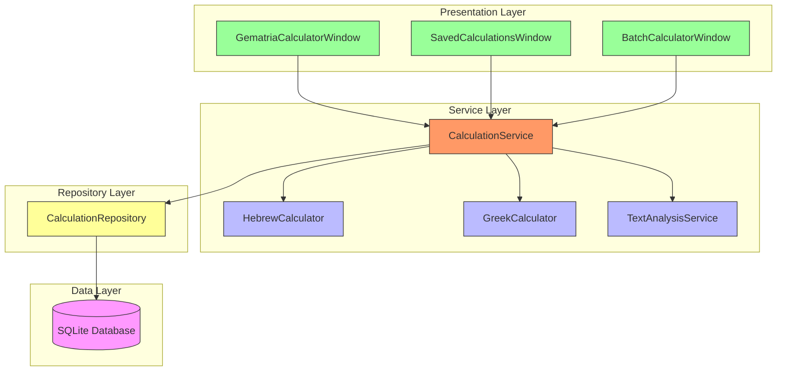
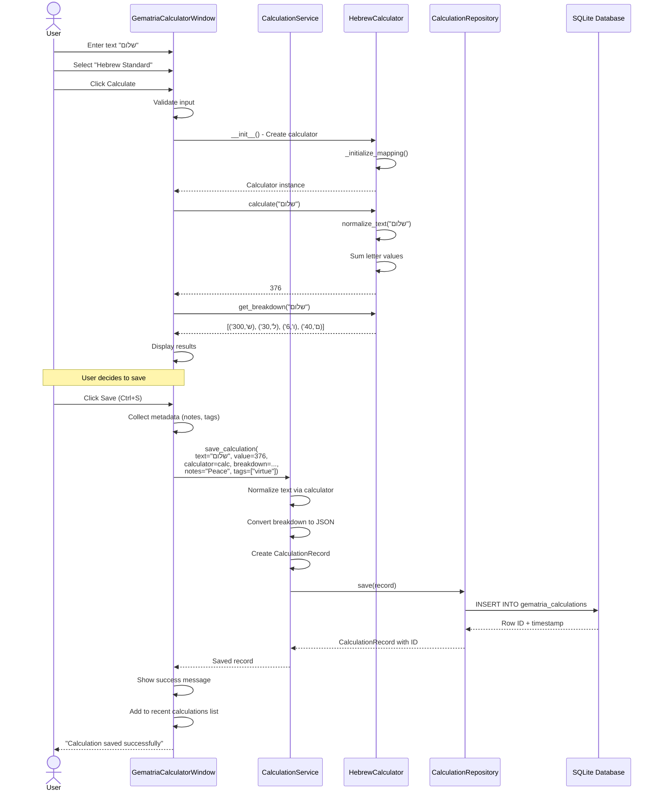
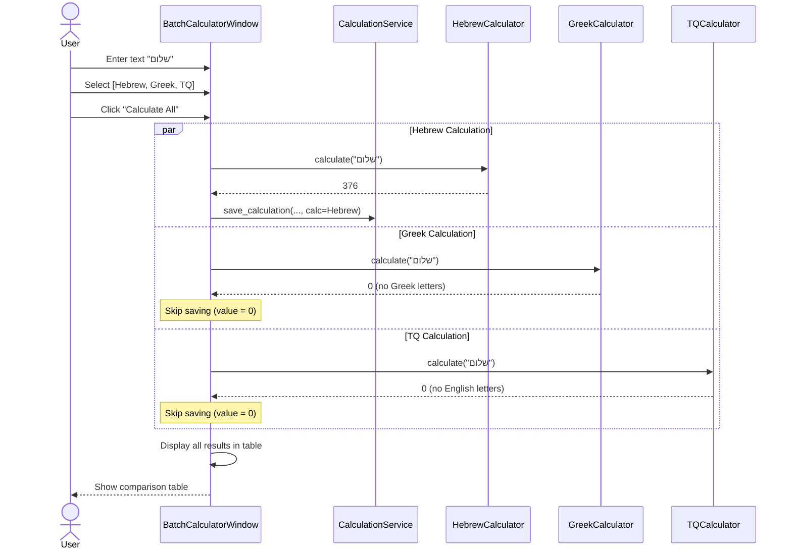
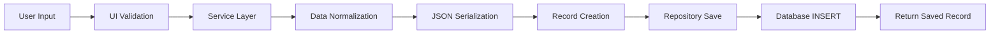
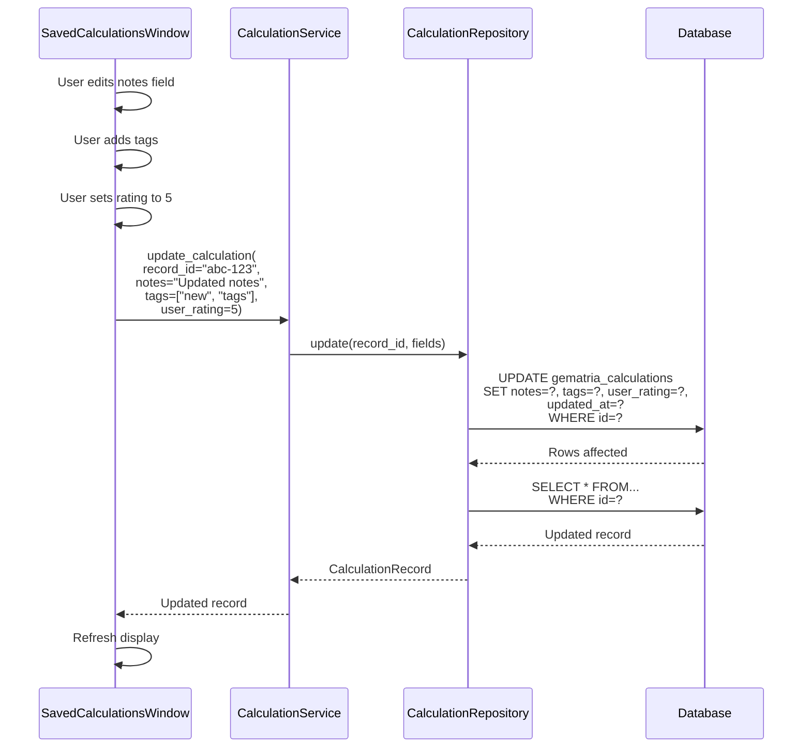
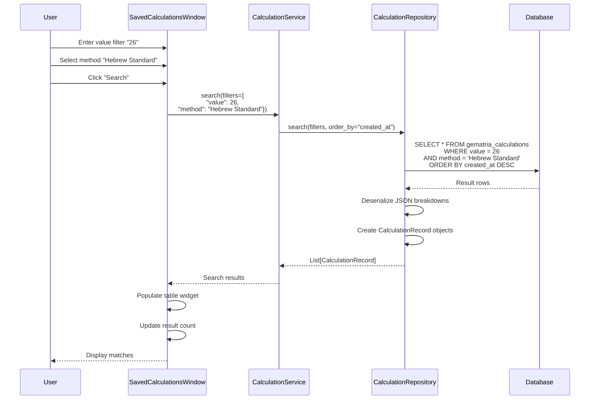
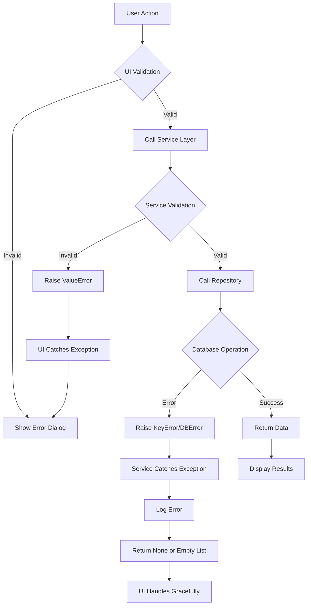
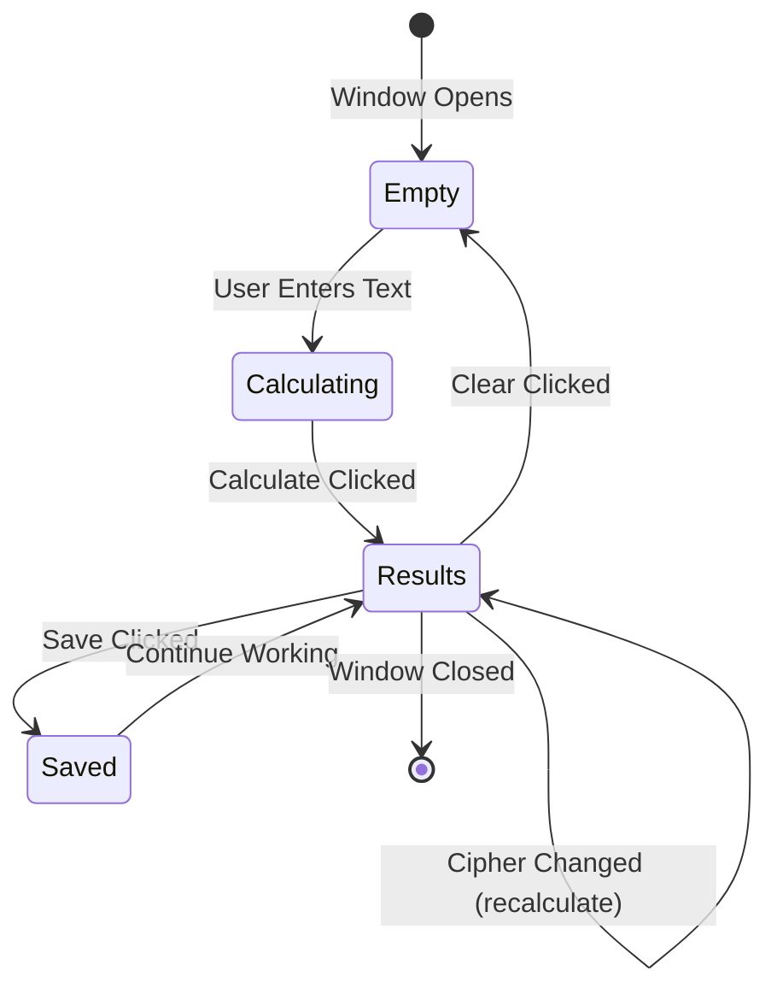

# Data Flow Architecture: End-to-End Calculation Journey

<!-- Last Verified: 2026-01-16 -->

<cite>
**Referenced Files in This Document**
- [gematria_calculator_window.py](file://src/pillars/gematria/ui/gematria_calculator_window.py)
- [calculation_service.py](file://src/pillars/gematria/services/calculation_service.py)
- [base_calculator.py](file://src/shared/services/gematria/base_calculator.py)
- [calculation_repository.py](file://src/pillars/gematria/repositories/sqlite_calculation_repository.py)
- [database.py](file://src/shared/database.py)
</cite>

## Table of Contents
1. [Introduction](#introduction)
2. [Layer Architecture](#layer-architecture)
3. [Calculation Flow](#calculation-flow)
4. [Persistence Flow](#persistence-flow)
5. [Query Flow](#query-flow)
6. [Error Propagation](#error-propagation)
7. [State Management](#state-management)

## Introduction

The Gematria Pillar follows a **layered architecture** with clear separation between presentation (UI), business logic (Services), and data access (Repositories). This document traces the complete journey of data from user input through calculation, persistence, and retrieval.

**Architectural Principles:**
- **Unidirectional Flow**: Data flows downward (UI → Service → Repository)
- **Dependency Injection**: Lower layers don't know about upper layers
- **Immutable Calculations**: Once saved, calculation values never change
- **Signal-Based Updates**: UI updates via observer pattern, not polling

## Layer Architecture



### Layer Responsibilities

| Layer | Components | Responsibility |
|-------|------------|----------------|
| **Presentation** | PyQt6 Windows | User interaction, input validation, display |
| **Service** | Calculation/Analysis Services | Business logic, orchestration, validation |
| **Strategy** | Calculator implementations | Algorithm implementations |
| **Repository** | Data access objects | CRUD operations, query building |
| **Data** | SQLite database | Persistent storage |

## Calculation Flow

### Simple Calculation Sequence



### Multi-Calculator Batch Flow



## Persistence Flow

### Save Operation Detail

**Input Transformation Pipeline:**



**Breakdown Serialization:**

```python
# Input from calculator
breakdown = [('ש', 300), ('ל', 30), ('ו', 6), ('ם', 40)]

# Service layer transformation
breakdown_data = [
    {"char": char, "value": val} 
    for char, val in breakdown
]

# JSON encoding
breakdown_json = json.dumps(breakdown_data, ensure_ascii=False)
# Result: '[{"char":"ש","value":300},{"char":"ל","value":30},...]'

# Stored in database
record.breakdown = breakdown_json
```

**Text Normalization:**

```python
# Original text (with diacritics)
original = "בְּרֵאשִׁית"

# Normalized text (diacritics removed)
normalized = calculator.normalize_text(original)
# Result: "בראשית"

# Both stored in record
record.text = "בְּרֵאשִׁית"          # For display
record.normalized_text = "בראשית"     # For calculation/search
```

### Update Operation



## Query Flow

### Search by Value



### Complex Query Example

**UI Request:**
```python
filters = {
    "value": 888,
    "tags": ["divine_name"],
    "min_rating": 4,
    "is_favorite": True
}
```

**Repository SQL Translation:**
```sql
SELECT * FROM gematria_calculations
WHERE value = 888
  AND tags LIKE '%"divine_name"%'  -- JSON array search
  AND user_rating >= 4
  AND is_favorite = TRUE
ORDER BY created_at DESC
LIMIT 100
```

## Error Propagation

### Error Handling Strategy



### Error Types by Layer

| Layer | Error Type | Example | Handling |
|-------|------------|---------|----------|
| **UI** | ValidationError | Empty text input | Show inline error message |
| **Service** | ValueError | Invalid rating (>5) | Raise exception to UI |
| **Repository** | KeyError | Record not found | Return None |
| **Database** | sqlite3.Error | Connection failure | Log + retry or fail gracefully |

### Example Error Flow

```python
# UI Layer
try:
    value = int(self.value_input.text())
except ValueError:
    QMessageBox.warning(self, "Invalid Input", "Value must be a number")
    return

# Service Layer
if not (0 <= user_rating <= 5):
    raise ValueError("Rating must be between 0 and 5")

# Repository Layer
try:
    record = self.session.query(CalculationEntity).filter_by(id=record_id).first()
except SQLAlchemyError as e:
    logger.error(f"Database query failed: {e}")
    return None
```

## State Management

### Calculator State

**Calculators are stateless:**
```python
calc = HebrewCalculator()  # Create once
value1 = calc.calculate("שלום")  # 376
value2 = calc.calculate("אהבה")  # 13
# No state persists between calls
```

**Benefit**: Thread-safe, reusable, predictable

### UI State

**Window State Management:**



**State Components:**
- Current text input
- Selected calculators
- Calculation results cache
- Recent calculations list
- UI element visibility flags

### Session State

**Saved Calculations Window:**
```python
class SavedCalculationsWindow:
    def __init__(self):
        self.current_filters = {}
        self.current_sort = "created_at"
        self.selected_records = []
        self.page_offset = 0
        self.page_size = 100
```

**State Persistence:**
- Filters persist during session
- Sort order remembered
- Selection preserved on refresh
- Pagination state maintained

---

**See Also:**
- [strategy_pattern.md](strategy_pattern.md) - Calculator architecture
- [calculation_service.md](../api/calculation_service.md) - Service API
- [../ui_components/calculator_window.md](../ui_components/calculator_window.md) - UI layer

**Revision History:**
- 2026-01-16: Initial data flow documentation with sequence diagrams
