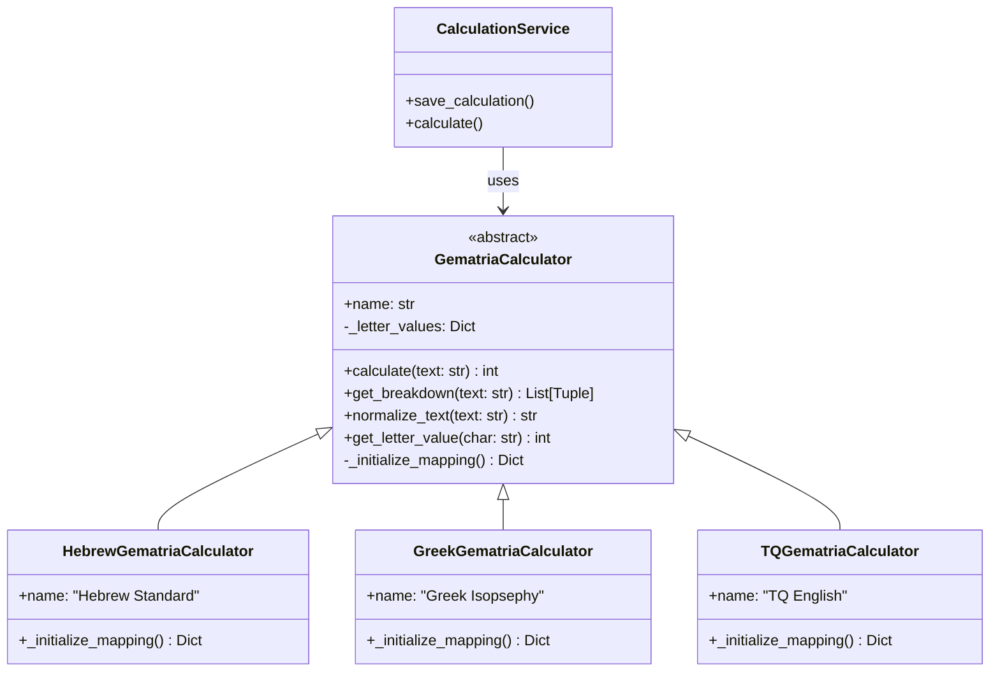
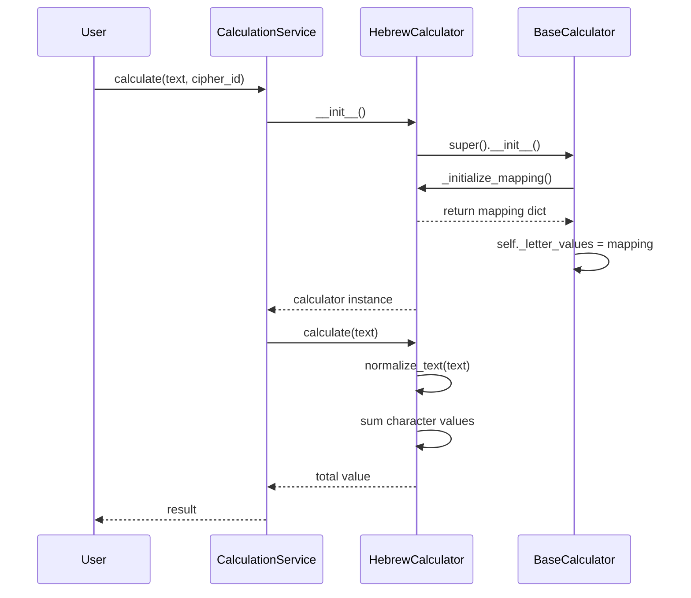

# The Strategy Pattern: Calculator Architecture

<!-- Last Verified: 2026-01-16 -->

<cite>
**Referenced Files in This Document**
- [base_calculator.py](file://src/shared/services/gematria/base_calculator.py)
- [hebrew_calculator.py](file://src/shared/services/gematria/hebrew_calculator.py)
- [greek_calculator.py](file://src/shared/services/gematria/greek_calculator.py)
- [tq_calculator.py](file://src/shared/services/gematria/tq_calculator.py)
- [calculation_service.py](file://src/pillars/gematria/services/calculation_service.py)
</cite>

## Table of Contents
1. [Introduction](#introduction)
2. [Architectural Pattern](#architectural-pattern)
3. [The Abstract Contract](#the-abstract-contract)
4. [Concrete Strategy Implementations](#concrete-strategy-implementations)
5. [Calculator Lifecycle](#calculator-lifecycle)
6. [Extension Points](#extension-points)
7. [Performance Characteristics](#performance-characteristics)
8. [Best Practices](#best-practices)

## Introduction

The Gematria Pillar implements the **Strategy Pattern** to enable polymorphic cipher behavior. Rather than hardcoding calculation logic for Hebrew, Greek, and English systems, we define an abstract protocol (`GematriaCalculator`) and provide concrete implementations for each tradition. This architecture ensures extensibility—new ciphers can be added without modifying existing code—while maintaining type safety and consistency.

**Architectural Philosophy:**
- **Separation of Concerns**: Algorithm logic is isolated from orchestration
- **Open/Closed Principle**: Open for extension (new calculators), closed for modification (base contract)
- **Runtime Flexibility**: Calculator strategies can be swapped at runtime based on user selection

## Architectural Pattern

The Strategy Pattern decouples the "what" (calculation interface) from the "how" (specific cipher algorithms). The pattern consists of three key elements:



**Component Responsibilities:**
- **GematriaCalculator**: Abstract base class defining the contract
- **Concrete Calculators**: Implement specific cipher logic (Hebrew, Greek, TQ, etc.)
- **CalculationService**: Context that uses calculator strategies

## The Abstract Contract

The `GematriaCalculator` base class defines the protocol that all calculators must implement:

### Core Methods

**`_initialize_mapping() -> Dict[str, int]`** (Abstract)
- Must be implemented by each concrete calculator
- Returns the letter-to-value mapping for that cipher system
- Called once during instantiation
- Example: `{'א': 1, 'ב': 2, ...}` for Hebrew

**`calculate(text: str) -> int`**
- Public API for calculating gematria value
- Normalizes text, then sums character values
- Returns total numeric value
- Example: `calculate("שלום")` → 376

**`get_breakdown(text: str) -> List[Tuple[str, int]]`**
- Returns detailed character-by-character analysis
- Preserves order and duplicates
- Filters out unmapped characters
- Example: `[('ש', 300), ('ל', 30), ('ו', 6), ('ם', 40)]`

**`normalize_text(text: str) -> str`**
- Removes diacritical marks (Hebrew nikud, Greek accents)
- Uses Unicode NFD normalization
- Filters combining characters (category Mn)
- Returns NFC-composed result

**`get_letter_value(char: str) -> int`**
- Single-character lookup
- Returns 0 for unmapped characters
- Used for interactive UI feedback

### Internal State

```python
self._letter_values: Dict[str, int]  # Mapping table initialized once
```

**Design Rationale:**
- Letter mappings are immutable after initialization
- Dictionary lookup is O(1) for character value retrieval
- Private attribute prevents external modification

## Concrete Strategy Implementations

### Hebrew Calculator Family

**HebrewGematriaCalculator (Standard/Mispar Hecht)**
- Aleph (א) = 1, Bet (ב) = 2, ... Tav (ת) = 400
- Final forms use standard values: Final Mem (ם) = 40

**HebrewSofitCalculator**
- Extends final forms to their traditional values
- Final Kaf (ך) = 500, Final Mem (ם) = 600, Final Nun (ן) = 700
- Final Pe (ף) = 800, Final Tzadi (ץ) = 900

**HebrewAtBashCalculator**
- Reversal cipher: א↔ת, ב↔ש, ג↔ר
- Preserves numeric values but inverts letter positions
- Used for cryptographic analysis

**HebrewAlbamCalculator**
- Splits alphabet into two halves, maps א→ל, ב→מ, etc.
- Alternative substitution pattern

**HebrewOrdinalCalculator**
- Position-based: א=1, ב=2, ..., ת=22
- Ignores traditional hundreds place

**Specialized Hebrew Calculators:**
- `HebrewSmallValueCalculator`: Reduces values mod 9 (Mispar Katan)
- `HebrewKolelCalculator`: Adds 1 to final sum (Kolel principle)
- `HebrewSquareCalculator`: Squares each letter value
- `HebrewTriangularCalculator`: Triangular number summation
- `HebrewFullValueCalculator`: Spells out letter names and calculates their values

### Greek Calculator Family

**GreekGematriaCalculator (Isopsephy)**
- Alpha (Α) = 1, Beta (Β) = 2, ..., Omega (Ω) = 800
- Uses archaic letters: Digamma (Ϝ) = 6, Koppa (Ϙ) = 90, Sampi (Ϡ) = 900

**GreekOrdinalCalculator**
- Simple position: Α=1, Β=2, ..., Ω=24

**GreekReverseSubstitutionCalculator**
- Greek equivalent of Atbash
- Α↔Ω, Β↔Ψ, etc.

### TQ Calculator Family (English)

**TQGematriaCalculator (Trigrammaton Qabalah)**
- Base-3 ternary system
- A=1, B=2, C=3, D=10, E=11, ..., Z=222
- Reflects triadic philosophy

**TQReducedCalculator**
- Simplifies TQ values through digit summation

## Calculator Lifecycle

### Instantiation Flow



### Strategy Selection

The `CalculationService` or UI components select calculators based on:
- User cipher selection (dropdown, checkboxes)
- Language detection (for auto-mode)
- Saved calculation metadata (replay/restore)

**Example Selection Logic:**
```python
calculator_map = {
    "Hebrew Standard": HebrewGematriaCalculator(),
    "Hebrew Sofit": HebrewSofitCalculator(),
    "Greek Isopsephy": GreekGematriaCalculator(),
    "TQ English": TQGematriaCalculator(),
}

selected_calculator = calculator_map[cipher_name]
value = selected_calculator.calculate(text)
```

## Extension Points

### Adding a New Calculator

To add a new gematria system (e.g., Sanskrit, Coptic):

1. **Create New Calculator Class:**
```python
from shared.services.gematria.base_calculator import GematriaCalculator

class SanskritKatapayadiCalculator(GematriaCalculator):
    @property
    def name(self) -> str:
        return "Sanskrit Katapayadi"
    
    def _initialize_mapping(self) -> Dict[str, int]:
        return {
            'क': 1, 'ख': 2, 'ग': 3, 'घ': 4, 'ङ': 5,
            # ... complete mapping
        }
```

2. **Register in UI:**
- Add to `gematria_hub.py` import list
- Include in calculator initialization
- Add checkbox to cipher selection dialog

3. **Update Documentation:**
- Add entry to `REFERENCE.md` cipher table
- Document unique characteristics
- Provide usage examples in `GUIDES.md`

### Customizing Normalization

Override `normalize_text()` for script-specific requirements:

```python
def normalize_text(self, text: str) -> str:
    # Call parent for basic diacritic removal
    text = super().normalize_text(text)
    
    # Add script-specific transformations
    text = text.replace('ς', 'σ')  # Greek final sigma
    return text
```

## Performance Characteristics

### Computational Complexity

**Single Calculation:**
- Normalization: O(n) where n = text length
- Dictionary lookups: O(n) with O(1) per character
- Total: **O(n) linear time**

**Breakdown Generation:**
- Same as calculation: **O(n)**
- Additional list construction overhead: negligible

**Batch Operations:**
- For k texts: **O(k × n_avg)**
- Can be parallelized (calculators are stateless after init)

### Memory Profile

- Each calculator instance: ~1-2 KB (mapping dictionary)
- Mapping dictionaries are not shared (design choice for clarity)
- Consider singleton pattern if memory is constrained

### Optimization Opportunities

1. **Lazy Initialization**: Delay mapping creation until first use
2. **Flyweight Pattern**: Share mapping dictionaries across instances
3. **Caching**: Memoize frequently calculated texts
4. **Parallelization**: Process batch calculations in worker threads

## Best Practices

### When to Use Each Calculator

**Standard Systems (Most Common):**
- `HebrewGematriaCalculator`: Default for Hebrew texts
- `GreekGematriaCalculator`: Default for Greek texts
- `TQGematriaCalculator`: Default for English texts

**Specialized Analysis:**
- Use Sofit for final-form emphasis
- Use Atbash/Albam for cryptographic exploration
- Use Ordinal for simple positional analysis
- Use Small Value (Katan) for modular reduction

### Error Handling

Calculators return 0 for unmapped characters (fail-safe):
```python
value = self._letter_values.get(char, 0)  # Safe default
```

**For strict validation:**
```python
if char not in self._letter_values and not char.isspace():
    logger.warning(f"Unmapped character: {char}")
```

### Testing Strategy

**Unit Tests:**
- Verify mapping completeness (all expected letters present)
- Test normalization edge cases (combining marks, rare Unicode)
- Validate calculation accuracy against known values

**Integration Tests:**
- Test calculator swapping in `CalculationService`
- Verify UI correctly passes calculator instances
- Check breakdown format consistency

### Architectural Constraints

**Do Not:**
- Add state to calculator instances (keep them stateless)
- Modify `_letter_values` after initialization
- Couple calculators to UI or persistence layers

**Do:**
- Inherit from `GematriaCalculator`
- Implement all abstract methods
- Document unique characteristics in docstrings
- Maintain consistent return types

---

**See Also:**
- [calculation_service.md](../api/calculation_service.md) - Service-layer orchestration
- [data_flow.md](data_flow.md) - End-to-end calculation flow
- [REFERENCE.md](../REFERENCE.md) - Complete cipher listing

**Revision History:**
- 2026-01-16: Initial comprehensive documentation
