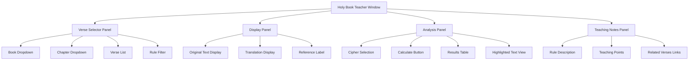
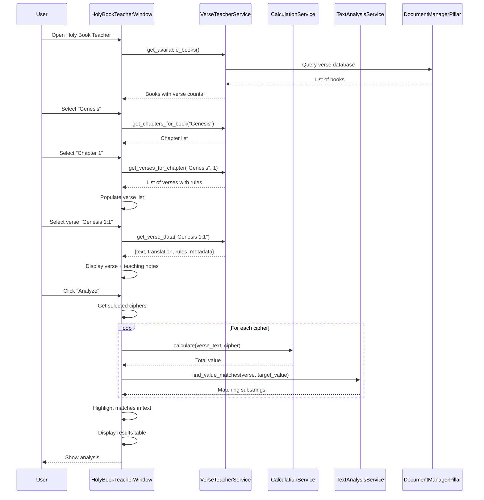
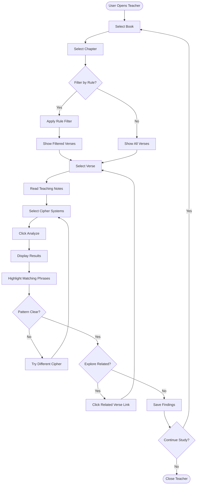

# The Holy Book Teacher: Curated Verse Analysis

<!-- Last Verified: 2026-01-16 -->

<cite>
**Referenced Files in This Document**
- [holy_book_teacher_window.py](file://src/pillars/gematria/ui/holy_book_teacher_window.py)
- [verse_teacher_service.py](file://src/pillars/document_manager/services/verse_teacher_service.py)
- [calculation_service.py](file://src/pillars/gematria/services/calculation_service.py)
- [text_analysis_service.py](file://src/pillars/gematria/services/text_analysis_service.py)
</cite>

## Table of Contents
1. [Introduction](#introduction)
2. [Feature Overview](#feature-overview)
3. [Architecture](#architecture)
4. [User Workflow](#user-workflow)
5. [Rule-Based Curation](#rule-based-curation)
6. [Integration with Document Manager](#integration-with-document-manager)
7. [Usage Examples](#usage-examples)
8. [Extension Points](#extension-points)

## Introduction

The **Holy Book Teacher** is an advanced feature for analyzing sacred texts through the lens of gematria. Unlike the general-purpose Text Analysis window, the Teacher mode provides **curated, rule-driven guidance** for exploring specific verses with known numerical significance.

**Architectural Philosophy:**
- **Guided Discovery**: Presents verses with pre-defined teaching points
- **Rule-Based Selection**: Uses criteria to filter significant verses
- **Cross-Pillar Integration**: Bridges Gematria and Document Manager pillars
- **Educational Focus**: Designed for learning and pattern recognition

**Primary Use Cases:**
- Biblical verse study with gematria
- Pattern discovery in sacred texts
- Teaching numerical symbolism
- Curated research collections

## Feature Overview

### Core Capabilities

**1. Verse Library**
- Pre-loaded collection of significant verses
- Organized by book, chapter, reference
- Metadata includes source, translation, original text

**2. Rule Matching**
- Verses are tagged with teaching rules
- Rules define numerical patterns or significance
- Examples: "Divine Name Value", "Creation Pattern", "Messianic Number"

**3. Interactive Analysis**
- Calculate gematria for displayed verse
- Highlight matching substrings
- Compare multiple cipher systems
- View detailed breakdowns

**4. Teaching Annotations**
- Explanatory text for each rule
- Historical/theological context
- Cross-references to related verses

### UI Components



## Architecture

### Component Interaction



### Service Layer Design

**VerseTeacherService Responsibilities:**
- Load verse library from document database
- Filter verses by rule criteria
- Provide verse metadata and annotations
- Manage cross-references

**Integration Pattern:**
```python
class VerseTeacherService:
    def __init__(self, document_service):
        self.doc_service = document_service
        self.rules_cache = {}
    
    def get_verses_for_rule(self, rule_id: str) -> List[VerseRecord]:
        """Get all verses matching a specific teaching rule."""
        return self.doc_service.search_verses(
            filters={"rule_tags": rule_id}
        )
    
    def get_verse_data(self, reference: str) -> VerseData:
        """Get complete verse data including teaching notes."""
        verse = self.doc_service.get_verse_by_reference(reference)
        rules = self._load_rules_for_verse(verse.rule_tags)
        return VerseData(verse, rules)
```

## User Workflow

### Typical Session Flow



### Example Session

**Step 1: Book Selection**
```
User selects: "Torah" → "Genesis"
System shows: 50 chapters, 1,533 verses
Active rules: 42
```

**Step 2: Rule Filter**
```
User selects rule: "Divine Name (26)"
System filters to: 127 verses containing יהוה
```

**Step 3: Verse Selection**
```
Verse: Genesis 2:4
Text: "אלה תולדות השמים והארץ בהבראם ביום עשות יהוה אלהים ארץ ושמים"
Rule: "First appearance of YHVH Elohim"
```

**Step 4: Analysis**
```
Selected ciphers: Hebrew Standard, Hebrew Sofit
Calculate button pressed
Results:
  - יהוה = 26 (Divine Name value)
  - אלהים = 86 (God value)
  - יהוה אלהים = 112 (Combined)
```

**Step 5: Teaching Notes Display**
```
Note: "This verse marks the first use of the combined divine name
YHVH Elohim, representing both transcendence (YHVH = 26) and 
immanence (Elohim = 86). The sum 112 = 4 × 28 (seven tetraktys)."

Related verses:
  - Exodus 3:14 (YHVH self-revelation)
  - Deuteronomy 6:4 (Shema)
```

## Rule-Based Curation

### Rule Structure

```python
@dataclass
class TeachingRule:
    id: str
    name: str
    description: str
    target_value: Optional[int]
    pattern_type: str  # "exact_value", "substring", "sum_pattern"
    teaching_notes: str
    references: List[str]
    difficulty: int  # 1-5 (beginner to advanced)
```

### Predefined Rules

| Rule ID | Name | Target Value | Description |
|---------|------|--------------|-------------|
| `divine_name_26` | Divine Name (26) | 26 | Verses containing יהוה (YHVH) |
| `creation_888` | Creation (888) | 888 | Verses with creation symbolism |
| `messiah_358` | Messiah (358) | 358 | Verses containing משיח value |
| `seven_seal_395` | Seven Seal (395) | 395 | Verses with 7×... patterns |
| `trinity_111` | Trinity (111) | 111 | Divine unity patterns |

### Rule Application Logic

```python
def apply_rule(verse: VerseRecord, rule: TeachingRule) -> bool:
    """Check if verse matches teaching rule criteria."""
    
    if rule.pattern_type == "exact_value":
        # Check if verse contains exact value
        calculator = HebrewGematriaCalculator()
        matches = text_analysis_service.find_value_matches(
            text=verse.text,
            target_value=rule.target_value,
            calculator=calculator
        )
        return len(matches) > 0
    
    elif rule.pattern_type == "substring":
        # Check for specific substring presence
        return rule.target_substring in verse.text
    
    elif rule.pattern_type == "sum_pattern":
        # Check for mathematical pattern
        total = calculator.calculate(verse.text)
        return satisfies_pattern(total, rule.pattern_criteria)
```

### Dynamic Rule Discovery

```python
def discover_rules_for_verse(verse: VerseRecord) -> List[TeachingRule]:
    """Find all applicable rules for a given verse."""
    
    applicable_rules = []
    all_rules = load_all_teaching_rules()
    
    for rule in all_rules:
        if apply_rule(verse, rule):
            applicable_rules.append(rule)
    
    return applicable_rules
```

## Integration with Document Manager

### Data Model Bridge

**Document Manager provides:**
- Verse text storage (original language)
- Translation storage (English, etc.)
- Reference indexing (Book/Chapter/Verse)
- Full-text search capability

**Holy Book Teacher adds:**
- Teaching rule tagging
- Curated verse collections
- Pedagogical annotations
- Cross-reference networks

### Database Schema

```sql
-- Document Manager table (existing)
CREATE TABLE verses (
    id TEXT PRIMARY KEY,
    reference TEXT NOT NULL,
    book TEXT,
    chapter INTEGER,
    verse INTEGER,
    text TEXT,
    translation TEXT,
    created_at TIMESTAMP
);

-- Teaching extension table (new)
CREATE TABLE verse_teaching_rules (
    verse_id TEXT,
    rule_id TEXT,
    relevance_score REAL,
    teaching_notes TEXT,
    PRIMARY KEY (verse_id, rule_id),
    FOREIGN KEY (verse_id) REFERENCES verses(id)
);

CREATE TABLE teaching_rules (
    id TEXT PRIMARY KEY,
    name TEXT,
    description TEXT,
    target_value INTEGER,
    pattern_type TEXT,
    difficulty INTEGER
);
```

## Usage Examples

### Example 1: Divine Name Study

```python
# Open teacher window
teacher = HolyBookTeacherWindow()

# Select rule filter
teacher.select_rule("divine_name_26")

# Get first verse
verse = teacher.get_current_verse()  # Genesis 2:4

# Analyze with Hebrew Standard
calculator = HebrewGematriaCalculator()
matches = text_analysis_service.find_value_matches(
    text=verse.text,
    target_value=26,
    calculator=calculator
)

# Display results
for match_text, start, end in matches:
    print(f"Found: {match_text} = 26")
    # Highlight in UI
    teacher.highlight_text(start, end, color="gold")
```

### Example 2: Multi-Cipher Comparison

```python
verse_text = "בראשית ברא אלהים"  # Genesis 1:1 (first phrase)

calculators = [
    HebrewGematriaCalculator(),
    HebrewSofitCalculator(),
    HebrewOrdinalCalculator()
]

results = {}
for calc in calculators:
    value = calc.calculate(verse_text)
    results[calc.name] = value

# Display comparison table
teacher.show_comparison_table(results)
# Output:
# Hebrew Standard: 913
# Hebrew Sofit: 913
# Hebrew Ordinal: 73
```

## Extension Points

### Adding New Rules

```python
# Define new rule
new_rule = TeachingRule(
    id="wisdom_73",
    name="Wisdom (73)",
    description="Verses containing חכמה (wisdom) value",
    target_value=73,
    pattern_type="exact_value",
    teaching_notes="73 is the gematria of חכמה (chokhmah), wisdom...",
    references=["Proverbs 1:7", "Ecclesiastes 7:12"],
    difficulty=2
)

# Register rule
verse_teacher_service.register_rule(new_rule)

# Tag applicable verses
verses = document_service.search_verses(text_contains="חכמה")
for verse in verses:
    verse_teacher_service.tag_verse_with_rule(verse.id, "wisdom_73")
```

### Custom Verse Collections

```python
# Create themed collection
collection = VerseCollection(
    id="creation_week",
    name="Creation Week",
    description="Analysis of Genesis 1 day-by-day",
    verses=[
        "Genesis 1:3-5",   # Day 1
        "Genesis 1:6-8",   # Day 2
        # ... etc
    ]
)

# Add to teacher
teacher.add_custom_collection(collection)
```

### Interactive Teaching Mode

```python
# Progressive revelation teaching mode
class ProgressiveTeacher:
    def __init__(self, verse):
        self.verse = verse
        self.step = 0
    
    def next_hint(self):
        hints = [
            "Look for the divine name...",
            "Calculate its value...",
            "Notice the pattern with 2 × 13...",
            "13 = אחד (echad, unity)"
        ]
        return hints[self.step]
    
    def check_answer(self, user_value):
        return user_value == 26
```

---

**See Also:**
- [../api/text_analysis_service.md](../api/text_analysis_service.md) - Analysis engine
- [../ui_components/calculator_window.md](../ui_components/calculator_window.md) - Basic calculator
- [../../document_manager/EXPLANATION.md](../../document_manager/EXPLANATION.md) - Document pillar

**Revision History:**
- 2026-01-16: Initial feature documentation with rule system
