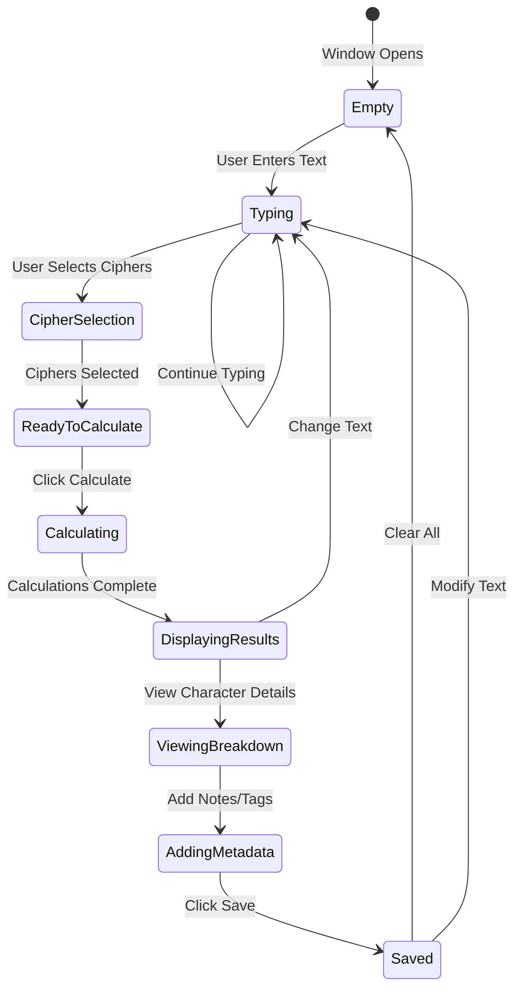

# Gematria Calculator Window: Interactive Calculation Interface

<!-- Last Verified: 2026-01-16 -->

<cite>
**Referenced Files in This Document**
- [gematria_calculator_window.py](file://src/pillars/gematria/ui/gematria_calculator_window.py)
- [components.py](file://src/pillars/gematria/ui/components.py)
- [cipher_selection_dialog.py](file://src/pillars/gematria/ui/dialogs/cipher_selection_dialog.py)
- [calculation_service.py](file://src/pillars/gematria/services/calculation_service.py)
</cite>

## Table of Contents
1. [Introduction](#introduction)
2. [UI Layout](#ui-layout)
3. [Component Hierarchy](#component-hierarchy)
4. [User Interactions](#user-interactions)
5. [State Management](#state-management)
6. [Keyboard Shortcuts](#keyboard-shortcuts)
7. [Visual Design](#visual-design)
8. [Integration Points](#integration-points)

## Introduction

The **Gematria Calculator Window** (also known as "The Logos Abacus") is the primary interactive interface for performing gematria calculations. It provides real-time calculation, multi-cipher comparison, detailed character breakdowns, and persistent storage of results.

**Window Title**: "Gematria Calculator - The Logos Abacus"
**Window Type**: Floating, resizable, persistent
**Primary Function**: Interactive single-text calculation with immediate visual feedback

## UI Layout

```mermaid
graph TD
    Window[Gematria Calculator Window] --> Header[Header Section]
    Window --> Input[Input Section]
    Window --> Ciphers[Cipher Selection Section]
    Window --> Results[Results Display Section]
    Window --> Breakdown[Character Breakdown Section]
    Window --> Actions[Action Buttons Section]
    Window --> Metadata[Metadata Section]
    
    Header --> Title[Title Label: The Logos Abacus]
    Header --> Instructions[Instructions Text]
    
    Input --> TextField[Text Input Field]
    Input --> ClearBtn[Clear Button]
    
    Ciphers --> CheckGroup[Cipher Checkboxes]
    Ciphers --> SelectAll[Select All Button]
    Ciphers --> SelectNone[Deselect All Button]
    
    Results --> ResultsTable[Results Table Widget]
    
    Breakdown --> BreakdownTable[Character Breakdown Table]
    
    Actions --> CalcBtn[Calculate Button]
    Actions --> SaveBtn[Save Button - Ctrl+S]
    Actions --> ExportBtn[Export Button]
    
    Metadata --> NotesField[Notes Text Area]
    Metadata --> SourceField[Source Reference Field]
    Metadata --> TagsField[Tags Input]
    Metadata --> CategoryField[Category Dropdown]
    Metadata --> RatingWidget[Star Rating Widget]
```



### Layout Sections

**1. Header (Top)**
- Large title: "The Logos Abacus"
- Subtitle instructions
- Close button (top-right corner)

**2. Input Area**
```
┌─────────────────────────────────────────────┐
│ Enter text:                          [Clear]│
│ ┌─────────────────────────────────────────┐ │
│ │ [Large text input field]                │ │
│ └─────────────────────────────────────────┘ │
└─────────────────────────────────────────────┘
```

**3. Cipher Selection (Expandable)**
```
┌─────────────────────────────────────────────┐
│ Select Ciphers:    [Select All] [Clear All] │
│ ☑ Hebrew Standard     ☑ Greek Isopsephy     │
│ ☐ Hebrew Sofit        ☐ Greek Ordinal       │
│ ☐ Hebrew Ordinal      ☐ TQ English          │
│ ☐ Hebrew Atbash       ☐ TQ Reduced          │
│ ... (20+ ciphers)                            │
└─────────────────────────────────────────────┘
```

**4. Results Table**
```
┌─────────────────────────────────────────────┐
│ Cipher Method        │ Value  │ Characters  │
├──────────────────────┼────────┼─────────────┤
│ Hebrew Standard      │  376   │     4       │
│ Greek Isopsephy      │    0   │     0       │
│ TQ English           │    0   │     0       │
└─────────────────────────────────────────────┘
```

**5. Character Breakdown**
```
┌─────────────────────────────────────────────┐
│ Character │ Name     │ Value  │ Position    │
├───────────┼──────────┼────────┼─────────────┤
│     ש     │ Shin     │  300   │      1      │
│     ל     │ Lamed    │   30   │      2      │
│     ו     │ Vav      │    6   │      3      │
│     ם     │ Mem(F)   │   40   │      4      │
└─────────────────────────────────────────────┘
```

**6. Metadata (Bottom)**
```
┌─────────────────────────────────────────────┐
│ Notes: [Text area for annotations]          │
│ Source: [Reference field]                   │
│ Tags: [Comma-separated tags]                │
│ Category: [Dropdown: Theological▼]          │
│ Rating: ★★★★★                               │
└─────────────────────────────────────────────┘
```

**7. Action Buttons (Bottom-right)**
```
[Calculate] [Save (Ctrl+S)] [Export]
```

## Component Hierarchy

### PyQt6 Widget Tree

```python
QMainWindow (GematriaCalculatorWindow)
├── QWidget (central_widget)
│   └── QVBoxLayout
│       ├── QLabel (title_label)
│       ├── QLabel (instructions_label)
│       ├── QHBoxLayout (input_layout)
│       │   ├── QLabel ("Enter text:")
│       │   ├── QTextEdit (text_input)
│       │   └── QPushButton (clear_button)
│       ├── QGroupBox (cipher_group)
│       │   └── QVBoxLayout
│       │       ├── QHBoxLayout (cipher_controls)
│       │       │   ├── QLabel ("Select Ciphers:")
│       │       │   ├── QPushButton (select_all_button)
│       │       │   └── QPushButton (clear_all_button)
│       │       └── QGridLayout (cipher_grid)
│       │           ├── QCheckBox (hebrew_standard_cb)
│       │           ├── QCheckBox (hebrew_sofit_cb)
│       │           ├── QCheckBox (greek_isopsephy_cb)
│       │           └── ... (30+ checkboxes)
│       ├── QTableWidget (results_table)
│       ├── QTableWidget (breakdown_table)
│       ├── QGroupBox (metadata_group)
│       │   └── QVBoxLayout
│       │       ├── QTextEdit (notes_input)
│       │       ├── QLineEdit (source_input)
│       │       ├── QLineEdit (tags_input)
│       │       ├── QComboBox (category_dropdown)
│       │       └── QWidget (star_rating_widget)
│       └── QHBoxLayout (button_layout)
│           ├── QPushButton (calculate_button)
│           ├── QPushButton (save_button)
│           └── QPushButton (export_button)
```

### Custom Components

**StarRatingWidget**
```python
class StarRatingWidget(QWidget):
    """Interactive 5-star rating widget."""
    
    def __init__(self):
        self.rating = 0  # 0-5
        self.stars = [QLabel() for _ in range(5)]
        # Clickable stars with hover effects
```

**CipherCheckboxGroup**
```python
class CipherCheckboxGroup(QWidget):
    """Organized grid of cipher selection checkboxes."""
    
    def __init__(self, calculators: List[GematriaCalculator]):
        self.checkboxes = {}  # calculator_name -> QCheckBox
        self._setup_grid()  # 3-column grid layout
```

## User Interactions

### Primary Workflow



### Interaction Details

**Text Input:**
- Real-time character counting
- No automatic calculation (explicit button press required)
- Supports multi-line input
- Preserves diacritics and formatting
- Clear button empties field

**Cipher Selection:**
- Checkboxes organized by language family
- Select All: checks all available ciphers
- Clear All: unchecks all ciphers
- At least one cipher must be selected to calculate
- Selection persists across calculations

**Calculate Button:**
- Disabled if text is empty
- Disabled if no ciphers selected
- Triggers calculation for all selected ciphers
- Shows progress indicator for >10 ciphers
- Updates both results and breakdown tables

**Results Table:**
- Sortable by column (cipher, value, character count)
- Double-click row to highlight in breakdown
- Right-click for context menu:
  - Copy value
  - Export row
  - Remove cipher from results

**Breakdown Table:**
- Shows character-by-character analysis
- Synchronized with results table
- Filterable by character
- Exportable to CSV

**Save Button (Ctrl+S):**
- Validates metadata fields
- Opens confirmation dialog if notes empty
- Saves to database via CalculationService
- Shows success notification
- Adds to recent calculations

## State Management

### Window State Variables

```python
class GematriaCalculatorWindow:
    def __init__(self):
        # Input state
        self.current_text: str = ""
        self.selected_ciphers: List[str] = ["Hebrew Standard"]
        
        # Results state
        self.current_results: Dict[str, int] = {}
        self.current_breakdowns: Dict[str, List[Tuple]] = {}
        
        # Metadata state
        self.notes: str = ""
        self.source: str = ""
        self.tags: List[str] = []
        self.category: str = ""
        self.rating: int = 0
        
        # UI state
        self.is_calculating: bool = False
        self.is_dirty: bool = False  # Unsaved changes
```

### State Transitions

**Input Changed:**
```python
def on_text_changed(self):
    self.current_text = self.text_input.toPlainText()
    self.is_dirty = True
    self.calculate_button.setEnabled(bool(self.current_text))
    self.update_character_count()
```

**Cipher Selection Changed:**
```python
def on_cipher_toggled(self, cipher_name: str, checked: bool):
    if checked:
        self.selected_ciphers.append(cipher_name)
    else:
        self.selected_ciphers.remove(cipher_name)
    
    # Enable calculate if any cipher selected
    self.calculate_button.setEnabled(
        bool(self.current_text and self.selected_ciphers)
    )
```

**Calculate Triggered:**
```python
def on_calculate_clicked(self):
    self.is_calculating = True
    self.calculate_button.setEnabled(False)
    self.show_progress_indicator()
    
    # Perform calculations
    self.current_results = {}
    self.current_breakdowns = {}
    
    for cipher_name in self.selected_ciphers:
        calculator = self.get_calculator(cipher_name)
        value = calculator.calculate(self.current_text)
        breakdown = calculator.get_breakdown(self.current_text)
        
        self.current_results[cipher_name] = value
        self.current_breakdowns[cipher_name] = breakdown
    
    self.populate_results_table()
    self.populate_breakdown_table()
    
    self.is_calculating = False
    self.calculate_button.setEnabled(True)
    self.hide_progress_indicator()
    self.is_dirty = True
```

**Save Triggered:**
```python
def on_save_clicked(self):
    # Validate
    if not self.current_results:
        QMessageBox.warning(self, "No Results", "Calculate first")
        return
    
    # Collect metadata
    metadata = {
        "notes": self.notes_input.toPlainText(),
        "source": self.source_input.text(),
        "tags": [t.strip() for t in self.tags_input.text().split(",")],
        "category": self.category_dropdown.currentText(),
        "rating": self.star_rating_widget.rating
    }
    
    # Save each result
    for cipher_name, value in self.current_results.items():
        calculator = self.get_calculator(cipher_name)
        breakdown = self.current_breakdowns[cipher_name]
        
        self.calculation_service.save_calculation(
            text=self.current_text,
            value=value,
            calculator=calculator,
            breakdown=breakdown,
            **metadata
        )
    
    self.is_dirty = False
    self.show_success_notification()
```

## Keyboard Shortcuts

| Shortcut | Action |
|----------|--------|
| `Ctrl+N` | New calculation (clear all) |
| `Ctrl+S` | Save calculation |
| `Ctrl+E` | Export results to CSV |
| `Ctrl+A` | Select all ciphers |
| `Ctrl+D` | Deselect all ciphers |
| `Enter` | Calculate (when text input focused) |
| `Esc` | Close window |
| `F5` | Recalculate |
| `Ctrl+C` | Copy selected result value |
| `Ctrl+Shift+C` | Copy entire results table |

## Visual Design

### Color Scheme

```python
COLORS = {
    "primary": "#2C3E50",        # Dark blue-gray
    "secondary": "#34495E",      # Lighter gray
    "accent": "#E67E22",         # Orange for highlights
    "success": "#27AE60",        # Green for save confirmation
    "background": "#ECF0F1",     # Light gray background
    "text": "#2C3E50",          # Dark text
    "border": "#BDC3C7",        # Light border
}
```

### Typography

- **Title**: 24px, bold, serif font
- **Section headers**: 14px, bold, sans-serif
- **Body text**: 12px, regular, sans-serif
- **Cipher names**: 11px, medium, sans-serif
- **Values**: 14px, bold, monospace

### Visual Feedback

**Button States:**
```python
# Normal state
button.setStyleSheet("""
    QPushButton {
        background-color: #2C3E50;
        color: white;
        border-radius: 4px;
        padding: 8px 16px;
    }
    QPushButton:hover {
        background-color: #34495E;
    }
    QPushButton:pressed {
        background-color: #1ABC9C;
    }
    QPushButton:disabled {
        background-color: #BDC3C7;
        color: #7F8C8D;
    }
""")
```

**Results Table Highlighting:**
- Even rows: White background
- Odd rows: Light gray (#F8F9FA)
- Selected row: Accent color (#E67E22) with 20% opacity
- Hover: Subtle highlight (#ECF0F1)

**Character Breakdown Visual:**
```
┌───────────────────────────────────┐
│ ש (Shin)              300 ████████│
│ ל (Lamed)              30 ████    │
│ ו (Vav)                 6 █       │
│ ם (Mem Final)          40 ████    │
└───────────────────────────────────┘
```
Each row includes a proportional bar graph

## Integration Points

### Service Layer

```python
class GematriaCalculatorWindow:
    def __init__(self, window_manager: WindowManager):
        self.window_manager = window_manager
        self.calculation_service = CalculationService()
        self.calculators = self._initialize_calculators()
```

### Signal Connections

```python
# Internal signals
self.text_input.textChanged.connect(self.on_text_changed)
self.calculate_button.clicked.connect(self.on_calculate_clicked)
self.save_button.clicked.connect(self.on_save_clicked)

# External signals (to other windows)
self.calculation_saved.connect(
    self.window_manager.refresh_saved_calculations
)
```

### Window Manager Integration

```python
# Window registration
window_manager.register_window(
    "gematria_calculator",
    GematriaCalculatorWindow
)

# Window lifecycle
window_manager.show_window("gematria_calculator")
window_manager.close_window("gematria_calculator")
```

---

**See Also:**
- [saved_calculations_window.md](saved_calculations_window.md) - Calculation history
- [cipher_selection_dialog.md](cipher_selection_dialog.md) - Cipher picker
- [../api/calculation_service.md](../api/calculation_service.md) - Backend service

**Revision History:**
- 2026-01-16: Initial UI component documentation
