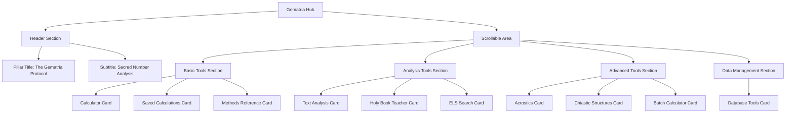
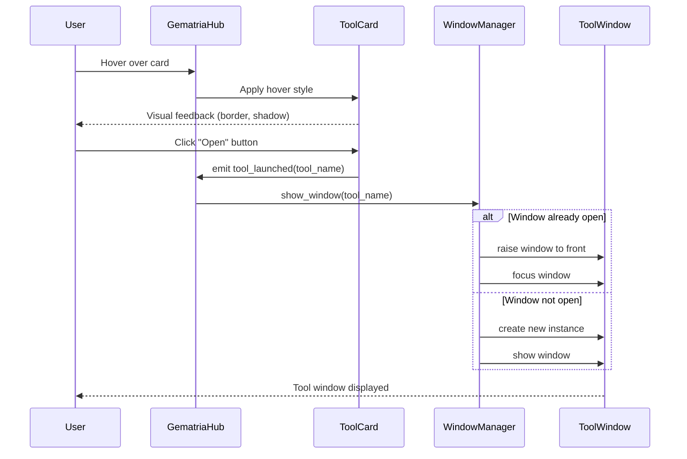

# Gematria Hub: Pillar Launch Interface

<!-- Last Verified: 2026-01-16 -->

<cite>
**Referenced Files in This Document**
- [gematria_hub.py](file://src/pillars/gematria/ui/gematria_hub.py)
- [window_manager.py](file://src/shared/ui/window_manager.py)
- [theme.py](file://src/shared/ui/theme.py)
</cite>

## Table of Contents
1. [Introduction](#introduction)
2. [Layout Structure](#layout-structure)
3. [Card-Based Interface](#card-based-interface)
4. [Tool Categories](#tool-categories)
5. [Visual Design](#visual-design)
6. [User Interaction](#user-interaction)

## Introduction

The **Gematria Hub** is the central launchpad for all Gematria Pillar tools. It presents a card-based interface where each tool is represented by a visually distinct card with icon, title, description, and launch button.

**Hub Philosophy:**
- Visual discoverability over text menus
- Organized by function category
- Consistent card design across all tools
- One-click access to any feature

## Layout Structure



### Hub Layout (Vertical Scroll)

```
┌───────────────────────────────────────────────────────┐
│          THE GEMATRIA PROTOCOL                        │
│        Sacred Number Analysis                         │
├───────────────────────────────────────────────────────┤
│                                                       │
│  ═══════════ BASIC TOOLS ═══════════                 │
│                                                       │
│  ┌──────────────┐ ┌──────────────┐ ┌──────────────┐ │
│  │   📊         │ │   💾         │ │   📖         │ │
│  │ Calculator   │ │    Saved     │ │  Methods     │ │
│  │              │ │ Calculations │ │ Reference    │ │
│  │ [Description]│ │ [Description]│ │ [Description]│ │
│  │   [Open]     │ │   [Open]     │ │   [Open]     │ │
│  └──────────────┘ └──────────────┘ └──────────────┘ │
│                                                       │
│  ═══════════ ANALYSIS TOOLS ═══════════              │
│                                                       │
│  ┌──────────────┐ ┌──────────────┐ ┌──────────────┐ │
│  │   🔍         │ │   📜         │ │   🔗         │ │
│  │    Text      │ │ Holy Book    │ │     ELS      │ │
│  │  Analysis    │ │   Teacher    │ │   Search     │ │
│  │ [Description]│ │ [Description]│ │ [Description]│ │
│  │   [Open]     │ │   [Open]     │ │   [Open]     │ │
│  └──────────────┘ └──────────────┘ └──────────────┘ │
│                                                       │
│  ═══════════ ADVANCED TOOLS ═══════════              │
│                                                       │
│  ┌──────────────┐ ┌──────────────┐ ┌──────────────┐ │
│  │   ✍️          │ │   ⚖️          │ │   ⚡         │ │
│  │  Acrostics   │ │  Chiastic    │ │    Batch     │ │
│  │   Analysis   │ │ Structures   │ │ Calculator   │ │
│  │ [Description]│ │ [Description]│ │ [Description]│ │
│  │   [Open]     │ │   [Open]     │ │   [Open]     │ │
│  └──────────────┘ └──────────────┘ └──────────────┘ │
│                                                       │
│  ═══════════ DATA MANAGEMENT ═══════════             │
│                                                       │
│  ┌──────────────┐                                    │
│  │   🗄️          │                                    │
│  │  Database    │                                    │
│  │    Tools     │                                    │
│  │ [Description]│                                    │
│  │   [Open]     │                                    │
│  └──────────────┘                                    │
│                                                       │
└───────────────────────────────────────────────────────┘
```

## Card-Based Interface

### Card Structure

Each tool card follows this template:

```python
class ToolCard(QFrame):
    """Individual tool card widget."""
    
    def __init__(self, tool_info: ToolInfo):
        super().__init__()
        
        # Card components
        self.icon_label = QLabel()       # Large icon
        self.title_label = QLabel()      # Tool name
        self.desc_label = QLabel()       # Brief description
        self.launch_button = QPushButton("Open")
        
        self._setup_ui()
        self._apply_styling()
```

### Card Visual Design

```
┌─────────────────────────────┐
│           [Icon]             │  ← 48x48px icon
│                              │
│      Tool Name               │  ← 16px bold
│                              │
│  Brief description of the    │  ← 11px regular
│  tool's purpose and primary  │
│  functionality...            │
│                              │
│      ┌──────────┐            │
│      │   Open   │            │  ← Launch button
│      └──────────┘            │
└─────────────────────────────┘
```

### Card Styling

```python
card_style = """
QFrame {
    background-color: white;
    border: 1px solid #BDC3C7;
    border-radius: 8px;
    padding: 16px;
}
QFrame:hover {
    border: 2px solid #E67E22;
    background-color: #F8F9FA;
}
"""
```

**Shadow Effect:**
```python
shadow = QGraphicsDropShadowEffect()
shadow.setBlurRadius(10)
shadow.setXOffset(0)
shadow.setYOffset(2)
shadow.setColor(QColor(0, 0, 0, 30))
card.setGraphicsEffect(shadow)
```

## Tool Categories

### Basic Tools

**1. Calculator (The Logos Abacus)**
- **Icon**: 📊 (Calculator/Abacus)
- **Description**: "Interactive gematria calculator for single words and phrases. Calculate values across multiple cipher systems simultaneously."
- **Opens**: `GematriaCalculatorWindow`
- **Primary Use**: Quick single-text calculations

**2. Saved Calculations (Records of Karnak)**
- **Icon**: 💾 (Disk/Database)
- **Description**: "Browse, search, and manage your saved gematria calculations. Filter by value, method, or custom tags."
- **Opens**: `SavedCalculationsWindow`
- **Primary Use**: Calculation history and retrieval

**3. Methods Reference (The Cipher Codex)**
- **Icon**: 📖 (Book)
- **Description**: "Complete reference guide for all available gematria methods, including Hebrew, Greek, and English systems."
- **Opens**: `MethodsReferenceWindow`
- **Primary Use**: Learning cipher systems

### Analysis Tools

**4. Text Analysis (The Exegesis Window)**
- **Icon**: 🔍 (Magnifying Glass)
- **Description**: "Scan entire documents to find all phrases matching a target gematria value. Advanced filtering and highlighting."
- **Opens**: `ExegesisWindow` (TextAnalysisWindow)
- **Primary Use**: Verse and document analysis

**5. Holy Book Teacher**
- **Icon**: 📜 (Scroll)
- **Description**: "Guided verse analysis with curated teaching rules. Explore sacred texts through numerical patterns."
- **Opens**: `HolyBookTeacherWindow`
- **Primary Use**: Educational verse study

**6. ELS Search (The Resonant Chain)**
- **Icon**: 🔗 (Chain/Link)
- **Description**: "Discover Equidistant Letter Sequences (ELS) hidden within texts. Configurable skip ranges and visualization."
- **Opens**: `ELSSearchWindow`
- **Primary Use**: Code/pattern discovery

### Advanced Tools

**7. Acrostics Analysis**
- **Icon**: ✍️ (Writing Hand)
- **Description**: "Detect hidden messages encoded in first or last letters of lines/words. Multiple detection modes."
- **Opens**: `AcrosticsWindow`
- **Primary Use**: Acrostic pattern discovery

**8. Chiastic Structures**
- **Icon**: ⚖️ (Balance/Symmetry)
- **Description**: "Identify palindromic and symmetrical patterns in text. Visualize chiastic relationships."
- **Opens**: `ChiasticWindow`
- **Primary Use**: Structural analysis

**9. Batch Calculator (The Great Harvest)**
- **Icon**: ⚡ (Lightning/Fast)
- **Description**: "Process entire word lists or documents at once. Bulk calculation with export to CSV/JSON."
- **Opens**: `GreatHarvestWindow` (BatchCalculatorWindow)
- **Primary Use**: Bulk processing

### Data Management

**10. Database Tools**
- **Icon**: 🗄️ (Filing Cabinet)
- **Description**: "Import, export, and maintain your gematria calculation database. Backup and restore functionality."
- **Opens**: `DatabaseToolsWindow`
- **Primary Use**: Data management

## Visual Design

### Color Palette

```python
# From theme.py
HUB_COLORS = {
    "background": "#F5F6FA",        # Light blue-gray
    "card_bg": "#FFFFFF",           # Pure white
    "card_border": "#BDC3C7",       # Light gray
    "card_hover": "#E67E22",        # Orange accent
    "title": "#2C3E50",            # Dark blue
    "subtitle": "#7F8C8D",         # Medium gray
    "section_header": "#34495E",   # Dark gray
    "button_primary": "#E67E22",   # Orange
    "button_hover": "#D35400",     # Dark orange
}
```

### Section Headers

```python
section_style = """
QLabel {
    font-size: 14px;
    font-weight: bold;
    color: #34495E;
    padding: 16px 0 8px 0;
    border-bottom: 2px solid #E67E22;
}
"""
```

### Card Grid Layout

```python
# 3 cards per row
grid_layout = QGridLayout()
grid_layout.setSpacing(16)
grid_layout.setContentsMargins(24, 24, 24, 24)

# Add cards
for i, tool in enumerate(tools):
    row = i // 3
    col = i % 3
    card = ToolCard(tool)
    grid_layout.addWidget(card, row, col)
```

## User Interaction

### Interaction Flow



### Card Interactions

**Hover Effect:**
```python
def enterEvent(self, event):
    """Mouse hover - highlight card."""
    self.setStyleSheet(self.hover_style)
    self.launch_button.setStyleSheet(self.button_hover_style)

def leaveEvent(self, event):
    """Mouse leave - restore normal style."""
    self.setStyleSheet(self.normal_style)
    self.launch_button.setStyleSheet(self.button_normal_style)
```

**Click Handler:**
```python
def on_launch_clicked(self):
    """Launch button clicked."""
    tool_name = self.tool_info.name
    window_id = self.tool_info.window_id
    
    # Emit signal to hub
    self.tool_launched.emit(window_id)
    
    # Visual feedback
    self.launch_button.setText("Opening...")
    self.launch_button.setEnabled(False)
    
    # Re-enable after brief delay
    QTimer.singleShot(500, lambda: (
        self.launch_button.setText("Open"),
        self.launch_button.setEnabled(True)
    ))
```

### Window Management

```python
class GematriaHub(QWidget):
    def __init__(self, window_manager: WindowManager):
        self.window_manager = window_manager
        self._setup_cards()
        self._connect_signals()
    
    def _connect_signals(self):
        """Connect card signals to window manager."""
        for card in self.cards:
            card.tool_launched.connect(self.launch_tool)
    
    def launch_tool(self, window_id: str):
        """Launch requested tool window."""
        # Check if window already exists
        if self.window_manager.has_window(window_id):
            # Bring to front
            self.window_manager.raise_window(window_id)
            self.window_manager.focus_window(window_id)
        else:
            # Create and show new window
            self.window_manager.show_window(window_id)
```

### Keyboard Navigation

```python
# Tab navigation through cards
for i, card in enumerate(self.cards):
    card.setFocusPolicy(Qt.FocusPolicy.StrongFocus)
    if i > 0:
        self.setTabOrder(self.cards[i-1], card)

# Enter key on focused card launches tool
def keyPressEvent(self, event):
    if event.key() == Qt.Key.Key_Return:
        focused_card = QApplication.focusWidget()
        if isinstance(focused_card, ToolCard):
            focused_card.on_launch_clicked()
```

---

**See Also:**
- [calculator_window.md](calculator_window.md) - Calculator tool
- [saved_calculations_window.md](saved_calculations_window.md) - Saved calculations
- [../GUIDES.md](../GUIDES.md) - User guides for each tool

**Revision History:**
- 2026-01-16: Initial hub UI documentation
