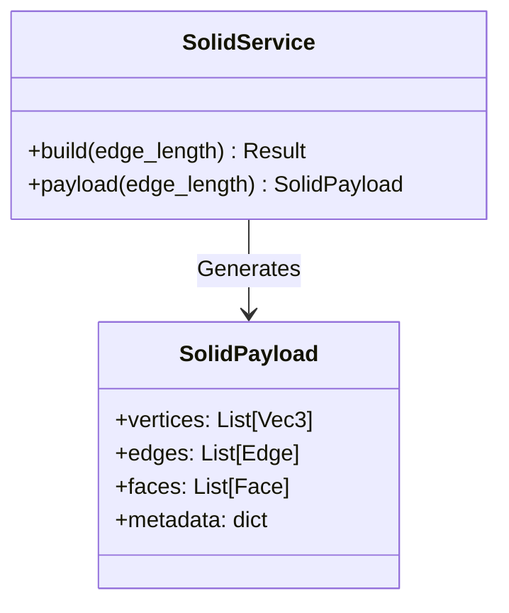

# The Grimoire of Geometry

<!-- Last Verified: 2026-01-01 -->

> *"Let no man ignorant of Geometry enter here."* — Inscription at Plato's Academy

The **Geometry Pillar** is the Weaver of Forms. It allows the Magus to summon perfect shapes from the void, calculating their properties and visualizing their structure in both the flat plane and the deep solid.

---

## I. The Theory of Forms

All forms in the Temple are born from the **Abstract Shape**.
We do not hardcode coordinates for every instance; we define **Generators**.

- **The Generator**: A Service (e.g., `TetrahedronSolidService`) that takes a single seed parameter (usually `edge_length`) and unfolds the entire form.
- **The Bidirectional Law**: If you know the Volume, you know the Edge. If you know the Edge, you know the Surface Area. The system (via `GeometricShape`) can solve for *all* properties given *any* valid input.

---

## II. The Anatomy of the Solid (Data Model)

To pass a 3D form to the visualizer, we use the **Solid Payload**. This is the standard "mesh" definition.

### The Schema (`SolidPayload`)

| Field | Type | Description |
|-------|------|-------------|
| `vertices` | List[Vec3] | The points in 3D space. |
| `edges` | List[Edge] | Pairs of vertex indices (0, 1). |
| `faces` | List[Face] | Lists of vertex indices forming polygons. |
| `labels` | List[Label] | Text annotations anchored in 3D space. |
| `suggested_scale` | Float | Hint for the camera zoom. |



---

## III. The Rites (API Reference)

### 1. The Solids
**Location**: `src/pillars/geometry/services/`

We support the 5 Platonic and 13 Archimedean Solids.

- **Platonic**: Tetrahedron, Cube, Octahedron, Dodecahedron, Icosahedron.
- **Archimedean**: Cuboctahedron, Truncated Tetrahedron, Rhombicuboctahedron, etc.
- **Special**: Golden Pyramid (Great Pyramid of Giza proportions).

**Usage**:
```python
# Summon a Dodecahedron with edge length 1.0
result = DodecahedronSolidService.build(edge_length=1.0)
print(result.metrics.volume)
```

### 2. The Shape Detector
**Location**: `src/pillars/geometry/services/shape_detection_service.py`

The Eye of Analysis.
- `detect_from_points(points)`: Ingests a list of 2D coordinates and determines if they form a known Sacred Shape (Square, Golden Rectangle, Equilateral Triangle).

### 3. The Number Sequences
**Location**: `src/pillars/geometry/services/polygonal_numbers.py`

The Arithmetic of Form.
- `polygonal_number_value(sides, index)`: Calculates the Nth Triangular, Square, or Pentagonal number.
- `star_number_points(index)`: Generates the points of a Star Number (6n(n-1) + 1).

---

## IV. The Visualization Pipeline

1.  **Generation**: Service creates `SolidPayload`.
2.  **Projection**: `Geometry3DView` receives payload.
3.  **Transformation**: Camera Matrix applies Rotation (Yaw/Pitch) + Scale + Pan.
4.  **Rendering**: Orthographic projection draws edges and vertices to the QPainter canvas.

> *"God eternally geometrizes."*
