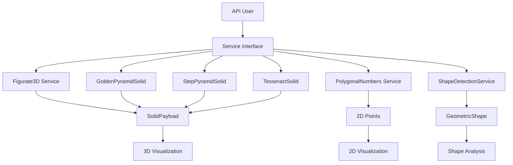
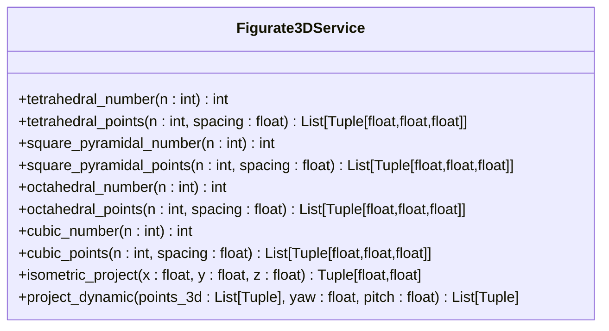
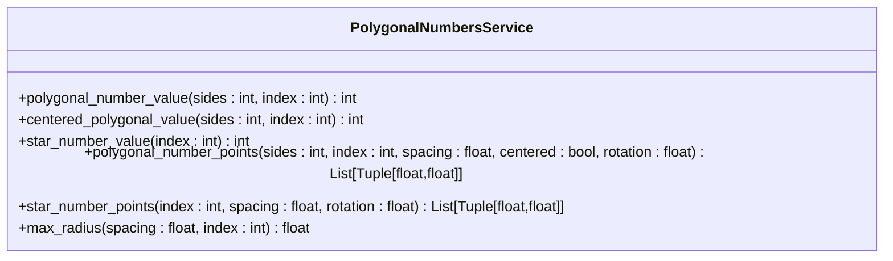
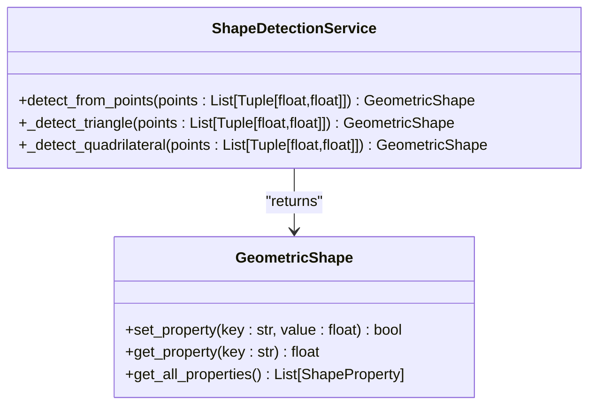
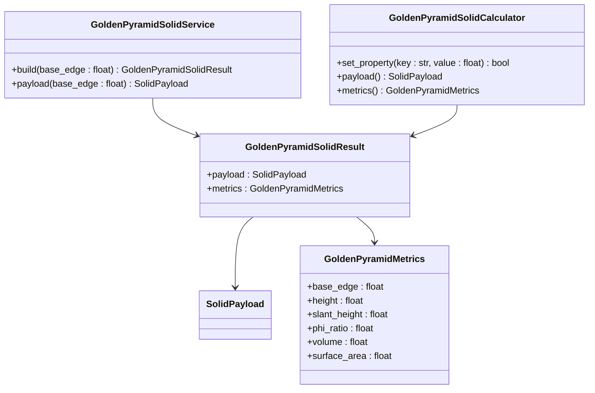
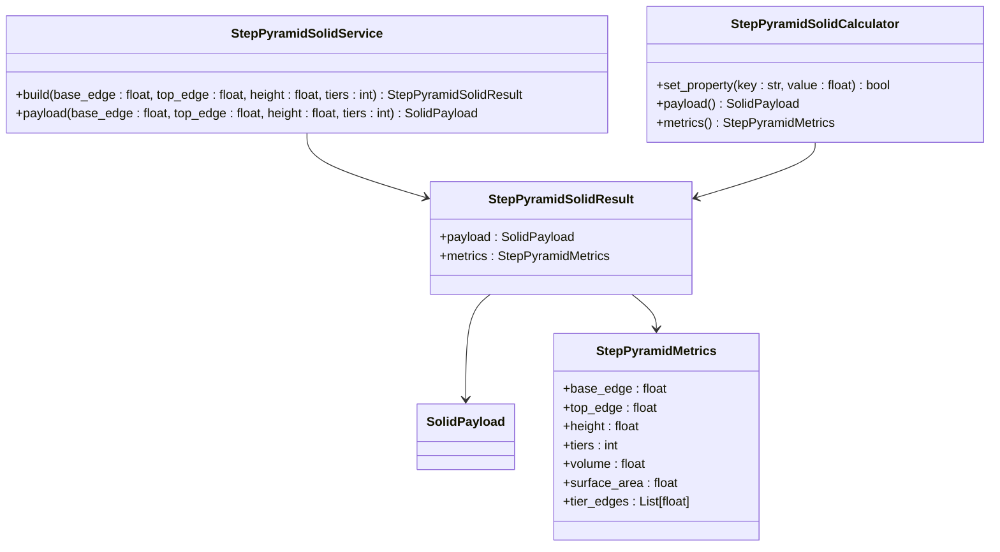
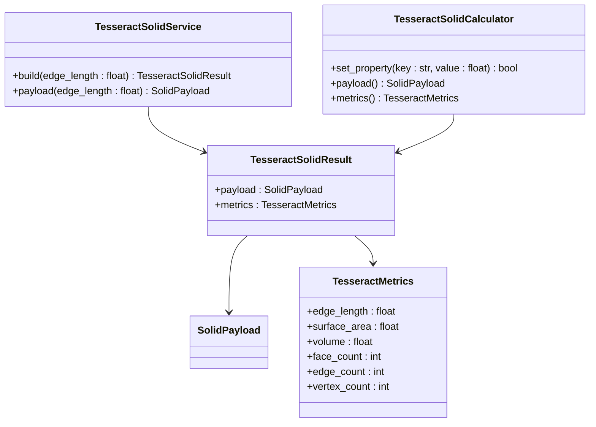
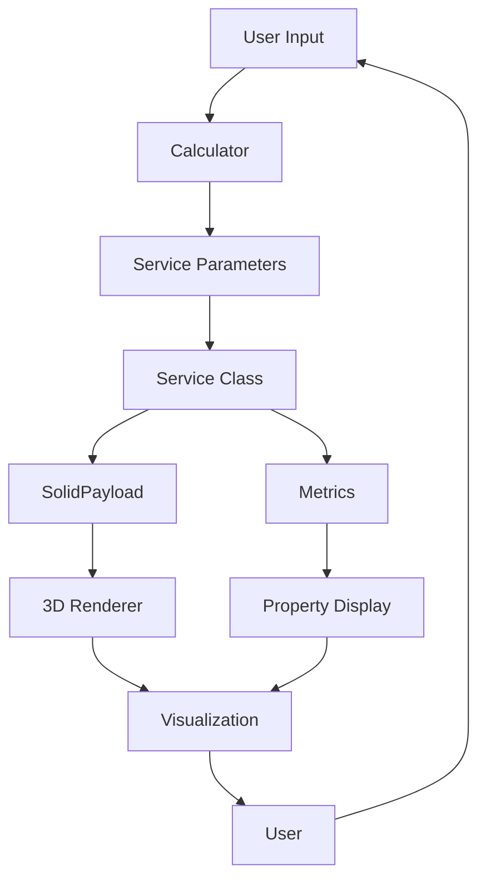

# Advanced Geometry API

<cite>
**Referenced Files in This Document**   
- [figurate_3d.py](file://src/pillars/geometry/services/figurate_3d.py)
- [polygonal_numbers.py](file://src/pillars/geometry/services/polygonal_numbers.py)
- [shape_detection_service.py](file://src/pillars/geometry/services/shape_detection_service.py)
- [golden_pyramid_solid.py](file://src/pillars/geometry/services/golden_pyramid_solid.py)
- [step_pyramid_solid.py](file://src/pillars/geometry/services/step_pyramid_solid.py)
- [tesseract_solid.py](file://src/pillars/geometry/services/tesseract_solid.py)
- [base_shape.py](file://src/pillars/geometry/services/base_shape.py)
- [solid_geometry.py](file://src/pillars/geometry/services/solid_geometry.py)
- [solid_payload.py](file://src/pillars/geometry/shared/solid_payload.py)
</cite>

## Table of Contents
1. [Introduction](#introduction)
2. [Core Services Overview](#core-services-overview)
3. [Figurate3D Service](#figurate3d-service)
4. [PolygonalNumbers Service](#polygonalnumbers-service)
5. [ShapeDetectionService](#shapedetectionservice)
6. [GoldenPyramidSolid](#goldenpyramidsolid)
7. [StepPyramidSolid](#steppyrramidsolid)
8. [TesseractSolid](#tesseractsolid)
9. [Architecture and Data Flow](#architecture-and-data-flow)
10. [Performance and Precision Considerations](#performance-and-precision-considerations)
11. [Usage Examples](#usage-examples)
12. [Conclusion](#conclusion)

## Introduction

The Advanced Geometry API provides a comprehensive suite of geometric services for generating, analyzing, and visualizing complex geometric structures. This API is designed for applications in sacred geometry, mathematical visualization, and pattern recognition. The core functionality is organized into several specialized services that handle 3D figurate numbers, 2D polygonal sequences, geometric pattern detection, and specialized solid constructions including phi-proportioned pyramids, ziggurat-style step pyramids, and 4D hypercube projections.

The API follows a service-oriented architecture where each geometric concept is encapsulated in its own service class with well-defined interfaces. The services provide both computational methods for calculating geometric properties and visualization methods for generating 3D models and 2D projections. The system is designed to handle both exact mathematical relationships and approximate pattern matching with configurable tolerance thresholds.

**Section sources**
- [figurate_3d.py](file://src/pillars/geometry/services/figurate_3d.py#L1-L739)
- [polygonal_numbers.py](file://src/pillars/geometry/services/polygonal_numbers.py#L1-L308)

## Core Services Overview

The Advanced Geometry API consists of several core services that provide specialized functionality for different geometric domains. These services are designed to be used independently or in combination to solve complex geometric problems. The services follow a consistent design pattern with service classes that generate geometric data and calculator classes that provide interactive property manipulation.

The API distinguishes between exact mathematical constructions (such as figurate numbers and golden ratio solids) and approximate pattern recognition (such as shape detection from point clouds). For exact constructions, the API provides closed-form formulas and precise coordinate generation. For pattern recognition, the API uses floating-point comparisons with configurable relative tolerances to handle real-world data imprecision.

All 3D solid services produce `SolidPayload` objects that encapsulate the complete geometric representation of a solid, including vertices, edges, faces, labels, and metadata. This standardized output format enables consistent rendering and analysis across different solid types.



**Diagram sources **
- [figurate_3d.py](file://src/pillars/geometry/services/figurate_3d.py#L1-L739)
- [polygonal_numbers.py](file://src/pillars/geometry/services/polygonal_numbers.py#L1-L308)
- [shape_detection_service.py](file://src/pillars/geometry/services/shape_detection_service.py#L1-L158)
- [solid_payload.py](file://src/pillars/geometry/shared/solid_payload.py#L1-L52)

**Section sources**
- [figurate_3d.py](file://src/pillars/geometry/services/figurate_3d.py#L1-L739)
- [polygonal_numbers.py](file://src/pillars/geometry/services/polygonal_numbers.py#L1-L308)
- [shape_detection_service.py](file://src/pillars/geometry/services/shape_detection_service.py#L1-L158)

## Figurate3D Service

The Figurate3D service provides functionality for generating and analyzing 3D figurate number solids, including tetrahedral, cubic, octahedral, and other polyhedral numbers. This service implements the mathematical formulas for these sequences and provides methods for generating the 3D coordinates of the points that form these geometric arrangements.

The service supports multiple projection methods for visualizing 3D structures in 2D, including isometric projection and dynamic yaw/pitch projection. The isometric projection follows standard conventions with the X axis at 30 degrees down-right, the Y axis at 30 degrees down-left, and the Z axis straight up. The dynamic projection allows for arbitrary viewing angles by specifying yaw (rotation around the Z axis) and pitch (camera tilt) angles.

For each figurate number type, the service provides both a value calculation function and a point generation function. The value calculation uses the closed-form mathematical formula, while the point generation creates the actual 3D coordinates with proper spatial arrangement. The generated points are centered and properly scaled according to the specified spacing parameter.



**Diagram sources **
- [figurate_3d.py](file://src/pillars/geometry/services/figurate_3d.py#L1-L739)

**Section sources**
- [figurate_3d.py](file://src/pillars/geometry/services/figurate_3d.py#L1-L739)

## PolygonalNumbers Service

The PolygonalNumbers service provides functionality for generating 2D polygonal number sequences, including triangular, square, pentagonal, and other polygonal numbers. The service supports both standard polygonal numbers (which grow from a shared corner) and centered polygonal numbers (which grow in concentric rings from a central point).

For standard polygonal numbers, the service implements the closed-form formula P_s(n) = ((s-2)n² - (s-4)n) / 2, where s is the number of sides and n is the index. For centered polygonal numbers, it uses the formula C_s(n) = s × n × (n-1) / 2 + 1. The service also supports star numbers (centered hexagrams) with the formula 6n(n-1) + 1.

The point generation methods create the actual 2D coordinates of the dots that form these number patterns. For standard polygonal numbers, the points are arranged in gnomon layers that expand from one vertex. For centered polygonal numbers, the points are arranged in concentric rings around the center point. The service provides options for spacing, rotation, and whether to generate standard or centered patterns.



**Diagram sources **
- [polygonal_numbers.py](file://src/pillars/geometry/services/polygonal_numbers.py#L1-L308)

**Section sources**
- [polygonal_numbers.py](file://src/pillars/geometry/services/polygonal_numbers.py#L1-L308)

## ShapeDetectionService

The ShapeDetectionService provides automated recognition of geometric patterns in point clouds or coordinate sets. This service analyzes a set of 2D points and determines the most specific geometric shape that matches the pattern, with configurable tolerance for floating-point comparisons.

The service uses a hierarchical detection approach based on the number of points. For three points, it detects triangle types (equilateral, isosceles, right, scalene) by comparing side lengths and checking the Pythagorean theorem. For four points, it detects quadrilateral types (square, rectangle, rhombus, parallelogram) by analyzing side lengths, diagonal lengths, and angle relationships. For more than four points, it classifies the shape as an irregular polygon.

The detection algorithms use relative tolerance comparisons (rel_tol=1e-4) to account for floating-point precision limitations. For example, an equilateral triangle is identified when all three sides are within 0.01% of each other. A right triangle is identified when the sum of the squares of the two shorter sides is within 0.01% of the square of the longest side.



**Diagram sources **
- [shape_detection_service.py](file://src/pillars/geometry/services/shape_detection_service.py#L1-L158)
- [base_shape.py](file://src/pillars/geometry/services/base_shape.py#L1-L143)

**Section sources**
- [shape_detection_service.py](file://src/pillars/geometry/services/shape_detection_service.py#L1-L158)

## GoldenPyramidSolid

The GoldenPyramidSolid service generates phi-proportioned pyramids where the slant height is in golden ratio to half the base edge. This service implements the mathematical relationships that define a golden pyramid, where the ratio of the slant height to half the base edge equals φ = (1 + √5) / 2 ≈ 1.618.

The service provides both a service class for generating solid payloads and a calculator class for interactive manipulation of the pyramid's properties. The calculator allows users to set any one of the primary dimensions (base edge, height, slant height, or volume) and automatically calculates all other dependent properties while maintaining the golden ratio constraint.

The solid payload includes the complete 3D model with vertices, edges, and faces, along with labels that display key measurements. The vertices are arranged with the base centered at z = -height/2 and the apex at z = height/2, ensuring proper centering for visualization. The metadata includes all calculated properties such as surface area, volume, and various ratios.



**Diagram sources **
- [golden_pyramid_solid.py](file://src/pillars/geometry/services/golden_pyramid_solid.py#L1-L212)

**Section sources**
- [golden_pyramid_solid.py](file://src/pillars/geometry/services/golden_pyramid_solid.py#L1-L212)

## StepPyramidSolid

The StepPyramidSolid service generates ziggurat-style constructions with multiple terraced levels. This service creates pyramids that consist of a series of stacked square platforms, each smaller than the one below, creating a stepped profile. The service allows configuration of the base edge, top edge, height, and number of tiers.

The geometry is constructed by interpolating the edge lengths between the base and top values across the specified number of tiers. Each tier is a square platform at a specific height, with vertical edges connecting corresponding corners of adjacent tiers. The service calculates the volume as the sum of the volumes of the individual tier layers and the lateral surface area as the sum of the areas of the vertical faces.

The calculator interface allows interactive adjustment of all four parameters (base edge, top edge, height, and tiers). When any parameter is changed, all dependent properties are recalculated while maintaining the structural integrity of the stepped pyramid. The top edge must be smaller than the base edge, and the number of tiers must be at least one.



**Diagram sources **
- [step_pyramid_solid.py](file://src/pillars/geometry/services/step_pyramid_solid.py#L1-L268)

**Section sources**
- [step_pyramid_solid.py](file://src/pillars/geometry/services/step_pyramid_solid.py#L1-L268)

## TesseractSolid

The TesseractSolid service generates 4D hypercube projections using Schlegel diagrams. A tesseract (4D hypercube) has 16 vertices, 32 edges, and 24 faces, all of which are cubes. The service creates a 3D projection of this 4D object by using a "cube within a cube" construction with connecting edges.

The projection is created by defining an outer cube and an inner cube (scaled by 0.5), with edges connecting corresponding vertices. The faces include the six faces of the outer cube, the six faces of the inner cube, and 12 connector faces that join the edges of the outer cube to the corresponding edges of the inner cube. This creates a total of 24 faces, all of which are quadrilaterals.

The service provides scaling functionality so that the edge length can be specified, with all other dimensions scaled proportionally. The calculator allows users to set the edge length, surface area, or volume, and automatically recalculates the other properties. The surface area scales with the square of the edge length, while the volume scales with the cube of the edge length.



**Diagram sources **
- [tesseract_solid.py](file://src/pillars/geometry/services/tesseract_solid.py#L1-L220)

**Section sources**
- [tesseract_solid.py](file://src/pillars/geometry/services/tesseract_solid.py#L1-L220)

## Architecture and Data Flow

The Advanced Geometry API follows a clean, modular architecture with well-defined interfaces between components. The core architectural pattern is the Service-Result pattern, where service classes generate result objects that contain both the geometric data (SolidPayload) and the calculated metrics.

The data flow begins with user input parameters that are passed to service classes. These services perform the geometric calculations and coordinate generation, producing SolidPayload objects that encapsulate the complete 3D representation. The SolidPayload class contains vertices (3D coordinates), edges (pairs of vertex indices), faces (sequences of vertex indices), labels (text annotations with positions), and metadata (calculated properties).

Calculator classes provide an interactive layer on top of the service classes, allowing users to manipulate properties and automatically recalculate dependent values. When a user changes a property, the calculator updates the corresponding service parameters and regenerates the result. This creates a responsive interface where changing one dimension automatically updates all related measurements.

The visualization layer consumes the SolidPayload objects and renders them in 3D using orthographic projection. The UI components provide controls for camera manipulation, property editing, and solid selection, creating a comprehensive geometric exploration environment.



**Diagram sources **
- [solid_payload.py](file://src/pillars/geometry/shared/solid_payload.py#L1-L52)
- [golden_pyramid_solid.py](file://src/pillars/geometry/services/golden_pyramid_solid.py#L1-L212)
- [step_pyramid_solid.py](file://src/pillars/geometry/services/step_pyramid_solid.py#L1-L268)
- [tesseract_solid.py](file://src/pillars/geometry/services/tesseract_solid.py#L1-L220)

**Section sources**
- [solid_payload.py](file://src/pillars/geometry/shared/solid_payload.py#L1-L52)
- [solid_geometry.py](file://src/pillars/geometry/services/solid_geometry.py#L1-L156)

## Performance and Precision Considerations

The Advanced Geometry API addresses both computational complexity and floating-point precision issues in its design. For pattern detection algorithms, the computational complexity is O(n²) for shape detection with n points, as the algorithms must calculate distances between all pairs of points. However, this is acceptable for the typical use case of small point sets (3-10 points).

For higher-dimensional objects like the tesseract, the complexity is constant since the structure is predefined. The figurate number generators have O(n³) complexity for cubic arrangements and O(n²) for pyramidal arrangements, where n is the order of the number. These complexities are manageable for visualization purposes where n typically ranges from 1 to 10.

Floating-point precision is a critical consideration, especially for golden ratio calculations and pattern matching. The API uses relative tolerance comparisons (rel_tol=1e-4) rather than exact equality checks to handle floating-point imprecision. For golden ratio calculations, the value of φ is computed as (1 + √5) / 2 at module load time and reused throughout the application to ensure consistency.

The API also includes validation checks to prevent invalid inputs, such as negative dimensions or top edges larger than base edges in step pyramids. Error handling is implemented through standard Python exceptions, with appropriate error messages to guide users toward valid inputs.

**Section sources**
- [shape_detection_service.py](file://src/pillars/geometry/services/shape_detection_service.py#L1-L158)
- [golden_pyramid_solid.py](file://src/pillars/geometry/services/golden_pyramid_solid.py#L1-L212)
- [step_pyramid_solid.py](file://src/pillars/geometry/services/step_pyramid_solid.py#L1-L268)

## Usage Examples

The following examples demonstrate common use cases for the Advanced Geometry API:

**Generating a tetrahedral number solid:**
```python
from src.pillars.geometry.services import tetrahedral_points, isometric_project

# Generate a 4th-order tetrahedral arrangement
points_3d = tetrahedral_points(n=4, spacing=1.0)

# Project to 2D for visualization
points_2d = isometric_project(points_3d)

# The result contains 20 points arranged in a tetrahedral pattern
assert len(points_3d) == 20  # 4th tetrahedral number
```

**Detecting a sacred geometry pattern:**
```python
from src.pillars.geometry.services import ShapeDetectionService

# Define points forming a golden rectangle
points = [(0, 0), (1.618, 0), (1.618, 1), (0, 1)]

# Detect the shape
shape = ShapeDetectionService.detect_from_points(points)

# The result should be a rectangle with golden ratio proportions
if isinstance(shape, RectangleShape):
    length = shape.get_property("length")
    width = shape.get_property("width")
    ratio = length / width
    assert abs(ratio - 1.618) < 0.01
```

**Creating a phi-proportioned pyramid:**
```python
from src.pillars.geometry.services import GoldenPyramidSolidCalculator

# Create a calculator for a golden pyramid
calc = GoldenPyramidSolidCalculator(base_edge=440.0)

# Get the solid payload for rendering
payload = calc.payload()

# Verify the golden ratio relationship
metrics = calc.metrics()
slant_to_half_base = metrics.slant_height / (metrics.base_edge / 2)
assert abs(slant_to_half_base - 1.618) < 0.001
```

**Generating a 4D hypercube projection:**
```python
from src.pillars.geometry.services import TesseractSolidService

# Generate a tesseract with edge length 2.0
result = TesseractSolidService.build(edge_length=2.0)

# Verify the tesseract properties
assert len(result.payload.vertices) == 16
assert len(result.payload.edges) == 32
assert len(result.payload.faces) == 24
assert result.metrics.edge_length == 2.0
```

**Section sources**
- [figurate_3d.py](file://src/pillars/geometry/services/figurate_3d.py#L1-L739)
- [shape_detection_service.py](file://src/pillars/geometry/services/shape_detection_service.py#L1-L158)
- [golden_pyramid_solid.py](file://src/pillars/geometry/services/golden_pyramid_solid.py#L1-L212)
- [tesseract_solid.py](file://src/pillars/geometry/services/tesseract_solid.py#L1-L220)

## Conclusion

The Advanced Geometry API provides a comprehensive set of tools for working with complex geometric structures, from basic polygonal numbers to 4D hypercube projections. The API's modular design with specialized services for different geometric domains makes it easy to use and extend. The consistent interface pattern across services enables developers to quickly learn and apply the API to new problems.

Key strengths of the API include its precise mathematical foundations, robust handling of floating-point precision issues, and rich visualization capabilities. The service-calculator pattern provides both programmatic access to geometric calculations and interactive manipulation of geometric properties. The SolidPayload format standardizes the representation of 3D solids across different service types, enabling consistent rendering and analysis.

The API is well-suited for applications in sacred geometry, mathematical education, and geometric pattern recognition. Its extensible design allows for the addition of new geometric services while maintaining compatibility with existing visualization and analysis tools. With its comprehensive feature set and robust implementation, the Advanced Geometry API serves as a powerful foundation for geometric computation and visualization.