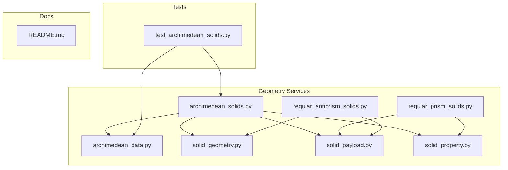
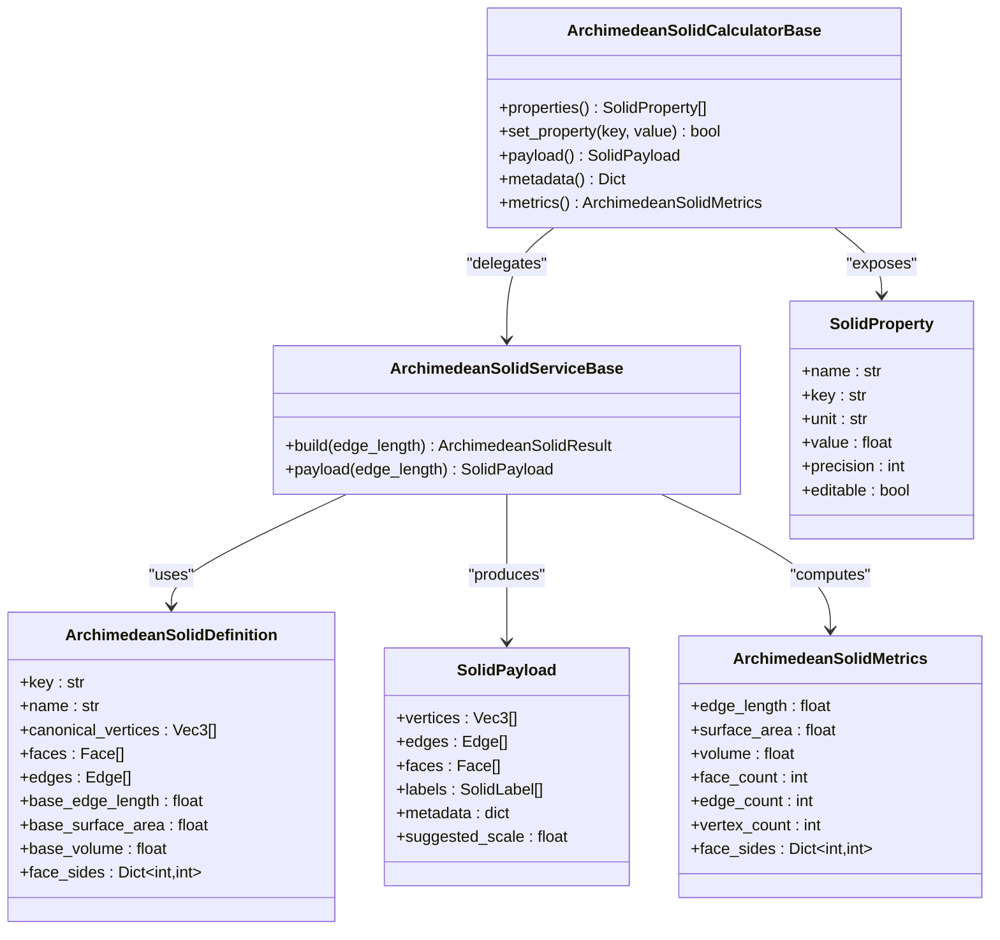
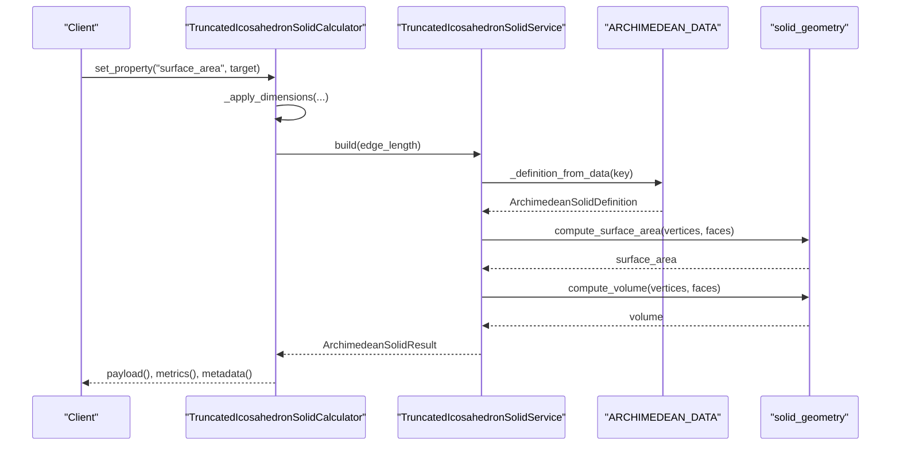
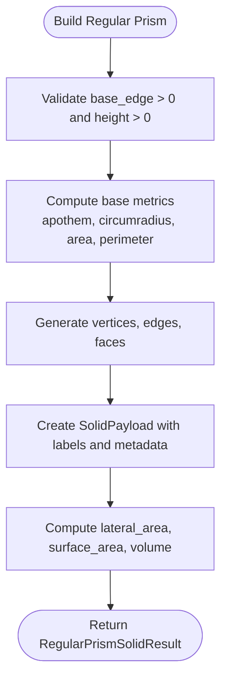
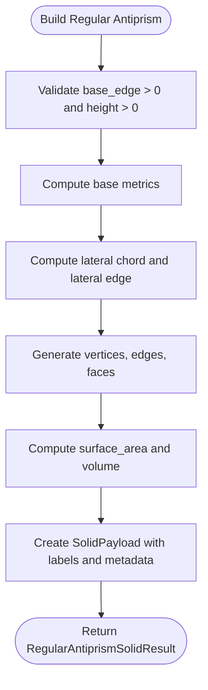
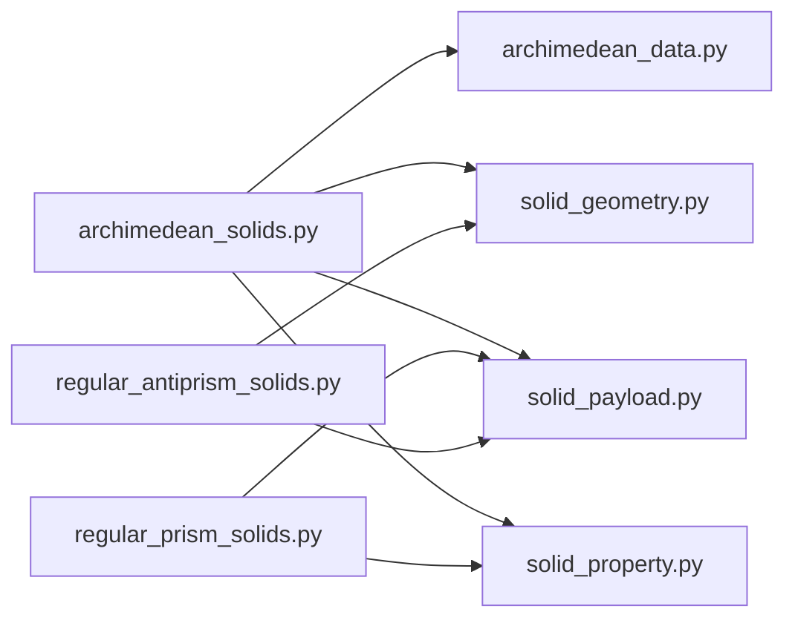

# Archimedean Solids API

<cite>
**Referenced Files in This Document**
- [archimedean_solids.py](file://src/pillars/geometry/services/archimedean_solids.py)
- [archimedean_data.py](file://src/pillars/geometry/services/archimedean_data.py)
- [solid_geometry.py](file://src/pillars/geometry/services/solid_geometry.py)
- [solid_payload.py](file://src/pillars/geometry/shared/solid_payload.py)
- [solid_property.py](file://src/pillars/geometry/services/solid_property.py)
- [regular_prism_solids.py](file://src/pillars/geometry/services/regular_prism_solids.py)
- [regular_antiprism_solids.py](file://src/pillars/geometry/services/regular_antiprism_solids.py)
- [test_archimedean_solids.py](file://test/test_archimedean_solids.py)
- [README.md](file://README.md)
</cite>

## Table of Contents
1. [Introduction](#introduction)
2. [Project Structure](#project-structure)
3. [Core Components](#core-components)
4. [Architecture Overview](#architecture-overview)
5. [Detailed Component Analysis](#detailed-component-analysis)
6. [Dependency Analysis](#dependency-analysis)
7. [Performance Considerations](#performance-considerations)
8. [Troubleshooting Guide](#troubleshooting-guide)
9. [Conclusion](#conclusion)
10. [Appendices](#appendices)

## Introduction
This document provides API documentation for the Archimedean Solids service, covering the generation of all 13 Archimedean solids, including truncated forms, cuboctahedron, icosidodecahedron, and snub variants. It also documents RegularPrismSolids and RegularAntiprismSolids as supporting services for infinite families of vertex-transitive polyhedra. The documentation specifies parameter requirements (edge length, truncation ratio), vertex configuration notation, symmetry group information, and methods for accessing face types, vertex coordinates, and topological data. It includes examples for generating truncated icosahedrons (buckyballs), rhombicuboctahedrons, and snub cubes, and addresses numerical precision in iterative construction algorithms and memory optimization for high-vertex-count solids.

## Project Structure
The Archimedean Solids API resides in the geometry pillar under the services layer. Supporting services for prismatic and antiprismatic families are included alongside. The API relies on shared payload and geometry utilities for consistent data representation and computation.

**Diagram sources**
- [archimedean_solids.py](file://src/pillars/geometry/services/archimedean_solids.py#L1-L406)
- [archimedean_data.py](file://src/pillars/geometry/services/archimedean_data.py#L1-L1106)
- [solid_geometry.py](file://src/pillars/geometry/services/solid_geometry.py#L1-L156)
- [solid_payload.py](file://src/pillars/geometry/shared/solid_payload.py#L1-L52)
- [solid_property.py](file://src/pillars/geometry/services/solid_property.py#L1-L21)
- [regular_prism_solids.py](file://src/pillars/geometry/services/regular_prism_solids.py#L1-L314)
- [regular_antiprism_solids.py](file://src/pillars/geometry/services/regular_antiprism_solids.py#L1-L338)
- [test_archimedean_solids.py](file://test/test_archimedean_solids.py#L1-L99)
- [README.md](file://README.md#L94-L111)

**Section sources**
- [README.md](file://README.md#L94-L111)

## Core Components
- ArchimedeanSolidServiceBase: Base class for generating Archimedean solids with uniform edge length scaling. Provides build and payload methods and computes derived metrics.
- ArchimedeanSolidCalculatorBase: Calculator base that exposes SolidProperty entries for edge length, surface area, volume, counts, and face composition. Supports property-driven scaling.
- ArchimedeanSolidDefinition: Immutable definition containing canonical vertices, faces, edges, and base metrics for a solid.
- ArchimedeanSolidMetrics: Metrics container for computed quantities (edge length, surface area, volume, counts, face composition).
- ArchimedeanSolidResult: Aggregates SolidPayload and ArchimedeanSolidMetrics.
- RegularPrismSolidServiceBase and CalculatorBase: Generate right regular prisms with configurable base edge and height, exposing base apothem, circumradius, lateral area, surface area, and volume.
- RegularAntiprismSolidServiceBase and CalculatorBase: Generate right regular antiprisms with configurable base edge and height, exposing lateral edge length, lateral chord length, lateral area, surface area, and volume.

Key capabilities:
- Vertex configuration notation: Faces are sequences of vertex indices; edges are deduplicated pairs; vertices are 3D coordinates.
- Topological data: Edges are derived from faces; counts are computed and exposed via metadata and metrics.
- Symmetry groups: The dataset includes canonical vertex coordinates; the code does not expose explicit symmetry group identifiers.

**Section sources**
- [archimedean_solids.py](file://src/pillars/geometry/services/archimedean_solids.py#L1-L406)
- [solid_payload.py](file://src/pillars/geometry/shared/solid_payload.py#L1-L52)
- [solid_property.py](file://src/pillars/geometry/services/solid_property.py#L1-L21)
- [regular_prism_solids.py](file://src/pillars/geometry/services/regular_prism_solids.py#L1-L314)
- [regular_antiprism_solids.py](file://src/pillars/geometry/services/regular_antiprism_solids.py#L1-L338)

## Architecture Overview
The Archimedean Solids API follows a layered architecture:
- Data layer: Canonical datasets for 13 Archimedean solids.
- Service layer: Builders that scale canonical geometry to user-specified edge length and compute derived metrics.
- Payload layer: Standardized SolidPayload with vertices, edges, faces, labels, and metadata.
- Calculator layer: Property-driven interface enabling scaling by edge length, surface area, or volume.

**Diagram sources**
- [archimedean_solids.py](file://src/pillars/geometry/services/archimedean_solids.py#L1-L406)
- [solid_payload.py](file://src/pillars/geometry/shared/solid_payload.py#L1-L52)
- [solid_property.py](file://src/pillars/geometry/services/solid_property.py#L1-L21)

## Detailed Component Analysis

### Archimedean Solids API
- Parameter requirements:
  - Edge length: Positive float; controls uniform scaling of canonical geometry.
  - Truncation ratio: Not a direct parameter in the API; scaling is controlled by edge length. Some solids are truncated by design (e.g., truncated icosahedron). For property-driven scaling, surface area and volume are supported.
- Vertex configuration notation:
  - Vertices: List of 3D coordinates.
  - Faces: Sequences of vertex indices; ordering is preserved and normalized consistently.
  - Edges: Deduplicated pairs of vertex indices derived from faces.
- Symmetry group information:
  - The dataset provides canonical coordinates; symmetry groups are not explicitly exposed by the API.
- Methods for accessing data:
  - build(edge_length): Returns ArchimedeanSolidResult with SolidPayload and metrics.
  - payload(edge_length): Convenience method returning SolidPayload.
  - Calculator set_property(key, value): Supports edge_length, surface_area, volume scaling.

Examples:
- Truncated icosahedron (buckyball): Use TruncatedIcosahedronSolidService.build(edge_length) or TruncatedIcosahedronSolidCalculator with set_property('surface_area', ...) or set_property('volume', ...).
- Rhombicuboctahedron: Use RhombicuboctahedronSolidService.build(edge_length).
- Snub cube: Use SnubCubeSolidService.build(edge_length).

**Diagram sources**
- [archimedean_solids.py](file://src/pillars/geometry/services/archimedean_solids.py#L1-L406)
- [archimedean_data.py](file://src/pillars/geometry/services/archimedean_data.py#L1-L1106)
- [solid_geometry.py](file://src/pillars/geometry/services/solid_geometry.py#L1-L156)

**Section sources**
- [archimedean_solids.py](file://src/pillars/geometry/services/archimedean_solids.py#L1-L406)
- [archimedean_data.py](file://src/pillars/geometry/services/archimedean_data.py#L1-L1106)
- [solid_geometry.py](file://src/pillars/geometry/services/solid_geometry.py#L1-L156)
- [test_archimedean_solids.py](file://test/test_archimedean_solids.py#L1-L99)

### RegularPrismSolids API
- Parameters:
  - base_edge: Positive float.
  - height: Positive float.
- Metrics exposed:
  - Base apothem, base circumradius, base area, base perimeter, lateral area, surface area, volume.
- Methods:
  - build(base_edge, height): Returns RegularPrismSolidResult with SolidPayload and metrics.
  - payload(base_edge, height): Convenience method returning SolidPayload.
  - Calculator set_property(key, value): Supports base_edge, height, base_apothem, base_area, volume.

**Diagram sources**
- [regular_prism_solids.py](file://src/pillars/geometry/services/regular_prism_solids.py#L1-L314)

**Section sources**
- [regular_prism_solids.py](file://src/pillars/geometry/services/regular_prism_solids.py#L1-L314)

### RegularAntiprismSolids API
- Parameters:
  - base_edge: Positive float.
  - height: Positive float.
- Metrics exposed:
  - Base apothem, base circumradius, base area, base perimeter, lateral edge length, lateral chord length, lateral area, surface area, volume.
- Methods:
  - build(base_edge, height): Returns RegularAntiprismSolidResult with SolidPayload and metrics.
  - payload(base_edge, height): Convenience method returning SolidPayload.
  - Calculator set_property(key, value): Supports base_edge, height, lateral_edge_length, volume.

**Diagram sources**
- [regular_antiprism_solids.py](file://src/pillars/geometry/services/regular_antiprism_solids.py#L1-L338)

**Section sources**
- [regular_antiprism_solids.py](file://src/pillars/geometry/services/regular_antiprism_solids.py#L1-L338)

## Dependency Analysis
- Archimedean solids depend on:
  - ARCHIMEDEAN_DATA for canonical geometry.
  - solid_geometry for surface area, volume, and edge derivation from faces.
  - solid_payload for standardized output and metadata.
  - solid_property for property definitions.
- Prisms and antiprisms depend on:
  - solid_geometry for surface area and volume.
  - regular_prism_solids utilities for polygonal base computations.

**Diagram sources**
- [archimedean_solids.py](file://src/pillars/geometry/services/archimedean_solids.py#L1-L406)
- [archimedean_data.py](file://src/pillars/geometry/services/archimedean_data.py#L1-L1106)
- [solid_geometry.py](file://src/pillars/geometry/services/solid_geometry.py#L1-L156)
- [solid_payload.py](file://src/pillars/geometry/shared/solid_payload.py#L1-L52)
- [solid_property.py](file://src/pillars/geometry/services/solid_property.py#L1-L21)
- [regular_prism_solids.py](file://src/pillars/geometry/services/regular_prism_solids.py#L1-L314)
- [regular_antiprism_solids.py](file://src/pillars/geometry/services/regular_antiprism_solids.py#L1-L338)

**Section sources**
- [archimedean_solids.py](file://src/pillars/geometry/services/archimedean_solids.py#L1-L406)
- [regular_prism_solids.py](file://src/pillars/geometry/services/regular_prism_solids.py#L1-L314)
- [regular_antiprism_solids.py](file://src/pillars/geometry/services/regular_antiprism_solids.py#L1-L338)

## Performance Considerations
- Numerical precision:
  - Vertex coordinates are provided as floating-point values in canonical datasets. Scaling is performed by multiplying coordinates by a uniform factor. Tests confirm that computed surface area and volume match metadata and metrics.
  - Angle computations for face ordering use atan2 with normalized vectors; tolerance thresholds are present in vector operations to handle degeneracies.
- Memory optimization:
  - Definitions are cached in-memory to avoid recomputation.
  - Edges are derived from faces using a set-based deduplication approach; this ensures O(F + E) edge generation where F is number of faces.
  - Payloads are constructed once per build and reused via calculator caching.
- High-vertex-count solids:
  - For solids with many vertices (e.g., snub variants), prefer calculator-based property setting to avoid repeated builds.
  - Use metadata and metrics to validate counts and compositions without reprocessing geometry.

[No sources needed since this section provides general guidance]

## Troubleshooting Guide
Common issues and resolutions:
- Invalid parameters:
  - Edge length, base edge, or height must be positive. Negative or zero values raise errors in service and calculator constructors.
- Property scaling conflicts:
  - Setting lateral_edge_length for antiprisms requires the lateral edge to be greater than the lateral chord; otherwise, the operation fails.
- Surface area/volume scaling:
  - Scaling by surface area or volume adjusts edge length proportionally; ensure the base metrics are available and positive.
- Verification:
  - Unit tests validate that generated payloads match dataset counts and that property-driven scaling yields expected results.

**Section sources**
- [archimedean_solids.py](file://src/pillars/geometry/services/archimedean_solids.py#L1-L406)
- [regular_antiprism_solids.py](file://src/pillars/geometry/services/regular_antiprism_solids.py#L1-L338)
- [test_archimedean_solids.py](file://test/test_archimedean_solids.py#L1-L99)

## Conclusion
The Archimedean Solids API provides a robust, property-driven interface for generating and manipulating vertex-transitive polyhedra. It offers standardized access to vertex coordinates, face types, edges, and topological metrics, with support for scaling by edge length, surface area, or volume. The RegularPrismSolids and RegularAntiprismSolids services complement the API by offering infinite families of vertex-transitive prismatic and antiprismatic solids. The design emphasizes numerical stability, consistent data structures, and efficient caching for performance.

[No sources needed since this section summarizes without analyzing specific files]

## Appendices

### API Reference Summary

- ArchimedeanSolids
  - Services: CuboctahedronSolidService, TruncatedTetrahedronSolidService, TruncatedCubeSolidService, TruncatedOctahedronSolidService, RhombicuboctahedronSolidService, RhombicosidodecahedronSolidService, TruncatedCuboctahedronSolidService, IcosidodecahedronSolidService, TruncatedDodecahedronSolidService, TruncatedIcosahedronSolidService, TruncatedIcosidodecahedronSolidService, SnubCubeSolidService, SnubDodecahedronSolidService.
  - Methods: build(edge_length), payload(edge_length).
  - Calculators: Each service has a corresponding calculator with set_property('edge_length'|'surface_area'|'volume', value).

- RegularPrismSolids
  - Services: TriangularPrismSolidService, PentagonalPrismSolidService, HexagonalPrismSolidService, OctagonalPrismSolidService, HeptagonalPrismSolidService.
  - Methods: build(base_edge, height), payload(base_edge, height).
  - Calculators: set_property('base_edge'|'height'|'base_apothem'|'base_area'|'volume', value).

- RegularAntiprismSolids
  - Services: TriangularAntiprismSolidService, SquareAntiprismSolidService, PentagonalAntiprismSolidService, HexagonalAntiprismSolidService, OctagonalAntiprismSolidService, HeptagonalAntiprismSolidService.
  - Methods: build(base_edge, height), payload(base_edge, height).
  - Calculators: set_property('base_edge'|'height'|'lateral_edge_length'|'volume', value).

**Section sources**
- [archimedean_solids.py](file://src/pillars/geometry/services/archimedean_solids.py#L1-L406)
- [regular_prism_solids.py](file://src/pillars/geometry/services/regular_prism_solids.py#L1-L314)
- [regular_antiprism_solids.py](file://src/pillars/geometry/services/regular_antiprism_solids.py#L1-L338)