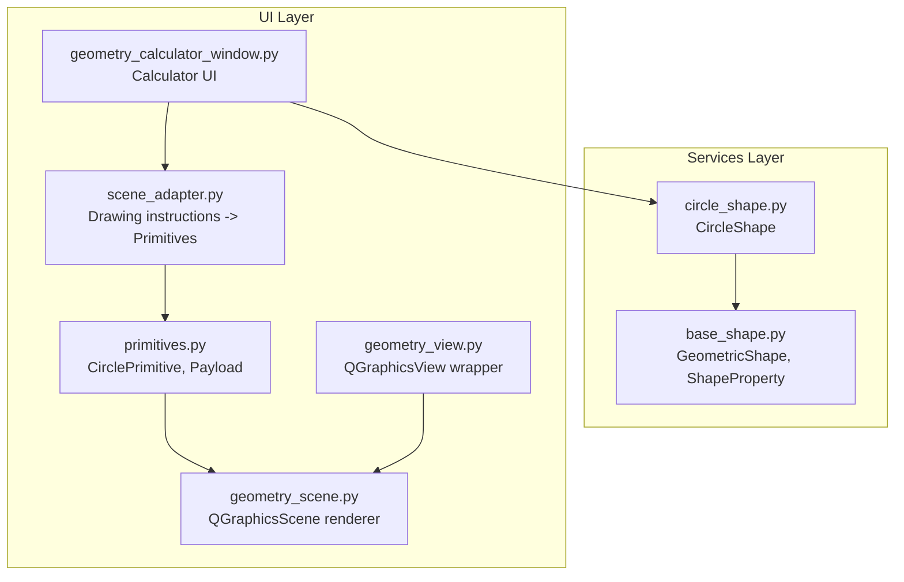
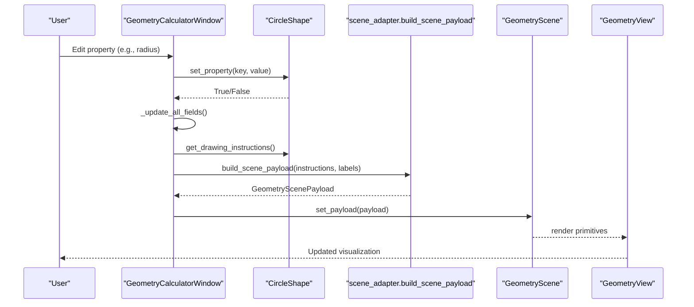
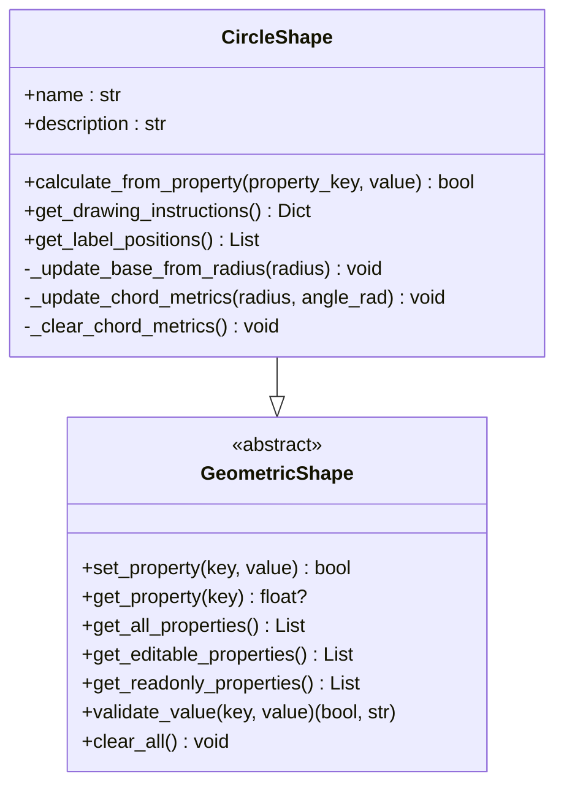
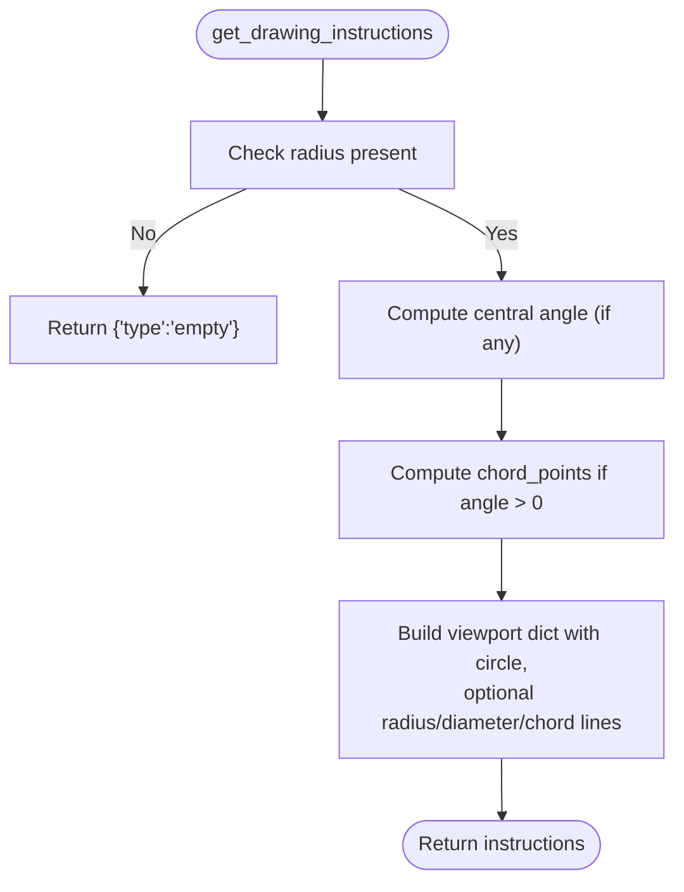
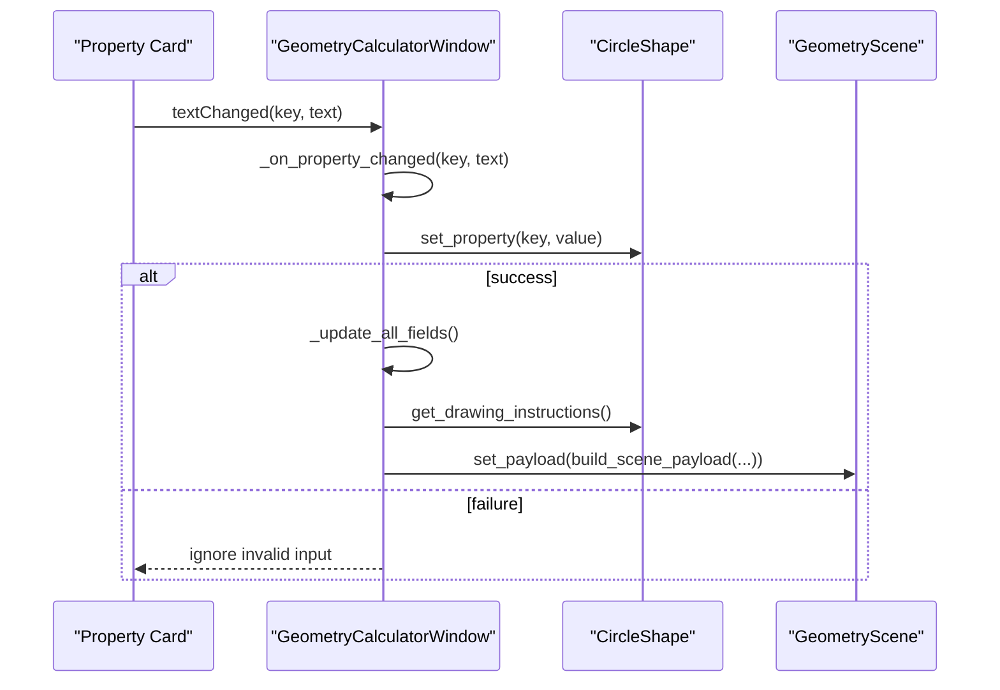
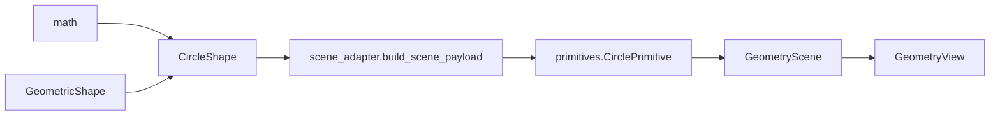

# Circle Shape

<cite>
**Referenced Files in This Document**
- [circle_shape.py](file://src/pillars/geometry/services/circle_shape.py)
- [base_shape.py](file://src/pillars/geometry/services/base_shape.py)
- [geometry_calculator_window.py](file://src/pillars/geometry/ui/geometry_calculator_window.py)
- [geometry_view.py](file://src/pillars/geometry/ui/geometry_view.py)
- [geometry_scene.py](file://src/pillars/geometry/ui/geometry_scene.py)
- [primitives.py](file://src/pillars/geometry/ui/primitives.py)
- [scene_adapter.py](file://src/pillars/geometry/ui/scene_adapter.py)
</cite>

## Table of Contents
1. [Introduction](#introduction)
2. [Project Structure](#project-structure)
3. [Core Components](#core-components)
4. [Architecture Overview](#architecture-overview)
5. [Detailed Component Analysis](#detailed-component-analysis)
6. [Dependency Analysis](#dependency-analysis)
7. [Performance Considerations](#performance-considerations)
8. [Troubleshooting Guide](#troubleshooting-guide)
9. [Conclusion](#conclusion)

## Introduction
This document provides API documentation for the CircleShape class, focusing on its radius-based geometry calculations and integration with the geometry visualization pipeline. It covers:
- Core metrics: area (πr²), circumference (2πr), diameter (2r)
- Circular segment and sector metrics: arc length, chord length, sagitta (versine), sector area, segment area
- Solving missing properties from partial inputs (e.g., deriving radius from circumference)
- Rendering integration with SolidGeometry primitives and the viewport
- Real-time UI updates via geometry_calculator_window.py
- Numerical precision and unit-agnostic design

## Project Structure
The CircleShape resides in the geometry services layer and integrates with UI components for interactive visualization and editing.

**Diagram sources**
- [circle_shape.py](file://src/pillars/geometry/services/circle_shape.py#L1-L234)
- [base_shape.py](file://src/pillars/geometry/services/base_shape.py#L1-L143)
- [geometry_calculator_window.py](file://src/pillars/geometry/ui/geometry_calculator_window.py#L1-L1308)
- [geometry_view.py](file://src/pillars/geometry/ui/geometry_view.py#L1-L281)
- [geometry_scene.py](file://src/pillars/geometry/ui/geometry_scene.py#L1-L710)
- [primitives.py](file://src/pillars/geometry/ui/primitives.py#L1-L120)
- [scene_adapter.py](file://src/pillars/geometry/ui/scene_adapter.py#L1-L347)

**Section sources**
- [circle_shape.py](file://src/pillars/geometry/services/circle_shape.py#L1-L234)
- [base_shape.py](file://src/pillars/geometry/services/base_shape.py#L1-L143)
- [geometry_calculator_window.py](file://src/pillars/geometry/ui/geometry_calculator_window.py#L1-L1308)
- [geometry_view.py](file://src/pillars/geometry/ui/geometry_view.py#L1-L281)
- [geometry_scene.py](file://src/pillars/geometry/ui/geometry_scene.py#L1-L710)
- [primitives.py](file://src/pillars/geometry/ui/primitives.py#L1-L120)
- [scene_adapter.py](file://src/pillars/geometry/ui/scene_adapter.py#L1-L347)

## Core Components
- CircleShape: Implements radius-based geometry with bidirectional property calculations and drawing instruction generation.
- GeometricShape: Abstract base class defining property model, validation, and calculation contract.
- GeometryCalculatorWindow: Real-time UI that edits properties and updates the viewport.
- GeometryScene and GeometryView: Rendering infrastructure for primitives and user interactions.
- SceneAdapter: Converts CircleShape drawing instructions into CirclePrimitive and auxiliary lines.
- Primitives: Data structures for rendering (CirclePrimitive, LinePrimitive, LabelPrimitive, GeometryScenePayload).

Key capabilities:
- Derive radius from any single property (radius, diameter, circumference, area)
- Compute chord-related metrics (arc length, chord length, sagitta) from central angle
- Generate drawing instructions and label positions for visualization
- Maintain unit-agnostic design with configurable precision

**Section sources**
- [circle_shape.py](file://src/pillars/geometry/services/circle_shape.py#L1-L234)
- [base_shape.py](file://src/pillars/geometry/services/base_shape.py#L1-L143)
- [geometry_calculator_window.py](file://src/pillars/geometry/ui/geometry_calculator_window.py#L982-L1064)
- [scene_adapter.py](file://src/pillars/geometry/ui/scene_adapter.py#L19-L95)
- [primitives.py](file://src/pillars/geometry/ui/primitives.py#L54-L118)
- [geometry_scene.py](file://src/pillars/geometry/ui/geometry_scene.py#L431-L709)

## Architecture Overview
The CircleShape participates in a layered architecture:
- Services layer computes geometry and emits drawing instructions
- UI layer translates instructions into primitives and renders them
- Scene layer manages primitives, labels, axes, and user interactions

**Diagram sources**
- [geometry_calculator_window.py](file://src/pillars/geometry/ui/geometry_calculator_window.py#L982-L1064)
- [circle_shape.py](file://src/pillars/geometry/services/circle_shape.py#L145-L201)
- [scene_adapter.py](file://src/pillars/geometry/ui/scene_adapter.py#L19-L55)
- [geometry_scene.py](file://src/pillars/geometry/ui/geometry_scene.py#L104-L112)

## Detailed Component Analysis

### CircleShape API
- Purpose: Encapsulates a circle’s properties and computes derived metrics using radius-based formulas.
- Inherits from: GeometricShape
- Core methods:
  - name, description: Shape metadata
  - calculate_from_property(property_key, value): Derives radius from any input and updates dependent properties
  - get_drawing_instructions(): Produces a viewport dictionary with circle and optional chord lines
  - get_label_positions(): Computes label text and positions for radius, diameter, area, circumference, and chord/angle
  - Internal helpers: _update_base_from_radius, _update_chord_metrics, _clear_chord_metrics

Implementation highlights:
- Bidirectional derivation: radius can be computed from diameter, circumference, or area
- Chord metrics depend on central angle; if angle is unknown, chord metrics are cleared
- Precision: Uses ShapeProperty.precision for display formatting

**Diagram sources**
- [base_shape.py](file://src/pillars/geometry/services/base_shape.py#L18-L143)
- [circle_shape.py](file://src/pillars/geometry/services/circle_shape.py#L7-L234)

**Section sources**
- [circle_shape.py](file://src/pillars/geometry/services/circle_shape.py#L1-L234)
- [base_shape.py](file://src/pillars/geometry/services/base_shape.py#L1-L143)

### Drawing Instructions and Rendering
- get_drawing_instructions returns a dictionary describing:
  - type: "circle"
  - center_x, center_y: origin
  - radius: derived from properties
  - show_radius_line, show_diameter_line: booleans to draw auxiliary lines
  - chord_points: optional chord endpoints for visualization
- scene_adapter converts this into:
  - CirclePrimitive for the circle
  - Optional LinePrimitive for radius/diameter/chord lines
- GeometryScene renders primitives, labels, and axes; GeometryView provides zoom/pan/measurement interactions.

**Diagram sources**
- [circle_shape.py](file://src/pillars/geometry/services/circle_shape.py#L145-L201)
- [scene_adapter.py](file://src/pillars/geometry/ui/scene_adapter.py#L61-L95)
- [geometry_scene.py](file://src/pillars/geometry/ui/geometry_scene.py#L545-L574)

**Section sources**
- [circle_shape.py](file://src/pillars/geometry/services/circle_shape.py#L145-L201)
- [scene_adapter.py](file://src/pillars/geometry/ui/scene_adapter.py#L19-L95)
- [geometry_scene.py](file://src/pillars/geometry/ui/geometry_scene.py#L431-L709)
- [primitives.py](file://src/pillars/geometry/ui/primitives.py#L54-L118)

### Real-Time UI Integration
- GeometryCalculatorWindow:
  - Creates property cards for all ShapeProperty entries
  - On property change, calls shape.set_property and refreshes UI and viewport
  - Updates labels and viewport via build_scene_payload and GeometryScene.set_payload
- GeometryView:
  - Provides zoom, fit, and measurement modes
  - Coordinates with GeometryScene for vertex highlighting and overlays

**Diagram sources**
- [geometry_calculator_window.py](file://src/pillars/geometry/ui/geometry_calculator_window.py#L982-L1064)
- [geometry_scene.py](file://src/pillars/geometry/ui/geometry_scene.py#L104-L112)

**Section sources**
- [geometry_calculator_window.py](file://src/pillars/geometry/ui/geometry_calculator_window.py#L1-L1308)
- [geometry_view.py](file://src/pillars/geometry/ui/geometry_view.py#L1-L281)
- [geometry_scene.py](file://src/pillars/geometry/ui/geometry_scene.py#L1-L710)

## Dependency Analysis
- CircleShape depends on:
  - math for π-based formulas
  - ShapeProperty and GeometricShape from base_shape
- UI depends on:
  - GeometryCalculatorWindow orchestrating shape updates
  - scene_adapter converting instructions to primitives
  - GeometryScene rendering primitives and labels
  - GeometryView providing viewport controls

**Diagram sources**
- [circle_shape.py](file://src/pillars/geometry/services/circle_shape.py#L1-L234)
- [base_shape.py](file://src/pillars/geometry/services/base_shape.py#L1-L143)
- [scene_adapter.py](file://src/pillars/geometry/ui/scene_adapter.py#L19-L95)
- [primitives.py](file://src/pillars/geometry/ui/primitives.py#L54-L118)
- [geometry_scene.py](file://src/pillars/geometry/ui/geometry_scene.py#L431-L709)
- [geometry_view.py](file://src/pillars/geometry/ui/geometry_view.py#L1-L281)

**Section sources**
- [circle_shape.py](file://src/pillars/geometry/services/circle_shape.py#L1-L234)
- [base_shape.py](file://src/pillars/geometry/services/base_shape.py#L1-L143)
- [scene_adapter.py](file://src/pillars/geometry/ui/scene_adapter.py#L19-L95)
- [geometry_scene.py](file://src/pillars/geometry/ui/geometry_scene.py#L1-L710)
- [geometry_view.py](file://src/pillars/geometry/ui/geometry_view.py#L1-L281)

## Performance Considerations
- Computation cost: O(1) per property update; minimal overhead for radius-based formulas
- Rendering cost: Scene rebuild occurs on property changes; batching UI updates prevents flicker
- Precision: ShapeProperty.precision controls formatted output; avoid unnecessary reflows by limiting updates
- Numerical stability: Central angle-derived metrics use trigonometric functions; ensure angles are within valid ranges

[No sources needed since this section provides general guidance]

## Troubleshooting Guide
Common issues and resolutions:
- Invalid input values:
  - Validation rejects non-positive values; ensure inputs are greater than zero
- Missing radius for chord metrics:
  - If central angle is set without a known radius, chord metrics remain empty; set radius first
- Empty viewport:
  - If no radius is present, get_drawing_instructions returns an empty type; set a radius to render
- UI not updating:
  - Ensure set_property returns True; otherwise, the input was rejected by validation

**Section sources**
- [base_shape.py](file://src/pillars/geometry/services/base_shape.py#L122-L143)
- [circle_shape.py](file://src/pillars/geometry/services/circle_shape.py#L84-L143)
- [geometry_calculator_window.py](file://src/pillars/geometry/ui/geometry_calculator_window.py#L982-L1002)

## Conclusion
CircleShape provides a robust, unit-agnostic, and numerically precise implementation of radius-based circle geometry. Its integration with the UI stack enables real-time, interactive exploration of circular metrics, with clear separation between computation, rendering, and user interaction.