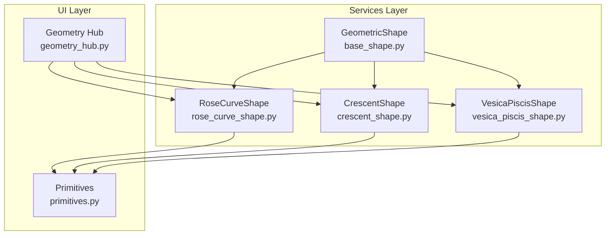
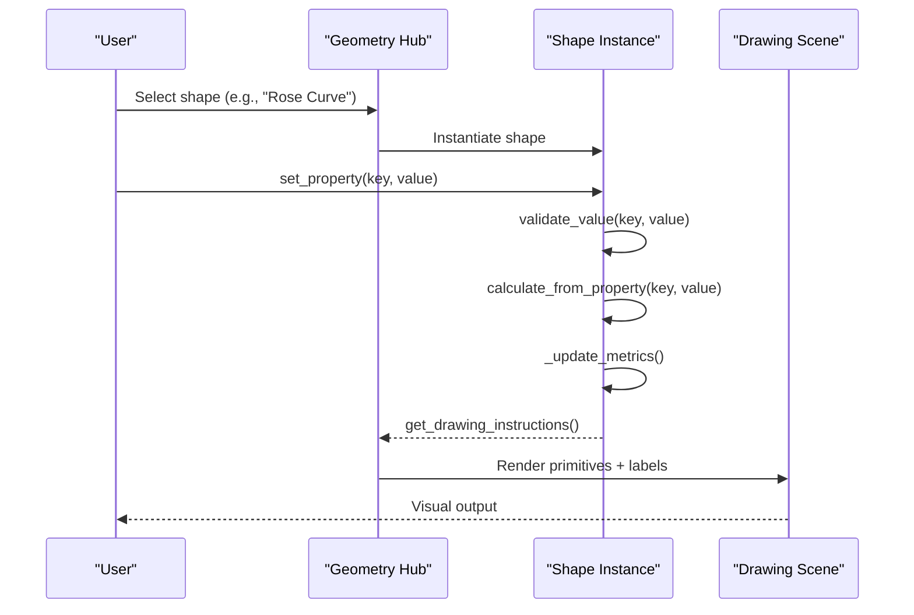
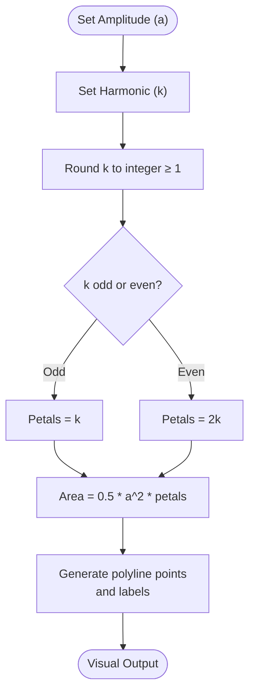
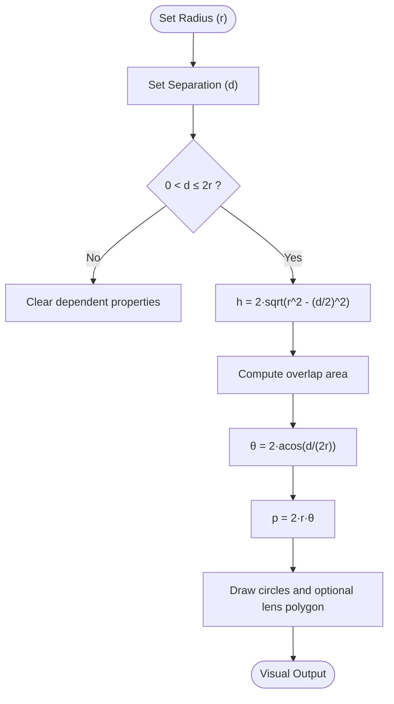
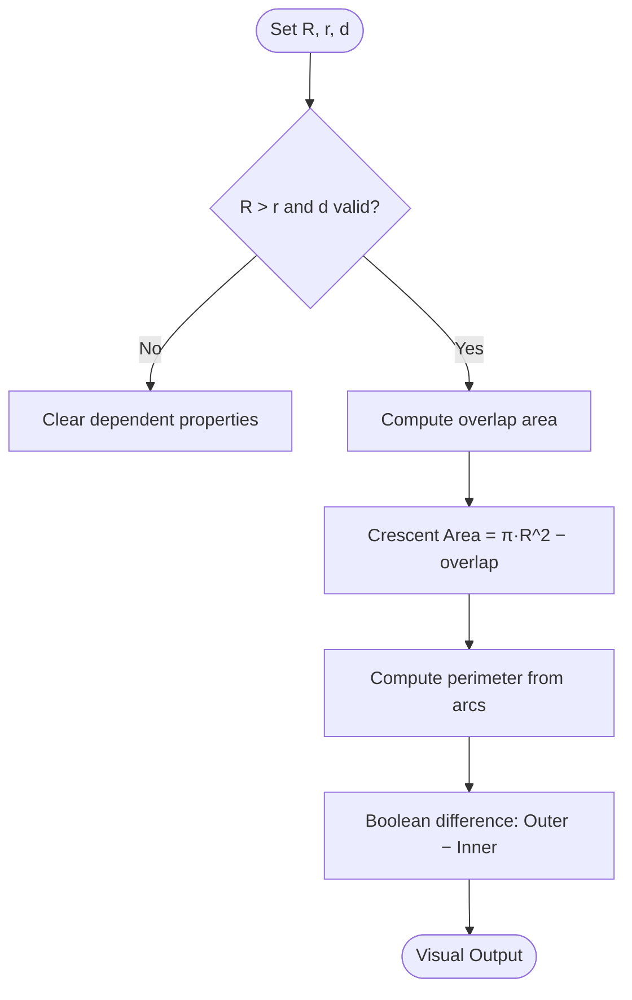
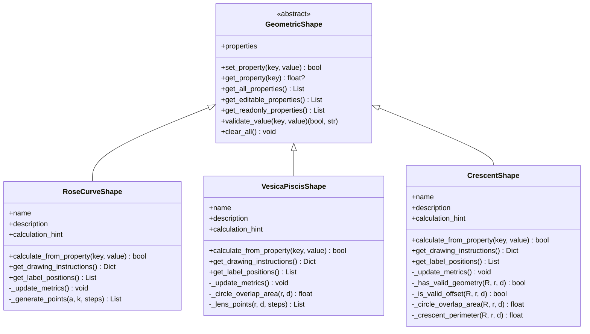

# Complex Curves

<cite>
**Referenced Files in This Document**
- [rose_curve_shape.py](file://src/pillars/geometry/services/rose_curve_shape.py)
- [crescent_shape.py](file://src/pillars/geometry/services/crescent_shape.py)
- [vesica_piscis_shape.py](file://src/pillars/geometry/services/vesica_piscis_shape.py)
- [base_shape.py](file://src/pillars/geometry/services/base_shape.py)
- [geometry_hub.py](file://src/pillars/geometry/ui/geometry_hub.py)
- [primitives.py](file://src/pillars/geometry/ui/primitives.py)
</cite>

## Table of Contents
1. [Introduction](#introduction)
2. [Project Structure](#project-structure)
3. [Core Components](#core-components)
4. [Architecture Overview](#architecture-overview)
5. [Detailed Component Analysis](#detailed-component-analysis)
6. [Dependency Analysis](#dependency-analysis)
7. [Performance Considerations](#performance-considerations)
8. [Troubleshooting Guide](#troubleshooting-guide)
9. [Conclusion](#conclusion)
10. [Appendices](#appendices)

## Introduction
This document provides API documentation for advanced 2D curve geometries implemented in the geometry services layer. It focuses on:
- RoseCurveShape: polar coordinate curves defined by r = a · cos(kθ) or r = a · sin(kθ), including petal count determination for rational and irrational harmonics, symmetry properties, and visual representation.
- VesicaPiscisShape: intersecting circle geometry forming a lens, computing lens area, height, and width from radius and separation distance.
- CrescentShape (lune): calculations using two circular arcs with different radii and centers, including overlap area, crescent area, perimeter, and bounding characteristics.

It specifies parameter constraints, numerical stability considerations in trigonometric computations, and visual representation guidelines. Practical examples are provided for generating petal patterns, sacred geometry constructs, and lunar phase analogs.

## Project Structure
The geometry shapes are implemented as service classes that inherit from a common base class. They expose properties, validation, computation, and drawing instructions. The UI integrates these shapes into a category-based hub.

**Diagram sources**
- [base_shape.py](file://src/pillars/geometry/services/base_shape.py#L1-L143)
- [rose_curve_shape.py](file://src/pillars/geometry/services/rose_curve_shape.py#L1-L137)
- [crescent_shape.py](file://src/pillars/geometry/services/crescent_shape.py#L1-L274)
- [vesica_piscis_shape.py](file://src/pillars/geometry/services/vesica_piscis_shape.py#L1-L224)
- [geometry_hub.py](file://src/pillars/geometry/ui/geometry_hub.py#L152-L188)
- [primitives.py](file://src/pillars/geometry/ui/primitives.py#L1-L120)

**Section sources**
- [base_shape.py](file://src/pillars/geometry/services/base_shape.py#L1-L143)
- [geometry_hub.py](file://src/pillars/geometry/ui/geometry_hub.py#L152-L188)

## Core Components
- GeometricShape (abstract base): Defines the contract for shape calculators, including property initialization, validation, calculation, drawing instructions, and labeling.
- RoseCurveShape: Implements polar rose curves, computes petal counts, max radius, and total area; generates polyline points and labels.
- VesicaPiscisShape: Computes lens height, area, perimeter, and apex angle from radius and separation; draws intersecting circles and optional filled lens polygon.
- CrescentShape: Computes overlap area, crescent area, and perimeter from outer radius, inner radius, and center offset; supports boolean difference rendering.

Key capabilities:
- Parameter constraints enforced via validation and property setters.
- Numerical stability through bounded domains, clamping, and careful trigonometric evaluation.
- Visual representation via primitives and boolean operations.

**Section sources**
- [base_shape.py](file://src/pillars/geometry/services/base_shape.py#L1-L143)
- [rose_curve_shape.py](file://src/pillars/geometry/services/rose_curve_shape.py#L1-L137)
- [vesica_piscis_shape.py](file://src/pillars/geometry/services/vesica_piscis_shape.py#L1-L224)
- [crescent_shape.py](file://src/pillars/geometry/services/crescent_shape.py#L1-L274)

## Architecture Overview
The shapes follow a consistent lifecycle:
- Initialize properties via _init_properties.
- Set a property value; the shape validates and recalculates dependent properties.
- Provide drawing instructions for the UI scene.
- Provide label positions for annotations.

**Diagram sources**
- [geometry_hub.py](file://src/pillars/geometry/ui/geometry_hub.py#L152-L188)
- [base_shape.py](file://src/pillars/geometry/services/base_shape.py#L85-L143)
- [rose_curve_shape.py](file://src/pillars/geometry/services/rose_curve_shape.py#L56-L137)
- [vesica_piscis_shape.py](file://src/pillars/geometry/services/vesica_piscis_shape.py#L67-L224)
- [crescent_shape.py](file://src/pillars/geometry/services/crescent_shape.py#L70-L274)

## Detailed Component Analysis

### RoseCurveShape
Rose curves are defined by polar equations r = a · cos(kθ) or r = a · sin(kθ). The implementation currently uses r = a · cos(kθ).

- Properties
  - Amplitude (a): scaling factor for radius.
  - Harmonic (k): controls petal count; internally rounded to integer ≥ 1.
  - Petal Count: computed from k; odd k yields k petals; even k yields 2k petals.
  - Max Radius: equals amplitude.
  - Total Area: computed from petal count and amplitude.

- Parameter constraints
  - Amplitude must be positive.
  - k is rounded to integer and constrained to k ≥ 1.

- Symmetry properties
  - For r = a · cos(kθ): symmetric about the polar axis (x-axis).
  - For r = a · sin(kθ): symmetric about the line θ = π/2 (y-axis).
  - The number of lobes (petals) depends on k:
    - If k is odd: k petals.
    - If k is even: 2k petals.
  - Note: The repository implementation computes petal count based on k without distinguishing between cosine and sine forms. The description mentions r = cos(kθ); the actual equation evaluated uses cos(kθ) with amplitude scaling.

- Numerical stability
  - Sampling uses a fixed number of steps proportional to 360° increments; trigonometric functions are evaluated per sampled angle.
  - Values are formatted for labels with controlled decimal precision.

- Drawing and labeling
  - Generates a polyline from sampled points.
  - Adds labels for amplitude, harmonic, petal count, and total area.

- Example use cases
  - Petal patterns: vary k to produce 3, 4, 5, 6, 8, 10, etc. lobes; adjust amplitude for scale.
  - Sacred geometry constructs: k = 5 produces five-petaled rosette; k = 8 produces eight-petaled rosette.
  - Lunar phase analogs: k ≈ 1.5–2.5 approximates crescent phases; note that the implementation evaluates r = a · cos(kθ), which differs from a true lune profile.

**Diagram sources**
- [rose_curve_shape.py](file://src/pillars/geometry/services/rose_curve_shape.py#L56-L116)

**Section sources**
- [rose_curve_shape.py](file://src/pillars/geometry/services/rose_curve_shape.py#L1-L137)
- [base_shape.py](file://src/pillars/geometry/services/base_shape.py#L1-L143)

### VesicaPiscisShape
The Vesica Piscis is the intersection of two equal-radius circles separated by a distance d.

- Properties
  - Radius: circle radius.
  - Diameter: 2 · radius.
  - Separation: center-to-center distance d.
  - Lens Height: distance between top and bottom tips of the lens.
  - Lens Area: intersection area of two circles.
  - Perimeter: arc-length sum of two circular segments.
  - Apex Angle: angle subtended by the lens at the center of either circle.

- Parameter constraints
  - Radius must be positive.
  - Separation d must satisfy 0 < d ≤ 2 · radius.

- Calculations
  - Lens Height: h = 2 · sqrt(r^2 − (d/2)^2).
  - Lens Area: derived from circle segment overlap formula.
  - Perimeter: p = 2 · r · θ, where θ is the apex angle in radians.
  - Apex Angle: θ = 2 · acos(d/(2·r)).

- Numerical stability
  - Arguments to acos are clamped to [-1, 1].
  - sqrt arguments are clamped to non-negative values.
  - Special-case handling for degenerate cases (coincident circles, disjoint circles).

- Drawing and labeling
  - Draws two circles with distinct fills and pens.
  - Optionally draws a polygon representing the filled lens region.
  - Adds labels for radius, separation, area, and apex angle.

- Example use cases
  - Sacred geometry constructs: classic Vesica Piscis with d = r produces a symmetric lens.
  - Lens-shaped windows and architectural motifs.

**Diagram sources**
- [vesica_piscis_shape.py](file://src/pillars/geometry/services/vesica_piscis_shape.py#L67-L120)

**Section sources**
- [vesica_piscis_shape.py](file://src/pillars/geometry/services/vesica_piscis_shape.py#L1-L224)
- [base_shape.py](file://src/pillars/geometry/services/base_shape.py#L1-L143)

### CrescentShape
The Crescent (lune) is formed by subtracting an offset inner circle from an outer circle.

- Properties
  - Outer Radius (R): larger circle radius.
  - Inner Radius (r): smaller circle radius.
  - Center Offset (d): horizontal separation between centers.
  - Outer Diameter, Inner Diameter: 2·R, 2·r.
  - Overlap Area: intersection area of two circles.
  - Crescent Area: π·R^2 − overlap area.
  - Perimeter: sum of arc-lengths of outer and inner segments.

- Parameter constraints
  - R > r (outer strictly larger).
  - d ≥ 0 (non-negative offset).
  - Validation ensures valid geometry before computing metrics.

- Calculations
  - Overlap Area: computed using the two-circle intersection formula with acos and sin terms.
  - Perimeter: for intersecting circles, the perimeter consists of the outer arc minus the inner arc plus the inner arc; for disjoint/inside cases, simplified formulas apply.
  - Geometry validity: checks R > r and d satisfies constraints.

- Numerical stability
  - acos arguments are clamped to [-1, 1].
  - Special-case handling for disjoint, one inside the other, and intersecting configurations.

- Drawing and labeling
  - Uses a boolean difference primitive to render the crescent region.
  - Optionally overlays the inner circle outline for reference.
  - Adds labels for R, r, d, and crescent area.

- Example use cases
  - Lunar phase analogs: approximate crescent moon with appropriate R, r, and d.
  - Sacred geometry constructs: crescent shapes in cultural and symbolic contexts.

**Diagram sources**
- [crescent_shape.py](file://src/pillars/geometry/services/crescent_shape.py#L70-L131)

**Section sources**
- [crescent_shape.py](file://src/pillars/geometry/services/crescent_shape.py#L1-L274)
- [base_shape.py](file://src/pillars/geometry/services/base_shape.py#L1-L143)

## Dependency Analysis
- Inheritance and polymorphism
  - All shapes inherit from GeometricShape, providing a unified interface for property management, validation, and rendering.
- UI integration
  - The geometry hub registers shapes under the "Circles" category and opens a shape calculator window when selected.
  - Drawing instructions are expressed as primitives compatible with the scene adapter.
- Cohesion and coupling
  - Shapes encapsulate domain logic for their respective geometry types.
  - Shared primitives define a common representation for circles, polygons, lines, and boolean operations.

**Diagram sources**
- [base_shape.py](file://src/pillars/geometry/services/base_shape.py#L1-L143)
- [rose_curve_shape.py](file://src/pillars/geometry/services/rose_curve_shape.py#L1-L137)
- [vesica_piscis_shape.py](file://src/pillars/geometry/services/vesica_piscis_shape.py#L1-L224)
- [crescent_shape.py](file://src/pillars/geometry/services/crescent_shape.py#L1-L274)

**Section sources**
- [geometry_hub.py](file://src/pillars/geometry/ui/geometry_hub.py#L152-L188)
- [primitives.py](file://src/pillars/geometry/ui/primitives.py#L1-L120)

## Performance Considerations
- Sampling density
  - Rose curve sampling uses a fixed number of steps proportional to 360°; increasing steps improves smoothness but raises CPU cost.
- Trigonometric evaluations
  - Repeated math.cos and math.sin calls are lightweight; cache intermediate values if extending to higher sampling rates.
- Numerical robustness
  - Clamp acos arguments to [-1, 1] and sqrt arguments to non-negative values to avoid domain errors.
- Rendering
  - Boolean operations (Crescent) require vectorization; keep polygon counts reasonable for interactive performance.

[No sources needed since this section provides general guidance]

## Troubleshooting Guide
- Invalid parameters
  - RoseCurveShape: amplitude must be positive; k is rounded to integer ≥ 1.
  - VesicaPiscisShape: radius must be positive; separation must satisfy 0 < d ≤ 2·r.
  - CrescentShape: R must be greater than r; d must be non-negative; geometry is validated before computing metrics.
- Degenerate cases
  - Vesica Piscis: d = 0 yields overlapping circles; d approaches 2r yields vanishing overlap.
  - Crescent: d ≥ R + r yields disjoint circles; d ≤ |R − r| yields inner circle inside outer.
- Unexpected zero or None values
  - Dependent properties are cleared when required inputs are missing or invalid.
- Label visibility
  - Labels are positioned near key dimensions; adjust scene zoom or layout if labels overlap.

**Section sources**
- [rose_curve_shape.py](file://src/pillars/geometry/services/rose_curve_shape.py#L56-L86)
- [vesica_piscis_shape.py](file://src/pillars/geometry/services/vesica_piscis_shape.py#L67-L120)
- [crescent_shape.py](file://src/pillars/geometry/services/crescent_shape.py#L70-L131)

## Conclusion
The geometry services provide robust, reusable implementations for advanced 2D curves:
- RoseCurveShape enables petal pattern generation with clear constraints and visual feedback.
- VesicaPiscisShape offers precise lens geometry computations suitable for sacred geometry and design applications.
- CrescentShape delivers accurate crescent/lune metrics and boolean rendering for lunar phase analogs and symbolic constructs.

Adhering to the documented constraints and leveraging the provided drawing instructions ensures reliable and visually appealing results.

[No sources needed since this section summarizes without analyzing specific files]

## Appendices

### API Reference Summary

- GeometricShape
  - Methods: set_property, get_property, get_all_properties, get_editable_properties, get_readonly_properties, validate_value, clear_all.
  - Properties: name, description, calculation_hint (default "Calculate from any field").
  - Notes: Subclasses must implement _init_properties, calculate_from_property, get_drawing_instructions, get_label_positions.

- RoseCurveShape
  - Properties: amplitude, k_value, petal_count (readonly), max_radius (readonly), total_area (readonly).
  - Methods: calculate_from_property, get_drawing_instructions, get_label_positions.
  - Constraints: amplitude > 0; k rounded to integer ≥ 1; petal count logic applies odd/even k.

- VesicaPiscisShape
  - Properties: radius, diameter, separation, lens_height (readonly), lens_area (readonly), perimeter (readonly), apex_angle (readonly).
  - Methods: calculate_from_property, get_drawing_instructions, get_label_positions.
  - Constraints: radius > 0; 0 < separation ≤ 2·radius.

- CrescentShape
  - Properties: outer_radius, inner_radius, offset, outer_diameter, inner_diameter, intersection_area (readonly), crescent_area (readonly), perimeter (readonly).
  - Methods: calculate_from_property, get_drawing_instructions, get_label_positions.
  - Constraints: outer_radius > inner_radius; offset ≥ 0; geometry validated before metrics.

**Section sources**
- [base_shape.py](file://src/pillars/geometry/services/base_shape.py#L1-L143)
- [rose_curve_shape.py](file://src/pillars/geometry/services/rose_curve_shape.py#L23-L137)
- [vesica_piscis_shape.py](file://src/pillars/geometry/services/vesica_piscis_shape.py#L23-L224)
- [crescent_shape.py](file://src/pillars/geometry/services/crescent_shape.py#L23-L274)