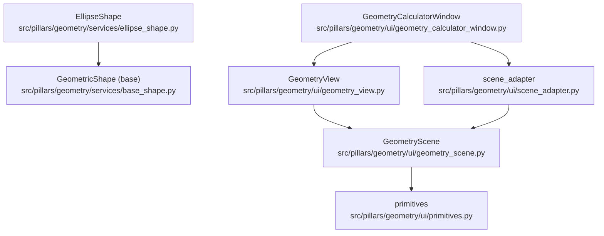
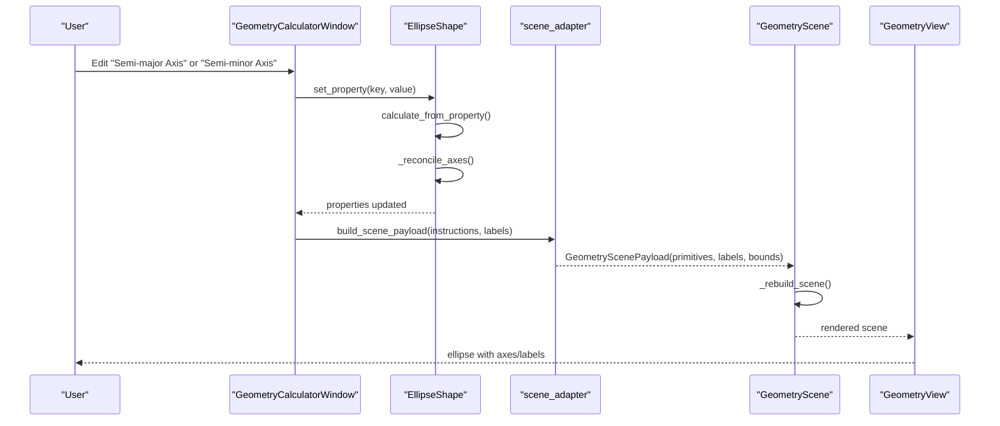
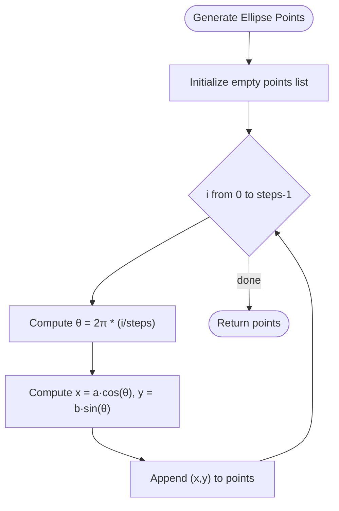
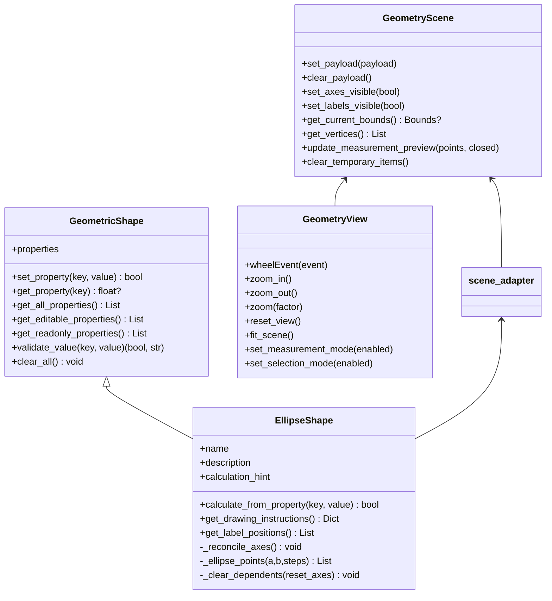
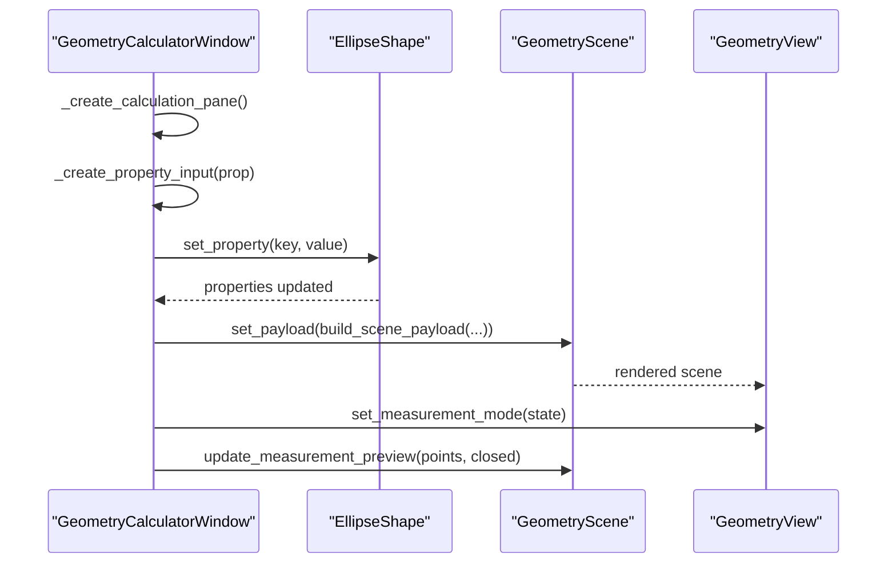
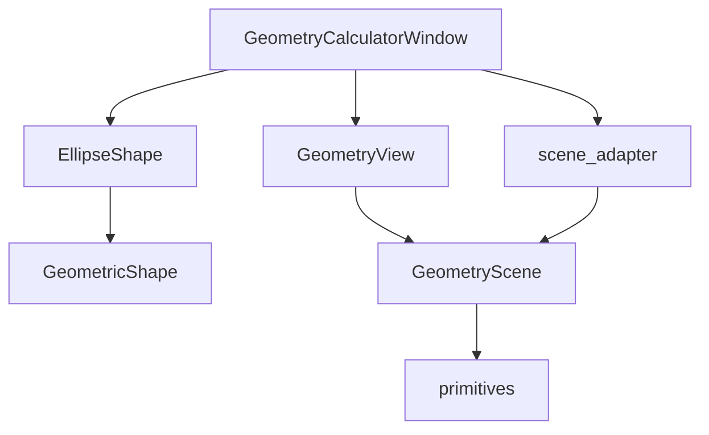

# Ellipse Shape

<cite>
**Referenced Files in This Document**
- [ellipse_shape.py](file://src/pillars/geometry/services/ellipse_shape.py)
- [base_shape.py](file://src/pillars/geometry/services/base_shape.py)
- [geometry_calculator_window.py](file://src/pillars/geometry/ui/geometry_calculator_window.py)
- [geometry_view.py](file://src/pillars/geometry/ui/geometry_view.py)
- [geometry_scene.py](file://src/pillars/geometry/ui/geometry_scene.py)
- [scene_adapter.py](file://src/pillars/geometry/ui/scene_adapter.py)
- [primitives.py](file://src/pillars/geometry/ui/primitives.py)
</cite>

## Table of Contents
1. [Introduction](#introduction)
2. [Project Structure](#project-structure)
3. [Core Components](#core-components)
4. [Architecture Overview](#architecture-overview)
5. [Detailed Component Analysis](#detailed-component-analysis)
6. [Dependency Analysis](#dependency-analysis)
7. [Performance Considerations](#performance-considerations)
8. [Troubleshooting Guide](#troubleshooting-guide)
9. [Conclusion](#conclusion)

## Introduction
This document provides API documentation for the EllipseShape component, focusing on semi-major and semi-minor axis-based calculations. It covers:
- Area computation using πab
- Perimeter approximation using Ramanujan’s formula
- Eccentricity e = √(1 − b²/a²)
- Focal point computation c = √(a² − b²)
- Parametric coordinate generation x = a·cos θ, y = b·sin θ
- Integration with GeometryView and GeometryScene for smooth rendering
- Methods for solving axes from area and eccentricity
- Degenerate cases (circle when a = b)
- Numerical stability in approximations
- Usage in geometry_calculator_window.py for interactive ellipse manipulation
- Performance tips for high-frequency updates

## Project Structure
The ellipse shape is implemented as a specialized geometric shape calculator and integrates with the geometry UI stack to render and visualize ellipses interactively.

**Diagram sources**
- [ellipse_shape.py](file://src/pillars/geometry/services/ellipse_shape.py#L1-L200)
- [base_shape.py](file://src/pillars/geometry/services/base_shape.py#L1-L143)
- [geometry_calculator_window.py](file://src/pillars/geometry/ui/geometry_calculator_window.py#L1-L200)
- [geometry_view.py](file://src/pillars/geometry/ui/geometry_view.py#L1-L120)
- [geometry_scene.py](file://src/pillars/geometry/ui/geometry_scene.py#L1-L120)
- [scene_adapter.py](file://src/pillars/geometry/ui/scene_adapter.py#L1-L120)
- [primitives.py](file://src/pillars/geometry/ui/primitives.py#L1-L120)

**Section sources**
- [ellipse_shape.py](file://src/pillars/geometry/services/ellipse_shape.py#L1-L200)
- [base_shape.py](file://src/pillars/geometry/services/base_shape.py#L1-L143)
- [geometry_calculator_window.py](file://src/pillars/geometry/ui/geometry_calculator_window.py#L1-L200)
- [geometry_view.py](file://src/pillars/geometry/ui/geometry_view.py#L1-L120)
- [geometry_scene.py](file://src/pillars/geometry/ui/geometry_scene.py#L1-L120)
- [scene_adapter.py](file://src/pillars/geometry/ui/scene_adapter.py#L1-L120)
- [primitives.py](file://src/pillars/geometry/ui/primitives.py#L1-L120)

## Core Components
- EllipseShape: Implements axis-based ellipse calculations, drawing instructions, and label positioning.
- GeometricShape: Base class defining the property model and calculation contract.
- GeometryCalculatorWindow: Interactive UI that drives EllipseShape and renders results.
- GeometryView and GeometryScene: Rendering pipeline for visualizing shapes and overlays.
- scene_adapter: Converts drawing instructions into scene primitives and labels.
- primitives: Data structures for scene primitives and labels.

Key responsibilities:
- EllipseShape: compute area, perimeter, eccentricity, focal distance; generate parametric points; reconcile axes; produce drawing instructions and labels.
- GeometryCalculatorWindow: binds UI inputs to shape properties, triggers re-rendering, and manages overlays.
- GeometryScene: builds scene from primitives, manages axes/labels visibility, and measurement overlays.
- scene_adapter: translates EllipseShape drawing instructions into structured primitives and labels.

**Section sources**
- [ellipse_shape.py](file://src/pillars/geometry/services/ellipse_shape.py#L1-L200)
- [base_shape.py](file://src/pillars/geometry/services/base_shape.py#L1-L143)
- [geometry_calculator_window.py](file://src/pillars/geometry/ui/geometry_calculator_window.py#L1-L200)
- [geometry_scene.py](file://src/pillars/geometry/ui/geometry_scene.py#L1-L120)
- [scene_adapter.py](file://src/pillars/geometry/ui/scene_adapter.py#L1-L120)
- [primitives.py](file://src/pillars/geometry/ui/primitives.py#L1-L120)

## Architecture Overview
The ellipse rendering pipeline:
1. User edits semi-major/semi-minor axes in the calculator window.
2. EllipseShape calculates dependent properties and generates drawing instructions.
3. scene_adapter converts instructions to primitives and labels.
4. GeometryScene builds the scene and applies axes/labels visibility.
5. GeometryView displays the scene with overlays and measurement tools.

**Diagram sources**
- [geometry_calculator_window.py](file://src/pillars/geometry/ui/geometry_calculator_window.py#L1-L200)
- [ellipse_shape.py](file://src/pillars/geometry/services/ellipse_shape.py#L75-L114)
- [scene_adapter.py](file://src/pillars/geometry/ui/scene_adapter.py#L19-L55)
- [geometry_scene.py](file://src/pillars/geometry/ui/geometry_scene.py#L440-L476)
- [geometry_view.py](file://src/pillars/geometry/ui/geometry_view.py#L1-L120)

## Detailed Component Analysis

### EllipseShape API
- Properties
  - semi_major_axis (editable)
  - semi_minor_axis (editable)
  - major_axis = 2a (readonly)
  - minor_axis = 2b (readonly)
  - area = πab (readonly)
  - perimeter (Ramanujan approximation) (readonly)
  - eccentricity e = √(1 − b²/a²) (readonly)
  - focal_distance c = √(a² − b²) (readonly)

- Methods
  - calculate_from_property(property_key, value): Updates the specified axis and reconciles dependent properties.
  - get_drawing_instructions(): Returns polygon points and axis lines for rendering.
  - get_label_positions(): Returns label text and positions for a, b, e, and A.
  - _ellipse_points(a, b, steps=180): Generates parametric points using x = a·cos θ, y = b·sin θ.
  - _reconcile_axes(): Normalizes axes, clears dependents when needed, computes area/eccentricity/focal distance/perimeter.
  - _clear_dependents(reset_axes): Resets dependent properties.

- Behavior
  - Positive value validation for axes.
  - Automatic normalization so a ≥ b.
  - Degenerate case handling: if a = b, the ellipse becomes a circle.
  - Numerical stability: clamps sqrt arguments to non-negative values; handles division by zero safely.

**Section sources**
- [ellipse_shape.py](file://src/pillars/geometry/services/ellipse_shape.py#L1-L200)
- [base_shape.py](file://src/pillars/geometry/services/base_shape.py#L1-L143)

### Parametric Coordinate Generation
- Uses discrete sampling of θ from 0 to 2π with a fixed step count.
- Produces smooth polygonal approximation suitable for rendering.
- Steps count can be tuned for performance vs. smoothness trade-offs.

**Diagram sources**
- [ellipse_shape.py](file://src/pillars/geometry/services/ellipse_shape.py#L192-L200)

**Section sources**
- [ellipse_shape.py](file://src/pillars/geometry/services/ellipse_shape.py#L192-L200)

### Solving Axes from Area and Eccentricity
- Given area A and eccentricity e:
  - From e = √(1 − b²/a²), derive b/a = √(1 − e²).
  - From A = πab, derive ab = A/π.
  - Solve quadratic system to recover a and b.
- Implementation note: The provided EllipseShape does not expose a dedicated solver for A and e. Users can compute a and b externally and set semi_major_axis and semi_minor_axis accordingly.

[No sources needed since this section explains conceptual usage derived from existing APIs]

### Degenerate Case: Circle (a = b)
- When a equals b, the ellipse degenerates to a circle.
- Area becomes πa², eccentricity becomes 0, and focal distance becomes 0.
- The reconciliation routine ensures a ≥ b and sets both axes equal when only one is provided.

**Section sources**
- [ellipse_shape.py](file://src/pillars/geometry/services/ellipse_shape.py#L146-L168)

### Numerical Stability in Approximations
- Perimeter uses Ramanujan’s approximation with h = ((a − b)²)/((a + b)²).
- The formula is numerically stable for a ≈ b and avoids division by zero by checking a + b > 0.
- Eccentricity computation catches invalid sqrt arguments and defaults to 0 when a ≤ 0.
- Focal distance uses max(a*a − b*b, 0.0) to guard against floating-point errors.

**Section sources**
- [ellipse_shape.py](file://src/pillars/geometry/services/ellipse_shape.py#L170-L186)

### Integration with GeometryView and GeometryScene
- Drawing instructions from EllipseShape include:
  - type: "polygon"
  - points: generated parametric points
  - axis_lines: major/minor axis segments
- scene_adapter converts these into PolygonPrimitive and LinePrimitive entries.
- GeometryScene builds the scene, derives bounds, and renders axes/labels.
- GeometryView provides zoom, fit-to-bounds, and measurement modes.

**Diagram sources**
- [ellipse_shape.py](file://src/pillars/geometry/services/ellipse_shape.py#L1-L200)
- [base_shape.py](file://src/pillars/geometry/services/base_shape.py#L1-L143)
- [geometry_scene.py](file://src/pillars/geometry/ui/geometry_scene.py#L1-L120)
- [geometry_view.py](file://src/pillars/geometry/ui/geometry_view.py#L1-L120)
- [scene_adapter.py](file://src/pillars/geometry/ui/scene_adapter.py#L1-L120)

**Section sources**
- [ellipse_shape.py](file://src/pillars/geometry/services/ellipse_shape.py#L98-L114)
- [scene_adapter.py](file://src/pillars/geometry/ui/scene_adapter.py#L98-L140)
- [geometry_scene.py](file://src/pillars/geometry/ui/geometry_scene.py#L440-L476)
- [geometry_view.py](file://src/pillars/geometry/ui/geometry_view.py#L1-L120)

### Usage in geometry_calculator_window.py
- The calculator window initializes with a GeometricShape instance and creates input fields for each property.
- It connects input changes to shape.set_property, which triggers recalculation and re-rendering.
- The viewport pane hosts GeometryView and GeometryScene; overlays toggle axes/labels and measurement mode.
- The measure tab displays current area/perimeter and allows customization of measurement visuals.

**Diagram sources**
- [geometry_calculator_window.py](file://src/pillars/geometry/ui/geometry_calculator_window.py#L1-L200)
- [geometry_scene.py](file://src/pillars/geometry/ui/geometry_scene.py#L214-L291)
- [geometry_view.py](file://src/pillars/geometry/ui/geometry_view.py#L101-L118)

**Section sources**
- [geometry_calculator_window.py](file://src/pillars/geometry/ui/geometry_calculator_window.py#L1-L200)
- [geometry_scene.py](file://src/pillars/geometry/ui/geometry_scene.py#L214-L291)
- [geometry_view.py](file://src/pillars/geometry/ui/geometry_view.py#L101-L118)

## Dependency Analysis
- EllipseShape depends on:
  - GeometricShape for property model and validation.
  - math for π, sqrt, cos, sin, and arithmetic.
- GeometryCalculatorWindow depends on:
  - EllipseShape for calculations.
  - GeometryScene and GeometryView for rendering.
  - scene_adapter for converting drawing instructions to primitives.
- GeometryScene depends on:
  - primitives for typed scene elements.
  - scene_adapter for payload construction.
- GeometryView depends on:
  - GeometryScene for rendering and measurement integration.

**Diagram sources**
- [ellipse_shape.py](file://src/pillars/geometry/services/ellipse_shape.py#L1-L200)
- [base_shape.py](file://src/pillars/geometry/services/base_shape.py#L1-L143)
- [geometry_calculator_window.py](file://src/pillars/geometry/ui/geometry_calculator_window.py#L1-L200)
- [geometry_view.py](file://src/pillars/geometry/ui/geometry_view.py#L1-L120)
- [geometry_scene.py](file://src/pillars/geometry/ui/geometry_scene.py#L1-L120)
- [scene_adapter.py](file://src/pillars/geometry/ui/scene_adapter.py#L1-L120)
- [primitives.py](file://src/pillars/geometry/ui/primitives.py#L1-L120)

**Section sources**
- [ellipse_shape.py](file://src/pillars/geometry/services/ellipse_shape.py#L1-L200)
- [geometry_calculator_window.py](file://src/pillars/geometry/ui/geometry_calculator_window.py#L1-L200)
- [geometry_scene.py](file://src/pillars/geometry/ui/geometry_scene.py#L1-L120)
- [scene_adapter.py](file://src/pillars/geometry/ui/scene_adapter.py#L1-L120)
- [primitives.py](file://src/pillars/geometry/ui/primitives.py#L1-L120)

## Performance Considerations
- Parametric sampling: Increase steps for smoother curves; reduce steps for frequent updates.
- Avoid excessive re-renders: Batch UI updates and use a flag to prevent circular recalculations.
- Measurement previews: Limit preview complexity during live updates; enable full computation only when needed.
- Scene bounds: Precompute bounds to avoid repeated recomputation.
- Zoom and fit: Use fit_to_bounds to optimize rendering scale.

[No sources needed since this section provides general guidance]

## Troubleshooting Guide
- Non-positive axis values: Validation rejects values ≤ 0; ensure inputs are positive.
- Degenerate ellipse: When a = b, eccentricity is 0 and focal distance is 0; confirm axes equality.
- Numerical instability: Ramanujan approximation is robust; if perimeter appears None, verify a + b > 0.
- Rendering artifacts: Verify scene bounds and ensure primitives are constructed correctly by scene_adapter.

**Section sources**
- [base_shape.py](file://src/pillars/geometry/services/base_shape.py#L122-L138)
- [ellipse_shape.py](file://src/pillars/geometry/services/ellipse_shape.py#L170-L186)
- [scene_adapter.py](file://src/pillars/geometry/ui/scene_adapter.py#L202-L233)

## Conclusion
EllipseShape provides a robust, axis-centric ellipse calculator with accurate area, perimeter, eccentricity, and focal distance computations. Its integration with GeometryView and GeometryScene enables smooth, interactive visualization with overlays and measurement tools. For high-frequency updates, tune parametric sampling and batching to balance responsiveness and quality.