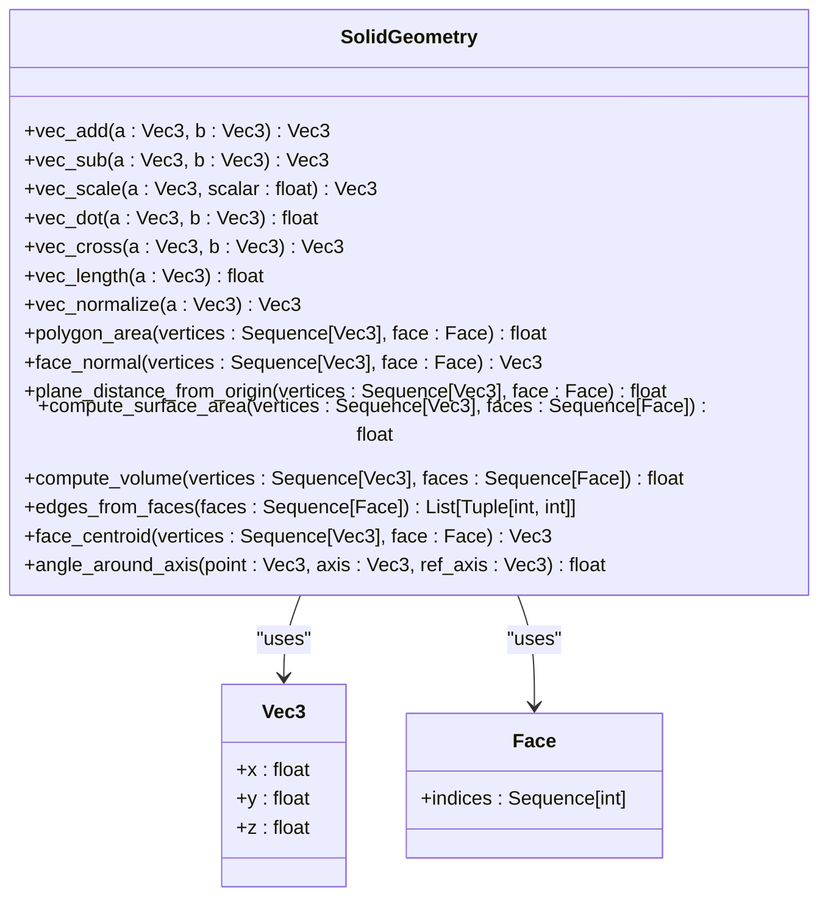
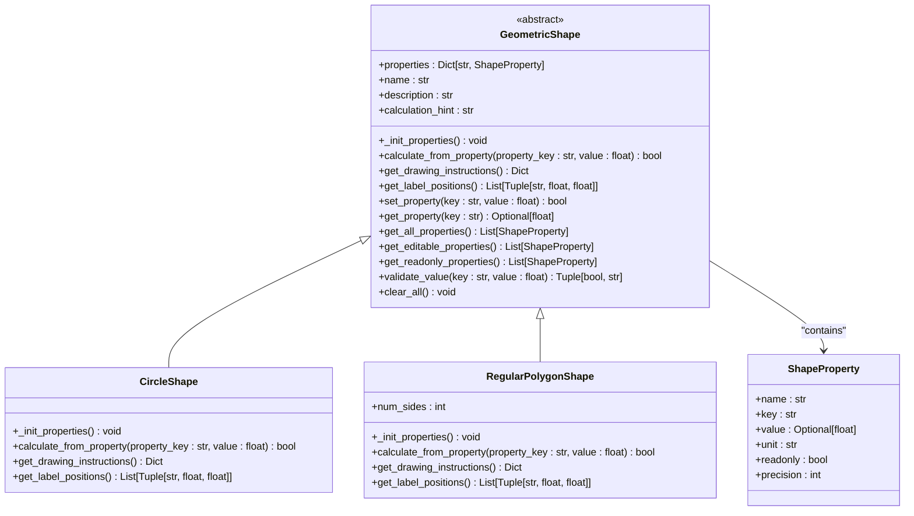
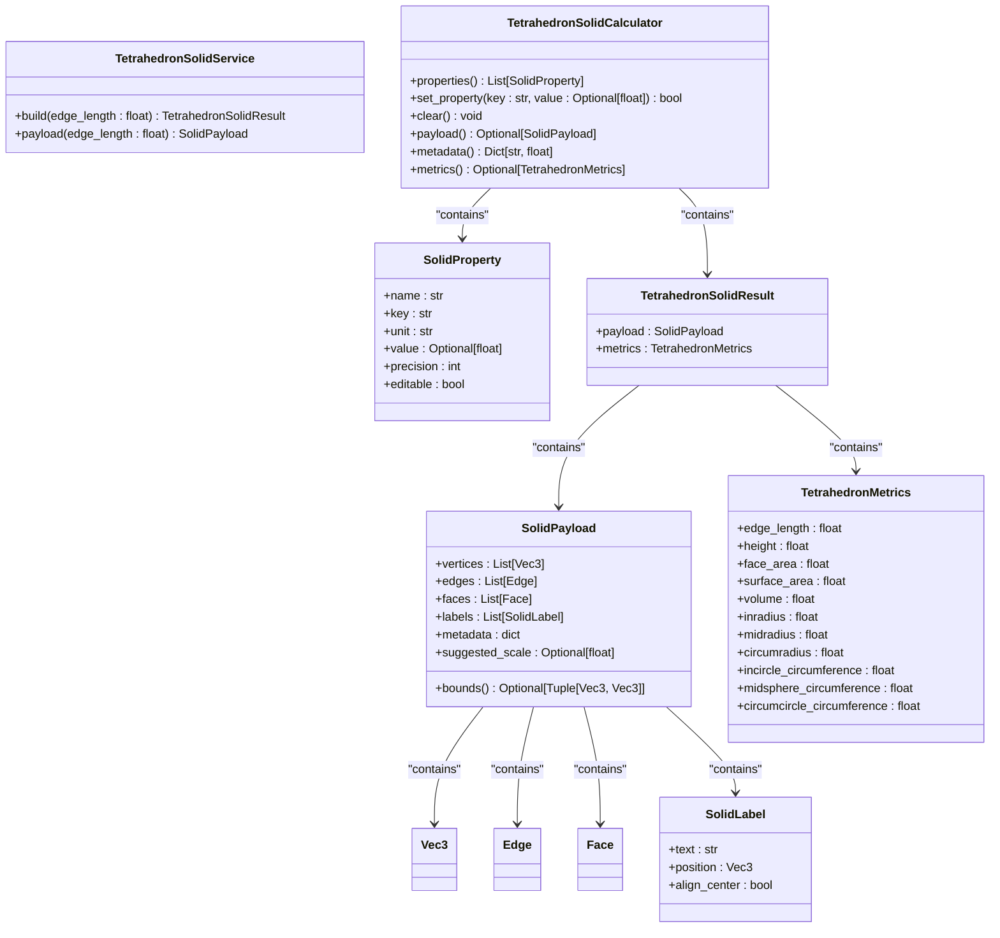
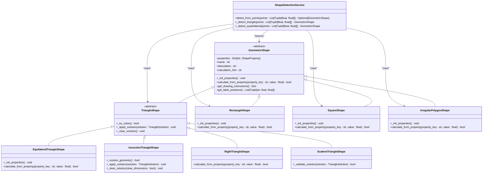
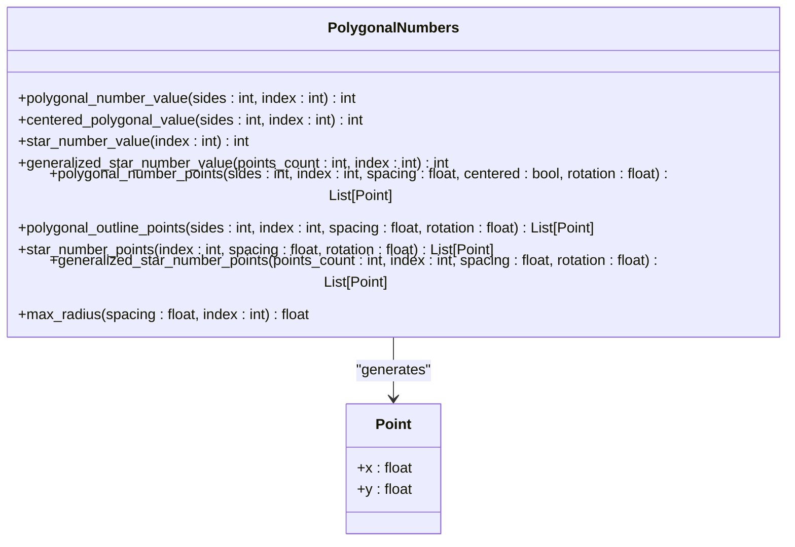

# Geometry API

<cite>
**Referenced Files in This Document**   
- [solid_geometry.py](file://src/pillars/geometry/services/solid_geometry.py)
- [archimedean_solids.py](file://src/pillars/geometry/services/archimedean_solids.py)
- [shape_detection_service.py](file://src/pillars/geometry/services/shape_detection_service.py)
- [polygonal_numbers.py](file://src/pillars/geometry/services/polygonal_numbers.py)
- [base_shape.py](file://src/pillars/geometry/services/base_shape.py)
- [circle_shape.py](file://src/pillars/geometry/services/circle_shape.py)
- [polygon_shape.py](file://src/pillars/geometry/services/polygon_shape.py)
- [tetrahedron_solid.py](file://src/pillars/geometry/services/tetrahedron_solid.py)
- [cube_solid.py](file://src/pillars/geometry/services/cube_solid.py)
- [solid_payload.py](file://src/pillars/geometry/shared/solid_payload.py)
- [solid_property.py](file://src/pillars/geometry/services/solid_property.py)
- [archimedean_data.py](file://src/pillars/geometry/services/archimedean_data.py)
</cite>

## Table of Contents
1. [Introduction](#introduction)
2. [Core Engine: SolidGeometry](#core-engine-solidgeometry)
3. [Shape-Specific Services](#shape-specific-services)
   - [2D Shapes](#2d-shapes)
   - [3D Solids](#3d-solids)
4. [Archimedean Solids Service](#archimedean-solids-service)
5. [Shape Detection Service](#shape-detection-service)
6. [Polygonal Numbers](#polygonal-numbers)
7. [Coordinate System and Units](#coordinate-system-and-units)
8. [API Usage Examples](#api-usage-examples)
9. [Numerical Stability and Performance](#numerical-stability-and-performance)
10. [Conclusion](#conclusion)

## Introduction
The Geometry API provides a comprehensive service layer for geometric calculations, with a focus on 3D solid geometry. The system is designed to support both 2D shape analysis and 3D solid computations, with specialized services for different geometric categories. The API follows a consistent pattern across all services, with standardized property definitions, calculation methods, and payload structures. This documentation covers the core components of the Geometry pillar, including the SolidGeometry engine, shape-specific services, Archimedean solids generation, shape detection, and polygonal numbers.

## Core Engine: SolidGeometry
The SolidGeometry module serves as the mathematical foundation for all 3D solid calculations in the system. It provides essential vector operations and geometric algorithms that are used by all solid services.



**Diagram sources**
- [solid_geometry.py](file://src/pillars/geometry/services/solid_geometry.py#L7-L155)

**Section sources**
- [solid_geometry.py](file://src/pillars/geometry/services/solid_geometry.py#L1-L156)

## Shape-Specific Services
The Geometry API provides specialized services for various geometric shapes, both 2D and 3D. Each service follows a consistent pattern with property definitions, calculation methods, and payload generation.

### 2D Shapes
The 2D shape services inherit from the GeometricShape base class and provide bidirectional property calculations.



**Diagram sources**
- [base_shape.py](file://src/pillars/geometry/services/base_shape.py#L7-L143)
- [circle_shape.py](file://src/pillars/geometry/services/circle_shape.py#L7-L234)
- [polygon_shape.py](file://src/pillars/geometry/services/polygon_shape.py#L17-L267)

**Section sources**
- [base_shape.py](file://src/pillars/geometry/services/base_shape.py#L1-L143)
- [circle_shape.py](file://src/pillars/geometry/services/circle_shape.py#L1-L234)
- [polygon_shape.py](file://src/pillars/geometry/services/polygon_shape.py#L1-L267)

### 3D Solids
The 3D solid services provide comprehensive calculations for various polyhedra, with standardized metrics and payload generation.



**Diagram sources**
- [solid_payload.py](file://src/pillars/geometry/shared/solid_payload.py#L1-L52)
- [solid_property.py](file://src/pillars/geometry/services/solid_property.py#L1-L21)
- [tetrahedron_solid.py](file://src/pillars/geometry/services/tetrahedron_solid.py#L1-L238)
- [cube_solid.py](file://src/pillars/geometry/services/cube_solid.py#L1-L265)

**Section sources**
- [solid_payload.py](file://src/pillars/geometry/shared/solid_payload.py#L1-L52)
- [solid_property.py](file://src/pillars/geometry/services/solid_property.py#L1-L21)
- [tetrahedron_solid.py](file://src/pillars/geometry/services/tetrahedron_solid.py#L1-L238)
- [cube_solid.py](file://src/pillars/geometry/services/cube_solid.py#L1-L265)

## Archimedean Solids Service
The ArchimedeanSolids service provides generators for all 13 Archimedean solids, with uniform edge length scaling.

```mermaid
classDiagram
class ArchimedeanSolidServiceBase {
<<abstract>>
+DEFINITION_KEY : str
+build(edge_length : float) ArchimedeanSolidResult
+payload(edge_length : float) SolidPayload
}
class ArchimedeanSolidCalculatorBase {
+SERVICE : Type[ArchimedeanSolidServiceBase]
+properties() List[SolidProperty]
+set_property(key : str, value : Optional[float]) bool
+clear() void
+payload() Optional[SolidPayload]
+metadata() Dict[str, float]
+metrics() Optional[ArchimedeanSolidMetrics]
}
class ArchimedeanSolidResult {
+payload : SolidPayload
+metrics : ArchimedeanSolidMetrics
}
class ArchimedeanSolidMetrics {
+edge_length : float
+surface_area : float
+volume : float
+face_count : int
+edge_count : int
+vertex_count : int
+face_sides : Dict[int, int]
}
class ArchimedeanSolidDefinition {
+key : str
+name : str
+canonical_vertices : List[Vec3]
+faces : List[Face]
+edges : List[Edge]
+base_edge_length : float
+base_surface_area : float
+base_volume : float
+face_sides : Dict[int, int]
}
ArchimedeanSolidServiceBase <|-- CuboctahedronSolidService
ArchimedeanSolidServiceBase <|-- TruncatedTetrahedronSolidService
ArchimedeanSolidServiceBase <|-- TruncatedCubeSolidService
ArchimedeanSolidServiceBase <|-- TruncatedOctahedronSolidService
ArchimedeanSolidServiceBase <|-- RhombicuboctahedronSolidService
ArchimedeanSolidServiceBase <|-- RhombicosidodecahedronSolidService
ArchimedeanSolidServiceBase <|-- TruncatedCuboctahedronSolidService
ArchimedeanSolidServiceBase <|-- IcosidodecahedronSolidService
ArchimedeanSolidServiceBase <|-- TruncatedDodecahedronSolidService
ArchimedeanSolidServiceBase <|-- TruncatedIcosahedronSolidService
ArchimedeanSolidServiceBase <|-- TruncatedIcosidodecahedronSolidService
ArchimedeanSolidServiceBase <|-- SnubCubeSolidService
ArchimedeanSolidServiceBase <|-- SnubDodecahedronSolidService
ArchimedeanSolidCalculatorBase <|-- CuboctahedronSolidCalculator
ArchimedeanSolidCalculatorBase <|-- TruncatedTetrahedronSolidCalculator
ArchimedeanSolidCalculatorBase <|-- TruncatedCubeSolidCalculator
ArchimedeanSolidCalculatorBase <|-- TruncatedOctahedronSolidCalculator
ArchimedeanSolidCalculatorBase <|-- RhombicuboctahedronSolidCalculator
ArchimedeanSolidCalculatorBase <|-- RhombicosidodecahedronSolidCalculator
ArchimedeanSolidCalculatorBase <|-- TruncatedCuboctahedronSolidCalculator
ArchimedeanSolidCalculatorBase <|-- IcosidodecahedronSolidCalculator
ArchimedeanSolidCalculatorBase <|-- TruncatedDodecahedronSolidCalculator
ArchimedeanSolidCalculatorBase <|-- TruncatedIcosahedronSolidCalculator
ArchimedeanSolidCalculatorBase <|-- TruncatedIcosidodecahedronSolidCalculator
ArchimedeanSolidCalculatorBase <|-- SnubCubeSolidCalculator
ArchimedeanSolidCalculatorBase <|-- SnubDodecahedronSolidCalculator
ArchimedeanSolidCalculatorBase --> ArchimedeanSolidServiceBase : "SERVICE"
ArchimedeanSolidResult --> SolidPayload : "contains"
ArchimedeanSolidResult --> ArchimedeanSolidMetrics : "contains"
ArchimedeanSolidServiceBase --> ArchimedeanSolidDefinition : "uses"
ArchimedeanSolidServiceBase --> ArchimedeanSolidResult : "returns"
```



**Diagram sources**
- [archimedean_solids.py](file://src/pillars/geometry/services/archimedean_solids.py#L1-L406)
- [archimedean_data.py](file://src/pillars/geometry/services/archimedean_data.py#L1-L1106)

**Section sources**
- [archimedean_solids.py](file://src/pillars/geometry/services/archimedean_solids.py#L1-L406)
- [archimedean_data.py](file://src/pillars/geometry/services/archimedean_data.py#L1-L1106)

## Shape Detection Service
The ShapeDetectionService analyzes point data to identify and initialize appropriate geometric shapes.



**Diagram sources**
- [shape_detection_service.py](file://src/pillars/geometry/services/shape_detection_service.py#L1-L158)
- [triangle_shape.py](file://src/pillars/geometry/services/triangle_shape.py#L1-L800)
- [square_shape.py](file://src/pillars/geometry/services/square_shape.py#L1-L273)

**Section sources**
- [shape_detection_service.py](file://src/pillars/geometry/services/shape_detection_service.py#L1-L158)
- [triangle_shape.py](file://src/pillars/geometry/services/triangle_shape.py#L1-L800)
- [square_shape.py](file://src/pillars/geometry/services/square_shape.py#L1-L273)

## Polygonal Numbers
The PolygonalNumbers service generates layouts for polygonal and centered polygonal number sequences.



**Diagram sources**
- [polygonal_numbers.py](file://src/pillars/geometry/services/polygonal_numbers.py#L1-L308)

**Section sources**
- [polygonal_numbers.py](file://src/pillars/geometry/services/polygonal_numbers.py#L1-L308)

## Coordinate System and Units
The Geometry API uses a right-handed Cartesian coordinate system with the following conventions:

- **Origin**: Centered at (0,0,0) for all symmetric solids
- **Axes**: X (right), Y (up), Z (forward) following the right-hand rule
- **Units**: Abstract units that can be scaled to any physical measurement system
- **Precision**: Calculations maintain high precision with floating-point tolerance of 1e-6
- **Angles**: Degrees for user-facing properties, radians for internal calculations

All solid services use a consistent scaling approach where the edge length parameter determines the overall size of the solid. The coordinate system is designed to be compatible with standard 3D rendering engines and mathematical visualization tools.

**Section sources**
- [solid_geometry.py](file://src/pillars/geometry/services/solid_geometry.py#L1-L156)
- [tetrahedron_solid.py](file://src/pillars/geometry/services/tetrahedron_solid.py#L1-L238)
- [cube_solid.py](file://src/pillars/geometry/services/cube_solid.py#L1-L265)

## API Usage Examples
The following examples demonstrate common usage patterns for the Geometry API:

### Creating a Tetrahedron
```python
from src.pillars.geometry.services.tetrahedron_solid import TetrahedronSolidService

# Create a tetrahedron with edge length 2.0
result = TetrahedronSolidService.build(edge_length=2.0)
payload = result.payload
metrics = result.metrics

# Access geometric properties
print(f"Volume: {metrics.volume:.3f}")
print(f"Surface Area: {metrics.surface_area:.3f}")
print(f"Height: {metrics.height:.3f}")
```

### Generating an Archimedean Solid
```python
from src.pillars.geometry.services.archimedean_solids import RhombicuboctahedronSolidService

# Create a rhombicuboctahedron with edge length 1.5
result = RhombicuboctahedronSolidService.build(edge_length=1.5)
payload = result.payload
metrics = result.metrics

# Access metadata
print(f"Vertex count: {metrics.vertex_count}")
print(f"Face count: {metrics.face_count}")
print(f"Face types: {metrics.face_sides}")
```

### Detecting a Shape from Points
```python
from src.pillars.geometry.services.shape_detection_service import ShapeDetectionService

# Define points for a square
points = [(0, 0), (1, 0), (1, 1), (0, 1)]

# Detect the shape
shape = ShapeDetectionService.detect_from_points(points)
if shape:
    print(f"Detected shape: {shape.name}")
    print(f"Area: {shape.get_property('area')}")
```

### Working with Polygonal Numbers
```python
from src.pillars.geometry.services.polygonal_numbers import polygonal_number_points

# Generate points for the 5th triangular number
points = polygonal_number_points(sides=3, index=5, spacing=1.0)
print(f"Triangular number points: {len(points)}")

# Generate points for the 4th centered hexagonal number
centered_points = polygonal_number_points(sides=6, index=4, spacing=1.0, centered=True)
print(f"Centered hexagonal points: {len(centered_points)}")
```

**Section sources**
- [tetrahedron_solid.py](file://src/pillars/geometry/services/tetrahedron_solid.py#L1-L238)
- [archimedean_solids.py](file://src/pillars/geometry/services/archimedean_solids.py#L1-L406)
- [shape_detection_service.py](file://src/pillars/geometry/services/shape_detection_service.py#L1-L158)
- [polygonal_numbers.py](file://src/pillars/geometry/services/polygonal_numbers.py#L1-L308)

## Numerical Stability and Performance
The Geometry API is designed with numerical stability and performance in mind, particularly for real-time visualization use cases.

### Floating-Point Tolerance
The system uses a tolerance of 1e-6 for floating-point comparisons to handle numerical imprecision:
- Edge length validation: `value <= 0` with tolerance
- Vector length calculations: `length == 0` with tolerance
- Angle calculations: `math.isclose()` with relative tolerance of 1e-4
- Triangle validation: `EPSILON = 1e-7` for side length comparisons

### Performance Optimization
Key performance optimizations include:
- **Caching**: Archimedean solid definitions are cached after first computation
- **Vectorization**: Mathematical operations are implemented efficiently using vector math
- **Precomputation**: Base metrics are calculated once and scaled as needed
- **Memory efficiency**: Data structures minimize memory allocation during calculations

### Real-Time Visualization Considerations
For real-time visualization scenarios:
- Use the `suggested_scale` property in SolidPayload to optimize rendering
- Cache frequently used solid configurations
- Batch multiple solid generations when possible
- Use the metadata property for quick access to geometric properties without recalculating

The API is designed to handle real-time updates and interactive manipulation of geometric solids with minimal latency.

**Section sources**
- [solid_geometry.py](file://src/pillars/geometry/services/solid_geometry.py#L1-L156)
- [archimedean_solids.py](file://src/pillars/geometry/services/archimedean_solids.py#L1-L406)
- [tetrahedron_solid.py](file://src/pillars/geometry/services/tetrahedron_solid.py#L1-L238)

## Conclusion
The Geometry API provides a comprehensive and consistent service layer for geometric calculations, with a strong focus on 3D solid geometry. The system is built around the SolidGeometry engine, which provides the mathematical foundation for all calculations. The API offers specialized services for various geometric categories, including 2D shapes, 3D solids, Archimedean solids, shape detection, and polygonal numbers.

Key features of the API include:
- Consistent property-based interface across all services
- Bidirectional property calculations for interactive use
- Standardized payload structures for visualization
- Comprehensive geometric metrics for analysis
- Efficient algorithms optimized for real-time performance

The API is designed to be extensible, with a clear pattern for adding new geometric shapes and solids. The coordinate system and unit handling are designed to be flexible and compatible with various visualization and analysis tools.