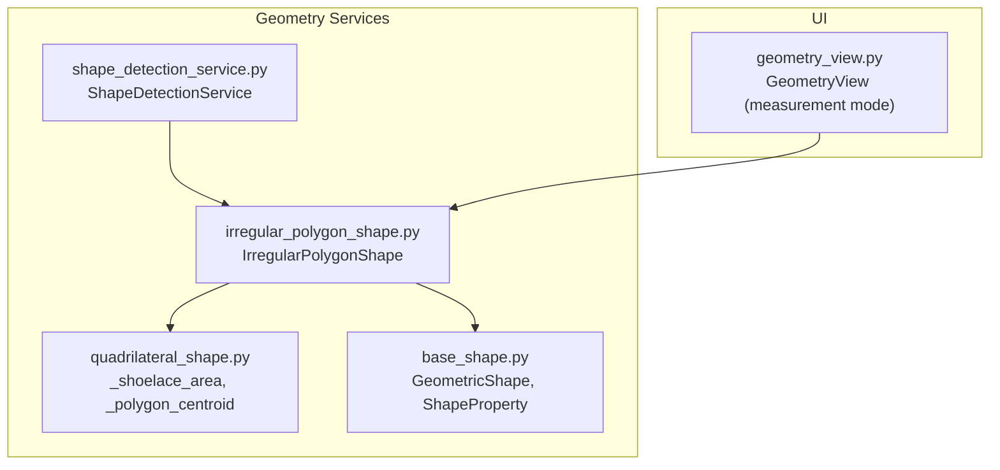
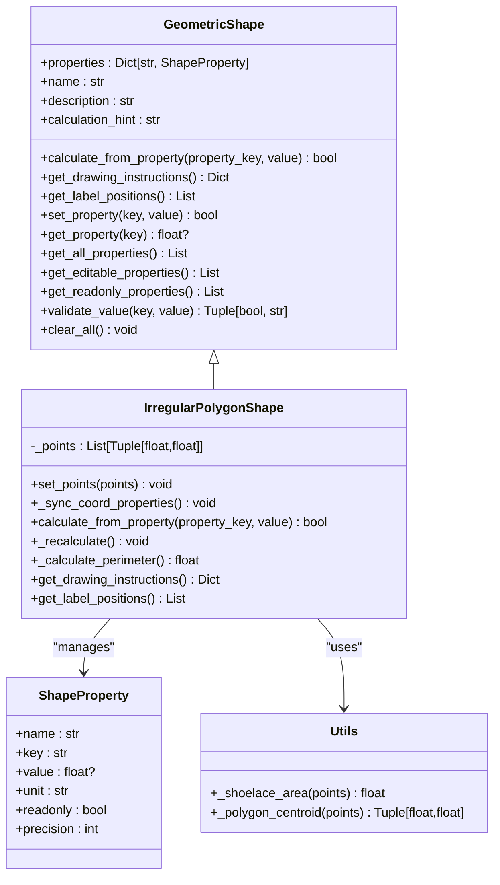
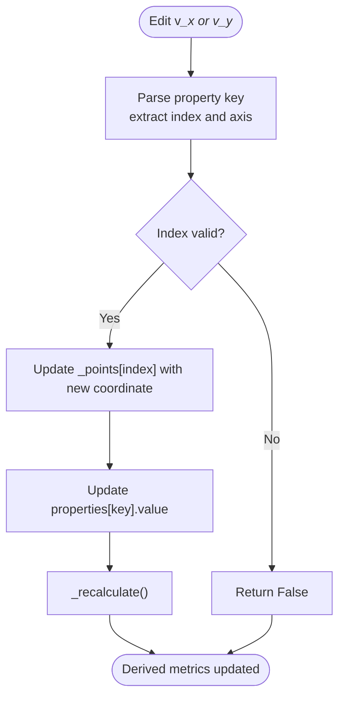
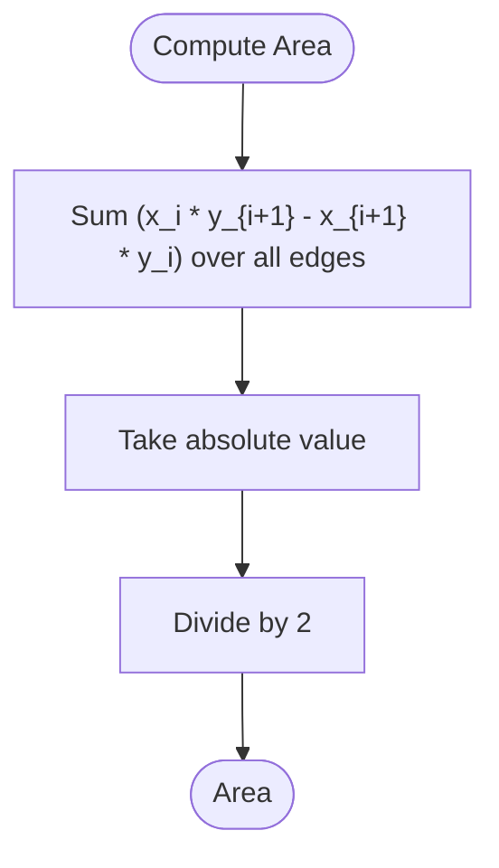
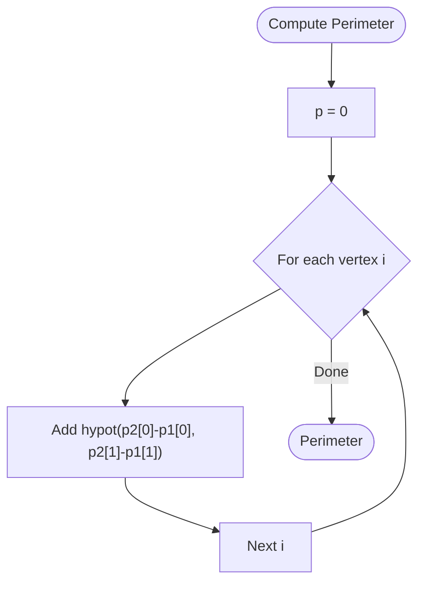
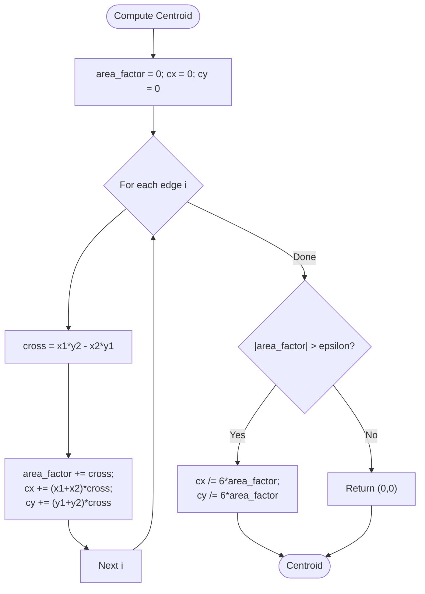
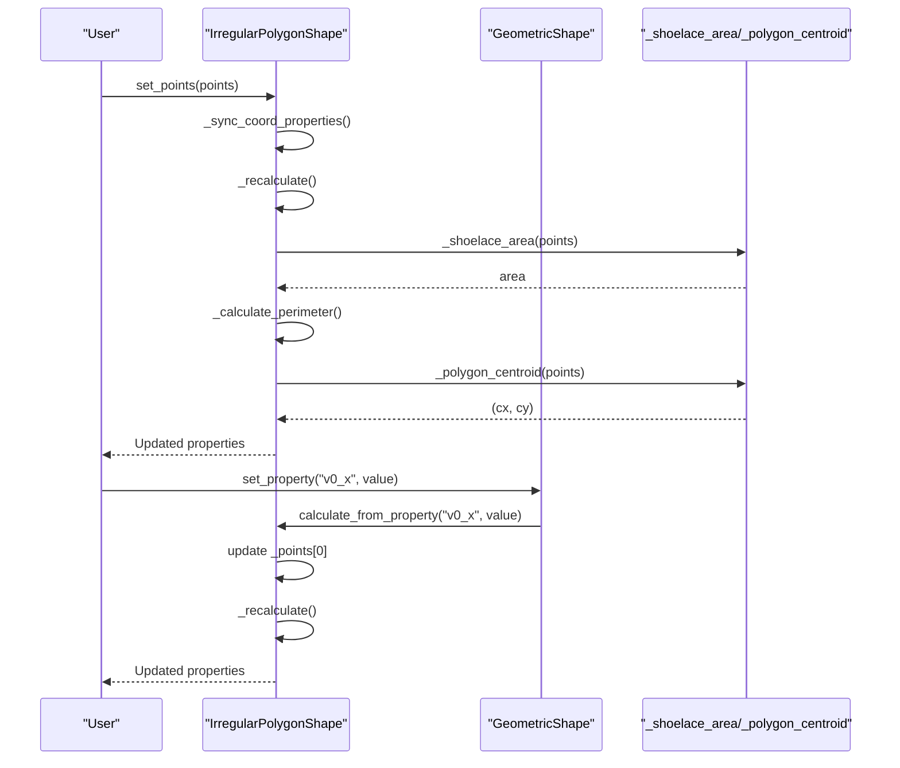
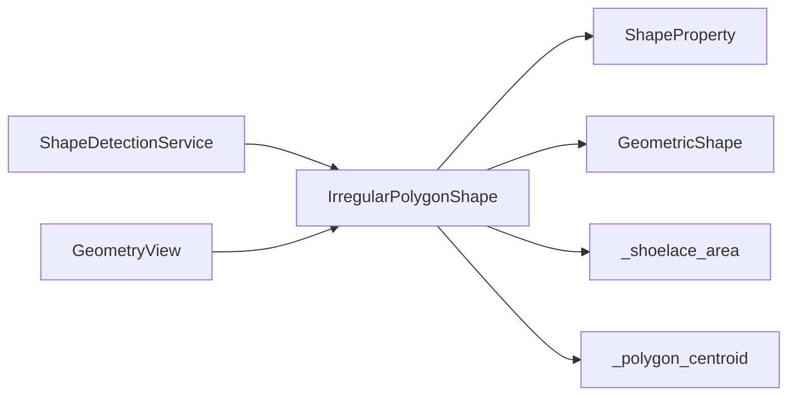

# Irregular Polygon Shape

<cite>
**Referenced Files in This Document**
- [irregular_polygon_shape.py](file://src/pillars/geometry/services/irregular_polygon_shape.py)
- [quadrilateral_shape.py](file://src/pillars/geometry/services/quadrilateral_shape.py)
- [base_shape.py](file://src/pillars/geometry/services/base_shape.py)
- [shape_detection_service.py](file://src/pillars/geometry/services/shape_detection_service.py)
- [geometry_view.py](file://src/pillars/geometry/ui/geometry_view.py)
</cite>

## Table of Contents
1. [Introduction](#introduction)
2. [Project Structure](#project-structure)
3. [Core Components](#core-components)
4. [Architecture Overview](#architecture-overview)
5. [Detailed Component Analysis](#detailed-component-analysis)
6. [Dependency Analysis](#dependency-analysis)
7. [Performance Considerations](#performance-considerations)
8. [Troubleshooting Guide](#troubleshooting-guide)
9. [Conclusion](#conclusion)
10. [Appendices](#appendices)

## Introduction
This document provides API documentation for the IrregularPolygonShape component, which computes area, perimeter, and centroid for arbitrary polygons defined by a list of vertices. It explains dynamic coordinate properties (v0_x, v0_y, v1_x, v1_y, etc.), how edits propagate to derived metrics, and how the underlying calculations are performed. It also covers edge cases (fewer than three vertices, near-degenerate configurations), numerical precision handling, and practical usage patterns for creating custom sacred geometry regions, bounding irregular shapes, and analyzing textual glyph outlines.

## Project Structure
IrregularPolygonShape is part of the geometry services module and integrates with the base shape framework and UI components.

**Diagram sources**
- [irregular_polygon_shape.py](file://src/pillars/geometry/services/irregular_polygon_shape.py#L1-L147)
- [quadrilateral_shape.py](file://src/pillars/geometry/services/quadrilateral_shape.py#L21-L48)
- [base_shape.py](file://src/pillars/geometry/services/base_shape.py#L1-L143)
- [shape_detection_service.py](file://src/pillars/geometry/services/shape_detection_service.py#L1-L158)
- [geometry_view.py](file://src/pillars/geometry/ui/geometry_view.py#L1-L281)

**Section sources**
- [irregular_polygon_shape.py](file://src/pillars/geometry/services/irregular_polygon_shape.py#L1-L147)
- [quadrilateral_shape.py](file://src/pillars/geometry/services/quadrilateral_shape.py#L21-L48)
- [base_shape.py](file://src/pillars/geometry/services/base_shape.py#L1-L143)
- [shape_detection_service.py](file://src/pillars/geometry/services/shape_detection_service.py#L1-L158)
- [geometry_view.py](file://src/pillars/geometry/ui/geometry_view.py#L1-L281)

## Core Components
- IrregularPolygonShape: Implements dynamic vertex editing and derived metric computation.
- ShapeProperty: Defines property metadata (name, key, value, unit, readonly, precision).
- GeometricShape: Abstract base class defining the property lifecycle and interface.
- Utilities: Shoelace area and centroid functions used by IrregularPolygonShape.

Key responsibilities:
- Dynamic vertex properties: v0_x, v0_y, v1_x, v1_y, … are created/updated per vertex.
- Derived metrics: area, perimeter, centroid_x, centroid_y, num_vertices.
- Automatic updates: Editing a vertex coordinate triggers recalculation of derived metrics.

**Section sources**
- [irregular_polygon_shape.py](file://src/pillars/geometry/services/irregular_polygon_shape.py#L17-L147)
- [base_shape.py](file://src/pillars/geometry/services/base_shape.py#L7-L16)
- [base_shape.py](file://src/pillars/geometry/services/base_shape.py#L18-L143)
- [quadrilateral_shape.py](file://src/pillars/geometry/services/quadrilateral_shape.py#L21-L48)

## Architecture Overview
The IrregularPolygonShape class inherits from GeometricShape and composes utility functions for area and centroid. It maintains a list of points and a property dictionary. When vertices change, it recalculates derived metrics and updates labels accordingly.

**Diagram sources**
- [base_shape.py](file://src/pillars/geometry/services/base_shape.py#L18-L143)
- [irregular_polygon_shape.py](file://src/pillars/geometry/services/irregular_polygon_shape.py#L17-L147)
- [quadrilateral_shape.py](file://src/pillars/geometry/services/quadrilateral_shape.py#L21-L48)

## Detailed Component Analysis

### Dynamic Coordinate Properties (v0_x, v0_y, v1_x, v1_y, ...)
- Naming scheme: v<i>_x and v<i>_y for vertex index i.
- Creation: On initialization or when points are set, the class removes stale vertex properties and creates new ones for the current vertex count.
- Edit behavior: Editing a v<i>_x or v<i>_y updates the internal point list and triggers a recalculation of derived metrics.

Implementation highlights:
- Property creation and removal: The class iterates over current points and adds/removes v<i>_x and v<i>_y entries.
- Property synchronization: The vertex count property is updated to reflect the current number of points.
- Edit propagation: Editing a vertex coordinate calls the base property setter, which delegates to calculate_from_property, updating the point and re-running calculations.

**Diagram sources**
- [irregular_polygon_shape.py](file://src/pillars/geometry/services/irregular_polygon_shape.py#L77-L101)
- [irregular_polygon_shape.py](file://src/pillars/geometry/services/irregular_polygon_shape.py#L103-L115)

**Section sources**
- [irregular_polygon_shape.py](file://src/pillars/geometry/services/irregular_polygon_shape.py#L47-L76)
- [irregular_polygon_shape.py](file://src/pillars/geometry/services/irregular_polygon_shape.py#L77-L101)
- [irregular_polygon_shape.py](file://src/pillars/geometry/services/irregular_polygon_shape.py#L103-L115)

### Area Calculation Using the Shoelace Formula
- The area is computed using the shoelace formula over the ordered vertices.
- The utility function sums cross terms around the polygon boundary and divides by two.
- Numerical stability: The centroid computation guards against near-zero area factors using a small epsilon threshold.

**Diagram sources**
- [quadrilateral_shape.py](file://src/pillars/geometry/services/quadrilateral_shape.py#L21-L28)
- [quadrilateral_shape.py](file://src/pillars/geometry/services/quadrilateral_shape.py#L31-L48)

**Section sources**
- [quadrilateral_shape.py](file://src/pillars/geometry/services/quadrilateral_shape.py#L21-L28)
- [quadrilateral_shape.py](file://src/pillars/geometry/services/quadrilateral_shape.py#L31-L48)

### Perimeter Computation
- The perimeter is the sum of Euclidean distances between consecutive vertices, with wrap-around from the last to the first vertex.
- Each edge length is computed using the hypotenuse of the coordinate differences.

**Diagram sources**
- [irregular_polygon_shape.py](file://src/pillars/geometry/services/irregular_polygon_shape.py#L116-L123)

**Section sources**
- [irregular_polygon_shape.py](file://src/pillars/geometry/services/irregular_polygon_shape.py#L116-L123)

### Centroid Determination via Weighted Average of Triangular Subdivisions
- The centroid is computed by summing contributions from each edge, weighted by the signed cross product of the edge endpoints.
- A guard prevents division by near-zero area factors; in that case, the centroid is treated as invalid.

**Diagram sources**
- [quadrilateral_shape.py](file://src/pillars/geometry/services/quadrilateral_shape.py#L31-L48)

**Section sources**
- [quadrilateral_shape.py](file://src/pillars/geometry/services/quadrilateral_shape.py#L31-L48)

### Property Synchronization and Automatic Updates
- On set_points or initialization, the class synchronizes vertex properties to match the current point list.
- Editing a vertex coordinate triggers calculate_from_property, which updates the internal point and calls _recalculate.
- _recalculate updates area, perimeter, and centroid, and sets the vertex count.

**Diagram sources**
- [irregular_polygon_shape.py](file://src/pillars/geometry/services/irregular_polygon_shape.py#L47-L115)
- [base_shape.py](file://src/pillars/geometry/services/base_shape.py#L85-L103)
- [quadrilateral_shape.py](file://src/pillars/geometry/services/quadrilateral_shape.py#L21-L48)

**Section sources**
- [irregular_polygon_shape.py](file://src/pillars/geometry/services/irregular_polygon_shape.py#L47-L115)
- [base_shape.py](file://src/pillars/geometry/services/base_shape.py#L85-L103)

### Edge Case Handling and Numerical Precision
- Fewer than three vertices: Derived metrics are set to zero; drawing instructions indicate empty; label positions return none.
- Near-degenerate configurations: The centroid computation uses a small epsilon threshold to avoid division by near-zero area factors.
- Floating-point comparisons: Utilities and detection services use relative tolerances for equality checks.

Practical implications:
- Collinear points or near-collinear configurations may yield near-zero area and centroid; the centroid is guarded to return a neutral value.
- Self-intersecting polygons are supported conceptually by the vertex list; however, the centroid and area computations rely on signed cross products and do not inherently detect self-intersection.

**Section sources**
- [irregular_polygon_shape.py](file://src/pillars/geometry/services/irregular_polygon_shape.py#L103-L115)
- [quadrilateral_shape.py](file://src/pillars/geometry/services/quadrilateral_shape.py#L31-L48)

### Usage Patterns and Examples

#### Creating Custom Sacred Geometry Regions
- Use ShapeDetectionService to automatically instantiate IrregularPolygonShape from a list of 2D points when the count is greater than four.
- Example workflow:
  - Collect a set of (x, y) points representing a sacred region outline.
  - Call ShapeDetectionService.detect_from_points(points) to receive an IrregularPolygonShape.
  - Inspect properties (area, perimeter, centroid) and draw instructions for visualization.

**Section sources**
- [shape_detection_service.py](file://src/pillars/geometry/services/shape_detection_service.py#L21-L41)

#### Bounding Irregular Shapes
- Use GeometryView measurement mode to collect vertices interactively.
- Toggle measurement mode, click to add points, and close the loop to finalize.
- The scene can then feed the collected points to ShapeDetectionService to create an IrregularPolygonShape for analysis.

**Section sources**
- [geometry_view.py](file://src/pillars/geometry/ui/geometry_view.py#L101-L118)
- [geometry_view.py](file://src/pillars/geometry/ui/geometry_view.py#L169-L196)

#### Analyzing Textual Glyph Outlines
- Glyph outlines can be represented as sequences of (x, y) points.
- Feed the point list to ShapeDetectionService.detect_from_points to obtain an IrregularPolygonShape.
- Use get_label_positions to annotate area and vertex indices for visual analysis.

**Section sources**
- [shape_detection_service.py](file://src/pillars/geometry/services/shape_detection_service.py#L21-L41)
- [irregular_polygon_shape.py](file://src/pillars/geometry/services/irregular_polygon_shape.py#L125-L147)

## Dependency Analysis
- IrregularPolygonShape depends on:
  - ShapeProperty and GeometricShape for property lifecycle and validation.
  - Utility functions _shoelace_area and _polygon_centroid for geometry computations.
  - ShapeDetectionService for instantiation from point data.
  - UI components for interactive vertex collection and visualization.

**Diagram sources**
- [irregular_polygon_shape.py](file://src/pillars/geometry/services/irregular_polygon_shape.py#L17-L147)
- [base_shape.py](file://src/pillars/geometry/services/base_shape.py#L18-L143)
- [quadrilateral_shape.py](file://src/pillars/geometry/services/quadrilateral_shape.py#L21-L48)
- [shape_detection_service.py](file://src/pillars/geometry/services/shape_detection_service.py#L21-L41)
- [geometry_view.py](file://src/pillars/geometry/ui/geometry_view.py#L101-L118)

**Section sources**
- [irregular_polygon_shape.py](file://src/pillars/geometry/services/irregular_polygon_shape.py#L17-L147)
- [base_shape.py](file://src/pillars/geometry/services/base_shape.py#L18-L143)
- [quadrilateral_shape.py](file://src/pillars/geometry/services/quadrilateral_shape.py#L21-L48)
- [shape_detection_service.py](file://src/pillars/geometry/services/shape_detection_service.py#L21-L41)
- [geometry_view.py](file://src/pillars/geometry/ui/geometry_view.py#L101-L118)

## Performance Considerations
- Time complexity:
  - Perimeter: O(n) over the number of vertices.
  - Area and centroid: O(n) via edge-wise summation.
- Space complexity: O(n) for storing the vertex list and O(1) for intermediate computations.
- Practical tips:
  - Prefer incremental updates when editing individual vertices; the class already recalculates after each edit.
  - For large polygons, consider simplifying the vertex list to reduce computation overhead while preserving shape fidelity.

[No sources needed since this section provides general guidance]

## Troubleshooting Guide
Common issues and resolutions:
- Editing a vertex has no effect:
  - Ensure the property key follows the v<i>_x or v<i>_y pattern and the index is valid for the current vertex count.
  - Verify that the property is not readonly (vertex properties are editable; derived properties are readonly).
- Derived metrics remain zero:
  - Confirm that the polygon has at least three vertices; fewer vertices trigger zero area/perimeter.
- Centroid appears at origin:
  - This occurs when the computed area factor is near zero (degenerate or near-degenerate polygon). Consider adjusting vertex positions to increase area.
- Unexpected behavior with self-intersecting polygons:
  - The centroid and area are computed from signed cross products; self-intersections can lead to cancellation. Validate vertex ordering and consider splitting into non-self-intersecting regions.

**Section sources**
- [irregular_polygon_shape.py](file://src/pillars/geometry/services/irregular_polygon_shape.py#L103-L115)
- [quadrilateral_shape.py](file://src/pillars/geometry/services/quadrilateral_shape.py#L31-L48)

## Conclusion
IrregularPolygonShape provides a flexible, dynamic way to define arbitrary polygons and compute essential geometric metrics. Its property synchronization ensures that edits propagate seamlessly to derived quantities, while numerical safeguards handle near-degenerate cases. Combined with ShapeDetectionService and UI measurement tools, it enables practical workflows for sacred geometry, bounding irregular shapes, and glyph outline analysis.

[No sources needed since this section summarizes without analyzing specific files]

## Appendices

### API Reference Summary
- Constructor: Accepts an optional list of (x, y) tuples.
- Methods:
  - set_points(points): Replace vertices and synchronize properties.
  - get_drawing_instructions(): Returns drawing payload for visualization.
  - get_label_positions(): Returns label tuples for area and vertex indices.
- Properties:
  - v<i>_x, v<i>_y: Editable vertex coordinates.
  - area, perimeter, centroid_x, centroid_y: Readonly derived metrics.
  - num_vertices: Readonly vertex count.

**Section sources**
- [irregular_polygon_shape.py](file://src/pillars/geometry/services/irregular_polygon_shape.py#L17-L147)
- [base_shape.py](file://src/pillars/geometry/services/base_shape.py#L18-L143)