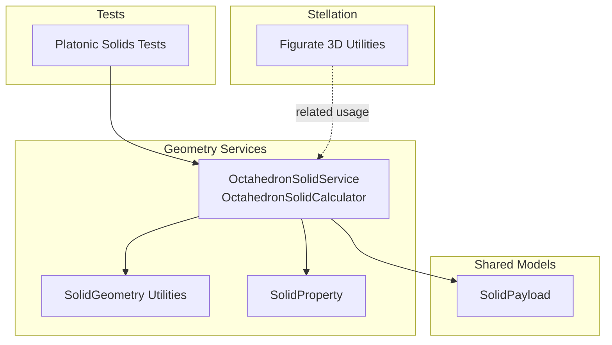
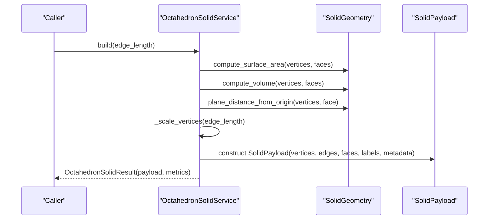
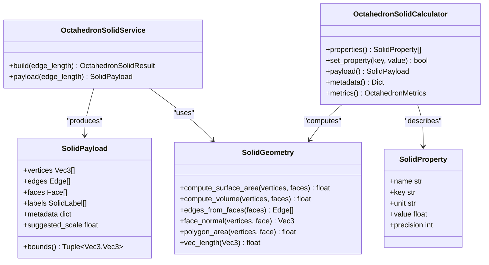

# Octahedron Solid API

<cite>
**Referenced Files in This Document**
- [octahedron_solid.py](file://src/pillars/geometry/services/octahedron_solid.py)
- [solid_geometry.py](file://src/pillars/geometry/services/solid_geometry.py)
- [solid_payload.py](file://src/pillars/geometry/shared/solid_payload.py)
- [solid_property.py](file://src/pillars/geometry/services/solid_property.py)
- [test_platonic_solids.py](file://test/test_platonic_solids.py)
- [figurate_3d.py](file://src/pillars/geometry/services/figurate_3d.py)
</cite>

## Table of Contents
1. [Introduction](#introduction)
2. [Project Structure](#project-structure)
3. [Core Components](#core-components)
4. [Architecture Overview](#architecture-overview)
5. [Detailed Component Analysis](#detailed-component-analysis)
6. [Dependency Analysis](#dependency-analysis)
7. [Performance Considerations](#performance-considerations)
8. [Troubleshooting Guide](#troubleshooting-guide)
9. [Conclusion](#conclusion)
10. [Appendices](#appendices)

## Introduction
This document provides API documentation for the OctahedronSolid class suite, focusing on the construction of a regular octahedron with eight equilateral triangular faces, symmetric vertex placement along the primary axes, and derived geometric properties. It explains how to construct octahedra from an edge length, compute metrics (volume, surface area, inradius, circumradius, midradius, and related circumferences), extract triangular faces, compute face normals, and integrate with SolidGeometry for coordinate generation and stellation. It also covers examples for building octahedra, transforming into dual forms conceptually, exporting wireframe data, and addressing performance and numerical robustness considerations.

## Project Structure
The OctahedronSolid API resides in the geometry services layer and integrates with shared payload and property models. The key files are:
- OctahedronSolid service and calculator
- Solid geometry utilities for vector math, area/volume computation, and edge extraction
- Solid payload model for wireframe data transport
- Solid property model for calculator metrics
- Tests validating closed-form formulas
- Optional stellation utilities for related geometric forms

**Diagram sources**
- [octahedron_solid.py](file://src/pillars/geometry/services/octahedron_solid.py#L108-L244)
- [solid_geometry.py](file://src/pillars/geometry/services/solid_geometry.py#L1-L156)
- [solid_payload.py](file://src/pillars/geometry/shared/solid_payload.py#L1-L52)
- [solid_property.py](file://src/pillars/geometry/services/solid_property.py#L1-L21)
- [test_platonic_solids.py](file://test/test_platonic_solids.py#L40-L55)
- [figurate_3d.py](file://src/pillars/geometry/services/figurate_3d.py#L349-L401)

**Section sources**
- [octahedron_solid.py](file://src/pillars/geometry/services/octahedron_solid.py#L108-L244)
- [solid_geometry.py](file://src/pillars/geometry/services/solid_geometry.py#L1-L156)
- [solid_payload.py](file://src/pillars/geometry/shared/solid_payload.py#L1-L52)
- [solid_property.py](file://src/pillars/geometry/services/solid_property.py#L1-L21)
- [test_platonic_solids.py](file://test/test_platonic_solids.py#L40-L55)
- [figurate_3d.py](file://src/pillars/geometry/services/figurate_3d.py#L349-L401)

## Core Components
- OctahedronSolidService: Builds a SolidPayload for a regular octahedron given an edge length, computes metrics, and attaches labels and metadata.
- OctahedronSolidCalculator: Bidirectional calculator that derives edge length from any provided metric and updates all derived properties accordingly.
- SolidGeometry: Provides vector math, polygon area, volume, edge extraction, and face normal computation.
- SolidPayload: Standardized wireframe container for vertices, edges, faces, labels, and metadata.
- SolidProperty: Metric descriptor used by calculators.

Key responsibilities:
- Vertex layout: Six vertices placed at ±X, ±Y, ±Z axes for a unit octahedron.
- Face definition: Eight triangular faces around the origin.
- Scaling: Uniform scaling by edge length using base metrics computed from the unit octahedron.
- Metrics: Surface area, volume, inradius, midradius, circumradius, and circumference equivalents.

**Section sources**
- [octahedron_solid.py](file://src/pillars/geometry/services/octahedron_solid.py#L22-L138)
- [solid_geometry.py](file://src/pillars/geometry/services/solid_geometry.py#L46-L117)
- [solid_payload.py](file://src/pillars/geometry/shared/solid_payload.py#L19-L52)
- [solid_property.py](file://src/pillars/geometry/services/solid_property.py#L8-L21)

## Architecture Overview
The OctahedronSolid API composes a base unit octahedron, scales it to the requested edge length, and computes derived metrics. The SolidGeometry module supplies reusable math utilities for area/volume and normals.

**Diagram sources**
- [octahedron_solid.py](file://src/pillars/geometry/services/octahedron_solid.py#L112-L138)
- [solid_geometry.py](file://src/pillars/geometry/services/solid_geometry.py#L77-L91)

**Section sources**
- [octahedron_solid.py](file://src/pillars/geometry/services/octahedron_solid.py#L112-L138)
- [solid_geometry.py](file://src/pillars/geometry/services/solid_geometry.py#L77-L91)

## Detailed Component Analysis

### OctahedronSolidService
- Purpose: Construct a regular octahedron SolidPayload and compute OctahedronMetrics.
- Inputs: edge_length (positive float).
- Outputs: OctahedronSolidResult containing payload and metrics.
- Behavior:
  - Validates edge_length > 0.
  - Computes base metrics from a unit octahedron (vertices on ±X, ±Y, ±Z).
  - Scales vertices uniformly by edge_length/base_edge_length.
  - Assembles edges from faces and defines triangular faces.
  - Attaches labels and metadata for rendering and UI.

Key methods and attributes:
- build(edge_length): Returns OctahedronSolidResult.
- payload(edge_length): Convenience method returning SolidPayload only.
- Internal constants: BASE_VERTICES, FACES, EDGES, BASE_* metrics.

Vertex layout and face winding:
- Vertices are aligned with ±X, ±Y, ±Z axes.
- Faces are defined as triplets (v0, v1, v2) in CCW order around the outward-pointing normal.
- Edge extraction ensures undirected edges from face cycles.

Integration with SolidGeometry:
- Uses compute_surface_area, compute_volume, plane_distance_from_origin, edges_from_faces, polygon_area, vec_length.

**Section sources**
- [octahedron_solid.py](file://src/pillars/geometry/services/octahedron_solid.py#L22-L138)
- [solid_geometry.py](file://src/pillars/geometry/services/solid_geometry.py#L46-L117)

### OctahedronSolidCalculator
- Purpose: Bidirectional calculator that sets any metric and derives the edge length, updating all properties.
- Inputs: Property keys and values (e.g., surface_area, volume, inradius).
- Behavior:
  - Maintains SolidProperty descriptors with units and precision.
  - Uses power-law scaling from base values to derive edge length.
  - Applies edge length to rebuild payload and metrics.

Properties supported:
- edge_length, surface_area, volume, face_area, inradius, midradius, circumradius, incircle_circumference, midsphere_circumference, circumcircle_circumference.

**Section sources**
- [octahedron_solid.py](file://src/pillars/geometry/services/octahedron_solid.py#L145-L244)
- [solid_property.py](file://src/pillars/geometry/services/solid_property.py#L8-L21)

### SolidGeometry Utilities
- Vector operations: add, subtract, scale, dot, cross, length, normalize.
- Polygon area: triangulation-based summation.
- Volume: tetrahedral decomposition around origin.
- Edges from faces: deduplicates and sorts undirected edges.
- Face normal: cross product of two face edges.
- Plane distance from origin: magnitude of projection onto unit normal.

These utilities underpin OctahedronSolidService’s metric computations and are essential for extracting triangular faces and normals.

**Section sources**
- [solid_geometry.py](file://src/pillars/geometry/services/solid_geometry.py#L1-L156)

### SolidPayload Model
- Purpose: Transport wireframe data and metadata.
- Fields: vertices, edges, faces, labels, metadata, suggested_scale.
- Methods: bounds() for axis-aligned bounding box.

Used by OctahedronSolidService to package computed geometry for downstream consumers.

**Section sources**
- [solid_payload.py](file://src/pillars/geometry/shared/solid_payload.py#L19-L52)

### Mathematical Derivations and Geometric Properties
Derived from the unit octahedron with vertices at (±1,0,0), (0,±1,0), (0,0,±1):
- Edge length: sqrt(2)
- Face area: sqrt(3)/4
- Surface area: 2*sqrt(3)
- Volume: sqrt(2)/3
- Inradius: sqrt(6)/6
- Midradius: 0.5
- Circumradius: 1
- Related circumferences: 2*pi*inradius, 2*pi*midradius, 2*pi*circumradius

Scaling:
- All linear properties scale with edge_length.
- Areas scale with edge_length^2.
- Volumes scale with edge_length^3.

Validation:
- Unit tests confirm closed-form formulas for surface area, volume, inradius, midradius, and circumradius against computed metrics.

**Section sources**
- [octahedron_solid.py](file://src/pillars/geometry/services/octahedron_solid.py#L42-L58)
- [test_platonic_solids.py](file://test/test_platonic_solids.py#L40-L55)

### Extracting Triangular Faces and Computing Face Normals
- Faces: Provided as triplets of vertex indices; each face is a triangle.
- Normals: Computed via cross product of two edges; normalized to unit length.
- Orientation: Outward-pointing normals by construction of cross products from CCW-ordered vertices.

Integration points:
- SolidGeometry.face_normal returns a Vec3 normal vector.
- SolidGeometry.polygon_area and compute_surface_area support area computations.

**Section sources**
- [octahedron_solid.py](file://src/pillars/geometry/services/octahedron_solid.py#L31-L41)
- [solid_geometry.py](file://src/pillars/geometry/services/solid_geometry.py#L58-L75)

### Dual Forms (Cube)
- Concept: The octahedron and cube are dual polyhedra. The dual of a regular octahedron is a cube with edge length proportional to the octahedron’s circumradius.
- Implementation note: While the OctahedronSolidService does not directly produce a cube, the dual relationship can be used to transform between representations conceptually. For example, a cube dual to an octahedron with circumradius R would have edge length proportional to R.

[No sources needed since this section explains conceptual relationships rather than specific code]

### Stellation and Integration
- Stellation: The figurate_3d module includes a stellated octahedron (Merkaaba) generator combining two intersecting tetrahedra.
- Integration: OctahedronSolidService focuses on the base octahedron; stellation builds upon related geometric primitives.

**Section sources**
- [figurate_3d.py](file://src/pillars/geometry/services/figurate_3d.py#L349-L401)

### Examples

- Construct an octahedron from edge length:
  - Use OctahedronSolidService.build(edge_length) to obtain a SolidPayload and metrics.
  - Access payload.vertices, payload.edges, payload.faces for rendering or export.

- Compute metrics from a known property:
  - Use OctahedronSolidCalculator.set_property('volume', value) to derive edge_length and update all properties.

- Export wireframe data:
  - Use payload.vertices, payload.edges, payload.faces to serialize or render.
  - Optionally attach labels via payload.labels and metadata via payload.metadata.

- Transform into dual cube (conceptual):
  - Given an octahedron with circumradius R, a dual cube can be constructed with edge length proportional to R. This is conceptual and not implemented by OctahedronSolidService.

**Section sources**
- [octahedron_solid.py](file://src/pillars/geometry/services/octahedron_solid.py#L112-L138)
- [octahedron_solid.py](file://src/pillars/geometry/services/octahedron_solid.py#L145-L244)
- [solid_payload.py](file://src/pillars/geometry/shared/solid_payload.py#L19-L52)

## Dependency Analysis
The OctahedronSolidService depends on SolidGeometry for math utilities and on SolidPayload/SolidProperty for structured output and property descriptors.

**Diagram sources**
- [octahedron_solid.py](file://src/pillars/geometry/services/octahedron_solid.py#L108-L244)
- [solid_geometry.py](file://src/pillars/geometry/services/solid_geometry.py#L1-L156)
- [solid_payload.py](file://src/pillars/geometry/shared/solid_payload.py#L19-L52)
- [solid_property.py](file://src/pillars/geometry/services/solid_property.py#L8-L21)

**Section sources**
- [octahedron_solid.py](file://src/pillars/geometry/services/octahedron_solid.py#L108-L244)
- [solid_geometry.py](file://src/pillars/geometry/services/solid_geometry.py#L1-L156)
- [solid_payload.py](file://src/pillars/geometry/shared/solid_payload.py#L19-L52)
- [solid_property.py](file://src/pillars/geometry/services/solid_property.py#L8-L21)

## Performance Considerations
- Precomputed base metrics: The unit octahedron’s metrics are computed once and scaled using power laws, minimizing repeated heavy computations.
- Vector math: SolidGeometry uses efficient vector operations and avoids unnecessary allocations.
- Rendering pipeline: SolidPayload provides a compact wireframe representation suitable for GPU upload or immediate-mode rendering.
- Numerical robustness: Cross products and normalization are used carefully; tests validate correctness against closed-form formulas.

[No sources needed since this section provides general guidance]

## Troubleshooting Guide
- Invalid edge length:
  - OctahedronSolidService.build raises an error for non-positive edge_length.
- Non-triangular faces:
  - Ensure faces are defined as triplets; SolidGeometry expects triangular faces for polygon_area and face_normal.
- Zero-length normals:
  - face_normal returns zero vector for degenerate faces; ensure vertices are not collinear.
- Unexpected scaling:
  - Verify edge_length scaling uses base_edge_length derived from the unit octahedron.

**Section sources**
- [octahedron_solid.py](file://src/pillars/geometry/services/octahedron_solid.py#L112-L115)
- [solid_geometry.py](file://src/pillars/geometry/services/solid_geometry.py#L58-L75)

## Conclusion
The OctahedronSolid API provides a robust, mathematically sound construction of regular octahedra with derived metrics, integrated wireframe packaging, and bidirectional property calculation. Its design leverages reusable geometry utilities and a standardized payload model, enabling efficient real-time visualization and export workflows while maintaining numerical stability.

## Appendices

### API Reference

- OctahedronSolidService
  - build(edge_length: float) -> OctahedronSolidResult
  - payload(edge_length: float) -> SolidPayload

- OctahedronSolidCalculator
  - properties() -> List[SolidProperty]
  - set_property(key: str, value: Optional[float]) -> bool
  - payload() -> Optional[SolidPayload]
  - metadata() -> Dict[str, float]
  - metrics() -> Optional[OctahedronMetrics]

- SolidGeometry
  - compute_surface_area(vertices, faces) -> float
  - compute_volume(vertices, faces) -> float
  - edges_from_faces(faces) -> List[Tuple[int,int]]
  - face_normal(vertices, face) -> Vec3
  - polygon_area(vertices, face) -> float
  - vec_length(Vec3) -> float

- SolidPayload
  - vertices: List[Vec3]
  - edges: List[Tuple[int,int]]
  - faces: List[Sequence[int]]
  - labels: List[SolidLabel]
  - metadata: dict
  - suggested_scale: Optional[float]
  - bounds() -> Optional[Tuple[Vec3,Vec3]]

- SolidProperty
  - name: str
  - key: str
  - unit: str
  - value: Optional[float]
  - precision: int

**Section sources**
- [octahedron_solid.py](file://src/pillars/geometry/services/octahedron_solid.py#L108-L244)
- [solid_geometry.py](file://src/pillars/geometry/services/solid_geometry.py#L1-L156)
- [solid_payload.py](file://src/pillars/geometry/shared/solid_payload.py#L19-L52)
- [solid_property.py](file://src/pillars/geometry/services/solid_property.py#L8-L21)

### Geometric Notes
- Vertex layout: Aligned with ±X, ±Y, ±Z axes for a unit octahedron.
- Face winding: Triangular faces are defined in CCW order around outward normals.
- Orientation assumptions: Normals point outward; face centroids and normals are computed consistently.

**Section sources**
- [octahedron_solid.py](file://src/pillars/geometry/services/octahedron_solid.py#L22-L41)
- [solid_geometry.py](file://src/pillars/geometry/services/solid_geometry.py#L58-L75)