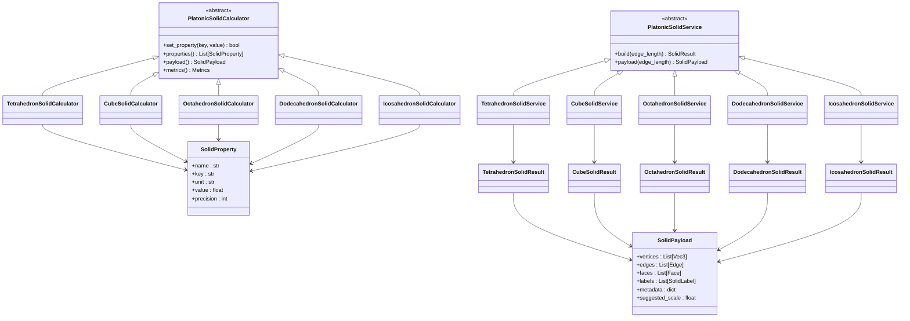
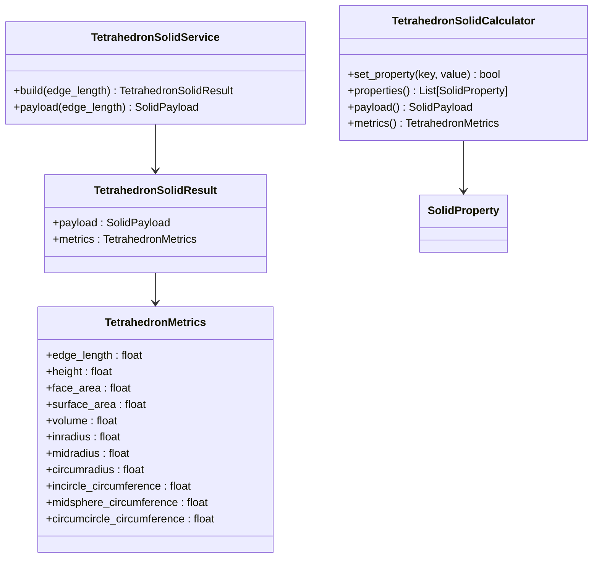
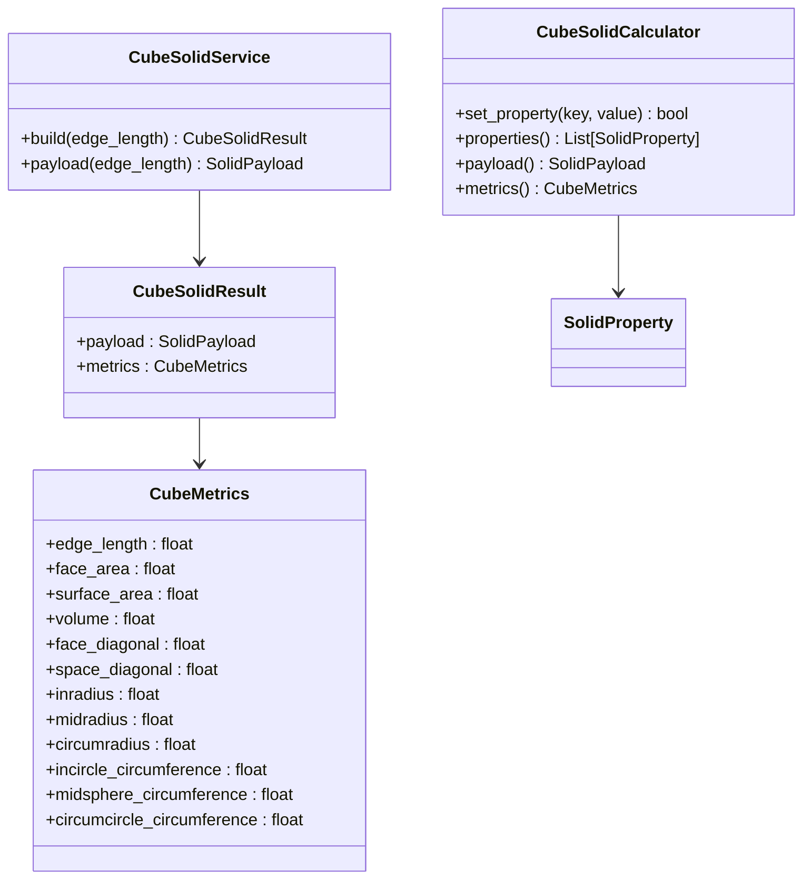
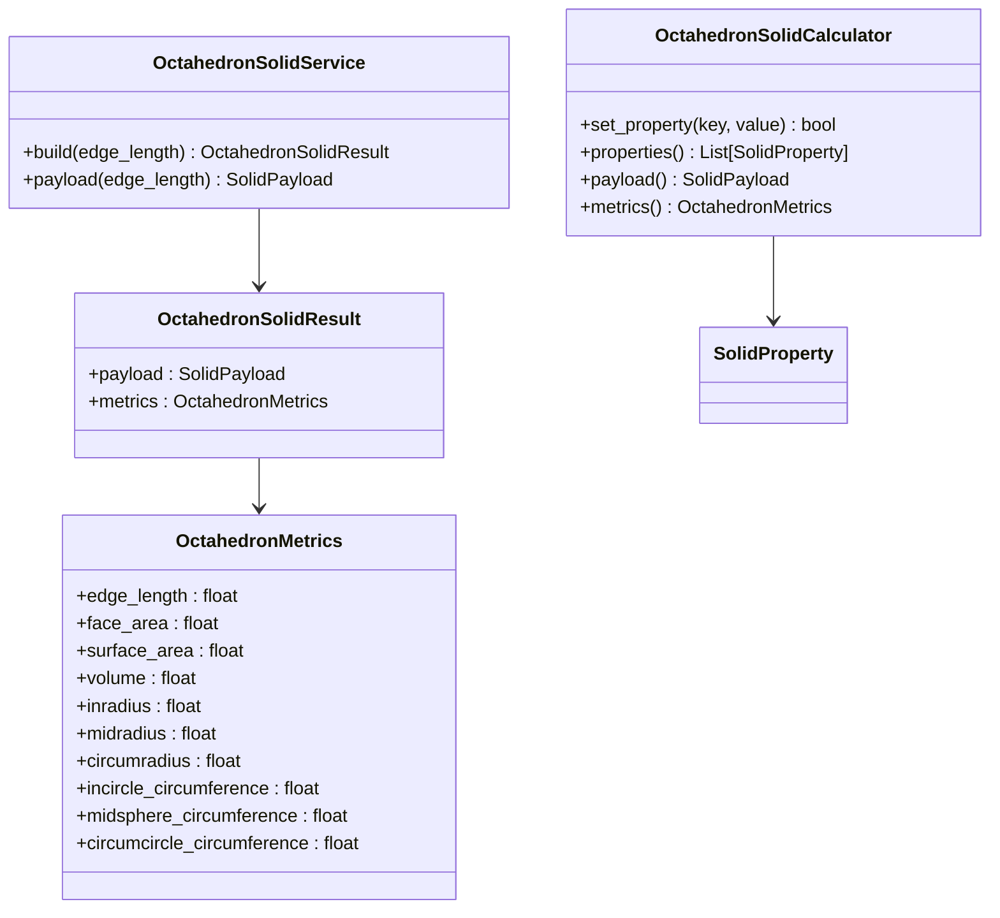
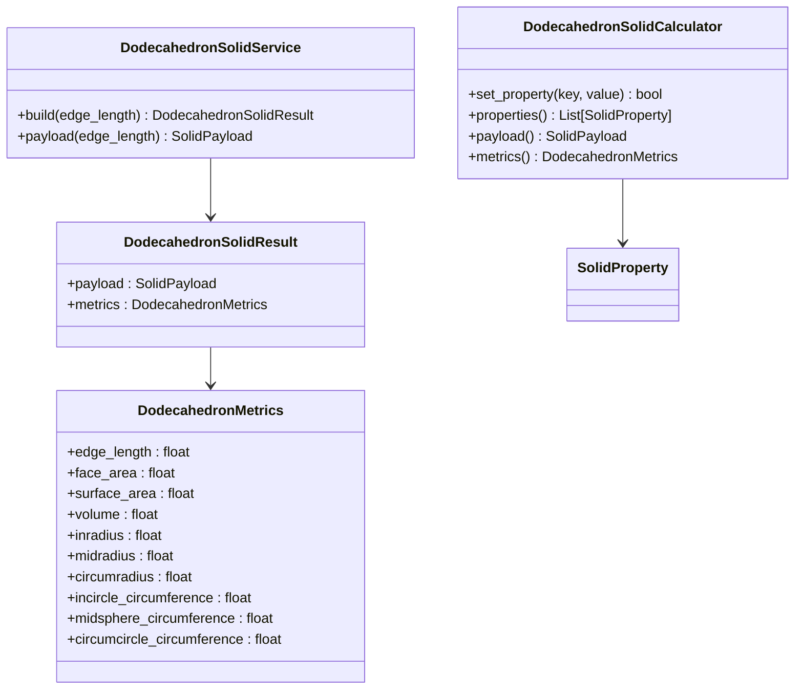
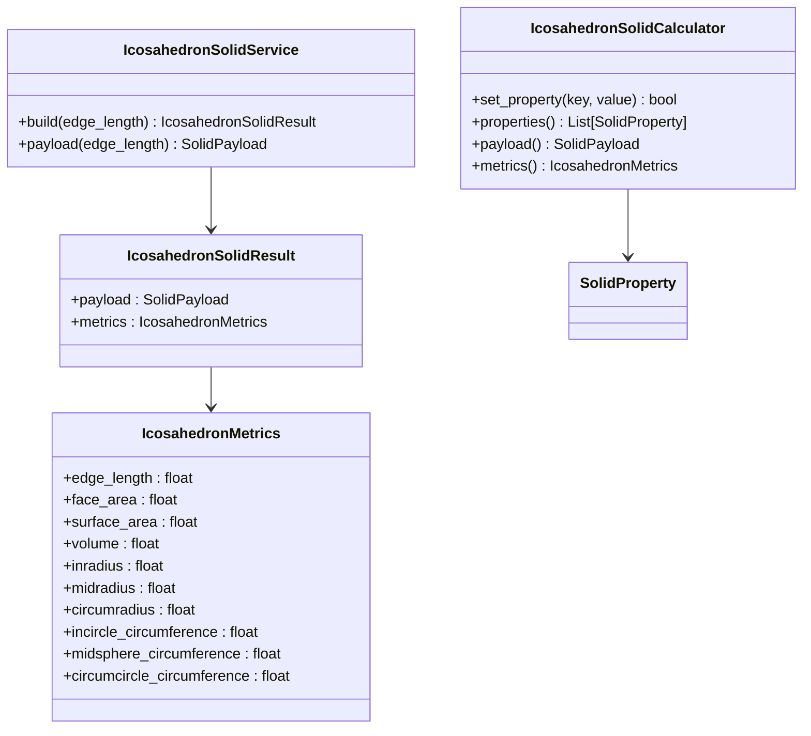

# Platonic Solids API

<cite>
**Referenced Files in This Document**   
- [tetrahedron_solid.py](file://src/pillars/geometry/services/tetrahedron_solid.py)
- [cube_solid.py](file://src/pillars/geometry/services/cube_solid.py)
- [octahedron_solid.py](file://src/pillars/geometry/services/octahedron_solid.py)
- [dodecahedron_solid.py](file://src/pillars/geometry/services/dodecahedron_solid.py)
- [icosahedron_solid.py](file://src/pillars/geometry/services/icosahedron_solid.py)
- [solid_geometry.py](file://src/pillars/geometry/services/solid_geometry.py)
- [solid_payload.py](file://src/pillars/geometry/shared/solid_payload.py)
- [solid_property.py](file://src/pillars/geometry/services/solid_property.py)
</cite>

## Table of Contents
1. [Introduction](#introduction)
2. [Core Architecture](#core-architecture)
3. [SolidGeometry Utility Engine](#solidgeometry-utility-engine)
4. [Platonic Solid Classes](#platonic-solid-classes)
   - [TetrahedronSolid](#tetrahedronsolid)
   - [CubeSolid](#cubesolid)
   - [OctahedronSolid](#octahedronsolid)
   - [DodecahedronSolid](#dodecahedronsolid)
   - [IcosahedronSolid](#icosahedronsolid)
5. [Mathematical Formulas](#mathematical-formulas)
6. [Usage Examples](#usage-examples)
7. [Precision and Performance](#precision-and-performance)
8. [Conclusion](#conclusion)

## Introduction

The Platonic Solids service layer provides a comprehensive API for generating and analyzing the five regular convex polyhedra: Tetrahedron, Cube, Octahedron, Dodecahedron, and Icosahedron. Each solid is implemented as a service class that generates geometric data with precise mathematical properties, supporting applications in 3D rendering, mathematical visualization, and geometric analysis. The API follows a consistent pattern across all solids, with standardized parameterization, coordinate systems, and output formats.

All Platonic solids are centered at the origin with consistent orientation conventions. The edge length parameter controls the scale of each solid, with all geometric properties computed relative to this parameter. The service layer provides both direct payload generation and bidirectional calculators that allow any geometric property to be used as an input to determine the others.

**Section sources**
- [tetrahedron_solid.py](file://src/pillars/geometry/services/tetrahedron_solid.py#L1-L238)
- [cube_solid.py](file://src/pillars/geometry/services/cube_solid.py#L1-L265)
- [octahedron_solid.py](file://src/pillars/geometry/services/octahedron_solid.py#L1-L251)
- [dodecahedron_solid.py](file://src/pillars/geometry/services/dodecahedron_solid.py#L1-L311)
- [icosahedron_solid.py](file://src/pillars/geometry/services/icosahedron_solid.py#L1-L271)

## Core Architecture

The Platonic Solids API follows a service-oriented architecture with consistent design patterns across all implementations. Each solid has three core components: a service class for payload generation, a metrics dataclass for geometric properties, and a calculator class for bidirectional property computation.



**Diagram sources**
- [tetrahedron_solid.py](file://src/pillars/geometry/services/tetrahedron_solid.py#L1-L238)
- [cube_solid.py](file://src/pillars/geometry/services/cube_solid.py#L1-L265)
- [solid_payload.py](file://src/pillars/geometry/shared/solid_payload.py#L1-L52)
- [solid_property.py](file://src/pillars/geometry/services/solid_property.py#L1-L21)

**Section sources**
- [tetrahedron_solid.py](file://src/pillars/geometry/services/tetrahedron_solid.py#L1-L238)
- [cube_solid.py](file://src/pillars/geometry/services/cube_solid.py#L1-L265)
- [solid_payload.py](file://src/pillars/geometry/shared/solid_payload.py#L1-L52)
- [solid_property.py](file://src/pillars/geometry/services/solid_property.py#L1-L21)

## SolidGeometry Utility Engine

The SolidGeometry module provides the core mathematical utilities used across all Platonic solids. This engine implements fundamental 3D geometric operations that enable consistent computation of surface area, volume, and other properties. The utility functions are designed for numerical stability and efficiency in real-time rendering contexts.

```mermaid
classDiagram
class SolidGeometry {
+vec_add(a, b) Vec3
+vec_sub(a, b) Vec3
+vec_scale(a, scalar) Vec3
+vec_dot(a, b) float
+vec_cross(a, b) Vec3
+vec_length(a) float
+vec_normalize(a) Vec3
+polygon_area(vertices, face) float
+face_normal(vertices, face) Vec3
+plane_distance_from_origin(vertices, face) float
+compute_surface_area(vertices, faces) float
+compute_volume(vertices, faces) float
+edges_from_faces(faces) List[Edge]
+face_centroid(vertices, face) Vec3
+angle_around_axis(point, axis, ref_axis) float
}
class Vec3 {
<<type alias>>
(float, float, float)
}
class Face {
<<type alias>>
Sequence[int]
}
SolidGeometry --> Vec3
SolidGeometry --> Face
```

**Diagram sources**
- [solid_geometry.py](file://src/pillars/geometry/services/solid_geometry.py#L1-L156)

**Section sources**
- [solid_geometry.py](file://src/pillars/geometry/services/solid_geometry.py#L1-L156)

## Platonic Solid Classes

### TetrahedronSolid

The TetrahedronSolid class generates regular tetrahedra with precise geometric properties. The tetrahedron is the simplest Platonic solid, with 4 equilateral triangular faces, 4 vertices, and 6 edges. The implementation uses canonical coordinates scaled to the specified edge length.



**Diagram sources**
- [tetrahedron_solid.py](file://src/pillars/geometry/services/tetrahedron_solid.py#L1-L238)

**Section sources**
- [tetrahedron_solid.py](file://src/pillars/geometry/services/tetrahedron_solid.py#L1-L238)

### CubeSolid

The CubeSolid class generates regular hexahedra (cubes) with 6 square faces, 8 vertices, and 12 edges. The implementation provides exact geometric calculations for all cube properties, including face and space diagonals.



**Diagram sources**
- [cube_solid.py](file://src/pillars/geometry/services/cube_solid.py#L1-L265)

**Section sources**
- [cube_solid.py](file://src/pillars/geometry/services/cube_solid.py#L1-L265)

### OctahedronSolid

The OctahedronSolid class generates regular octahedra with 8 equilateral triangular faces, 6 vertices, and 12 edges. The octahedron is the dual of the cube, and its vertices align with the coordinate axes.



**Diagram sources**
- [octahedron_solid.py](file://src/pillars/geometry/services/octahedron_solid.py#L1-L251)

**Section sources**
- [octahedron_solid.py](file://src/pillars/geometry/services/octahedron_solid.py#L1-L251)

### DodecahedronSolid

The DodecahedronSolid class generates regular dodecahedra with 12 regular pentagonal faces, 20 vertices, and 30 edges. The implementation uses the golden ratio (φ = (1+√5)/2) in its construction, as the dodecahedron's geometry is intrinsically related to this mathematical constant.



**Diagram sources**
- [dodecahedron_solid.py](file://src/pillars/geometry/services/dodecahedron_solid.py#L1-L311)

**Section sources**
- [dodecahedron_solid.py](file://src/pillars/geometry/services/dodecahedron_solid.py#L1-L311)

### IcosahedronSolid

The IcosahedronSolid class generates regular icosahedra with 20 equilateral triangular faces, 12 vertices, and 30 edges. The icosahedron is the dual of the dodecahedron, and its vertices can be constructed using the golden ratio.



**Diagram sources**
- [icosahedron_solid.py](file://src/pillars/geometry/services/icosahedron_solid.py#L1-L271)

**Section sources**
- [icosahedron_solid.py](file://src/pillars/geometry/services/icosahedron_solid.py#L1-L271)

## Mathematical Formulas

The Platonic Solids API implements exact mathematical formulas for all geometric properties. The following table summarizes the key formulas for each solid, where *a* represents the edge length:

```mermaid
flowchart TD
A[Platonic Solids] --> B[Tetrahedron]
A --> C[Cube]
A --> D[Octahedron]
A --> E[Dodecahedron]
A --> F[Icosahedron]
B --> B1[Volume: a³/(6√2)]
B --> B2[Surface Area: √3·a²]
B --> B3[Inradius: a√6/12]
B --> B4[Circumradius: a√6/4]
C --> C1[Volume: a³]
C --> C2[Surface Area: 6a²]
C --> C3[Face Diagonal: a√2]
C --> C4[Space Diagonal: a√3]
C --> C5[Inradius: a/2]
C --> C6[Circumradius: a√3/2]
D --> D1[Volume: √2·a³/3]
D --> D2[Surface Area: 2√3·a²]
D --> D3[Inradius: a√6/6]
D --> D4[Circumradius: a√2/2]
E --> E1[Volume: (15+7√5)a³/4]
E --> E2[Surface Area: 3√(25+10√5)·a²]
E --> E3[Inradius: a√(10(25+11√5))/20]
E --> E4[Circumradius: a(√3+√15)/4]
F --> F1[Volume: 5(3+√5)a³/12]
F --> F2[Surface Area: 5√3·a²]
F --> F3[Inradius: a√(70+30√5)/20]
F --> F4[Circumradius: a√(10+2√5)/4]
```

**Diagram sources**
- [tetrahedron_solid.py](file://src/pillars/geometry/services/tetrahedron_solid.py#L206-L229)
- [cube_solid.py](file://src/pillars/geometry/services/cube_solid.py#L97-L111)
- [octahedron_solid.py](file://src/pillars/geometry/services/octahedron_solid.py#L93-L105)
- [dodecahedron_solid.py](file://src/pillars/geometry/services/dodecahedron_solid.py#L153-L165)
- [icosahedron_solid.py](file://src/pillars/geometry/services/icosahedron_solid.py#L113-L125)

**Section sources**
- [tetrahedron_solid.py](file://src/pillars/geometry/services/tetrahedron_solid.py#L206-L229)
- [cube_solid.py](file://src/pillars/geometry/services/cube_solid.py#L97-L111)
- [octahedron_solid.py](file://src/pillars/geometry/services/octahedron_solid.py#L93-L105)
- [dodecahedron_solid.py](file://src/pillars/geometry/services/dodecahedron_solid.py#L153-L165)
- [icosahedron_solid.py](file://src/pillars/geometry/services/icosahedron_solid.py#L113-L125)

## Usage Examples

The Platonic Solids API provides multiple ways to generate and work with Platonic solids. The following examples demonstrate common usage patterns:

### Generating Canonical Forms

To generate a tetrahedron with edge length 2.0:

```python
from src.pillars.geometry.services.tetrahedron_solid import TetrahedronSolidService

result = TetrahedronSolidService.build(edge_length=2.0)
payload = result.payload
metrics = result.metrics
```

### Computing Duals

The dodecahedron is implemented as the dual of the icosahedron. The dual computation is performed by creating vertices at the face centroids of the original solid:

```python
# In dodecahedron_solid.py
def _build_dual_vertices() -> List[Vec3]:
    vertices: List[Vec3] = []
    for face in _ICOSAHEDRON_FACES:
        normal = face_normal(_ICOSAHEDRON_VERTICES, face)
        centroid = face_centroid(_ICOSAHEDRON_VERTICES, face)
        if math.isclose(vec_length(normal), 0.0):
            vertices.append((0.0, 0.0, 0.0))
            continue
        if sum(n * c for n, c in zip(normal, centroid)) < 0:
            normal = (-normal[0], -normal[1], -normal[2])
        vertices.append(vec_normalize(normal))
    return vertices
```

### Extracting Face/Edge/Vertex Data

All solids provide access to their geometric components through the SolidPayload:

```python
payload = CubeSolidService.payload(edge_length=1.0)
vertices = payload.vertices  # 8 vertices
edges = payload.edges        # 12 edges
faces = payload.faces        # 6 faces
metadata = payload.metadata  # All computed metrics
```

### Bidirectional Property Calculation

The calculator classes allow any property to be used as input:

```python
from src.pillars.geometry.services.cube_solid import CubeSolidCalculator

calc = CubeSolidCalculator()
# Set surface area and derive edge length
calc.set_property('surface_area', 54.0)  # edge length becomes 3.0
edge_length = calc.properties()[0].value  # 3.0
volume = calc.properties()[2].value       # 27.0
```

**Section sources**
- [tetrahedron_solid.py](file://src/pillars/geometry/services/tetrahedron_solid.py#L64-L95)
- [cube_solid.py](file://src/pillars/geometry/services/cube_solid.py#L118-L146)
- [dodecahedron_solid.py](file://src/pillars/geometry/services/dodecahedron_solid.py#L172-L198)
- [solid_payload.py](file://src/pillars/geometry/shared/solid_payload.py#L21-L26)

## Precision and Performance

The Platonic Solids API addresses floating-point precision and performance considerations for real-time 3D rendering contexts:

### Golden Ratio Calculations

The dodecahedron and icosahedron implementations use the golden ratio φ = (1+√5)/2, which is computed once and reused:

```python
_phi = (1.0 + math.sqrt(5.0)) / 2.0
```

This approach minimizes floating-point errors by avoiding repeated computation of the irrational number.

### Performance Optimizations

The API uses several performance optimizations:

1. **Precomputed Base Values**: Each solid has a canonical form with precomputed geometric properties that are scaled to the requested edge length.
2. **Efficient Scaling**: Instead of recomputing vertex coordinates, the API scales precomputed canonical coordinates.
3. **Caching**: The calculator classes cache results to avoid redundant computations when multiple properties are accessed.

For real-time rendering, the API can be used to precompute solid data at initialization and reuse the payloads, minimizing computational overhead during rendering loops.

**Section sources**
- [dodecahedron_solid.py](file://src/pillars/geometry/services/dodecahedron_solid.py#L26-L27)
- [icosahedron_solid.py](file://src/pillars/geometry/services/icosahedron_solid.py#L22-L23)
- [cube_solid.py](file://src/pillars/geometry/services/cube_solid.py#L42-L59)

## Conclusion

The Platonic Solids API provides a comprehensive, mathematically precise implementation of the five regular polyhedra. Each solid is implemented with exact geometric constructions, symmetry properties, and mathematical formulas for all key measurements. The API's consistent design, with service classes for payload generation and calculator classes for bidirectional property computation, makes it easy to use and extend.

The SolidGeometry utility engine provides shared operations across all Platonic solids, ensuring consistency in calculations for volume, surface area, and other properties. The implementation handles edge length parameterization, orientation conventions, and vertex indexing schemes uniformly across all solids.

Special attention has been paid to floating-point precision in golden ratio calculations and performance considerations for real-time 3D rendering contexts. The API is suitable for applications ranging from mathematical visualization to game development and scientific computing.

[No sources needed since this section summarizes without analyzing specific files]