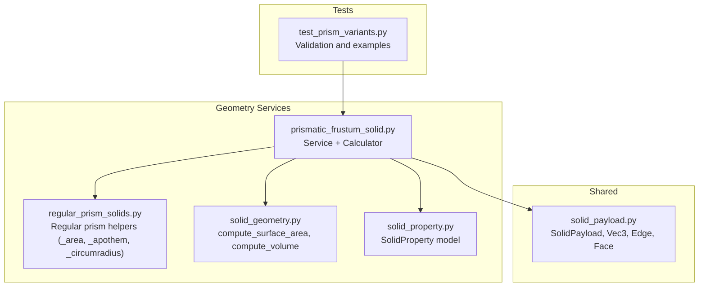
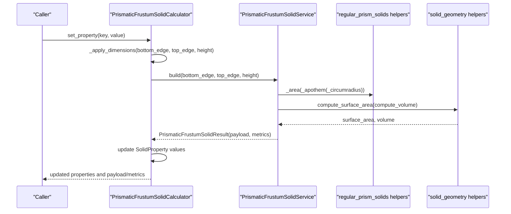
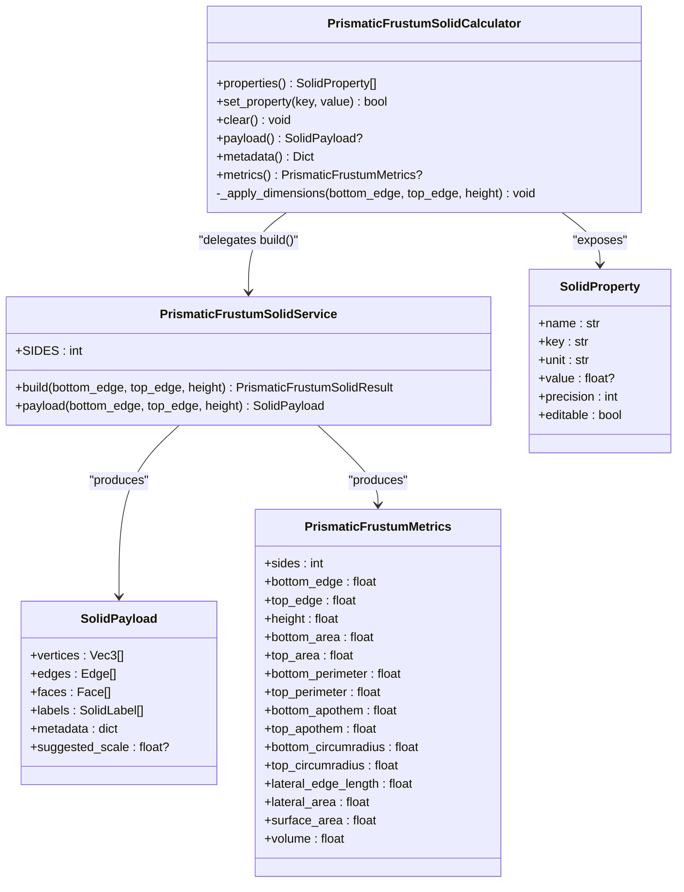
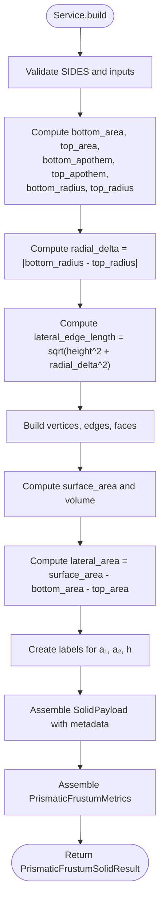
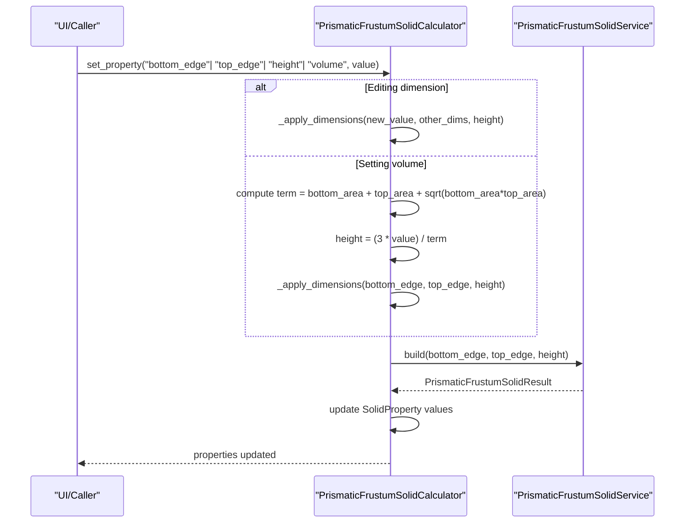
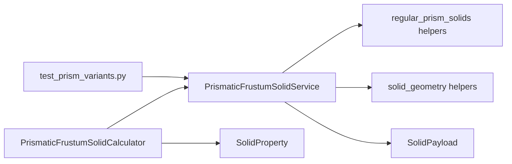

# Prismatic Frustums

<cite>
**Referenced Files in This Document**
- [prismatic_frustum_solid.py](file://src/pillars/geometry/services/prismatic_frustum_solid.py)
- [solid_payload.py](file://src/pillars/geometry/shared/solid_payload.py)
- [solid_property.py](file://src/pillars/geometry/services/solid_property.py)
- [regular_prism_solids.py](file://src/pillars/geometry/services/regular_prism_solids.py)
- [solid_geometry.py](file://src/pillars/geometry/services/solid_geometry.py)
- [test_prism_variants.py](file://test/test_prism_variants.py)
</cite>

## Table of Contents
1. [Introduction](#introduction)
2. [Project Structure](#project-structure)
3. [Core Components](#core-components)
4. [Architecture Overview](#architecture-overview)
5. [Detailed Component Analysis](#detailed-component-analysis)
6. [Dependency Analysis](#dependency-analysis)
7. [Performance Considerations](#performance-considerations)
8. [Troubleshooting Guide](#troubleshooting-guide)
9. [Conclusion](#conclusion)
10. [Appendices](#appendices)

## Introduction
This document provides API documentation for PrismaticFrustumSolidService and PrismaticFrustumSolidCalculator. It explains the build method’s parameters, how differing bottom and top edge lengths create a truncated prism with lateral faces as trapezoids, and the PrismaticFrustumMetrics output. It also covers interactive property management, examples for constructing a tapered hexagonal frustum, and edge cases such as inverted frustums and zero-height truncations. Finally, it clarifies the relationship between computation (service) and interactive property management (calculator).

## Project Structure
The prismatic frustum implementation resides in the geometry pillar under services and shared modules. The calculator integrates with a reusable SolidProperty model and builds payloads compatible with the geometry scene.

**Diagram sources**
- [prismatic_frustum_solid.py](file://src/pillars/geometry/services/prismatic_frustum_solid.py#L1-L276)
- [regular_prism_solids.py](file://src/pillars/geometry/services/regular_prism_solids.py#L1-L314)
- [solid_geometry.py](file://src/pillars/geometry/services/solid_geometry.py#L1-L156)
- [solid_payload.py](file://src/pillars/geometry/shared/solid_payload.py#L1-L52)
- [solid_property.py](file://src/pillars/geometry/services/solid_property.py#L1-L21)
- [test_prism_variants.py](file://test/test_prism_variants.py#L1-L90)

**Section sources**
- [prismatic_frustum_solid.py](file://src/pillars/geometry/services/prismatic_frustum_solid.py#L1-L276)
- [solid_payload.py](file://src/pillars/geometry/shared/solid_payload.py#L1-L52)
- [solid_property.py](file://src/pillars/geometry/services/solid_property.py#L1-L21)
- [regular_prism_solids.py](file://src/pillars/geometry/services/regular_prism_solids.py#L1-L314)
- [solid_geometry.py](file://src/pillars/geometry/services/solid_geometry.py#L1-L156)
- [test_prism_variants.py](file://test/test_prism_variants.py#L1-L90)

## Core Components
- PrismaticFrustumSolidService: Computes geometry and metrics for a truncated regular prism with parallel polygonal bases. Provides a build method and a convenience payload method.
- PrismaticFrustumSolidCalculator: Interactive property manager that exposes editable and computed properties and updates geometry on change.
- PrismaticFrustumMetrics: Immutable dataclass containing computed metrics.
- SolidPayload: Standardized geometry payload with vertices, edges, faces, labels, metadata, and suggested scale.
- SolidProperty: Lightweight property descriptor used by calculators.

Key defaults and constraints:
- Default values: bottom_edge=3.0, top_edge=1.75, height=4.0.
- All inputs must be positive floats.
- SIDES is fixed at 6 for hexagonal prisms.

**Section sources**
- [prismatic_frustum_solid.py](file://src/pillars/geometry/services/prismatic_frustum_solid.py#L41-L128)
- [prismatic_frustum_solid.py](file://src/pillars/geometry/services/prismatic_frustum_solid.py#L171-L266)
- [solid_payload.py](file://src/pillars/geometry/shared/solid_payload.py#L1-L52)
- [solid_property.py](file://src/pillars/geometry/services/solid_property.py#L1-L21)

## Architecture Overview
The service performs geometry computation and returns a SolidPayload plus metrics. The calculator wraps the service, exposes properties, and updates them reactively when dimensions change.

**Diagram sources**
- [prismatic_frustum_solid.py](file://src/pillars/geometry/services/prismatic_frustum_solid.py#L41-L128)
- [prismatic_frustum_solid.py](file://src/pillars/geometry/services/prismatic_frustum_solid.py#L171-L266)
- [regular_prism_solids.py](file://src/pillars/geometry/services/regular_prism_solids.py#L36-L71)
- [solid_geometry.py](file://src/pillars/geometry/services/solid_geometry.py#L77-L92)

## Detailed Component Analysis

### PrismaticFrustumSolidService
Responsibilities:
- Validates inputs and SIDES.
- Computes base areas, apothems, circumradii, lateral edge length, surface area, and volume.
- Builds vertices, edges, faces, labels, and metadata.
- Produces a SolidPayload and PrismaticFrustumMetrics.

Build method parameters:
- bottom_edge: positive float, default 3.0
- top_edge: positive float, default 1.75
- height: positive float, default 4.0

Behavior highlights:
- Uses regular polygon formulas to compute base metrics.
- Lateral edge length is derived from height and radial delta (absolute difference of circumradii).
- Surface area excludes base areas; lateral area equals total surface area minus two base areas.
- Vertex positions are placed symmetrically around the z-axis; faces include bottom/top polygons and lateral trapezoidal faces.

PrismaticFrustumMetrics fields:
- sides, bottom_edge, top_edge, height
- bottom_area, top_area
- bottom_perimeter, top_perimeter
- bottom_apothem, top_apothem
- bottom_circumradius, top_circumradius
- lateral_edge_length
- lateral_area, surface_area, volume

Notes on lateral faces:
- With equal sides and parallel bases, lateral faces connect corresponding edges of bottom and top polygons, forming trapezoids.

Edge cases:
- Inverted frustum (top_edge > bottom_edge): Allowed; lateral edge length remains positive due to radial delta. The service does not enforce ordering.
- Zero-height truncation: Not supported; height must be positive.

**Section sources**
- [prismatic_frustum_solid.py](file://src/pillars/geometry/services/prismatic_frustum_solid.py#L41-L128)
- [regular_prism_solids.py](file://src/pillars/geometry/services/regular_prism_solids.py#L36-L71)
- [solid_geometry.py](file://src/pillars/geometry/services/solid_geometry.py#L77-L92)

### PrismaticFrustumSolidCalculator
Responsibilities:
- Exposes properties for bottom_edge, top_edge, height, bottom_area, top_area, bottom_perimeter, top_perimeter, lateral_edge_length, lateral_area, surface_area, volume.
- Supports bidirectional updates:
  - Direct edits of bottom_edge, top_edge, height.
  - Setting volume recalculates height using the classical frustum volume formula.
- Maintains internal state and updates SolidProperty values accordingly.

Property definitions:
- Editable: bottom_edge, top_edge, height, volume.
- Computed: bottom_area, top_area, bottom_perimeter, top_perimeter, lateral_edge_length, lateral_area, surface_area.

Behavior highlights:
- set_property enforces positivity and returns false for invalid values.
- When setting volume, the calculator computes the implied height using the formula derived from the classical frustum volume equation.

Relationship to service:
- The calculator delegates geometry computation to the service and updates its own properties from the returned metrics.

Examples:
- Constructing a tapered hexagonal frustum:
  - Use default values or adjust bottom_edge and top_edge to create taper.
- Interactively adjusting dimensions:
  - Change bottom_edge, top_edge, or height; observe computed properties update.
  - Set volume to a target value; the calculator adjusts height accordingly.

Edge cases:
- Inverted frustum: Allowed; calculator sets properties normally.
- Zero-height truncation: Not supported; setting volume will not produce non-positive height.

**Section sources**
- [prismatic_frustum_solid.py](file://src/pillars/geometry/services/prismatic_frustum_solid.py#L171-L266)
- [solid_property.py](file://src/pillars/geometry/services/solid_property.py#L1-L21)

### Data Models and Payloads
SolidPayload:
- vertices: list of 3D points
- edges: list of vertex index pairs
- faces: list of vertex index sequences
- labels: list of text and positions
- metadata: dictionary of computed values
- suggested_scale: optional scaling hint

PrismaticFrustumMetrics:
- Immutable snapshot of computed values for a given set of dimensions.

**Section sources**
- [solid_payload.py](file://src/pillars/geometry/shared/solid_payload.py#L1-L52)
- [prismatic_frustum_solid.py](file://src/pillars/geometry/services/prismatic_frustum_solid.py#L16-L34)

## Architecture Overview

**Diagram sources**
- [prismatic_frustum_solid.py](file://src/pillars/geometry/services/prismatic_frustum_solid.py#L41-L128)
- [prismatic_frustum_solid.py](file://src/pillars/geometry/services/prismatic_frustum_solid.py#L171-L266)
- [solid_payload.py](file://src/pillars/geometry/shared/solid_payload.py#L1-L52)
- [solid_property.py](file://src/pillars/geometry/services/solid_property.py#L1-L21)

## Detailed Component Analysis

### Build Method Flow

**Diagram sources**
- [prismatic_frustum_solid.py](file://src/pillars/geometry/services/prismatic_frustum_solid.py#L41-L128)
- [regular_prism_solids.py](file://src/pillars/geometry/services/regular_prism_solids.py#L36-L71)
- [solid_geometry.py](file://src/pillars/geometry/services/solid_geometry.py#L77-L92)

**Section sources**
- [prismatic_frustum_solid.py](file://src/pillars/geometry/services/prismatic_frustum_solid.py#L41-L128)

### Calculator Property Update Flow

**Diagram sources**
- [prismatic_frustum_solid.py](file://src/pillars/geometry/services/prismatic_frustum_solid.py#L171-L266)

**Section sources**
- [prismatic_frustum_solid.py](file://src/pillars/geometry/services/prismatic_frustum_solid.py#L171-L266)

## Dependency Analysis
- Service depends on:
  - regular_prism_solids helpers for polygonal base metrics.
  - solid_geometry helpers for surface area and volume.
  - solid_payload for standardized geometry representation.
- Calculator depends on:
  - SolidProperty for property descriptors.
  - Service for geometry computation.
  - Tests validate behavior and formulas.

**Diagram sources**
- [prismatic_frustum_solid.py](file://src/pillars/geometry/services/prismatic_frustum_solid.py#L1-L276)
- [regular_prism_solids.py](file://src/pillars/geometry/services/regular_prism_solids.py#L1-L314)
- [solid_geometry.py](file://src/pillars/geometry/services/solid_geometry.py#L1-L156)
- [solid_payload.py](file://src/pillars/geometry/shared/solid_payload.py#L1-L52)
- [solid_property.py](file://src/pillars/geometry/services/solid_property.py#L1-L21)
- [test_prism_variants.py](file://test/test_prism_variants.py#L1-L90)

**Section sources**
- [prismatic_frustum_solid.py](file://src/pillars/geometry/services/prismatic_frustum_solid.py#L1-L276)
- [regular_prism_solids.py](file://src/pillars/geometry/services/regular_prism_solids.py#L1-L314)
- [solid_geometry.py](file://src/pillars/geometry/services/solid_geometry.py#L1-L156)
- [solid_payload.py](file://src/pillars/geometry/shared/solid_payload.py#L1-L52)
- [solid_property.py](file://src/pillars/geometry/services/solid_property.py#L1-L21)
- [test_prism_variants.py](file://test/test_prism_variants.py#L1-L90)

## Performance Considerations
- Complexity:
  - Build method is O(n) in the number of sides (constant for hexagons).
  - Surface area and volume computation depend on the number of faces and vertices; for a truncated hexagonal prism, these are small constants.
- Practical tips:
  - Prefer using the calculator for interactive editing; it caches results and updates only when dimensions change.
  - Avoid repeated recomputation by batching property updates when possible.

[No sources needed since this section provides general guidance]

## Troubleshooting Guide
Common issues and resolutions:
- Non-positive inputs:
  - Symptom: Validation errors raised during build or property updates.
  - Resolution: Ensure bottom_edge, top_edge, and height are positive floats.
- Inverted frustum (top_edge > bottom_edge):
  - Behavior: Allowed; lateral edge length remains positive via radial delta.
  - Impact: Bottom area larger than top area; orientation is still valid.
- Zero-height truncation:
  - Behavior: Not supported; height must be positive.
  - Impact: Setting volume to imply zero height is prevented; calculator returns false for invalid updates.
- Volume update anomalies:
  - Behavior: Setting volume computes height using the classical frustum formula.
  - Resolution: Verify base areas are computed correctly; ensure inputs are positive.

Validation and examples are covered by unit tests.

**Section sources**
- [prismatic_frustum_solid.py](file://src/pillars/geometry/services/prismatic_frustum_solid.py#L41-L128)
- [prismatic_frustum_solid.py](file://src/pillars/geometry/services/prismatic_frustum_solid.py#L171-L266)
- [test_prism_variants.py](file://test/test_prism_variants.py#L53-L90)

## Conclusion
PrismaticFrustumSolidService and PrismaticFrustumSolidCalculator provide a robust, interactive pipeline for computing and managing truncated regular prisms. The service encapsulates geometry computation with clear defaults and strong validation, while the calculator offers intuitive property management with bidirectional updates. Together, they support practical workflows such as constructing tapered hexagonal frustums and adjusting dimensions interactively, with well-defined behavior for edge cases.

[No sources needed since this section summarizes without analyzing specific files]

## Appendices

### API Reference: PrismaticFrustumSolidService
- build(bottom_edge=3.0, top_edge=1.75, height=4.0) -> PrismaticFrustumSolidResult
  - Computes base metrics, lateral edge length, surface area, and volume.
  - Returns SolidPayload and PrismaticFrustumMetrics.
- payload(bottom_edge=3.0, top_edge=1.75, height=4.0) -> SolidPayload
  - Convenience method returning only the payload.

Inputs:
- bottom_edge: positive float
- top_edge: positive float
- height: positive float

Outputs:
- SolidPayload with vertices, edges, faces, labels, metadata, suggested_scale
- PrismaticFrustumMetrics with sides, bottom_edge, top_edge, height, bottom_area, top_area, bottom_perimeter, top_perimeter, bottom_apothem, top_apothem, bottom_circumradius, top_circumradius, lateral_edge_length, lateral_area, surface_area, volume

Behavior notes:
- SIDES is fixed at 6.
- Lateral faces are trapezoids connecting corresponding edges of bottom and top polygons.
- Inverted frustums (top_edge > bottom_edge) are supported.
- Zero-height truncations are not supported.

**Section sources**
- [prismatic_frustum_solid.py](file://src/pillars/geometry/services/prismatic_frustum_solid.py#L41-L128)

### API Reference: PrismaticFrustumSolidCalculator
- properties() -> List[SolidProperty]
  - Returns property descriptors for bottom_edge, top_edge, height, bottom_area, top_area, bottom_perimeter, top_perimeter, lateral_edge_length, lateral_area, surface_area, volume.
- set_property(key: str, value: Optional[float]) -> bool
  - Edits bottom_edge, top_edge, height directly.
  - Sets volume to derive height using the classical frustum volume formula.
  - Returns False for invalid values (None or non-positive).
- clear() -> None
  - Resets to default values and clears properties.
- payload() -> Optional[SolidPayload]
  - Returns the latest payload.
- metadata() -> Dict[str, float]
  - Returns payload metadata.
- metrics() -> Optional[PrismaticFrustumMetrics]
  - Returns latest metrics.

Editable vs computed:
- Editable: bottom_edge, top_edge, height, volume.
- Computed: bottom_area, top_area, bottom_perimeter, top_perimeter, lateral_edge_length, lateral_area, surface_area.

**Section sources**
- [prismatic_frustum_solid.py](file://src/pillars/geometry/services/prismatic_frustum_solid.py#L171-L266)
- [solid_property.py](file://src/pillars/geometry/services/solid_property.py#L1-L21)

### Examples

- Constructing a tapered hexagonal frustum:
  - Use default values or adjust bottom_edge and top_edge to create a taper.
  - Example path reference: [test_prism_variants.py](file://test/test_prism_variants.py#L53-L70)

- Adjusting top/bottom dimensions interactively:
  - Change bottom_edge or top_edge; observe computed properties update.
  - Example path reference: [test_prism_variants.py](file://test/test_prism_variants.py#L72-L90)

- Relationship between service and calculator:
  - The calculator calls the service’s build method and updates properties from the returned metrics.
  - Example path reference: [prismatic_frustum_solid.py](file://src/pillars/geometry/services/prismatic_frustum_solid.py#L245-L268)

**Section sources**
- [test_prism_variants.py](file://test/test_prism_variants.py#L53-L90)
- [prismatic_frustum_solid.py](file://src/pillars/geometry/services/prismatic_frustum_solid.py#L245-L268)