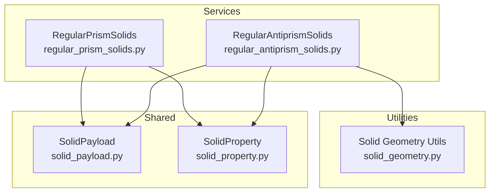
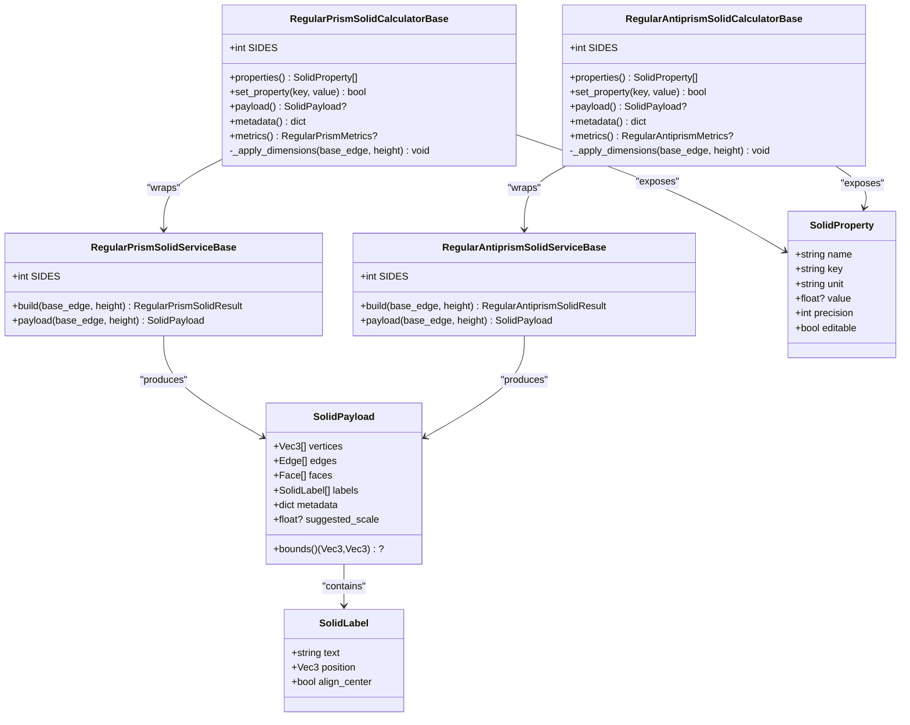
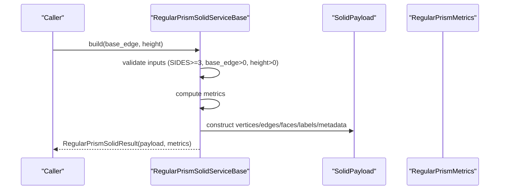
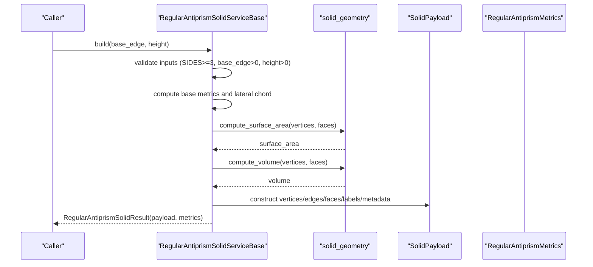
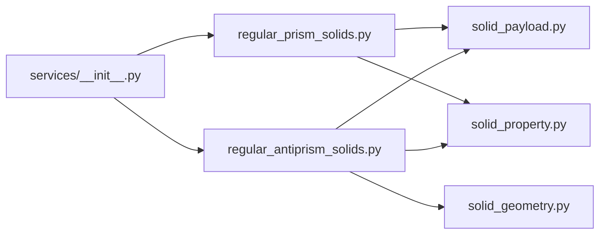

# Prismatic and Antiprismatic Families

<cite>
**Referenced Files in This Document**
- [regular_prism_solids.py](file://src/pillars/geometry/services/regular_prism_solids.py)
- [regular_antiprism_solids.py](file://src/pillars/geometry/services/regular_antiprism_solids.py)
- [solid_geometry.py](file://src/pillars/geometry/services/solid_geometry.py)
- [solid_payload.py](file://src/pillars/geometry/shared/solid_payload.py)
- [solid_property.py](file://src/pillars/geometry/services/solid_property.py)
- [__init__.py](file://src/pillars/geometry/services/__init__.py)
- [test_regular_prisms.py](file://test/test_regular_prisms.py)
- [test_antiprisms.py](file://test/test_antiprisms.py)
</cite>

## Table of Contents
1. [Introduction](#introduction)
2. [Project Structure](#project-structure)
3. [Core Components](#core-components)
4. [Architecture Overview](#architecture-overview)
5. [Detailed Component Analysis](#detailed-component-analysis)
6. [Dependency Analysis](#dependency-analysis)
7. [Performance Considerations](#performance-considerations)
8. [Troubleshooting Guide](#troubleshooting-guide)
9. [Conclusion](#conclusion)
10. [Appendices](#appendices)

## Introduction
This document provides API documentation for the infinite families of vertex-transitive polyhedra: regular prisms and regular antiprisms. It focuses on:
- RegularPrismSolids: generating n-gonal prisms (n ≥ 3) with two regular n-gon bases and n square lateral faces.
- RegularAntiprismSolids: generating n-gonal antiprisms (n ≥ 3) with two regular n-gon bases and 2n equilateral triangle lateral faces, with a relative twist between the bases.

The API exposes:
- Construction methods that accept base edge length, height (or lateral edge for antiprisms), and number of sides n.
- Accessors for vertex coordinates, face topology, and computed metrics.
- Calculator APIs that expose editable properties and dynamic recomputation.
- Guidance on edge cases for small n and numerical precision in rotational symmetry calculations.

## Project Structure
The relevant implementation resides under the geometry pillar services and shared payload structures:
- Services for prisms and antiprisms define builders, calculators, and metrics.
- Shared payload defines the SolidPayload structure used to carry geometry and metadata.
- Utility geometry helpers compute surface area and volume from vertex/faces.

**Diagram sources**
- [regular_prism_solids.py](file://src/pillars/geometry/services/regular_prism_solids.py#L1-L314)
- [regular_antiprism_solids.py](file://src/pillars/geometry/services/regular_antiprism_solids.py#L1-L338)
- [solid_payload.py](file://src/pillars/geometry/shared/solid_payload.py#L1-L52)
- [solid_property.py](file://src/pillars/geometry/services/solid_property.py#L1-L21)
- [solid_geometry.py](file://src/pillars/geometry/services/solid_geometry.py#L1-L156)

**Section sources**
- [regular_prism_solids.py](file://src/pillars/geometry/services/regular_prism_solids.py#L1-L314)
- [regular_antiprism_solids.py](file://src/pillars/geometry/services/regular_antiprism_solids.py#L1-L338)
- [solid_payload.py](file://src/pillars/geometry/shared/solid_payload.py#L1-L52)
- [solid_property.py](file://src/pillars/geometry/services/solid_property.py#L1-L21)
- [solid_geometry.py](file://src/pillars/geometry/services/solid_geometry.py#L1-L156)

## Core Components
- RegularPrismSolidServiceBase: builds prisms from base edge and height, computes metrics, and produces SolidPayload with vertices, edges, faces, labels, and metadata.
- RegularPrismSolidCalculatorBase: exposes editable properties (base_edge, height, base_apothem, base_area, lateral_area, surface_area, volume, base_circumradius) and updates geometry dynamically.
- RegularAntiprismSolidServiceBase: builds antiprisms from base edge and height, computes metrics including lateral edge length and lateral chord length, and produces SolidPayload with metadata.
- RegularAntiprismSolidCalculatorBase: exposes editable properties (base_edge, height, lateral_edge_length, base_area, lateral_area, surface_area, volume) and updates geometry dynamically.
- SolidPayload: standardized container for vertices, edges, faces, labels, metadata, and suggested scale.
- SolidProperty: property descriptor used by calculators to expose metrics with units and precision.

Key parameters:
- Base edge length: base_edge
- Height: height (prisms) or indirectly via lateral edge (antiprisms)
- Number of sides: n (SIDES constant per specialized service)

Computed metrics include:
- Prism: base_area, base_perimeter, base_apothem, base_circumradius, lateral_area, surface_area, volume
- Antiprism: base_area, base_perimeter, base_apothem, base_circumradius, lateral_edge_length, lateral_chord_length, lateral_area, surface_area, volume

Accessors:
- payload(): returns SolidPayload
- metadata(): returns computed metadata dictionary
- metrics(): returns typed metrics object

**Section sources**
- [regular_prism_solids.py](file://src/pillars/geometry/services/regular_prism_solids.py#L110-L314)
- [regular_antiprism_solids.py](file://src/pillars/geometry/services/regular_antiprism_solids.py#L149-L338)
- [solid_payload.py](file://src/pillars/geometry/shared/solid_payload.py#L12-L52)
- [solid_property.py](file://src/pillars/geometry/services/solid_property.py#L8-L21)

## Architecture Overview
The prismatic and antiprismatic families share a consistent architecture:
- Service layer constructs geometry and metadata.
- Calculator layer wraps a service and exposes editable properties.
- Utilities compute surface area and volume from vertex/faces when needed.

**Diagram sources**
- [regular_prism_solids.py](file://src/pillars/geometry/services/regular_prism_solids.py#L110-L314)
- [regular_antiprism_solids.py](file://src/pillars/geometry/services/regular_antiprism_solids.py#L149-L338)
- [solid_payload.py](file://src/pillars/geometry/shared/solid_payload.py#L12-L52)
- [solid_property.py](file://src/pillars/geometry/services/solid_property.py#L8-L21)

## Detailed Component Analysis

### RegularPrismSolids API
- Construction
  - build(base_edge: float = 2.0, height: float = 4.0) -> RegularPrismSolidResult
  - payload(base_edge: float = 2.0, height: float = 4.0) -> SolidPayload
- Metrics
  - RegularPrismMetrics includes sides, base_edge, height, base_area, base_perimeter, base_apothem, base_circumradius, lateral_area, surface_area, volume.
- Vertex/Face Topology
  - Vertices are placed on two parallel rings at z = ±height/2 with radius computed from base edge and n.
  - Edges connect bottom ring, top ring, and verticals.
  - Faces include the two base polygons and n lateral squares.
- Calculator
  - Properties include base_edge, height, base_apothem, base_area, base_perimeter, lateral_area, surface_area, volume, base_circumradius.
  - set_property(key, value) supports base_edge, height, base_apothem, base_area, volume and recomputes geometry accordingly.

Example usage patterns:
- Build a hexagonal prism with base_edge = 3.0 and height = 5.0.
- Adjust base_apothem to derive a new base_edge while preserving shape.
- Compute volume from a target volume setting.

Edge cases and behavior:
- Minimum n is enforced (SIDES >= 3).
- Positive base_edge and height are required.
- Small n values (e.g., n = 3) produce degenerate or minimal geometry; ensure appropriate scaling via suggested_scale.

Numerical precision:
- Trigonometric computations use math constants; results are floating-point. Use precision-aware display where needed.

**Section sources**
- [regular_prism_solids.py](file://src/pillars/geometry/services/regular_prism_solids.py#L110-L314)
- [test_regular_prisms.py](file://test/test_regular_prisms.py#L1-L71)

#### Prism Service Call Flow

**Diagram sources**
- [regular_prism_solids.py](file://src/pillars/geometry/services/regular_prism_solids.py#L110-L170)

### RegularAntiprismSolids API
- Construction
  - build(base_edge: float = 2.0, height: float = 4.0) -> RegularAntiprismSolidResult
  - payload(base_edge: float = 2.0, height: float = 4.0) -> SolidPayload
- Metrics
  - RegularAntiprismMetrics includes sides, base_edge, height, base_area, base_perimeter, base_apothem, base_circumradius, lateral_edge_length, lateral_chord_length, lateral_area, surface_area, volume.
- Vertex/Face Topology
  - Bottom base ring at z = -height/2; top ring rotated by π/n at z = +height/2.
  - Edges include bottom ring, top ring, and pairs connecting bottom to top and bottom to next top.
  - Faces include two base polygons and 2n lateral triangles.
- Calculator
  - Properties include base_edge, height, lateral_edge_length, base_area, lateral_area, surface_area, volume.
  - set_property supports base_edge, height, lateral_edge_length, volume. For lateral_edge_length, height is derived from the Pythagorean relationship with lateral_chord_length.

Example usage patterns:
- Build a decagonal antiprism with base_edge = 2.0 and height = 3.0.
- Set lateral_edge_length to adjust height while maintaining equilateral lateral triangles.
- Compute volume from a target volume setting.

Edge cases and behavior:
- Minimum n is enforced (SIDES >= 3).
- Positive base_edge and height are required.
- For small n, lateral triangles become very steep; ensure numerical stability when computing lateral_edge_length.

Numerical precision:
- Uses trigonometric relations; results are floating-point. Consider rounding for display.

**Section sources**
- [regular_antiprism_solids.py](file://src/pillars/geometry/services/regular_antiprism_solids.py#L149-L338)
- [solid_geometry.py](file://src/pillars/geometry/services/solid_geometry.py#L77-L92)
- [test_antiprisms.py](file://test/test_antiprisms.py#L1-L66)

#### Antiprism Service Call Flow

**Diagram sources**
- [regular_antiprism_solids.py](file://src/pillars/geometry/services/regular_antiprism_solids.py#L83-L142)
- [solid_geometry.py](file://src/pillars/geometry/services/solid_geometry.py#L77-L92)

### Parameterization and Computed Quantities
- Prism parameters: base_edge, height, n (SIDES).
- Antiprism parameters: base_edge, height, n (SIDES); alternatively lateral_edge_length can be used to derive height.
- Computed quantities:
  - Prism: base_apothem, base_circumradius, base_area, base_perimeter, lateral_area, surface_area, volume.
  - Antiprism: lateral_chord_length, lateral_edge_length, lateral_area, surface_area, volume.

Accessors:
- payload(): returns SolidPayload with vertices, edges, faces, labels, metadata, suggested_scale.
- metadata(): returns a dictionary of computed metrics.
- metrics(): returns a typed metrics object (RegularPrismMetrics or RegularAntiprismMetrics).

**Section sources**
- [regular_prism_solids.py](file://src/pillars/geometry/services/regular_prism_solids.py#L52-L108)
- [regular_antiprism_solids.py](file://src/pillars/geometry/services/regular_antiprism_solids.py#L18-L44)

### Examples

#### Example 1: Hexagonal Prism
- Construct a hexagonal prism with base_edge = 3.0 and height = 5.0.
- Expected counts: 12 vertices, 18 edges, 8 faces.
- Metrics include base_area, base_perimeter, base_apothem, base_circumradius, lateral_area, surface_area, volume.

Verification via tests:
- Counts and computed metrics validated against expected formulas.

**Section sources**
- [test_regular_prisms.py](file://test/test_regular_prisms.py#L13-L29)

#### Example 2: Decagonal Antiprism
- Construct a decagonal antiprism with base_edge = 2.0 and height = 3.0.
- Expected counts: 20 vertices, 40 edges, 22 faces.
- Metrics include lateral_chord_length, lateral_edge_length, lateral_area, surface_area, volume.

Verification via tests:
- Counts and computed metrics validated against expected formulas.

**Section sources**
- [test_antiprisms.py](file://test/test_antiprisms.py#L56-L66)

## Dependency Analysis
- Services depend on SolidPayload for geometry transport and SolidProperty for calculator properties.
- Antiprism service depends on solid_geometry utilities for surface area and volume computation.
- The services module re-exports prismatic and antiprismatic services for external consumption.

**Diagram sources**
- [regular_prism_solids.py](file://src/pillars/geometry/services/regular_prism_solids.py#L1-L314)
- [regular_antiprism_solids.py](file://src/pillars/geometry/services/regular_antiprism_solids.py#L1-L338)
- [solid_payload.py](file://src/pillars/geometry/shared/solid_payload.py#L12-L52)
- [solid_property.py](file://src/pillars/geometry/services/solid_property.py#L8-L21)
- [solid_geometry.py](file://src/pillars/geometry/services/solid_geometry.py#L77-L92)
- [__init__.py](file://src/pillars/geometry/services/__init__.py#L79-L110)

**Section sources**
- [__init__.py](file://src/pillars/geometry/services/__init__.py#L79-L110)

## Performance Considerations
- Geometry construction is O(n) in the number of sides for both prisms and antiprisms.
- Surface area and volume computation rely on triangulated faces; these are O(faces) and involve vector arithmetic.
- For interactive UIs, cache computed metrics and only rebuild when parameters change.
- Use suggested_scale to improve rendering and zoom behavior.

[No sources needed since this section provides general guidance]

## Troubleshooting Guide
Common issues and resolutions:
- Invalid parameters
  - Symptom: ValueError raised for SIDES < 3 or non-positive base_edge/height.
  - Resolution: Ensure SIDES >= 3 and base_edge > 0, height > 0.
- Antiprism lateral edge constraint
  - Symptom: Setting lateral_edge_length fails if it is less than or equal to lateral_chord_length.
  - Resolution: lateral_edge_length must exceed lateral_chord_length; derive height using the Pythagorean relationship.
- Calculator property updates
  - Symptom: set_property returns False for invalid or non-positive values.
  - Resolution: Provide strictly positive values; supported keys differ by service type.

Validation and tests:
- Unit tests verify counts and computed metrics for triangular and decagonal families.

**Section sources**
- [regular_prism_solids.py](file://src/pillars/geometry/services/regular_prism_solids.py#L116-L122)
- [regular_antiprism_solids.py](file://src/pillars/geometry/services/regular_antiprism_solids.py#L155-L161)
- [test_regular_prisms.py](file://test/test_regular_prisms.py#L1-L71)
- [test_antiprisms.py](file://test/test_antiprisms.py#L1-L66)

## Conclusion
The RegularPrismSolids and RegularAntiprismSolids APIs provide a robust, extensible foundation for generating and manipulating vertex-transitive prismatic and antiprismatic families. They expose consistent construction, labeling, and metric computation, with calculator layers enabling interactive editing of key parameters. Edge-case handling and numerical stability are addressed through input validation and careful trigonometric computations.

[No sources needed since this section summarizes without analyzing specific files]

## Appendices

### API Reference Summary

- RegularPrismSolidServiceBase
  - build(base_edge: float, height: float) -> RegularPrismSolidResult
  - payload(base_edge: float, height: float) -> SolidPayload
  - SIDES: int (≥ 3)
  - Metrics: RegularPrismMetrics

- RegularPrismSolidCalculatorBase
  - properties() -> List[SolidProperty]
  - set_property(key: str, value: Optional[float]) -> bool
  - payload() -> Optional[SolidPayload]
  - metadata() -> Dict[str, float]
  - metrics() -> Optional[RegularPrismMetrics]
  - Supported keys: base_edge, height, base_apothem, base_area, volume

- RegularAntiprismSolidServiceBase
  - build(base_edge: float, height: float) -> RegularAntiprismSolidResult
  - payload(base_edge: float, height: float) -> SolidPayload
  - SIDES: int (≥ 3)
  - Metrics: RegularAntiprismMetrics

- RegularAntiprismSolidCalculatorBase
  - properties() -> List[SolidProperty]
  - set_property(key: str, value: Optional[float]) -> bool
  - payload() -> Optional[SolidPayload]
  - metadata() -> Dict[str, float]
  - metrics() -> Optional[RegularAntiprismMetrics]
  - Supported keys: base_edge, height, lateral_edge_length, volume

- SolidPayload
  - vertices: List[Tuple[float, float, float]]
  - edges: List[Tuple[int, int]]
  - faces: List[Sequence[int]]
  - labels: List[SolidLabel]
  - metadata: dict
  - suggested_scale: Optional[float]
  - bounds() -> Optional[Tuple[Tuple[float, float, float], Tuple[float, float, float]]]

- SolidProperty
  - name: str
  - key: str
  - unit: str
  - value: Optional[float]
  - precision: int
  - editable: bool

**Section sources**
- [regular_prism_solids.py](file://src/pillars/geometry/services/regular_prism_solids.py#L110-L314)
- [regular_antiprism_solids.py](file://src/pillars/geometry/services/regular_antiprism_solids.py#L149-L338)
- [solid_payload.py](file://src/pillars/geometry/shared/solid_payload.py#L12-L52)
- [solid_property.py](file://src/pillars/geometry/services/solid_property.py#L8-L21)