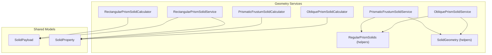
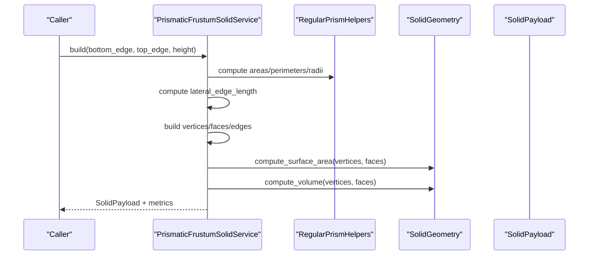
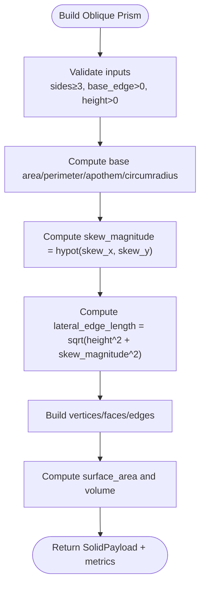
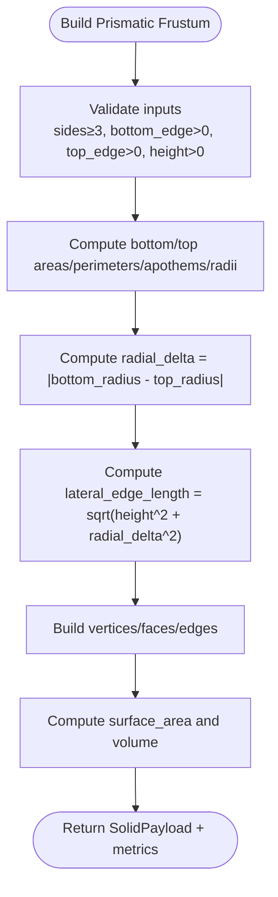
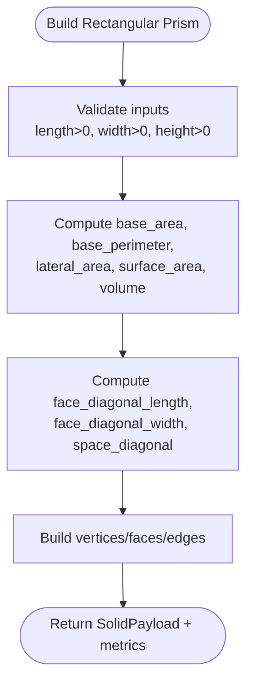
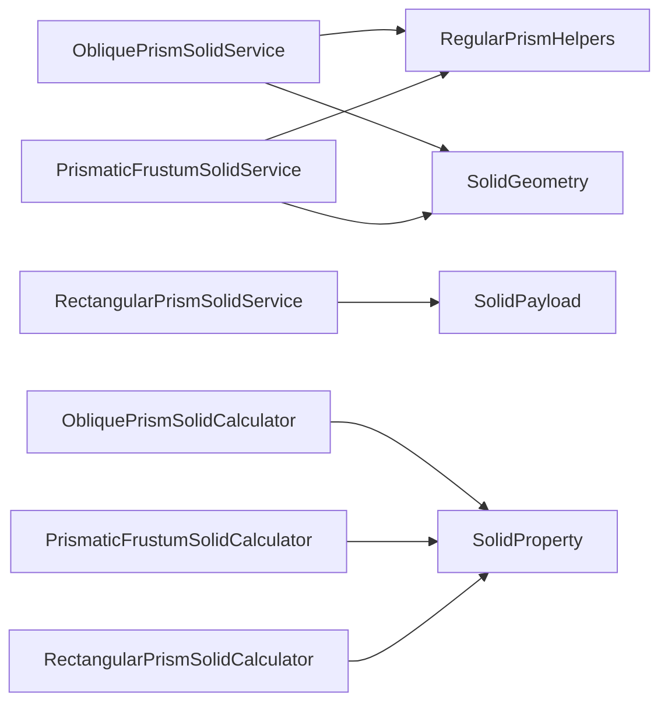

# Prisms

<cite>
**Referenced Files in This Document**
- [oblique_prism_solid.py](file://src/pillars/geometry/services/oblique_prism_solid.py)
- [prismatic_frustum_solid.py](file://src/pillars/geometry/services/prismatic_frustum_solid.py)
- [rectangular_prism_solid.py](file://src/pillars/geometry/services/rectangular_prism_solid.py)
- [solid_geometry.py](file://src/pillars/geometry/services/solid_geometry.py)
- [solid_property.py](file://src/pillars/geometry/services/solid_property.py)
- [solid_payload.py](file://src/pillars/geometry/shared/solid_payload.py)
- [regular_prism_solids.py](file://src/pillars/geometry/services/regular_prism_solids.py)
- [geometry_hub.py](file://src/pillars/geometry/ui/geometry_hub.py)
- [test_prism_variants.py](file://test/test_prism_variants.py)
- [test_rectangular_prism.py](file://test/test_rectangular_prism.py)
</cite>

## Table of Contents
1. [Introduction](#introduction)
2. [Project Structure](#project-structure)
3. [Core Components](#core-components)
4. [Architecture Overview](#architecture-overview)
5. [Detailed Component Analysis](#detailed-component-analysis)
6. [Dependency Analysis](#dependency-analysis)
7. [Performance Considerations](#performance-considerations)
8. [Troubleshooting Guide](#troubleshooting-guide)
9. [Conclusion](#conclusion)
10. [Appendices](#appendices)

## Introduction
This document provides API documentation for the prism geometry services in the project. It covers:
- ObliquePrismSolidService and ObliquePrismSolidCalculator
- PrismaticFrustumSolidService and PrismaticFrustumSolidCalculator
- RectangularPrismSolidService and RectangularPrismSolidCalculator

It explains parameters, computed metrics (volume, lateral surface area, surface area), and spatial diagonal calculations. It also clarifies how oblique prisms apply lateral offsets via skew_x and skew_y and how frustum variants manage differences between top and bottom polygon edges. Practical examples and edge-case handling (zero height, degenerate truncation) are included.

## Project Structure
The prism services are implemented under the geometry pillar, with shared payload and property models, and utility geometry helpers. They integrate into the UI hub as solid viewers.

**Diagram sources**
- [oblique_prism_solid.py](file://src/pillars/geometry/services/oblique_prism_solid.py#L1-L120)
- [prismatic_frustum_solid.py](file://src/pillars/geometry/services/prismatic_frustum_solid.py#L1-L130)
- [rectangular_prism_solid.py](file://src/pillars/geometry/services/rectangular_prism_solid.py#L1-L126)
- [solid_geometry.py](file://src/pillars/geometry/services/solid_geometry.py#L77-L107)
- [solid_property.py](file://src/pillars/geometry/services/solid_property.py#L1-L21)
- [solid_payload.py](file://src/pillars/geometry/shared/solid_payload.py#L12-L44)

**Section sources**
- [oblique_prism_solid.py](file://src/pillars/geometry/services/oblique_prism_solid.py#L1-L120)
- [prismatic_frustum_solid.py](file://src/pillars/geometry/services/prismatic_frustum_solid.py#L1-L130)
- [rectangular_prism_solid.py](file://src/pillars/geometry/services/rectangular_prism_solid.py#L1-L126)
- [solid_geometry.py](file://src/pillars/geometry/services/solid_geometry.py#L77-L107)
- [solid_property.py](file://src/pillars/geometry/services/solid_property.py#L1-L21)
- [solid_payload.py](file://src/pillars/geometry/shared/solid_payload.py#L12-L44)

## Core Components
- ObliquePrismSolidService: Builds axis-aligned regular polygon bases and applies a lateral skew to one base to produce an oblique prism. Computes volume, lateral area, surface area, and lateral edge length from skew magnitude and height.
- PrismaticFrustumSolidService: Builds a truncated regular prism with parallel top and bottom polygon bases differing in edge length. Computes volume using the classical frustum formula and lateral edge length from radial difference.
- RectangularPrismSolidService: Builds a right rectangular prism aligned to axes. Computes base area, lateral area, surface area, volume, face diagonals, and space diagonal.

Key shared models:
- SolidPayload: Encapsulates vertices, edges, faces, labels, metadata, and suggested scale.
- SolidProperty: Describes a metric exposed by calculators with name, key, unit, value, precision, and editability.

**Section sources**
- [oblique_prism_solid.py](file://src/pillars/geometry/services/oblique_prism_solid.py#L40-L118)
- [prismatic_frustum_solid.py](file://src/pillars/geometry/services/prismatic_frustum_solid.py#L42-L125)
- [rectangular_prism_solid.py](file://src/pillars/geometry/services/rectangular_prism_solid.py#L89-L121)
- [solid_payload.py](file://src/pillars/geometry/shared/solid_payload.py#L12-L44)
- [solid_property.py](file://src/pillars/geometry/services/solid_property.py#L1-L21)

## Architecture Overview
The services construct SolidPayload instances and compute metrics. Calculators wrap services to expose editable properties and bidirectional updates (e.g., changing volume updates height for prisms).

**Diagram sources**
- [prismatic_frustum_solid.py](file://src/pillars/geometry/services/prismatic_frustum_solid.py#L42-L125)
- [regular_prism_solids.py](file://src/pillars/geometry/services/regular_prism_solids.py#L36-L71)
- [solid_geometry.py](file://src/pillars/geometry/services/solid_geometry.py#L77-L107)

## Detailed Component Analysis

### ObliquePrismSolidService and Calculator
- Parameters:
  - base_edge: Base polygon edge length
  - height: Distance between bases
  - skew_x, skew_y: Lateral offsets applied to the top base vertices
- Computed metrics:
  - Base area, perimeter, apothem, circumradius (via regular polygon helpers)
  - Lateral edge length = sqrt(height^2 + skew_magnitude^2), where skew_magnitude = hypot(skew_x, skew_y)
  - Lateral area, surface area, volume
- Behavior:
  - Oblique prisms handle lateral offsets via skew_x and skew_y by translating top base vertices while keeping bottom base unchanged.
  - Volume equals base_area × height for the computed base area.
- Examples:
  - Construct an oblique hexagonal prism with base_edge=2.5, height=5.0, skew_x=0.8, skew_y=-0.6.
  - Adjust skew_x to change skew_magnitude and observe lateral edge length updates.
  - Set volume to a target value to derive a new height while preserving base_area.

**Diagram sources**
- [oblique_prism_solid.py](file://src/pillars/geometry/services/oblique_prism_solid.py#L46-L118)
- [regular_prism_solids.py](file://src/pillars/geometry/services/regular_prism_solids.py#L36-L71)
- [solid_geometry.py](file://src/pillars/geometry/services/solid_geometry.py#L77-L107)

**Section sources**
- [oblique_prism_solid.py](file://src/pillars/geometry/services/oblique_prism_solid.py#L40-L118)
- [test_prism_variants.py](file://test/test_prism_variants.py#L14-L33)

### PrismaticFrustumSolidService and Calculator
- Parameters:
  - bottom_edge: Bottom polygon edge length
  - top_edge: Top polygon edge length
  - height: Vertical distance between bases
- Computed metrics:
  - Bottom and top areas, perimeters, apothems, circumradii (via regular polygon helpers)
  - Radial delta = |bottom_radius - top_radius|
  - Lateral edge length = sqrt(height^2 + radial_delta^2)
  - Volume using classical frustum formula: V = (h/3) × (A_bottom + A_top + sqrt(A_bottom × A_top))
  - Lateral area, surface area
- Behavior:
  - Frustum variants manage top/bottom edge differences by computing radial deltas between circumradii and deriving lateral edge length accordingly.
- Examples:
  - Construct a truncated hexagonal prism with bottom_edge=4.0, top_edge=2.0, height=3.0.
  - Set volume to a target value to compute the resulting height using the frustum formula.

**Diagram sources**
- [prismatic_frustum_solid.py](file://src/pillars/geometry/services/prismatic_frustum_solid.py#L48-L125)
- [regular_prism_solids.py](file://src/pillars/geometry/services/regular_prism_solids.py#L36-L71)
- [solid_geometry.py](file://src/pillars/geometry/services/solid_geometry.py#L77-L107)

**Section sources**
- [prismatic_frustum_solid.py](file://src/pillars/geometry/services/prismatic_frustum_solid.py#L42-L125)
- [test_prism_variants.py](file://test/test_prism_variants.py#L53-L90)

### RectangularPrismSolidService and Calculator
- Parameters:
  - length, width, height: Dimensions of the rectangular box
- Computed metrics:
  - Base area = length × width
  - Base perimeter = 2 × (length + width)
  - Lateral area = base_perimeter × height
  - Surface area = 2 × (base_area + length×height + width×height)
  - Volume = base_area × height
  - Face diagonals:
    - Face diagonal (length faces) = hypot(length, height)
    - Face diagonal (width faces) = hypot(width, height)
  - Space diagonal = sqrt(length^2 + width^2 + height^2)
- Behavior:
  - Axis-aligned rectangular prisms with explicit vertex enumeration and fixed topology.
- Examples:
  - Construct a rectangular prism with length=6.0, width=4.0, height=3.0.
  - Set volume to a target value to compute the resulting height.

**Diagram sources**
- [rectangular_prism_solid.py](file://src/pillars/geometry/services/rectangular_prism_solid.py#L33-L121)
- [solid_geometry.py](file://src/pillars/geometry/services/solid_geometry.py#L77-L107)

**Section sources**
- [rectangular_prism_solid.py](file://src/pillars/geometry/services/rectangular_prism_solid.py#L89-L121)
- [test_rectangular_prism.py](file://test/test_rectangular_prism.py#L12-L32)

## Dependency Analysis
- Services depend on:
  - Regular polygon helpers for apothem, circumradius, and area computations
  - SolidGeometry for surface area and volume computation
  - SolidPayload for structured output and labels/metadata
  - SolidProperty for calculator property definitions and values
- UI integration:
  - The geometry hub registers prismatic services and exposes them as solid viewers.

**Diagram sources**
- [oblique_prism_solid.py](file://src/pillars/geometry/services/oblique_prism_solid.py#L1-L120)
- [prismatic_frustum_solid.py](file://src/pillars/geometry/services/prismatic_frustum_solid.py#L1-L130)
- [rectangular_prism_solid.py](file://src/pillars/geometry/services/rectangular_prism_solid.py#L1-L126)
- [solid_geometry.py](file://src/pillars/geometry/services/solid_geometry.py#L77-L107)
- [solid_property.py](file://src/pillars/geometry/services/solid_property.py#L1-L21)
- [solid_payload.py](file://src/pillars/geometry/shared/solid_payload.py#L12-L44)

**Section sources**
- [geometry_hub.py](file://src/pillars/geometry/ui/geometry_hub.py#L1-L120)

## Performance Considerations
- Vertex count scales with the number of sides for regular prisms (2 × sides). For large sides, consider reducing precision or simplifying geometry in downstream rendering.
- Surface area and volume rely on triangulated polygon areas and cross products; these are O(F) and O(V) respectively, where F is number of faces and V is number of vertices. For prismatic shapes, F is small and predictable.
- Bidirectional updates in calculators trigger recomputation of metrics and metadata; cache results when repeatedly updating the same property.

[No sources needed since this section provides general guidance]

## Troubleshooting Guide
Common issues and resolutions:
- Invalid inputs:
  - Negative or zero base_edge, height, bottom_edge, top_edge, length, width, or height cause exceptions. Ensure all dimensions are strictly positive.
- Zero height:
  - For prisms, zero height yields zero volume and undefined lateral edge length for oblique prisms. Avoid setting height to zero.
- Degenerate truncation:
  - For frustums, top_edge approaching bottom_edge reduces the truncated region. Ensure top_edge differs from bottom_edge for meaningful frustum geometry.
- Bidirectional updates:
  - Changing volume for calculators computes derived dimensions (e.g., height) using closed-form formulas. Verify that base areas remain positive to avoid invalid updates.

Validation and tests:
- Unit tests confirm expected metrics and behavior for oblique prisms, prismatic frustums, and rectangular prisms.

**Section sources**
- [oblique_prism_solid.py](file://src/pillars/geometry/services/oblique_prism_solid.py#L53-L60)
- [prismatic_frustum_solid.py](file://src/pillars/geometry/services/prismatic_frustum_solid.py#L54-L60)
- [rectangular_prism_solid.py](file://src/pillars/geometry/services/rectangular_prism_solid.py#L92-L96)
- [test_prism_variants.py](file://test/test_prism_variants.py#L14-L33)
- [test_rectangular_prism.py](file://test/test_rectangular_prism.py#L12-L32)

## Conclusion
The prism geometry services provide robust builders and calculators for oblique prisms, prismatic frustums, and rectangular prisms. They compute essential metrics consistently, support bidirectional updates, and integrate cleanly into the UI. Use the provided parameters and examples to construct prismatic shapes, adjust skew and truncation, and explore spatial diagonals and volumes.

[No sources needed since this section summarizes without analyzing specific files]

## Appendices

### API Reference Tables

- ObliquePrismSolidService
  - Methods:
    - build(base_edge: float, height: float, skew_x: float, skew_y: float) -> SolidPayload
    - payload(base_edge: float, height: float, skew_x: float, skew_y: float) -> SolidPayload
  - Outputs:
    - SolidPayload with vertices, edges, faces, labels, metadata, suggested_scale
    - Metrics include base_area, base_perimeter, base_apothem, base_circumradius, lateral_edge_length, lateral_area, surface_area, volume

- PrismaticFrustumSolidService
  - Methods:
    - build(bottom_edge: float, top_edge: float, height: float) -> SolidPayload
    - payload(bottom_edge: float, top_edge: float, height: float) -> SolidPayload
  - Outputs:
    - SolidPayload with metadata including bottom_area, top_area, bottom_perimeter, top_perimeter, bottom_apothem, top_apothem, lateral_edge_length, lateral_area, surface_area, volume

- RectangularPrismSolidService
  - Methods:
    - build(length: float, width: float, height: float) -> SolidPayload
    - payload(length: float, width: float, height: float) -> SolidPayload
  - Outputs:
    - SolidPayload with metadata including base_area, base_perimeter, lateral_area, surface_area, volume, face_diagonal_length, face_diagonal_width, space_diagonal

- Calculators
  - ObliquePrismSolidCalculator:
    - Properties: base_edge, height, skew_x, skew_y, skew_magnitude, lateral_edge_length, base_area, base_perimeter, lateral_area, surface_area, volume
    - set_property(key: str, value: float) supports editing and volume-driven updates
  - PrismaticFrustumSolidCalculator:
    - Properties: bottom_edge, top_edge, height, bottom_area, top_area, bottom_perimeter, top_perimeter, lateral_edge_length, lateral_area, surface_area, volume
    - set_property supports editing and volume-driven updates
  - RectangularPrismSolidCalculator:
    - Properties: length, width, height, base_area, base_perimeter, lateral_area, surface_area, volume, face_diagonal_length, face_diagonal_width, space_diagonal
    - set_property supports editing and volume-driven updates

**Section sources**
- [oblique_prism_solid.py](file://src/pillars/geometry/services/oblique_prism_solid.py#L120-L269)
- [prismatic_frustum_solid.py](file://src/pillars/geometry/services/prismatic_frustum_solid.py#L127-L276)
- [rectangular_prism_solid.py](file://src/pillars/geometry/services/rectangular_prism_solid.py#L123-L230)
- [solid_property.py](file://src/pillars/geometry/services/solid_property.py#L1-L21)