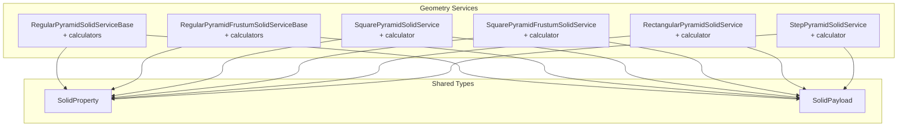
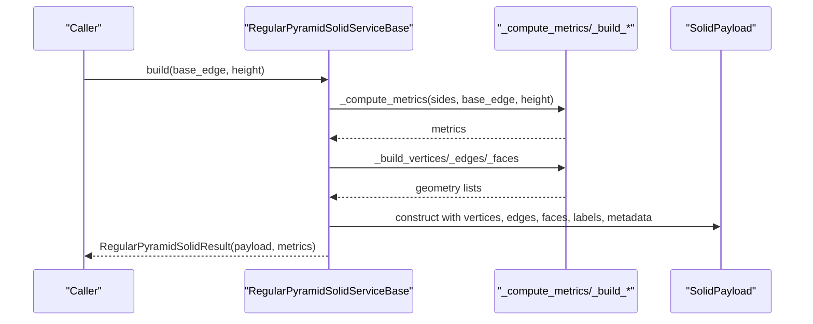
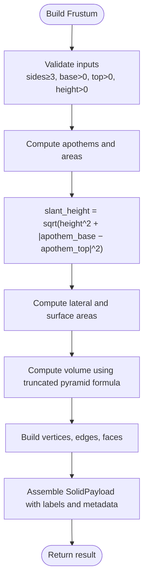
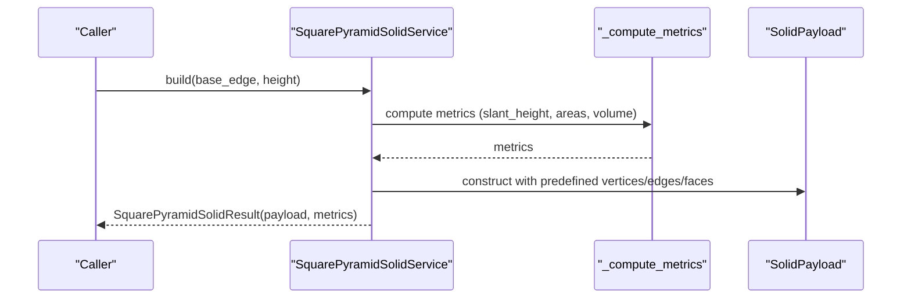
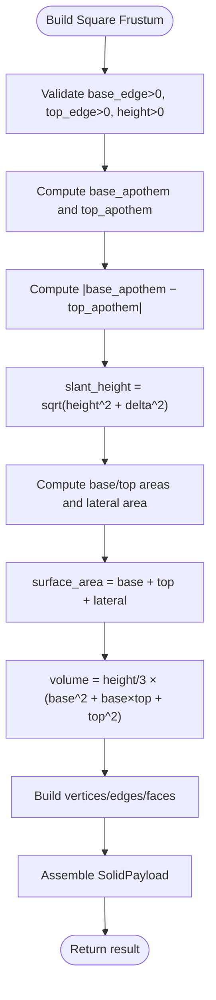
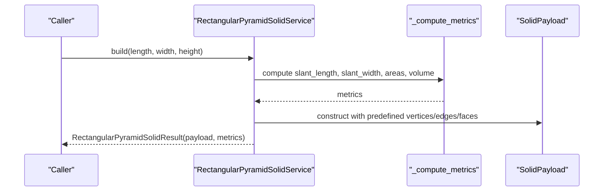
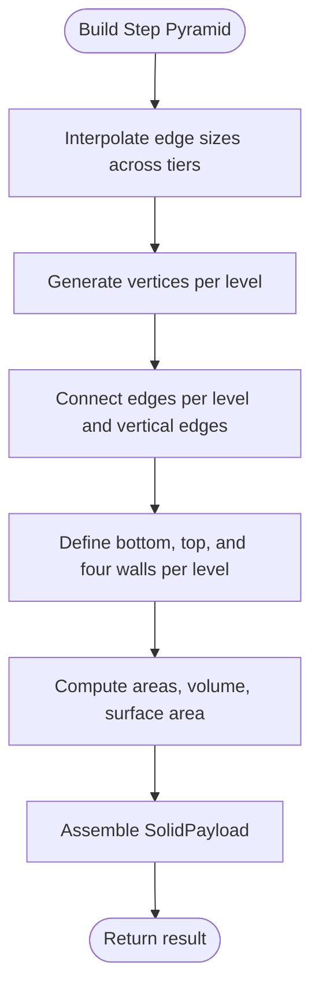
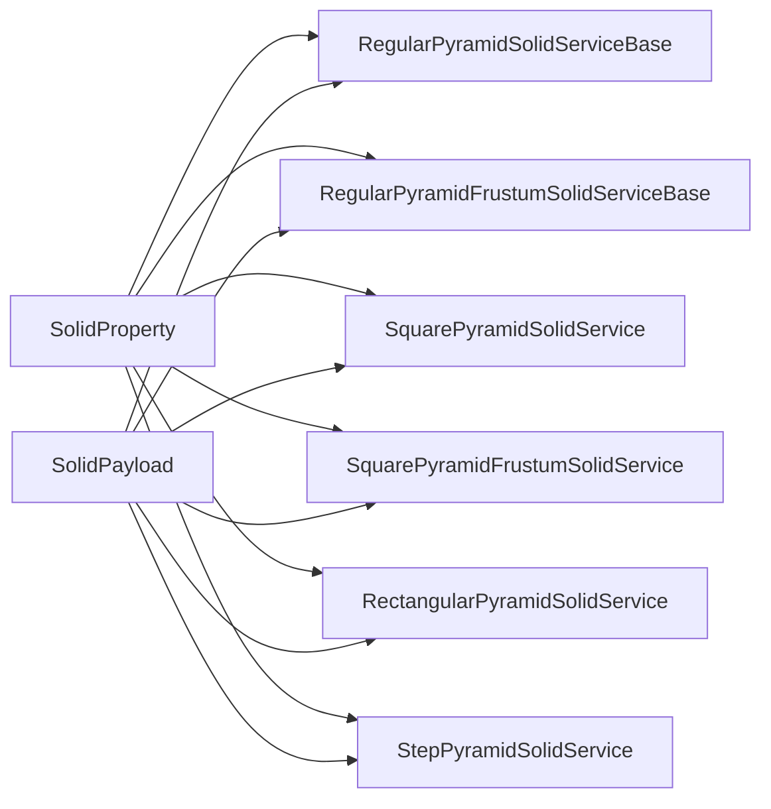

# Pyramids

<cite>
**Referenced Files in This Document**
- [regular_pyramid_solids.py](file://src/pillars/geometry/services/regular_pyramid_solids.py)
- [regular_pyramid_frustum_solids.py](file://src/pillars/geometry/services/regular_pyramid_frustum_solids.py)
- [square_pyramid_solid.py](file://src/pillars/geometry/services/square_pyramid_solid.py)
- [square_pyramid_frustum_solid.py](file://src/pillars/geometry/services/square_pyramid_frustum_solid.py)
- [rectangular_pyramid_solid.py](file://src/pillars/geometry/services/rectangular_pyramid_solid.py)
- [step_pyramid_solid.py](file://src/pillars/geometry/services/step_pyramid_solid.py)
- [solid_property.py](file://src/pillars/geometry/services/solid_property.py)
- [solid_payload.py](file://src/pillars/geometry/shared/solid_payload.py)
- [test_regular_pyramids.py](file://test/test_regular_pyramids.py)
- [test_square_pyramid.py](file://test/test_square_pyramid.py)
- [test_pyramid_frustums.py](file://test/test_pyramid_frustums.py)
- [test_square_pyramid_frustum.py](file://test/test_square_pyramid_frustum.py)
</cite>

## Table of Contents
1. [Introduction](#introduction)
2. [Project Structure](#project-structure)
3. [Core Components](#core-components)
4. [Architecture Overview](#architecture-overview)
5. [Detailed Component Analysis](#detailed-component-analysis)
6. [Dependency Analysis](#dependency-analysis)
7. [Performance Considerations](#performance-considerations)
8. [Troubleshooting Guide](#troubleshooting-guide)
9. [Conclusion](#conclusion)
10. [Appendices](#appendices)

## Introduction
This document provides API documentation for pyramid geometry services in the project. It covers:
- Right regular n-gonal pyramids and their truncated forms (frustums)
- Specialized implementations for square and rectangular pyramids
- Step pyramid construction
- Volume, lateral surface area, and centroid computation
- Slant height calculations and degenerate cases (zero height)
- Numerical stability considerations

The APIs are organized around two families:
- RegularPyramidSolidServiceBase and RegularPyramidFrustumSolidServiceBase for right regular n-gonal pyramids and frustums
- SquarePyramidSolidService, SquarePyramidFrustumSolidService, RectangularPyramidSolidService, and StepPyramidSolidService for specialized shapes

## Project Structure
The pyramid services live under the geometry pillar’s services module. Shared payload and property types are reused across solids.

**Diagram sources**
- [regular_pyramid_solids.py](file://src/pillars/geometry/services/regular_pyramid_solids.py#L111-L147)
- [regular_pyramid_frustum_solids.py](file://src/pillars/geometry/services/regular_pyramid_frustum_solids.py#L135-L175)
- [square_pyramid_solid.py](file://src/pillars/geometry/services/square_pyramid_solid.py#L86-L115)
- [square_pyramid_frustum_solid.py](file://src/pillars/geometry/services/square_pyramid_frustum_solid.py#L95-L128)
- [rectangular_pyramid_solid.py](file://src/pillars/geometry/services/rectangular_pyramid_solid.py#L93-L125)
- [step_pyramid_solid.py](file://src/pillars/geometry/services/step_pyramid_solid.py#L152-L163)
- [solid_property.py](file://src/pillars/geometry/services/solid_property.py#L8-L21)
- [solid_payload.py](file://src/pillars/geometry/shared/solid_payload.py#L12-L27)

**Section sources**
- [regular_pyramid_solids.py](file://src/pillars/geometry/services/regular_pyramid_solids.py#L111-L147)
- [regular_pyramid_frustum_solids.py](file://src/pillars/geometry/services/regular_pyramid_frustum_solids.py#L135-L175)
- [square_pyramid_solid.py](file://src/pillars/geometry/services/square_pyramid_solid.py#L86-L115)
- [square_pyramid_frustum_solid.py](file://src/pillars/geometry/services/square_pyramid_frustum_solid.py#L95-L128)
- [rectangular_pyramid_solid.py](file://src/pillars/geometry/services/rectangular_pyramid_solid.py#L93-L125)
- [step_pyramid_solid.py](file://src/pillars/geometry/services/step_pyramid_solid.py#L152-L163)
- [solid_property.py](file://src/pillars/geometry/services/solid_property.py#L8-L21)
- [solid_payload.py](file://src/pillars/geometry/shared/solid_payload.py#L12-L27)

## Core Components
- RegularPyramidSolidServiceBase: Builds right regular n-gonal pyramids with base edge and height. Provides metrics and a SolidPayload with vertices, edges, faces, labels, and metadata.
- RegularPyramidFrustumSolidServiceBase: Builds right regular n-gonal frustums with base edge, top edge, and height. Provides metrics and SolidPayload.
- SquarePyramidSolidService: Builds right square pyramids with base edge and height.
- SquarePyramidFrustumSolidService: Builds right square frustums with base edge, top edge, and height.
- RectangularPyramidSolidService: Builds right rectangular pyramids with base length, base width, and height.
- StepPyramidSolidService: Builds terraced step pyramids with base edge, top edge, height, and tiers.

Each service exposes:
- build(...): returns a typed result containing SolidPayload and metrics
- payload(...): convenience returning SolidPayload directly

Calculators (for interactive editing) expose:
- properties(): list of SolidProperty entries
- set_property(key, value): updates dimensions and recompute metrics
- payload(), metadata(), metrics(): access computed results

**Section sources**
- [regular_pyramid_solids.py](file://src/pillars/geometry/services/regular_pyramid_solids.py#L111-L147)
- [regular_pyramid_frustum_solids.py](file://src/pillars/geometry/services/regular_pyramid_frustum_solids.py#L135-L175)
- [square_pyramid_solid.py](file://src/pillars/geometry/services/square_pyramid_solid.py#L86-L115)
- [square_pyramid_frustum_solid.py](file://src/pillars/geometry/services/square_pyramid_frustum_solid.py#L95-L128)
- [rectangular_pyramid_solid.py](file://src/pillars/geometry/services/rectangular_pyramid_solid.py#L93-L125)
- [step_pyramid_solid.py](file://src/pillars/geometry/services/step_pyramid_solid.py#L152-L163)
- [solid_property.py](file://src/pillars/geometry/services/solid_property.py#L8-L21)
- [solid_payload.py](file://src/pillars/geometry/shared/solid_payload.py#L12-L27)

## Architecture Overview
The pyramid services share a common pattern:
- Private helpers compute metrics (areas, volumes, slant heights, edges)
- Private builders construct vertices, edges, and faces
- Public build(...) returns a SolidPayload plus metrics
- Calculators wrap services and expose a property-driven API

```mermaid
classDiagram
class SolidProperty {
+string name
+string key
+string unit
+float value
+int precision
+bool editable
}
class SolidPayload {
+Vec3[] vertices
+Edge[] edges
+Face[] faces
+SolidLabel[] labels
+Dict metadata
+float suggested_scale
+bounds() Tuple
}
class RegularPyramidSolidServiceBase {
+build(base_edge, height) RegularPyramidSolidResult
+payload(base_edge, height) SolidPayload
}
class RegularPyramidFrustumSolidServiceBase {
+build(base_edge, top_edge, height) RegularPyramidFrustumSolidResult
+payload(base_edge, top_edge, height) SolidPayload
}
class SquarePyramidSolidService {
+build(base_edge, height) SquarePyramidSolidResult
+payload(base_edge, height) SolidPayload
}
class SquarePyramidFrustumSolidService {
+build(base_edge, top_edge, height) SquarePyramidFrustumSolidResult
+payload(base_edge, top_edge, height) SolidPayload
}
class RectangularPyramidSolidService {
+build(base_length, base_width, height) RectangularPyramidSolidResult
+payload(base_length, base_width, height) SolidPayload
}
class StepPyramidSolidService {
+build(base_edge, top_edge, height, tiers) StepPyramidSolidResult
+payload(base_edge, top_edge, height, tiers) SolidPayload
}
SolidProperty <.. RegularPyramidSolidServiceBase
SolidProperty <.. RegularPyramidFrustumSolidServiceBase
SolidProperty <.. SquarePyramidSolidService
SolidProperty <.. SquarePyramidFrustumSolidService
SolidProperty <.. RectangularPyramidSolidService
SolidProperty <.. StepPyramidSolidService
SolidPayload <.. RegularPyramidSolidServiceBase
SolidPayload <.. RegularPyramidFrustumSolidServiceBase
SolidPayload <.. SquarePyramidSolidService
SolidPayload <.. SquarePyramidFrustumSolidService
SolidPayload <.. RectangularPyramidSolidService
SolidPayload <.. StepPyramidSolidService
```

**Diagram sources**
- [solid_property.py](file://src/pillars/geometry/services/solid_property.py#L8-L21)
- [solid_payload.py](file://src/pillars/geometry/shared/solid_payload.py#L12-L27)
- [regular_pyramid_solids.py](file://src/pillars/geometry/services/regular_pyramid_solids.py#L111-L147)
- [regular_pyramid_frustum_solids.py](file://src/pillars/geometry/services/regular_pyramid_frustum_solids.py#L135-L175)
- [square_pyramid_solid.py](file://src/pillars/geometry/services/square_pyramid_solid.py#L86-L115)
- [square_pyramid_frustum_solid.py](file://src/pillars/geometry/services/square_pyramid_frustum_solid.py#L95-L128)
- [rectangular_pyramid_solid.py](file://src/pillars/geometry/services/rectangular_pyramid_solid.py#L93-L125)
- [step_pyramid_solid.py](file://src/pillars/geometry/services/step_pyramid_solid.py#L152-L163)

## Detailed Component Analysis

### RegularPyramidSolidServiceBase and Calculators
- Purpose: Right regular n-gonal pyramids with base edge and height
- Metrics include: sides, base_edge, height, slant_height, base_apothem, base_area, lateral_area, surface_area, volume, base_perimeter, base_circumradius, lateral_edge
- Build validates n ≥ 3 and positive dimensions; computes slant_height from height and base_apothem
- Calculator supports setting base_edge, height, slant_height, base_apothem, base_area, volume

**Diagram sources**
- [regular_pyramid_solids.py](file://src/pillars/geometry/services/regular_pyramid_solids.py#L58-L81)
- [regular_pyramid_solids.py](file://src/pillars/geometry/services/regular_pyramid_solids.py#L84-L109)
- [regular_pyramid_solids.py](file://src/pillars/geometry/services/regular_pyramid_solids.py#L118-L147)

**Section sources**
- [regular_pyramid_solids.py](file://src/pillars/geometry/services/regular_pyramid_solids.py#L16-L31)
- [regular_pyramid_solids.py](file://src/pillars/geometry/services/regular_pyramid_solids.py#L58-L81)
- [regular_pyramid_solids.py](file://src/pillars/geometry/services/regular_pyramid_solids.py#L84-L109)
- [regular_pyramid_solids.py](file://src/pillars/geometry/services/regular_pyramid_solids.py#L118-L147)
- [regular_pyramid_solids.py](file://src/pillars/geometry/services/regular_pyramid_solids.py#L154-L258)
- [test_regular_pyramids.py](file://test/test_regular_pyramids.py#L54-L82)

### RegularPyramidFrustumSolidServiceBase and Calculators
- Purpose: Right regular n-gonal frustums with base edge, top edge, and height
- Metrics include: sides, base_edge, top_edge, height, slant_height, base_apothem, top_apothem, base_area, top_area, lateral_area, surface_area, volume, base_perimeter, top_perimeter, base_circumradius, top_circumradius, lateral_edge
- Build validates n ≥ 3 and positive dimensions; computes slant_height from height and |base_apothem − top_apothem|

**Diagram sources**
- [regular_pyramid_frustum_solids.py](file://src/pillars/geometry/services/regular_pyramid_frustum_solids.py#L59-L92)
- [regular_pyramid_frustum_solids.py](file://src/pillars/geometry/services/regular_pyramid_frustum_solids.py#L95-L133)
- [regular_pyramid_frustum_solids.py](file://src/pillars/geometry/services/regular_pyramid_frustum_solids.py#L142-L175)

**Section sources**
- [regular_pyramid_frustum_solids.py](file://src/pillars/geometry/services/regular_pyramid_frustum_solids.py#L16-L35)
- [regular_pyramid_frustum_solids.py](file://src/pillars/geometry/services/regular_pyramid_frustum_solids.py#L59-L92)
- [regular_pyramid_frustum_solids.py](file://src/pillars/geometry/services/regular_pyramid_frustum_solids.py#L142-L175)
- [regular_pyramid_frustum_solids.py](file://src/pillars/geometry/services/regular_pyramid_frustum_solids.py#L182-L300)
- [test_pyramid_frustums.py](file://test/test_pyramid_frustums.py#L16-L34)

### SquarePyramidSolidService and Calculator
- Purpose: Right square pyramids with base edge and height
- Metrics include: base_edge, height, slant_height, base_apothem, base_area, lateral_area, surface_area, volume, lateral_edge
- Slant height computed from height and half-edge

**Diagram sources**
- [square_pyramid_solid.py](file://src/pillars/geometry/services/square_pyramid_solid.py#L31-L51)
- [square_pyramid_solid.py](file://src/pillars/geometry/services/square_pyramid_solid.py#L53-L64)
- [square_pyramid_solid.py](file://src/pillars/geometry/services/square_pyramid_solid.py#L86-L115)

**Section sources**
- [square_pyramid_solid.py](file://src/pillars/geometry/services/square_pyramid_solid.py#L12-L24)
- [square_pyramid_solid.py](file://src/pillars/geometry/services/square_pyramid_solid.py#L31-L51)
- [square_pyramid_solid.py](file://src/pillars/geometry/services/square_pyramid_solid.py#L86-L115)
- [square_pyramid_solid.py](file://src/pillars/geometry/services/square_pyramid_solid.py#L122-L204)
- [test_square_pyramid.py](file://test/test_square_pyramid.py#L12-L27)

### SquarePyramidFrustumSolidService and Calculator
- Purpose: Right square frustums with base edge, top edge, and height
- Metrics include: base_edge, top_edge, height, slant_height, base_apothem, top_apothem, base_area, top_area, lateral_area, surface_area, volume, lateral_edge
- Slant height computed from height and |base_apothem − top_apothem|

**Diagram sources**
- [square_pyramid_frustum_solid.py](file://src/pillars/geometry/services/square_pyramid_frustum_solid.py#L34-L59)
- [square_pyramid_frustum_solid.py](file://src/pillars/geometry/services/square_pyramid_frustum_solid.py#L62-L77)
- [square_pyramid_frustum_solid.py](file://src/pillars/geometry/services/square_pyramid_frustum_solid.py#L95-L128)

**Section sources**
- [square_pyramid_frustum_solid.py](file://src/pillars/geometry/services/square_pyramid_frustum_solid.py#L12-L27)
- [square_pyramid_frustum_solid.py](file://src/pillars/geometry/services/square_pyramid_frustum_solid.py#L34-L59)
- [square_pyramid_frustum_solid.py](file://src/pillars/geometry/services/square_pyramid_frustum_solid.py#L95-L128)
- [square_pyramid_frustum_solid.py](file://src/pillars/geometry/services/square_pyramid_frustum_solid.py#L135-L204)
- [test_square_pyramid_frustum.py](file://test/test_square_pyramid_frustum.py#L12-L30)

### RectangularPyramidSolidService and Calculator
- Purpose: Right rectangular pyramids with base length, base width, and height
- Metrics include: base_length, base_width, height, slant_length, slant_width, base_area, lateral_area, surface_area, volume, base_diagonal, lateral_edge
- Two slant heights computed from height and half-length/width

**Diagram sources**
- [rectangular_pyramid_solid.py](file://src/pillars/geometry/services/rectangular_pyramid_solid.py#L33-L57)
- [rectangular_pyramid_solid.py](file://src/pillars/geometry/services/rectangular_pyramid_solid.py#L59-L71)
- [rectangular_pyramid_solid.py](file://src/pillars/geometry/services/rectangular_pyramid_solid.py#L93-L125)

**Section sources**
- [rectangular_pyramid_solid.py](file://src/pillars/geometry/services/rectangular_pyramid_solid.py#L12-L26)
- [rectangular_pyramid_solid.py](file://src/pillars/geometry/services/rectangular_pyramid_solid.py#L33-L57)
- [rectangular_pyramid_solid.py](file://src/pillars/geometry/services/rectangular_pyramid_solid.py#L93-L125)
- [rectangular_pyramid_solid.py](file://src/pillars/geometry/services/rectangular_pyramid_solid.py#L132-L217)
- [test_regular_pyramids.py](file://test/test_regular_pyramids.py#L19-L35)

### StepPyramidSolidService and Calculator
- Purpose: Terraced step pyramid with base_edge, top_edge, height, and tiers
- Metrics include: base_edge, top_edge, height, tiers, step_height, base_area, top_area, lateral_area, surface_area, volume, tier_edges
- Vertices are generated by interpolating edge sizes across levels

**Diagram sources**
- [step_pyramid_solid.py](file://src/pillars/geometry/services/step_pyramid_solid.py#L32-L36)
- [step_pyramid_solid.py](file://src/pillars/geometry/services/step_pyramid_solid.py#L38-L51)
- [step_pyramid_solid.py](file://src/pillars/geometry/services/step_pyramid_solid.py#L54-L71)
- [step_pyramid_solid.py](file://src/pillars/geometry/services/step_pyramid_solid.py#L73-L86)
- [step_pyramid_solid.py](file://src/pillars/geometry/services/step_pyramid_solid.py#L89-L116)
- [step_pyramid_solid.py](file://src/pillars/geometry/services/step_pyramid_solid.py#L119-L149)
- [step_pyramid_solid.py](file://src/pillars/geometry/services/step_pyramid_solid.py#L152-L163)
- [step_pyramid_solid.py](file://src/pillars/geometry/services/step_pyramid_solid.py#L166-L215)
- [step_pyramid_solid.py](file://src/pillars/geometry/services/step_pyramid_solid.py#L237-L260)

**Section sources**
- [step_pyramid_solid.py](file://src/pillars/geometry/services/step_pyramid_solid.py#L11-L24)
- [step_pyramid_solid.py](file://src/pillars/geometry/services/step_pyramid_solid.py#L32-L116)
- [step_pyramid_solid.py](file://src/pillars/geometry/services/step_pyramid_solid.py#L119-L163)
- [step_pyramid_solid.py](file://src/pillars/geometry/services/step_pyramid_solid.py#L166-L215)
- [step_pyramid_solid.py](file://src/pillars/geometry/services/step_pyramid_solid.py#L237-L260)

## Dependency Analysis
- All services depend on SolidPayload for geometry packaging and SolidProperty for calculator property definitions.
- Regular pyramid services reuse helper functions for apothem, circumradius, area, and edge computations.
- Frustum services reuse similar helpers and compute slant height differently (using apothem deltas).
- Square and rectangular services hardcode geometry arrays for speed and simplicity.
- Step pyramid composes geometry from interpolated edge sizes.

**Diagram sources**
- [solid_property.py](file://src/pillars/geometry/services/solid_property.py#L8-L21)
- [solid_payload.py](file://src/pillars/geometry/shared/solid_payload.py#L12-L27)
- [regular_pyramid_solids.py](file://src/pillars/geometry/services/regular_pyramid_solids.py#L111-L147)
- [regular_pyramid_frustum_solids.py](file://src/pillars/geometry/services/regular_pyramid_frustum_solids.py#L135-L175)
- [square_pyramid_solid.py](file://src/pillars/geometry/services/square_pyramid_solid.py#L86-L115)
- [square_pyramid_frustum_solid.py](file://src/pillars/geometry/services/square_pyramid_frustum_solid.py#L95-L128)
- [rectangular_pyramid_solid.py](file://src/pillars/geometry/services/rectangular_pyramid_solid.py#L93-L125)
- [step_pyramid_solid.py](file://src/pillars/geometry/services/step_pyramid_solid.py#L152-L163)

**Section sources**
- [solid_property.py](file://src/pillars/geometry/services/solid_property.py#L8-L21)
- [solid_payload.py](file://src/pillars/geometry/shared/solid_payload.py#L12-L27)
- [regular_pyramid_solids.py](file://src/pillars/geometry/services/regular_pyramid_solids.py#L111-L147)
- [regular_pyramid_frustum_solids.py](file://src/pillars/geometry/services/regular_pyramid_frustum_solids.py#L135-L175)
- [square_pyramid_solid.py](file://src/pillars/geometry/services/square_pyramid_solid.py#L86-L115)
- [square_pyramid_frustum_solid.py](file://src/pillars/geometry/services/square_pyramid_frustum_solid.py#L95-L128)
- [rectangular_pyramid_solid.py](file://src/pillars/geometry/services/rectangular_pyramid_solid.py#L93-L125)
- [step_pyramid_solid.py](file://src/pillars/geometry/services/step_pyramid_solid.py#L152-L163)

## Performance Considerations
- Regular pyramid services precompute apothem, circumradius, and areas using closed-form trigonometric formulas; this is O(1) per call.
- Frustum services compute apothem deltas and use hypotenuse formulas; also O(1).
- Square and rectangular services use math.hypot and simple arithmetic; O(1).
- Step pyramid builds geometry by iterating over tiers; complexity scales linearly with tiers for vertex generation and edges/faces assembly.

[No sources needed since this section provides general guidance]

## Troubleshooting Guide
Common issues and resolutions:
- Non-positive dimensions: All services validate inputs and raise errors for invalid values. Ensure base_edge, top_edge, height, base_length, base_width are strictly positive.
- Degenerate cases:
  - Zero height: Regular and frustum services reject height ≤ 0. For step pyramids, height must be positive; top_edge must be less than base_edge.
  - Zero base edge: Services reject non-positive values.
- Slant height constraints:
  - For regular pyramids, slant_height must exceed base_apothem; otherwise, the requested slant is geometrically impossible.
  - For regular frustums, slant_height must exceed |base_apothem − top_apothem|.
  - For square/rectangular/pyramid frustums, slant height must exceed the respective apothem differences.
- Numerical stability:
  - Calculators invert sqrt(height^2 + x^2) equations carefully; ensure requested slant_height is greater than the minimal allowable value to avoid negative under the square root.
  - When computing from areas or volumes, verify denominators are positive to prevent division by zero.

**Section sources**
- [regular_pyramid_solids.py](file://src/pillars/geometry/services/regular_pyramid_solids.py#L118-L123)
- [regular_pyramid_frustum_solids.py](file://src/pillars/geometry/services/regular_pyramid_frustum_solids.py#L142-L147)
- [square_pyramid_solid.py](file://src/pillars/geometry/services/square_pyramid_solid.py#L90-L93)
- [square_pyramid_frustum_solid.py](file://src/pillars/geometry/services/square_pyramid_frustum_solid.py#L98-L102)
- [rectangular_pyramid_solid.py](file://src/pillars/geometry/services/rectangular_pyramid_solid.py#L96-L100)
- [step_pyramid_solid.py](file://src/pillars/geometry/services/step_pyramid_solid.py#L90-L96)
- [regular_pyramid_solids.py](file://src/pillars/geometry/services/regular_pyramid_solids.py#L194-L201)
- [regular_pyramid_frustum_solids.py](file://src/pillars/geometry/services/regular_pyramid_frustum_solids.py#L228-L237)
- [square_pyramid_solid.py](file://src/pillars/geometry/services/square_pyramid_solid.py#L159-L166)
- [square_pyramid_frustum_solid.py](file://src/pillars/geometry/services/square_pyramid_frustum_solid.py#L179-L185)
- [rectangular_pyramid_solid.py](file://src/pillars/geometry/services/rectangular_pyramid_solid.py#L175-L181)

## Conclusion
The pyramid geometry services provide a consistent, extensible API for regular and specialized pyramids and frustums. They compute robust metrics, construct precise 3D geometry, and support interactive dimension editing via calculators. The design emphasizes correctness, numerical stability, and ease of use.

[No sources needed since this section summarizes without analyzing specific files]

## Appendices

### API Reference: RegularPyramidSolidServiceBase
- build(base_edge: float = 1.0, height: float = 1.0) -> RegularPyramidSolidResult
- payload(base_edge: float = 1.0, height: float = 1.0) -> SolidPayload
- Metrics: sides, base_edge, height, slant_height, base_apothem, base_area, lateral_area, surface_area, volume, base_perimeter, base_circumradius, lateral_edge
- Calculator: set_property keys include base_edge, height, slant_height, base_apothem, base_area, volume

**Section sources**
- [regular_pyramid_solids.py](file://src/pillars/geometry/services/regular_pyramid_solids.py#L118-L147)
- [regular_pyramid_solids.py](file://src/pillars/geometry/services/regular_pyramid_solids.py#L154-L258)
- [test_regular_pyramids.py](file://test/test_regular_pyramids.py#L54-L82)

### API Reference: RegularPyramidFrustumSolidServiceBase
- build(base_edge: float = 2.0, top_edge: float = 1.0, height: float = 1.0) -> RegularPyramidFrustumSolidResult
- payload(base_edge: float = 2.0, top_edge: float = 1.0, height: float = 1.0) -> SolidPayload
- Metrics: sides, base_edge, top_edge, height, slant_height, base_apothem, top_apothem, base_area, top_area, lateral_area, surface_area, volume, base_perimeter, top_perimeter, base_circumradius, top_circumradius, lateral_edge
- Calculator: set_property keys include base_edge, top_edge, height, slant_height, base_area, top_area, volume

**Section sources**
- [regular_pyramid_frustum_solids.py](file://src/pillars/geometry/services/regular_pyramid_frustum_solids.py#L142-L175)
- [regular_pyramid_frustum_solids.py](file://src/pillars/geometry/services/regular_pyramid_frustum_solids.py#L182-L300)
- [test_pyramid_frustums.py](file://test/test_pyramid_frustums.py#L16-L34)

### API Reference: SquarePyramidSolidService
- build(base_edge: float = 1.0, height: float = 1.0) -> SquarePyramidSolidResult
- payload(base_edge: float = 1.0, height: float = 1.0) -> SolidPayload
- Metrics: base_edge, height, slant_height, base_apothem, base_area, lateral_area, surface_area, volume, lateral_edge
- Calculator: set_property keys include base_edge, height, slant_height, base_apothem, base_area, volume

**Section sources**
- [square_pyramid_solid.py](file://src/pillars/geometry/services/square_pyramid_solid.py#L86-L115)
- [square_pyramid_solid.py](file://src/pillars/geometry/services/square_pyramid_solid.py#L122-L204)
- [test_square_pyramid.py](file://test/test_square_pyramid.py#L12-L27)

### API Reference: SquarePyramidFrustumSolidService
- build(base_edge: float = 2.0, top_edge: float = 1.0, height: float = 1.0) -> SquarePyramidFrustumSolidResult
- payload(base_edge: float = 2.0, top_edge: float = 1.0, height: float = 1.0) -> SolidPayload
- Metrics: base_edge, top_edge, height, slant_height, base_apothem, top_apothem, base_area, top_area, lateral_area, surface_area, volume, lateral_edge
- Calculator: set_property keys include base_edge, top_edge, height, slant_height, base_area, top_area, volume

**Section sources**
- [square_pyramid_frustum_solid.py](file://src/pillars/geometry/services/square_pyramid_frustum_solid.py#L95-L128)
- [square_pyramid_frustum_solid.py](file://src/pillars/geometry/services/square_pyramid_frustum_solid.py#L135-L204)
- [test_square_pyramid_frustum.py](file://test/test_square_pyramid_frustum.py#L12-L30)

### API Reference: RectangularPyramidSolidService
- build(base_length: float = 1.0, base_width: float = 1.0, height: float = 1.0) -> RectangularPyramidSolidResult
- payload(base_length: float = 1.0, base_width: float = 1.0, height: float = 1.0) -> SolidPayload
- Metrics: base_length, base_width, height, slant_length, slant_width, base_area, lateral_area, surface_area, volume, base_diagonal, lateral_edge
- Calculator: set_property keys include base_length, base_width, height, slant_length, slant_width, volume

**Section sources**
- [rectangular_pyramid_solid.py](file://src/pillars/geometry/services/rectangular_pyramid_solid.py#L93-L125)
- [rectangular_pyramid_solid.py](file://src/pillars/geometry/services/rectangular_pyramid_solid.py#L132-L217)
- [test_regular_pyramids.py](file://test/test_regular_pyramids.py#L19-L35)

### API Reference: StepPyramidSolidService
- build(base_edge: float = 200.0, top_edge: float = 60.0, height: float = 120.0, tiers: int = 5) -> StepPyramidSolidResult
- payload(base_edge: float = 200.0, top_edge: float = 60.0, height: float = 120.0, tiers: int = 5) -> SolidPayload
- Metrics: base_edge, top_edge, height, tiers, step_height, base_area, top_area, lateral_area, surface_area, volume, tier_edges
- Calculator: set_property keys include base_edge, top_edge, height, tiers

**Section sources**
- [step_pyramid_solid.py](file://src/pillars/geometry/services/step_pyramid_solid.py#L152-L163)
- [step_pyramid_solid.py](file://src/pillars/geometry/services/step_pyramid_solid.py#L166-L215)
- [step_pyramid_solid.py](file://src/pillars/geometry/services/step_pyramid_solid.py#L237-L260)

### Examples

- Construct a step pyramid (terrace pyramid)
  - Use StepPyramidSolidService.build with base_edge, top_edge, height, and tiers
  - Example path: [step_pyramid_solid.py](file://src/pillars/geometry/services/step_pyramid_solid.py#L152-L163)

- Construct a tapered frustum (square)
  - Use SquarePyramidFrustumSolidService.build with base_edge, top_edge, height
  - Example path: [square_pyramid_frustum_solid.py](file://src/pillars/geometry/services/square_pyramid_frustum_solid.py#L95-L128)

- Construct a rectangular-based pyramid
  - Use RectangularPyramidSolidService.build with base_length, base_width, height
  - Example path: [rectangular_pyramid_solid.py](file://src/pillars/geometry/services/rectangular_pyramid_solid.py#L93-L125)

- Interactive editing via calculators
  - Set properties like base_edge, height, slant_height, volume
  - Example paths:
    - [regular_pyramid_solids.py](file://src/pillars/geometry/services/regular_pyramid_solids.py#L186-L218)
    - [square_pyramid_solid.py](file://src/pillars/geometry/services/square_pyramid_solid.py#L149-L184)
    - [regular_pyramid_frustum_solids.py](file://src/pillars/geometry/services/regular_pyramid_frustum_solids.py#L217-L256)

**Section sources**
- [step_pyramid_solid.py](file://src/pillars/geometry/services/step_pyramid_solid.py#L152-L163)
- [square_pyramid_frustum_solid.py](file://src/pillars/geometry/services/square_pyramid_frustum_solid.py#L95-L128)
- [rectangular_pyramid_solid.py](file://src/pillars/geometry/services/rectangular_pyramid_solid.py#L93-L125)
- [regular_pyramid_solids.py](file://src/pillars/geometry/services/regular_pyramid_solids.py#L186-L218)
- [square_pyramid_solid.py](file://src/pillars/geometry/services/square_pyramid_solid.py#L149-L184)
- [regular_pyramid_frustum_solids.py](file://src/pillars/geometry/services/regular_pyramid_frustum_solids.py#L217-L256)

### Centroid Computation
- The SolidPayload metadata includes computed metrics such as base_area, top_area, lateral_area, surface_area, and volume. These can be used to derive centroids in external computations if needed. The services themselves do not compute a centroid vector.

**Section sources**
- [regular_pyramid_solids.py](file://src/pillars/geometry/services/regular_pyramid_solids.py#L132-L144)
- [regular_pyramid_frustum_solids.py](file://src/pillars/geometry/services/regular_pyramid_frustum_solids.py#L148-L172)
- [square_pyramid_solid.py](file://src/pillars/geometry/services/square_pyramid_solid.py#L96-L112)
- [square_pyramid_frustum_solid.py](file://src/pillars/geometry/services/square_pyramid_frustum_solid.py#L104-L126)
- [rectangular_pyramid_solid.py](file://src/pillars/geometry/services/rectangular_pyramid_solid.py#L102-L122)
- [step_pyramid_solid.py](file://src/pillars/geometry/services/step_pyramid_solid.py#L120-L148)