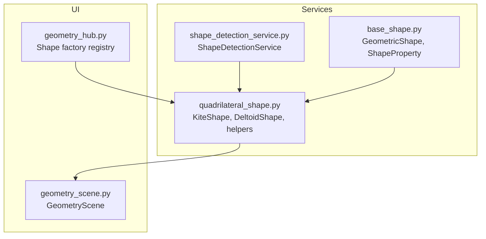
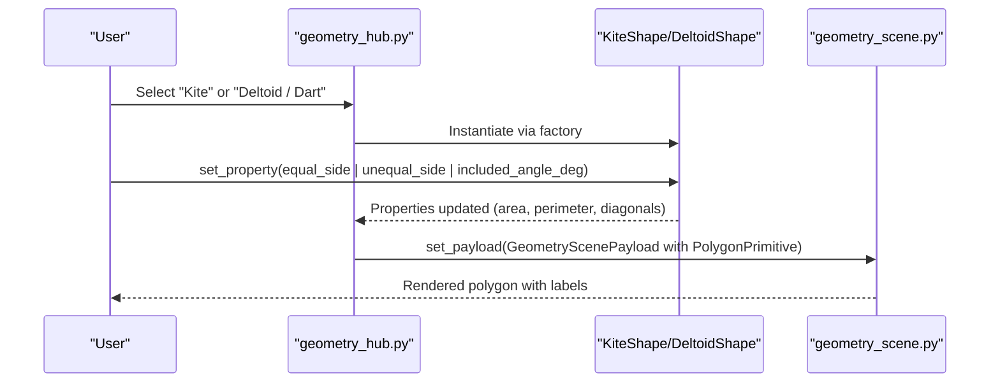
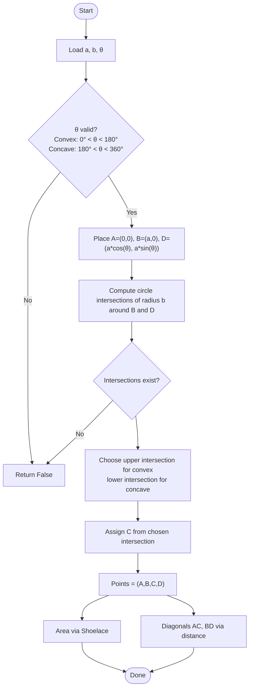
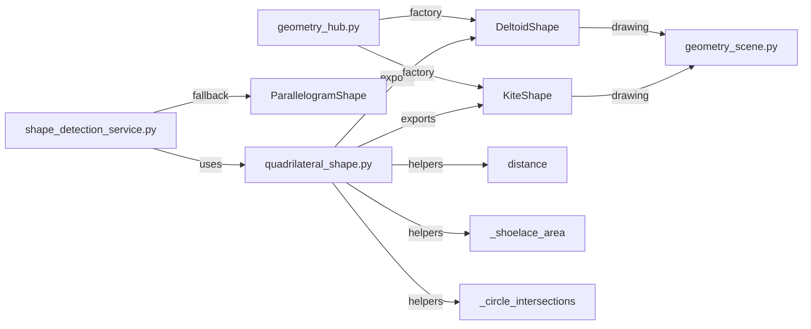
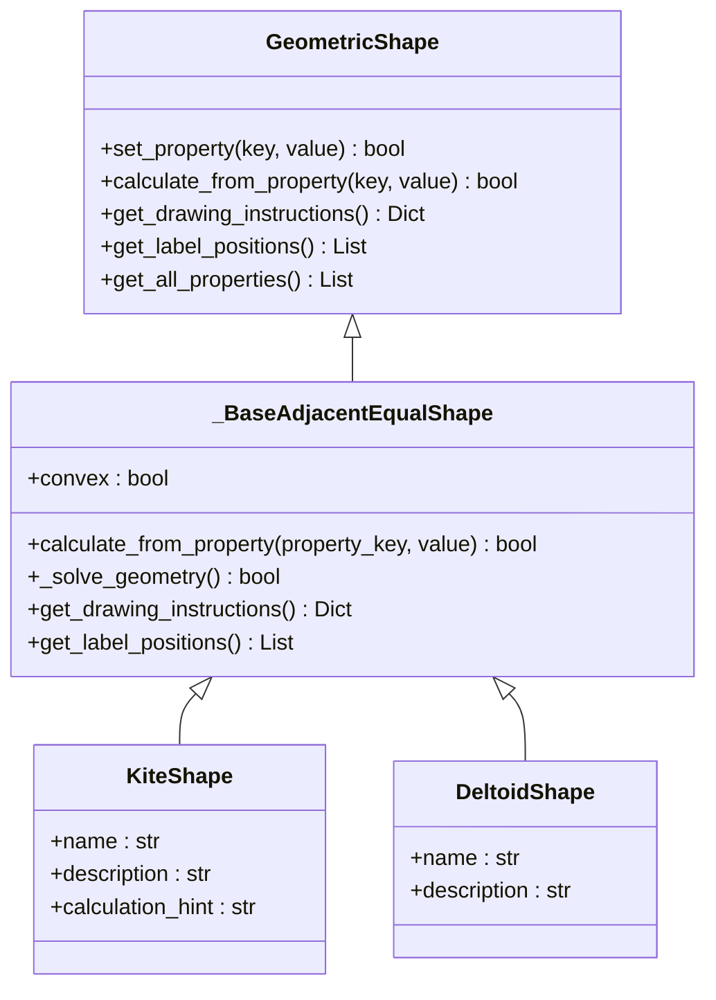

# Quadrilateral Variants (Kite, Dart)

<cite>
**Referenced Files in This Document**
- [quadrilateral_shape.py](file://src/pillars/geometry/services/quadrilateral_shape.py)
- [shape_detection_service.py](file://src/pillars/geometry/services/shape_detection_service.py)
- [geometry_scene.py](file://src/pillars/geometry/ui/geometry_scene.py)
- [geometry_hub.py](file://src/pillars/geometry/ui/geometry_hub.py)
- [base_shape.py](file://src/pillars/geometry/services/base_shape.py)
</cite>

## Table of Contents
1. [Introduction](#introduction)
2. [Project Structure](#project-structure)
3. [Core Components](#core-components)
4. [Architecture Overview](#architecture-overview)
5. [Detailed Component Analysis](#detailed-component-analysis)
6. [Dependency Analysis](#dependency-analysis)
7. [Performance Considerations](#performance-considerations)
8. [Troubleshooting Guide](#troubleshooting-guide)
9. [Conclusion](#conclusion)
10. [Appendices](#appendices)

## Introduction
This document explains the QuadrilateralShape service’s support for kite and dart configurations. It details the adjacent equal-side logic that defines these shapes, the angle derivation and area computation using diagonals, and the generation of vertex coordinates. It also describes how the service validates kite-specific constraints (including perpendicular diagonals and one bisected diagonal) and how it handles concave (dart) cases. Finally, it outlines examples for initializing kites from side pairs and angles, computing internal geometry, and rendering via GeometryScene, along with integration with shape_detection_service.py for automated classification.

## Project Structure
The relevant components are organized under the geometry pillar:
- Services implement shape calculators and detection logic.
- UI integrates rendering and user interaction.
- Base classes define the shape interface and property model.

**Diagram sources**
- [quadrilateral_shape.py](file://src/pillars/geometry/services/quadrilateral_shape.py#L623-L745)
- [shape_detection_service.py](file://src/pillars/geometry/services/shape_detection_service.py#L1-L158)
- [geometry_scene.py](file://src/pillars/geometry/ui/geometry_scene.py#L1-L710)
- [geometry_hub.py](file://src/pillars/geometry/ui/geometry_hub.py#L280-L317)
- [base_shape.py](file://src/pillars/geometry/services/base_shape.py#L1-L143)

**Section sources**
- [quadrilateral_shape.py](file://src/pillars/geometry/services/quadrilateral_shape.py#L623-L745)
- [geometry_scene.py](file://src/pillars/geometry/ui/geometry_scene.py#L1-L710)
- [geometry_hub.py](file://src/pillars/geometry/ui/geometry_hub.py#L280-L317)
- [base_shape.py](file://src/pillars/geometry/services/base_shape.py#L1-L143)

## Core Components
- KiteShape: Convex kite with two pairs of adjacent equal sides and a diagonal symmetry axis.
- DeltoidShape: Concave dart variant using a reflex angle between equal sides.
- Shared base logic: Adjacent equal-side solver that constructs vertices from equal side lengths, unequal side length, and included angle; computes area via shoelace and diagonals via distance.

Key capabilities:
- Initialize from equal_side, unequal_side, included_angle_deg.
- Compute area, perimeter, and diagonals.
- Generate vertex coordinates and drawing instructions.
- Validation ensures feasible angle ranges for convex vs. concave cases.

**Section sources**
- [quadrilateral_shape.py](file://src/pillars/geometry/services/quadrilateral_shape.py#L623-L745)

## Architecture Overview
The system composes shape calculators with a detection service and a rendering scene:
- ShapeDetectionService detects quadrilaterals from point sets and selects appropriate shape classes.
- KiteShape/DeltoidShape implement geometric calculations and drawing instructions.
- GeometryScene renders primitives and labels from shape payloads.

**Diagram sources**
- [geometry_hub.py](file://src/pillars/geometry/ui/geometry_hub.py#L280-L317)
- [quadrilateral_shape.py](file://src/pillars/geometry/services/quadrilateral_shape.py#L623-L745)
- [geometry_scene.py](file://src/pillars/geometry/ui/geometry_scene.py#L430-L710)

## Detailed Component Analysis

### Adjacent Equal-Side Logic and Vertex Construction
KiteShape and DeltoidShape share a common base solver that:
- Uses equal_side (a), unequal_side (b), and included_angle_deg (θ).
- Places two equal sides along a shared axis and constructs the fourth vertex by intersecting two circles of radius b around the endpoints.
- Chooses the intersection that yields the desired convexity (upper y for convex, lower y for concave).
- Computes area via shoelace and diagonals via Euclidean distance.

**Diagram sources**
- [quadrilateral_shape.py](file://src/pillars/geometry/services/quadrilateral_shape.py#L655-L700)

**Section sources**
- [quadrilateral_shape.py](file://src/pillars/geometry/services/quadrilateral_shape.py#L623-L745)

### Angle Derivation and Area Computation
- Included angle θ drives the placement of point D relative to A and B.
- Area is computed using the shoelace formula over the ordered vertices.
- Diagonal lengths are computed as distances between opposite vertices.
- Perimeter is 2(a + b).

These computations are performed in the shared solver and exposed via readonly properties.

**Section sources**
- [quadrilateral_shape.py](file://src/pillars/geometry/services/quadrilateral_shape.py#L655-L700)

### Kite-Specific Constraints and Diagonal Properties
- Convex kite constraint: 0° < θ < 180°.
- The included angle determines whether the shape bulges outward (convex) or inward (concave).
- Diagonal symmetry: The shared axis aligns with one diagonal; the other diagonal bisects the shared axis in the convex case.
- Perpendicular diagonals: Not enforced by the solver; the included angle and side lengths determine the orientation. If the included angle is such that the diagonals are perpendicular, it is a special case of the kite configuration.

Validation highlights:
- Angle range enforcement for convexity.
- Existence of circle intersections to ensure a valid fourth vertex.
- Perimeter and area computed consistently regardless of orientation.

**Section sources**
- [quadrilateral_shape.py](file://src/pillars/geometry/services/quadrilateral_shape.py#L655-L700)

### Concave (Dart) Case Handling
- DeltoidShape sets convex=False and uses a reflex angle (180° < θ < 360°).
- Intersection selection chooses the lower-y intersection to create a concave “dart” profile.
- The solver remains otherwise identical, preserving consistent area and diagonal computations.

**Section sources**
- [quadrilateral_shape.py](file://src/pillars/geometry/services/quadrilateral_shape.py#L734-L745)

### Integration with Shape Detection Service
ShapeDetectionService can classify point sets into specific quadrilateral families. While it does not directly instantiate KiteShape or DeltoidShape, it can be extended to recognize kite/dart configurations by:
- Measuring four sides and two diagonals.
- Checking for two adjacent equal sides and verifying the included angle is within acceptable ranges for convex/concave cases.
- Returning a generic IrregularPolygonShape if classification fails.

Current behavior in the service:
- Detects equilateral, opposite equal, and diagonal equal conditions to select Square, Rectangle, Rhombus, or Parallelogram.
- Falls back to IrregularPolygonShape for other cases.

To integrate kite/dart detection:
- Add checks for adjacent equal sides and included angle ranges.
- Use the solver’s included-angle constraints to decide convex vs. concave.

**Section sources**
- [shape_detection_service.py](file://src/pillars/geometry/services/shape_detection_service.py#L99-L157)

### Rendering via GeometryScene
- Shapes expose get_drawing_instructions returning a polygon with vertex coordinates.
- GeometryScene renders PolygonPrimitive and labels from the payload.
- Labels include area and, where applicable, perimeter.

Rendering pipeline:
- Shape calculates points and properties.
- Payload carries PolygonPrimitive with points.
- GeometryScene draws polygon, labels, axes, and highlights.

**Section sources**
- [quadrilateral_shape.py](file://src/pillars/geometry/services/quadrilateral_shape.py#L692-L705)
- [geometry_scene.py](file://src/pillars/geometry/ui/geometry_scene.py#L430-L710)

### Example Workflows
- Initializing a kite from side pairs and angle:
  - Set equal_side, unequal_side, included_angle_deg.
  - The solver computes area, perimeter, and diagonals and generates vertex coordinates.
- Computing internal geometry:
  - Access readonly properties (area, perimeter, diagonals).
  - Use included_angle_deg to derive angles and relationships.
- Rendering:
  - Obtain drawing instructions from the shape.
  - Build a GeometryScenePayload with a PolygonPrimitive and set it on GeometryScene.

Integration with shape detection:
- Supply a list of four points to ShapeDetectionService.detect_from_points.
- If the points match a kite/dart configuration, consider extending detection to instantiate KiteShape/DeltoidShape accordingly.

**Section sources**
- [quadrilateral_shape.py](file://src/pillars/geometry/services/quadrilateral_shape.py#L623-L745)
- [geometry_scene.py](file://src/pillars/geometry/ui/geometry_scene.py#L430-L710)
- [geometry_hub.py](file://src/pillars/geometry/ui/geometry_hub.py#L280-L317)

## Dependency Analysis
- KiteShape and DeltoidShape depend on:
  - Shared base solver for included-angle logic and vertex construction.
  - Utility functions for distance, shoelace area, and circle intersections.
- ShapeDetectionService depends on:
  - Side and diagonal measurements to infer shape families.
  - Existing shape classes (e.g., ParallelogramShape) for fallback classification.
- GeometryScene depends on:
  - Drawing instructions from shapes to render polygons and labels.

**Diagram sources**
- [quadrilateral_shape.py](file://src/pillars/geometry/services/quadrilateral_shape.py#L1-L120)
- [shape_detection_service.py](file://src/pillars/geometry/services/shape_detection_service.py#L1-L158)
- [geometry_hub.py](file://src/pillars/geometry/ui/geometry_hub.py#L280-L317)
- [geometry_scene.py](file://src/pillars/geometry/ui/geometry_scene.py#L430-L710)

**Section sources**
- [quadrilateral_shape.py](file://src/pillars/geometry/services/quadrilateral_shape.py#L1-L120)
- [shape_detection_service.py](file://src/pillars/geometry/services/shape_detection_service.py#L1-L158)
- [geometry_hub.py](file://src/pillars/geometry/ui/geometry_hub.py#L280-L317)
- [geometry_scene.py](file://src/pillars/geometry/ui/geometry_scene.py#L430-L710)

## Performance Considerations
- Circle intersection computation is O(1) and bounded by a small constant number of arithmetic operations.
- Shoelace area and distance computations are linear in the number of vertices (4 for quadrilaterals).
- The solver avoids iterative refinement; validation occurs early to prune invalid inputs.
- Rendering performance scales with the number of primitives; polygon fills and labels are lightweight.

[No sources needed since this section provides general guidance]

## Troubleshooting Guide
Common issues and resolutions:
- Invalid included angle:
  - Convex kite requires 0° < θ < 180°; concave dart requires 180° < θ < 360°.
  - Resolution: Adjust included_angle_deg to a valid range.
- No valid fourth vertex:
  - Occurs when circles around endpoints do not intersect (unequal_side too small or too large relative to equal_side).
  - Resolution: Increase or decrease unequal_side until intersections exist.
- Degenerate or zero-area kite:
  - Happens when points become collinear or overlapping.
  - Resolution: Verify side lengths and angle; ensure a > 0 and b > 0.

**Section sources**
- [quadrilateral_shape.py](file://src/pillars/geometry/services/quadrilateral_shape.py#L655-L700)

## Conclusion
The QuadrilateralShape service provides robust support for kite and dart configurations using adjacent equal-side logic. By constraining the included angle and leveraging circle intersections, it constructs valid vertices, computes area and diagonals, and exposes drawing instructions suitable for GeometryScene. While ShapeDetectionService currently focuses on broader quadrilateral families, extending it to recognize kite/dart configurations would enable automated classification and instantiation of KiteShape/DeltoidShape.

[No sources needed since this section summarizes without analyzing specific files]

## Appendices

### Class Relationships

**Diagram sources**
- [base_shape.py](file://src/pillars/geometry/services/base_shape.py#L1-L143)
- [quadrilateral_shape.py](file://src/pillars/geometry/services/quadrilateral_shape.py#L623-L745)