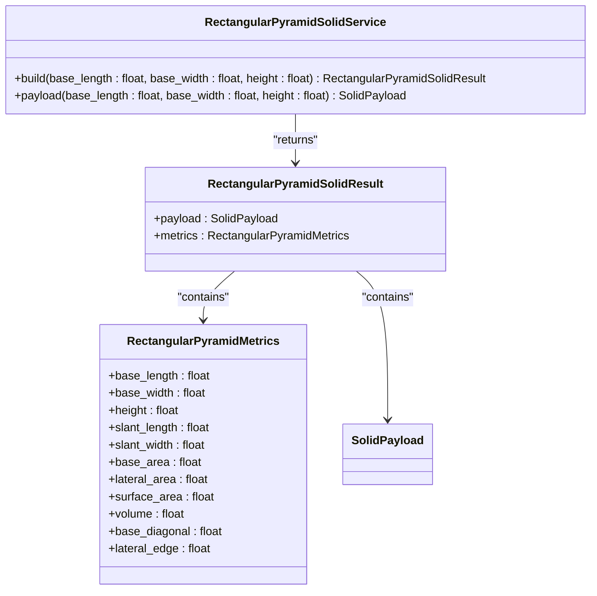
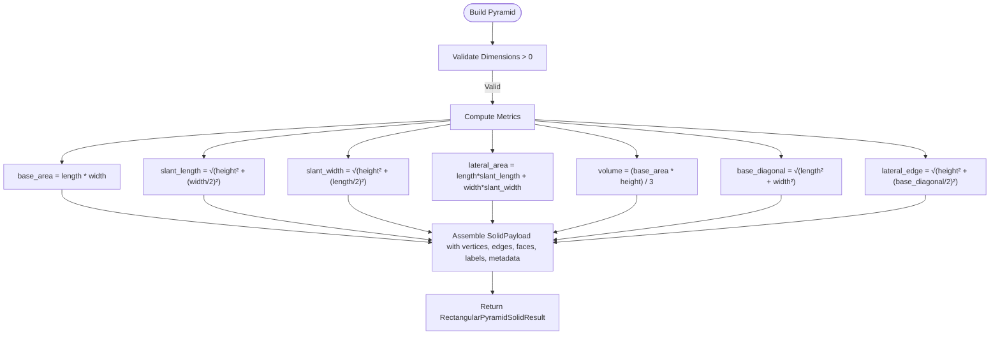
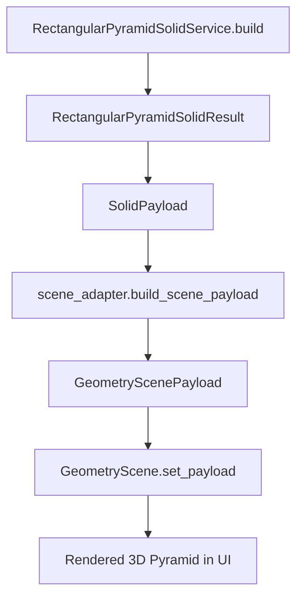

# Rectangular Pyramids

<cite>
**Referenced Files in This Document**   
- [rectangular_pyramid_solid.py](file://src/pillars/geometry/services/rectangular_pyramid_solid.py)
- [solid_payload.py](file://src/pillars/geometry/shared/solid_payload.py)
- [solid_property.py](file://src/pillars/geometry/services/solid_property.py)
- [geometry_scene.py](file://src/pillars/geometry/ui/geometry_scene.py)
- [scene_adapter.py](file://src/pillars/geometry/ui/scene_adapter.py)
</cite>

## Table of Contents
1. [Introduction](#introduction)
2. [Construction Parameters](#construction-parameters)
3. [Core Metrics and Methods](#core-metrics-and-methods)
4. [Asymmetry and Moment of Inertia](#asymmetry-and-moment-of-inertia)
5. [Usage Examples](#usage-examples)
6. [Numerical Stability](#numerical-stability)
7. [Scene Graph Integration](#scene-graph-integration)
8. [Export and Visualization](#export-and-visualization)

## Introduction
The `RectangularPyramidSolid` class provides a comprehensive implementation for modeling right rectangular pyramids, a fundamental geometric solid with a rectangular base and an apex point directly above the base's center. This documentation details the API for constructing these solids, computing their geometric properties, and integrating them into 3D visualization systems. The implementation is designed for applications in architectural modeling, sacred geometry, and computational geometry, offering precise calculations for volume, surface area, and structural dimensions.

**Section sources**
- [rectangular_pyramid_solid.py](file://src/pillars/geometry/services/rectangular_pyramid_solid.py#L1-L247)

## Construction Parameters
A rectangular pyramid is defined by three primary dimensions: the length and width of its rectangular base, and the height from the base to the apex. The `RectangularPyramidSolidService` class provides a static `build` method to construct a pyramid instance. The base is centered at the origin in the X-Y plane, with the apex positioned along the positive Z-axis. The base vertices are calculated as:
- Vertex 0: (-base_length/2, -base_width/2, -height/2)
- Vertex 1: (base_length/2, -base_width/2, -height/2)
- Vertex 2: (base_length/2, base_width/2, -height/2)
- Vertex 3: (-base_length/2, base_width/2, -height/2)
- Apex (Vertex 4): (0, 0, height/2)

The method enforces that all dimensions (length, width, height) must be positive values; otherwise, a `ValueError` is raised. A convenience `payload` method is also available to directly retrieve the `SolidPayload` object without the metrics wrapper.



**Diagram sources **
- [rectangular_pyramid_solid.py](file://src/pillars/geometry/services/rectangular_pyramid_solid.py#L93-L125)

**Section sources**
- [rectangular_pyramid_solid.py](file://src/pillars/geometry/services/rectangular_pyramid_solid.py#L59-L70)
- [rectangular_pyramid_solid.py](file://src/pillars/geometry/services/rectangular_pyramid_solid.py#L97-L125)

## Core Metrics and Methods
The `RectangularPyramidSolidService` computes a comprehensive set of geometric metrics, encapsulated in the `RectangularPyramidMetrics` dataclass. These metrics are calculated using standard geometric formulas:

- **Volume**: The volume is calculated as (base_area * height) / 3.0, where the base area is the product of the base length and width.
- **Lateral Face Areas**: The pyramid has four triangular lateral faces. The two faces along the length have a slant height (`slant_length`) calculated as the hypotenuse of a right triangle with legs of `height` and `base_width/2`. The two faces along the width have a slant height (`slant_width`) calculated as the hypotenuse of a right triangle with legs of `height` and `base_length/2`. The lateral area is the sum of the areas of these four faces.
- **Slant Edges**: The slant edges are the edges connecting the apex to the base vertices. Their length (`lateral_edge`) is calculated as the hypotenuse of a right triangle with legs of `height` and half the base diagonal.
- **Centroid Location**: The centroid (geometric center) of a uniform right rectangular pyramid is located along the central axis, one-quarter of the height from the base towards the apex.

The `RectangularPyramidSolidCalculator` class provides an interactive interface for these calculations, allowing users to modify dimensions and automatically recalculate all dependent properties.



**Diagram sources **
- [rectangular_pyramid_solid.py](file://src/pillars/geometry/services/rectangular_pyramid_solid.py#L33-L56)

**Section sources**
- [rectangular_pyramid_solid.py](file://src/pillars/geometry/services/rectangular_pyramid_solid.py#L33-L56)
- [rectangular_pyramid_solid.py](file://src/pillars/geometry/services/rectangular_pyramid_solid.py#L132-L240)

## Asymmetry and Moment of Inertia
Non-square rectangular pyramids exhibit inherent asymmetry, which significantly impacts their moment of inertia calculations. Unlike a square pyramid, which has rotational symmetry, a rectangular pyramid has different moments of inertia about its principal axes (X and Y). The moment of inertia about an axis depends on the distribution of mass relative to that axis. For a rectangular pyramid with a uniform density, the moment of inertia about the axis parallel to the length (I_y) will be different from the moment of inertia about the axis parallel to the width (I_x), due to the different distances of the mass elements from these axes. This asymmetry is crucial for applications in physics simulations and structural engineering, where the rotational dynamics of the object must be accurately modeled. The `RectangularPyramidSolid` class provides the base dimensions and centroid location, which are the necessary inputs for calculating these moments of inertia using standard formulas for composite bodies.

## Usage Examples
### Architectural Modeling
In architectural design, the `RectangularPyramidSolid` can be used to model roof structures, spires, or decorative elements. For example, to model a roof with a 20m by 15m base and a height of 8m:
```python
result = RectangularPyramidSolidService.build(base_length=20.0, base_width=15.0, height=8.0)
print(f"Roof Volume: {result.metrics.volume:.2f} m³")
print(f"Surface Area: {result.metrics.surface_area:.2f} m²")
```

### Sacred Geometry Layouts
In sacred geometry, rectangular pyramids can represent specific energetic forms or be used in mandala designs. The calculator can be used to explore proportions based on sacred ratios. For instance, setting the base length to a value derived from the Golden Ratio and calculating the resulting height for a specific volume.

**Section sources**
- [rectangular_pyramid_solid.py](file://src/pillars/geometry/services/rectangular_pyramid_solid.py#L19-L25)
- [test_regular_pyramids.py](file://test/test_regular_pyramids.py#L19-L34)

## Numerical Stability
The implementation includes safeguards for numerical stability, particularly when dealing with high aspect ratio bases (where one dimension is much larger than the other). The primary concern is the calculation of the slant heights and lateral edges, which involve the hypotenuse function (`math.hypot`). This function is used instead of a direct square root of a sum of squares to prevent overflow or underflow for very large or very small values. The validation check ensures that all input dimensions are positive, preventing undefined geometric states. For extremely high aspect ratios, the precision of floating-point arithmetic may become a limiting factor, but the use of `math.hypot` minimizes this risk.

## Scene Graph Integration
The `RectangularPyramidSolid` integrates with the application's scene graph system through the `SolidPayload` object. This payload contains all the necessary data for rendering: a list of 3D vertices, edge connections, face definitions, and metadata. The `GeometryScene` class, which manages the 2D rendering of 3D objects, uses the `scene_adapter` to convert the `SolidPayload` into a `GeometryScenePayload` containing 2D primitives (lines, polygons, labels). The `set_payload` method on the `GeometryScene` is used to display the pyramid. The scene graph handles transformations, camera angles, and user interactions like zooming and panning, providing a seamless visualization experience.



**Diagram sources **
- [rectangular_pyramid_solid.py](file://src/pillars/geometry/services/rectangular_pyramid_solid.py#L101-L104)
- [scene_adapter.py](file://src/pillars/geometry/ui/scene_adapter.py#L19-L54)
- [geometry_scene.py](file://src/pillars/geometry/ui/geometry_scene.py#L104-L107)

**Section sources**
- [rectangular_pyramid_solid.py](file://src/pillars/geometry/services/rectangular_pyramid_solid.py#L101-L104)
- [scene_adapter.py](file://src/pillars/geometry/ui/scene_adapter.py#L19-L54)
- [geometry_scene.py](file://src/pillars/geometry/ui/geometry_scene.py#L104-L107)

## Export and Visualization
The `SolidPayload` generated by the `RectangularPyramidSolidService` contains all the geometric data needed for 3D visualization and export. The vertices, edges, and faces can be exported to standard 3D file formats such as OBJ or STL for use in external CAD software or 3D printing. The metadata dictionary includes all calculated metrics, which can be included in the export for documentation purposes. The suggested scale in the payload helps external viewers set an appropriate initial view. The integration with the `GeometryScene` allows for real-time 3D visualization within the application, with features like rotation, zoom, and measurement tools available to the user.

**Section sources**
- [solid_payload.py](file://src/pillars/geometry/shared/solid_payload.py#L21-L26)
- [geometry_hub.py](file://src/pillars/geometry/ui/geometry_hub.py#L371-L387)