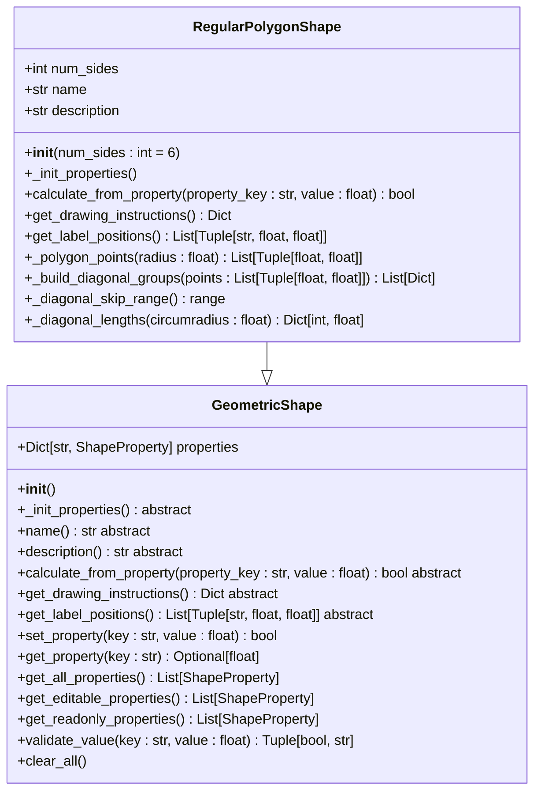
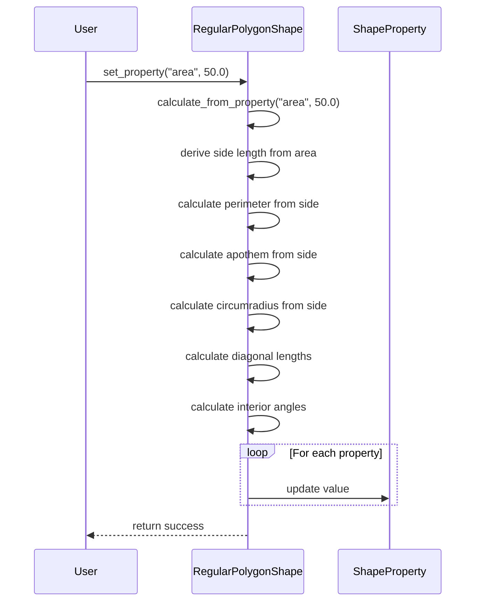
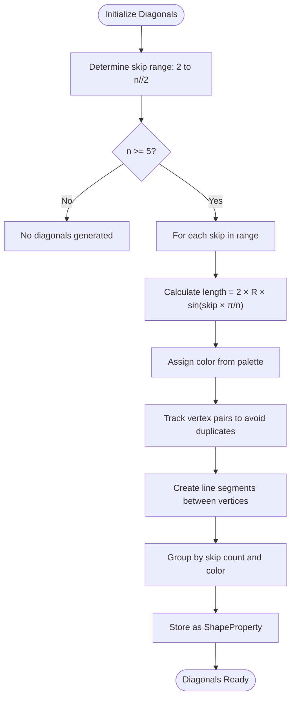
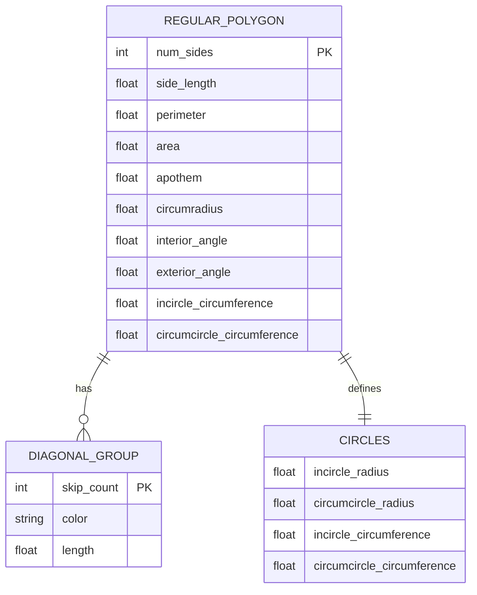
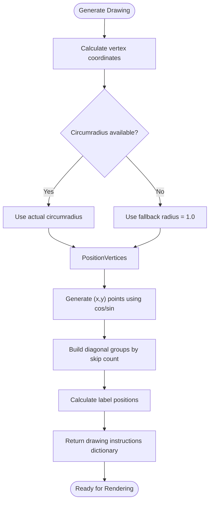
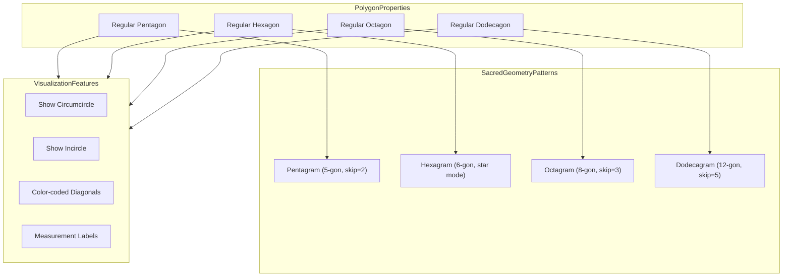

# Regular Polygon Shape

<cite>
**Referenced Files in This Document**   
- [polygon_shape.py](file://src/pillars/geometry/services/polygon_shape.py)
- [base_shape.py](file://src/pillars/geometry/services/base_shape.py)
- [geometry_hub.py](file://src/pillars/geometry/ui/geometry_hub.py)
- [geometry_calculator_window.py](file://src/pillars/geometry/ui/geometry_calculator_window.py)
- [verify_geometry_fixes.py](file://tests/verify_geometry_fixes.py)
</cite>

## Table of Contents
1. [Introduction](#introduction)
2. [Core Properties and Initialization](#core-properties-and-initialization)
3. [Property Synchronization and Calculation](#property-synchronization-and-calculation)
4. [Diagonal Length Calculations](#diagonal-length-calculations)
5. [Geometric Calculations](#geometric-calculations)
6. [Drawing and Visualization](#drawing-and-visualization)
7. [Sacred Geometry Applications](#sacred-geometry-applications)
8. [Numerical Stability and Precision](#numerical-stability-and-precision)
9. [API Reference](#api-reference)

## Introduction
The RegularPolygonShape class provides a comprehensive implementation for n-sided regular polygons with full support for sacred geometry applications. This API enables initialization through multiple primary dimensions (side count, side length, apothem, or circumradius) with automatic derivation of all related geometric properties. The implementation supports dynamic property synchronization, trigonometric calculations for diagonal lengths, and visualization capabilities for generating complex geometric patterns including pentagrams, hexagonal grids, and octagonal seals. The design follows a geometric calculator pattern with bidirectional property updates and validation.

**Section sources**
- [polygon_shape.py](file://src/pillars/geometry/services/polygon_shape.py#L16-L267)

## Core Properties and Initialization
The RegularPolygonShape class represents a regular polygon with n equal sides and angles, where n ≥ 3. The polygon is initialized with a specified number of sides, with a default of 6 (hexagon). The class provides special naming for common polygons (triangle, square, pentagon, etc.) while supporting any n-sided configuration.

The initialization process sets up the fundamental properties of the polygon, including:
- **num_sides**: Number of sides (automatically clamped to minimum of 3)
- **name**: Human-readable name based on side count
- **description**: Brief description of the polygon

The class inherits from GeometricShape, establishing a consistent interface across all geometric entities in the system. During initialization, the system prepares internal mappings for diagonal properties, enabling dynamic access to diagonal lengths based on vertex skipping patterns.

**Diagram sources**
- [polygon_shape.py](file://src/pillars/geometry/services/polygon_shape.py#L16-L267)
- [base_shape.py](file://src/pillars/geometry/services/base_shape.py#L18-L143)

**Section sources**
- [polygon_shape.py](file://src/pillars/geometry/services/polygon_shape.py#L16-L47)

## Property Synchronization and Calculation
The RegularPolygonShape implements a sophisticated property synchronization system that allows any primary dimension to serve as the basis for calculating all other geometric properties. The system supports initialization and recalculation from multiple input parameters:

- **Side Length**: Direct specification of edge length
- **Perimeter**: Total boundary length, automatically divided by n to derive side length
- **Area**: Surface area, used to calculate side length through trigonometric relationships
- **Apothem**: Distance from center to midpoint of any side
- **Circumradius**: Distance from center to any vertex

When any property is updated, the system recalculates all dependent properties through a chain of trigonometric formulas. The calculate_from_property method serves as the central calculation engine, accepting a property key and value, then deriving the side length as an intermediate step before computing all other properties. This approach ensures consistency across the entire property set regardless of which dimension is initially specified.

The property system uses the ShapeProperty class to define each measurable attribute, specifying its display name, internal key, unit, and editability status. Read-only properties (such as area and angles) are automatically calculated, while editable properties (such as side length and apothem) can be directly modified by users.

**Diagram sources**
- [polygon_shape.py](file://src/pillars/geometry/services/polygon_shape.py#L130-L189)
- [base_shape.py](file://src/pillars/geometry/services/base_shape.py#L85-L103)

**Section sources**
- [polygon_shape.py](file://src/pillars/geometry/services/polygon_shape.py#L52-L129)

## Diagonal Length Calculations
The RegularPolygonShape class provides comprehensive support for diagonal length calculations based on vertex skipping patterns. For an n-sided polygon, diagonals are categorized by the number of vertices they skip, with the system automatically generating properties for all valid diagonal types.

The diagonal calculation system works as follows:
1. For each possible skip count from 2 to n//2, a corresponding diagonal property is created
2. Each diagonal length is calculated using the formula: diagonal = 2 × circumradius × sin(skip × π / n)
3. Diagonals are grouped by skip count and assigned distinct colors from a predefined palette
4. The system prevents duplicate diagonal segments through vertex pair tracking

The implementation includes a diagonal color palette with six distinct RGBA colors (red, green, blue, amber, violet, light red) that are applied cyclically to different diagonal groups. This enables visual differentiation of diagonal patterns in the rendered output. For polygons with fewer than 5 sides, no diagonals are generated as they would not form valid internal connections.

The _diagonal_skip_range method determines the valid range of skip counts based on the polygon's side count, ensuring mathematical validity and avoiding redundant or degenerate diagonals. The _diagonal_lengths method computes the actual lengths using trigonometric relationships, while _build_diagonal_groups organizes the visual representation of these diagonals in the drawing instructions.

**Diagram sources**
- [polygon_shape.py](file://src/pillars/geometry/services/polygon_shape.py#L259-L266)
- [polygon_shape.py](file://src/pillars/geometry/services/polygon_shape.py#L237-L257)

**Section sources**
- [polygon_shape.py](file://src/pillars/geometry/services/polygon_shape.py#L119-L128)
- [polygon_shape.py](file://src/pillars/geometry/services/polygon_shape.py#L259-L266)

## Geometric Calculations
The RegularPolygonShape implements a comprehensive set of geometric calculations for deriving key properties from the fundamental dimensions. These calculations are based on standard trigonometric relationships for regular polygons:

**Area Calculation**: 
- Formula: Area = (n × s²) / (4 × tan(π/n))
- Where n is the number of sides and s is the side length
- Alternatively: Area = (n × s × apothem) / 2

**Perimeter Calculation**:
- Formula: Perimeter = n × side_length

**Apothem Calculation**:
- Formula: Apothem = side_length / (2 × tan(π/n))
- Represents the radius of the incircle

**Circumradius Calculation**:
- Formula: Circumradius = side_length / (2 × sin(π/n))
- Represents the radius of the circumcircle

**Angle Calculations**:
- Interior Angle = ((n - 2) × 180) / n degrees
- Exterior Angle = 180 - Interior Angle

**Circumference Calculations**:
- Incircle Circumference = 2 × π × apothem
- Circumcircle Circumference = 2 × π × circumradius

The system also calculates wedge area (sector area) as area/n, representing the area of each triangular segment from the center to two adjacent vertices. All calculations are performed with floating-point precision, with validation to prevent division by zero or other numerical instabilities, particularly when dealing with high-order polygons where trigonometric functions approach asymptotic values.

**Diagram sources**
- [polygon_shape.py](file://src/pillars/geometry/services/polygon_shape.py#L130-L188)

**Section sources**
- [polygon_shape.py](file://src/pillars/geometry/services/polygon_shape.py#L130-L188)

## Drawing and Visualization
The RegularPolygonShape provides comprehensive drawing and visualization capabilities through the get_drawing_instructions and get_label_positions methods. These methods generate the data needed to render the polygon in the application's geometry viewport, including vertices, diagonals, and annotation labels.

The get_drawing_instructions method returns a dictionary containing:
- **type**: Set to "polygon" to identify the shape type
- **points**: Array of (x,y) coordinates for each vertex
- **show_circumcircle**: Boolean flag to display the circumcircle
- **diagonal_groups**: Organized collection of diagonal line segments grouped by skip count and color

Vertex coordinates are calculated using polar-to-Cartesian conversion, with vertices positioned at equal angular intervals around the circumcircle. The first vertex is positioned at the top (12 o'clock position) by applying a -π/2 phase shift to the angle calculation.

The get_label_positions method generates text annotations for key measurements, including:
- Side length (positioned below the polygon)
- Area (positioned at the center)
- Number of sides (positioned near the center)

Label positioning uses the circumradius as a scaling factor to ensure proper placement relative to the polygon's size. When the circumradius is not available, a fallback value of 1.0 is used to maintain consistent relative positioning.

**Diagram sources**
- [polygon_shape.py](file://src/pillars/geometry/services/polygon_shape.py#L191-L228)
- [polygon_shape.py](file://src/pillars/geometry/services/polygon_shape.py#L230-L235)

**Section sources**
- [polygon_shape.py](file://src/pillars/geometry/services/polygon_shape.py#L191-L228)

## Sacred Geometry Applications
The RegularPolygonShape implementation supports various sacred geometry applications through its flexible property system and visualization capabilities. The codebase includes specific examples and use cases for generating meaningful geometric patterns:

**Pentagrams**: Generated from regular pentagons (5-gon) by connecting vertices with a skip count of 2, creating the classic five-pointed star associated with various esoteric traditions.

**Hexagonal Grids**: Created using regular hexagons (6-gon) which naturally tile the plane without gaps, representing honeycomb structures and efficient packing patterns found in nature.

**Octagonal Seals**: Formed from regular octagons (8-gon) with specific diagonal patterns, often used in architectural designs and mystical symbolism.

The system supports special UI features for certain configurations, such as the ability to draw a hexagon as a hexagram (Star of David) when the number of sides is 6. This feature is implemented in the geometry calculator window, where a checkbox allows users to toggle between the standard hexagon and the star configuration.

The geometry hub provides access to various polygon configurations through a user interface that includes descriptive summaries highlighting their sacred geometry significance, such as "Hexagonal lattices, honeycomb symmetries" for the hexagon and "Stop-sign symmetry, eastern mandalas" for the octagon.

**Diagram sources**
- [geometry_hub.py](file://src/pillars/geometry/ui/geometry_hub.py#L324-L360)
- [geometry_calculator_window.py](file://src/pillars/geometry/ui/geometry_calculator_window.py#L621-L627)

**Section sources**
- [geometry_hub.py](file://src/pillars/geometry/ui/geometry_hub.py#L1728-L1731)

## Numerical Stability and Precision
The RegularPolygonShape implementation addresses numerical stability and floating-point precision concerns, particularly for high-order polygons where trigonometric calculations can become unstable. The system includes several safeguards to maintain accuracy and prevent computational errors:

**Division by Zero Prevention**: The calculate_from_property method includes a check for near-zero denominator values when calculating diagonal lengths, returning False if the denominator falls below a threshold of 1e-9. This prevents division by zero errors when dealing with degenerate cases.

**Input Validation**: All property values are validated to ensure they are positive, as negative or zero values would not represent valid geometric dimensions. The validate_value method in the base GeometricShape class enforces this constraint.

**Floating-Point Tolerance**: Calculations use standard floating-point arithmetic with appropriate tolerance thresholds for comparisons. The system avoids exact equality comparisons for floating-point values, instead using approximate equality checks where necessary.

**High-Order Polygon Considerations**: As the number of sides increases, the polygon approaches a circle, and certain trigonometric functions approach asymptotic values. The implementation handles these cases by using the circumradius as the primary reference dimension for vertex positioning, ensuring stable coordinate calculations even for polygons with many sides.

**Angle Mode Consistency**: The system uses radians for all internal trigonometric calculations, maintaining consistency with Python's math module. This avoids potential errors from mixing degree and radian measurements in calculations.

**Section sources**
- [polygon_shape.py](file://src/pillars/geometry/services/polygon_shape.py#L155-L157)
- [base_shape.py](file://src/pillars/geometry/services/base_shape.py#L134-L137)

## API Reference
The RegularPolygonShape class provides the following public API:

### Constructor
- **__init__(num_sides: int = 6)**: Initializes a regular polygon with the specified number of sides (minimum 3)

### Properties
- **name**: Returns the human-readable name of the polygon
- **description**: Returns a brief description of the polygon
- **num_sides**: Number of sides (≥ 3)

### Methods
- **calculate_from_property(property_key: str, value: float) → bool**: Calculates all properties from a given property value
- **get_drawing_instructions() → Dict**: Returns drawing data for rendering the polygon
- **get_label_positions() → List[Tuple[str, float, float]]**: Returns positions for measurement labels
- **set_property(key: str, value: float) → bool**: Sets a property value and recalculates dependent properties
- **get_property(key: str) → Optional[float]**: Gets the value of a specific property
- **get_all_properties() → List[ShapeProperty]**: Returns all properties
- **get_editable_properties() → List[ShapeProperty]**: Returns editable properties
- **get_readonly_properties() → List[ShapeProperty]**: Returns calculated (readonly) properties
- **clear_all()**: Clears all property values

### Supported Property Keys
- 'side': Side length
- 'perimeter': Perimeter
- 'area': Area
- 'apothem': Apothem (inradius)
- 'circumradius': Circumradius
- 'interior_angle': Interior angle in degrees
- 'exterior_angle': Exterior angle in degrees
- 'diagonal_skip_n': Diagonal lengths for various skip counts

**Section sources**
- [polygon_shape.py](file://src/pillars/geometry/services/polygon_shape.py#L16-L267)
- [base_shape.py](file://src/pillars/geometry/services/base_shape.py#L18-L143)