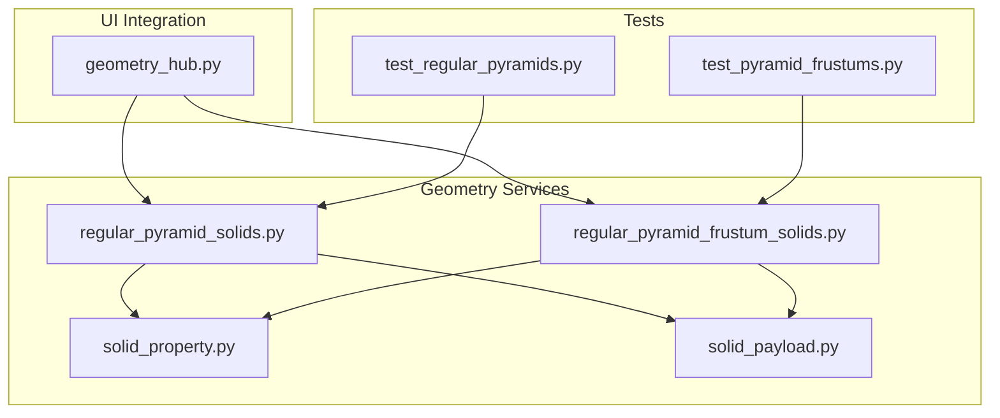
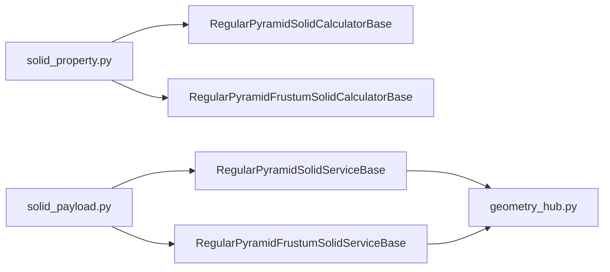
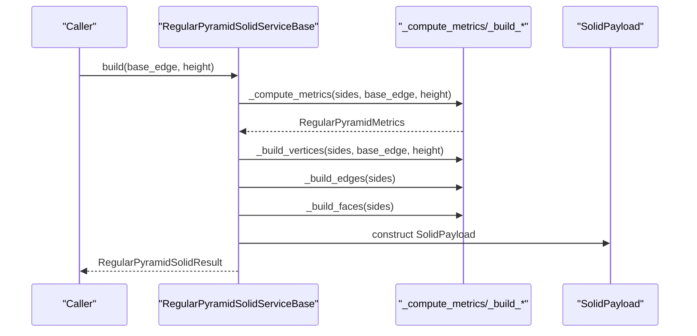
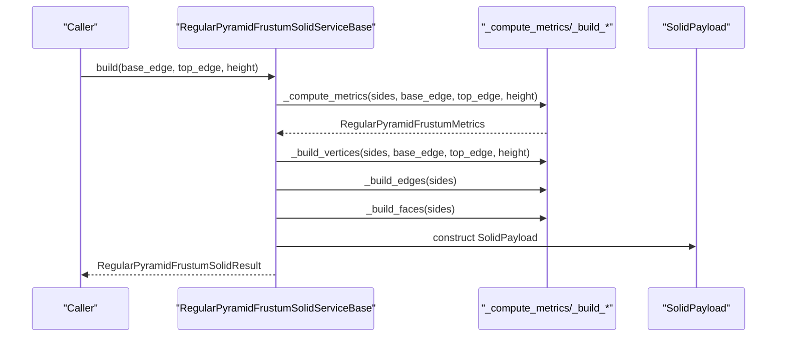
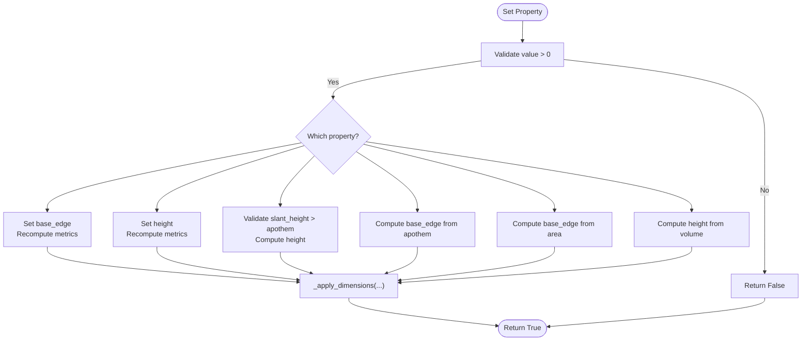
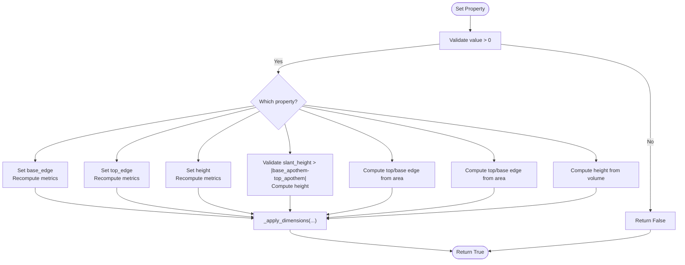

# Regular Pyramids

<cite>
**Referenced Files in This Document**
- [regular_pyramid_solids.py](file://src/pillars/geometry/services/regular_pyramid_solids.py)
- [regular_pyramid_frustum_solids.py](file://src/pillars/geometry/services/regular_pyramid_frustum_solids.py)
- [solid_property.py](file://src/pillars/geometry/services/solid_property.py)
- [solid_payload.py](file://src/pillars/geometry/shared/solid_payload.py)
- [geometry_hub.py](file://src/pillars/geometry/ui/geometry_hub.py)
- [test_regular_pyramids.py](file://test/test_regular_pyramids.py)
- [test_pyramid_frustums.py](file://test/test_pyramid_frustums.py)
</cite>

## Table of Contents
1. [Introduction](#introduction)
2. [Project Structure](#project-structure)
3. [Core Components](#core-components)
4. [Architecture Overview](#architecture-overview)
5. [Detailed Component Analysis](#detailed-component-analysis)
6. [Dependency Analysis](#dependency-analysis)
7. [Performance Considerations](#performance-considerations)
8. [Troubleshooting Guide](#troubleshooting-guide)
9. [Conclusion](#conclusion)
10. [Appendices](#appendices)

## Introduction
This document provides API documentation for the RegularPyramidSolids and RegularPyramidFrustumSolids subsystems. It explains how to construct right regular n-gonal pyramids and their truncated frustum variants, detailing geometric properties such as volume, lateral surface area, slant height, and circumradius-related metrics. It also documents parameters (number of sides, base/top edge, height), usage patterns for triangular, pentagonal, and hexagonal pyramids and frusta, and the mathematical derivations underlying apex-to-base relationships and edge angle calculations. Edge cases like zero height, unit radius, and full truncation are addressed, along with performance considerations for high-vertex-count pyramids and numerical precision in trigonometric computations.

## Project Structure
The relevant implementation resides in the geometry services module and is integrated into the geometry hub UI for interactive calculation and visualization.

**Diagram sources**
- [regular_pyramid_solids.py](file://src/pillars/geometry/services/regular_pyramid_solids.py#L1-L314)
- [regular_pyramid_frustum_solids.py](file://src/pillars/geometry/services/regular_pyramid_frustum_solids.py#L1-L332)
- [solid_property.py](file://src/pillars/geometry/services/solid_property.py#L1-L21)
- [solid_payload.py](file://src/pillars/geometry/shared/solid_payload.py#L1-L52)
- [geometry_hub.py](file://src/pillars/geometry/ui/geometry_hub.py#L900-L933)
- [test_regular_pyramids.py](file://test/test_regular_pyramids.py#L1-L125)
- [test_pyramid_frustums.py](file://test/test_pyramid_frustums.py#L1-L156)

**Section sources**
- [regular_pyramid_solids.py](file://src/pillars/geometry/services/regular_pyramid_solids.py#L1-L314)
- [regular_pyramid_frustum_solids.py](file://src/pillars/geometry/services/regular_pyramid_frustum_solids.py#L1-L332)
- [solid_property.py](file://src/pillars/geometry/services/solid_property.py#L1-L21)
- [solid_payload.py](file://src/pillars/geometry/shared/solid_payload.py#L1-L52)
- [geometry_hub.py](file://src/pillars/geometry/ui/geometry_hub.py#L900-L933)
- [test_regular_pyramids.py](file://test/test_regular_pyramids.py#L1-L125)
- [test_pyramid_frustums.py](file://test/test_pyramid_frustums.py#L1-L156)

## Core Components
- RegularPyramidSolidServiceBase: Base service for right regular n-gonal pyramids. Provides build() and payload() methods, computes metrics, and constructs vertex/edge/face topology.
- RegularPyramidSolidCalculatorBase: Interactive calculator that exposes properties (base_edge, height, slant_height, base_apothem, base_area, lateral_area, surface_area, volume, lateral_edge, base_perimeter) and allows setting values to solve for others.
- Triangular/Pentagonal/Hexagonal/HeptagonalPyramidSolidService and Calculator: Specializations for n=3,5,6,7.
- RegularPyramidFrustumSolidServiceBase: Base service for regular n-gon pyramid frusta. Provides build() and payload(), computes metrics for truncated pyramids, and constructs topology.
- RegularPyramidFrustumSolidCalculatorBase: Interactive calculator for frusta with properties (base_edge, top_edge, height, slant_height, base_area, top_area, lateral_area, surface_area, volume, base_apothem, top_apothem, lateral_edge).
- Pentagonal/HexagonalPyramidFrustumSolidService and Calculator: Specializations for n=5,6.
- SolidProperty and SolidPayload: Shared data structures for property metadata and 3D model payload.

Key outputs:
- Metrics dataclasses expose computed properties (e.g., sides, base_edge, height, slant_height, base_apothem, base_area, lateral_area, surface_area, volume, base_perimeter, base_circumradius, lateral_edge).
- Payload includes vertices, edges, faces, labels, metadata, and suggested scale.

**Section sources**
- [regular_pyramid_solids.py](file://src/pillars/geometry/services/regular_pyramid_solids.py#L16-L147)
- [regular_pyramid_solids.py](file://src/pillars/geometry/services/regular_pyramid_solids.py#L149-L313)
- [regular_pyramid_frustum_solids.py](file://src/pillars/geometry/services/regular_pyramid_frustum_solids.py#L16-L175)
- [regular_pyramid_frustum_solids.py](file://src/pillars/geometry/services/regular_pyramid_frustum_solids.py#L182-L331)
- [solid_property.py](file://src/pillars/geometry/services/solid_property.py#L1-L21)
- [solid_payload.py](file://src/pillars/geometry/shared/solid_payload.py#L1-L52)

## Architecture Overview
The system follows a layered architecture:
- Services compute geometry and topology.
- Calculators manage property editing and dimension solving.
- UI integrates services and calculators for interactive use.

```mermaid
classDiagram
class SolidProperty {
+string name
+string key
+string unit
+float value
+int precision
+bool editable
}
class SolidPayload {
+Vec3[] vertices
+Edge[] edges
+Face[] faces
+SolidLabel[] labels
+Dict metadata
+float suggested_scale
+bounds() Tuple~Vec3,Vec3~
}
class RegularPyramidSolidServiceBase {
+int SIDES
+string NAME
+build(base_edge, height) RegularPyramidSolidResult
+payload(base_edge, height) SolidPayload
}
class RegularPyramidSolidCalculatorBase {
+int SIDES
+Type SERVICE
+properties() SolidProperty[]
+set_property(key, value) bool
+payload() SolidPayload
+metadata() Dict
+metrics() RegularPyramidMetrics
}
class TriangularPyramidSolidService
class PentagonalPyramidSolidService
class HexagonalPyramidSolidService
class HeptagonalPyramidSolidService
class TriangularPyramidSolidCalculator
class PentagonalPyramidSolidCalculator
class HexagonalPyramidSolidCalculator
class HeptagonalPyramidSolidCalculator
class RegularPyramidFrustumSolidServiceBase {
+int SIDES
+string NAME
+build(base_edge, top_edge, height) RegularPyramidFrustumSolidResult
+payload(base_edge, top_edge, height) SolidPayload
}
class RegularPyramidFrustumSolidCalculatorBase {
+int SIDES
+Type SERVICE
+properties() SolidProperty[]
+set_property(key, value) bool
+payload() SolidPayload
+metadata() Dict
+metrics() RegularPyramidFrustumMetrics
}
class PentagonalPyramidFrustumSolidService
class HexagonalPyramidFrustumSolidService
class PentagonalPyramidFrustumSolidCalculator
class HexagonalPyramidFrustumSolidCalculator
RegularPyramidSolidServiceBase <|-- TriangularPyramidSolidService
RegularPyramidSolidServiceBase <|-- PentagonalPyramidSolidService
RegularPyramidSolidServiceBase <|-- HexagonalPyramidSolidService
RegularPyramidSolidServiceBase <|-- HeptagonalPyramidSolidService
RegularPyramidSolidCalculatorBase <|-- TriangularPyramidSolidCalculator
RegularPyramidSolidCalculatorBase <|-- PentagonalPyramidSolidCalculator
RegularPyramidSolidCalculatorBase <|-- HexagonalPyramidSolidCalculator
RegularPyramidSolidCalculatorBase <|-- HeptagonalPyramidSolidCalculator
RegularPyramidFrustumSolidServiceBase <|-- PentagonalPyramidFrustumSolidService
RegularPyramidFrustumSolidServiceBase <|-- HexagonalPyramidFrustumSolidService
RegularPyramidFrustumSolidCalculatorBase <|-- PentagonalPyramidFrustumSolidCalculator
RegularPyramidFrustumSolidCalculatorBase <|-- HexagonalPyramidFrustumSolidCalculator
RegularPyramidSolidServiceBase --> SolidPayload : "produces"
RegularPyramidFrustumSolidServiceBase --> SolidPayload : "produces"
SolidProperty <.. RegularPyramidSolidCalculatorBase : "exposes"
SolidProperty <.. RegularPyramidFrustumSolidCalculatorBase : "exposes"
```

**Diagram sources**
- [regular_pyramid_solids.py](file://src/pillars/geometry/services/regular_pyramid_solids.py#L111-L313)
- [regular_pyramid_frustum_solids.py](file://src/pillars/geometry/services/regular_pyramid_frustum_solids.py#L135-L331)
- [solid_property.py](file://src/pillars/geometry/services/solid_property.py#L1-L21)
- [solid_payload.py](file://src/pillars/geometry/shared/solid_payload.py#L1-L52)

## Detailed Component Analysis

### RegularPyramidSolidServiceBase and Calculator
- Purpose: Construct right regular n-gonal pyramids and compute geometric properties.
- Parameters:
  - base_edge: Base edge length (positive).
  - height: Pyramid height (positive).
  - SIDES: Number of sides (≥3).
- Computed metrics include:
  - base_apothem, base_circumradius, base_area, base_perimeter
  - slant_height, lateral_edge, lateral_area, surface_area, volume
- Vertex/edge/face construction:
  - Base vertices lie on a circle centered at origin with radius equal to base_circumradius.
  - Apex is placed at height/2 along the z-axis; base is at -height/2.
  - Edges connect base vertices to adjacent base vertices and to the apex.
  - Faces include the base polygon and n triangular lateral faces.
- Calculator property solving:
  - Supports setting base_edge, height, slant_height, base_apothem, base_area, volume.
  - Validates inputs and solves for dependent dimensions.

Usage examples (constructors and calculators):
- Triangular pyramid: use TriangularPyramidSolidService.build or TriangularPyramidSolidCalculator.
- Pentagonal pyramid: use PentagonalPyramidSolidService.build or PentagonalPyramidSolidCalculator.
- Hexagonal pyramid: use HexagonalPyramidSolidService.build or HexagonalPyramidSolidCalculator.
- Heptagonal pyramid: use HeptagonalPyramidSolidService.build or HeptagonalPyramidSolidCalculator.

Mathematical derivations:
- Base apothem: apothem = base_edge / (2 tan(π / sides)).
- Base circumradius: circumradius = base_edge / (2 sin(π / sides)).
- Base area: area = (sides × edge^2) / (4 tan(π / sides)).
- Slant height: slant_height = sqrt(height^2 + apothem^2).
- Lateral edge: lateral_edge = sqrt(height^2 + circumradius^2).
- Surface area: base_area + lateral_area.
- Volume: (base_area × height) / 3.

Edge cases:
- Zero height: raises validation error in build().
- Non-positive base_edge or height: raises validation error in build() and calculator setters.
- Very large number of sides: trigonometric functions remain stable; computational cost scales with O(sides) for polygon metrics.

**Section sources**
- [regular_pyramid_solids.py](file://src/pillars/geometry/services/regular_pyramid_solids.py#L16-L147)
- [regular_pyramid_solids.py](file://src/pillars/geometry/services/regular_pyramid_solids.py#L149-L313)
- [test_regular_pyramids.py](file://test/test_regular_pyramids.py#L54-L125)

### RegularPyramidFrustumSolidServiceBase and Calculator
- Purpose: Construct regular n-gon pyramid frusta (truncated pyramids) and compute geometric properties.
- Parameters:
  - base_edge: Bottom base edge length (positive).
  - top_edge: Top base edge length (positive).
  - height: Frustum height (positive).
  - SIDES: Number of sides (≥3).
- Computed metrics include:
  - base_apothem, top_apothem, base_circumradius, top_circumradius
  - base_area, top_area, base_perimeter, top_perimeter
  - slant_height, lateral_edge, lateral_area, surface_area, volume
- Vertex/edge/face construction:
  - Two parallel polygons (base and top) with radii computed from base_edge and top_edge.
  - Lateral edges connect corresponding base and top vertices.
  - Faces include two polygonal caps and n trapezoidal lateral faces.
- Calculator property solving:
  - Supports setting base_edge, top_edge, height, slant_height, base_area, top_area, volume.
  - Validates inputs and solves for dependent dimensions.

Usage examples (constructors and calculators):
- Pentagonal frustum: use PentagonalPyramidFrustumSolidService.build or PentagonalPyramidFrustumSolidCalculator.
- Hexagonal frustum: use HexagonalPyramidFrustumSolidService.build or HexagonalPyramidFrustumSolidCalculator.

Mathematical derivations:
- Base/top apothem and area from edge lengths using the same formulas as the pyramid base.
- Slant height: slant_height = sqrt(height^2 + (base_apothem - top_apothem)^2).
- Lateral edge: lateral_edge = sqrt(height^2 + (base_circumradius - top_circumradius)^2).
- Lateral area: 0.5 × (base_perimeter + top_perimeter) × slant_height.
- Surface area: base_area + top_area + lateral_area.
- Volume: (height / 3) × (base_area + sqrt(base_area × top_area) + top_area).

Edge cases:
- Zero height: raises validation error in build().
- Non-positive base_edge, top_edge, or height: raises validation error in build() and calculator setters.
- Full truncation (top_edge approaches zero): slant_height reduces to sqrt(height^2 + base_apothem^2); lateral edge reduces to sqrt(height^2 + base_circumradius^2).

**Section sources**
- [regular_pyramid_frustum_solids.py](file://src/pillars/geometry/services/regular_pyramid_frustum_solids.py#L16-L175)
- [regular_pyramid_frustum_solids.py](file://src/pillars/geometry/services/regular_pyramid_frustum_solids.py#L182-L331)
- [test_pyramid_frustums.py](file://test/test_pyramid_frustums.py#L1-L156)

### API Reference

#### RegularPyramidSolidServiceBase
- Methods
  - build(base_edge: float = 1.0, height: float = 1.0) -> RegularPyramidSolidResult
  - payload(base_edge: float = 1.0, height: float = 1.0) -> SolidPayload
- Validation
  - SIDES must be ≥3.
  - base_edge and height must be >0.

#### RegularPyramidSolidCalculatorBase
- Properties
  - base_edge, height, slant_height, base_apothem, base_area, lateral_area, surface_area, volume, lateral_edge, base_perimeter
- Methods
  - properties() -> List[SolidProperty]
  - set_property(key: str, value: Optional[float]) -> bool
  - payload() -> Optional[SolidPayload]
  - metadata() -> Dict[str, float]
  - metrics() -> Optional[RegularPyramidMetrics]

#### Specialized Pyramid Services and Calculators
- TriangularPyramidSolidService / TriangularPyramidSolidCalculator
- PentagonalPyramidSolidService / PentagonalPyramidSolidCalculator
- HexagonalPyramidSolidService / HexagonalPyramidSolidCalculator
- HeptagonalPyramidSolidService / HeptagonalPyramidSolidCalculator

#### RegularPyramidFrustumSolidServiceBase
- Methods
  - build(base_edge: float = 2.0, top_edge: float = 1.0, height: float = 1.0) -> RegularPyramidFrustumSolidResult
  - payload(base_edge: float = 2.0, top_edge: float = 1.0, height: float = 1.0) -> SolidPayload
- Validation
  - SIDES must be ≥3.
  - base_edge, top_edge, and height must be >0.

#### RegularPyramidFrustumSolidCalculatorBase
- Properties
  - base_edge, top_edge, height, slant_height, base_area, top_area, lateral_area, surface_area, volume, base_apothem, top_apothem, lateral_edge
- Methods
  - properties() -> List[SolidProperty]
  - set_property(key: str, value: Optional[float]) -> bool
  - payload() -> Optional[SolidPayload]
  - metadata() -> Dict[str, float]
  - metrics() -> Optional[RegularPyramidFrustumMetrics]

#### Specialized Frustum Services and Calculators
- PentagonalPyramidFrustumSolidService / PentagonalPyramidFrustumSolidCalculator
- HexagonalPyramidFrustumSolidService / HexagonalPyramidFrustumSolidCalculator

**Section sources**
- [regular_pyramid_solids.py](file://src/pillars/geometry/services/regular_pyramid_solids.py#L111-L313)
- [regular_pyramid_frustum_solids.py](file://src/pillars/geometry/services/regular_pyramid_frustum_solids.py#L135-L331)

### Usage Examples

- Triangular pyramid
  - Service: TriangularPyramidSolidService.build(base_edge=6.0, height=4.0)
  - Calculator: TriangularPyramidSolidCalculator(base_edge=5.5, height=7.25)
  - Setters: set_property('base_area', area) and set_property('volume', volume)

- Pentagonal pyramid
  - Service: PentagonalPyramidSolidService.build(base_edge=4.0, height=5.0)
  - Calculator: PentagonalPyramidSolidCalculator(base_edge=3.0, height=6.0)
  - Setters: set_property('base_apothem', apothem)

- Hexagonal pyramid
  - Service: HexagonalPyramidSolidService.build(base_edge=3.0, height=4.0)
  - Calculator: HexagonalPyramidSolidCalculator(base_edge=2.5, height=5.0)

- Pentagonal frustum
  - Service: PentagonalPyramidFrustumSolidService.build(base_edge=8.0, top_edge=4.0, height=6.0)
  - Calculator: PentagonalPyramidFrustumSolidCalculator(base_edge=7.0, top_edge=3.5, height=5.0)
  - Setters: set_property('top_area', top_area), set_property('base_area', base_area), set_property('volume', volume)

- Hexagonal frustum
  - Service: HexagonalPyramidFrustumSolidService.build(base_edge=9.0, top_edge=4.5, height=7.0)
  - Calculator: HexagonalPyramidFrustumSolidCalculator(base_edge=9.0, top_edge=4.5, height=7.0)

These examples demonstrate construction via service.build() and interactive editing via calculator.set_property(). The UI integration is provided by the geometry hub.

**Section sources**
- [test_regular_pyramids.py](file://test/test_regular_pyramids.py#L54-L125)
- [test_pyramid_frustums.py](file://test/test_pyramid_frustums.py#L66-L156)
- [geometry_hub.py](file://src/pillars/geometry/ui/geometry_hub.py#L900-L933)

### Mathematical Derivations and Edge Angles

- Slant height derivation (pyramid):
  - The slant height is the hypotenuse of a right triangle formed by the pyramid height and the base apothem.
  - Formula: slant_height = sqrt(height^2 + apothem^2).

- Apex-to-base relationships:
  - Base apothem: apothem = base_edge / (2 tan(π / sides)).
  - Base circumradius: circumradius = base_edge / (2 sin(π / sides)).
  - Lateral edge: lateral_edge = sqrt(height^2 + circumradius^2).

- Edge angles:
  - Apex-to-base angle (angle between lateral edge and base plane): arcsin(height / lateral_edge).
  - Apex-to-apothem angle (angle between slant height and apothem projection): arcsin(apothem / slant_height).

- Frustum slant height:
  - The slant height is the hypotenuse of a right triangle whose legs are the height and the difference in apothems.
  - Formula: slant_height = sqrt(height^2 + (base_apothem - top_apothem)^2).

- Frustum lateral edge:
  - The lateral edge connects corresponding base and top vertices; its length depends on the difference in circumradii.
  - Formula: lateral_edge = sqrt(height^2 + (base_circumradius - top_circumradius)^2).

- Degenerate cases:
  - Zero height: invalid input; build() and setters reject non-positive values.
  - Unit radius: valid; base_edge can be computed from circumradius using base_edge = 2 × circumradius × sin(π / sides).
  - Full truncation: top_edge approaches zero; the frustum collapses to a pyramid with base_edge and height.

**Section sources**
- [regular_pyramid_solids.py](file://src/pillars/geometry/services/regular_pyramid_solids.py#L38-L81)
- [regular_pyramid_frustum_solids.py](file://src/pillars/geometry/services/regular_pyramid_frustum_solids.py#L43-L92)
- [test_regular_pyramids.py](file://test/test_regular_pyramids.py#L54-L125)
- [test_pyramid_frustums.py](file://test/test_pyramid_frustums.py#L66-L156)

## Dependency Analysis
- Services depend on SolidPayload and SolidProperty for output and property metadata.
- Calculators depend on services for geometry computation and on SolidProperty for property definitions.
- UI integration maps shape identifiers to builder and calculator classes.

**Diagram sources**
- [regular_pyramid_solids.py](file://src/pillars/geometry/services/regular_pyramid_solids.py#L111-L313)
- [regular_pyramid_frustum_solids.py](file://src/pillars/geometry/services/regular_pyramid_frustum_solids.py#L135-L331)
- [solid_property.py](file://src/pillars/geometry/services/solid_property.py#L1-L21)
- [solid_payload.py](file://src/pillars/geometry/shared/solid_payload.py#L1-L52)
- [geometry_hub.py](file://src/pillars/geometry/ui/geometry_hub.py#L900-L933)

**Section sources**
- [geometry_hub.py](file://src/pillars/geometry/ui/geometry_hub.py#L900-L933)
- [solid_property.py](file://src/pillars/geometry/services/solid_property.py#L1-L21)
- [solid_payload.py](file://src/pillars/geometry/shared/solid_payload.py#L1-L52)

## Performance Considerations
- Complexity:
  - Metric computation is O(1) per property; polygon metrics involve constant-time trigonometric operations.
  - Topology generation is O(sides) for vertices, edges, and faces.
- Numerical precision:
  - Trigonometric functions are accurate for typical side counts; for extremely large sides, floating-point precision remains acceptable.
- High-vertex-count pyramids:
  - Rendering and UI updates scale with the number of faces and edges; consider reducing label density or simplifying visualization for very large sides.
- Caching:
  - Repeated calls with identical parameters reuse computed metrics; avoid redundant rebuilds in UI loops.

[No sources needed since this section provides general guidance]

## Troubleshooting Guide
- Validation errors:
  - Negative or zero base_edge, height, or top_edge cause ValueError in build() and calculator setters.
- Property solving failures:
  - Setting slant_height requires apothem-based feasibility checks; if value ≤ apothem, the solver rejects it.
  - Setting volume requires non-zero base area; otherwise, the solver rejects it.
- Degenerate cases:
  - Zero height is invalid; use non-zero height.
  - Full truncation (top_edge approaching zero) is supported; verify that top_apothem approaches zero accordingly.

**Section sources**
- [regular_pyramid_solids.py](file://src/pillars/geometry/services/regular_pyramid_solids.py#L118-L147)
- [regular_pyramid_solids.py](file://src/pillars/geometry/services/regular_pyramid_solids.py#L186-L218)
- [regular_pyramid_frustum_solids.py](file://src/pillars/geometry/services/regular_pyramid_frustum_solids.py#L142-L175)
- [regular_pyramid_frustum_solids.py](file://src/pillars/geometry/services/regular_pyramid_frustum_solids.py#L217-L256)

## Conclusion
The RegularPyramidSolids and RegularPyramidFrustumSolids subsystems provide robust, mathematically sound APIs for computing and interacting with right regular n-gonal pyramids and their frusta. They support precise metric computation, interactive property editing, and 3D payload generation suitable for visualization. The design cleanly separates concerns between geometry computation, property management, and UI integration, enabling reliable usage across triangular, pentagonal, hexagonal, and heptagonal variants.

[No sources needed since this section summarizes without analyzing specific files]

## Appendices

### API Sequence Diagrams

#### Pyramid Service Build Flow

**Diagram sources**
- [regular_pyramid_solids.py](file://src/pillars/geometry/services/regular_pyramid_solids.py#L58-L147)

#### Frustum Service Build Flow

**Diagram sources**
- [regular_pyramid_frustum_solids.py](file://src/pillars/geometry/services/regular_pyramid_frustum_solids.py#L59-L175)

### Algorithm Flowcharts

#### Pyramid Property Solving (Calculator)

**Diagram sources**
- [regular_pyramid_solids.py](file://src/pillars/geometry/services/regular_pyramid_solids.py#L186-L258)

#### Frustum Property Solving (Calculator)

**Diagram sources**
- [regular_pyramid_frustum_solids.py](file://src/pillars/geometry/services/regular_pyramid_frustum_solids.py#L217-L300)