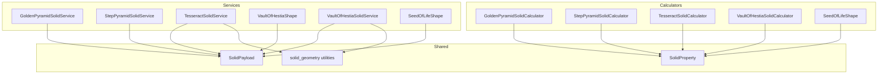
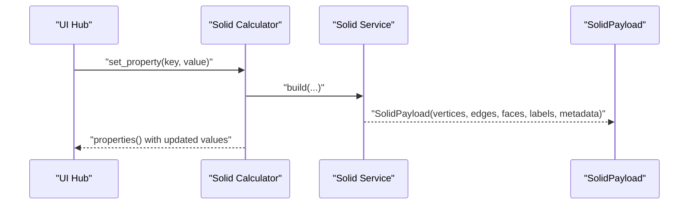
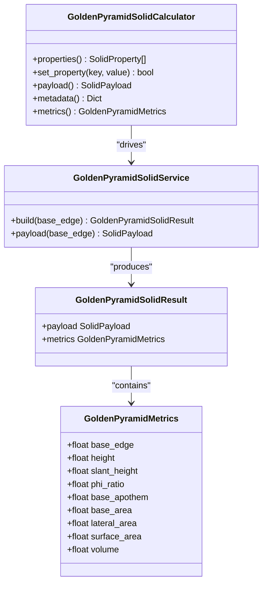
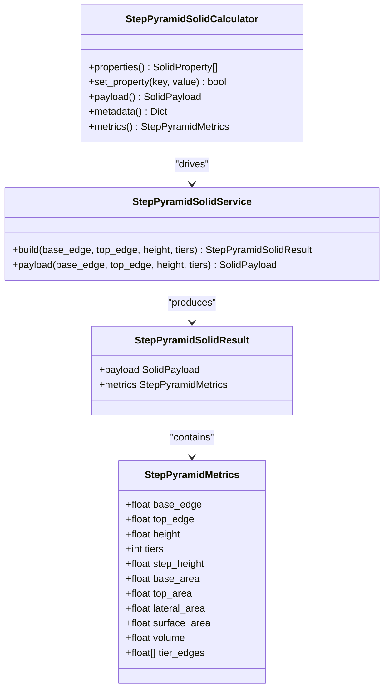
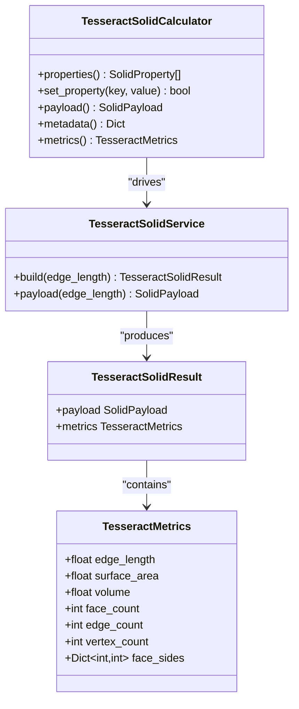
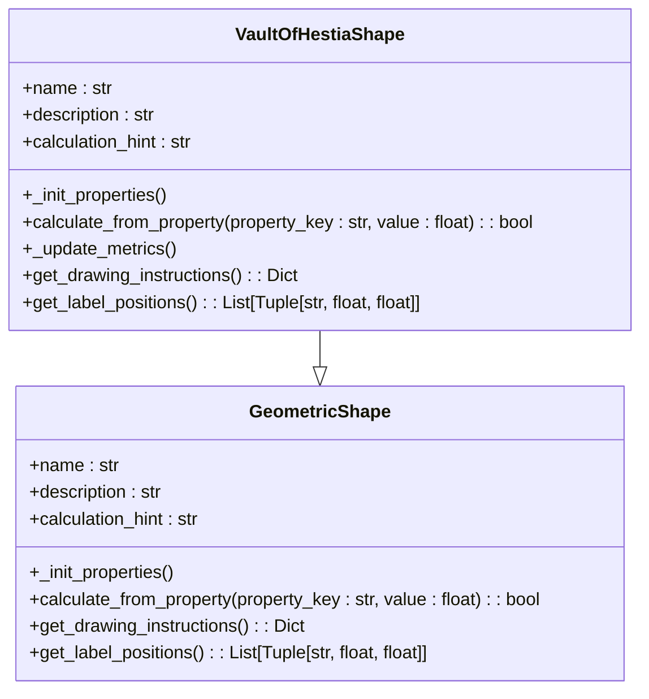
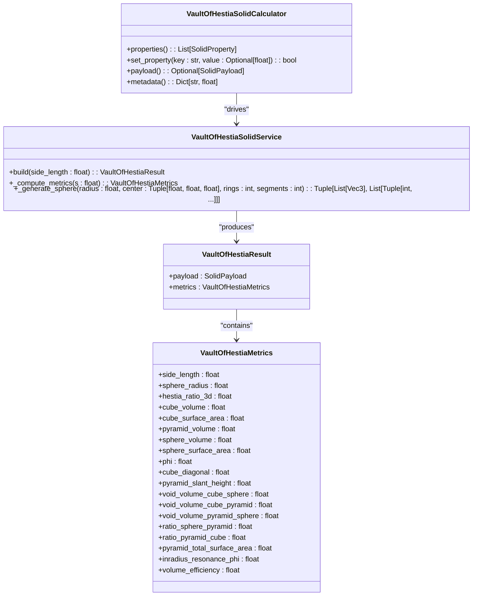
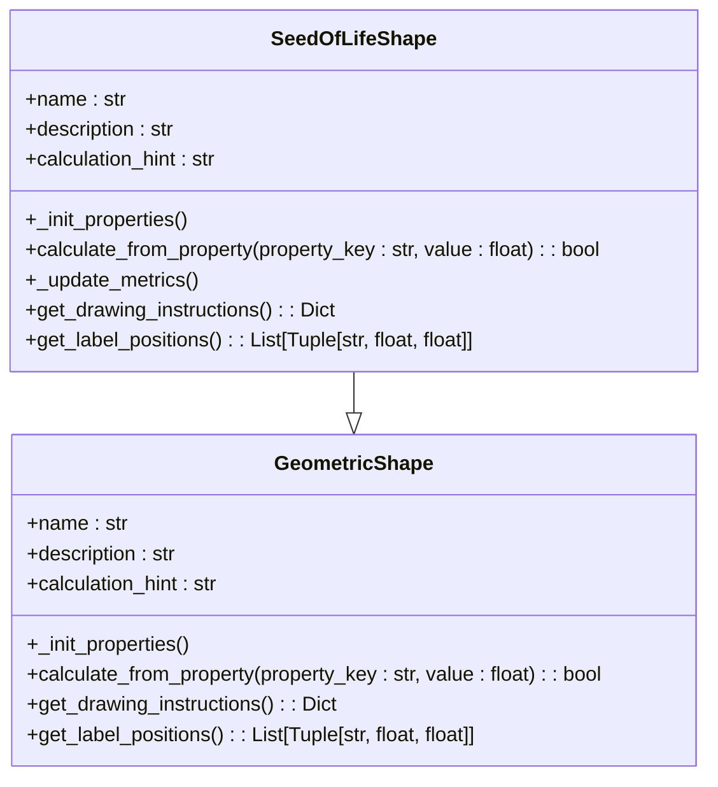
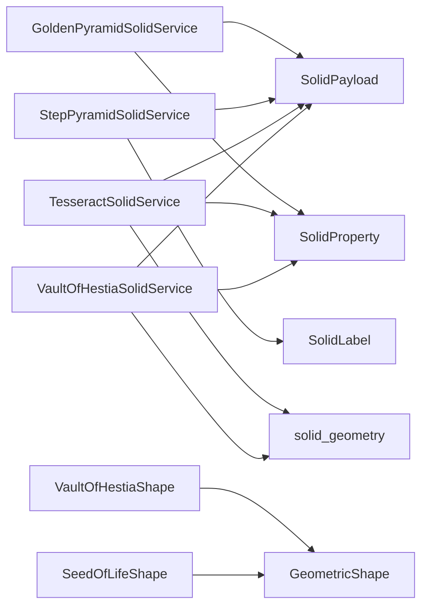

# Sacred Geometry Constructs API

<cite>
**Referenced Files in This Document**
- [golden_pyramid_solid.py](file://src/pillars/geometry/services/golden_pyramid_solid.py)
- [step_pyramid_solid.py](file://src/pillars/geometry/services/step_pyramid_solid.py)
- [tesseract_solid.py](file://src/pillars/geometry/services/tesseract_solid.py)
- [solid_geometry.py](file://src/pillars/geometry/services/solid_geometry.py)
- [solid_payload.py](file://src/pillars/geometry/shared/solid_payload.py)
- [solid_property.py](file://src/pillars/geometry/services/solid_property.py)
- [geometry_hub.py](file://src/pillars/geometry/ui/geometry_hub.py)
- [test_tesseract_solid.py](file://tests/test_tesseract_solid.py)
- [test_sacred_pyramids.py](file://tests/test_sacred_pyramids.py)
- [vault_of_hestia_shape.py](file://src/pillars/geometry/services/vault_of_hestia_shape.py)
- [vault_of_hestia_solid.py](file://src/pillars/geometry/services/vault_of_hestia_solid.py)
- [seed_of_life_shape.py](file://src/pillars/geometry/services/seed_of_life_shape.py)
- [vesica_piscis_shape.py](file://src/pillars/geometry/services/vesica_piscis_shape.py)
- [geometry_definitions.py](file://src/pillars/geometry/ui/geometry_definitions.py)
</cite>

## Update Summary
**Changes Made**
- Added comprehensive documentation for the Vault of Hestia sacred geometry construct, including 2D and 3D implementations
- Added comprehensive documentation for the Seed of Life sacred geometry construct
- Updated the Table of Contents to include new sections
- Added new sections for Vault of Hestia (2D), Vault of Hestia (3D), and Seed of Life
- Updated project structure diagram to include new components
- Added new architectural diagrams for the new constructs
- Updated core components list to include new services and calculators
- Added integration details for the new shapes in the UI hub

## Table of Contents
1. [Introduction](#introduction)
2. [Project Structure](#project-structure)
3. [Core Components](#core-components)
4. [Architecture Overview](#architecture-overview)
5. [Detailed Component Analysis](#detailed-component-analysis)
6. [Dependency Analysis](#dependency-analysis)
7. [Performance Considerations](#performance-considerations)
8. [Troubleshooting Guide](#troubleshooting-guide)
9. [Conclusion](#conclusion)
10. [Appendices](#appendices)

## Introduction
This document specifies the API for sacred geometry constructs, including:
- GoldenPyramidSolid: phi-proportioned square pyramid with base-to-height ratios, face angles, and energetic proportioning.
- StepPyramidSolid: ziggurat-style stepped pyramid with configurable tiers, setbacks, and alignment properties.
- TesseractSolid: 4D hypercube representation with 3D Schlegel projection, wireframe visualization, and scaling controls.
- VaultOfHestiaShape: 2D sacred geometry of a square containing an inscribed isosceles triangle and incircle, generating the golden ratio.
- VaultOfHestiaSolid: 3D solid representation of a cube containing a pyramid containing a sphere, with golden ratio relationships.
- SeedOfLifeShape: 2D pattern of seven circles arranged in hexagonal symmetry, representing the pattern of creation.

It covers mathematical foundations, projection methods, rendering parameters, and practical usage patterns. It also addresses floating-point precision in golden ratio calculations and performance considerations for 4D transformations.

## Project Structure
The geometry subsystem organizes solids as services and calculators that produce SolidPayload objects consumed by viewers and UI hubs. Shared utilities provide vector math and mesh construction helpers. The system has been extended to include new sacred geometry forms.

**Diagram sources**
- [golden_pyramid_solid.py](file://src/pillars/geometry/services/golden_pyramid_solid.py#L67-L119)
- [step_pyramid_solid.py](file://src/pillars/geometry/services/step_pyramid_solid.py#L152-L164)
- [tesseract_solid.py](file://src/pillars/geometry/services/tesseract_solid.py#L85-L134)
- [vault_of_hestia_shape.py](file://src/pillars/geometry/services/vault_of_hestia_shape.py#L8-L45)
- [vault_of_hestia_solid.py](file://src/pillars/geometry/services/vault_of_hestia_solid.py#L50-L84)
- [seed_of_life_shape.py](file://src/pillars/geometry/services/seed_of_life_shape.py#L8-L11)
- [solid_payload.py](file://src/pillars/geometry/shared/solid_payload.py#L12-L52)
- [solid_geometry.py](file://src/pillars/geometry/services/solid_geometry.py#L11-L156)
- [solid_property.py](file://src/pillars/geometry/services/solid_property.py#L8-L21)

**Section sources**
- [golden_pyramid_solid.py](file://src/pillars/geometry/services/golden_pyramid_solid.py#L1-L212)
- [step_pyramid_solid.py](file://src/pillars/geometry/services/step_pyramid_solid.py#L1-L268)
- [tesseract_solid.py](file://src/pillars/geometry/services/tesseract_solid.py#L1-L220)
- [vault_of_hestia_shape.py](file://src/pillars/geometry/services/vault_of_hestia_shape.py#L1-L425)
- [vault_of_hestia_solid.py](file://src/pillars/geometry/services/vault_of_hestia_solid.py#L1-L459)
- [seed_of_life_shape.py](file://src/pillars/geometry/services/seed_of_life_shape.py#L1-L262)
- [solid_payload.py](file://src/pillars/geometry/shared/solid_payload.py#L1-L52)
- [solid_geometry.py](file://src/pillars/geometry/services/solid_geometry.py#L1-L156)
- [solid_property.py](file://src/pillars/geometry/services/solid_property.py#L1-L21)

## Core Components
- GoldenPyramidSolidService: Builds a square pyramid aligned to the golden ratio with base edge, height, slant height, and volume computed from the golden ratio.
- GoldenPyramidSolidCalculator: Exposes editable properties and computes derived metrics; accepts base_edge, height, slant_height, or volume to drive the model.
- StepPyramidSolidService: Builds a terraced stepped pyramid with configurable base_edge, top_edge, height, and tiers; computes lateral area, surface area, and volume.
- StepPyramidSolidCalculator: Exposes editable properties and validates constraints; accepts base_edge, top_edge, height, or tiers.
- TesseractSolidService: Builds a Schlegel projection of a tesseract (hypercube) with paired shells and connectors; computes surface area and volume.
- TesseractSolidCalculator: Controls edge_length, surface_area, or volume; scales the model while preserving topology.
- VaultOfHestiaShape: 2D sacred geometry service that generates a square containing an inscribed isosceles triangle and incircle, with golden ratio relationships.
- VaultOfHestiaSolidService: 3D solid service that generates a cube containing a pyramid containing a sphere, with golden ratio relationships.
- VaultOfHestiaSolidCalculator: Bidirectional calculator for the 3D Vault of Hestia, allowing calculation from multiple input parameters.
- SeedOfLifeShape: 2D sacred geometry service that generates seven circles arranged in hexagonal symmetry, representing the pattern of creation.
- SolidPayload: Standardized mesh container with vertices, edges, faces, labels, metadata, and suggested_scale.
- SolidProperty: Describes a metric exposed by calculators with name, key, unit, value, precision, and editability.
- solid_geometry utilities: Vector math, polygon area, face normal, surface area, volume, edges extraction, face centroid, angle around axis.

**Section sources**
- [golden_pyramid_solid.py](file://src/pillars/geometry/services/golden_pyramid_solid.py#L67-L211)
- [step_pyramid_solid.py](file://src/pillars/geometry/services/step_pyramid_solid.py#L152-L268)
- [tesseract_solid.py](file://src/pillars/geometry/services/tesseract_solid.py#L85-L220)
- [vault_of_hestia_shape.py](file://src/pillars/geometry/services/vault_of_hestia_shape.py#L8-L425)
- [vault_of_hestia_solid.py](file://src/pillars/geometry/services/vault_of_hestia_solid.py#L50-L459)
- [seed_of_life_shape.py](file://src/pillars/geometry/services/seed_of_life_shape.py#L8-L262)
- [solid_payload.py](file://src/pillars/geometry/shared/solid_payload.py#L12-L52)
- [solid_property.py](file://src/pillars/geometry/services/solid_property.py#L8-L21)
- [solid_geometry.py](file://src/pillars/geometry/services/solid_geometry.py#L11-L156)

## Architecture Overview
The API follows a clean separation of concerns:
- Services construct SolidPayload meshes from parameters.
- Calculators manage editable properties and derive metrics.
- Utilities provide reusable math helpers.
- UI integrates solids via a hub configuration.

**Diagram sources**
- [geometry_hub.py](file://src/pillars/geometry/ui/geometry_hub.py#L874-L879)
- [golden_pyramid_solid.py](file://src/pillars/geometry/services/golden_pyramid_solid.py#L116-L144)
- [step_pyramid_solid.py](file://src/pillars/geometry/services/step_pyramid_solid.py#L162-L193)
- [tesseract_solid.py](file://src/pillars/geometry/services/tesseract_solid.py#L132-L161)
- [vault_of_hestia_solid.py](file://src/pillars/geometry/services/vault_of_hestia_solid.py#L59-L221)
- [seed_of_life_shape.py](file://src/pillars/geometry/services/seed_of_life_shape.py#L117-L161)

## Detailed Component Analysis

### GoldenPyramidSolid
- Mathematical foundation:
  - Golden ratio φ = (1 + √5)/2.
  - Base edge determines height via a derived factor based on φ.
  - Slant height equals φ × (base_edge/2).
  - Surface area and volume computed from base area, lateral area, and height.
- API:
  - build(base_edge): returns SolidPayload and GoldenPyramidMetrics.
  - payload(base_edge): convenience to get SolidPayload.
  - GoldenPyramidSolidCalculator exposes:
    - Properties: base_edge, height, slant_height, phi_ratio, base_apothem, base_area, lateral_area, surface_area, volume.
    - set_property accepts base_edge, height, slant_height, or volume.
- Rendering parameters:
  - Vertices define a square base centered at z = ±h/2 and an apex at z = h/2.
  - Edges connect base corners to apex and outline base.
  - Faces include base and four triangular sides.
  - Labels annotate base edge, height, and φ.
  - suggested_scale set to base_edge.

**Diagram sources**
- [golden_pyramid_solid.py](file://src/pillars/geometry/services/golden_pyramid_solid.py#L67-L211)

**Section sources**
- [golden_pyramid_solid.py](file://src/pillars/geometry/services/golden_pyramid_solid.py#L11-L45)
- [golden_pyramid_solid.py](file://src/pillars/geometry/services/golden_pyramid_solid.py#L67-L119)
- [golden_pyramid_solid.py](file://src/pillars/geometry/services/golden_pyramid_solid.py#L121-L211)
- [test_sacred_pyramids.py](file://tests/test_sacred_pyramids.py#L14-L36)

### StepPyramidSolid
- Mathematical foundation:
  - Interpolates edge sizes across tiers from base_edge to top_edge.
  - Computes step_height = height / tiers.
  - Lateral area sums contributions from each tier’s perimeter.
  - Volume sums squared edge sizes weighted by step_height.
- API:
  - build(base_edge, top_edge, height, tiers): returns SolidPayload and StepPyramidMetrics.
  - payload(base_edge, top_edge, height, tiers): convenience to get SolidPayload.
  - StepPyramidSolidCalculator exposes:
    - Properties: base_edge, top_edge, height, tiers, step_height, base_area, top_area, lateral_area, surface_area, volume.
    - set_property accepts base_edge, top_edge (with constraint), height, or tiers.
- Rendering parameters:
  - Vertices placed on stacked squares at z-levels determined by step_height.
  - Edges connect base corners to apex and connect adjacent corners vertically.
  - Faces include bottom base, top cap, and four trapezoidal lateral faces per tier.
  - Labels annotate base edge, top edge, and tier count.
  - suggested_scale set to max(base_edge, height).

**Diagram sources**
- [step_pyramid_solid.py](file://src/pillars/geometry/services/step_pyramid_solid.py#L152-L268)

**Section sources**
- [step_pyramid_solid.py](file://src/pillars/geometry/services/step_pyramid_solid.py#L119-L164)
- [step_pyramid_solid.py](file://src/pillars/geometry/services/step_pyramid_solid.py#L166-L268)

### TesseractSolid
- Mathematical foundation:
  - A tesseract is a 4D cube with 16 vertices, 32 edges, and 24 square faces.
  - The implementation builds two cubes (outer and inner) and connects corresponding vertices to form 12 connecting square faces.
  - Schlegel projection flattens the 4D structure into 3D by scaling and retaining face/edge connectivity.
  - Surface area and volume computed from the constructed mesh.
- API:
  - build(edge_length): returns SolidPayload and TesseractMetrics.
  - payload(edge_length): convenience to get SolidPayload.
  - TesseractSolidCalculator exposes:
    - Properties: edge_length, surface_area, volume, face_count, edge_count, vertex_count.
    - set_property accepts edge_length, surface_area, or volume; scaling preserves topology.
- Rendering parameters:
  - Vertices include outer and inner cubes with inner scaled to 0.5.
  - Faces include outer faces, inner faces, and connector faces linking outer to inner.
  - Labels annotate edge length.
  - suggested_scale set to edge_length.

**Diagram sources**
- [tesseract_solid.py](file://src/pillars/geometry/services/tesseract_solid.py#L85-L220)

**Section sources**
- [tesseract_solid.py](file://src/pillars/geometry/services/tesseract_solid.py#L19-L66)
- [tesseract_solid.py](file://src/pillars/geometry/services/tesseract_solid.py#L85-L134)
- [tesseract_solid.py](file://src/pillars/geometry/services/tesseract_solid.py#L136-L220)
- [test_tesseract_solid.py](file://tests/test_tesseract_solid.py#L9-L28)
- [test_tesseract_solid.py](file://tests/test_tesseract_solid.py#L30-L49)

### Vault of Hestia (2D)
- Mathematical foundation:
  - The Vault of Hestia is a square containing an inscribed isosceles triangle, which contains an incircle.
  - The semi-perimeter of the triangle is s * Phi, where s is the side length of the square.
  - The inradius of the circle is s / (2 * Phi).
  - The golden ratio φ = (1 + √5)/2 is central to the geometric relationships.
- API:
  - _init_properties(): initializes the shape's properties including side_length, triangle_leg, inradius, and derived metrics.
  - calculate_from_property(property_key, value): computes all other properties from a given property value.
  - _update_metrics(): recalculates all derived metrics based on the current side length.
  - get_drawing_instructions(): returns drawing primitives for rendering the shape.
  - get_label_positions(): returns positions for labels in the viewport.
- Rendering parameters:
  - The square is centered at (0,0) with vertices at (±s/2, ±s/2).
  - The isosceles triangle has its base at the bottom of the square and apex at the top center.
  - The incircle is tangent to the base of the triangle and centered at (0, -s/2 + r).
  - Drawing uses blue for the square, orange for the triangle, and teal for the circle.
  - Labels annotate the side length (s), radius (r), and Hestia ratio.

**Diagram sources**
- [vault_of_hestia_shape.py](file://src/pillars/geometry/services/vault_of_hestia_shape.py#L8-L425)

**Section sources**
- [vault_of_hestia_shape.py](file://src/pillars/geometry/services/vault_of_hestia_shape.py#L8-L425)
- [vesica_piscis_shape.py](file://src/pillars/geometry/services/vesica_piscis_shape.py#L7-L262)

### Vault of Hestia (3D)
- Mathematical foundation:
  - The 3D Vault of Hestia consists of a cube containing a pyramid containing a sphere.
  - The side length of the cube (s) relates to the sphere radius (r) by r = s / (2*phi).
  - The pyramid has a square base matching the cube's bottom and an apex at the cube's top center.
  - The sphere rests on the base of the pyramid and is tangent to the sides.
- API:
  - build(side_length): returns VaultOfHestiaResult containing SolidPayload and VaultOfHestiaMetrics.
  - _compute_metrics(s): calculates all geometric metrics from the side length.
  - _generate_sphere(radius, center, rings, segments): generates a UV sphere mesh.
  - VaultOfHestiaSolidCalculator provides bidirectional calculation from multiple input parameters.
- Rendering parameters:
  - The cube is defined by vertices at (±s/2, ±s/2, ±s/2).
  - The pyramid shares the cube's bottom face as its base and has its apex at (0, 0, s/2).
  - The sphere is centered at (0, 0, -s/2 + r) with radius r.
  - Colors: blue translucent for the cube, green translucent for the pyramid, red solid for the sphere.
  - Labels annotate the side length (s), radius (r), and "φ Generator".
  - suggested_scale set to s * 1.5.

**Diagram sources**
- [vault_of_hestia_solid.py](file://src/pillars/geometry/services/vault_of_hestia_solid.py#L50-L459)

**Section sources**
- [vault_of_hestia_solid.py](file://src/pillars/geometry/services/vault_of_hestia_solid.py#L50-L459)
- [verify_hestia_bidirectional.py](file://scripts/verify_hestia_bidirectional.py#L2-L37)
- [rite_of_hestia_3d.py](file://tests/rituals/rite_of_hestia_3d.py#L1-L43)

### Seed of Life
- Mathematical foundation:
  - The Seed of Life consists of seven circles arranged in hexagonal symmetry.
  - One central circle is surrounded by six circles, each tangent to the central circle and to two adjacent outer circles.
  - The centers of the outer circles are located at a distance of r (radius) from the center, at 60-degree intervals.
  - The total width of the pattern is 4r (from leftmost to rightmost point).
  - The vesica (lens-shaped intersection) between adjacent circles has specific area and height properties.
- API:
  - _init_properties(): initializes the shape's properties including radius, diameter, total_width, and derived metrics.
  - calculate_from_property(property_key, value): computes all other properties from a given property value.
  - _update_metrics(): recalculates all derived metrics based on the current radius.
  - get_drawing_instructions(): returns drawing primitives for rendering the shape.
  - get_label_positions(): returns positions for labels in the viewport.
- Rendering parameters:
  - The central circle is centered at (0,0) with radius r.
  - The six surrounding circles have centers at (r*cos(θ), r*sin(θ)) for θ = 0°, 60°, 120°, 180°, 240°, 300°.
  - Drawing uses gold/yellow for the central circle and cyan/blue for the surrounding circles.
  - Labels annotate the radius (r) on the central circle.
  - The pattern is symmetric with six-fold rotational symmetry.

**Diagram sources**
- [seed_of_life_shape.py](file://src/pillars/geometry/services/seed_of_life_shape.py#L8-L262)

**Section sources**
- [seed_of_life_shape.py](file://src/pillars/geometry/services/seed_of_life_shape.py#L8-L262)
- [geometry_definitions.py](file://src/pillars/geometry/ui/geometry_definitions.py#L7-L800)

### Projection Methods and Rendering Parameters
- GoldenPyramidSolid:
  - No 4D projection; standard 3D mesh with labeled dimensions.
- StepPyramidSolid:
  - No 4D projection; standard 3D mesh with labeled dimensions.
- TesseractSolid:
  - Schlegel projection: constructs a 3D representation by scaling vertices and computing derived metrics.
  - Wireframe visualization: edges and faces retained; labels indicate edge length.
- VaultOfHestiaSolid:
  - No 4D projection; standard 3D composite mesh with cube, pyramid, and sphere.
  - Uses face colors to differentiate components (blue cube, green pyramid, red sphere).
  - Labels indicate side length, radius, and "φ Generator".
- SeedOfLifeShape:
  - 2D rendering with colored circles and transparency.
  - Central circle in gold/yellow, surrounding circles in cyan/blue.
  - Labels indicate radius on the central circle.

**Section sources**
- [tesseract_solid.py](file://src/pillars/geometry/services/tesseract_solid.py#L85-L134)
- [vault_of_hestia_solid.py](file://src/pillars/geometry/services/vault_of_hestia_solid.py#L85-L220)
- [seed_of_life_shape.py](file://src/pillars/geometry/services/seed_of_life_shape.py#L196-L244)
- [solid_geometry.py](file://src/pillars/geometry/services/solid_geometry.py#L77-L107)

## Dependency Analysis
- Services depend on SolidPayload and SolidLabel for mesh assembly.
- GoldenPyramidSolidService depends on SolidProperty for calculator integration.
- TesseractSolidService depends on solid_geometry utilities for surface area and volume computation.
- VaultOfHestiaSolidService depends on solid_geometry utilities for mesh construction and metrics.
- VaultOfHestiaSolidService depends on SolidProperty for calculator integration.
- SeedOfLifeShape depends on GeometricShape for base functionality.
- VaultOfHestiaShape depends on GeometricShape for base functionality.
- Calculators depend on SolidProperty for property metadata and value management.

**Diagram sources**
- [golden_pyramid_solid.py](file://src/pillars/geometry/services/golden_pyramid_solid.py#L67-L119)
- [step_pyramid_solid.py](file://src/pillars/geometry/services/step_pyramid_solid.py#L152-L164)
- [tesseract_solid.py](file://src/pillars/geometry/services/tesseract_solid.py#L85-L134)
- [vault_of_hestia_solid.py](file://src/pillars/geometry/services/vault_of_hestia_solid.py#L50-L84)
- [vault_of_hestia_shape.py](file://src/pillars/geometry/services/vault_of_hestia_shape.py#L8-L45)
- [seed_of_life_shape.py](file://src/pillars/geometry/services/seed_of_life_shape.py#L8-L11)
- [solid_geometry.py](file://src/pillars/geometry/services/solid_geometry.py#L77-L107)
- [solid_property.py](file://src/pillars/geometry/services/solid_property.py#L8-L21)

**Section sources**
- [solid_payload.py](file://src/pillars/geometry/shared/solid_payload.py#L12-L52)
- [solid_property.py](file://src/pillars/geometry/services/solid_property.py#L8-L21)
- [solid_geometry.py](file://src/pillars/geometry/services/solid_geometry.py#L77-L107)
- [vault_of_hestia_solid.py](file://src/pillars/geometry/services/vault_of_hestia_solid.py#L224-L262)
- [vault_of_hestia_shape.py](file://src/pillars/geometry/services/vault_of_hestia_shape.py#L161-L250)

## Performance Considerations
- Floating-point precision in golden ratio calculations:
  - The golden ratio φ is computed from sqrt(5); repeated use of floating-point arithmetic can accumulate small errors. Prefer precomputed constants and consistent precision across calculations.
  - For high-volume rendering or repeated recalculations, cache intermediate factors (e.g., height factor) to avoid redundant sqrt and division operations.
- 4D transformations and projections:
  - Tesseract builds rely on vector math and mesh construction. For large-scale or frequent updates, reuse computed base metrics (e.g., base edge length, surface area, volume) to avoid recomputation.
  - When scaling, compute a single scale factor and apply to all vertices once rather than recalculating per metric.
- Mesh stability:
  - Ensure edges are deduplicated (as done by extracting edges from faces) to prevent redundant rendering work.
  - Use suggested_scale to normalize viewer zoom and reduce unnecessary rescaling.
- 3D composite meshes:
  - VaultOfHestiaSolid constructs a composite mesh of cube, pyramid, and sphere. For performance, consider optimizing the sphere mesh generation (UV sphere vs. icosphere).
  - The current implementation concatenates all vertices and faces into a single mesh, which is efficient for rendering but could be optimized for selective component visibility.
- 2D rendering:
  - SeedOfLifeShape and VaultOfHestiaShape use 2D drawing primitives. For large numbers of shapes, consider batch rendering or optimized path operations.

[No sources needed since this section provides general guidance]

## Troubleshooting Guide
- GoldenPyramidSolid:
  - Invalid base_edge raises an error; ensure positive values.
  - Derived metrics (height, slant_height, volume) are computed from base_edge and φ; verify expected ratios using tests.
- StepPyramidSolid:
  - top_edge must be less than base_edge; otherwise, dimension validation fails.
  - tiers must be positive; invalid inputs are rejected.
- TesseractSolid:
  - edge_length must be positive; otherwise, an error is raised.
  - Calculator scaling by surface_area or volume uses derived base metrics; ensure non-zero base values before scaling.
- VaultOfHestiaSolid:
  - side_length must be positive; otherwise, an error is raised.
  - The bidirectional calculator allows setting multiple properties (side_length, sphere_radius, cube_volume, etc.), but all derive from side_length.
  - Verify the golden ratio relationship: s / (2r) should equal φ.
- SeedOfLifeShape:
  - radius must be positive; otherwise, calculations fail.
  - The total_width should equal 4r; verify this relationship.
  - The vesica height should equal r * √3; verify this geometric property.

**Section sources**
- [golden_pyramid_solid.py](file://src/pillars/geometry/services/golden_pyramid_solid.py#L70-L75)
- [step_pyramid_solid.py](file://src/pillars/geometry/services/step_pyramid_solid.py#L90-L96)
- [tesseract_solid.py](file://src/pillars/geometry/services/tesseract_solid.py#L88-L92)
- [vault_of_hestia_solid.py](file://src/pillars/geometry/services/vault_of_hestia_solid.py#L69-L70)
- [seed_of_life_shape.py](file://src/pillars/geometry/services/seed_of_life_shape.py#L128-L129)
- [test_sacred_pyramids.py](file://tests/test_sacred_pyramids.py#L14-L36)
- [test_tesseract_solid.py](file://tests/test_tesseract_solid.py#L9-L28)

## Conclusion
The Sacred Geometry Constructs API provides robust, mathematically grounded builders and calculators for phi-proportioned pyramids, stepped ziggurats, 4D hypercubes, and new sacred geometry forms including the Vault of Hestia and Seed of Life. It emphasizes consistent labeling, standardized mesh payloads, and calculators that expose editable properties with derived metrics. Integration with the UI hub enables interactive exploration and educational visualization for meditation and study. The addition of the Vault of Hestia (in both 2D and 3D forms) and the Seed of Life expands the system's capabilities for exploring golden ratio relationships and creation patterns in sacred geometry.

[No sources needed since this section summarizes without analyzing specific files]

## Appendices

### API Reference Tables

- GoldenPyramidSolidService
  - Methods:
    - build(base_edge: float) -> GoldenPyramidSolidResult
    - payload(base_edge: float) -> SolidPayload
  - Output fields: vertices, edges, faces, labels, metadata, suggested_scale
  - Metadata keys: base_edge, height, slant_height, phi_ratio, base_apothem, base_area, lateral_area, surface_area, volume

- GoldenPyramidSolidCalculator
  - Properties:
    - base_edge, height, slant_height, phi_ratio, base_apothem, base_area, lateral_area, surface_area, volume
  - Methods:
    - properties() -> List[SolidProperty]
    - set_property(key: str, value: Optional[float]) -> bool
    - payload() -> Optional[SolidPayload]
    - metadata() -> Dict[str, float]
    - metrics() -> Optional[GoldenPyramidMetrics]

- StepPyramidSolidService
  - Methods:
    - build(base_edge: float, top_edge: float, height: float, tiers: int) -> StepPyramidSolidResult
    - payload(base_edge: float, top_edge: float, height: float, tiers: int) -> SolidPayload
  - Output fields: vertices, edges, faces, labels, metadata, suggested_scale
  - Metadata keys: base_edge, top_edge, height, tiers, step_height, base_area, top_area, lateral_area, surface_area, volume, tier_edges

- StepPyramidSolidCalculator
  - Properties:
    - base_edge, top_edge, height, tiers, step_height, base_area, top_area, lateral_area, surface_area, volume
  - Methods:
    - properties() -> List[SolidProperty]
    - set_property(key: str, value: Optional[float]) -> bool
    - payload() -> Optional[SolidPayload]
    - metadata() -> Dict[str, float]
    - metrics() -> Optional[StepPyramidMetrics]

- TesseractSolidService
  - Methods:
    - build(edge_length: float) -> TesseractSolidResult
    - payload(edge_length: float) -> SolidPayload
  - Output fields: vertices, edges, faces, labels, metadata, suggested_scale
  - Metadata keys: edge_length, surface_area, volume, face_count, edge_count, vertex_count, face_sides

- TesseractSolidCalculator
  - Properties:
    - edge_length, surface_area, volume, face_count, edge_count, vertex_count
  - Methods:
    - properties() -> List[SolidProperty]
    - set_property(key: str, value: float | None) -> bool
    - payload() -> SolidPayload | None
    - metadata() -> Dict[str, float]
    - metrics() -> TesseractMetrics | None

- VaultOfHestiaSolidService
  - Methods:
    - build(side_length: float) -> VaultOfHestiaResult
    - _compute_metrics(s: float) -> VaultOfHestiaMetrics
    - _generate_sphere(radius: float, center: Tuple[float, float, float], rings: int, segments: int) -> Tuple[List[Vec3], List[Tuple[int, ...]]]
  - Output fields: vertices, edges, faces, labels, face_colors, metadata, suggested_scale
  - Metadata keys: side_length, sphere_radius, hestia_ratio, cube_volume, sphere_volume, cube_diagonal, void_cube_sphere, void_pyramid_sphere, pyramid_tsa, inradius_resonance

- VaultOfHestiaSolidCalculator
  - Properties:
    - side_length, sphere_radius, cube_volume, cube_surface_area, pyramid_volume, sphere_volume, sphere_surface_area, hestia_ratio_3d, cube_diagonal, pyramid_slant, void_cube_sphere, void_pyr_sphere, pyramid_tsa, inradius_ratio, vol_efficiency, phi
  - Methods:
    - properties() -> List[SolidProperty]
    - set_property(key: str, value: float | None) -> bool
    - payload() -> SolidPayload | None
    - metadata() -> Dict[str, float]
    - _recalculate() -> None

- SeedOfLifeShape
  - Methods:
    - _init_properties() -> None
    - calculate_from_property(property_key: str, value: float) -> bool
    - _update_metrics() -> None
    - get_drawing_instructions() -> Dict
    - get_label_positions() -> List[Tuple[str, float, float]]
  - Properties:
    - radius, diameter, total_width, circle_area, total_area, circle_circumference, vesica_height, vesica_area, flower_area, flower_perimeter, outer_perimeter, enclosing_circle_area
  - Drawing primitives: central circle (gold), six surrounding circles (cyan), labels for radius

- VaultOfHestiaShape
  - Methods:
    - _init_properties() -> None
    - calculate_from_property(property_key: str, value: float) -> bool
    - _update_metrics() -> None
    - get_drawing_instructions() -> Dict
    - get_label_positions() -> List[Tuple[str, float, float]]
  - Properties:
    - side_length, triangle_leg, inradius, phi_check, triangle_area, circle_area, hestia_ratio, triangle_perimeter, triangle_semi_perimeter, circumradius, square_diagonal, base_angle, void_area, circle_diameter, circle_circumference, square_area, area_sq_minus_tri, area_tri_minus_circ
  - Drawing primitives: square (blue), triangle (orange), circle (teal), labels for s, r, and ratio

**Section sources**
- [golden_pyramid_solid.py](file://src/pillars/geometry/services/golden_pyramid_solid.py#L67-L211)
- [step_pyramid_solid.py](file://src/pillars/geometry/services/step_pyramid_solid.py#L152-L268)
- [tesseract_solid.py](file://src/pillars/geometry/services/tesseract_solid.py#L85-L220)
- [vault_of_hestia_solid.py](file://src/pillars/geometry/services/vault_of_hestia_solid.py#L50-L459)
- [seed_of_life_shape.py](file://src/pillars/geometry/services/seed_of_life_shape.py#L8-L262)
- [vault_of_hestia_shape.py](file://src/pillars/geometry/services/vault_of_hestia_shape.py#L8-L425)

### Integration with UI and Educational Workflows
- UI Hub integration:
  - The geometry hub registers entries for Golden Pyramid and Step Pyramid, enabling selection and interactive editing.
  - Tesseract is registered under a "Hypercube" category with a summary indicating Schlegel projection.
  - Vault of Hestia (2D) is registered under the "Sacred Geometry" category with a summary describing the square-triangle-circle generator of Phi.
  - Vault of Hestia (3D) is registered as a solid viewer with the solid_id 'vault_of_hestia_3d'.
  - Seed of Life is registered under the "Sacred Geometry" category with a summary describing the seven circles in hexagonal symmetry.
- Symbolic interpretations and visualization:
  - GoldenPyramidSolid labels include base edge, height, and φ, supporting meditative contemplation of sacred proportions.
  - StepPyramidSolid labels include base edge, top edge, and tier count, aiding visualization of stepped ascent.
  - Tesseract labels include edge length, supporting dimensional awareness exercises.
  - VaultOfHestiaShape labels include side length (s), radius (r), and Hestia ratio, supporting contemplation of golden ratio generation.
  - VaultOfHestiaSolid labels include side length (s), radius (r), and "φ Generator", supporting 3D visualization of sacred proportions.
  - SeedOfLifeShape labels include radius (r), supporting contemplation of creation patterns.

**Section sources**
- [geometry_hub.py](file://src/pillars/geometry/ui/geometry_hub.py#L874-L879)
- [geometry_hub.py](file://src/pillars/geometry/ui/geometry_hub.py#L828-L841)
- [geometry_definitions.py](file://src/pillars/geometry/ui/geometry_definitions.py#L284-L307)