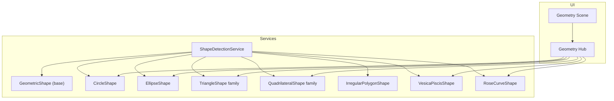
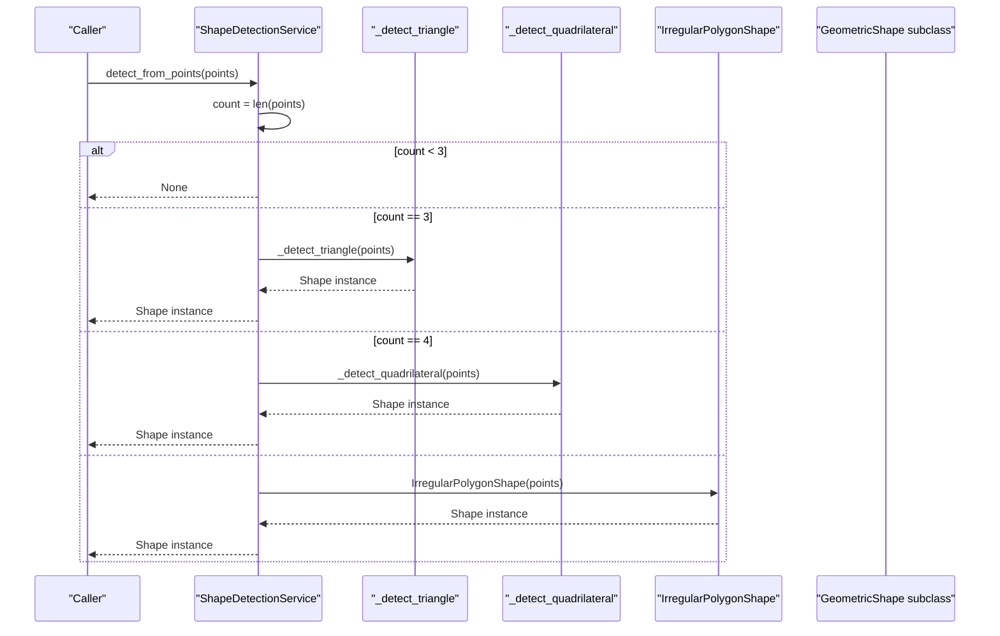
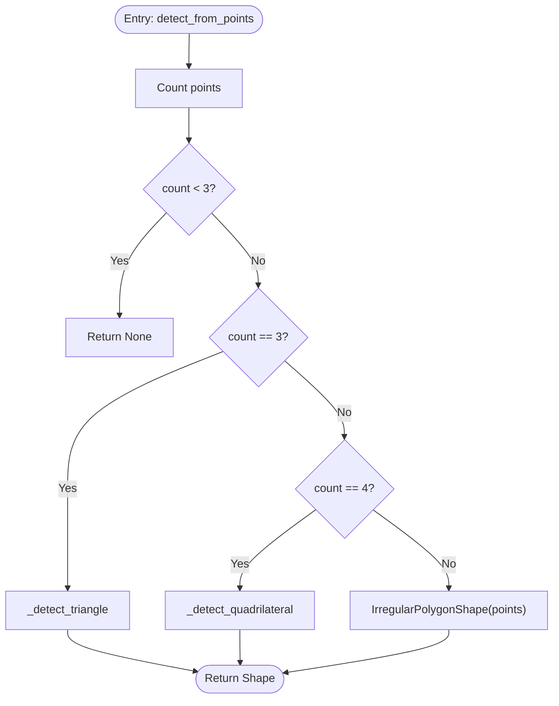
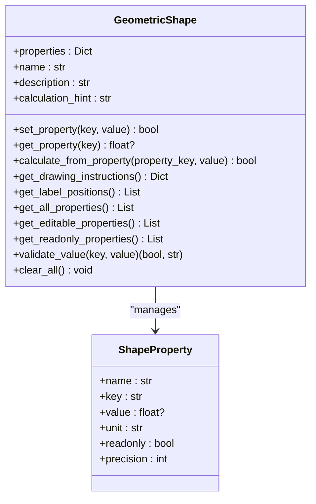
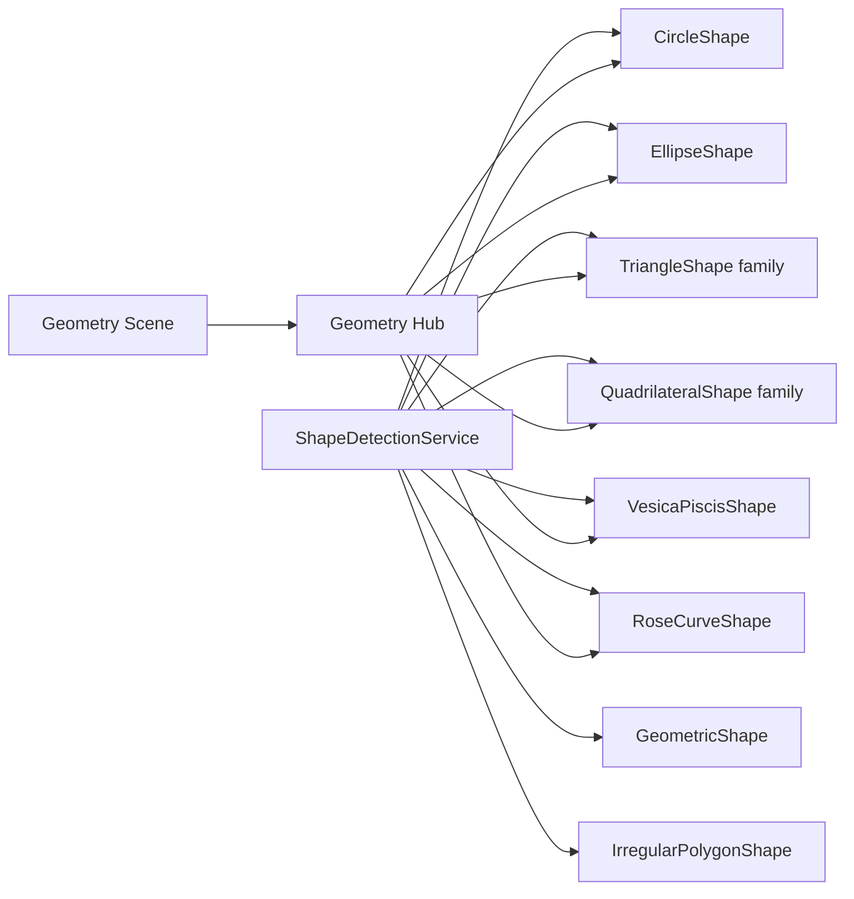

# Shape Detection API

<cite>
**Referenced Files in This Document**
- [shape_detection_service.py](file://src/pillars/geometry/services/shape_detection_service.py)
- [base_shape.py](file://src/pillars/geometry/services/base_shape.py)
- [circle_shape.py](file://src/pillars/geometry/services/circle_shape.py)
- [ellipse_shape.py](file://src/pillars/geometry/services/ellipse_shape.py)
- [triangle_shape.py](file://src/pillars/geometry/services/triangle_shape.py)
- [quadrilateral_shape.py](file://src/pillars/geometry/services/quadrilateral_shape.py)
- [irregular_polygon_shape.py](file://src/pillars/geometry/services/irregular_polygon_shape.py)
- [vesica_piscis_shape.py](file://src/pillars/geometry/services/vesica_piscis_shape.py)
- [rose_curve_shape.py](file://src/pillars/geometry/services/rose_curve_shape.py)
- [geometry_hub.py](file://src/pillars/geometry/ui/geometry_hub.py)
- [geometry_scene.py](file://src/pillars/geometry/ui/geometry_scene.py)
</cite>

## Table of Contents
1. [Introduction](#introduction)
2. [Project Structure](#project-structure)
3. [Core Components](#core-components)
4. [Architecture Overview](#architecture-overview)
5. [Detailed Component Analysis](#detailed-component-analysis)
6. [Dependency Analysis](#dependency-analysis)
7. [Performance Considerations](#performance-considerations)
8. [Troubleshooting Guide](#troubleshooting-guide)
9. [Conclusion](#conclusion)
10. [Appendices](#appendices)

## Introduction
This document specifies the Shape Detection API for automated recognition of geometric patterns in coordinate sets or point clouds. It focuses on the ShapeDetectionService and related geometric shape calculators that implement detection and classification for circles, ellipses, polygons, and sacred geometry motifs (e.g., vesica piscis, rose curves). The API emphasizes:
- Detection from point data using geometric tests and thresholds
- Classification into specific shape families and subclasses
- Confidence scoring via tolerance thresholds and validation rules
- Methods for batch detection and false-positive filtering
- Practical usage for user-drawn sketches and imported coordinate data
- Computational complexity, noise resilience, and real-time integration guidance

## Project Structure
The Shape Detection API is implemented within the geometry pillar. The primary entry point for detection is the ShapeDetectionService, which delegates to specialized shape calculators that implement the GeometricShape interface. UI components integrate detection results into interactive scenes and shape hubs.

**Diagram sources**
- [shape_detection_service.py](file://src/pillars/geometry/services/shape_detection_service.py#L1-L158)
- [base_shape.py](file://src/pillars/geometry/services/base_shape.py#L1-L143)
- [circle_shape.py](file://src/pillars/geometry/services/circle_shape.py#L1-L234)
- [ellipse_shape.py](file://src/pillars/geometry/services/ellipse_shape.py#L1-L200)
- [triangle_shape.py](file://src/pillars/geometry/services/triangle_shape.py#L1-L800)
- [quadrilateral_shape.py](file://src/pillars/geometry/services/quadrilateral_shape.py#L1-L800)
- [irregular_polygon_shape.py](file://src/pillars/geometry/services/irregular_polygon_shape.py#L1-L147)
- [vesica_piscis_shape.py](file://src/pillars/geometry/services/vesica_piscis_shape.py#L1-L21)
- [rose_curve_shape.py](file://src/pillars/geometry/services/rose_curve_shape.py#L1-L21)
- [geometry_hub.py](file://src/pillars/geometry/ui/geometry_hub.py#L150-L349)
- [geometry_scene.py](file://src/pillars/geometry/ui/geometry_scene.py#L1-L200)

**Section sources**
- [shape_detection_service.py](file://src/pillars/geometry/services/shape_detection_service.py#L1-L158)
- [geometry_hub.py](file://src/pillars/geometry/ui/geometry_hub.py#L150-L349)

## Core Components
- ShapeDetectionService: Detects and initializes geometric shapes from a set of 2D points. It performs:
  - Minimum point count checks
  - Triangle classification (equilateral, isosceles, right, scalene)
  - Quadrilateral classification (square, rectangle, rhombus, parallelogram)
  - Irregular polygon fallback for higher-order polygons
- GeometricShape: Abstract base class defining the shape contract, including property management, validation, and drawing instructions.
- Specialized shape calculators: Implement shape-specific solvers and property reconciliation (e.g., CircleShape, EllipseShape, TriangleShape variants, QuadrilateralShape variants, IrregularPolygonShape, VesicaPiscisShape, RoseCurveShape).

Key configuration parameters exposed by shape calculators:
- Relative tolerance thresholds for equality checks (e.g., side equality, right-angle checks)
- Minimum point counts for detection
- Validation rules for geometric feasibility (e.g., triangle inequality, angle bounds)
- Confidence scoring via validation flags and tolerance-based decisions

**Section sources**
- [shape_detection_service.py](file://src/pillars/geometry/services/shape_detection_service.py#L21-L158)
- [base_shape.py](file://src/pillars/geometry/services/base_shape.py#L1-L143)
- [triangle_shape.py](file://src/pillars/geometry/services/triangle_shape.py#L1-L800)
- [quadrilateral_shape.py](file://src/pillars/geometry/services/quadrilateral_shape.py#L1-L800)
- [irregular_polygon_shape.py](file://src/pillars/geometry/services/irregular_polygon_shape.py#L1-L147)

## Architecture Overview
The detection pipeline follows a deterministic classification strategy:
- Input: list of 2D points
- Validation: minimum point count and basic geometric checks
- Classification: branch by point count and geometric tests
- Output: initialized GeometricShape instance with computed properties

**Diagram sources**
- [shape_detection_service.py](file://src/pillars/geometry/services/shape_detection_service.py#L21-L158)

## Detailed Component Analysis

### ShapeDetectionService
- Purpose: Central detector for 2D point sets into specific geometric shapes.
- Behavior:
  - Returns None for fewer than 3 points.
  - For 3 points: triangle classification using side-length comparisons and angle checks.
  - For 4 points: quadrilateral classification using side and diagonal equality tests.
  - For >4 points: constructs an IrregularPolygonShape.
- Configuration parameters:
  - Relative tolerance thresholds for equality checks (e.g., 1e-4 for side equality, 1e-3 for average-side equality).
  - Minimum point count: 3 for classification, 4 for quadrilateral-specific tests.
- Confidence scoring:
  - Deterministic classification based on tolerance thresholds and geometric validity checks.
  - No probabilistic scoring in the current implementation; confidence is implicit in the validity of detected tests.

**Diagram sources**
- [shape_detection_service.py](file://src/pillars/geometry/services/shape_detection_service.py#L21-L158)

**Section sources**
- [shape_detection_service.py](file://src/pillars/geometry/services/shape_detection_service.py#L21-L158)

### GeometricShape and ShapeProperty
- Purpose: Defines the shape contract and property lifecycle.
- Responsibilities:
  - Property initialization and validation
  - Setting properties and recalculating dependent values
  - Drawing instructions and label positioning
- Validation:
  - Positive-value enforcement for most geometric properties
  - Read-only vs editable property distinction

**Diagram sources**
- [base_shape.py](file://src/pillars/geometry/services/base_shape.py#L1-L143)

**Section sources**
- [base_shape.py](file://src/pillars/geometry/services/base_shape.py#L1-L143)

### CircleShape
- Properties: radius, diameter, circumference, area, central angle, arc length, chord length, sagitta, sector area, segment area.
- Calculation: bidirectional from any single property; chord-related properties require a known radius.
- Drawing: returns circle drawing instructions and label positions.

Configuration parameters:
- Precision for central angle display
- Validation enforces positive values

**Section sources**
- [circle_shape.py](file://src/pillars/geometry/services/circle_shape.py#L1-L234)

### EllipseShape
- Properties: semi-major axis, semi-minor axis, major axis, minor axis, area, perimeter (Ramanujan approximation), eccentricity, focal distance.
- Calculation: reconcile axes and compute dependents; supports entering either axes or major/minor axes.
- Drawing: generates polygonal approximation of ellipse and axis lines.

Configuration parameters:
- Eccentricity and perimeter approximations
- Validation ensures sensible axis ordering and positivity

**Section sources**
- [ellipse_shape.py](file://src/pillars/geometry/services/ellipse_shape.py#L1-L200)

### TriangleShape Family
- Supported subclasses: EquilateralTriangleShape, RightTriangleShape, IsoscelesTriangleShape, ScaleneTriangleShape, AcuteTriangleShape, ObtuseTriangleShape, HeronianTriangleShape, IsoscelesRightTriangleShape, ThirtySixtyNinetyTriangleShape, GoldenTriangleShape, TriangleSolverShape.
- Classification logic:
  - Equilateral: all sides equal (tolerance-based)
  - Isosceles: two sides equal; special-case right isosceles via hypotenuse-leg relationship
  - Right triangle: Pythagorean identity (tolerance-based)
  - Scalene: general triangle with SSS-derived metrics
  - Acute/Obtuse: angle-based validation
  - Heronian: integer sides and integer area
- Configuration parameters:
  - Relative tolerance thresholds for equality and Pythagorean checks
  - Triangle inequality validation

**Section sources**
- [triangle_shape.py](file://src/pillars/geometry/services/triangle_shape.py#L1-L800)

### QuadrilateralShape Family
- Supported subclasses: ParallelogramShape, RhombusShape, TrapezoidShape, IsoscelesTrapezoidShape, KiteShape, DeltoidShape, CyclicQuadrilateralShape, TangentialQuadrilateralShape, BicentricQuadrilateralShape, QuadrilateralSolverShape.
- Classification logic:
  - Square: equal sides and equal diagonals
  - Rectangle: opposite sides equal and equal diagonals
  - Rhombus: equal sides with diagonal reporting
  - Parallelogram: opposite sides equal and equal diagonals; angle/height derived when possible
  - Trapezoid: one pair of parallel sides with leg and height metrics
  - Isosceles trapezoid: equal legs with diagonal and base angle metrics
  - Kite/Deltoid: adjacent equal sides with diagonal and area computation
  - Cyclic/Tangential/Bicentric: specialized properties and validations
- Configuration parameters:
  - Relative tolerance thresholds for side and diagonal equality
  - Angle bounds and geometric feasibility checks

**Section sources**
- [quadrilateral_shape.py](file://src/pillars/geometry/services/quadrilateral_shape.py#L1-L800)

### IrregularPolygonShape
- Purpose: Arbitrary polygon with dynamic vertex editing and derived metrics.
- Features:
  - Dynamic vertex properties (v0_x, v0_y, ...)
  - Recalculation of area, perimeter, centroid
- Configuration parameters:
  - Minimum vertex count for valid polygon (3)
  - Perimeter computed from pairwise distances

**Section sources**
- [irregular_polygon_shape.py](file://src/pillars/geometry/services/irregular_polygon_shape.py#L1-L147)

### Sacred Geometry Motifs
- VesicaPiscisShape: Lens formed by two equal-radius circles; supports calculation from any single field.
- RoseCurveShape: Rhodonea curve defined by polar equation; supports calculation hints for harmonic inputs.

**Section sources**
- [vesica_piscis_shape.py](file://src/pillars/geometry/services/vesica_piscis_shape.py#L1-L21)
- [rose_curve_shape.py](file://src/pillars/geometry/services/rose_curve_shape.py#L1-L21)

### UI Integration
- Geometry Hub: Presents categories of shapes (Circles, Triangles, Quadrilaterals, Polygons) and links to shape factories.
- Geometry Scene: Renders primitives, derives bounds, and computes intersections for analysis.

**Section sources**
- [geometry_hub.py](file://src/pillars/geometry/ui/geometry_hub.py#L150-L349)
- [geometry_scene.py](file://src/pillars/geometry/ui/geometry_scene.py#L1-L200)

## Dependency Analysis
- Coupling:
  - ShapeDetectionService depends on shape calculators and the GeometricShape base.
  - Shape calculators depend on the GeometricShape base and ShapeProperty for property management.
- Cohesion:
  - Each shape calculator encapsulates its own property reconciliation and validation logic.
- External dependencies:
  - UI components (PyQt) are used for rendering and interaction; detection core is UI-agnostic.

**Diagram sources**
- [shape_detection_service.py](file://src/pillars/geometry/services/shape_detection_service.py#L1-L158)
- [geometry_hub.py](file://src/pillars/geometry/ui/geometry_hub.py#L150-L349)
- [geometry_scene.py](file://src/pillars/geometry/ui/geometry_scene.py#L1-L200)

**Section sources**
- [shape_detection_service.py](file://src/pillars/geometry/services/shape_detection_service.py#L1-L158)
- [geometry_hub.py](file://src/pillars/geometry/ui/geometry_hub.py#L150-L349)

## Performance Considerations
- Time complexity:
  - Triangle detection: O(1) comparisons and distance calculations
  - Quadrilateral detection: O(1) side and diagonal comparisons
  - Irregular polygon: O(n) perimeter and centroid computations
- Space complexity:
  - Minimal auxiliary memory; primarily storing computed properties
- Noise resilience:
  - Relative tolerance thresholds mitigate floating-point noise in equality checks
  - Validation rules (e.g., triangle inequality, angle bounds) reduce false positives
- Real-time integration:
  - Lightweight detection suitable for interactive UI updates
  - Consider batching detection for large point clouds to minimize UI thread contention

[No sources needed since this section provides general guidance]

## Troubleshooting Guide
Common issues and resolutions:
- Fewer than 3 points:
  - Symptom: None returned
  - Resolution: Provide at least 3 points for classification
- Degenerate triangles:
  - Symptom: Scalene classification despite near-equality
  - Resolution: Adjust tolerance thresholds or verify input point quality
- Quadrilateral ambiguity:
  - Symptom: Parallelogram classification without sufficient constraints
  - Resolution: Provide additional measurements (e.g., angle or height) to refine classification
- Ellipse/ellipse-like inputs:
  - Symptom: Misclassification as circle or polygon
  - Resolution: Use dedicated ellipse detection or increase point density for ellipse-like shapes
- Irregular polygon artifacts:
  - Symptom: Incorrect area/perimeter
  - Resolution: Ensure vertex ordering and closure; verify point count ≥ 3

**Section sources**
- [shape_detection_service.py](file://src/pillars/geometry/services/shape_detection_service.py#L21-L158)
- [triangle_shape.py](file://src/pillars/geometry/services/triangle_shape.py#L1-L800)
- [quadrilateral_shape.py](file://src/pillars/geometry/services/quadrilateral_shape.py#L1-L800)
- [irregular_polygon_shape.py](file://src/pillars/geometry/services/irregular_polygon_shape.py#L1-L147)

## Conclusion
The Shape Detection API provides a robust, deterministic classification pipeline for 2D point sets into geometric shapes. It leverages tolerance-based comparisons, validation rules, and specialized shape calculators to deliver reliable results. While the current implementation does not expose explicit probabilistic confidence scores, the use of tolerance thresholds and geometric feasibility checks implicitly reflects confidence. For batch processing and real-time applications, the lightweight nature of the detection core enables efficient integration with UI components and potential future extensions for probabilistic scoring.

## Appendices

### API Reference: ShapeDetectionService
- Method: detect_from_points(points)
  - Inputs: List[Tuple[float, float]]
  - Returns: Optional[GeometricShape]
  - Behavior: Classifies points into triangle, quadrilateral, or irregular polygon; returns None for <3 points

**Section sources**
- [shape_detection_service.py](file://src/pillars/geometry/services/shape_detection_service.py#L21-L158)

### Configuration Parameters Summary
- Tolerance thresholds:
  - Side equality: ~1e-3 to 1e-4 depending on shape
  - Pythagorean checks: ~1e-4
- Minimum point counts:
  - Triangle classification: 3
  - Quadrilateral classification: 4
- Validation:
  - Positive-value enforcement for geometric properties
  - Triangle inequality and angle bounds for triangles
  - Angle bounds and feasibility checks for quadrilaterals

**Section sources**
- [shape_detection_service.py](file://src/pillars/geometry/services/shape_detection_service.py#L21-L158)
- [triangle_shape.py](file://src/pillars/geometry/services/triangle_shape.py#L1-L800)
- [quadrilateral_shape.py](file://src/pillars/geometry/services/quadrilateral_shape.py#L1-L800)
- [base_shape.py](file://src/pillars/geometry/services/base_shape.py#L1-L143)

### Usage Examples
- User-drawn sketch:
  - Collect mouse clicks into a list of (x, y) points
  - Call detect_from_points(points)
  - Render the resulting shape via the UI hub and scene
- Imported coordinate data:
  - Load CSV/JSON into a list of points
  - Validate and filter outliers
  - Run detection and post-process results (e.g., labeling, filtering)
- Batch detection:
  - Iterate over multiple point sets
  - Aggregate results and apply false-positive filters based on shape-specific validations

**Section sources**
- [geometry_hub.py](file://src/pillars/geometry/ui/geometry_hub.py#L150-L349)
- [geometry_scene.py](file://src/pillars/geometry/ui/geometry_scene.py#L1-L200)