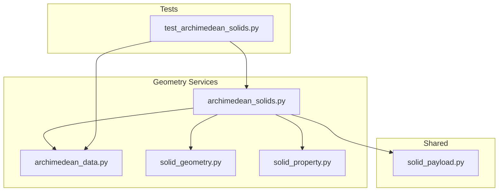
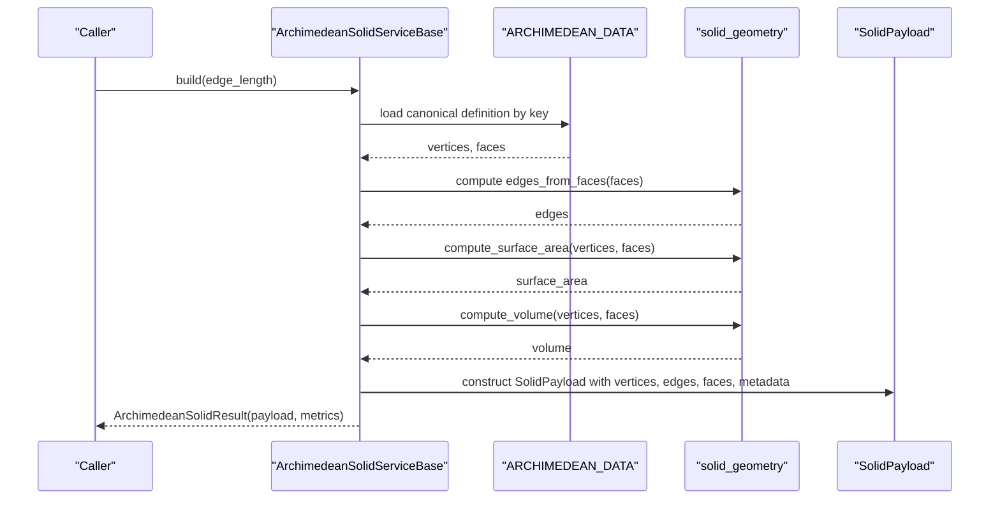
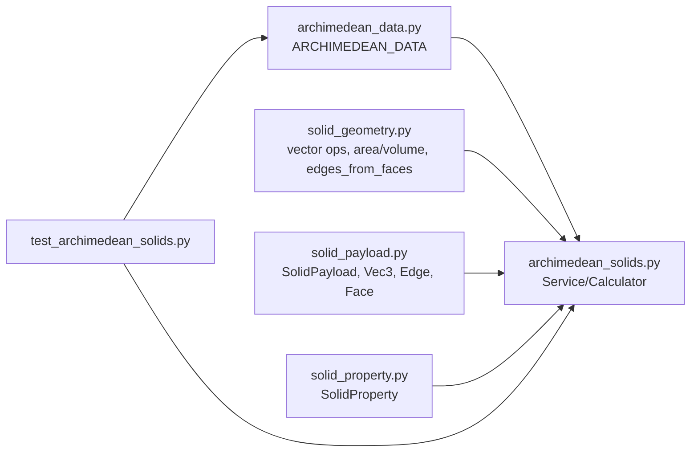

# Standard Archimedean Solids

<cite>
**Referenced Files in This Document**
- [archimedean_solids.py](file://src/pillars/geometry/services/archimedean_solids.py)
- [archimedean_data.py](file://src/pillars/geometry/services/archimedean_data.py)
- [solid_geometry.py](file://src/pillars/geometry/services/solid_geometry.py)
- [solid_payload.py](file://src/pillars/geometry/shared/solid_payload.py)
- [solid_property.py](file://src/pillars/geometry/services/solid_property.py)
- [test_archimedean_solids.py](file://test/test_archimedean_solids.py)
</cite>

## Table of Contents
1. [Introduction](#introduction)
2. [Project Structure](#project-structure)
3. [Core Components](#core-components)
4. [Architecture Overview](#architecture-overview)
5. [Detailed Component Analysis](#detailed-component-analysis)
6. [Dependency Analysis](#dependency-analysis)
7. [Performance Considerations](#performance-considerations)
8. [Troubleshooting Guide](#troubleshooting-guide)
9. [Conclusion](#conclusion)
10. [Appendices](#appendices)

## Introduction
This document describes the Standard Archimedean Solids service that generates the 13 classical Archimedean solids. It focuses on the ArchimedeanSolids class as the central interface for building solids, along with supporting services and calculators. The service provides:
- Construction of solids by canonical dataset key
- Uniform edge-length scaling and property-driven scaling (by surface area or volume)
- Accessors for vertex count, face counts by sides, edge and face counts, and suggested scale
- Extraction of face polygons (triangles, squares, pentagons, hexagons, octagons, decagons)
- Metadata and metrics for downstream visualization and analysis
- Numerical stability considerations for vertex positioning and adjacency computation

## Project Structure
The Archimedean solids are implemented in the geometry pillar under services, with shared data structures and geometry utilities.

**Diagram sources**
- [archimedean_solids.py](file://src/pillars/geometry/services/archimedean_solids.py#L1-L406)
- [archimedean_data.py](file://src/pillars/geometry/services/archimedean_data.py#L1-L1106)
- [solid_geometry.py](file://src/pillars/geometry/services/solid_geometry.py#L1-L156)
- [solid_payload.py](file://src/pillars/geometry/shared/solid_payload.py#L1-L52)
- [solid_property.py](file://src/pillars/geometry/services/solid_property.py#L1-L21)
- [test_archimedean_solids.py](file://test/test_archimedean_solids.py#L1-L99)

**Section sources**
- [archimedean_solids.py](file://src/pillars/geometry/services/archimedean_solids.py#L1-L406)
- [archimedean_data.py](file://src/pillars/geometry/services/archimedean_data.py#L1-L1106)
- [solid_geometry.py](file://src/pillars/geometry/services/solid_geometry.py#L1-L156)
- [solid_payload.py](file://src/pillars/geometry/shared/solid_payload.py#L1-L52)
- [solid_property.py](file://src/pillars/geometry/services/solid_property.py#L1-L21)
- [test_archimedean_solids.py](file://test/test_archimedean_solids.py#L1-L99)

## Core Components
- ArchimedeanSolidServiceBase: Base class for building solids with a uniform edge length. Provides build(edge_length) and payload(edge_length) methods.
- ArchimedeanSolidCalculatorBase: Calculator that manages SolidProperty instances and supports property-driven scaling (edge length, surface area, volume).
- ArchimedeanSolidDefinition: Canonical definition loaded from archimedean_data.py, including vertices, faces, edges, and derived base metrics.
- ArchimedeanSolidResult: Container for SolidPayload and ArchimedeanSolidMetrics.
- ArchimedeanSolidMetrics: Metrics container for edge length, surface area, volume, counts, and face-side distribution.

Key capabilities:
- Build a solid with a given edge length and receive a SolidPayload with vertices, edges, faces, labels, and metadata.
- Compute derived metrics (surface area, volume) and counts from the generated mesh.
- Scale solids uniformly or by property targets (area/volume), updating internal properties accordingly.

**Section sources**
- [archimedean_solids.py](file://src/pillars/geometry/services/archimedean_solids.py#L136-L184)
- [archimedean_solids.py](file://src/pillars/geometry/services/archimedean_solids.py#L190-L268)
- [archimedean_solids.py](file://src/pillars/geometry/services/archimedean_solids.py#L23-L52)
- [archimedean_solids.py](file://src/pillars/geometry/services/archimedean_solids.py#L185-L188)

## Architecture Overview
The system composes canonical datasets with geometry utilities to produce standardized Archimedean solids.

**Diagram sources**
- [archimedean_solids.py](file://src/pillars/geometry/services/archimedean_solids.py#L94-L128)
- [archimedean_solids.py](file://src/pillars/geometry/services/archimedean_solids.py#L136-L184)
- [solid_geometry.py](file://src/pillars/geometry/services/solid_geometry.py#L94-L107)
- [solid_geometry.py](file://src/pillars/geometry/services/solid_geometry.py#L77-L92)
- [solid_payload.py](file://src/pillars/geometry/shared/solid_payload.py#L19-L52)

## Detailed Component Analysis

### ArchimedeanSolidServiceBase
Responsibilities:
- Load canonical definition by key from ARCHIMEDEAN_DATA
- Derive edges from faces
- Compute base metrics (base edge length, surface area, volume)
- Scale canonical vertices to requested edge length
- Construct SolidPayload with metadata and labels

Key methods:
- build(edge_length): returns ArchimedeanSolidResult
- payload(edge_length): returns SolidPayload

Behavioral notes:
- Validates positive edge_length
- Caches definitions in memory for reuse
- Uses edges_from_faces to ensure consistent adjacency

**Section sources**
- [archimedean_solids.py](file://src/pillars/geometry/services/archimedean_solids.py#L94-L128)
- [archimedean_solids.py](file://src/pillars/geometry/services/archimedean_solids.py#L136-L184)
- [solid_geometry.py](file://src/pillars/geometry/services/solid_geometry.py#L94-L107)

### ArchimedeanSolidCalculatorBase
Responsibilities:
- Manage SolidProperty entries for edge_length, surface_area, volume, face_count, edge_count, vertex_count
- Apply scaling either by explicit edge_length or by target surface_area/volume
- Maintain last computed ArchimedeanSolidResult and update properties accordingly

Key methods:
- properties(): returns SolidProperty list
- set_property(key, value): scales solid to match target property
- payload(): returns current SolidPayload
- metadata(): returns current metadata dict
- metrics(): returns current ArchimedeanSolidMetrics

Scaling logic:
- Surface area scaling: scale = sqrt(value / base_surface_area); edge_length = base_edge_length * scale
- Volume scaling: scale = cbrt(value / base_volume); edge_length = base_edge_length * scale

**Section sources**
- [archimedean_solids.py](file://src/pillars/geometry/services/archimedean_solids.py#L190-L268)
- [solid_property.py](file://src/pillars/geometry/services/solid_property.py#L8-L21)

### ArchimedeanSolidDefinition and Metrics
- ArchimedeanSolidDefinition: stores canonical_vertices, faces, edges, base_edge_length, base_surface_area, base_volume, and face_sides
- ArchimedeanSolidMetrics: mirrors metrics for the scaled solid

Vertex ordering:
- Faces are ordered consistently using a deterministic process that orders face vertices around a centroid using cross products and atan2 angles.

**Section sources**
- [archimedean_solids.py](file://src/pillars/geometry/services/archimedean_solids.py#L23-L52)
- [archimedean_solids.py](file://src/pillars/geometry/services/archimedean_solids.py#L55-L92)

### SolidPayload and Shared Types
- Vec3, Edge, Face types define the mesh representation
- SolidPayload carries vertices, edges, faces, labels, metadata, and suggested_scale
- SolidLabel supports labeling with text and position

**Section sources**
- [solid_payload.py](file://src/pillars/geometry/shared/solid_payload.py#L1-L52)

### Geometry Utilities
- Vector ops: add, subtract, dot, cross, normalize, length
- Polygon area and face normal
- Surface area and volume computation
- Edges extraction from faces
- Face centroid and angle-around-axis helper

Numerical stability:
- Cross product used to detect non-degenerate normals
- Small tolerances in angle computation and normalization
- Edge extraction uses sorted vertex pairs to avoid duplicates

**Section sources**
- [solid_geometry.py](file://src/pillars/geometry/services/solid_geometry.py#L1-L156)

### Generated Solid Classes
The service defines a pair of classes per solid: a Service and a Calculator. Example classes include:
- CuboctahedronSolidService / CuboctahedronSolidCalculator
- TruncatedTetrahedronSolidService / TruncatedTetrahedronSolidCalculator
- TruncatedCubeSolidService / TruncatedCubeSolidCalculator
- TruncatedOctahedronSolidService / TruncatedOctahedronSolidCalculator
- RhombicuboctahedronSolidService / RhombicuboctahedronSolidCalculator
- RhombicosidodecahedronSolidService / RhombicosidodecahedronSolidCalculator
- TruncatedCuboctahedronSolidService / TruncatedCuboctahedronSolidCalculator
- IcosidodecahedronSolidService / IcosidodecahedronSolidCalculator
- TruncatedDodecahedronSolidService / TruncatedDodecahedronSolidCalculator
- TruncatedIcosahedronSolidService / TruncatedIcosahedronSolidCalculator
- TruncatedIcosidodecahedronSolidService / TruncatedIcosidodecahedronSolidCalculator
- SnubCubeSolidService / SnubCubeSolidCalculator
- SnubDodecahedronSolidService / SnubDodecahedronSolidCalculator

Each pair binds a canonical dataset key to the base service and calculator.

**Section sources**
- [archimedean_solids.py](file://src/pillars/geometry/services/archimedean_solids.py#L270-L405)

### API Reference

#### ArchimedeanSolidServiceBase
- build(edge_length: float = 2.0) -> ArchimedeanSolidResult
  - Builds a solid with the specified edge length
  - Raises ValueError if edge_length <= 0
- payload(edge_length: float = 2.0) -> SolidPayload
  - Convenience method returning SolidPayload from build

**Section sources**
- [archimedean_solids.py](file://src/pillars/geometry/services/archimedean_solids.py#L136-L184)
- [archimedean_solids.py](file://src/pillars/geometry/services/archimedean_solids.py#L185-L188)

#### ArchimedeanSolidCalculatorBase
- __init__(edge_length: float = 2.0)
- properties() -> List[SolidProperty]
- set_property(key: str, value: float | None) -> bool
  - Supported keys: "edge_length", "surface_area", "volume"
  - Returns True if successful, False otherwise
- payload() -> SolidPayload | None
- metadata() -> Dict[str, float]
- metrics() -> ArchimedeanSolidMetrics | None

**Section sources**
- [archimedean_solids.py](file://src/pillars/geometry/services/archimedean_solids.py#L190-L268)
- [solid_property.py](file://src/pillars/geometry/services/solid_property.py#L8-L21)

#### SolidPayload and Metrics
- SolidPayload: vertices, edges, faces, labels, metadata, suggested_scale
- ArchimedeanSolidMetrics: edge_length, surface_area, volume, face_count, edge_count, vertex_count, face_sides

**Section sources**
- [solid_payload.py](file://src/pillars/geometry/shared/solid_payload.py#L19-L52)
- [archimedean_solids.py](file://src/pillars/geometry/services/archimedean_solids.py#L23-L52)

### Methods for Generating Solids by Name or Vertex Configuration
- By name: Instantiate the appropriate SolidService or SolidCalculator class and call build or set_property
- By vertex configuration: Not supported as a direct API; solids are constructed from canonical datasets keyed by name

Supported solids (names and keys):
- Cuboctahedron
- Truncated Tetrahedron
- Truncated Cube
- Truncated Octahedron
- Rhombicuboctahedron
- Rhombicosidodecahedron
- Truncated Cuboctahedron
- Icosidodecahedron
- Truncated Dodecahedron
- Truncated Icosahedron (buckyball)
- Truncated Icosidodecahedron
- Snub Cube
- Snub Dodecahedron

**Section sources**
- [archimedean_data.py](file://src/pillars/geometry/services/archimedean_data.py#L1-L1106)
- [archimedean_solids.py](file://src/pillars/geometry/services/archimedean_solids.py#L270-L405)

### Accessors for Face Polygons, Counts, Symmetry Group, and Duals
- Face polygons: Extract from SolidPayload.faces; face_sides distribution available in metrics.face_sides
- Vertex count: metadata["vertex_count"]
- Edge count: metadata["edge_count"]
- Face count: metadata["face_count"]
- Symmetry group: Not explicitly exposed; however, canonical datasets are curated for Archimedean solids with octahedral or icosahedral symmetry
- Duals (Catalan solids): Not directly exposed; duals correspond to the duals of the Archimedean solids

Notes:
- Face-side counts are computed from the face lengths in the canonical dataset and preserved in metrics.face_sides
- The service does not expose a dedicated method to extract faces by type; downstream consumers can filter SolidPayload.faces by length

**Section sources**
- [archimedean_solids.py](file://src/pillars/geometry/services/archimedean_solids.py#L160-L173)
- [archimedean_solids.py](file://src/pillars/geometry/services/archimedean_solids.py#L174-L183)
- [archimedean_solids.py](file://src/pillars/geometry/services/archimedean_solids.py#L23-L52)

### Code Examples

#### Construct a truncated icosahedron with edge length 1.0 and extract its 12 pentagonal and 20 hexagonal faces
- Build the solid:
  - Use TruncatedIcosahedronSolidService.build(edge_length=1.0) or TruncatedIcosahedronSolidCalculator(edge_length=1.0).payload()
- Extract faces:
  - Iterate SolidPayload.faces and count by length; 5-gons represent pentagons, 6-gons represent hexagons
- Verify counts:
  - metadata["face_count"] equals 32
  - metrics.face_sides contains counts for 5 and 6

**Section sources**
- [archimedean_solids.py](file://src/pillars/geometry/services/archimedean_solids.py#L342-L348)
- [test_archimedean_solids.py](file://test/test_archimedean_solids.py#L38-L52)

### Numerical Stability and Floating-Point Tolerance
- Vertex ordering: Face vertices are ordered around a centroid using cross products and atan2; small tolerances prevent degeneracies
- Normalization: vec_normalize guards against zero-length vectors
- Edge extraction: Sorted pairs of vertex indices ensure consistent adjacency and avoid duplicates
- Angle computation: Special-case handling avoids near-zero cross products

**Section sources**
- [archimedean_solids.py](file://src/pillars/geometry/services/archimedean_solids.py#L55-L92)
- [solid_geometry.py](file://src/pillars/geometry/services/solid_geometry.py#L1-L156)

## Dependency Analysis

**Diagram sources**
- [archimedean_solids.py](file://src/pillars/geometry/services/archimedean_solids.py#L1-L406)
- [archimedean_data.py](file://src/pillars/geometry/services/archimedean_data.py#L1-L1106)
- [solid_geometry.py](file://src/pillars/geometry/services/solid_geometry.py#L1-L156)
- [solid_payload.py](file://src/pillars/geometry/shared/solid_payload.py#L1-L52)
- [solid_property.py](file://src/pillars/geometry/services/solid_property.py#L1-L21)
- [test_archimedean_solids.py](file://test/test_archimedean_solids.py#L1-L99)

**Section sources**
- [archimedean_solids.py](file://src/pillars/geometry/services/archimedean_solids.py#L1-L406)
- [archimedean_data.py](file://src/pillars/geometry/services/archimedean_data.py#L1-L1106)
- [solid_geometry.py](file://src/pillars/geometry/services/solid_geometry.py#L1-L156)
- [solid_payload.py](file://src/pillars/geometry/shared/solid_payload.py#L1-L52)
- [solid_property.py](file://src/pillars/geometry/services/solid_property.py#L1-L21)
- [test_archimedean_solids.py](file://test/test_archimedean_solids.py#L1-L99)

## Performance Considerations
- Definition caching: _DEF_CACHE reduces repeated dataset loading and recomputation
- Uniform scaling: Scaling canonical vertices is O(V) where V is vertex count
- Mesh generation: Computing edges_from_faces is O(F*S) where F is face count and S is average face size
- Metrics: Surface area and volume are computed by iterating faces; complexity proportional to total face indices

[No sources needed since this section provides general guidance]

## Troubleshooting Guide
Common issues and resolutions:
- Invalid edge length: build raises ValueError for non-positive values
- Missing dataset key: _definition_from_data raises KeyError for unknown keys
- No edges computed: _finalize_definition raises ValueError when edges_from_faces returns empty
- Property scaling failure: set_property returns False for invalid or non-positive values; ensure base surface_area/base_volume are positive for area/volume scaling

Validation and tests:
- Unit tests confirm that generated solids match dataset sizes and that property scaling yields expected results

**Section sources**
- [archimedean_solids.py](file://src/pillars/geometry/services/archimedean_solids.py#L143-L145)
- [archimedean_solids.py](file://src/pillars/geometry/services/archimedean_solids.py#L96-L108)
- [test_archimedean_solids.py](file://test/test_archimedean_solids.py#L55-L99)

## Conclusion
The Standard Archimedean Solids service provides a robust, extensible interface for generating the 13 Archimedean solids. It offers uniform edge-length construction, property-driven scaling, and rich metadata for visualization and analysis. The implementation emphasizes numerical stability and efficient mesh generation, with clear separation between canonical datasets, geometry utilities, and payload structures.

[No sources needed since this section summarizes without analyzing specific files]

## Appendices

### Appendix A: Supported Solids and Keys
- Cuboctahedron
- Truncated Tetrahedron
- Truncated Cube
- Truncated Octahedron
- Rhombicuboctahedron
- Rhombicosidodecahedron
- Truncated Cuboctahedron
- Icosidodecahedron
- Truncated Dodecahedron
- Truncated Icosahedron (buckyball)
- Truncated Icosidodecahedron
- Snub Cube
- Snub Dodecahedron

**Section sources**
- [archimedean_data.py](file://src/pillars/geometry/services/archimedean_data.py#L1-L1106)
- [archimedean_solids.py](file://src/pillars/geometry/services/archimedean_solids.py#L270-L405)

### Appendix B: Example Workflows

#### Workflow: Build and Inspect a Solid
- Build: Call build(edge_length) on the desired SolidService
- Inspect: Read metadata["vertex_count"], metadata["edge_count"], metadata["face_count"], metrics.face_sides
- Extract faces: Iterate SolidPayload.faces and filter by length

**Section sources**
- [archimedean_solids.py](file://src/pillars/geometry/services/archimedean_solids.py#L136-L184)
- [archimedean_solids.py](file://src/pillars/geometry/services/archimedean_solids.py#L160-L173)
- [archimedean_solids.py](file://src/pillars/geometry/services/archimedean_solids.py#L174-L183)

#### Workflow: Scale by Surface Area or Volume
- Initialize calculator with base edge_length
- set_property("surface_area", target_area) or set_property("volume", target_volume)
- Verify updated edge_length and properties

**Section sources**
- [archimedean_solids.py](file://src/pillars/geometry/services/archimedean_solids.py#L216-L233)
- [test_archimedean_solids.py](file://test/test_archimedean_solids.py#L75-L99)