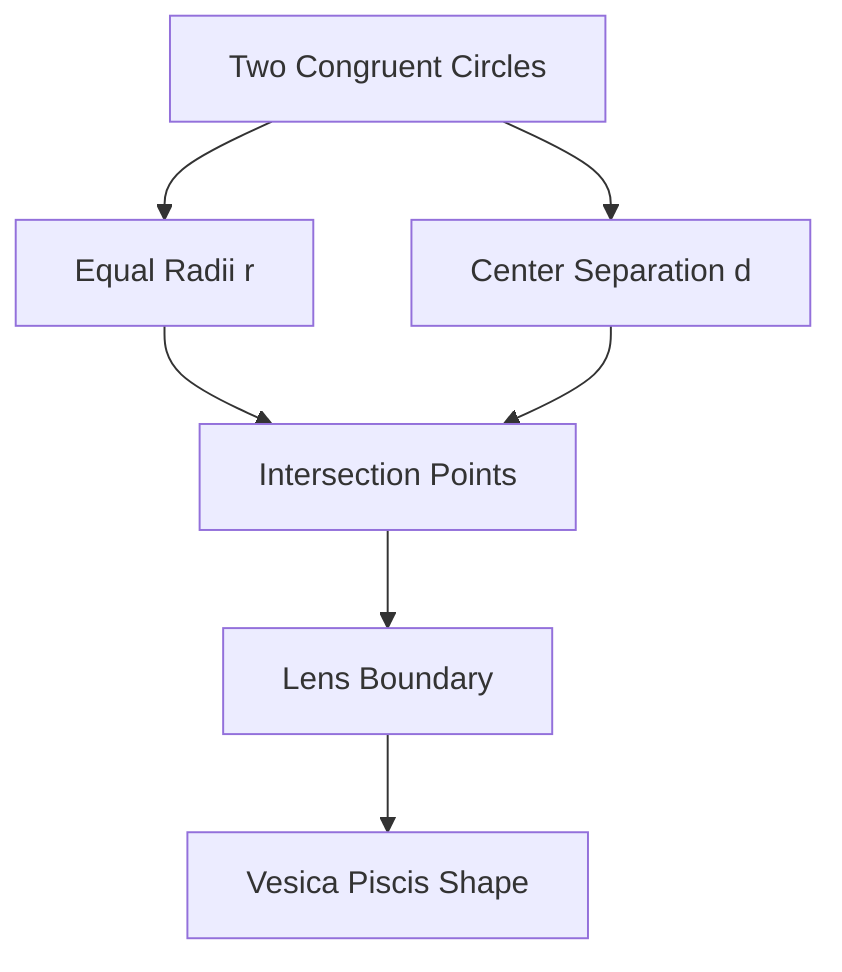
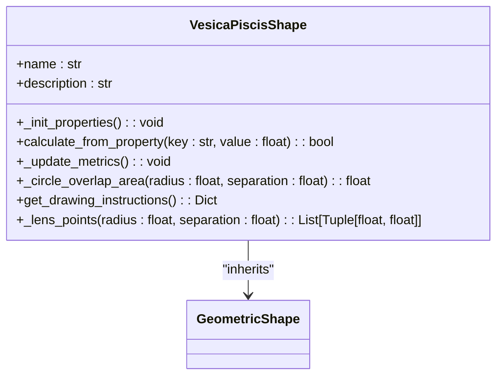
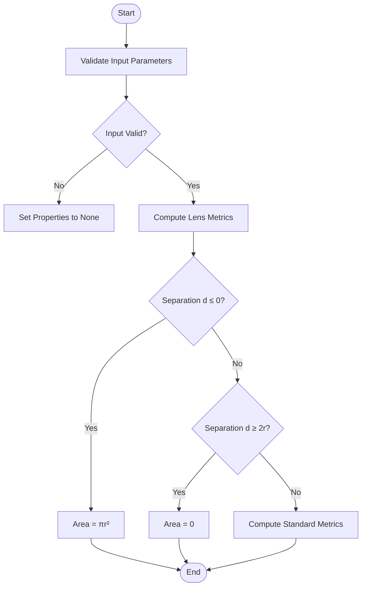
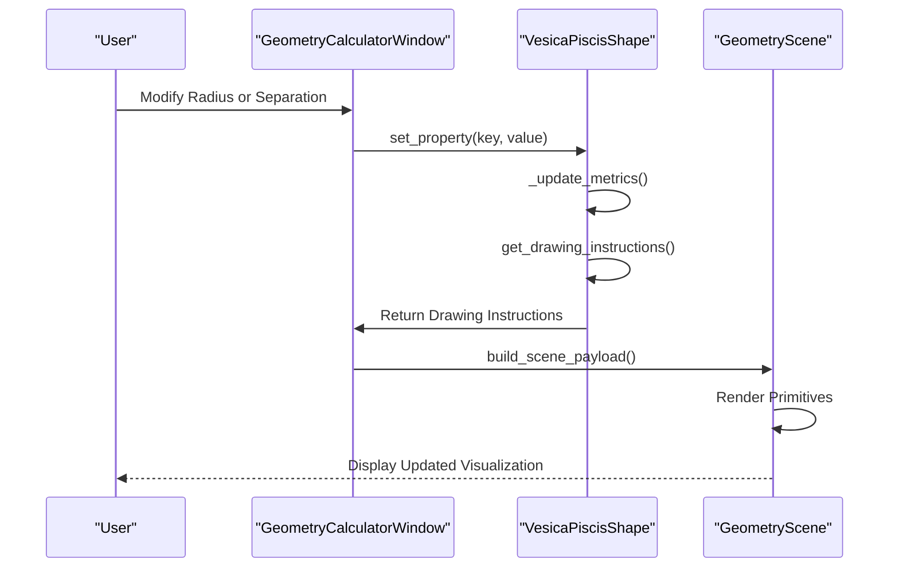

# Vesica Piscis

<cite>
**Referenced Files in This Document**   
- [vesica_piscis_shape.py](file://src/pillars/geometry/services/vesica_piscis_shape.py)
- [base_shape.py](file://src/pillars/geometry/services/base_shape.py)
- [geometry_scene.py](file://src/pillars/geometry/ui/geometry_scene.py)
- [geometry_calculator_window.py](file://src/pillars/geometry/ui/geometry_calculator_window.py)
- [primitives.py](file://src/pillars/geometry/ui/primitives.py)
</cite>

## Table of Contents
1. [Introduction](#introduction)
2. [Geometric Construction](#geometric-construction)
3. [Core Properties and Calculations](#core-properties-and-calculations)
4. [Parameter Validation and Edge Cases](#parameter-validation-and-edge-cases)
5. [Applications in Sacred Geometry](#applications-in-sacred-geometry)
6. [Rendering and Visualization](#rendering-and-visualization)
7. [Performance and Precision](#performance-and-precision)
8. [Code Integration Example](#code-integration-example)
9. [Conclusion](#conclusion)

## Introduction

The Vesica Piscis is a fundamental geometric form representing the intersection of two congruent circles with equal radii, separated by a distance `d` where `0 < d < 2r`. This shape, often referred to as the "lens" or "mandorla," holds profound significance in sacred geometry, symbolic design, and mathematical analysis. The implementation in the `VesicaPiscisShape` class provides a comprehensive calculator for deriving all geometric properties from a single degree of freedom (1-DoF), enabling users to compute metrics such as lens area, height (major axis), width (minor axis), arc length, and centroid positioning. This document details the mathematical foundations, implementation specifics, and practical applications of the Vesica Piscis within the geometry engine.

**Section sources**
- [vesica_piscis_shape.py](file://src/pillars/geometry/services/vesica_piscis_shape.py#L1-L224)

## Geometric Construction

The Vesica Piscis is constructed by intersecting two circles of equal radius `r`, whose centers are separated by a distance `d`. The resulting shape is symmetric about both the horizontal and vertical axes passing through the midpoint between the centers. The intersection points of the two circles define the vertices of the lens, forming two circular arcs that create the characteristic almond-like shape.

The geometric construction is implemented in the `get_drawing_instructions` method, which generates rendering primitives for the two defining circles and the resulting lens polygon. The centers of the circles are positioned at `(-d/2, 0)` and `(d/2, 0)`, ensuring symmetry about the origin. The lens boundary is computed by sampling points along the arcs of each circle between the intersection points, which are determined using trigonometric functions based on the radius and separation distance.



**Diagram sources**
- [vesica_piscis_shape.py](file://src/pillars/geometry/services/vesica_piscis_shape.py#L130-L172)
- [primitives.py](file://src/pillars/geometry/ui/primitives.py#L54-L60)

## Core Properties and Calculations

The `VesicaPiscisShape` class calculates several key geometric properties based on the radius `r` and separation `d`. These properties are defined as `ShapeProperty` instances within the `_init_properties` method and are updated whenever a primary property (radius or separation) is modified.

The primary calculated properties include:

- **Lens Height (Major Axis)**: The vertical distance between the top and bottom intersection points, calculated as `2 * sqrt(r² - (d/2)²)`.
- **Lens Area**: The area of intersection, computed using the circular segment integration formula: `2 * r² * arccos(d/(2r)) - 0.5 * d * sqrt(4r² - d²)`.
- **Perimeter**: The total length of the two circular arcs forming the lens boundary, given by `2 * r * θ`, where `θ = 2 * arccos(d/(2r))` is the central angle in radians.
- **Apex Angle**: The angle subtended by the arc at the center of each circle, expressed in degrees.

These calculations are performed in the `_update_metrics` method, which ensures all derived properties are consistent with the current values of `r` and `d`.



**Diagram sources**
- [vesica_piscis_shape.py](file://src/pillars/geometry/services/vesica_piscis_shape.py#L22-L64)
- [vesica_piscis_shape.py](file://src/pillars/geometry/services/vesica_piscis_shape.py#L91-L118)

## Parameter Validation and Edge Cases

The implementation enforces strict parameter validation to ensure geometric validity. The separation distance `d` must satisfy `0 < d < 2r` for a proper lens to form. If `d ≤ 0`, the circles are perfectly overlapping, resulting in a single circle with area `πr²`. If `d ≥ 2r`, the circles are either tangent or completely separate, yielding zero intersection area.

The `calculate_from_property` method validates input values, rejecting non-positive numbers and separation distances outside the valid range. When invalid parameters are detected, the calculated properties (lens height, area, perimeter, apex angle) are set to `None`, indicating an undefined state. This validation is critical for maintaining numerical stability and preventing erroneous calculations.

Edge cases are explicitly handled:
- **Perfect Overlap (d = 0)**: The lens degenerates into a single circle.
- **Tangency (d = 2r)**: The circles touch at a single point, resulting in zero area.



**Diagram sources**
- [vesica_piscis_shape.py](file://src/pillars/geometry/services/vesica_piscis_shape.py#L66-L89)
- [vesica_piscis_shape.py](file://src/pillars/geometry/services/vesica_piscis_shape.py#L91-L108)

## Applications in Sacred Geometry

The Vesica Piscis, known as the "mandorla" in art and architecture, symbolizes the intersection of the divine and the material, the spiritual and the physical. Its proportions are deeply rooted in sacred geometry, where the ratio of the major axis to the minor axis approaches the square root of 3 (√3 ≈ 1.732) when the circles are separated by a distance equal to their radius (d = r). This ratio appears in various ancient designs and is considered harmonious and balanced.

In symbolic design, the Vesica Piscis serves as a foundational element for constructing more complex geometric patterns, including the Flower of Life and the Seed of Life. Its symmetry and proportionality make it a powerful tool for creating aesthetically pleasing and spiritually significant compositions. The implementation in this geometry engine allows users to explore these relationships by dynamically adjusting the radius and separation, observing how the shape evolves and how its properties change.

**Section sources**
- [vesica_piscis_shape.py](file://src/pillars/geometry/services/vesica_piscis_shape.py#L15-L17)

## Rendering and Visualization

The visualization of the Vesica Piscis is managed through the `GeometryScene` and `GeometryCalculatorWindow` classes. The `get_drawing_instructions` method returns a dictionary of rendering primitives, including the two defining circles and the lens polygon. These primitives are translated into `GeometryScenePayload` objects by the `scene_adapter`, which are then rendered by the `GeometryScene`.

The rendering process involves:
1. Drawing the two base circles with distinct colors and semi-transparent fills.
2. Computing the boundary points of the lens using the `_lens_points` method.
3. Creating a `PolygonPrimitive` from these points and adding it to the scene.
4. Positioning labels for key parameters (radius, separation, area, apex angle) using `get_label_positions`.

The `GeometryCalculatorWindow` provides an interactive interface where users can modify parameters and immediately see the updated visualization, including axes, labels, and measurement overlays.



**Diagram sources**
- [vesica_piscis_shape.py](file://src/pillars/geometry/services/vesica_piscis_shape.py#L130-L172)
- [geometry_calculator_window.py](file://src/pillars/geometry/ui/geometry_calculator_window.py#L117-L118)
- [geometry_scene.py](file://src/pillars/geometry/ui/geometry_scene.py#L103-L110)

## Performance and Precision

The implementation is optimized for performance in repeated calculations, which is essential for interactive applications. The use of precomputed trigonometric functions and efficient algorithms ensures that property updates are nearly instantaneous. However, precision in floating-point arithmetic can become an issue when the separation distance `d` is very close to `2r`, resulting in a narrow lens. In such cases, the height calculation involves the square root of a very small number, which can lead to numerical instability.

To mitigate this, the code uses `max(0.0, radius * radius - half_sep * half_sep)` to prevent taking the square root of a negative number due to floating-point errors. Additionally, the area calculation includes checks for edge cases (`d ≤ 0` and `d ≥ 2r`) to return exact values rather than relying on potentially unstable computations.

**Section sources**
- [vesica_piscis_shape.py](file://src/pillars/geometry/services/vesica_piscis_shape.py#L110-L111)
- [vesica_piscis_shape.py](file://src/pillars/geometry/services/vesica_piscis_shape.py#L122-L128)

## Code Integration Example

To instantiate and use the `VesicaPiscisShape` in code, follow these steps:

1. Create an instance of `VesicaPiscisShape`.
2. Set a primary property (radius or separation) using `set_property`.
3. Access calculated properties via `get_property` or the `properties` dictionary.
4. Retrieve drawing instructions for rendering.

```python
# Example usage
shape = VesicaPiscisShape()
shape.set_property("radius", 5.0)
shape.set_property("separation", 6.0)

area = shape.get_property("lens_area")
height = shape.get_property("lens_height")
instructions = shape.get_drawing_instructions()
```

The shape can be integrated into the `GeometryCalculatorWindow` for a full-featured interactive experience, where users can modify parameters through a GUI and view real-time updates to the visualization and calculated metrics.

**Section sources**
- [vesica_piscis_shape.py](file://src/pillars/geometry/services/vesica_piscis_shape.py#L66-L89)
- [geometry_calculator_window.py](file://src/pillars/geometry/ui/geometry_calculator_window.py#L36-L38)

## Conclusion

The `VesicaPiscisShape` implementation provides a robust and accurate calculator for one of the most fundamental forms in sacred geometry. By combining precise mathematical formulas with efficient algorithms and careful parameter validation, it enables users to explore the properties of the Vesica Piscis in both theoretical and applied contexts. Its integration with the geometry visualization system allows for dynamic, interactive exploration, making it a valuable tool for education, design, and spiritual study.