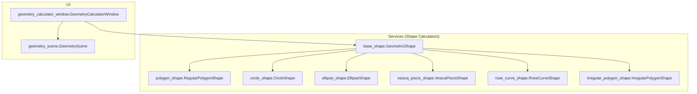
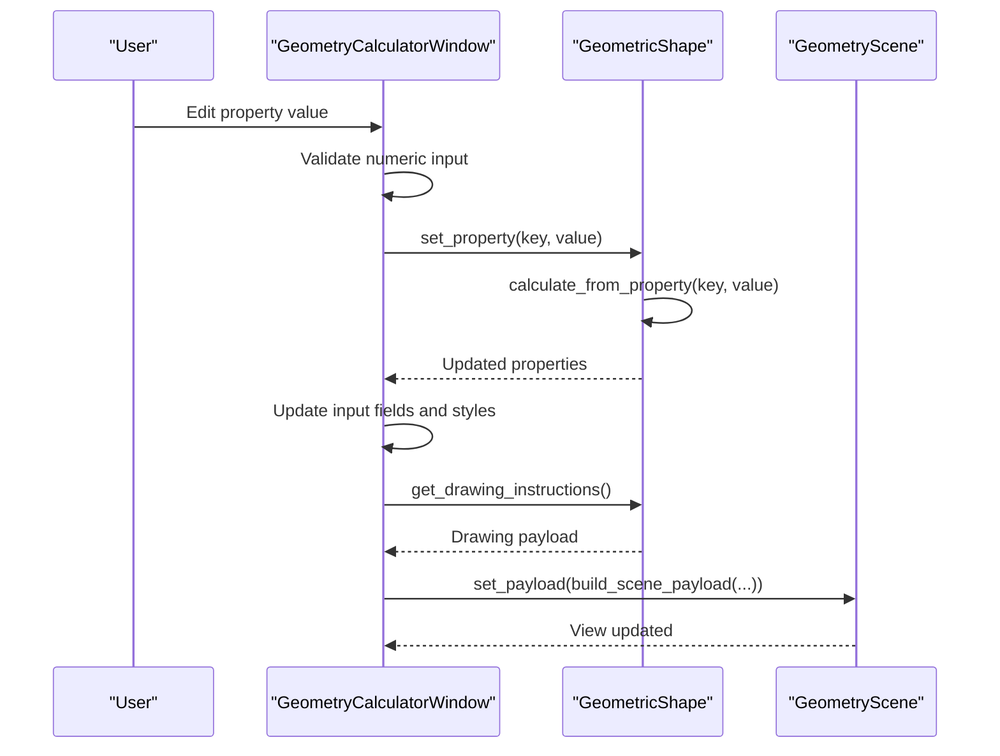
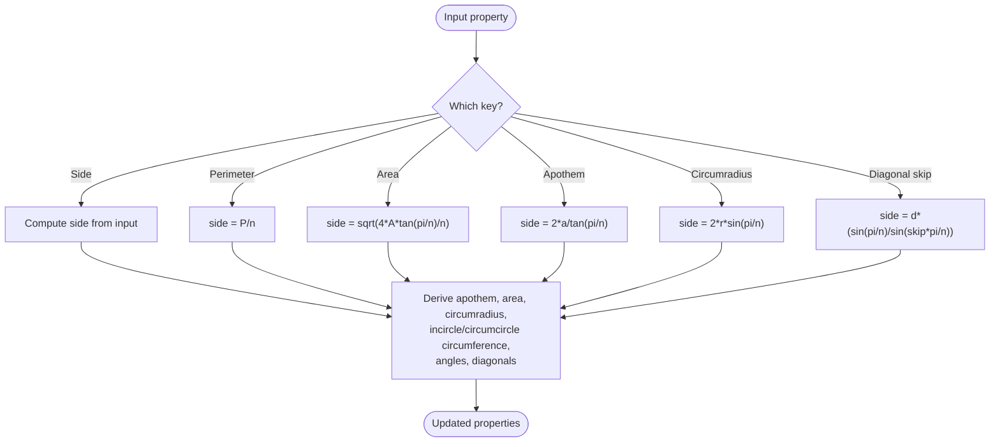
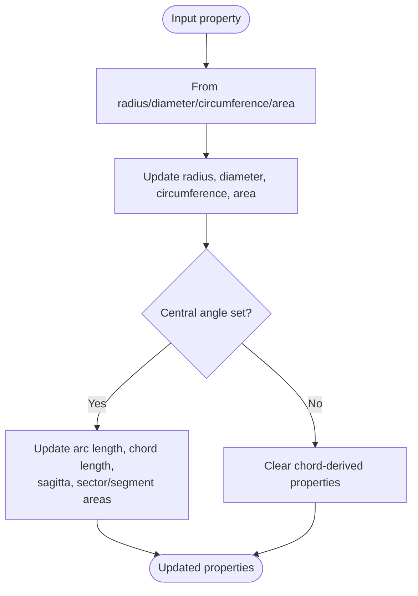
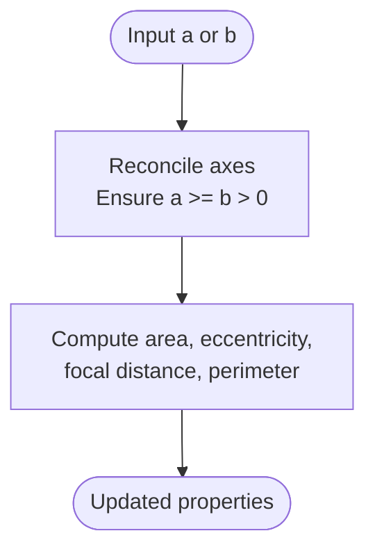
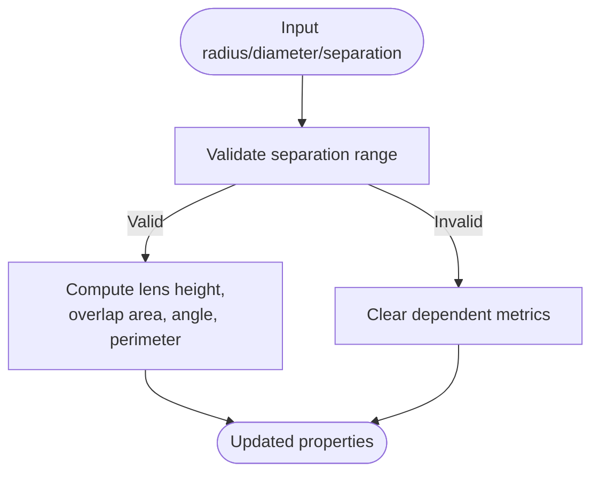
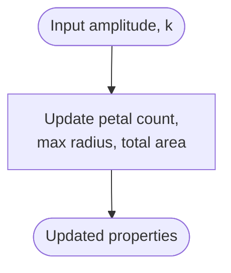
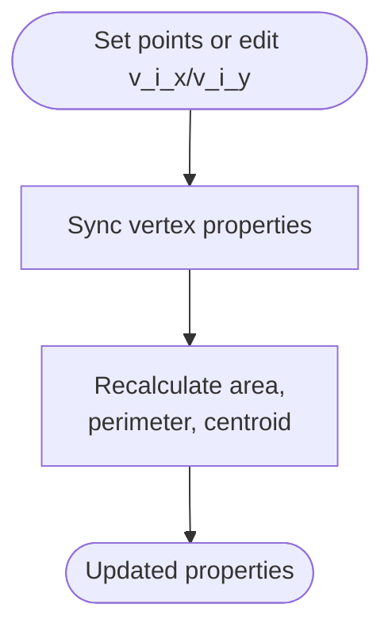
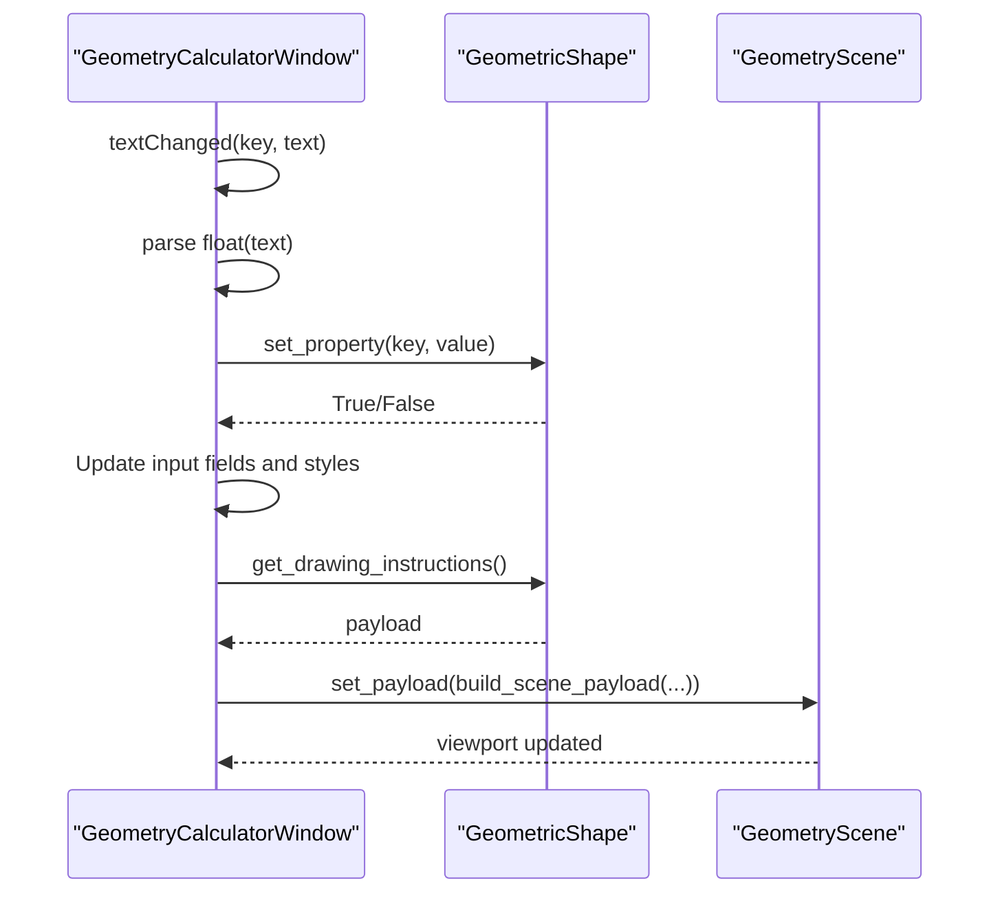
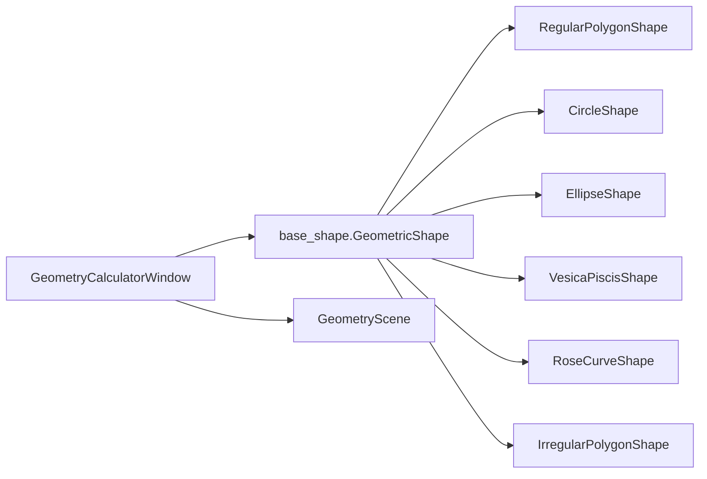

# 2D Geometry Calculations

<cite>
**Referenced Files in This Document**
- [base_shape.py](file://src/pillars/geometry/services/base_shape.py)
- [polygon_shape.py](file://src/pillars/geometry/services/polygon_shape.py)
- [circle_shape.py](file://src/pillars/geometry/services/circle_shape.py)
- [ellipse_shape.py](file://src/pillars/geometry/services/ellipse_shape.py)
- [vesica_piscis_shape.py](file://src/pillars/geometry/services/vesica_piscis_shape.py)
- [rose_curve_shape.py](file://src/pillars/geometry/services/rose_curve_shape.py)
- [irregular_polygon_shape.py](file://src/pillars/geometry/services/irregular_polygon_shape.py)
- [geometry_calculator_window.py](file://src/pillars/geometry/ui/geometry_calculator_window.py)
- [geometry_scene.py](file://src/pillars/geometry/ui/geometry_scene.py)
</cite>

## Table of Contents
1. [Introduction](#introduction)
2. [Project Structure](#project-structure)
3. [Core Components](#core-components)
4. [Architecture Overview](#architecture-overview)
5. [Detailed Component Analysis](#detailed-component-analysis)
6. [Dependency Analysis](#dependency-analysis)
7. [Performance Considerations](#performance-considerations)
8. [Troubleshooting Guide](#troubleshooting-guide)
9. [Conclusion](#conclusion)
10. [Appendices](#appendices)

## Introduction
This document explains the 2D geometry calculation subsystem within the Geometry pillar. It focuses on shape-specific calculation services that inherit from a common base, detailing how each shape computes area, perimeter, and geometric properties. It also describes the relationship between the calculation services and the geometry_calculator_window UI component, and provides guidance for extending the system with new 2D shapes while addressing floating-point precision and edge-case handling for irregular polygons.

## Project Structure
The 2D geometry subsystem is organized around a shared base class and shape-specific calculators, with a dedicated UI window that renders the shapes and synchronizes user inputs with computed properties.

**Diagram sources**
- [base_shape.py](file://src/pillars/geometry/services/base_shape.py#L1-L143)
- [polygon_shape.py](file://src/pillars/geometry/services/polygon_shape.py#L1-L267)
- [circle_shape.py](file://src/pillars/geometry/services/circle_shape.py#L1-L234)
- [ellipse_shape.py](file://src/pillars/geometry/services/ellipse_shape.py#L1-L200)
- [vesica_piscis_shape.py](file://src/pillars/geometry/services/vesica_piscis_shape.py#L1-L224)
- [rose_curve_shape.py](file://src/pillars/geometry/services/rose_curve_shape.py#L1-L137)
- [irregular_polygon_shape.py](file://src/pillars/geometry/services/irregular_polygon_shape.py#L1-L147)
- [geometry_calculator_window.py](file://src/pillars/geometry/ui/geometry_calculator_window.py#L1-L1308)
- [geometry_scene.py](file://src/pillars/geometry/ui/geometry_scene.py#L1-L710)

**Section sources**
- [base_shape.py](file://src/pillars/geometry/services/base_shape.py#L1-L143)
- [geometry_calculator_window.py](file://src/pillars/geometry/ui/geometry_calculator_window.py#L1-L1308)
- [geometry_scene.py](file://src/pillars/geometry/ui/geometry_scene.py#L1-L710)

## Core Components
- Base shape contract: Defines the ShapeProperty model, abstract interface for shape calculators, and shared behaviors like property validation, editing, and drawing instruction generation.
- Shape calculators: Implementations for regular polygons, circles, ellipses, vesica piscis, rose curves, and irregular polygons. Each defines its own property set and calculation logic.
- UI window: Bridges the base shape interface to a live visualization, updating inputs and viewport in response to user edits.

Key responsibilities:
- ShapeProperty: Encapsulates a calculable quantity with metadata (name, key, unit, readonly flag, precision).
- GeometricShape: Abstract base with lifecycle hooks for initialization, property setting, calculation, and drawing/labeling.
- GeometryCalculatorWindow: Creates property cards, validates numeric input, triggers recalculations, and updates the viewport.
- GeometryScene: Renders primitives and labels, and exposes measurement preview capabilities.

**Section sources**
- [base_shape.py](file://src/pillars/geometry/services/base_shape.py#L1-L143)
- [geometry_calculator_window.py](file://src/pillars/geometry/ui/geometry_calculator_window.py#L1-L1308)

## Architecture Overview
The system follows a layered architecture:
- Services layer: Shape calculators encapsulate geometry algorithms and expose a uniform interface.
- UI layer: The calculator window binds to a shape instance, manages input validation, and drives the viewport.
- Rendering layer: The scene consumes drawing instructions and labels from the shape to render visuals.

**Diagram sources**
- [geometry_calculator_window.py](file://src/pillars/geometry/ui/geometry_calculator_window.py#L982-L1081)
- [geometry_scene.py](file://src/pillars/geometry/ui/geometry_scene.py#L104-L112)
- [base_shape.py](file://src/pillars/geometry/services/base_shape.py#L85-L143)

## Detailed Component Analysis

### Base Shape Contract
- ShapeProperty: Provides a typed descriptor for each calculable quantity, including precision and unit formatting hints.
- GeometricShape: Abstract base with:
  - Initialization of properties via _init_properties
  - calculate_from_property to compute dependent values from a single input
  - get_drawing_instructions and get_label_positions for UI rendering
  - Validation and editing helpers (set_property, get_property, get_all_properties, validate_value)

Common behaviors:
- Positive-value validation for most geometric quantities
- Read-only vs editable property differentiation
- Centralized property clearing

**Section sources**
- [base_shape.py](file://src/pillars/geometry/services/base_shape.py#L1-L143)

### Regular Polygon (RegularPolygonShape)
- Properties include side length, perimeter, area, apothem, circumradius, incircle and circumcircle circumference, interior/exterior angles, and optional diagonal lengths for “skip” chords.
- Calculation pipeline:
  - Accepts input from any key (side, perimeter, area, apothem, circumradius, or diagonal skip)
  - Recomputes side from the input, then derives all other properties
  - Generates polygon points and diagonal groups for visualization
- Visualization:
  - get_drawing_instructions returns polygon points and diagonal segments
  - get_label_positions annotates side, area, and number of sides

**Diagram sources**
- [polygon_shape.py](file://src/pillars/geometry/services/polygon_shape.py#L130-L189)

**Section sources**
- [polygon_shape.py](file://src/pillars/geometry/services/polygon_shape.py#L1-L267)

### Circle (CircleShape)
- Properties include radius, diameter, circumference, area, central angle, arc length, chord length, sagitta, and sector/segment areas.
- Calculation pipeline:
  - From radius, diameter, circumference, or area, derive all other metrics
  - For chord-related properties (central angle, arc length, chord length, sagitta), a known radius is required
  - Updates chord-derived metrics when central angle changes
- Visualization:
  - get_drawing_instructions draws a circle with optional chord and radius/diameter indicators
  - get_label_positions annotates radius, diameter, area, circumference, and chord/angle labels

**Diagram sources**
- [circle_shape.py](file://src/pillars/geometry/services/circle_shape.py#L84-L144)
- [circle_shape.py](file://src/pillars/geometry/services/circle_shape.py#L203-L234)

**Section sources**
- [circle_shape.py](file://src/pillars/geometry/services/circle_shape.py#L1-L234)

### Ellipse (EllipseShape)
- Properties include semi-major and semi-minor axes, major/minor axes, area, perimeter (Ramanujan approximation), eccentricity, and focal distance.
- Calculation pipeline:
  - Accepts either semi-major or semi-minor axis (or full axes), reconciles ordering and positivity
  - Computes area, eccentricity, focal distance, and perimeter using Ramanujan’s approximation
- Visualization:
  - get_drawing_instructions generates polygonized ellipse points and axis lines
  - get_label_positions annotates axes, eccentricity, and area

**Diagram sources**
- [ellipse_shape.py](file://src/pillars/geometry/services/ellipse_shape.py#L139-L186)

**Section sources**
- [ellipse_shape.py](file://src/pillars/geometry/services/ellipse_shape.py#L1-L200)

### Vesica Piscis (VesicaPiscisShape)
- Properties include radius, diameter, center separation, lens height, lens area, lens perimeter, and apex angle.
- Calculation pipeline:
  - Accepts radius or diameter; sets diameter accordingly
  - Accepts center separation constrained by radius (0 < separation <= 2*radius)
  - Computes lens height, overlap area, arc angle, and perimeter
- Visualization:
  - get_drawing_instructions renders two overlapping circles and the lens polygon
  - get_label_positions annotates radius, separation, area, and angle

**Diagram sources**
- [vesica_piscis_shape.py](file://src/pillars/geometry/services/vesica_piscis_shape.py#L67-L120)

**Section sources**
- [vesica_piscis_shape.py](file://src/pillars/geometry/services/vesica_piscis_shape.py#L1-L224)

### Rose Curve (RoseCurveShape)
- Properties include amplitude, harmonic k, petal count, max radius, and total area.
- Calculation pipeline:
  - Accepts amplitude and harmonic k; rounds k to integer
  - Computes petal count (k or 2k depending on parity), max radius, and total area
- Visualization:
  - get_drawing_instructions samples polar points and renders a polyline
  - get_label_positions annotates amplitude, k, petal count, and area

**Diagram sources**
- [rose_curve_shape.py](file://src/pillars/geometry/services/rose_curve_shape.py#L56-L86)

**Section sources**
- [rose_curve_shape.py](file://src/pillars/geometry/services/rose_curve_shape.py#L1-L137)

### Irregular Polygon (IrregularPolygonShape)
- Properties include area, perimeter, centroid coordinates, and vertex count; dynamic vertex editors (v0_x, v0_y, …) are generated from provided points.
- Calculation pipeline:
  - Maintains a list of points; updates vertex properties on-the-fly
  - Recomputes area (Shoelace), perimeter (Euclidean distances), and centroid
- Visualization:
  - get_drawing_instructions returns a polygon primitive
  - get_label_positions annotates area and optionally vertex indices

**Diagram sources**
- [irregular_polygon_shape.py](file://src/pillars/geometry/services/irregular_polygon_shape.py#L47-L115)

**Section sources**
- [irregular_polygon_shape.py](file://src/pillars/geometry/services/irregular_polygon_shape.py#L1-L147)

### Relationship to GeometryCalculatorWindow
- The window constructs property cards for each ShapeProperty and wires validators and change handlers.
- On property change, it calls shape.set_property, updates all fields, and refreshes the viewport.
- The viewport receives drawing instructions and labels from the shape and renders them via the scene.

**Diagram sources**
- [geometry_calculator_window.py](file://src/pillars/geometry/ui/geometry_calculator_window.py#L982-L1081)
- [geometry_scene.py](file://src/pillars/geometry/ui/geometry_scene.py#L104-L112)

**Section sources**
- [geometry_calculator_window.py](file://src/pillars/geometry/ui/geometry_calculator_window.py#L1-L1308)
- [geometry_scene.py](file://src/pillars/geometry/ui/geometry_scene.py#L1-L710)

## Dependency Analysis
- Cohesion: Each shape class encapsulates its own property set and calculation logic, minimizing cross-dependencies.
- Coupling: All shapes depend on the base_shape contract; UI depends on shape instances and the scene rendering abstraction.
- External dependencies: Standard library math module is used for trigonometry and geometry; PyQt6 is used for UI.

**Diagram sources**
- [base_shape.py](file://src/pillars/geometry/services/base_shape.py#L1-L143)
- [polygon_shape.py](file://src/pillars/geometry/services/polygon_shape.py#L1-L267)
- [circle_shape.py](file://src/pillars/geometry/services/circle_shape.py#L1-L234)
- [ellipse_shape.py](file://src/pillars/geometry/services/ellipse_shape.py#L1-L200)
- [vesica_piscis_shape.py](file://src/pillars/geometry/services/vesica_piscis_shape.py#L1-L224)
- [rose_curve_shape.py](file://src/pillars/geometry/services/rose_curve_shape.py#L1-L137)
- [irregular_polygon_shape.py](file://src/pillars/geometry/services/irregular_polygon_shape.py#L1-L147)
- [geometry_calculator_window.py](file://src/pillars/geometry/ui/geometry_calculator_window.py#L1-L1308)
- [geometry_scene.py](file://src/pillars/geometry/ui/geometry_scene.py#L1-L710)

**Section sources**
- [base_shape.py](file://src/pillars/geometry/services/base_shape.py#L1-L143)
- [geometry_calculator_window.py](file://src/pillars/geometry/ui/geometry_calculator_window.py#L1-L1308)

## Performance Considerations
- Floating-point precision: Many calculations use trigonometric functions and square roots. Prefer using radians consistently and clamp inputs to valid ranges to avoid numerical errors.
- Polygon sampling: Ellipse and rose curve sampling use fixed step counts; increasing steps improves smoothness but increases CPU cost.
- UI responsiveness: The window uses a flag to prevent re-entrant updates during bulk field refreshes.
- Scene updates: The scene rebuilds from scratch on payload changes; avoid frequent updates for large datasets.

[No sources needed since this section provides general guidance]

## Troubleshooting Guide
Common issues and resolutions:
- Invalid inputs:
  - All shapes enforce positive values for geometric properties. If a calculation fails, revert the input and ensure the value is greater than zero.
- Edge cases in irregular polygons:
  - Fewer than three points yield zero area/perimeter. Ensure at least three distinct vertices.
  - Degenerate shapes (collinear or overlapping points) can produce unexpected centroids; validate vertex order and uniqueness.
- Circle chord metrics:
  - Central angle, arc length, chord length, and sagitta require a valid radius. If radius is unknown, set it first.
- Ellipse perimeter:
  - Uses Ramanujan’s approximation; extremely eccentric ellipses may differ from exact integrals.
- Vesica piscis separation:
  - Must satisfy 0 < separation <= 2*radius; otherwise dependent metrics are cleared.

**Section sources**
- [base_shape.py](file://src/pillars/geometry/services/base_shape.py#L122-L138)
- [irregular_polygon_shape.py](file://src/pillars/geometry/services/irregular_polygon_shape.py#L103-L115)
- [circle_shape.py](file://src/pillars/geometry/services/circle_shape.py#L107-L141)
- [ellipse_shape.py](file://src/pillars/geometry/services/ellipse_shape.py#L170-L186)
- [vesica_piscis_shape.py](file://src/pillars/geometry/services/vesica_piscis_shape.py#L80-L108)

## Conclusion
The 2D geometry subsystem cleanly separates shape-specific algorithms from UI concerns. The base_shape contract ensures consistent property modeling and calculation semantics across shapes, while the GeometryCalculatorWindow provides a responsive, validated interface to drive computations and visualization. Extending the system involves subclassing GeometricShape, defining properties, and implementing calculate_from_property and drawing/labeling methods.

[No sources needed since this section summarizes without analyzing specific files]

## Appendices

### Mathematical Algorithms Summary
- Regular polygon:
  - Side from area: side = sqrt(4*A*tan(pi/n)/n)
  - Side from apothem: side = 2*a/tan(pi/n)
  - Side from circumradius: side = 2*r*sin(pi/n)
  - Diagonal from radius and skip: d = 2*r*sin(skip*pi/n)
- Circle:
  - radius = diameter/2
  - circumference = 2*pi*r
  - area = pi*r^2
  - arc length = r*theta
  - chord length = 2*r*sin(theta/2)
  - sagitta = r*(1 - cos(theta/2))
- Ellipse:
  - area = pi*a*b
  - eccentricity = sqrt(1 - b^2/a^2)
  - focal distance = sqrt(a^2 - b^2)
  - perimeter ≈ pi*(a + b)*(1 + 3h/(10 + sqrt(4 - 3h))) with h = (a - b)^2/(a + b)^2
- Vesica Piscis:
  - lens height = 2*sqrt(r^2 - (d/2)^2)
  - overlap area = 2*r^2*acos(d/(2*r)) - 0.5*d*sqrt(4*r^2 - d^2)
  - apex angle = 2*acos(d/(2*r))
- Rose Curve:
  - petal count = k if odd, 2k if even
  - total area = 0.5*a^2*petals

**Section sources**
- [polygon_shape.py](file://src/pillars/geometry/services/polygon_shape.py#L130-L189)
- [circle_shape.py](file://src/pillars/geometry/services/circle_shape.py#L203-L234)
- [ellipse_shape.py](file://src/pillars/geometry/services/ellipse_shape.py#L170-L186)
- [vesica_piscis_shape.py](file://src/pillars/geometry/services/vesica_piscis_shape.py#L121-L129)
- [rose_curve_shape.py](file://src/pillars/geometry/services/rose_curve_shape.py#L73-L86)

### Usage Patterns for Extension
- Define a new shape class inheriting from GeometricShape.
- Implement _init_properties to declare ShapeProperty entries.
- Implement calculate_from_property to derive dependent values from a single input key.
- Implement get_drawing_instructions to return a dictionary of primitives and labels.
- Optionally implement get_label_positions to annotate the viewport.
- Integrate with the UI by passing an instance to GeometryCalculatorWindow.

**Section sources**
- [base_shape.py](file://src/pillars/geometry/services/base_shape.py#L18-L84)
- [geometry_calculator_window.py](file://src/pillars/geometry/ui/geometry_calculator_window.py#L190-L227)