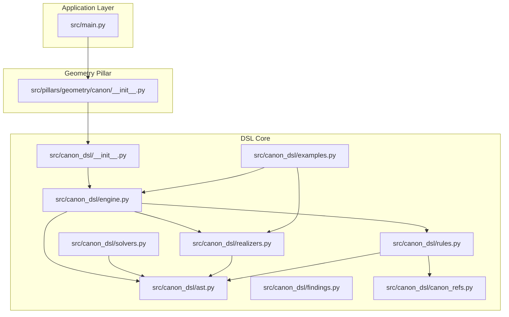
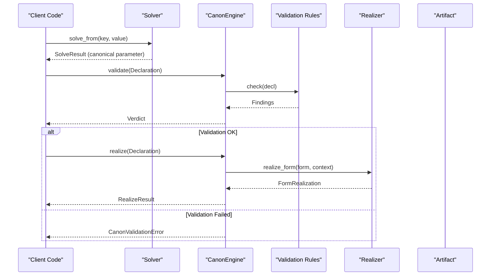
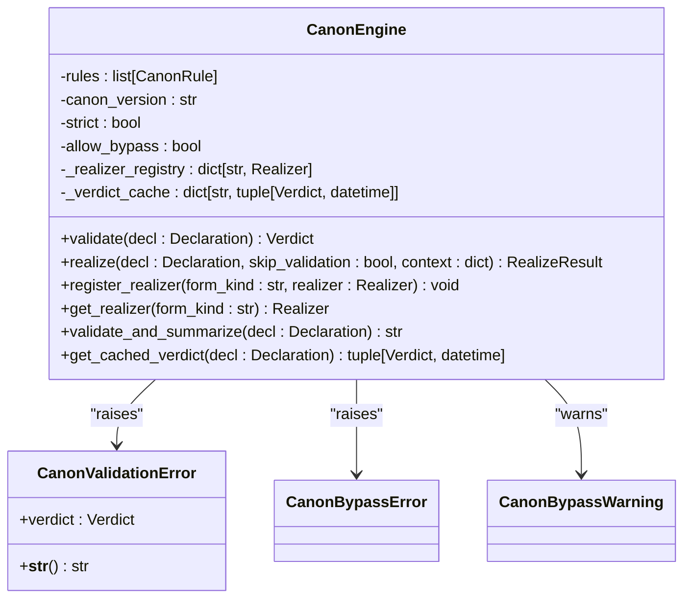
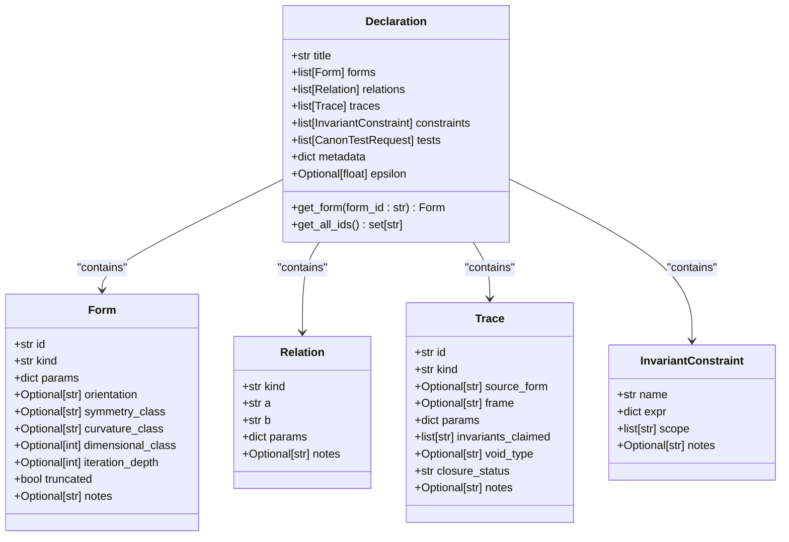
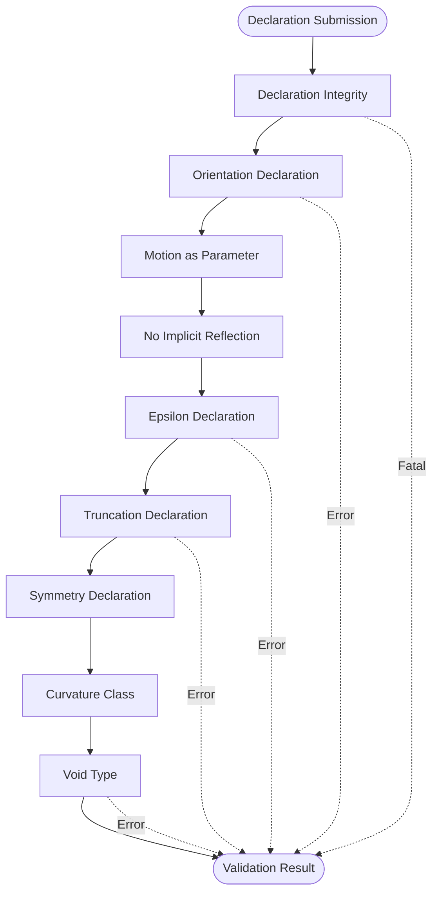
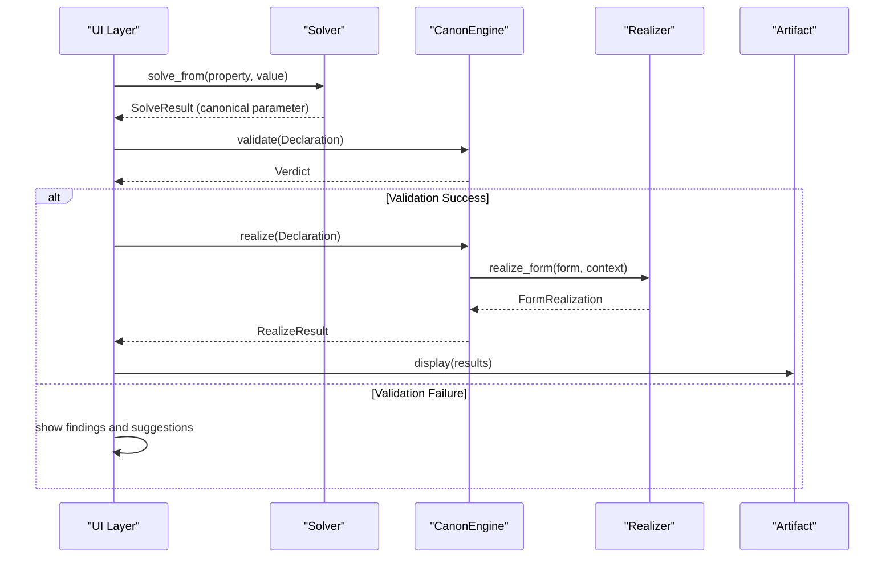
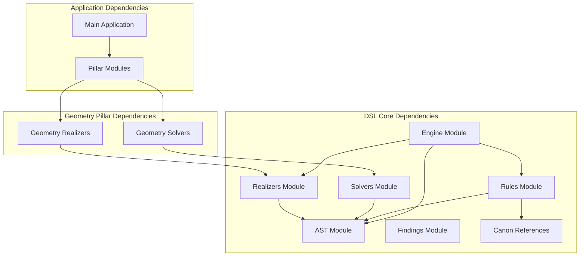

# Geometry Canon DSL System

<cite>
**Referenced Files in This Document**
- [__init__.py](file://src/canon_dsl/__init__.py)
- [engine.py](file://src/canon_dsl/engine.py)
- [ast.py](file://src/canon_dsl/ast.py)
- [rules.py](file://src/canon_dsl/rules.py)
- [solvers.py](file://src/canon_dsl/solvers.py)
- [realizers.py](file://src/canon_dsl/realizers.py)
- [findings.py](file://src/canon_dsl/findings.py)
- [canon_refs.py](file://src/canon_dsl/canon_refs.py)
- [examples.py](file://src/canon_dsl/examples.py)
- [__init__.py](file://src/pillars/geometry/canon/__init__.py)
- [main.py](file://src/main.py)
- [test_cube_canon.py](file://tests/test_cube_canon.py)
</cite>

## Table of Contents
1. [Introduction](#introduction)
2. [Project Structure](#project-structure)
3. [Core Components](#core-components)
4. [Architecture Overview](#architecture-overview)
5. [Detailed Component Analysis](#detailed-component-analysis)
6. [Dependency Analysis](#dependency-analysis)
7. [Performance Considerations](#performance-considerations)
8. [Troubleshooting Guide](#troubleshooting-guide)
9. [Conclusion](#conclusion)

## Introduction
The Geometry Canon DSL System is a declarative geometry framework that implements the Hermetic Geometry Canon v1.0 as an executable validation and realization engine. It provides a structured approach to defining geometric forms, their relationships, and motion-revealed traces while enforcing canonical rules through automated validation. The system separates concerns between bidirectional solving (parameter discovery), validation (rule enforcement), and realization (artifact generation), ensuring that all computations remain lawful and reproducible.

## Project Structure
The system is organized into several key packages:

- **canon_dsl**: Core DSL infrastructure (AST, validation rules, engine, solvers, realizers)
- **pillars/geometry/canon**: Geometry-specific solvers and realizers (owned by the geometry pillar)
- **tests**: Integration and unit tests validating DSL behavior
- **src/main.py**: Application entry point integrating multiple pillars

**Diagram sources**
- [__init__.py](file://src/canon_dsl/__init__.py#L1-L90)
- [engine.py](file://src/canon_dsl/engine.py#L81-L340)
- [ast.py](file://src/canon_dsl/ast.py#L17-L238)
- [rules.py](file://src/canon_dsl/rules.py#L28-L601)
- [solvers.py](file://src/canon_dsl/solvers.py#L150-L256)
- [realizers.py](file://src/canon_dsl/realizers.py#L137-L228)
- [findings.py](file://src/canon_dsl/findings.py#L18-L164)
- [canon_refs.py](file://src/canon_dsl/canon_refs.py#L44-L227)
- [examples.py](file://src/canon_dsl/examples.py#L39-L484)
- [__init__.py](file://src/pillars/geometry/canon/__init__.py#L1-L156)
- [main.py](file://src/main.py#L1-L505)

**Section sources**
- [__init__.py](file://src/canon_dsl/__init__.py#L1-L90)
- [__init__.py](file://src/pillars/geometry/canon/__init__.py#L1-L156)
- [main.py](file://src/main.py#L1-L505)

## Core Components
The system consists of five primary components that work together to enforce canonical geometry laws:

### Abstract Syntax Tree (AST)
Immutable data structures representing geometric declarations:
- **Form**: Geometric shapes with parameters, orientation, symmetry, and curvature classes
- **Relation**: Spatial relationships between forms (containment, inscription, etc.)
- **Trace**: Motion-revealed forms with temporal scope and void declarations
- **InvariantConstraint**: Proportion-based relationships requiring validation
- **CanonTestRequest**: Canonical tests for validation verification

### Validation Engine
The central coordinator that validates declarations against built-in rules and orchestrates realization:
- **CanonEngine**: Main validation and realization controller
- **Verdict**: Aggregated validation results with severity counts
- **Finding**: Individual validation issues with Canon article references

### Validation Rules
Nine built-in rules enforcing canonical geometry principles:
- Declaration Integrity (structural validation)
- Orientation Declaration (chirality requirements)
- Motion as Parameter (temporal scope declarations)
- No Implicit Reflection (explicit reflection declarations)
- Epsilon Declaration (numerical tolerance requirements)
- Truncation Declaration (recursive form limitations)
- Symmetry Declaration (inherent symmetry requirements)
- Curvature Class (curved form declarations)
- Void Type (motion-based void claims)

### Solvers and Realizers
- **Solver**: Bidirectional calculators that convert partial values into canonical parameters
- **Realizer**: Forward computation components that transform validated declarations into artifacts

**Section sources**
- [ast.py](file://src/canon_dsl/ast.py#L17-L238)
- [engine.py](file://src/canon_dsl/engine.py#L81-L340)
- [rules.py](file://src/canon_dsl/rules.py#L28-L601)
- [solvers.py](file://src/canon_dsl/solvers.py#L150-L256)
- [realizers.py](file://src/canon_dsl/realizers.py#L137-L228)
- [findings.py](file://src/canon_dsl/findings.py#L18-L164)

## Architecture Overview
The system follows a layered architecture with clear separation of concerns:

**Diagram sources**
- [engine.py](file://src/canon_dsl/engine.py#L205-L320)
- [rules.py](file://src/canon_dsl/rules.py#L56-L63)
- [solvers.py](file://src/canon_dsl/solvers.py#L198-L210)
- [realizers.py](file://src/canon_dsl/realizers.py#L168-L179)

The architecture enforces several key principles:
- **Code is an instrument**: Validation gates all realization attempts
- **Pillar sovereignty**: Realizers belong to their respective pillars, not the DSL core
- **Reproducibility**: Declaration signatures enable cacheable validation results
- **Safety mechanisms**: Explicit bypass protection prevents accidental Canon violations

## Detailed Component Analysis

### Canon Engine Analysis
The CanonEngine serves as the central coordinator, implementing strict validation and controlled realization:

**Diagram sources**
- [engine.py](file://src/canon_dsl/engine.py#L81-L377)

Key features include:
- **Signature computation**: SHA-256 signatures for reproducible validation caching
- **Strict vs lenient modes**: Configurable enforcement of ERROR vs FATAL-only blocking
- **Bypass protection**: Explicit safety mechanism preventing accidental Canon violations
- **Provenance tracking**: Complete audit trail for all realizations

### AST Data Structures Analysis
The AST provides immutable, canonical representations of geometric declarations:

**Diagram sources**
- [ast.py](file://src/canon_dsl/ast.py#L17-L238)

### Validation Rules Analysis
The nine built-in rules systematically enforce Canon compliance:

**Diagram sources**
- [rules.py](file://src/canon_dsl/rules.py#L69-L601)

Each rule targets specific Canon articles and provides actionable findings with suggested fixes. The rules collectively ensure:
- Structural soundness of declarations
- Explicit handling of orientation-sensitive forms
- Proper temporal scope declarations for motion-based forms
- Clear reflection policies
- Numerical precision through epsilon declarations
- Correct treatment of recursive forms
- Appropriate symmetry and curvature declarations
- Valid void claims for motion-revealed forms

### Solvers and Realizers Integration
The system supports bidirectional computation and forward artifact generation:

**Diagram sources**
- [solvers.py](file://src/canon_dsl/solvers.py#L150-L256)
- [realizers.py](file://src/canon_dsl/realizers.py#L137-L228)
- [engine.py](file://src/canon_dsl/engine.py#L205-L320)

**Section sources**
- [engine.py](file://src/canon_dsl/engine.py#L81-L377)
- [ast.py](file://src/canon_dsl/ast.py#L17-L238)
- [rules.py](file://src/canon_dsl/rules.py#L28-L601)
- [solvers.py](file://src/canon_dsl/solvers.py#L150-L256)
- [realizers.py](file://src/canon_dsl/realizers.py#L137-L228)
- [findings.py](file://src/canon_dsl/findings.py#L18-L164)
- [canon_refs.py](file://src/canon_dsl/canon_refs.py#L44-L227)
- [examples.py](file://src/canon_dsl/examples.py#L39-L484)

## Dependency Analysis
The system maintains clean architectural boundaries through strategic dependency management:

**Diagram sources**
- [__init__.py](file://src/canon_dsl/__init__.py#L47-L89)
- [__init__.py](file://src/pillars/geometry/canon/__init__.py#L21-L84)
- [main.py](file://src/main.py#L41-L59)

Key dependency characteristics:
- **DSL core remains pillar-agnostic**: No direct imports from geometry or other pillars
- **Lazy loading pattern**: Geometry components loaded on-demand to minimize import overhead
- **Interface-based design**: Clean abstractions prevent circular dependencies
- **Versioned enforcement**: Strict version control ensures Canon compliance across updates

**Section sources**
- [__init__.py](file://src/canon_dsl/__init__.py#L47-L89)
- [__init__.py](file://src/pillars/geometry/canon/__init__.py#L86-L92)
- [main.py](file://src/main.py#L41-L59)

## Performance Considerations
The system incorporates several performance optimizations:

### Validation Caching
- **Signature-based caching**: SHA-256 signatures enable efficient verdict reuse
- **Timestamp tracking**: Cached verdicts include validation timestamps for freshness
- **Memory efficiency**: Compact signature storage minimizes memory footprint

### Lazy Loading Architecture
- **Geometry component lazy loading**: On-demand imports reduce startup time
- **Module isolation**: Independent modules prevent unnecessary imports
- **Conditional availability**: Optional components gracefully degrade

### Computational Efficiency
- **Immutable data structures**: Frozen dataclasses prevent accidental mutations
- **Streamlined validation**: Rule execution designed for minimal overhead
- **Provenance optimization**: Efficient metadata collection without computation

## Troubleshooting Guide

### Common Validation Issues
1. **Missing epsilon declarations**: Ensure numeric constraints specify tolerances
2. **Unregistered realizers**: Verify realizer registration for all form kinds
3. **Invalid form references**: Check relation and constraint target IDs
4. **Orientation violations**: Add explicit orientation declarations for sensitive forms

### Bypass Protection
The system intentionally prevents bypassing validation:
- **Default safety**: `allow_bypass=False` prevents accidental violations
- **Explicit configuration**: Migration scenarios require deliberate engine setup
- **Warning system**: Bypass attempts emit warnings for traceability

### Integration Testing
The test suite demonstrates proper integration patterns:
- **Solver validation**: Comprehensive property solving across multiple geometric forms
- **Realizer verification**: Artifact generation and metric computation
- **Derivation support**: Educational content generation for geometric forms

**Section sources**
- [engine.py](file://src/canon_dsl/engine.py#L242-L261)
- [test_cube_canon.py](file://tests/test_cube_canon.py#L22-L186)

## Conclusion
The Geometry Canon DSL System provides a robust, Canon-compliant framework for declarative geometry computation. Its layered architecture ensures strict adherence to Hermetic principles while maintaining flexibility for diverse geometric applications. The system's emphasis on validation, reproducibility, and safety makes it suitable for complex geometric modeling and educational applications. The clean separation between DSL core and pillar-specific implementations enables extensibility while preserving architectural integrity.

Through comprehensive validation rules, bidirectional solving capabilities, and structured artifact generation, the system establishes a foundation for lawful geometric computation that honors both mathematical rigor and canonical tradition.