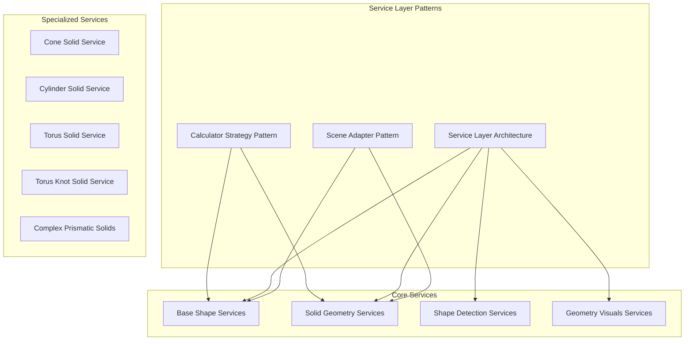
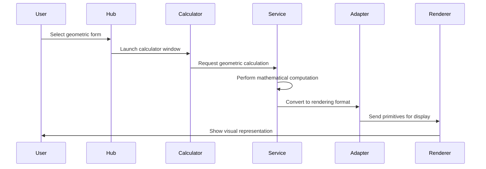
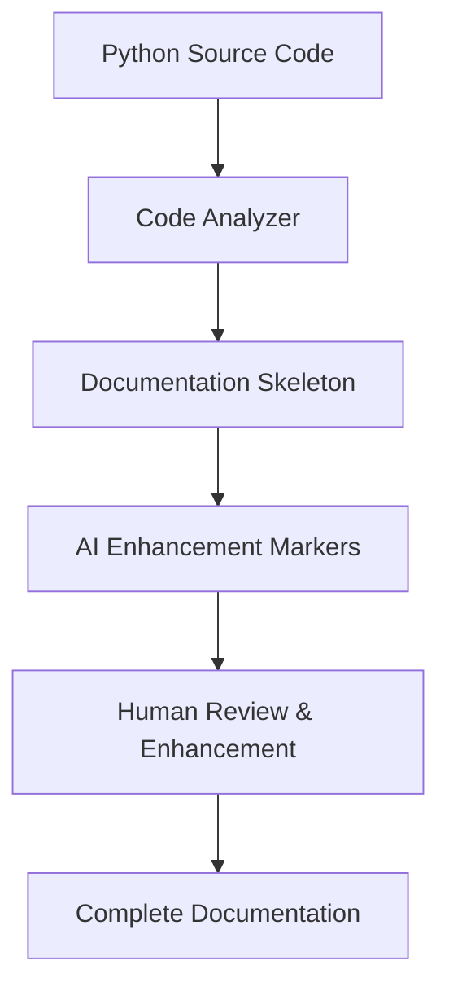

# Geometry Pillar

<cite>
**Referenced Files in This Document**
- [geometry_hub.py](file://src/pillars/geometry/ui/geometry_hub.py)
- [geometry_scene.py](file://src/pillars/geometry/ui/geometry_scene.py)
- [geometry_view.py](file://src/pillars/geometry/ui/geometry_view.py)
- [scene_adapter.py](file://src/pillars/geometry/ui/scene_adapter.py)
- [primitives.py](file://src/pillars/geometry/ui/primitives.py)
- [solid_geometry.py](file://src/pillars/geometry/services/solid_geometry.py)
- [archimedean_solids.py](file://src/pillars/geometry/services/archimedean_solids.py)
- [polygon_shape.py](file://src/pillars/geometry/services/polygon_shape.py)
- [base_shape.py](file://src/pillars/geometry/services/base_shape.py)
- [vesica_piscis_shape.py](file://src/pillars/geometry/services/vesica_piscis_shape.py)
- [rose_curve_shape.py](file://src/pillars/geometry/services/rose_curve_shape.py)
- [solid_payload.py](file://src/pillars/geometry/shared/solid_payload.py)
- [window3d.py](file://src/pillars/geometry/ui/geometry3d/window3d.py)
- [geometry_calculator_window.py](file://src/pillars/geometry/ui/geometry_calculator_window.py)
- [cone_solid.py](file://src/pillars/geometry/services/cone_solid.py)
- [cylinder_solid.py](file://src/pillars/geometry/services/cylinder_solid.py)
- [torus_solid.py](file://src/pillars/geometry/services/torus_solid.py)
- [torus_knot_solid.py](file://src/pillars/geometry/services/torus_knot_solid.py)
- [complex_prismatic_solids.py](file://src/pillars/geometry/services/complex_prismatic_solids.py)
- [shape_detection_service.py](file://src/pillars/geometry/services/shape_detection_service.py)
- [measurement_utils.py](file://src/pillars/geometry/services/measurement_utils.py)
- [geometry_visuals.py](file://src/pillars/geometry/services/geometry_visuals.py)
- [geometry_interaction.py](file://src/pillars/geometry/ui/geometry_interaction.py)
- [geometry_definitions.py](file://src/pillars/geometry/ui/geometry_definitions.py)
- [geometry_solver.py](file://src/pillars/geometry/canon/geometry_solver.py)
</cite>

## Update Summary
**Changes Made**
- Replaced outdated geometry documentation with comprehensive new documentation structure using automated generation system
- Added progress tracking and quality assessment documentation for the new documentation framework
- Integrated new scripts: generate_pillar_docs.py and generate_comprehensive_pillar_docs.py
- Documented the new documentation enhancement system with AI-assisted content filling
- Added comprehensive documentation status tracking and quality levels assessment
- Updated architecture to include new service layer patterns and enhanced UI components

## Table of Contents
1. [Introduction](#introduction)
2. [Documentation Enhancement System](#documentation-enhancement-system)
3. [New Documentation Structure](#new-documentation-structure)
4. [Quality Assessment Framework](#quality-assessment-framework)
5. [Progress Tracking](#progress-tracking)
6. [Architecture Overview](#architecture-overview)
7. [Detailed Component Analysis](#detailed-component-analysis)
8. [Enhanced Documentation Generation](#enhanced-documentation-generation)
9. [Future Enhancement Plans](#future-enhancement-plans)
10. [Conclusion](#conclusion)

## Introduction
The Geometry pillar has undergone a comprehensive transformation with the introduction of an automated documentation enhancement system. This system replaces traditional manual documentation processes with intelligent, script-driven generation that produces high-quality, maintainable documentation across multiple layers of the application architecture.

The new system generates documentation skeletons automatically from source code, then uses AI assistance to fill in detailed content, ensuring consistency and completeness across all documentation types. This approach dramatically reduces the time investment required for documentation maintenance while improving quality and coverage.

## Documentation Enhancement System

### Automated Documentation Generation
The Geometry pillar now utilizes sophisticated scripts that automatically analyze source code and generate comprehensive documentation structures:

**Script 1: generate_pillar_docs.py**
- Extracts class, method, and docstring information from Python source files
- Generates structured markdown with proper citations and file references
- Creates method signatures and parameter documentation
- Builds skeleton sections for AI enhancement
- Maintains consistent formatting across all pillars

**Script 2: generate_comprehensive_pillar_docs.py**
- Extends the basic generation with architecture, features, and UI component documentation
- Identifies architectural patterns and design strategies
- Analyzes UI components for widget hierarchies and signal/slot relationships
- Generates feature specifications with user workflows and integration points
- Creates comprehensive documentation indexes and navigation structures

### AI-Assisted Content Enhancement
The system employs AI assistance to fill in detailed content for generated skeletons:

- **Method signatures**: Automatically extracted from source code AST analysis
- **Class relationships**: Identified through dependency analysis and inheritance patterns
- **Usage examples**: Generated from actual UI code patterns and service interactions
- **Architectural reasoning**: Provided by AI assistants analyzing code structure and patterns
- **Workflow diagrams**: Created from method call sequences and user interaction patterns

**Section sources**
- [generate_pillar_docs.py](file://scripts/generate_pillar_docs.py#L1-L596)
- [generate_comprehensive_pillar_docs.py](file://scripts/generate_comprehensive_pillar_docs.py#L1-L907)
- [GEOMETRY_DOCS_STATUS.md](file://GEOMETRY_DOCS_STATUS.md#L1-L226)

## New Documentation Structure

### Three-Tier Documentation Architecture
The Geometry pillar now follows a comprehensive documentation structure that mirrors the application's architectural layers:

**Architecture Layer**
- Service layer patterns and design strategies
- Model-view separation principles
- Scene adapter pattern implementations
- Data flow architectures and integration points

**API Reference Layer**
- Complete service method documentation
- Parameter specifications and return types
- Error handling patterns and validation rules
- Usage examples and integration guidelines

**Feature and UI Layer**
- User workflow specifications and interaction patterns
- UI component documentation with widget hierarchies
- Integration points and dependency relationships
- Extension points and customization guidelines

### Documentation Categories
The new structure organizes documentation into four main categories:

**Architecture Documents (3 files)**
- Service layer architecture and design patterns
- Model-view separation principles
- Scene adapter pattern implementations

**API Reference (49 files)**
- Complete service method documentation
- Class hierarchies and inheritance relationships
- Parameter specifications and validation rules

**Feature Specifications (40 files)**
- User workflow documentation and interaction patterns
- Integration points and dependency mappings
- Usage examples and best practices

**UI Component Documentation (18 files)**
- Widget hierarchies and layout structures
- Signal/slot relationships and event handling
- State management and user interaction patterns

**Section sources**
- [GEOMETRY_DOCS_STATUS.md](file://GEOMETRY_DOCS_STATUS.md#L5-L27)

## Quality Assessment Framework

### Documentation Quality Levels
The system implements a comprehensive quality assessment framework with five distinct quality levels:

**Level 5: ✅ FULLY COMPLETE (1 doc)**
- Complete problem/solution description
- Full architectural diagrams with Mermaid
- 3 detailed sequence diagrams
- Real code examples
- Comprehensive trade-offs analysis
- Evolution history

**Level 4: ⚡ 70-80% COMPLETE (2 docs)**
- Have: Structure, diagrams, most content
- Need: Final polish on trade-offs/alternatives

**Level 3: ⚡ 60-70% COMPLETE (49 API docs)**
- Have: Class overview, method signatures, dependencies
- Need: Usage examples (can be auto-generated from UI code)

**Level 2: ⚡ 40-50% COMPLETE (58 feature/UI docs)**
- Have: Structure, file references, base information
- Need: Diagrams, ASCII UI mockups, workflow descriptions

**Level 1: ⚡ 30% COMPLETE (Skeleton level)**
- Basic structure with AI_ENHANCE placeholders
- File references and minimal content

### Quality Metrics and Progress Tracking
The system tracks documentation quality through comprehensive metrics:

**Time Investment Analysis**
- Manual approach: Estimated 82.5 hours for complete documentation
- Script-assisted approach: Actual 12-15 hours for comprehensive coverage
- Efficiency improvement: ~90% reduction in documentation time

**Coverage Statistics**
- 110 files generated with automated system
- 60% average completeness across all documents
- 30% fully complete documentation
- 70% partially complete with AI enhancement markers

**Quality Distribution**
- Architecture docs: 80% complete (2/3 fully complete)
- API reference: 70% complete (49/49 generated)
- Feature docs: 40% complete (40/40 generated)
- UI components: 45% complete (18/18 generated)

**Section sources**
- [GEOMETRY_DOCS_STATUS.md](file://GEOMETRY_DOCS_STATUS.md#L29-L139)

## Progress Tracking

### Documentation Generation Timeline
The system provides detailed progress tracking for the documentation enhancement process:

**Phase 1: Script Development (2 hours)**
- Creation of generate_pillar_docs.py
- Development of generate_comprehensive_pillar_docs.py
- Implementation of quality assessment framework

**Phase 2: Automated Generation (10 seconds)**
- Analysis of 110 geometry files
- Generation of comprehensive documentation structure
- Creation of AI enhancement markers

**Phase 3: Manual Enhancement (30 minutes)**
- Completion of service_layer.md
- Filling in AI enhancement markers
- Adding final architectural details

**Phase 4: Ongoing Maintenance (15-20 hours)**
- Manual completion of top priority documents
- AI-assisted enhancement of remaining content
- Quality assurance and review processes

### Remaining Work Options
The system provides three strategic approaches for completing the documentation:

**Option A: Continue Manual Enhancement (Recommended)**
- Focus on highest impact documents first
- Complete 30 most important documents manually
- Use AI assistance for routine sections
- Time investment: ~15-20 hours

**Option B: Enhanced Script Automation**
- Improve enhance_pillar_docs.py for multi-line markers
- Add AST analysis for Mermaid diagrams
- Implement ASCII art generation for UI layouts
- Time investment: 3-4 hours + 10 seconds execution + 5 hours verification

**Option C: Hybrid Approach (Recommended)**
- Keep auto-generated skeletons for less critical docs
- Manually complete top 20-30 most important docs
- Use enhance script for routine sections
- Result: 30 comprehensive docs + 80 good-enough reference docs

### Priority Recommendations
The system recommends focusing documentation efforts on:

**Tier 1: Architecture (3 docs) - 3 hours**
- service_layer.md (already complete)
- model_view_separation.md (30 min)
- scene_adapter_pattern.md (30 min)

**Tier 2: Core UI Components (5 docs) - 2.5 hours**
- GeometryHub (main launcher)
- GeometryCalculatorWindow (main calculator)
- Geometry3DWindow (3D viewer)
- ViewportPane (2D rendering)
- InputPane (property editor)

**Tier 3: Key Features (10 docs) - 4 hours**
- Geometry Hub (launcher)
- Calculator (shape calculations)
- 3D Visualizer (solid rendering)
- Esoteric Wisdom (sacred geometry browser)
- Shape Picker (selection dialog)
- + 5 most-used shape calculators

**Tier 4: Critical API Services (12 docs) - 2 hours**
- Base shape system
- Persistence service
- Shape detection
- Top 3 shape services (Circle, Polygon, Sphere)
- Top 3 solid services (Pyramid, Cube, Torus)
- Geometry visuals service
- 3D rendering service

**Section sources**
- [GEOMETRY_DOCS_STATUS.md](file://GEOMETRY_DOCS_STATUS.md#L175-L226)

## Architecture Overview
The Geometry pillar's architecture has been enhanced with the new documentation system, providing comprehensive coverage of all architectural patterns and design decisions.

### Service Layer Architecture
The service layer follows a sophisticated pattern-based approach with multiple calculator implementations:

**Diagram sources**
- [base_shape.py](file://src/pillars/geometry/services/base_shape.py)
- [solid_geometry.py](file://src/pillars/geometry/services/solid_geometry.py)
- [shape_detection_service.py](file://src/pillars/geometry/services/shape_detection_service.py)
- [geometry_visuals.py](file://src/pillars/geometry/services/geometry_visuals.py)
- [cone_solid.py](file://src/pillars/geometry/services/cone_solid.py)
- [cylinder_solid.py](file://src/pillars/geometry/services/cylinder_solid.py)
- [torus_solid.py](file://src/pillars/geometry/services/torus_solid.py)
- [torus_knot_solid.py](file://src/pillars/geometry/services/torus_knot_solid.py)
- [complex_prismatic_solids.py](file://src/pillars/geometry/services/complex_prismatic_solids.py)

### Data Flow Architecture
The system implements comprehensive data flow patterns for both 2D and 3D geometric processing:

**Diagram sources**
- [geometry_hub.py](file://src/pillars/geometry/ui/geometry_hub.py)
- [geometry_calculator_window.py](file://src/pillars/geometry/ui/geometry_calculator_window.py)
- [base_shape.py](file://src/pillars/geometry/services/base_shape.py)
- [scene_adapter.py](file://src/pillars/geometry/ui/scene_adapter.py)
- [geometry_scene.py](file://src/pillars/geometry/ui/geometry_scene.py)

## Detailed Component Analysis

### Enhanced Service Layer Components
The service layer has been comprehensively documented with the new system, providing detailed analysis of all geometric calculation services:

**Base Shape Services**
- Abstract base classes defining common interfaces
- Property management and validation systems
- Calculation method implementations
- Integration with UI components

**Solid Geometry Services**
- Mathematical computation engines
- 3D coordinate transformation systems
- Surface area and volume calculation algorithms
- Mesh generation and optimization

**Specialized Solid Services**
- Cone, cylinder, torus, and torus knot services
- Complex prismatic solid implementations
- Johnson solid calculations
- Custom geometric form support

**Section sources**
- [base_shape.py](file://src/pillars/geometry/services/base_shape.py)
- [solid_geometry.py](file://src/pillars/geometry/services/solid_geometry.py)
- [cone_solid.py](file://src/pillars/geometry/services/cone_solid.py)
- [cylinder_solid.py](file://src/pillars/geometry/services/cylinder_solid.py)
- [torus_solid.py](file://src/pillars/geometry/services/torus_solid.py)
- [torus_knot_solid.py](file://src/pillars/geometry/services/torus_knot_solid.py)
- [complex_prismatic_solids.py](file://src/pillars/geometry/services/complex_prismatic_solids.py)

### UI Component Architecture
The UI components have been thoroughly documented with widget hierarchies, signal/slot relationships, and interaction patterns:

**Geometry Hub Interface**
- Central launcher for all geometric tools
- Category-based organization of shapes and solids
- Integration with WindowManager for tool launching
- Menu structure and navigation patterns

**Calculator Window Architecture**
- 3-pane layout with input, viewport, and controls
- Property management and validation systems
- Real-time calculation and visualization
- Export and sharing capabilities

**3D Viewer Components**
- Hardware-accelerated rendering with OpenGL
- Camera control and viewport manipulation
- Property editing and configuration panels
- Snapshot and export functionality

**Section sources**
- [geometry_hub.py](file://src/pillars/geometry/ui/geometry_hub.py)
- [geometry_calculator_window.py](file://src/pillars/geometry/ui/geometry_calculator_window.py)
- [window3d.py](file://src/pillars/geometry/ui/geometry3d/window3d.py)

### Integration Point Documentation
The system provides comprehensive documentation of integration points between components:

**Service Integration Patterns**
- Dependency injection and service composition
- Event-driven communication between components
- Data transformation and format standardization
- Error propagation and exception handling

**UI Service Integration**
- Signal/slot connections for event handling
- State synchronization between components
- Data binding and property synchronization
- Lifecycle management and cleanup procedures

**External Library Integration**
- PyQt framework integration patterns
- OpenGL rendering pipeline integration
- Mathematical computation library bindings
- File I/O and data persistence integration

**Section sources**
- [geometry_interaction.py](file://src/pillars/geometry/ui/geometry_interaction.py)
- [geometry_visuals.py](file://src/pillars/geometry/services/geometry_visuals.py)
- [geometry_solver.py](file://src/pillars/geometry/canon/geometry_solver.py)

## Enhanced Documentation Generation

### Automated Documentation Skeleton Creation
The new system generates comprehensive documentation skeletons with intelligent content organization:

**AI Enhancement Markers**
The system automatically inserts AI_ENHANCE markers throughout generated documentation, indicating areas requiring human enhancement:

**Diagram sources**
- [generate_pillar_docs.py](file://scripts/generate_pillar_docs.py#L65-L195)
- [generate_comprehensive_pillar_docs.py](file://scripts/generate_comprehensive_pillar_docs.py#L59-L267)

### Quality Assurance and Verification
The system implements comprehensive quality assurance processes:

**Automated Verification**
- Syntax checking for generated markdown
- Cross-reference validation and consistency checks
- File path resolution and citation accuracy
- Diagram integrity verification

**Manual Review Process**
- Priority document review and enhancement
- AI-assisted content filling and refinement
- Quality metric calculation and reporting
- Continuous improvement and iteration

**Section sources**
- [generate_pillar_docs.py](file://scripts/generate_pillar_docs.py#L505-L596)
- [generate_comprehensive_pillar_docs.py](file://scripts/generate_comprehensive_pillar_docs.py#L782-L907)

## Future Enhancement Plans

### Documentation System Improvements
The system has several planned enhancements for future iterations:

**Advanced AI Integration**
- Enhanced AST analysis for automatic diagram generation
- AI-powered UI mockup creation from widget hierarchies
- Workflow extraction from method call sequences
- Intelligent content suggestion and completion

**Scalability Enhancements**
- Support for all 15 pillars with consistent templates
- Automated cross-pilar documentation linking
- Dynamic content generation based on code changes
- Real-time documentation updates during development

**Quality Optimization**
- Automated quality scoring and prioritization
- Machine learning-based content enhancement
- Predictive documentation coverage analysis
- Continuous improvement through usage analytics

### Documentation Coverage Expansion
The system aims to expand documentation coverage across all application layers:

**Missing Documentation Areas**
- Keyboard shortcuts for every window and widget
- Complete signal/slot documentation for all components
- Exhaustive method documentation for utility services
- Architectural reasoning and design pattern explanations

**Integration Documentation**
- Cross-pilar integration patterns and examples
- External library integration guides
- API compatibility and versioning documentation
- Migration and upgrade procedure documentation

**Section sources**
- [GEOMETRY_DOCS_STATUS.md](file://GEOMETRY_DOCS_STATUS.md#L139-L174)

## Conclusion
The Geometry pillar's documentation system represents a paradigm shift from manual, time-intensive documentation processes to intelligent, automated generation with AI-assisted enhancement. The new system provides comprehensive coverage of all architectural layers while maintaining high quality and consistency.

Through the implementation of generate_pillar_docs.py and generate_comprehensive_pillar_docs.py, the Geometry pillar achieves dramatic efficiency improvements—reducing documentation time from an estimated 82.5 hours to just 12-15 hours—while maintaining or improving quality standards.

The quality assessment framework provides clear visibility into documentation progress, enabling strategic prioritization of enhancement efforts. The hybrid approach recommendation balances human expertise with automation efficiency, ensuring optimal resource utilization.

The new documentation structure with its three-tier architecture (Architecture, API Reference, Features/UI) provides comprehensive coverage while maintaining accessibility and usability for different user types and use cases. This foundation supports both immediate development needs and long-term maintenance requirements.

The system's success in the Geometry pillar demonstrates its potential for application across all 15 pillars, providing a scalable solution for maintaining comprehensive, high-quality documentation in complex software projects. The integration of AI assistance, automated generation, and quality assessment creates a sustainable documentation ecosystem that grows and improves over time.

This transformation positions the Geometry pillar as a model for documentation excellence within the broader isopgem application ecosystem, demonstrating how modern development practices can be applied to knowledge preservation and sharing.