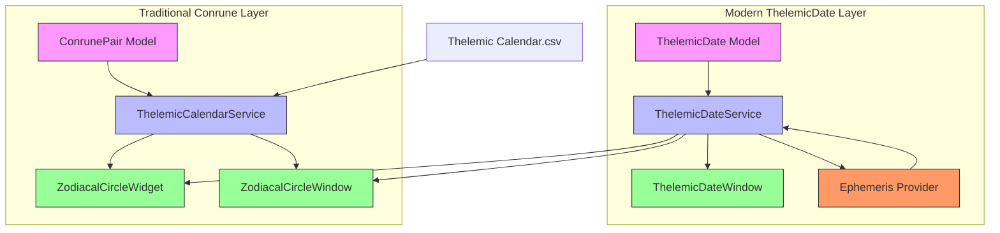
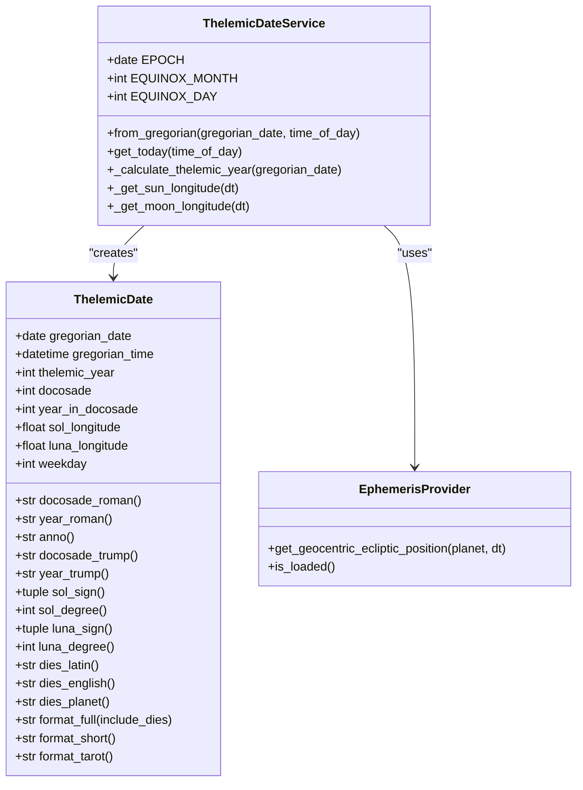
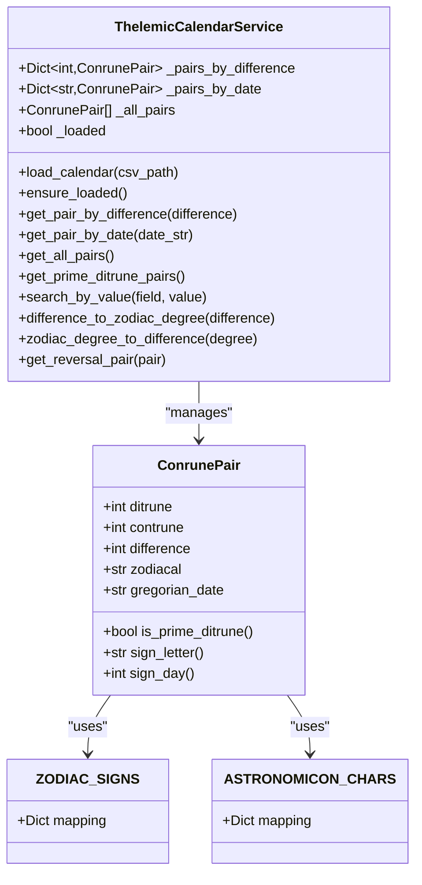
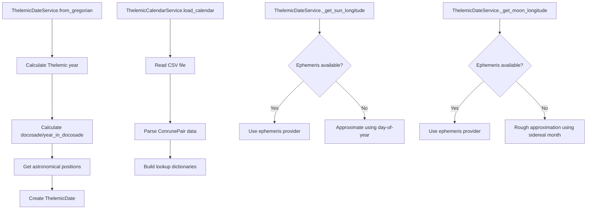
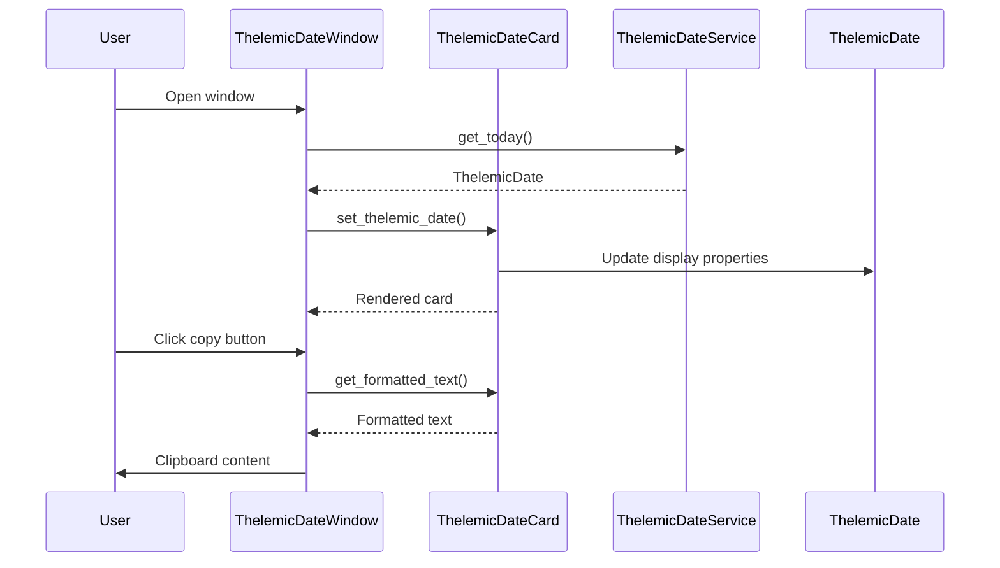

# Thelemic Calendar

<cite>
**Referenced Files in This Document**
- [thelemic_date_models.py](file://src/pillars/time_mechanics/models/thelemic_date_models.py)
- [thelemic_date_service.py](file://src/pillars/time_mechanics/services/thelemic_date_service.py)
- [thelemic_date_window.py](file://src/pillars/time_mechanics/ui/thelemic_date_window.py)
- [thelemic_calendar_models.py](file://src/shared/models/time/thelemic_calendar_models.py)
- [thelemic_calendar_service.py](file://src/shared/services/time/thelemic_calendar_service.py)
- [zodiacal_circle_widget.py](file://src/pillars/time_mechanics/ui/zodiacal_circle_widget.py)
- [zodiacal_circle_window.py](file://src/pillars/time_mechanics/ui/zodiacal_circle_window.py)
- [time_mechanics_hub.py](file://src/pillars/time_mechanics/ui/time_mechanics_hub.py)
- [Thelemic Calendar.csv](file://data/time_mechanics/Thelemic Calendar.csv)
</cite>

## Update Summary
**Changes Made**
- Added comprehensive documentation for the new ThelemicDate model and service layer
- Updated architecture overview to reflect dual calendar systems (ThelemicDate and Conrune pairs)
- Added detailed coverage of 22-year docosade cycles and Tarot correspondences
- Expanded documentation to include solar/lunar longitude calculations
- Added Latin day-of-week naming conventions and formatting
- Updated UI components documentation to include ThelemicDateWindow
- Enhanced service layer documentation with ephemeris integration

## Table of Contents
1. [Introduction](#introduction)
2. [Core Components](#core-components)
3. [Architecture Overview](#architecture-overview)
4. [Detailed Component Analysis](#detailed-component-analysis)
5. [Performance Considerations](#performance-considerations)
6. [Troubleshooting Guide](#troubleshooting-guide)
7. [Conclusion](#conclusion)

## Introduction
The Thelemic Calendar system encompasses two complementary temporal frameworks within the application: the ThelemicDate system for modern era dating and the traditional Conrune pair calendar for esoteric calculations. The ThelemicDate system, established by Aleister Crowley following the reception of Liber AL vel Legis in 1904, operates on a 22-year docosade cycle with solar and lunar longitude positions, Latin day-of-week naming, and Tarot correspondences. The Conrune pair calendar maps 364 days to Ditrune/Contrune pairs with zodiacal positions, forming the foundation for the Zodiacal Circle visualization and time mechanics. Together, these systems create a comprehensive temporal framework that bridges historical esoteric traditions with modern computational implementations.

## Core Components
The Thelemic Calendar system consists of two primary component sets that work together to provide comprehensive temporal functionality. The ThelemicDate system includes ThelemicDate model for modern era dating with 22-year docosade cycles, solar/lunar positions, and Latin day naming, and ThelemicDateService for astronomical calculations and date formatting. The Conrune pair system includes ConrunePair data models representing daily Conrune combinations, ThelemicCalendarService for calendar data access and conversions, and visualization components for the Zodiacal Circle. Both systems integrate through shared services and UI components, enabling seamless interaction between modern and traditional temporal frameworks.

**Section sources**
- [thelemic_date_models.py](file://src/pillars/time_mechanics/models/thelemic_date_models.py#L76-L238)
- [thelemic_date_service.py](file://src/pillars/time_mechanics/services/thelemic_date_service.py#L24-L210)
- [thelemic_calendar_models.py](file://src/shared/models/time/thelemic_calendar_models.py#L24-L61)
- [thelemic_calendar_service.py](file://src/shared/services/time/thelemic_calendar_service.py#L33-L315)

## Architecture Overview
The Thelemic Calendar system follows a dual-layered architecture with clear separation between modern and traditional temporal frameworks. The modern ThelemicDate layer (models/thelemic_date_models.py, services/thelemic_date_service.py, ui/thelemic_date_window.py) handles contemporary era dating with astronomical precision, featuring 22-year docosade cycles, solar/lunar longitude calculations, and Latin day naming. The traditional Conrune pair layer (shared/models/time/thelemic_calendar_models.py, shared/services/time/thelemic_calendar_service.py, pillars/time_mechanics/ui/zodiacal_circle_widget.py, pillars/time_mechanics/ui/zodiacal_circle_window.py) manages the 364-day esoteric calendar system with zodiacal positions and Conrune pair relationships. Data persistence occurs through CSV files (data/time_mechanics/Thelemic Calendar.csv) and ephemeral astronomical calculations. This architecture enables both historical esoteric applications and modern temporal analysis while maintaining clean separation of concerns.

**Diagram sources**
- [thelemic_date_models.py](file://src/pillars/time_mechanics/models/thelemic_date_models.py)
- [thelemic_date_service.py](file://src/pillars/time_mechanics/services/thelemic_date_service.py)
- [thelemic_date_window.py](file://src/pillars/time_mechanics/ui/thelemic_date_window.py)
- [thelemic_calendar_models.py](file://src/shared/models/time/thelemic_calendar_models.py)
- [thelemic_calendar_service.py](file://src/shared/services/time/thelemic_calendar_service.py)
- [zodiacal_circle_widget.py](file://src/pillars/time_mechanics/ui/zodiacal_circle_widget.py)
- [zodiacal_circle_window.py](file://src/pillars/time_mechanics/ui/zodiacal_circle_window.py)

## Detailed Component Analysis

### ThelemicDate System Analysis
The ThelemicDate system represents a sophisticated modern temporal framework that calculates dates according to the calendar established by Aleister Crowley in 1904. The system operates on a 22-year docosade cycle, with each year corresponding to a Major Arcana Tarot Trump. The ThelemicDate model encapsulates all temporal information including Gregorian date, Thelemic year calculations, docosade identification, solar and lunar longitude positions, and Latin day-of-week naming. The ThelemicDateService provides astronomical calculations using either precise ephemeris data or approximate positional calculations, ensuring flexibility across different computational environments.

**Diagram sources**
- [thelemic_date_models.py](file://src/pillars/time_mechanics/models/thelemic_date_models.py#L76-L238)
- [thelemic_date_service.py](file://src/pillars/time_mechanics/services/thelemic_date_service.py#L24-L210)

### Conrune Pair Calendar Analysis
The Conrune pair calendar system represents the traditional esoteric framework that maps 364 days to Ditrune/Contrune pairs with zodiacal positions. The ConrunePair model captures essential temporal data including Ditrune and Contrune values, difference calculations that determine degree positions, zodiacal sign and day information, and Gregorian date mappings. The ThelemicCalendarService provides comprehensive access methods for loading calendar data from CSV, retrieving pairs by difference or date, and performing complex conversions between zodiacal degrees and difference values. The service includes specialized methods for Prime Ditrune Sets (intercalary days) and reversal pair calculations using ternary string manipulation.

**Diagram sources**
- [thelemic_calendar_models.py](file://src/shared/models/time/thelemic_calendar_models.py#L24-L61)
- [thelemic_calendar_service.py](file://src/shared/services/time/thelemic_calendar_service.py#L33-L315)

### Service Layer Analysis
The service layer implements sophisticated temporal calculation and data management capabilities. ThelemicDateService handles modern astronomical calculations with fallback mechanisms for environments without ephemeris support, implementing approximate solar longitude calculations based on day-of-year positions and rough lunar longitude approximations using sidereal month calculations. ThelemicCalendarService provides comprehensive access to the 364-day esoteric calendar, with optimized data structures for O(1) lookups and specialized methods for complex temporal operations including Prime Ditrune calculations and reversal pair determinations.

**Diagram sources**
- [thelemic_date_service.py](file://src/pillars/time_mechanics/services/thelemic_date_service.py#L64-L210)
- [thelemic_calendar_service.py](file://src/shared/services/time/thelemic_calendar_service.py#L53-L113)

### User Interface Analysis
The user interface components provide comprehensive visualization and interaction capabilities for both temporal frameworks. ThelemicDateWindow offers a sophisticated display system with card-based design, date navigation controls, and export functionality. The interface supports date selection, text copying in multiple formats, and image export capabilities. The Zodiacal Circle components provide interactive visualization of the Conrune pair calendar with degree selection, tooltip information, and relationship line displays based on astrological aspects. Both UI systems integrate seamlessly with their respective service layers, providing intuitive access to temporal calculations and visualizations.

**Diagram sources**
- [thelemic_date_window.py](file://src/pillars/time_mechanics/ui/thelemic_date_window.py#L205-L491)
- [thelemic_date_service.py](file://src/pillars/time_mechanics/services/thelemic_date_service.py#L196-L210)

## Performance Considerations
The Thelemic Calendar system implements several performance optimization strategies tailored to its dual-framework architecture. ThelemicDateService utilizes lazy initialization for ephemeris providers and falls back to approximate calculations when precise astronomical data is unavailable, minimizing computational overhead. ThelemicCalendarService employs in-memory data structures with hash maps for O(1) lookup performance across 364 calendar entries, while maintaining separate dictionaries for difference and date-based access. The UI components implement efficient rendering strategies, with the Zodiacal Circle widget pre-calculating hitboxes and using optimized drawing routines. Both service layers implement caching mechanisms and avoid redundant calculations through computed properties and memoized results.

## Troubleshooting Guide
Common issues in the Thelemic Calendar system typically involve data loading, astronomical calculations, and UI rendering. For ThelemicDateService, verify ephemeris provider availability and check log warnings for initialization failures. The CSV file path for Conrune pair data should be verified in the ThelemicCalendarService load_calendar method. UI components may fail to render if the Astronomicon font is not available in the system font database. Date formatting issues often stem from incorrect Gregorian date formats or timezone handling. ThelemicDateService requires proper timezone handling for astronomical calculations, while Conrune pair lookups depend on consistent date string formatting.

**Section sources**
- [thelemic_date_service.py](file://src/pillars/time_mechanics/services/thelemic_date_service.py#L51-L63)
- [thelemic_calendar_service.py](file://src/shared/services/time/thelemic_calendar_service.py#L63-L75)
- [thelemic_date_window.py](file://src/pillars/time_mechanics/ui/thelemic_date_window.py#L117-L131)

## Conclusion
The Thelemic Calendar system represents a sophisticated integration of modern astronomical calculations and traditional esoteric temporal frameworks. The dual-system architecture successfully bridges historical Crowley-era dating with classical Conrune pair mathematics, providing both precise astronomical positioning and symbolic esoteric calculations. The implementation demonstrates excellent software engineering practices with clear separation of concerns, comprehensive error handling, and flexible fallback mechanisms. The system's modular design enables easy extension and maintenance while supporting diverse use cases from academic research to spiritual practice. This comprehensive temporal framework serves as a foundation for advanced time-related functionality within the application, facilitating both practical date calculations and deeper esoteric interpretations.