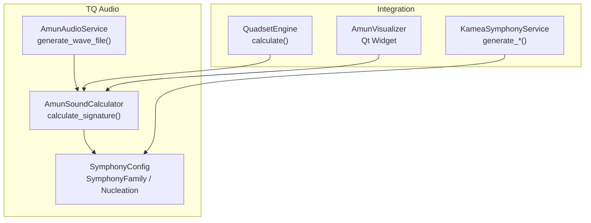
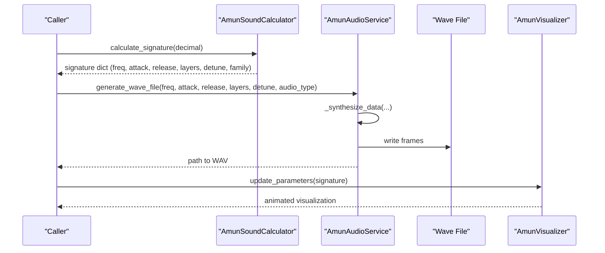
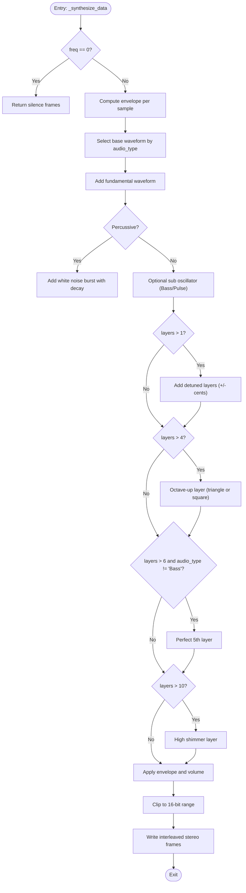
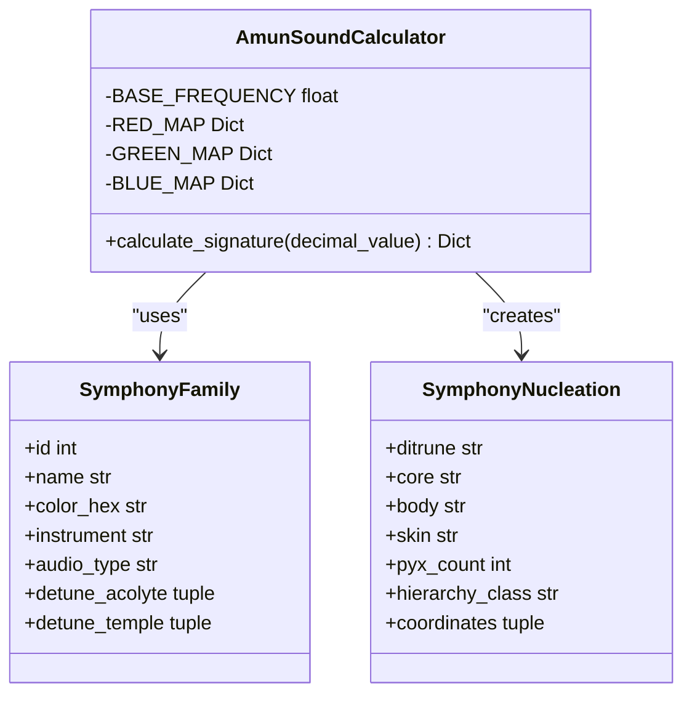
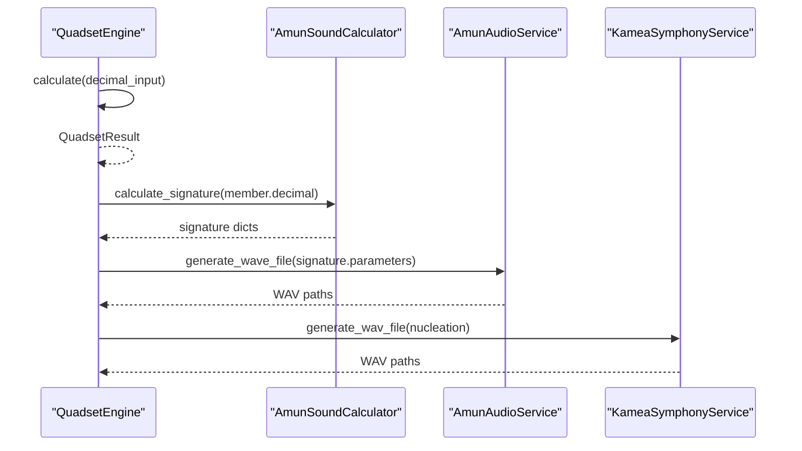
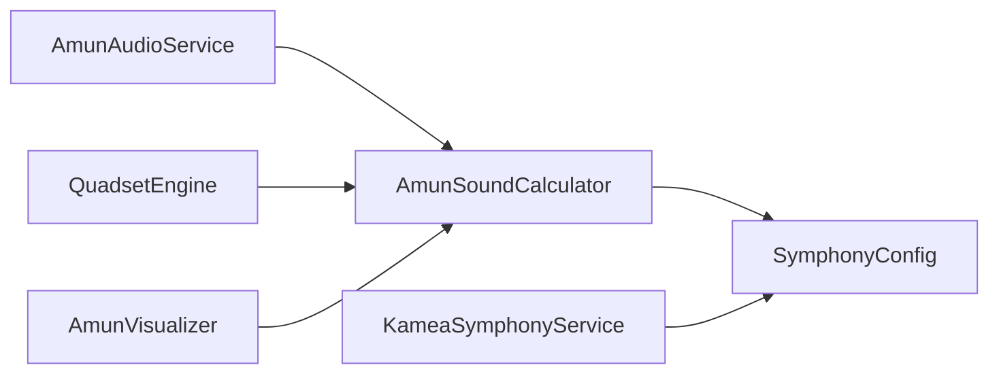

# Amun Audio Service

<cite>
**Referenced Files in This Document**
- [amun_audio_service.py](file://src/pillars/tq/services/amun_audio_service.py)
- [amun_sound.py](file://src/pillars/tq/models/amun_sound.py)
- [symphony_config.py](file://src/pillars/tq/models/symphony_config.py)
- [kamea_symphony_service.py](file://src/pillars/tq/services/kamea_symphony_service.py)
- [quadset_engine.py](file://src/pillars/tq/services/quadset_engine.py)
- [test_amun_audio.py](file://tests/test_amun_audio.py)
- [test_amun_sound.py](file://tests/test_amun_sound.py)
- [amun_visualizer.py](file://src/pillars/tq/ui/amun_visualizer.py)
- [test_audio_aplay.py](file://scripts/test_audio_aplay.py)
</cite>

## Table of Contents
1. [Introduction](#introduction)
2. [Project Structure](#project-structure)
3. [Core Components](#core-components)
4. [Architecture Overview](#architecture-overview)
5. [Detailed Component Analysis](#detailed-component-analysis)
6. [Dependency Analysis](#dependency-analysis)
7. [Performance Considerations](#performance-considerations)
8. [Troubleshooting Guide](#troubleshooting-guide)
9. [Conclusion](#conclusion)
10. [Appendices](#appendices)

## Introduction
This document provides API documentation for the AmunAudioService, which generates Amun Sound Signatures as WAV files using an additive synthesis engine. It explains the generate_wave_file method and the internal synthesis pipeline, including envelope shaping, waveform selection, layer stacking, and detuning. It also describes how the service integrates with the TQ pillar to sonify numerical patterns and geometric transitions, and covers file handling, temporary file management, and performance considerations for real-time audio generation.

## Project Structure
The Amun Audio Service resides in the TQ (Trigrammaton QBLH) pillar under src/pillars/tq. The primary service is implemented in amun_audio_service.py, while the TQ sound signature calculation is implemented in amun_sound.py. The orchestral archetypes and harmonics are defined in symphony_config.py. A complementary cinematic audio engine (KameaSymphonyService) exists in kamea_symphony_service.py. The QuadsetEngine orchestrates numerical transformations for geometric transitions in the TQ pillar.

**Diagram sources**
- [amun_audio_service.py](file://src/pillars/tq/services/amun_audio_service.py#L12-L39)
- [amun_sound.py](file://src/pillars/tq/models/amun_sound.py#L62-L136)
- [symphony_config.py](file://src/pillars/tq/models/symphony_config.py#L1-L46)
- [quadset_engine.py](file://src/pillars/tq/services/quadset_engine.py#L19-L81)
- [kamea_symphony_service.py](file://src/pillars/tq/services/kamea_symphony_service.py#L22-L70)
- [amun_visualizer.py](file://src/pillars/tq/ui/amun_visualizer.py#L38-L68)

**Section sources**
- [amun_audio_service.py](file://src/pillars/tq/services/amun_audio_service.py#L12-L39)
- [amun_sound.py](file://src/pillars/tq/models/amun_sound.py#L62-L136)
- [symphony_config.py](file://src/pillars/tq/models/symphony_config.py#L1-L46)
- [quadset_engine.py](file://src/pillars/tq/services/quadset_engine.py#L19-L81)
- [kamea_symphony_service.py](file://src/pillars/tq/services/kamea_symphony_service.py#L22-L70)
- [amun_visualizer.py](file://src/pillars/tq/ui/amun_visualizer.py#L38-L68)

## Core Components
- AmunAudioService: Provides methods to generate WAV files from frequency inputs using additive synthesis. It supports parameters for attack, release, layers, detuning, and audio type (Standard, Percussive, Plucked).
- AmunSoundCalculator: Converts a Ditrune (0–728) into a sound signature dictionary containing frequency, dynamics, layers/detune, and orchestral archetype metadata.
- SymphonyConfig: Defines orchestral families and harmonics used by both Amun and Kamea engines.
- QuadsetEngine: Orchestrates numerical transformations and geometric transitions for the TQ pillar, feeding into the Amun sound pipeline.
- KameaSymphonyService: A cinematic audio engine that generates complex textures and sequences using NumPy and SciPy; complements AmunAudioService for richer orchestral sonifications.
- AmunVisualizer: A Qt widget that visualizes Amun parameters in real time, driven by the same signature data.

**Section sources**
- [amun_audio_service.py](file://src/pillars/tq/services/amun_audio_service.py#L12-L39)
- [amun_sound.py](file://src/pillars/tq/models/amun_sound.py#L62-L136)
- [symphony_config.py](file://src/pillars/tq/models/symphony_config.py#L1-L46)
- [quadset_engine.py](file://src/pillars/tq/services/quadset_engine.py#L19-L81)
- [kamea_symphony_service.py](file://src/pillars/tq/services/kamea_symphony_service.py#L22-L70)
- [amun_visualizer.py](file://src/pillars/tq/ui/amun_visualizer.py#L38-L68)

## Architecture Overview
The Amun Audio Service sits at the intersection of the TQ numerical pipeline and the audio synthesis engine. Numerical patterns (Ditrune values) are transformed into sound parameters by AmunSoundCalculator, then synthesized into WAV files by AmunAudioService. The QuadsetEngine provides the broader geometric transition context, while KameaSymphonyService offers cinematic orchestration for more complex audio scenarios.

**Diagram sources**
- [amun_sound.py](file://src/pillars/tq/models/amun_sound.py#L62-L136)
- [amun_audio_service.py](file://src/pillars/tq/services/amun_audio_service.py#L12-L39)
- [amun_visualizer.py](file://src/pillars/tq/ui/amun_visualizer.py#L38-L68)

## Detailed Component Analysis

### AmunAudioService API
- Method: generate_wave_file(freq, attack=0.1, release=0.5, layers=1, detune=0.0, audio_type='Standard')
  - Purpose: Generate a temporary WAV file using additive synthesis.
  - Parameters:
    - freq: Fundamental frequency in Hz.
    - attack: Attack time in seconds.
    - release: Release time in seconds.
    - layers: Number of stacked harmonics/layers for richness.
    - detune: Detuning in cents for chorus-like stacking.
    - audio_type: Waveform/archetype selector (Standard, Percussive, Plucked).
  - Behavior:
    - Duration is computed from attack + release + small buffer.
    - Uses 44.1 kHz, stereo 16-bit WAV.
    - Calls internal _synthesize_data to build interleaved stereo frames.
  - Returns: Path to the generated temporary WAV file.

- Method: generate_sequence(signatures, note_duration=1.0)
  - Purpose: Concatenate multiple signatures into a single WAV file.
  - Parameters:
    - signatures: List of signature dicts (from calculate_signature).
    - note_duration: Per-note duration in seconds.
  - Behavior:
    - Iterates through signatures, extracting parameters from each signature.
    - Renders each note to fixed-length buffers and appends them.
  - Returns: Path to the concatenated WAV file.

- Internal method: _synthesize_data(freq, attack, release, layers, detune, n_samples, sample_rate, audio_type)
  - Purpose: Core additive synthesis engine.
  - Envelope: Linear A/R envelope.
  - Waveforms: sine, square, saw, brass (saw + triangle mix).
  - Layers:
    - Fundamental layer.
    - Optional sub oscillator (half-frequency) for bass/pulse.
    - Additional layers: detuned chorus, octave-up, perfect fifth, shimmer.
  - Volume scaling: Base volume adjusted by sqrt(layers) and boosted for Ambient/Bass.
  - Output: Interleaved stereo frames packed as 16-bit integers.

**Diagram sources**
- [amun_audio_service.py](file://src/pillars/tq/services/amun_audio_service.py#L122-L256)

**Section sources**
- [amun_audio_service.py](file://src/pillars/tq/services/amun_audio_service.py#L12-L39)
- [amun_audio_service.py](file://src/pillars/tq/services/amun_audio_service.py#L41-L119)
- [amun_audio_service.py](file://src/pillars/tq/services/amun_audio_service.py#L122-L256)

### AmunSoundCalculator and Symphony Families
- AmunSoundCalculator.calculate_signature(decimal_value)
  - Converts a Ditrune (0–728) into:
    - Frequency mapping (Red channel).
    - Dynamics mapping (Green channel) for attack/release.
    - Layers/detune mapping (Blue channel) for richness.
    - Family metadata (SymphonyFamily) including instrument, audio_type, and color.
  - Returns a structured signature dict suitable for AmunAudioService.

- SymphonyConfig
  - Defines 9 orchestral families with associated audio types and harmonics.
  - Provides constants for octave frequencies and scale ratios.

**Diagram sources**
- [amun_sound.py](file://src/pillars/tq/models/amun_sound.py#L62-L136)
- [symphony_config.py](file://src/pillars/tq/models/symphony_config.py#L1-L46)

**Section sources**
- [amun_sound.py](file://src/pillars/tq/models/amun_sound.py#L62-L136)
- [symphony_config.py](file://src/pillars/tq/models/symphony_config.py#L1-L46)

### Integration with TQ Geometric Transitions
- QuadsetEngine.calculate(decimal_input)
  - Orchestrates transformations (original, conrune, reversal, conrune-reversal) and computes derived values (upper/lower diffs, transgram).
  - Produces a QuadsetResult used for geometric transition analysis.
- AmunSoundCalculator.calculate_signature(decimal_value)
  - Converts a single Ditrune into a sound signature for sonification.
- KameaSymphonyService.generate_wav_file(nucleation, duration)
  - Generates cinematic audio from a SymphonyNucleation, complementing AmunAudioService for richer textures.

**Diagram sources**
- [quadset_engine.py](file://src/pillars/tq/services/quadset_engine.py#L19-L81)
- [amun_sound.py](file://src/pillars/tq/models/amun_sound.py#L62-L136)
- [amun_audio_service.py](file://src/pillars/tq/services/amun_audio_service.py#L12-L39)
- [kamea_symphony_service.py](file://src/pillars/tq/services/kamea_symphony_service.py#L22-L70)

**Section sources**
- [quadset_engine.py](file://src/pillars/tq/services/quadset_engine.py#L19-L81)
- [amun_sound.py](file://src/pillars/tq/models/amun_sound.py#L62-L136)
- [kamea_symphony_service.py](file://src/pillars/tq/services/kamea_symphony_service.py#L22-L70)

### Real-Time Visualization
- AmunVisualizer.update_parameters(params)
  - Driven by signature data to animate geometry, layers, and rotation based on attack and red/blue/green channels.
- AmunVisualizer.paintEvent(...)
  - Renders concentric polygons with alternating rotations and opacities, reflecting the harmonic density and attack dynamics.

**Section sources**
- [amun_visualizer.py](file://src/pillars/tq/ui/amun_visualizer.py#L38-L68)
- [amun_visualizer.py](file://src/pillars/tq/ui/amun_visualizer.py#L89-L195)

## Dependency Analysis
- AmunAudioService depends on:
  - Python wave, struct, tempfile, math, random for WAV writing and synthesis.
  - AmunSoundCalculator for parameter extraction.
  - SymphonyConfig for family metadata.
- AmunSoundCalculator depends on:
  - TernaryService and NumberPropertiesService indirectly via QuadsetEngine.
  - SymphonyConfig for family mapping.
- KameaSymphonyService depends on:
  - NumPy, SciPy for efficient signal processing and convolution.
  - SymphonyConfig for family harmonics and ratios.

**Diagram sources**
- [amun_audio_service.py](file://src/pillars/tq/services/amun_audio_service.py#L12-L39)
- [amun_sound.py](file://src/pillars/tq/models/amun_sound.py#L62-L136)
- [symphony_config.py](file://src/pillars/tq/models/symphony_config.py#L1-L46)
- [kamea_symphony_service.py](file://src/pillars/tq/services/kamea_symphony_service.py#L22-L70)
- [quadset_engine.py](file://src/pillars/tq/services/quadset_engine.py#L19-L81)
- [amun_visualizer.py](file://src/pillars/tq/ui/amun_visualizer.py#L38-L68)

**Section sources**
- [amun_audio_service.py](file://src/pillars/tq/services/amun_audio_service.py#L12-L39)
- [amun_sound.py](file://src/pillars/tq/models/amun_sound.py#L62-L136)
- [symphony_config.py](file://src/pillars/tq/models/symphony_config.py#L1-L46)
- [kamea_symphony_service.py](file://src/pillars/tq/services/kamea_symphony_service.py#L22-L70)
- [quadset_engine.py](file://src/pillars/tq/services/quadset_engine.py#L19-L81)
- [amun_visualizer.py](file://src/pillars/tq/ui/amun_visualizer.py#L38-L68)

## Performance Considerations
- Sample rate and buffer sizing:
  - Fixed 44.1 kHz sample rate ensures compatibility and predictable durations.
  - Duration equals attack + release + small buffer; for sequences, note_duration controls per-note length.
- Layer scaling:
  - Base volume scaled by inverse square root of layers to reduce clipping risk.
  - Additional layers increase CPU load; keep layers reasonable for real-time performance.
- Envelope optimization:
  - Early exit when envelope drops below threshold avoids unnecessary computation.
- Detuning:
  - Detune in cents uses exponential scaling; moderate values improve richness without excessive overhead.
- File I/O:
  - Temporary WAV files are written once per generation; ensure cleanup after playback.
- Visualization:
  - AmunVisualizer runs at ~60 FPS; keep animation updates minimal for responsiveness.

[No sources needed since this section provides general guidance]

## Troubleshooting Guide
- WAV file creation:
  - Verify that generate_wave_file returns a path ending with .wav and that the file exists.
  - Confirm sample rate, channels, and sample width match expectations.
- Silence output:
  - Zero frequency produces silence; confirm non-zero inputs.
- Sequence generation:
  - Ensure each signature contains the expected parameters (freq, attack, release, layers, detune, audio_type).
- Playback:
  - Use aplay or equivalent to test playback; ensure the file path is correct and permissions allow reading.
- Tests:
  - Unit tests validate basic WAV properties and silence behavior.

**Section sources**
- [test_amun_audio.py](file://tests/test_amun_audio.py#L13-L45)
- [test_amun_sound.py](file://tests/test_amun_sound.py#L14-L79)
- [test_audio_aplay.py](file://scripts/test_audio_aplay.py#L8-L31)

## Conclusion
The AmunAudioService provides a robust, parameterized additive synthesis pipeline for generating Amun Sound Signatures as WAV files. It integrates tightly with the TQ pillar’s numerical and geometric transition systems, enabling sonification of numerical patterns and transitions. The service supports rich harmonic content via layer stacking, detuning, and envelope shaping, while maintaining practical performance characteristics for real-time generation. Complementary engines like KameaSymphonyService and AmunVisualizer extend the ecosystem to cinematic textures and real-time visualization.

## Appendices

### API Reference: AmunAudioService
- generate_wave_file(freq, attack=0.1, release=0.5, layers=1, detune=0.0, audio_type='Standard') -> str
  - Generates a temporary WAV file from frequency inputs and synthesis parameters.
- generate_sequence(signatures, note_duration=1.0) -> str
  - Concatenates multiple signatures into a single WAV file.
- _synthesize_data(freq, attack, release, layers, detune, n_samples, sample_rate, audio_type) -> bytes
  - Internal synthesis routine building interleaved stereo frames.

**Section sources**
- [amun_audio_service.py](file://src/pillars/tq/services/amun_audio_service.py#L12-L39)
- [amun_audio_service.py](file://src/pillars/tq/services/amun_audio_service.py#L41-L119)
- [amun_audio_service.py](file://src/pillars/tq/services/amun_audio_service.py#L122-L256)

### Example Workflows
- Generate a 440 Hz tone with 0.2 s attack and 0.8 s release:
  - Call generate_wave_file with freq=440.0, attack=0.2, release=0.8, layers=1, detune=0.0, audio_type='Standard'.
- Create layered sounds for quadset members:
  - Use QuadsetEngine.calculate to obtain member decimals, then call AmunSoundCalculator.calculate_signature for each member, and finally generate_wave_file with extracted parameters.
- Produce percussive effects for transition events:
  - Use audio_type='Percussive' to shorten attack and add noise burst during early time segments.

**Section sources**
- [quadset_engine.py](file://src/pillars/tq/services/quadset_engine.py#L19-L81)
- [amun_sound.py](file://src/pillars/tq/models/amun_sound.py#L62-L136)
- [amun_audio_service.py](file://src/pillars/tq/services/amun_audio_service.py#L12-L39)