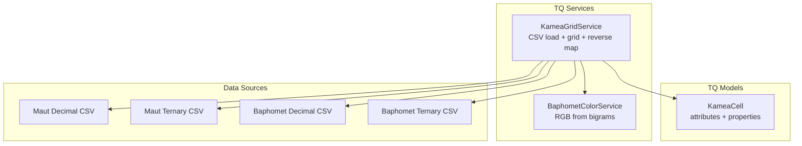
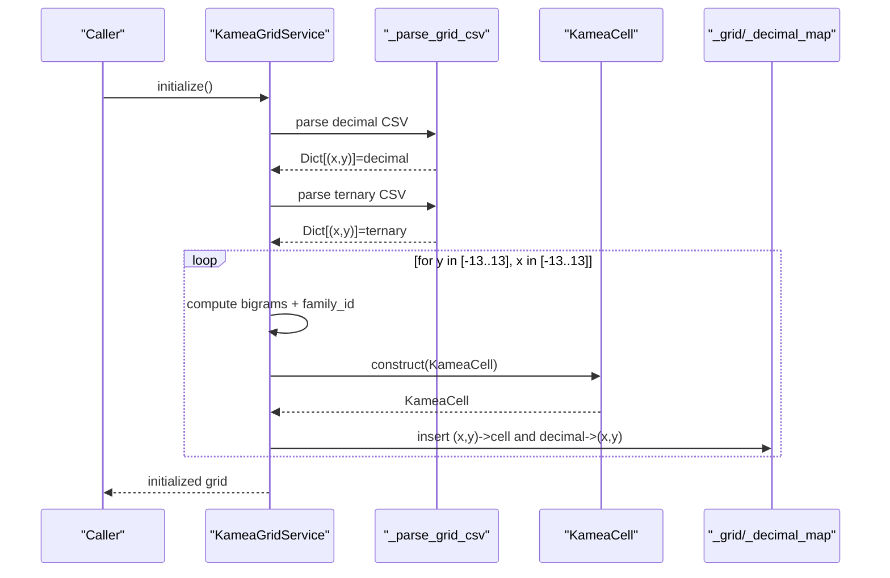
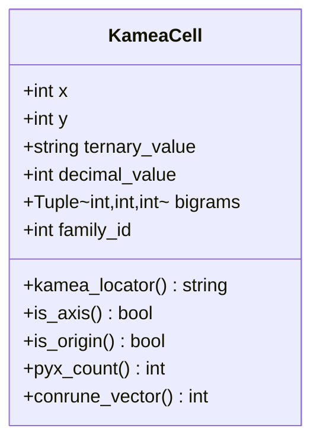
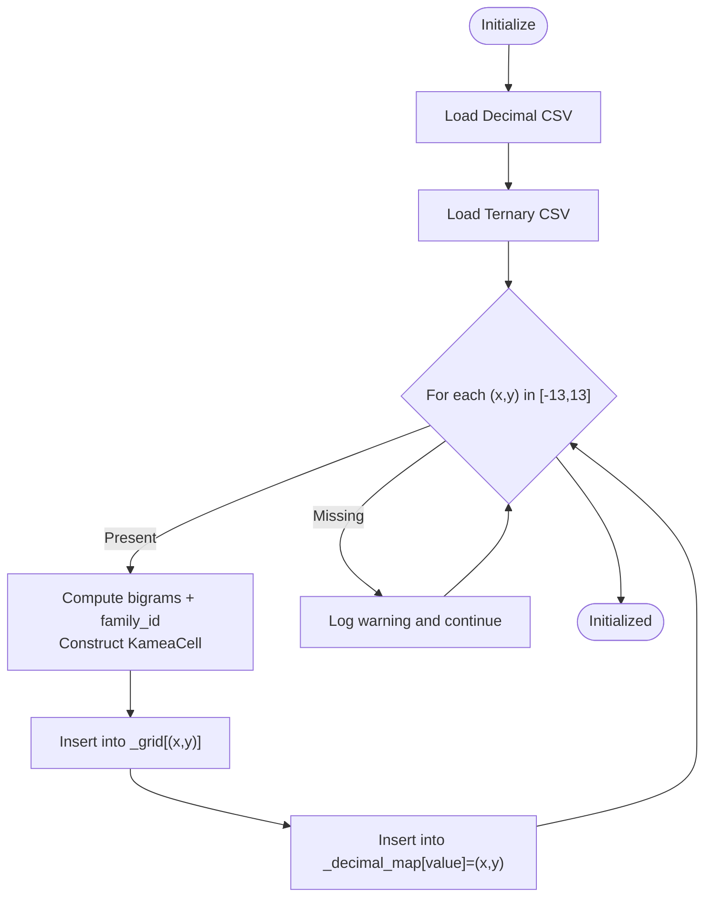
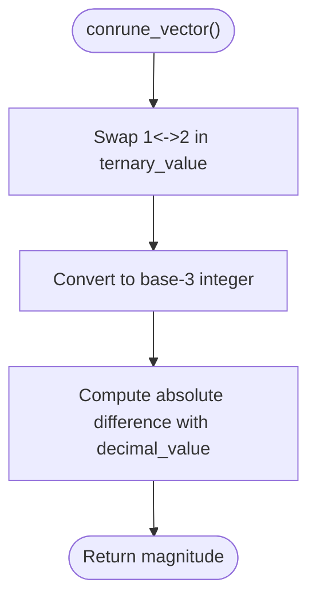
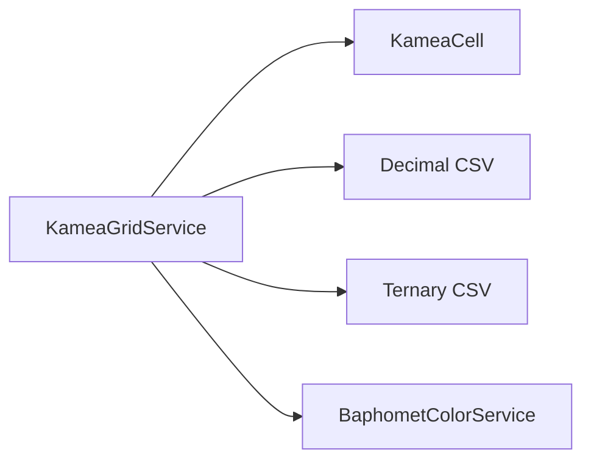

# Cell Management and Data Model

<cite>
**Referenced Files in This Document**
- [kamea_cell.py](file://src/pillars/tq/models/kamea_cell.py)
- [kamea_grid_service.py](file://src/pillars/tq/services/kamea_grid_service.py)
- [kamea_baphomet_grid.csv](file://src/pillars/tq/data/kamea_baphomet_grid.csv)
- [kamea_baphomet_ternary.csv](file://src/pillars/tq/data/kamea_baphomet_ternary.csv)
- [kamea_maut.csv](file://Docs/kamea/kamea_maut.csv)
- [kamea_maut_ternary - Sheet1.csv](file://Docs/kamea/kamea_maut_ternary - Sheet1.csv)
- [The_Kamea_Doctrine.md](file://Docs/kamea/The_Kamea_Doctrine.md)
- [baphomet_color_service.py](file://src/pillars/tq/services/baphomet_color_service.py)
</cite>

## Table of Contents
1. [Introduction](#introduction)
2. [Project Structure](#project-structure)
3. [Core Components](#core-components)
4. [Architecture Overview](#architecture-overview)
5. [Detailed Component Analysis](#detailed-component-analysis)
6. [Dependency Analysis](#dependency-analysis)
7. [Performance Considerations](#performance-considerations)
8. [Troubleshooting Guide](#troubleshooting-guide)
9. [Conclusion](#conclusion)
10. [Appendices](#appendices)

## Introduction
This document explains the KameaCell data model and its management within the KameaGridService. It covers the attributes and derived properties of KameaCell, how cells are stored and indexed in the grid, and how the KameaGridService constructs the 27x27 grid from validated CSV sources. It also details the conrune_vector calculation, provides examples of accessing cell properties, and explains how to interpret pyx density. Finally, it addresses performance characteristics of O(1) versus O(N) access patterns and memory usage for storing 729 cells.

## Project Structure
The Kamea system lives under the TQ (Ternary Quantization) pillar. The relevant files are:
- KameaCell model: defines the cell data structure and derived properties
- KameaGridService: loads CSVs, constructs cells, stores them in dictionaries, and exposes lookups
- CSV data sources: decimal and ternary grids for two variants (Maut and Baphomet)
- Color service: maps ternary values to colors for visualization
- Doctrine documentation: foundational definitions for regions, bigrams, and physics

**Diagram sources**
- [kamea_cell.py](file://src/pillars/tq/models/kamea_cell.py#L1-L59)
- [kamea_grid_service.py](file://src/pillars/tq/services/kamea_grid_service.py#L1-L220)
- [baphomet_color_service.py](file://src/pillars/tq/services/baphomet_color_service.py#L1-L62)
- [kamea_baphomet_grid.csv](file://src/pillars/tq/data/kamea_baphomet_grid.csv#L1-L29)
- [kamea_baphomet_ternary.csv](file://src/pillars/tq/data/kamea_baphomet_ternary.csv#L1-L29)
- [kamea_maut.csv](file://Docs/kamea/kamea_maut.csv#L1-L28)
- [kamea_maut_ternary - Sheet1.csv](file://Docs/kamea/kamea_maut_ternary - Sheet1.csv#L1-L28)

**Section sources**
- [kamea_cell.py](file://src/pillars/tq/models/kamea_cell.py#L1-L59)
- [kamea_grid_service.py](file://src/pillars/tq/services/kamea_grid_service.py#L1-L220)
- [kamea_baphomet_grid.csv](file://src/pillars/tq/data/kamea_baphomet_grid.csv#L1-L29)
- [kamea_baphomet_ternary.csv](file://src/pillars/tq/data/kamea_baphomet_ternary.csv#L1-L29)
- [kamea_maut.csv](file://Docs/kamea/kamea_maut.csv#L1-L28)
- [kamea_maut_ternary - Sheet1.csv](file://Docs/kamea/kamea_maut_ternary - Sheet1.csv#L1-L28)
- [baphomet_color_service.py](file://src/pillars/tq/services/baphomet_color_service.py#L1-L62)

## Core Components
- KameaCell: immutable-like data container for a single grid cell with:
  - x, y: Cartesian coordinates in [-13, +13]
  - ternary_value: 6-digit ternary string
  - decimal_value: integer in [0, 728]
  - bigrams: tuple of three bigram values (Region, Area, Cell)
  - family_id: derived from Region (0–8)
  - Derived properties:
    - kamea_locator: "Region-Area-Cell" string
    - is_axis: True if x==0 or y==0
    - is_origin: True if x==0 and y==0
    - pyx_count: count of '0' digits (dimensional density)
    - conrune_vector: magnitude of vector between self and its Conrune

- KameaGridService: orchestrates grid construction and access:
  - Stores cells in a dictionary keyed by (x, y)
  - Maintains a reverse map from decimal_value to (x, y)
  - Loads from validated CSVs (Maut or Baphomet)
  - Provides O(1) lookups by coordinates and O(N) by locator
  - Computes Quadsets and chord values

**Section sources**
- [kamea_cell.py](file://src/pillars/tq/models/kamea_cell.py#L1-L59)
- [kamea_grid_service.py](file://src/pillars/tq/services/kamea_grid_service.py#L1-L220)

## Architecture Overview
The grid is built from CSV files. The service parses both decimal and ternary CSVs, aligns coordinates, computes bigrams and family_id, and instantiates KameaCell objects. Two dictionaries provide fast access:
- _grid: (x, y) -> KameaCell
- _decimal_map: decimal_value -> (x, y)

**Diagram sources**
- [kamea_grid_service.py](file://src/pillars/tq/services/kamea_grid_service.py#L120-L179)
- [kamea_cell.py](file://src/pillars/tq/models/kamea_cell.py#L1-L59)

## Detailed Component Analysis

### KameaCell Data Model
KameaCell encapsulates the essential identity of a grid cell:
- Attributes
  - x, y: Cartesian coordinates
  - ternary_value: 6-digit ternary string
  - decimal_value: integer in [0, 728]
  - bigrams: (Region, Area, Cell) computed from ternary digits
  - family_id: Region value (0–8)
- Derived Properties
  - kamea_locator: "Region-Area-Cell"
  - is_axis: True if on X or Y axis
  - is_origin: True if at center (0,0)
  - pyx_count: count of '0' digits (dimensional density)
  - conrune_vector: absolute difference between decimal_value and its Conrune

Implementation highlights:
- Bigrams are computed from indices 0,1,2,3,4,5 of the 6-digit ternary string:
  - Region (Core): indices 2,3
  - Area (Body): indices 1,4
  - Cell (Skin): indices 0,5
- family_id equals Region
- conrune_vector applies a polarity swap (1↔2) across all positions, converts to base-3 integer, then takes absolute difference with decimal_value

**Diagram sources**
- [kamea_cell.py](file://src/pillars/tq/models/kamea_cell.py#L1-L59)

**Section sources**
- [kamea_cell.py](file://src/pillars/tq/models/kamea_cell.py#L1-L59)
- [The_Kamea_Doctrine.md](file://Docs/kamea/The_Kamea_Doctrine.md#L45-L80)

### KameaGridService: Storage and Indexing
- Internal state
  - _grid: Dict[Tuple[int,int], KameaCell] stores cells by Cartesian coordinates
  - _decimal_map: Dict[int, Tuple[int,int]] maps decimal_value to (x,y) for reverse lookup
  - variant: selects Maut or Baphomet CSV sources
- Initialization and CSV parsing
  - _parse_grid_csv reads CSV rows and columns to build coordinate-to-value maps
  - _load_grid iterates the 27x27 grid, validates presence of both decimal and ternary values, ensures 6-digit ternary, computes bigrams and family_id, constructs KameaCell, and populates both dictionaries
- Access patterns
  - get_cell(x,y): O(1) lookup in _grid
  - get_cell_by_locator(region,area,cell): O(N) scan over 729 cells
  - get_chord_values(decimal_value): O(1) reverse lookup via _decimal_map, then O(1) Quadset retrieval, then O(1) deduplication and sorting
  - get_quadset(x,y): O(1) per cell lookup across up to 4 coordinates depending on variant

**Diagram sources**
- [kamea_grid_service.py](file://src/pillars/tq/services/kamea_grid_service.py#L120-L179)

**Section sources**
- [kamea_grid_service.py](file://src/pillars/tq/services/kamea_grid_service.py#L1-L220)

### Derived Property: conrune_vector
The conrune_vector property measures the entanglement distance between a cell and its Conrune:
- Conrune operation swaps 1s and 2s while keeping 0s unchanged
- Convert the resulting ternary string to base-3 integer
- Return absolute difference between decimal_value and Conrune decimal

**Diagram sources**
- [kamea_cell.py](file://src/pillars/tq/models/kamea_cell.py#L44-L59)

**Section sources**
- [kamea_cell.py](file://src/pillars/tq/models/kamea_cell.py#L44-L59)
- [The_Kamea_Doctrine.md](file://Docs/kamea/The_Kamea_Doctrine.md#L172-L183)

### Accessing Cell Properties and Interpreting Results
- Accessing a cell by coordinates:
  - Use get_cell(x,y) to retrieve a KameaCell in O(1)
  - Example paths:
    - [get_cell](file://src/pillars/tq/services/kamea_grid_service.py#L54-L59)
- Computing Quadsets:
  - Use get_quadset(x,y) to retrieve related cells based on variant
  - Example paths:
    - [get_quadset](file://src/pillars/tq/services/kamea_grid_service.py#L77-L101)
- Finding a cell by locator (Region-Area-Cell):
  - Use get_cell_by_locator(region,area,cell) for O(N) scan
  - Example paths:
    - [get_cell_by_locator](file://src/pillars/tq/services/kamea_grid_service.py#L60-L71)
- Interpreting pyx density:
  - Use pyx_count to count zeros in ternary_value
  - Example paths:
    - [pyx_count](file://src/pillars/tq/models/kamea_cell.py#L38-L43)
- Color mapping:
  - Use get_cell_color(cell) to resolve RGB color
  - Example paths:
    - [get_cell_color](file://src/pillars/tq/services/kamea_grid_service.py#L73-L76)
    - [resolve_color](file://src/pillars/tq/services/baphomet_color_service.py#L36-L62)

**Section sources**
- [kamea_grid_service.py](file://src/pillars/tq/services/kamea_grid_service.py#L54-L101)
- [kamea_cell.py](file://src/pillars/tq/models/kamea_cell.py#L38-L59)
- [baphomet_color_service.py](file://src/pillars/tq/services/baphomet_color_service.py#L36-L62)

### Calculating Conrune Relationships
- Compute Conrune of a cell’s ternary_value and compare to decimal_value
- Use conrune_vector to get the unique magnitude
- Example paths:
  - [conrune_vector](file://src/pillars/tq/models/kamea_cell.py#L44-L59)
  - [The_Kamea_Doctrine.md](file://Docs/kamea/The_Kamea_Doctrine.md#L172-L183)

**Section sources**
- [kamea_cell.py](file://src/pillars/tq/models/kamea_cell.py#L44-L59)
- [The_Kamea_Doctrine.md](file://Docs/kamea/The_Kamea_Doctrine.md#L172-L183)

### Interpreting Pyx Density
- pyx_count counts zeros in the 6-digit ternary string
- The Kamea Doctrine categorizes cells by Hamming weight of zeros across 28 strata
- Example paths:
  - [pyx_count](file://src/pillars/tq/models/kamea_cell.py#L38-L43)
  - [The_Kamea_Doctrine.md](file://Docs/kamea/The_Kamea_Doctrine.md#L153-L169)

**Section sources**
- [kamea_cell.py](file://src/pillars/tq/models/kamea_cell.py#L38-L43)
- [The_Kamea_Doctrine.md](file://Docs/kamea/The_Kamea_Doctrine.md#L153-L169)

## Dependency Analysis
- KameaCell depends on:
  - Its own attributes and properties
- KameaGridService depends on:
  - KameaCell for constructing cells
  - CSV files for data sources
  - BaphometColorService for color resolution
- CSV parsing is centralized in _parse_grid_csv and used by _load_grid

**Diagram sources**
- [kamea_grid_service.py](file://src/pillars/tq/services/kamea_grid_service.py#L1-L220)
- [kamea_cell.py](file://src/pillars/tq/models/kamea_cell.py#L1-L59)
- [baphomet_color_service.py](file://src/pillars/tq/services/baphomet_color_service.py#L1-L62)

**Section sources**
- [kamea_grid_service.py](file://src/pillars/tq/services/kamea_grid_service.py#L1-L220)
- [kamea_cell.py](file://src/pillars/tq/models/kamea_cell.py#L1-L59)
- [baphomet_color_service.py](file://src/pillars/tq/services/baphomet_color_service.py#L1-L62)

## Performance Considerations
- Memory usage
  - Two dictionaries store 729 cells:
    - _grid: 729 entries of (x,y) -> KameaCell
    - _decimal_map: 729 entries of decimal_value -> (x,y)
  - Each KameaCell holds small immutable strings and integers; memory footprint is modest
- Access patterns
  - get_cell(x,y): O(1) average-case dictionary lookup
  - get_cell_by_locator(region,area,cell): O(N) scanning 729 cells; acceptable given small N
  - get_chord_values(decimal_value): O(1) reverse lookup plus O(1) Quadset retrieval plus O(1) deduplication/sorting
- Recommendations
  - If frequent locator lookups are required, consider precomputing a locator-to-cell map
  - If memory is constrained, consider storing only one dictionary and computing the other on demand

[No sources needed since this section provides general guidance]

## Troubleshooting Guide
- Missing data for a coordinate
  - The loader logs warnings when CSV data is missing for a coordinate and skips that cell
  - Example path:
    - [loader warning](file://src/pillars/tq/services/kamea_grid_service.py#L179-L183)
- Incorrectly formatted ternary values
  - Ensure 6-digit ternary strings; the loader pads to 6 digits
  - Example path:
    - [padding](file://src/pillars/tq/services/kamea_grid_service.py#L136-L138)
- Quadset differences between variants
  - Maut returns a full Quadset; Baphomet returns a horizontal reflection pair
  - Example path:
    - [get_quadset](file://src/pillars/tq/services/kamea_grid_service.py#L77-L101)
- Color resolution issues
  - Color service expects 6-digit ternary strings; otherwise returns black
  - Example path:
    - [resolve_color guard](file://src/pillars/tq/services/baphomet_color_service.py#L40-L42)

**Section sources**
- [kamea_grid_service.py](file://src/pillars/tq/services/kamea_grid_service.py#L136-L183)
- [baphomet_color_service.py](file://src/pillars/tq/services/baphomet_color_service.py#L40-L42)

## Conclusion
The KameaCell model cleanly represents each grid cell with essential attributes and derived properties. The KameaGridService efficiently builds and indexes the 27x27 grid from validated CSVs, enabling O(1) coordinate-based lookups and convenient Quadset computations. The conrune_vector provides a unique metric for measuring entanglement distances, while pyx_count offers insight into dimensional density. With careful consideration of O(N) scans for locator lookups, the system balances simplicity and performance for practical use.

[No sources needed since this section summarizes without analyzing specific files]

## Appendices

### CSV Data Sources
- Decimal CSVs:
  - Maut: [kamea_maut.csv](file://Docs/kamea/kamea_maut.csv#L1-L28)
  - Baphomet: [kamea_baphomet_grid.csv](file://src/pillars/tq/data/kamea_baphomet_grid.csv#L1-L29)
- Ternary CSVs:
  - Maut: [kamea_maut_ternary - Sheet1.csv](file://Docs/kamea/kamea_maut_ternary - Sheet1.csv#L1-L28)
  - Baphomet: [kamea_baphomet_ternary.csv](file://src/pillars/tq/data/kamea_baphomet_ternary.csv#L1-L29)

**Section sources**
- [kamea_maut.csv](file://Docs/kamea/kamea_maut.csv#L1-L28)
- [kamea_maut_ternary - Sheet1.csv](file://Docs/kamea/kamea_maut_ternary - Sheet1.csv#L1-L28)
- [kamea_baphomet_grid.csv](file://src/pillars/tq/data/kamea_baphomet_grid.csv#L1-L29)
- [kamea_baphomet_ternary.csv](file://src/pillars/tq/data/kamea_baphomet_ternary.csv#L1-L29)