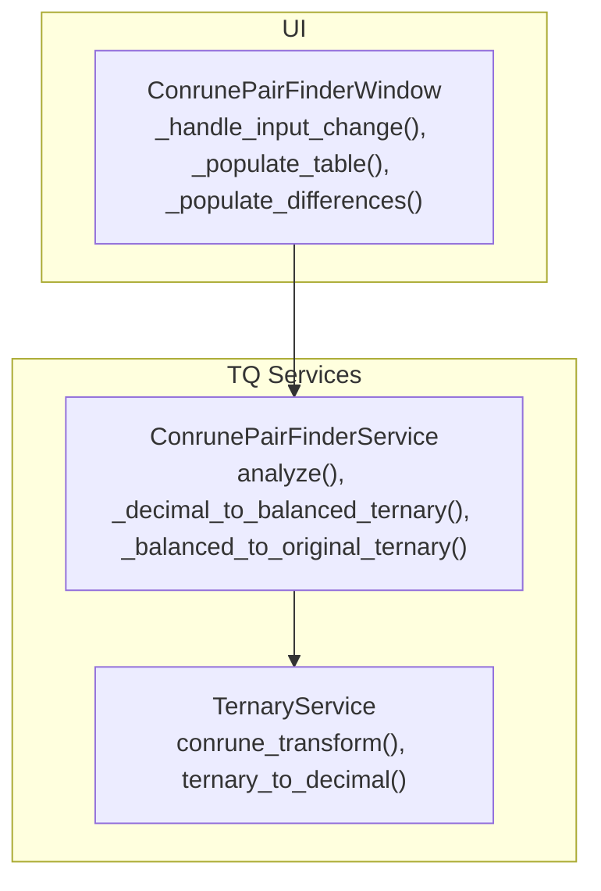
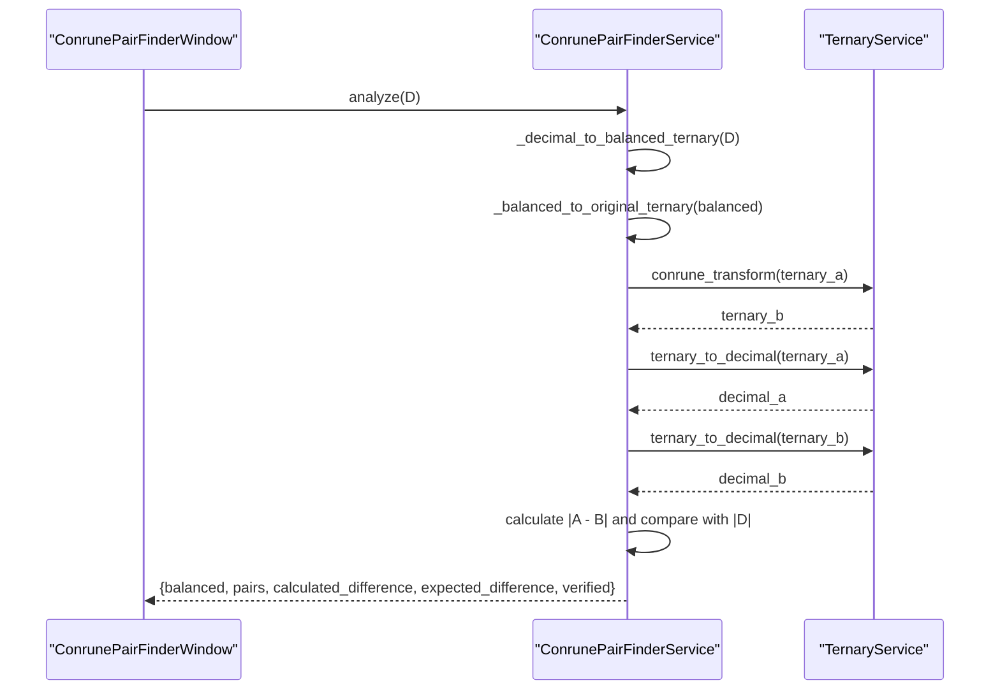
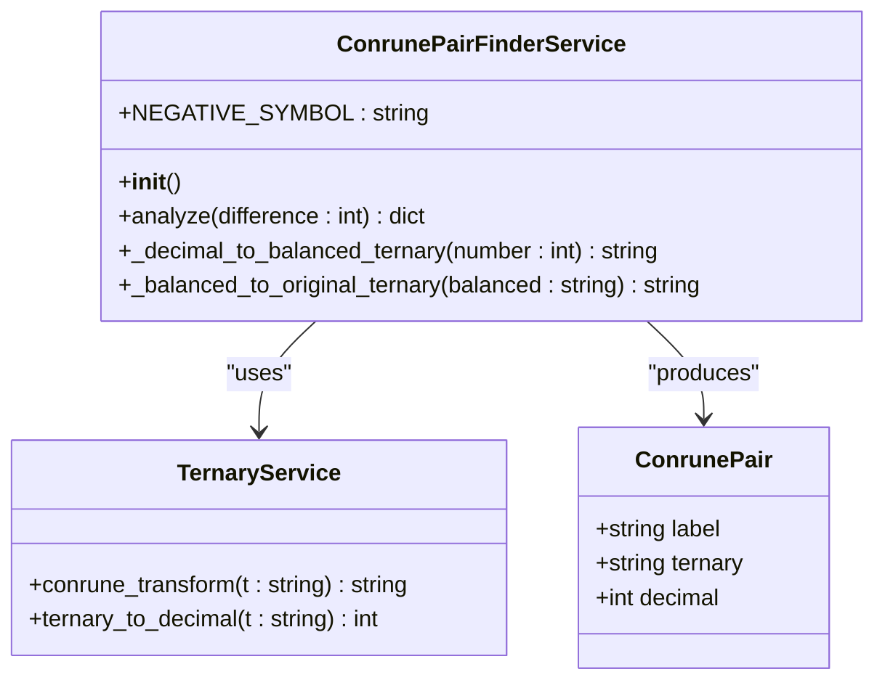
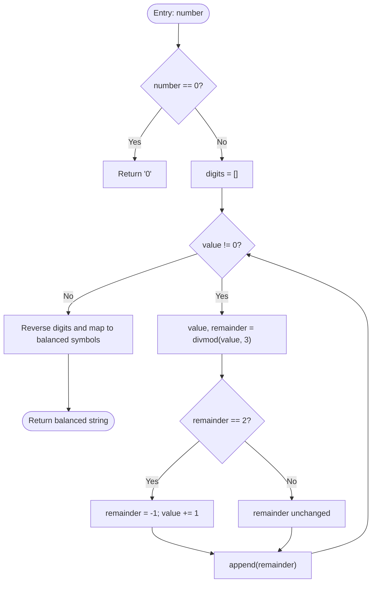
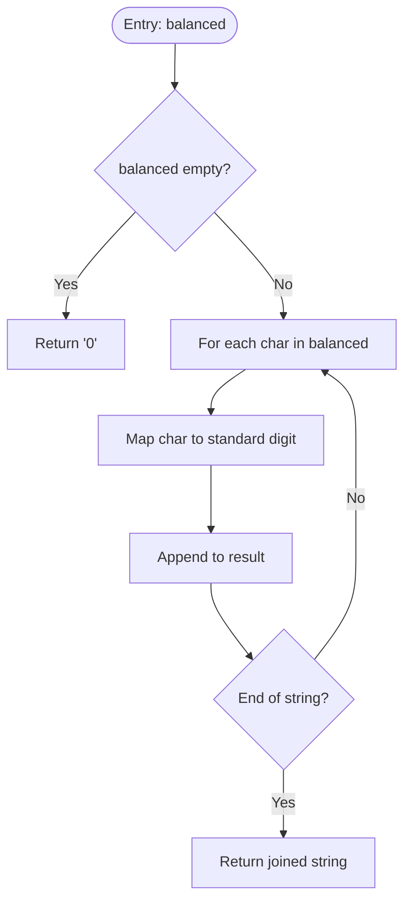
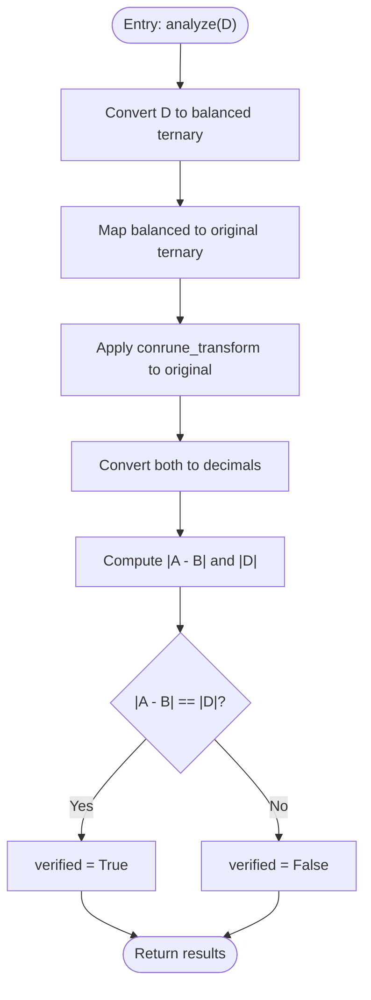

# Conrune Pair Finder Service

<cite>
**Referenced Files in This Document**
- [conrune_pair_finder_service.py](file://src/pillars/tq/services/conrune_pair_finder_service.py)
- [ternary_service.py](file://src/pillars/tq/services/ternary_service.py)
- [conrune_pair_finder_window.py](file://src/pillars/tq/ui/conrune_pair_finder_window.py)
- [kamea_mathematical_principles.md](file://Docs/kamea/kamea_mathematical_principles.md)
- [ternary_transition_system.md](file://Docs/kamea/ternary_transition_system.md)
</cite>

## Table of Contents
1. [Introduction](#introduction)
2. [Project Structure](#project-structure)
3. [Core Components](#core-components)
4. [Architecture Overview](#architecture-overview)
5. [Detailed Component Analysis](#detailed-component-analysis)
6. [Dependency Analysis](#dependency-analysis)
7. [Performance Considerations](#performance-considerations)
8. [Troubleshooting Guide](#troubleshooting-guide)
9. [Conclusion](#conclusion)
10. [Appendices](#appendices)

## Introduction
This document provides API documentation for the ConrunePairFinderService, which identifies Conrune pairs based on a target difference D. The service converts a decimal difference D into balanced ternary, derives the original ternary form and its Conrune counterpart, and computes the corresponding decimal values. It then verifies that the absolute difference between the computed decimals equals the absolute value of D. The documentation explains the internal algorithms, mapping rules, and verification process, and includes examples for positive and negative differences, plus edge cases such as zero input. It also contextualizes the service’s role in validating Conrune relationships within the Ternary Quadrant (TQ) framework.

## Project Structure
The ConrunePairFinderService resides in the TQ pillar and integrates with the TernaryService for conversions and transformations. The UI component ConrunePairFinderWindow consumes the service to present results and enable user interaction.

**Diagram sources**
- [conrune_pair_finder_service.py](file://src/pillars/tq/services/conrune_pair_finder_service.py#L19-L82)
- [ternary_service.py](file://src/pillars/tq/services/ternary_service.py#L1-L114)
- [conrune_pair_finder_window.py](file://src/pillars/tq/ui/conrune_pair_finder_window.py#L196-L236)

**Section sources**
- [conrune_pair_finder_service.py](file://src/pillars/tq/services/conrune_pair_finder_service.py#L19-L82)
- [ternary_service.py](file://src/pillars/tq/services/ternary_service.py#L1-L114)
- [conrune_pair_finder_window.py](file://src/pillars/tq/ui/conrune_pair_finder_window.py#L196-L236)

## Core Components
- ConrunePairFinderService
  - Purpose: Given a decimal difference D, compute balanced ternary, derive original and Conrune ternary forms, convert to decimals, and verify that |A - B| = |D|.
  - Key methods:
    - analyze(difference): Orchestrates the computation and returns structured results.
    - _decimal_to_balanced_ternary(number): Converts decimal to balanced ternary using divmod with remainder adjustment.
    - _balanced_to_original_ternary(balanced): Maps balanced ternary digits to standard ternary digits.
  - Dependencies: Uses TernaryService for conrune_transform and ternary_to_decimal.

- TernaryService
  - Provides:
    - conrune_transform(t): Applies the Conrune transformation (0->0, 1->2, 2->1).
    - ternary_to_decimal(t): Converts standard ternary string to decimal integer with validation.
  - Used by ConrunePairFinderService to compute decimal values and Conrune transformations.

- ConrunePairFinderWindow
  - UI wrapper around ConrunePairFinderService.
  - Handles user input, displays balanced ternary, pair table, difference labels, and verification status.
  - Copies results and forwards values to other analysis windows.

**Section sources**
- [conrune_pair_finder_service.py](file://src/pillars/tq/services/conrune_pair_finder_service.py#L19-L82)
- [ternary_service.py](file://src/pillars/tq/services/ternary_service.py#L64-L90)
- [conrune_pair_finder_window.py](file://src/pillars/tq/ui/conrune_pair_finder_window.py#L196-L236)

## Architecture Overview
The service follows a clean separation of concerns:
- Input: Integer difference D.
- Balanced ternary: Derived from D using a divmod loop with remainder adjustment.
- Original ternary: Derived from balanced ternary by mapping balanced digits to standard ternary digits.
- Conrune ternary: Derived by applying the Conrune transformation to original ternary.
- Decimals: Converted from original and Conrune ternary strings.
- Verification: Compares |A - B| with |D|.

**Diagram sources**
- [conrune_pair_finder_service.py](file://src/pillars/tq/services/conrune_pair_finder_service.py#L27-L49)
- [ternary_service.py](file://src/pillars/tq/services/ternary_service.py#L64-L90)

## Detailed Component Analysis

### ConrunePairFinderService API
- analyze(difference: int) -> dict
  - Inputs:
    - difference: Target decimal difference D.
  - Outputs:
    - balanced: Balanced ternary representation of D.
    - pairs: List of ConrunePair entries for Original (A) and Conrune (B).
    - calculated_difference: Absolute difference |decimal_a - decimal_b|.
    - expected_difference: Absolute value |D|.
    - verified: Boolean indicating whether calculated_difference equals expected_difference.
  - Processing:
    - Convert D to balanced ternary.
    - Map balanced to original ternary.
    - Compute Conrune ternary via conrune_transform.
    - Convert both forms to decimals.
    - Verify equality of absolute differences.

- _decimal_to_balanced_ternary(number: int) -> str
  - Algorithm:
    - Special-case zero returns "0".
    - Iteratively divide by 3 using divmod.
    - Adjust remainder 2 to -1 and increment quotient.
    - Collect adjusted remainders; reverse and map to balanced symbols.
  - Complexity:
    - Time O(k) where k is the number of balanced ternary digits.
    - Space O(k) for digits and output string.

- _balanced_to_original_ternary(balanced: str) -> str
  - Mapping:
    - '-' maps to '1'
    - '0' maps to '0'
    - '1' maps to '2'
  - Returns standard ternary string representing the original form.

- ConrunePair (dataclass)
  - Fields:
    - label: "Original (A)" or "Conrune (B)"
    - ternary: Ternary string
    - decimal: Decimal integer

**Section sources**
- [conrune_pair_finder_service.py](file://src/pillars/tq/services/conrune_pair_finder_service.py#L19-L82)

#### Class Diagram

**Diagram sources**
- [conrune_pair_finder_service.py](file://src/pillars/tq/services/conrune_pair_finder_service.py#L19-L82)
- [ternary_service.py](file://src/pillars/tq/services/ternary_service.py#L64-L90)

### TernaryService Integration
- conrune_transform(t: str) -> str
  - Applies the mapping 0->0, 1->2, 2->1 to each digit, preserving a leading minus sign if present.
- ternary_to_decimal(t: str) -> int
  - Validates that t contains only digits 0, 1, 2 (and optional leading minus).
  - Converts base-3 string to integer; negative handled by sign prefix.

**Section sources**
- [ternary_service.py](file://src/pillars/tq/services/ternary_service.py#L64-L90)

### UI Integration
- ConrunePairFinderWindow
  - Subscribes to user input changes, calls analyze(D), updates labels and table, and toggles action buttons.
  - Displays:
    - Balanced ternary derived from D.
    - Pair table with labels, ternary strings, and decimal values.
    - Expected and calculated differences.
    - Verification status message.

**Section sources**
- [conrune_pair_finder_window.py](file://src/pillars/tq/ui/conrune_pair_finder_window.py#L196-L236)

### Algorithm Details

#### Balanced Ternary Conversion (_decimal_to_balanced_ternary)
- Uses divmod with remainder adjustment:
  - On remainder 2, treat as -1 and increment quotient.
  - Continue until value reaches 0.
  - Map collected digits to balanced symbols and reverse to form output.
- Edge cases:
  - Zero input returns "0".

**Diagram sources**
- [conrune_pair_finder_service.py](file://src/pillars/tq/services/conrune_pair_finder_service.py#L52-L67)

**Section sources**
- [conrune_pair_finder_service.py](file://src/pillars/tq/services/conrune_pair_finder_service.py#L52-L67)

#### Balanced to Original Mapping (_balanced_to_original_ternary)
- Maps balanced digits to standard ternary digits:
  - '-' -> '1'
  - '0' -> '0'
  - '1' -> '2'
- Returns standard ternary string for the original form.

**Diagram sources**
- [conrune_pair_finder_service.py](file://src/pillars/tq/services/conrune_pair_finder_service.py#L68-L82)

**Section sources**
- [conrune_pair_finder_service.py](file://src/pillars/tq/services/conrune_pair_finder_service.py#L68-L82)

#### Verification Process
- Computes decimal_a and decimal_b from original and Conrune ternary strings.
- Calculates expected_difference = abs(difference).
- Calculates calculated_difference = abs(decimal_a - decimal_b).
- Sets verified = (calculated_difference == expected_difference).

**Diagram sources**
- [conrune_pair_finder_service.py](file://src/pillars/tq/services/conrune_pair_finder_service.py#L27-L49)
- [ternary_service.py](file://src/pillars/tq/services/ternary_service.py#L64-L90)

**Section sources**
- [conrune_pair_finder_service.py](file://src/pillars/tq/services/conrune_pair_finder_service.py#L27-L49)
- [ternary_service.py](file://src/pillars/tq/services/ternary_service.py#L64-L90)

### Examples and Interpretation

- Example: Difference D = 5
  - Balanced ternary derived from 5.
  - Original ternary mapped from balanced.
  - Conrune ternary computed via conrune_transform.
  - Decimals converted; verification compares |A - B| with 5.
  - UI displays results and status.

- Example: Negative difference D = -5
  - Service handles absolute difference; balanced ternary is derived from abs(-5).
  - Verification compares |A - B| with abs(-5).

- Interpreting balanced ternary:
  - '-' represents -1 in balanced ternary.
  - '0' represents 0.
  - '1' represents 1.
  - The mapping from balanced to original ternary swaps 1 and 2 while keeping 0 unchanged.

- Edge case: D = 0
  - Balanced ternary is "0".
  - Original and Conrune ternary strings are "0".
  - Both decimals are 0; difference is 0; verification passes.

- Context within TQ framework:
  - Conrune pairs are central to the Kamea mathematical principles, where each pair has a unique differential.
  - The service validates Conrune relationships by ensuring the computed difference matches the input absolute difference.

**Section sources**
- [conrune_pair_finder_service.py](file://src/pillars/tq/services/conrune_pair_finder_service.py#L27-L49)
- [kamea_mathematical_principles.md](file://Docs/kamea/kamea_mathematical_principles.md#L300-L431)

## Dependency Analysis
- ConrunePairFinderService depends on:
  - TernaryService for conrune_transform and ternary_to_decimal.
- UI depends on:
  - ConrunePairFinderService for analysis results.
  - Opens other analysis windows and performs lookups based on results.

**Diagram sources**
- [conrune_pair_finder_service.py](file://src/pillars/tq/services/conrune_pair_finder_service.py#L19-L26)
- [conrune_pair_finder_window.py](file://src/pillars/tq/ui/conrune_pair_finder_window.py#L33-L41)

**Section sources**
- [conrune_pair_finder_service.py](file://src/pillars/tq/services/conrune_pair_finder_service.py#L19-L26)
- [conrune_pair_finder_window.py](file://src/pillars/tq/ui/conrune_pair_finder_window.py#L33-L41)

## Performance Considerations
- Time complexity:
  - Balanced ternary conversion: O(k) where k is the number of digits.
  - Ternary-to-decimal conversion: O(m) where m is the length of the ternary string.
  - Overall: O(k + m).
- Space complexity:
  - Proportional to the lengths of intermediate strings (balanced, original, Conrune).
- Practical notes:
  - The operations are lightweight and suitable for interactive UI scenarios.
  - For very long ternary strings, consider caching repeated computations if reused frequently.

[No sources needed since this section provides general guidance]

## Troubleshooting Guide
- Unexpected verification failure:
  - Ensure the input D is a valid integer.
  - Confirm that ternary_to_decimal receives only valid ternary strings (digits 0, 1, 2).
  - Check that conrune_transform preserves signs correctly for negative inputs.
- Zero input:
  - Balanced ternary is "0"; both decimals are 0; verification should pass.
- Negative input:
  - The service compares absolute differences; ensure UI displays expected_difference as abs(D).

**Section sources**
- [conrune_pair_finder_service.py](file://src/pillars/tq/services/conrune_pair_finder_service.py#L27-L49)
- [ternary_service.py](file://src/pillars/tq/services/ternary_service.py#L34-L63)

## Conclusion
The ConrunePairFinderService provides a focused, verifiable pipeline for deriving Conrune pairs from a target difference D. It leverages balanced ternary arithmetic, a deterministic mapping to standard ternary, and the Conrune transformation to compute validated decimal pairs. The UI integrates these computations to deliver immediate feedback and support further analysis workflows within the TQ framework.

[No sources needed since this section summarizes without analyzing specific files]

## Appendices

### API Reference Summary

- ConrunePairFinderService.analyze(difference: int) -> dict
  - Returns keys: balanced, pairs, calculated_difference, expected_difference, verified.
  - pairs contains two ConrunePair entries with label, ternary, decimal.

- ConrunePairFinderService._decimal_to_balanced_ternary(number: int) -> str
  - Converts decimal to balanced ternary using divmod with remainder adjustment.

- ConrunePairFinderService._balanced_to_original_ternary(balanced: str) -> str
  - Maps balanced digits to standard ternary digits.

- TernaryService.conrune_transform(t: str) -> str
  - Applies Conrune transformation (0->0, 1->2, 2->1).

- TernaryService.ternary_to_decimal(t: str) -> int
  - Converts standard ternary string to decimal integer.

**Section sources**
- [conrune_pair_finder_service.py](file://src/pillars/tq/services/conrune_pair_finder_service.py#L27-L82)
- [ternary_service.py](file://src/pillars/tq/services/ternary_service.py#L64-L90)

### Contextual Background
- Conrune pairs and their unique differentials are foundational to the Kamea mathematical principles.
- The Ternary Transition System provides a broader framework for ternary transformations with philosophical grounding.

**Section sources**
- [kamea_mathematical_principles.md](file://Docs/kamea/kamea_mathematical_principles.md#L300-L431)
- [ternary_transition_system.md](file://Docs/kamea/ternary_transition_system.md#L1-L158)