# Conrune Transformation

<cite>
**Referenced Files in This Document**
- [ternary_service.py](file://src/pillars/tq/services/ternary_service.py)
- [conrune_pair_finder_service.py](file://src/pillars/tq/services/conrune_pair_finder_service.py)
- [quadset_engine.py](file://src/pillars/tq/services/quadset_engine.py)
- [The_Kamea_Doctrine.md](file://Docs/kamea/The_Kamea_Doctrine.md)
- [ternary_transition_system.md](file://Docs/kamea/ternary_transition_system.md)
- [kamea_baphomet_ternary.csv](file://src/pillars/tq/data/kamea_baphomet_ternary.csv)
</cite>

## Table of Contents
1. [Introduction](#introduction)
2. [Project Structure](#project-structure)
3. [Core Components](#core-components)
4. [Architecture Overview](#architecture-overview)
5. [Detailed Component Analysis](#detailed-component-analysis)
6. [Dependency Analysis](#dependency-analysis)
7. [Performance Considerations](#performance-considerations)
8. [Troubleshooting Guide](#troubleshooting-guide)
9. [Conclusion](#conclusion)
10. [Appendices](#appendices)

## Introduction
This document provides comprehensive documentation for the conrune_transform method in TernaryService. It explains the transformation rule (0→0, 1→2, 2→1) applied to ternary digits, its cryptographic and symbolic significance within Trigrammaton QBLH contexts, and its role in rune pairing and pattern obfuscation. The implementation is dictionary-based and uses a generator expression to preserve negative signs by prefix handling. Edge cases such as empty strings and invalid characters are addressed, along with performance characteristics and integration points with services like conrune_pair_finder_service and QuadsetEngine.

## Project Structure
The conrune_transform method resides in the ternary service module and is consumed by higher-level services that orchestrate rune pairing and quadset analysis.

**Diagram sources**
- [ternary_service.py](file://src/pillars/tq/services/ternary_service.py#L64-L89)
- [conrune_pair_finder_service.py](file://src/pillars/tq/services/conrune_pair_finder_service.py#L27-L41)
- [quadset_engine.py](file://src/pillars/tq/services/quadset_engine.py#L29-L46)

**Section sources**
- [ternary_service.py](file://src/pillars/tq/services/ternary_service.py#L64-L89)
- [conrune_pair_finder_service.py](file://src/pillars/tq/services/conrune_pair_finder_service.py#L27-L41)
- [quadset_engine.py](file://src/pillars/tq/services/quadset_engine.py#L29-L46)

## Core Components
- TernaryService.conrune_transform: Applies the Conrune rule to a ternary string, preserving a leading minus sign and returning a transformed string.
- ConrunePairFinderService.analyze: Uses conrune_transform to compute a Conrune pair for a given difference D and validates the resulting difference.
- QuadsetEngine.calculate: Integrates conrune_transform into a broader pipeline that includes reversal, Conrune of Reversal, and differential computations.

**Section sources**
- [ternary_service.py](file://src/pillars/tq/services/ternary_service.py#L64-L89)
- [conrune_pair_finder_service.py](file://src/pillars/tq/services/conrune_pair_finder_service.py#L27-L41)
- [quadset_engine.py](file://src/pillars/tq/services/quadset_engine.py#L29-L46)

## Architecture Overview
The conrune_transform method is part of a larger ecosystem where ternary arithmetic and transformations feed into rune pairing and quadset analysis.

**Diagram sources**
- [conrune_pair_finder_service.py](file://src/pillars/tq/services/conrune_pair_finder_service.py#L27-L41)
- [quadset_engine.py](file://src/pillars/tq/services/quadset_engine.py#L29-L46)
- [ternary_service.py](file://src/pillars/tq/services/ternary_service.py#L64-L89)

## Detailed Component Analysis

### TernaryService.conrune_transform
- Purpose: Apply the Conrune rule to each ternary digit while preserving a leading minus sign.
- Implementation highlights:
  - Handles empty input by returning an empty string.
  - Preserves a leading minus sign by extracting it before mapping and prepending it to the result.
  - Uses a dictionary-based mapping for O(1) per-character lookup.
  - Applies a generator expression to transform each character and join the result.
- Complexity: O(n) time, O(n) space, where n is the length of the input string.

```mermaid
flowchart TD
Start(["Entry: conrune_transform(t)"]) --> CheckEmpty{"t is empty?"}
CheckEmpty --> |Yes| ReturnEmpty["Return ''"]
CheckEmpty --> |No| CheckSign{"t starts with '-'?"}
CheckSign --> |Yes| ExtractPrefix["prefix = '-'<br/>t = t[1:]"]
CheckSign --> |No| NoPrefix["prefix = ''"]
ExtractPrefix --> Map["mapping = {'0':'0','1':'2','2':'1'}"]
NoPrefix --> Map
Map --> Transform["transformed = ''.join(mapping.get(c,c) for c in t)"]
Transform --> Join["return prefix + transformed"]
Join --> End(["Exit"])
```

**Diagram sources**
- [ternary_service.py](file://src/pillars/tq/services/ternary_service.py#L64-L89)

**Section sources**
- [ternary_service.py](file://src/pillars/tq/services/ternary_service.py#L64-L89)

### Symbolic Significance in Trigrammaton QBLH Contexts
- Conrune rule (0→0, 1→2, 2→1) reflects a polarity swap in the ternary spectrum:
  - 0 (Tao/Pyx): Equilibrium, unchanged.
  - 1 (Yang/Vertex): Active force becomes 2 (Yin/Nexus).
  - 2 (Yin/Nexus): Receptive force becomes 1 (Yang/Vertex).
- In the Kamea Doctrine:
  - Conrune relates entities to their geometric opposites and defines entanglement distances.
  - The Void (0) is the pivot where Conrune(x) == x.
  - Conrune pairs are central to Quadset physics and Twin Axes relationships.

**Section sources**
- [The_Kamea_Doctrine.md](file://Docs/kamea/The_Kamea_Doctrine.md#L97-L105)
- [The_Kamea_Doctrine.md](file://Docs/kamea/The_Kamea_Doctrine.md#L172-L182)

### Usage in Rune Pairing Algorithms
- ConrunePairFinderService.analyze constructs a Conrune pair for a target difference D:
  - Converts D to balanced ternary and back to standard ternary.
  - Applies conrune_transform to obtain the Conrune partner.
  - Computes decimal values and verifies that the absolute difference equals the expected D.

**Diagram sources**
- [conrune_pair_finder_service.py](file://src/pillars/tq/services/conrune_pair_finder_service.py#L27-L41)
- [ternary_service.py](file://src/pillars/tq/services/ternary_service.py#L64-L89)

**Section sources**
- [conrune_pair_finder_service.py](file://src/pillars/tq/services/conrune_pair_finder_service.py#L27-L41)

### Usage in Quadset Analysis
- QuadsetEngine.calculate integrates conrune_transform alongside reversal and differential computations:
  - Original and Conrune transformations.
  - Reversal and Conrune of Reversal.
  - Upper and Lower differences computed from decimal values.
  - Transgram derived via ternary transition mapping.

**Diagram sources**
- [quadset_engine.py](file://src/pillars/tq/services/quadset_engine.py#L29-L46)
- [ternary_service.py](file://src/pillars/tq/services/ternary_service.py#L64-L89)

**Section sources**
- [quadset_engine.py](file://src/pillars/tq/services/quadset_engine.py#L29-L46)

### Reversibility Properties
- The Conrune rule is involutive: applying it twice restores the original string.
- This property holds because 1↔2 swaps cancel out, leaving 0 unchanged.

**Section sources**
- [ternary_service.py](file://src/pillars/tq/services/ternary_service.py#L64-L89)

### Pattern Obfuscation Techniques
- Conrune transformation can alter the surface layer (Skin) of a Ditrune while preserving core structural properties, aiding in obfuscation and pattern masking.
- Combined with reversal and transition operations, it enables multi-layered transformations suitable for cryptographic or analytical obfuscation.

**Section sources**
- [The_Kamea_Doctrine.md](file://Docs/kamea/The_Kamea_Doctrine.md#L63-L80)
- [ternary_transition_system.md](file://Docs/kamea/ternary_transition_system.md#L130-L157)

## Dependency Analysis
- TernaryService is a standalone static service used by ConrunePairFinderService and QuadsetEngine.
- ConrunePairFinderService depends on TernaryService for conrune_transform and ternary_to_decimal.
- QuadsetEngine orchestrates multiple transformations and depends on TernaryService for conversions and transformations.

**Diagram sources**
- [ternary_service.py](file://src/pillars/tq/services/ternary_service.py#L64-L89)
- [conrune_pair_finder_service.py](file://src/pillars/tq/services/conrune_pair_finder_service.py#L27-L41)
- [quadset_engine.py](file://src/pillars/tq/services/quadset_engine.py#L29-L46)

**Section sources**
- [ternary_service.py](file://src/pillars/tq/services/ternary_service.py#L64-L89)
- [conrune_pair_finder_service.py](file://src/pillars/tq/services/conrune_pair_finder_service.py#L27-L41)
- [quadset_engine.py](file://src/pillars/tq/services/quadset_engine.py#L29-L46)

## Performance Considerations
- Time complexity: O(n) for conrune_transform, where n is the length of the input string.
- Space complexity: O(n) for the transformed string.
- The dictionary lookup per character is O(1), and generator expression avoids intermediate lists, keeping memory usage linear in input size.
- Integration with QuadsetEngine and ConrunePairFinderService maintains O(n) per transformation within the pipeline.

[No sources needed since this section provides general guidance]

## Troubleshooting Guide
Common issues and resolutions:
- Unexpected output due to sign placement:
  - Ensure the input string does not contain embedded minus signs other than a leading one. The method preserves only a leading minus sign.
  - Verify that the input is a valid ternary string (only 0, 1, 2) when using downstream conversions.
- Incorrect mapping logic:
  - Confirm that the mapping is {'0':'0','1':'2','2':'1'} and that invalid characters are handled gracefully by the generator fallback.
- Empty strings:
  - The method returns an empty string for empty input; downstream consumers should handle this case appropriately.
- Invalid characters:
  - When converting back to decimal, only 0, 1, 2 are accepted. Inputs containing other characters will raise an error.

**Section sources**
- [ternary_service.py](file://src/pillars/tq/services/ternary_service.py#L64-L89)
- [ternary_service.py](file://src/pillars/tq/services/ternary_service.py#L34-L63)

## Conclusion
The conrune_transform method provides a fast, deterministic, and reversible transformation of ternary strings that aligns with the symbolic and cryptographic principles of Trigrammaton QBLH. Its integration into ConrunePairFinderService and QuadsetEngine demonstrates practical applications in rune pairing and quadset analysis. Proper handling of edge cases and sign preservation ensures robust behavior across diverse inputs.

[No sources needed since this section summarizes without analyzing specific files]

## Appendices

### Example: Transforming '1201'
- Input: '1201'
- Mapping:
  - 1 → 2
  - 2 → 1
  - 0 → 0
  - 1 → 2
- Output: '2102'

Verification:
- The transformation is involutive; applying it again yields the original string.
- When combined with reversal and transition operations, it participates in quadset computations.

**Section sources**
- [ternary_service.py](file://src/pillars/tq/services/ternary_service.py#L64-L89)
- [quadset_engine.py](file://src/pillars/tq/services/quadset_engine.py#L29-L46)

### Integration with Services
- ConrunePairFinderService.analyze uses conrune_transform to derive Conrune partners for a target difference and validates the result.
- QuadsetEngine.calculate uses conrune_transform alongside reversal and transition mapping to produce a comprehensive quadset report.

**Section sources**
- [conrune_pair_finder_service.py](file://src/pillars/tq/services/conrune_pair_finder_service.py#L27-L41)
- [quadset_engine.py](file://src/pillars/tq/services/quadset_engine.py#L29-L46)

### Data References
- Kamea grid data for ternary representations and coordinate mapping:
  - [kamea_baphomet_ternary.csv](file://src/pillars/tq/data/kamea_baphomet_ternary.csv#L1-L29)

**Section sources**
- [kamea_baphomet_ternary.csv](file://src/pillars/tq/data/kamea_baphomet_ternary.csv#L1-L29)