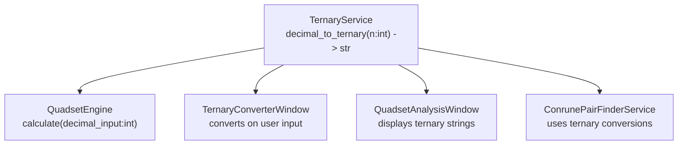
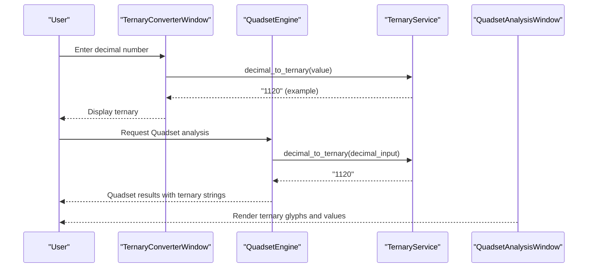
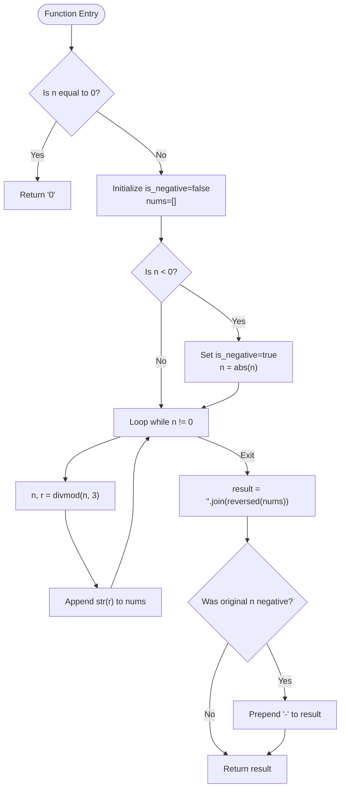
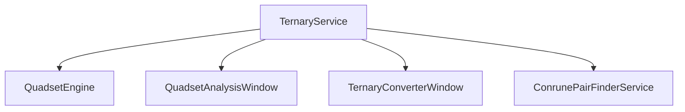

# Decimal to Ternary Conversion

<cite>
**Referenced Files in This Document**
- [ternary_service.py](file://src/pillars/tq/services/ternary_service.py)
- [quadset_engine.py](file://src/pillars/tq/services/quadset_engine.py)
- [quadset_analysis_window.py](file://src/pillars/tq/ui/quadset_analysis_window.py)
- [ternary_converter_window.py](file://src/pillars/tq/ui/ternary_converter_window.py)
- [conrune_pair_finder_service.py](file://src/pillars/tq/services/conrune_pair_finder_service.py)
</cite>

## Table of Contents
1. [Introduction](#introduction)
2. [Project Structure](#project-structure)
3. [Core Components](#core-components)
4. [Architecture Overview](#architecture-overview)
5. [Detailed Component Analysis](#detailed-component-analysis)
6. [Dependency Analysis](#dependency-analysis)
7. [Performance Considerations](#performance-considerations)
8. [Troubleshooting Guide](#troubleshooting-guide)
9. [Conclusion](#conclusion)

## Introduction
This document provides API documentation for the decimal_to_ternary method in TernaryService. It explains how the method converts a decimal integer to a base-3 (ternary) string representation using repeated divmod operations. The documentation covers input type enforcement, return type, handling of zero and negative numbers, digit assembly order, and integration with higher-level TQ systems such as Quadset analysis. It also addresses performance characteristics, common pitfalls, and troubleshooting guidance.

## Project Structure
The decimal_to_ternary method resides in the TernaryService class and is used across several TQ subsystems:
- Services: TernaryService provides conversion utilities used by QuadsetEngine and other services.
- UI Windows: QuadsetAnalysisWindow and TernaryConverterWindow consume TernaryService for display and interactive conversion.
- Higher-level services: ConrunePairFinderService demonstrates balanced ternary concepts and uses TernaryService for conversions.

**Diagram sources**
- [ternary_service.py](file://src/pillars/tq/services/ternary_service.py#L6-L32)
- [quadset_engine.py](file://src/pillars/tq/services/quadset_engine.py#L19-L81)
- [quadset_analysis_window.py](file://src/pillars/tq/ui/quadset_analysis_window.py#L536-L560)
- [ternary_converter_window.py](file://src/pillars/tq/ui/ternary_converter_window.py#L100-L124)
- [conrune_pair_finder_service.py](file://src/pillars/tq/services/conrune_pair_finder_service.py#L24-L31)

**Section sources**
- [ternary_service.py](file://src/pillars/tq/services/ternary_service.py#L6-L32)
- [quadset_engine.py](file://src/pillars/tq/services/quadset_engine.py#L19-L81)
- [quadset_analysis_window.py](file://src/pillars/tq/ui/quadset_analysis_window.py#L536-L560)
- [ternary_converter_window.py](file://src/pillars/tq/ui/ternary_converter_window.py#L100-L124)
- [conrune_pair_finder_service.py](file://src/pillars/tq/services/conrune_pair_finder_service.py#L24-L31)

## Core Components
- TernaryService.decimal_to_ternary(n: int) -> str
  - Purpose: Convert a decimal integer to a ternary string.
  - Input type enforcement: Requires an integer argument.
  - Return type: String representing the ternary form.
  - Behavior:
    - Zero input returns "0".
    - Negative inputs preserve the sign by prepending "-" to the reversed digit sequence.
    - Uses repeated divmod by 3 to collect digits and then reverses the collected digits to assemble the final string.

Integration points:
- QuadsetEngine.calculate uses decimal_to_ternary to produce the original ternary representation for each member.
- QuadsetAnalysisWindow displays ternary strings produced by TernaryService.
- TernaryConverterWindow calls decimal_to_ternary when users enter decimal values.

**Section sources**
- [ternary_service.py](file://src/pillars/tq/services/ternary_service.py#L6-L32)
- [quadset_engine.py](file://src/pillars/tq/services/quadset_engine.py#L29-L36)
- [quadset_analysis_window.py](file://src/pillars/tq/ui/quadset_analysis_window.py#L363-L387)
- [ternary_converter_window.py](file://src/pillars/tq/ui/ternary_converter_window.py#L100-L124)

## Architecture Overview
The decimal_to_ternary method is part of a broader TQ conversion pipeline. It is invoked by higher-level orchestration services and UI windows to transform decimal inputs into ternary strings for downstream analysis and visualization.

**Diagram sources**
- [ternary_converter_window.py](file://src/pillars/tq/ui/ternary_converter_window.py#L100-L124)
- [quadset_engine.py](file://src/pillars/tq/services/quadset_engine.py#L29-L36)
- [quadset_analysis_window.py](file://src/pillars/tq/ui/quadset_analysis_window.py#L363-L387)
- [ternary_service.py](file://src/pillars/tq/services/ternary_service.py#L6-L32)

## Detailed Component Analysis

### Method API Definition
- Method: TernaryService.decimal_to_ternary(n: int) -> str
- Input: Integer n
- Output: String representing the ternary form
- Behavior:
  - If n equals zero, returns "0".
  - If n is negative, sets a flag and converts to absolute value before computation.
  - Repeatedly applies divmod by 3 to collect remainders as digits.
  - Reverses the collected digits to form the final ternary string.
  - If the original input was negative, prepends "-" to the result.

Edge cases handled:
- Zero input produces "0".
- Negative input preserves sign via a leading minus.
- No special handling for floating-point inputs; the method expects an integer.

Examples:
- Converting 42 yields "1120".
- Converting -13 yields "-111".

Integration with Quadset analysis:
- QuadsetEngine.calculate calls decimal_to_ternary on the initial decimal input to build the original member’s ternary representation.

**Section sources**
- [ternary_service.py](file://src/pillars/tq/services/ternary_service.py#L6-L32)
- [quadset_engine.py](file://src/pillars/tq/services/quadset_engine.py#L29-L36)

### Algorithm Step-by-Step
The algorithm performs repeated base-3 division using divmod and assembles digits in the correct order.

**Diagram sources**
- [ternary_service.py](file://src/pillars/tq/services/ternary_service.py#L6-L32)

### Balanced vs Non-balanced Ternary
- TernaryService.decimal_to_ternary produces standard non-negative ternary digits 0, 1, 2.
- Balanced ternary (used in ConrunePairFinderService) uses digits -1, 0, 1 represented by a negative symbol, "0", and "1" respectively. This is distinct from the standard ternary produced by decimal_to_ternary.

Implications:
- When integrating with balanced ternary workflows, convert between standard and balanced forms using dedicated services or transformations.

**Section sources**
- [conrune_pair_finder_service.py](file://src/pillars/tq/services/conrune_pair_finder_service.py#L24-L31)
- [conrune_pair_finder_service.py](file://src/pillars/tq/services/conrune_pair_finder_service.py#L52-L66)

## Dependency Analysis
TernaryService.decimal_to_ternary is consumed by:
- QuadsetEngine.calculate for building QuadsetMember ternary strings.
- QuadsetAnalysisWindow for rendering ternary glyphs and values.
- TernaryConverterWindow for real-time conversion feedback.
- ConrunePairFinderService indirectly through ternary_to_decimal and conrune_transform.

**Diagram sources**
- [ternary_service.py](file://src/pillars/tq/services/ternary_service.py#L6-L32)
- [quadset_engine.py](file://src/pillars/tq/services/quadset_engine.py#L19-L81)
- [quadset_analysis_window.py](file://src/pillars/tq/ui/quadset_analysis_window.py#L363-L387)
- [ternary_converter_window.py](file://src/pillars/tq/ui/ternary_converter_window.py#L100-L124)
- [conrune_pair_finder_service.py](file://src/pillars/tq/services/conrune_pair_finder_service.py#L24-L31)

**Section sources**
- [ternary_service.py](file://src/pillars/tq/services/ternary_service.py#L6-L32)
- [quadset_engine.py](file://src/pillars/tq/services/quadset_engine.py#L19-L81)
- [quadset_analysis_window.py](file://src/pillars/tq/ui/quadset_analysis_window.py#L363-L387)
- [ternary_converter_window.py](file://src/pillars/tq/ui/ternary_converter_window.py#L100-L124)
- [conrune_pair_finder_service.py](file://src/pillars/tq/services/conrune_pair_finder_service.py#L24-L31)

## Performance Considerations
- Time complexity: O(log_3 n), proportional to the number of ternary digits.
- Space complexity: O(log_3 n) for storing digits and the resulting string.
- The repeated divmod loop is efficient and avoids expensive arithmetic beyond basic integer division and modulo.

[No sources needed since this section provides general guidance]

## Troubleshooting Guide
Common issues and resolutions:
- Incorrect sign handling:
  - Symptom: Negative decimal produces unexpected output.
  - Cause: Misinterpreting the sign flag or missing the leading minus.
  - Resolution: Ensure the method preserves the sign by prepending "-" when the original input was negative.

- Digit ordering errors:
  - Symptom: Ternary digits appear in reverse order.
  - Cause: Forgetting to reverse the collected digits before joining.
  - Resolution: Reverse the list of digits before assembling the final string.

- Floating-point inputs:
  - Symptom: Unexpected behavior or runtime errors.
  - Cause: Method expects an integer; passing a float triggers conversion errors.
  - Resolution: Convert inputs to int before calling decimal_to_ternary.

- Zero input:
  - Symptom: Unexpected empty string or incorrect representation.
  - Cause: Missing explicit zero branch.
  - Resolution: The method returns "0" for zero input; ensure callers handle this case.

- Integration with Quadset analysis:
  - Symptom: Quadset results show incorrect ternary strings.
  - Cause: Incorrect digit assembly or sign handling upstream.
  - Resolution: Verify decimal_to_ternary correctness and confirm QuadsetEngine calls it during initialization.

**Section sources**
- [ternary_service.py](file://src/pillars/tq/services/ternary_service.py#L6-L32)
- [quadset_engine.py](file://src/pillars/tq/services/quadset_engine.py#L29-L36)
- [quadset_analysis_window.py](file://src/pillars/tq/ui/quadset_analysis_window.py#L363-L387)
- [ternary_converter_window.py](file://src/pillars/tq/ui/ternary_converter_window.py#L100-L124)

## Conclusion
The TernaryService.decimal_to_ternary method provides a robust, O(log n) conversion from decimal integers to ternary strings. It handles zero and negative inputs correctly, preserves sign via a leading minus, and assembles digits through reversed concatenation. Its integration across Quadset analysis, UI converters, and higher-level services ensures consistent ternary encoding for downstream computations and visualizations. When extending to balanced ternary workflows, use dedicated services to convert between standard and balanced forms.