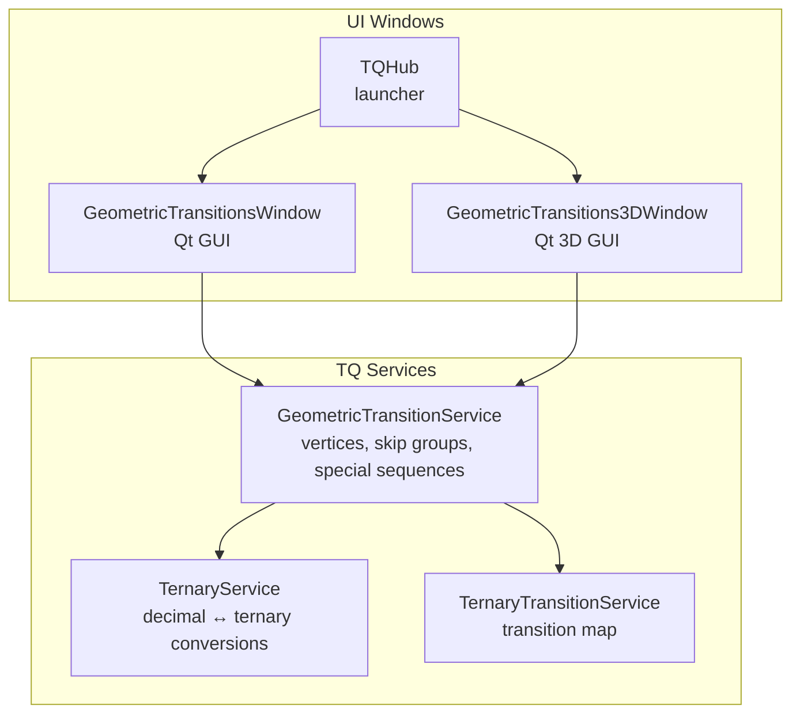
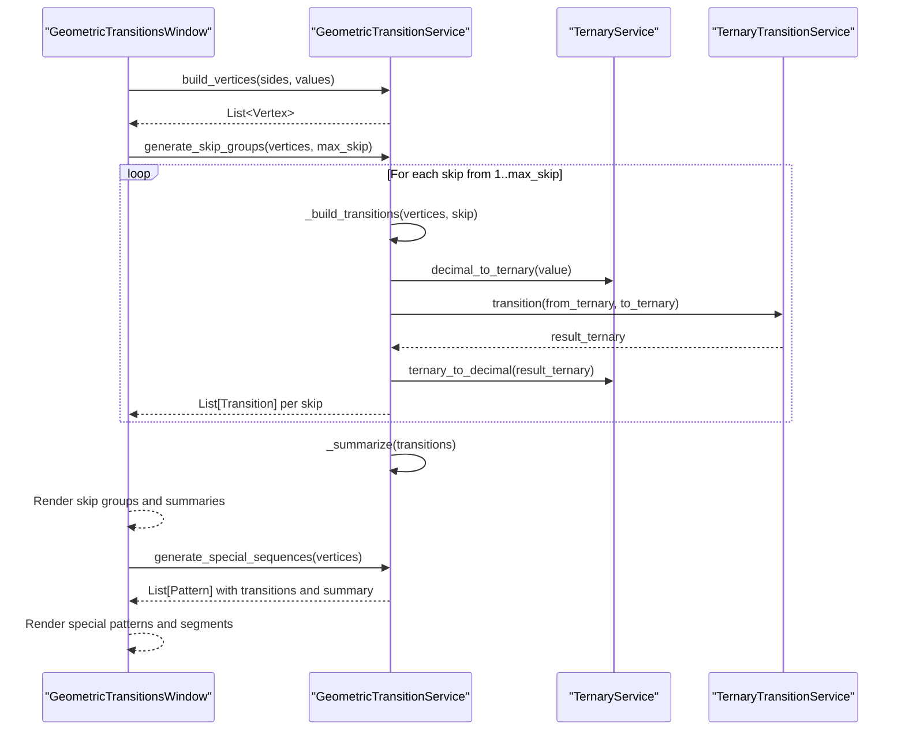
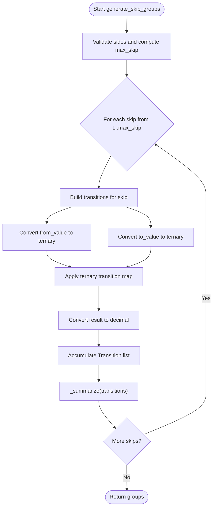
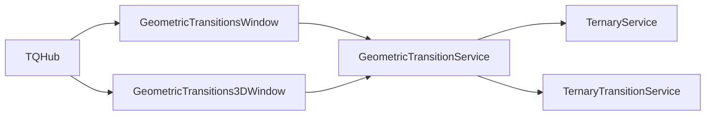

# Geometric Transition Service

<cite>
**Referenced Files in This Document**
- [geometric_transition_service.py](file://src/pillars/tq/services/geometric_transition_service.py)
- [ternary_service.py](file://src/pillars/tq/services/ternary_service.py)
- [ternary_transition_service.py](file://src/pillars/tq/services/ternary_transition_service.py)
- [geometric_transitions_window.py](file://src/pillars/tq/ui/geometric_transitions_window.py)
- [geometric_transitions_3d_window.py](file://src/pillars/tq/ui/geometric_transitions_3d_window.py)
- [tq_hub.py](file://src/pillars/tq/ui/tq_hub.py)
</cite>

## Table of Contents
1. [Introduction](#introduction)
2. [Project Structure](#project-structure)
3. [Core Components](#core-components)
4. [Architecture Overview](#architecture-overview)
5. [Detailed Component Analysis](#detailed-component-analysis)
6. [Dependency Analysis](#dependency-analysis)
7. [Performance Considerations](#performance-considerations)
8. [Troubleshooting Guide](#troubleshooting-guide)
9. [Conclusion](#conclusion)
10. [Appendices](#appendices)

## Introduction
This document describes the GeometricTransitionService, which generates vertex transitions on regular polygons with 3 to 27 sides. It focuses on:
- Constructing coordinate-based vertices with radius normalization and clockwise ordering from the top
- Generating skip groups for perimeter and diagonal transitions
- Producing predefined special sequences (e.g., heptagram patterns)
- Internal ternary transition logic and result summaries
- Coordinate system conventions and visualization integration with UI windows

It also provides practical examples for:
- Generating transition graphs on a hexagon
- Analyzing a dodecagon’s diagonal families
- Rendering special heptagram sequences

## Project Structure
The service resides in the Ternary Quantization (TQ) pillar under services and is integrated into UI windows for interactive exploration.

**Diagram sources**
- [geometric_transition_service.py](file://src/pillars/tq/services/geometric_transition_service.py#L38-L323)
- [ternary_service.py](file://src/pillars/tq/services/ternary_service.py#L1-L114)
- [ternary_transition_service.py](file://src/pillars/tq/services/ternary_transition_service.py#L1-L70)
- [geometric_transitions_window.py](file://src/pillars/tq/ui/geometric_transitions_window.py#L1-L200)
- [geometric_transitions_3d_window.py](file://src/pillars/tq/ui/geometric_transitions_3d_window.py#L1-L120)
- [tq_hub.py](file://src/pillars/tq/ui/tq_hub.py#L118-L135)

**Section sources**
- [geometric_transition_service.py](file://src/pillars/tq/services/geometric_transition_service.py#L38-L323)
- [geometric_transitions_window.py](file://src/pillars/tq/ui/geometric_transitions_window.py#L1-L200)
- [geometric_transitions_3d_window.py](file://src/pillars/tq/ui/geometric_transitions_3d_window.py#L1-L120)
- [tq_hub.py](file://src/pillars/tq/ui/tq_hub.py#L118-L135)

## Core Components
- GeometricTransitionService: Core logic for polygon vertices, skip groups, special sequences, and summaries
- TernaryService: Decimal-to-ternary and ternary-to-decimal conversions
- TernaryTransitionService: Applies the ternary transition map to pairs of ternary strings
- GeometricTransitionsWindow: Interactive Qt window to visualize skip groups and special patterns
- GeometricTransitions3DWindow: 3D visualization for Platonic solids (complementary to the 2D polygon service)
- TQHub: Launches the geometric transition tools

Key public APIs:
- build_vertices(sides, values)
- generate_skip_groups(vertices, max_skip)
- generate_special_sequences(vertices)
- get_polygon_options()

**Section sources**
- [geometric_transition_service.py](file://src/pillars/tq/services/geometric_transition_service.py#L88-L183)
- [ternary_service.py](file://src/pillars/tq/services/ternary_service.py#L1-L114)
- [ternary_transition_service.py](file://src/pillars/tq/services/ternary_transition_service.py#L1-L70)
- [geometric_transitions_window.py](file://src/pillars/tq/ui/geometric_transitions_window.py#L127-L200)
- [geometric_transitions_3d_window.py](file://src/pillars/tq/ui/geometric_transitions_3d_window.py#L241-L320)
- [tq_hub.py](file://src/pillars/tq/ui/tq_hub.py#L118-L135)

## Architecture Overview
The service orchestrates:
- Vertex construction on a unit circle with clockwise ordering from the top
- Skip-based transitions around the polygon
- Ternary transitions applied to vertex values
- Summaries computed per skip group and special pattern
- UI rendering of polygons, skip edges, and special paths

**Diagram sources**
- [geometric_transitions_window.py](file://src/pillars/tq/ui/geometric_transitions_window.py#L297-L341)
- [geometric_transition_service.py](file://src/pillars/tq/services/geometric_transition_service.py#L96-L183)
- [ternary_service.py](file://src/pillars/tq/services/ternary_service.py#L1-L114)
- [ternary_transition_service.py](file://src/pillars/tq/services/ternary_transition_service.py#L1-L70)

## Detailed Component Analysis

### Coordinate System and Vertex Construction
- Unit circle: radius normalized to 1.0
- Angle step: 2π / sides
- Starting angle: π/2 (top of the circle)
- Clockwise traversal: subtracting step angles per index
- Vertex values: defaults to 1..sides; can be customized via values parameter
- Rounded coordinates to six decimals for stability

Coordinate mapping in the UI:
- Widget coordinates derived from unit circle x,y with margins and scaling
- Y-axis inverted for screen coordinates (Qt convention)

Practical example references:
- Building vertices for a hexagon: [build_vertices](file://src/pillars/tq/services/geometric_transition_service.py#L96-L124)
- Canvas mapping: [GeometricCanvas._map_to_widget](file://src/pillars/tq/ui/geometric_transitions_window.py#L116-L125)

**Section sources**
- [geometric_transition_service.py](file://src/pillars/tq/services/geometric_transition_service.py#L96-L124)
- [geometric_transitions_window.py](file://src/pillars/tq/ui/geometric_transitions_window.py#L116-L125)

### Skip Groups and Diagonal Families
- Skip 1 corresponds to the polygon perimeter
- Skip k (k>1) corresponds to diagonals connecting vertices separated by k steps
- Maximum skip is constrained by polygon size and configured limits
- Each skip group produces a list of Transition objects with:
  - From/To indices and values
  - From/To ternary representations
  - Result ternary and decimal
- Summaries include count, sum, mean, min, max, and unique results

Practical example references:
- Generating skip groups for a hexagon: [generate_skip_groups](file://src/pillars/tq/services/geometric_transition_service.py#L126-L154)
- Internal transition building: [_build_transitions](file://src/pillars/tq/services/geometric_transition_service.py#L186-L217)
- Summary computation: [_summarize](file://src/pillars/tq/services/geometric_transition_service.py#L250-L272)

**Diagram sources**
- [geometric_transition_service.py](file://src/pillars/tq/services/geometric_transition_service.py#L126-L154)
- [geometric_transition_service.py](file://src/pillars/tq/services/geometric_transition_service.py#L186-L217)
- [geometric_transition_service.py](file://src/pillars/tq/services/geometric_transition_service.py#L250-L272)
- [ternary_service.py](file://src/pillars/tq/services/ternary_service.py#L1-L114)
- [ternary_transition_service.py](file://src/pillars/tq/services/ternary_transition_service.py#L1-L70)

**Section sources**
- [geometric_transition_service.py](file://src/pillars/tq/services/geometric_transition_service.py#L126-L154)
- [geometric_transition_service.py](file://src/pillars/tq/services/geometric_transition_service.py#L186-L217)
- [geometric_transition_service.py](file://src/pillars/tq/services/geometric_transition_service.py#L250-L272)

### Special Heptagram Sequences
- Predefined patterns for heptagons (7-gon)
- Each pattern defines a sequence of edges as ordered pairs of indices
- Edges are converted into Transition objects with computed results
- Summaries are produced for each pattern

Practical example references:
- Special patterns registry: [SPECIAL_PATTERNS](file://src/pillars/tq/services/geometric_transition_service.py#L44-L86)
- Pattern generation: [generate_special_sequences](file://src/pillars/tq/services/geometric_transition_service.py#L156-L182)
- Custom transition builder: [_build_custom_transition](file://src/pillars/tq/services/geometric_transition_service.py#L218-L249)

Rendering in UI:
- Special tab populated with pattern transitions and summary
- Canvas draws special segments as dashed lines

**Section sources**
- [geometric_transition_service.py](file://src/pillars/tq/services/geometric_transition_service.py#L44-L86)
- [geometric_transition_service.py](file://src/pillars/tq/services/geometric_transition_service.py#L156-L182)
- [geometric_transition_service.py](file://src/pillars/tq/services/geometric_transition_service.py#L218-L249)
- [geometric_transitions_window.py](file://src/pillars/tq/ui/geometric_transitions_window.py#L432-L541)

### Internal Ternary Transition Logic
- TernaryService handles conversions and transformations
- TernaryTransitionService applies a fixed transition map to aligned ternary digits
- The service pads shorter ternary strings to equal length before applying the map

Practical example references:
- Conversion: [TernaryService.decimal_to_ternary](file://src/pillars/tq/services/ternary_service.py#L6-L33), [TernaryService.ternary_to_decimal](file://src/pillars/tq/services/ternary_service.py#L35-L63)
- Transition map: [TernaryTransitionService.transition](file://src/pillars/tq/services/ternary_transition_service.py#L27-L48)

**Section sources**
- [ternary_service.py](file://src/pillars/tq/services/ternary_service.py#L1-L114)
- [ternary_transition_service.py](file://src/pillars/tq/services/ternary_transition_service.py#L1-L70)

### Result Summaries
- Count: number of transitions in the group/pattern
- Sum: sum of result decimals
- Mean: average result decimal
- Min/Max: range of result decimals
- Unique: number of distinct result decimals

Practical example references:
- Summary computation: [_summarize](file://src/pillars/tq/services/geometric_transition_service.py#L250-L272)

**Section sources**
- [geometric_transition_service.py](file://src/pillars/tq/services/geometric_transition_service.py#L250-L272)

### API Reference

- build_vertices(sides: int, values: Optional[Sequence[int]] = None) -> List[Vertex]
  - Constructs vertices on a unit circle, clockwise from the top
  - Normalizes values to 1..sides if none provided
  - Coordinates rounded to six decimals
  - Example path: [build_vertices](file://src/pillars/tq/services/geometric_transition_service.py#L96-L124)

- generate_skip_groups(vertices: Sequence[Vertex], max_skip: Optional[int] = None) -> List[Dict[str, object]]
  - Produces skip groups keyed by skip value
  - Each group includes label, transitions, and summary
  - Example path: [generate_skip_groups](file://src/pillars/tq/services/geometric_transition_service.py#L126-L154)

- generate_special_sequences(vertices: Sequence[Vertex]) -> List[Dict[str, object]]
  - Returns predefined patterns for supported polygons (e.g., heptagrams)
  - Each pattern includes transitions and summary
  - Example path: [generate_special_sequences](file://src/pillars/tq/services/geometric_transition_service.py#L156-L182)

- get_polygon_options() -> List[Dict[str, object]]
  - Provides UI-friendly polygon options (3–27 sides)
  - Example path: [get_polygon_options](file://src/pillars/tq/services/geometric_transition_service.py#L88-L95)

- Internal helpers:
  - _build_transitions(vertices, skip) -> List[Transition]
  - _build_custom_transition(vertices, from_index, to_index) -> Transition
  - _summarize(transitions) -> Dict[str, object]
  - _group_label(skip) -> str
  - _normalize_values(sides, values) -> List[int]
  - _validate_sides(sides)
  - _polygon_name(sides) -> str
  - Example paths:
    - [_build_transitions](file://src/pillars/tq/services/geometric_transition_service.py#L186-L217)
    - [_build_custom_transition](file://src/pillars/tq/services/geometric_transition_service.py#L218-L249)
    - [_summarize](file://src/pillars/tq/services/geometric_transition_service.py#L250-L272)
    - [_group_label](file://src/pillars/tq/services/geometric_transition_service.py#L273-L278)
    - [_normalize_values](file://src/pillars/tq/services/geometric_transition_service.py#L280-L291)
    - [_validate_sides](file://src/pillars/tq/services/geometric_transition_service.py#L293-L299)
    - [_polygon_name](file://src/pillars/tq/services/geometric_transition_service.py#L300-L323)

**Section sources**
- [geometric_transition_service.py](file://src/pillars/tq/services/geometric_transition_service.py#L88-L183)
- [geometric_transition_service.py](file://src/pillars/tq/services/geometric_transition_service.py#L186-L249)
- [geometric_transition_service.py](file://src/pillars/tq/services/geometric_transition_service.py#L250-L272)
- [geometric_transition_service.py](file://src/pillars/tq/services/geometric_transition_service.py#L273-L323)

## Dependency Analysis
- GeometricTransitionService depends on:
  - TernaryService for conversions
  - TernaryTransitionService for applying the transition map
- UI windows depend on the service:
  - GeometricTransitionsWindow builds vertices, generates skip groups, renders special patterns
  - GeometricTransitions3DWindow integrates with Platonic solids (complementary)
- TQHub launches the UI windows

**Diagram sources**
- [geometric_transition_service.py](file://src/pillars/tq/services/geometric_transition_service.py#L38-L60)
- [ternary_service.py](file://src/pillars/tq/services/ternary_service.py#L1-L114)
- [ternary_transition_service.py](file://src/pillars/tq/services/ternary_transition_service.py#L1-L70)
- [geometric_transitions_window.py](file://src/pillars/tq/ui/geometric_transitions_window.py#L1-L40)
- [geometric_transitions_3d_window.py](file://src/pillars/tq/ui/geometric_transitions_3d_window.py#L1-L40)
- [tq_hub.py](file://src/pillars/tq/ui/tq_hub.py#L118-L135)

**Section sources**
- [geometric_transition_service.py](file://src/pillars/tq/services/geometric_transition_service.py#L38-L60)
- [geometric_transitions_window.py](file://src/pillars/tq/ui/geometric_transitions_window.py#L1-L40)
- [geometric_transitions_3d_window.py](file://src/pillars/tq/ui/geometric_transitions_3d_window.py#L1-L40)
- [tq_hub.py](file://src/pillars/tq/ui/tq_hub.py#L118-L135)

## Performance Considerations
- Complexity:
  - build_vertices: O(sides)
  - generate_skip_groups: O(sides × max_skip)
  - _build_transitions: O(sides)
  - _summarize: O(n) per group/pattern
- Memory:
  - Vertices and transitions lists scale linearly with sides and skip count
- Practical tips:
  - Limit max_skip to reduce computation
  - Use default values to avoid unnecessary allocations
  - Rounding coordinates reduces floating-point noise

[No sources needed since this section provides general guidance]

## Troubleshooting Guide
Common issues and resolutions:
- Invalid sides: Ensure sides are between 3 and 27
  - Validation path: [_validate_sides](file://src/pillars/tq/services/geometric_transition_service.py#L293-L299)
- No vertices provided to custom transition:
  - Error raised when sides is zero
  - Path: [_build_custom_transition](file://src/pillars/tq/services/geometric_transition_service.py#L226-L228)
- Invalid ternary input:
  - Ternary conversion validates digits; ensure only 0,1,2 are used
  - Paths: [TernaryService.ternary_to_decimal](file://src/pillars/tq/services/ternary_service.py#L35-L63)
- UI not updating:
  - Ensure vertices are set and groups are populated
  - Paths: [GeometricTransitionsWindow._handle_generate](file://src/pillars/tq/ui/geometric_transitions_window.py#L297-L341)

**Section sources**
- [geometric_transition_service.py](file://src/pillars/tq/services/geometric_transition_service.py#L293-L299)
- [geometric_transition_service.py](file://src/pillars/tq/services/geometric_transition_service.py#L226-L228)
- [ternary_service.py](file://src/pillars/tq/services/ternary_service.py#L35-L63)
- [geometric_transitions_window.py](file://src/pillars/tq/ui/geometric_transitions_window.py#L297-L341)

## Conclusion
The GeometricTransitionService provides a robust foundation for exploring geometric relationships on regular polygons by combining coordinate geometry, skip-based traversal, and ternary transitions. Its integration with Qt-based UI windows enables interactive exploration, visualization, and contextual analysis of transition families and special patterns. The modular design allows extension to higher-order shapes and complementary 3D visualizations.

[No sources needed since this section summarizes without analyzing specific files]

## Appendices

### Examples Index

- Hexagon transition graphs
  - Steps:
    - Build vertices for a hexagon (6 sides)
    - Generate skip groups up to a chosen max_skip
    - Observe perimeter (skip 1) and diagonal families (skip 2–k)
  - Reference paths:
    - [build_vertices](file://src/pillars/tq/services/geometric_transition_service.py#L96-L124)
    - [generate_skip_groups](file://src/pillars/tq/services/geometric_transition_service.py#L126-L154)
    - [GeometricTransitionsWindow._handle_generate](file://src/pillars/tq/ui/geometric_transitions_window.py#L297-L341)

- Dodecagon diagonal families
  - Steps:
    - Build vertices for a dodecagon (12 sides)
    - Generate skip groups up to max_skip=6 (diagonal families)
    - Inspect summaries for each skip group
  - Reference paths:
    - [build_vertices](file://src/pillars/tq/services/geometric_transition_service.py#L96-L124)
    - [generate_skip_groups](file://src/pillars/tq/services/geometric_transition_service.py#L126-L154)
    - [GeometricTransitionsWindow._populate_tabs](file://src/pillars/tq/ui/geometric_transitions_window.py#L342-L431)

- Special heptagram sequences
  - Steps:
    - Build vertices for a heptagon (7 sides)
    - Generate special sequences to render predefined heptagram patterns
    - Observe special pattern transitions and summaries
  - Reference paths:
    - [build_vertices](file://src/pillars/tq/services/geometric_transition_service.py#L96-L124)
    - [generate_special_sequences](file://src/pillars/tq/services/geometric_transition_service.py#L156-L182)
    - [GeometricTransitionsWindow._ensure_special_tab](file://src/pillars/tq/ui/geometric_transitions_window.py#L432-L541)

### Coordinate System Details
- Unit circle with radius 1.0
- Starting angle at top (π/2)
- Clockwise traversal by subtracting angle steps
- Screen mapping scales and centers unit coordinates to widget bounds

Reference paths:
- [build_vertices](file://src/pillars/tq/services/geometric_transition_service.py#L96-L124)
- [GeometricCanvas._map_to_widget](file://src/pillars/tq/ui/geometric_transitions_window.py#L116-L125)