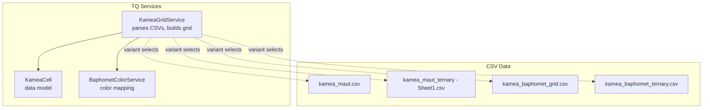
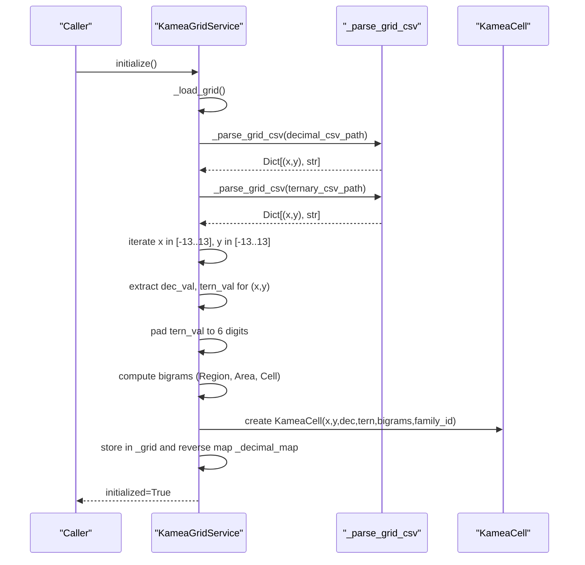
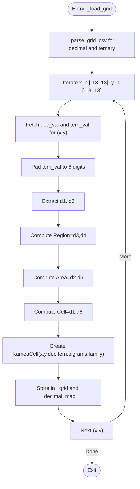
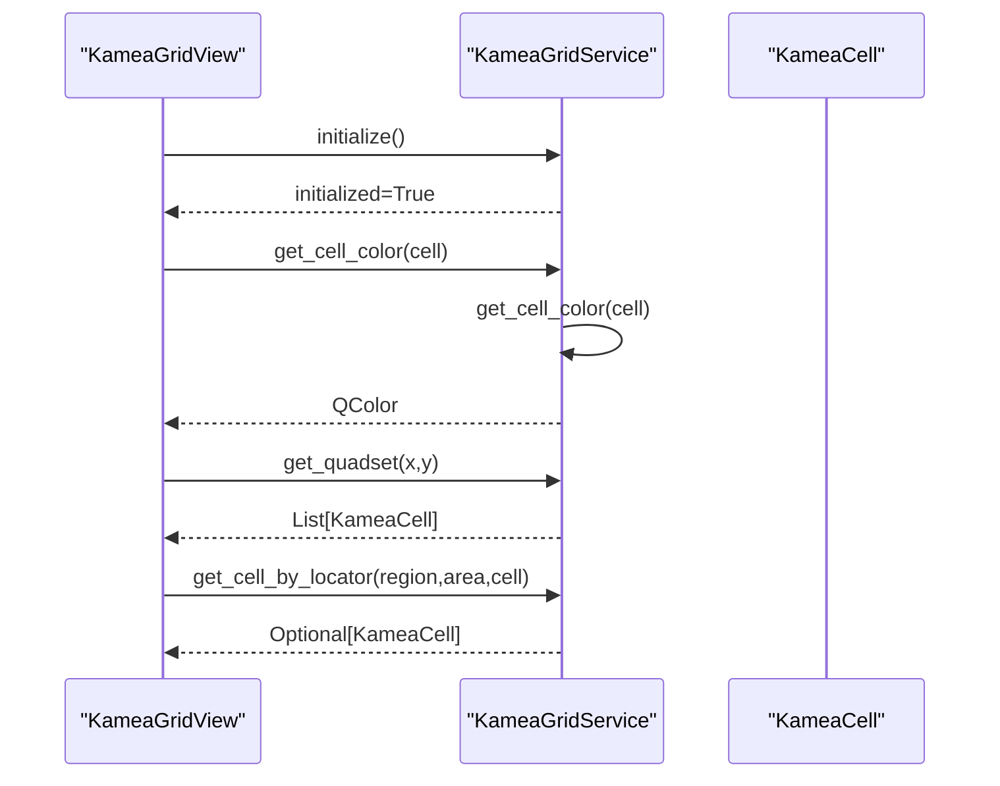
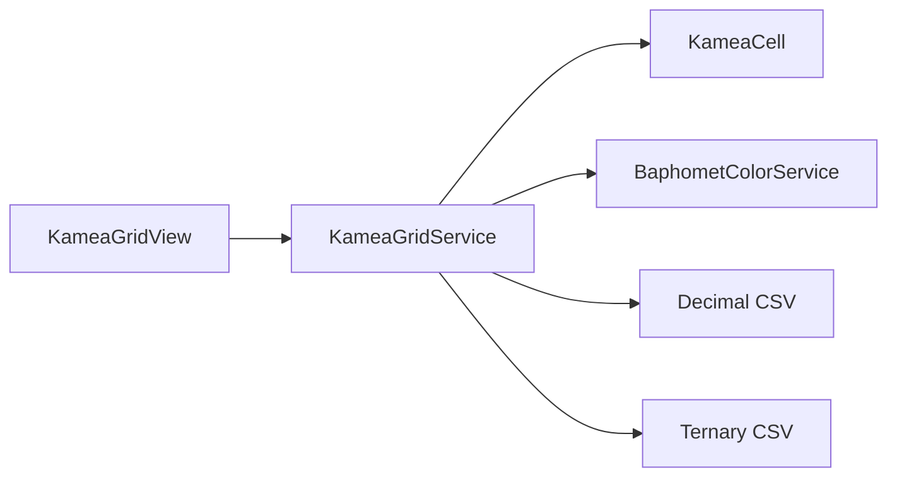

# Grid Initialization and Data Loading

<cite>
**Referenced Files in This Document**
- [kamea_grid_service.py](file://src/pillars/tq/services/kamea_grid_service.py)
- [kamea_cell.py](file://src/pillars/tq/models/kamea_cell.py)
- [baphomet_color_service.py](file://src/pillars/tq/services/baphomet_color_service.py)
- [kamea_grid_view.py](file://src/pillars/tq/ui/kamea_grid_view.py)
- [kamea_baphomet_grid.csv](file://src/pillars/tq/data/kamea_baphomet_grid.csv)
- [kamea_baphomet_ternary.csv](file://src/pillars/tq/data/kamea_baphomet_ternary.csv)
- [kamea_maut.csv](file://Docs/kamea/kamea_maut.csv)
- [kamea_maut_ternary - Sheet1.csv](file://Docs/kamea/kamea_maut_ternary - Sheet1.csv)
- [The_Kamea_Doctrine.md](file://Docs/kamea/The_Kamea_Doctrine.md)
- [temp_verify_kamea.py](file://temp_verify_kamea.py)
</cite>

## Table of Contents
1. [Introduction](#introduction)
2. [Project Structure](#project-structure)
3. [Core Components](#core-components)
4. [Architecture Overview](#architecture-overview)
5. [Detailed Component Analysis](#detailed-component-analysis)
6. [Dependency Analysis](#dependency-analysis)
7. [Performance Considerations](#performance-considerations)
8. [Troubleshooting Guide](#troubleshooting-guide)
9. [Conclusion](#conclusion)

## Introduction
This document explains the Kamea Grid initialization process, focusing on how the grid is parsed from CSV files for both Maut and Baphomet variants. It covers:
- File path resolution for variant selection
- Coordinate mapping from CSV headers and rows
- Parsing of structured CSV with Cartesian headers
- Construction of KameaCell objects with bigram decomposition (Region, Area, Cell) from ternary digit positions
- Integration of decimal and ternary data
- Lazy initialization via the initialize() method
- Error handling for missing coordinates
- Configuration options for variant selection and filesystem path dependencies

## Project Structure
The Kamea Grid functionality is implemented in the TQ pillar under src/pillars/tq. CSV data for both variants resides in Docs/kamea for Maut and src/pillars/tq/data for Baphomet. The service constructs KameaCell objects and exposes grid operations.

**Diagram sources**
- [kamea_grid_service.py](file://src/pillars/tq/services/kamea_grid_service.py#L17-L33)
- [kamea_cell.py](file://src/pillars/tq/models/kamea_cell.py#L1-L59)
- [baphomet_color_service.py](file://src/pillars/tq/services/baphomet_color_service.py#L1-L62)
- [kamea_maut.csv](file://Docs/kamea/kamea_maut.csv#L1-L28)
- [kamea_maut_ternary - Sheet1.csv](file://Docs/kamea/kamea_maut_ternary - Sheet1.csv#L1-L28)
- [kamea_baphomet_grid.csv](file://src/pillars/tq/data/kamea_baphomet_grid.csv#L1-L29)
- [kamea_baphomet_ternary.csv](file://src/pillars/tq/data/kamea_baphomet_ternary.csv#L1-L29)

**Section sources**
- [kamea_grid_service.py](file://src/pillars/tq/services/kamea_grid_service.py#L17-L33)

## Core Components
- KameaGridService: Loads and manages the 27x27 grid, resolves file paths by variant, parses CSVs, constructs KameaCell objects, and provides grid operations.
- KameaCell: Holds cell metadata including Cartesian coordinates, decimal and ternary values, bigrams, and derived properties.
- BaphometColorService: Computes cell colors from ternary values for Baphomet variant visualization.
- CSV Data: Decimal and ternary CSVs for both Maut and Baphomet variants.

Key responsibilities:
- Variant selection determines which CSVs are loaded.
- CSV parsing maps headers and rows to coordinates and values.
- Bigram decomposition extracts Region, Area, and Cell from ternary digits.
- Lazy initialization ensures CSVs are loaded on first access.

**Section sources**
- [kamea_grid_service.py](file://src/pillars/tq/services/kamea_grid_service.py#L17-L33)
- [kamea_cell.py](file://src/pillars/tq/models/kamea_cell.py#L1-L59)
- [baphomet_color_service.py](file://src/pillars/tq/services/baphomet_color_service.py#L1-L62)

## Architecture Overview
The initialization lifecycle integrates CSV parsing, coordinate mapping, and bigram extraction into KameaCell construction.

**Diagram sources**
- [kamea_grid_service.py](file://src/pillars/tq/services/kamea_grid_service.py#L41-L118)
- [kamea_grid_service.py](file://src/pillars/tq/services/kamea_grid_service.py#L120-L219)

## Detailed Component Analysis

### KameaGridService: Initialization and CSV Parsing
- Variant selection:
  - Baphomet variant: Uses local CSVs under src/pillars/tq/data.
  - Maut variant: Uses CSVs under Docs/kamea.
- Lazy initialization:
  - initialize() loads CSVs only once and sets an internal flag.
  - Properties and methods that access grid data call initialize() if not yet loaded.
- _load_grid():
  - Reads both decimal and ternary CSVs via _parse_grid_csv().
  - Iterates over the full Cartesian domain [-13, 13] for both x and y.
  - For each coordinate, retrieves decimal and ternary values and constructs KameaCell.
  - Ensures ternary values are zero-padded to six digits.
  - Computes bigrams:
    - Region (Core): digits at positions 3 and 4 (0-indexed).
    - Area (Body): digits at positions 2 and 5.
    - Cell (Skin): digits at positions 1 and 6.
  - Stores each cell in a dictionary keyed by (x, y) and maintains a reverse map from decimal value to coordinates.
- _parse_grid_csv():
  - Expects:
    - First row header enumerating X coordinates.
    - First column enumerating Y coordinates.
    - Intersections as values.
  - Builds a dictionary mapping (x, y) tuples to values.
  - Skips invalid headers and rows.
- Error handling:
  - Missing data for a coordinate triggers a warning and continues iteration.

Integration with UI:
- KameaGridView initializes the scene by calling service.initialize() and then rendering cells with colors from BaphometColorService.

**Section sources**
- [kamea_grid_service.py](file://src/pillars/tq/services/kamea_grid_service.py#L17-L33)
- [kamea_grid_service.py](file://src/pillars/tq/services/kamea_grid_service.py#L41-L118)
- [kamea_grid_service.py](file://src/pillars/tq/services/kamea_grid_service.py#L120-L219)

### CSV Structure Interpretation
- Headers and rows:
  - First row: X coordinates from -13 to +13.
  - First column: Y coordinates from +13 to -13.
  - Intersections: values at (x, y).
- Decimal CSV:
  - Contains decimal values for each grid position.
- Ternary CSV:
  - Contains 6-digit ternary strings for each grid position.
- Coordinate mapping:
  - Column index 0 is Y; subsequent columns map to X.
  - Row index 0 is header; rows 1..29 map Y from +13 down to -13.

Examples of structure interpretation:
- Header row maps column indices to X coordinates.
- First column of each data row maps to Y.
- Value at (x, y) is the intersection of the X column and Y row.

**Section sources**
- [kamea_baphomet_grid.csv](file://src/pillars/tq/data/kamea_baphomet_grid.csv#L1-L29)
- [kamea_baphomet_ternary.csv](file://src/pillars/tq/data/kamea_baphomet_ternary.csv#L1-L29)
- [kamea_maut.csv](file://Docs/kamea/kamea_maut.csv#L1-L28)
- [kamea_maut_ternary - Sheet1.csv](file://Docs/kamea/kamea_maut_ternary - Sheet1.csv#L1-L28)

### Bigram Decomposition and KameaCell Construction
- Ternary digit positions (0-indexed):
  - d1, d2, d3, d4, d5, d6.
- Bigrams:
  - Region (Core): bigram(d3, d4).
  - Area (Body): bigram(d2, d5).
  - Cell (Skin): bigram(d1, d6).
- KameaCell attributes:
  - x, y: Cartesian coordinates.
  - ternary_value: 6-digit string.
  - decimal_value: integer from decimal CSV.
  - bigrams: tuple of three bigram integers.
  - family_id: equals Region (0–8).
- Additional properties:
  - kamea_locator: string combining family_id and Area/Cell.
  - is_axis: True if x=0 or y=0.
  - is_origin: True if x=0 and y=0.
  - pyx_count: count of digit '0' in ternary value.
  - conrune_vector: magnitude of vector between value and its Conrune.

**Diagram sources**
- [kamea_grid_service.py](file://src/pillars/tq/services/kamea_grid_service.py#L120-L178)
- [kamea_cell.py](file://src/pillars/tq/models/kamea_cell.py#L1-L59)

**Section sources**
- [kamea_grid_service.py](file://src/pillars/tq/services/kamea_grid_service.py#L120-L178)
- [kamea_cell.py](file://src/pillars/tq/models/kamea_cell.py#L1-L59)

### Variant Selection and Filesystem Path Dependencies
- Variant selection:
  - Constructor accepts variant="Maut" or "Baphomet".
  - Baphomet variant:
    - Resolves CSV paths relative to the service module path.
    - Uses src/pillars/tq/data/kamea_baphomet_grid.csv and kamea_baphomet_ternary.csv.
  - Maut variant:
    - Uses absolute paths under Docs/kamea for kamea_maut.csv and kamea_maut_ternary - Sheet1.csv.
- Implications:
  - Ensure the Docs/kamea directory exists and contains the Maut CSVs when variant is "Maut".
  - Ensure src/pillars/tq/data contains the Baphomet CSVs when variant is "Baphomet".

**Section sources**
- [kamea_grid_service.py](file://src/pillars/tq/services/kamea_grid_service.py#L17-L33)

### Lazy Loading Lifecycle and Access Patterns
- Lazy loading:
  - initialize() performs CSV load once and marks the service initialized.
  - Properties and methods that require grid data call initialize() transparently.
- Typical access:
  - get_cell(x, y) returns a cell if present.
  - get_cell_by_locator(region, area, cell) iterates all cells to find a match.
  - get_quadset(x, y) returns related cells depending on variant.
- UI integration:
  - KameaGridView calls service.initialize() before building the scene.
  - Colors are computed via BaphometColorService.resolve_color().

**Diagram sources**
- [kamea_grid_view.py](file://src/pillars/tq/ui/kamea_grid_view.py#L234-L256)
- [kamea_grid_service.py](file://src/pillars/tq/services/kamea_grid_service.py#L41-L118)
- [baphomet_color_service.py](file://src/pillars/tq/services/baphomet_color_service.py#L35-L62)

**Section sources**
- [kamea_grid_view.py](file://src/pillars/tq/ui/kamea_grid_view.py#L234-L256)
- [kamea_grid_service.py](file://src/pillars/tq/services/kamea_grid_service.py#L41-L118)

### CSV Parsing Utility: _parse_grid_csv
- Assumptions:
  - Header row enumerates X coordinates.
  - First column enumerates Y coordinates.
  - Remaining intersections are values.
- Behavior:
  - Builds a mapping from (x, y) to value.
  - Skips invalid headers and rows.
  - Returns a dictionary for fast lookup during grid construction.

**Section sources**
- [kamea_grid_service.py](file://src/pillars/tq/services/kamea_grid_service.py#L184-L219)

### Integration of Decimal and Ternary Data
- Decimal CSV provides integer values per coordinate.
- Ternary CSV provides 6-digit ternary strings per coordinate.
- During initialization:
  - Both dictionaries are merged by (x, y).
  - Ternary values are normalized to 6-digit strings.
  - Bigrams are computed from digit pairs.
  - KameaCell instances are created and stored.

**Section sources**
- [kamea_grid_service.py](file://src/pillars/tq/services/kamea_grid_service.py#L120-L178)

### Error Handling for Missing Coordinates
- Missing data for a coordinate:
  - Caught by KeyError when retrieving values from parsed dictionaries.
  - Logged as a warning and the loop continues to the next coordinate.
- Recommendation:
  - Ensure both decimal and ternary CSVs are complete for the full grid to avoid gaps.

**Section sources**
- [kamea_grid_service.py](file://src/pillars/tq/services/kamea_grid_service.py#L179-L183)

### Example: CSV Structure Interpretation
- Decimal CSV:
  - Header row: X coordinates from -13 to +13.
  - First column: Y coordinates from +13 to -13.
  - Values: decimal integers at each (x, y).
- Ternary CSV:
  - Same layout with 6-digit ternary strings.

Verification script demonstrates initialization and basic checks for corners and center.

**Section sources**
- [kamea_baphomet_grid.csv](file://src/pillars/tq/data/kamea_baphomet_grid.csv#L1-L29)
- [kamea_baphomet_ternary.csv](file://src/pillars/tq/data/kamea_baphomet_ternary.csv#L1-L29)
- [kamea_maut.csv](file://Docs/kamea/kamea_maut.csv#L1-L28)
- [kamea_maut_ternary - Sheet1.csv](file://Docs/kamea/kamea_maut_ternary - Sheet1.csv#L1-L28)
- [temp_verify_kamea.py](file://temp_verify_kamea.py#L1-L35)

## Dependency Analysis
- KameaGridService depends on:
  - CSV parsing utilities (built-in csv module).
  - KameaCell model.
  - BaphometColorService for color computation.
  - Variant-specific CSV files.
- UI depends on:
  - KameaGridService for data and operations.
  - PyQt6 for rendering and interaction.

**Diagram sources**
- [kamea_grid_service.py](file://src/pillars/tq/services/kamea_grid_service.py#L17-L33)
- [kamea_cell.py](file://src/pillars/tq/models/kamea_cell.py#L1-L59)
- [baphomet_color_service.py](file://src/pillars/tq/services/baphomet_color_service.py#L1-L62)
- [kamea_grid_view.py](file://src/pillars/tq/ui/kamea_grid_view.py#L234-L256)

**Section sources**
- [kamea_grid_service.py](file://src/pillars/tq/services/kamea_grid_service.py#L17-L33)
- [kamea_grid_view.py](file://src/pillars/tq/ui/kamea_grid_view.py#L234-L256)

## Performance Considerations
- Initialization cost:
  - Two CSV parses over 729 entries each, plus constant-time bigram computations per cell.
  - Lazy loading avoids unnecessary work until the grid is accessed.
- Lookups:
  - Grid storage is a dictionary keyed by (x, y) for O(1) access.
  - Reverse mapping from decimal value to coordinates enables chord value retrieval.
- UI rendering:
  - Scene creation iterates the grid once; color computation is constant per cell.

[No sources needed since this section provides general guidance]

## Troubleshooting Guide
- Missing CSV files:
  - Ensure Docs/kamea contains kamea_maut.csv and kamea_maut_ternary - Sheet1.csv when variant is "Maut".
  - Ensure src/pillars/tq/data contains kamea_baphomet_grid.csv and kamea_baphomet_ternary.csv when variant is "Baphomet".
- Incorrect paths:
  - For Baphomet variant, paths are resolved relative to the service module; ensure the repository structure is intact.
- Partial grid data:
  - Missing coordinates produce warnings; verify both decimal and ternary CSVs are complete.
- Access before initialization:
  - Methods and properties call initialize() automatically, but explicit initialize() can be used for testing.

**Section sources**
- [kamea_grid_service.py](file://src/pillars/tq/services/kamea_grid_service.py#L17-L33)
- [kamea_grid_service.py](file://src/pillars/tq/services/kamea_grid_service.py#L179-L183)
- [temp_verify_kamea.py](file://temp_verify_kamea.py#L1-L35)

## Conclusion
The Kamea Grid initialization process is robust and variant-aware. KameaGridService lazily loads CSV data, maps Cartesian coordinates, and constructs KameaCell objects with precise bigram decomposition. The design cleanly separates data parsing, model construction, and UI rendering, while providing clear configuration options for variant selection and filesystem path dependencies.