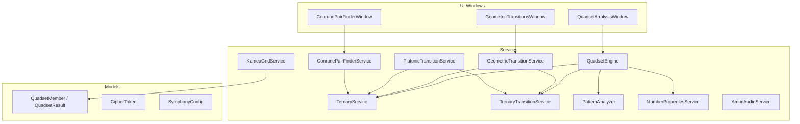
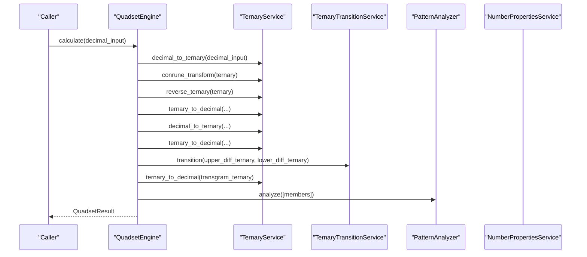
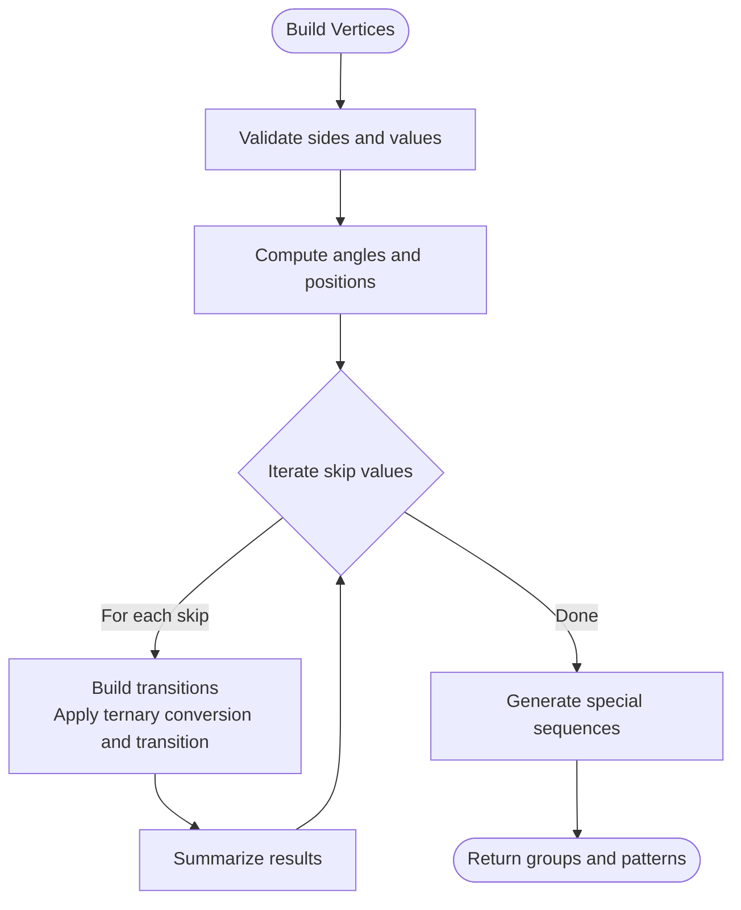
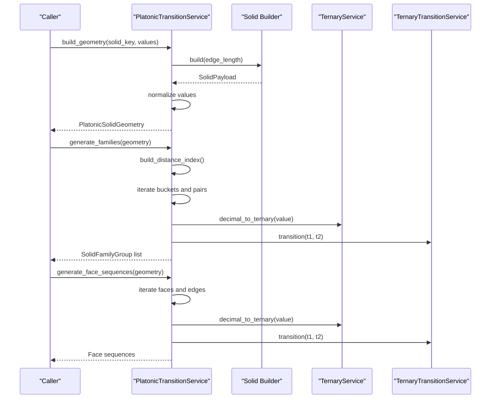
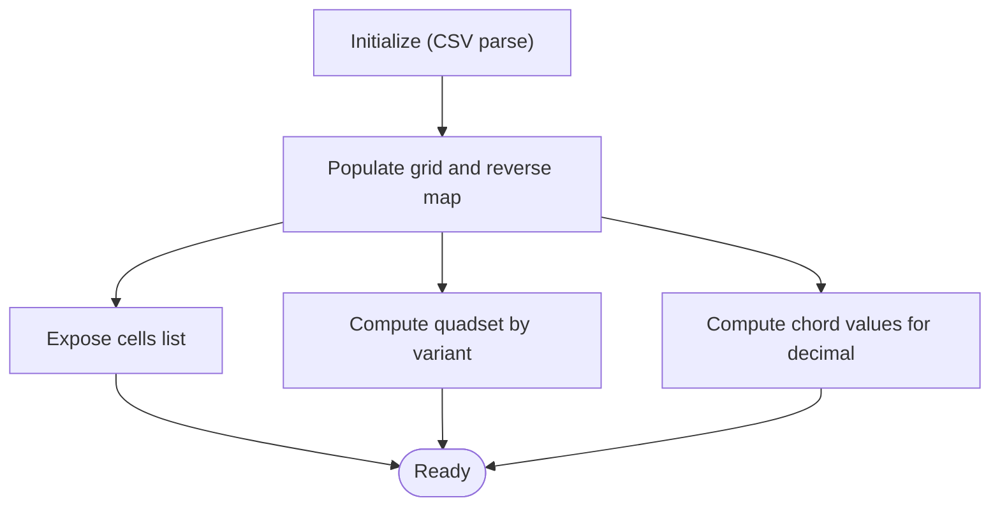
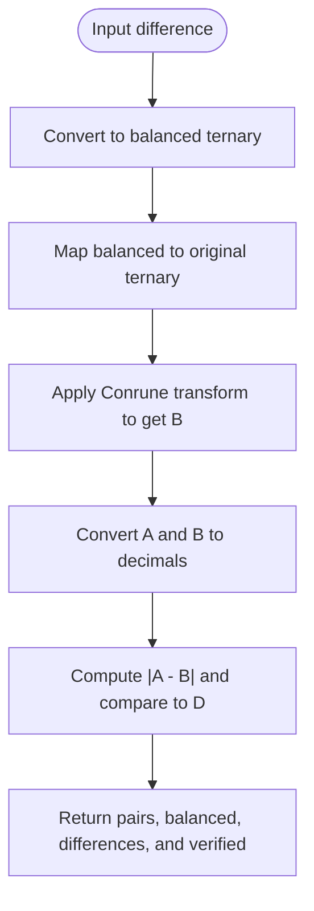
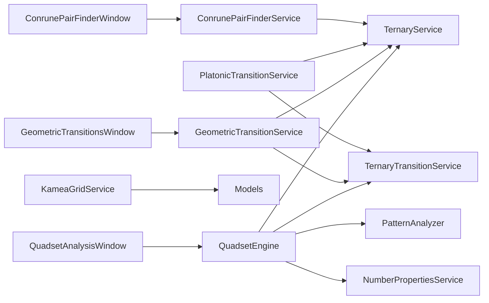

# TQ API

<cite>
**Referenced Files in This Document**
- [quadset_engine.py](file://src/pillars/tq/services/quadset_engine.py)
- [geometric_transition_service.py](file://src/pillars/tq/services/geometric_transition_service.py)
- [platonic_transition_service.py](file://src/pillars/tq/services/platonic_transition_service.py)
- [kamea_grid_service.py](file://src/pillars/tq/services/kamea_grid_service.py)
- [conrune_pair_finder_service.py](file://src/pillars/tq/services/conrune_pair_finder_service.py)
- [ternary_service.py](file://src/pillars/tq/services/ternary_service.py)
- [ternary_transition_service.py](file://src/pillars/tq/services/ternary_transition_service.py)
- [pattern_analyzer.py](file://src/pillars/tq/services/pattern_analyzer.py)
- [number_properties.py](file://src/pillars/tq/services/number_properties.py)
- [quadset_models.py](file://src/pillars/tq/models/quadset_models.py)
- [cipher_token.py](file://src/pillars/tq/models/cipher_token.py)
- [symphony_config.py](file://src/pillars/tq/models/symphony_config.py)
- [amun_audio_service.py](file://src/pillars/tq/services/amun_audio_service.py)
- [quadset_analysis_window.py](file://src/pillars/tq/ui/quadset_analysis_window.py)
- [geometric_transitions_window.py](file://src/pillars/tq/ui/geometric_transitions_window.py)
- [conrune_pair_finder_window.py](file://src/pillars/tq/ui/conrune_pair_finder_window.py)
</cite>

## Table of Contents
1. [Introduction](#introduction)
2. [Project Structure](#project-structure)
3. [Core Components](#core-components)
4. [Architecture Overview](#architecture-overview)
5. [Detailed Component Analysis](#detailed-component-analysis)
6. [Dependency Analysis](#dependency-analysis)
7. [Performance Considerations](#performance-considerations)
8. [Troubleshooting Guide](#troubleshooting-guide)
9. [Conclusion](#conclusion)
10. [Appendices](#appendices)

## Introduction
This document provides API documentation for the TQ (Trigrammaton QBLH) pillar’s service layer. It focuses on the core pattern analysis engine and related services that power trigrammaton sequence analysis, geometric morphing, Platonic solid transformations, magic square operations, rune pairing logic, base-3 encoding, and sonic pattern generation. It also specifies state management for transition sequences, audio rendering parameters, and pattern matching algorithms, and includes examples and guidance for thread safety and memory considerations.

## Project Structure
The TQ pillar organizes its logic into services, models, and UI windows. Services encapsulate computation and orchestration, models define data contracts, and UI windows integrate services into interactive workflows.

**Diagram sources**
- [quadset_engine.py](file://src/pillars/tq/services/quadset_engine.py#L1-L87)
- [geometric_transition_service.py](file://src/pillars/tq/services/geometric_transition_service.py#L1-L323)
- [platonic_transition_service.py](file://src/pillars/tq/services/platonic_transition_service.py#L1-L371)
- [kamea_grid_service.py](file://src/pillars/tq/services/kamea_grid_service.py#L1-L220)
- [conrune_pair_finder_service.py](file://src/pillars/tq/services/conrune_pair_finder_service.py#L1-L82)
- [ternary_service.py](file://src/pillars/tq/services/ternary_service.py#L1-L114)
- [ternary_transition_service.py](file://src/pillars/tq/services/ternary_transition_service.py#L1-L70)
- [pattern_analyzer.py](file://src/pillars/tq/services/pattern_analyzer.py#L1-L163)
- [number_properties.py](file://src/pillars/tq/services/number_properties.py#L1-L230)
- [quadset_models.py](file://src/pillars/tq/models/quadset_models.py#L1-L41)
- [cipher_token.py](file://src/pillars/tq/models/cipher_token.py#L1-L35)
- [symphony_config.py](file://src/pillars/tq/models/symphony_config.py#L1-L46)
- [amun_audio_service.py](file://src/pillars/tq/services/amun_audio_service.py#L1-L256)
- [quadset_analysis_window.py](file://src/pillars/tq/ui/quadset_analysis_window.py#L1-L986)
- [geometric_transitions_window.py](file://src/pillars/tq/ui/geometric_transitions_window.py#L1-L875)
- [conrune_pair_finder_window.py](file://src/pillars/tq/ui/conrune_pair_finder_window.py#L1-L398)

**Section sources**
- [quadset_engine.py](file://src/pillars/tq/services/quadset_engine.py#L1-L87)
- [geometric_transition_service.py](file://src/pillars/tq/services/geometric_transition_service.py#L1-L323)
- [platonic_transition_service.py](file://src/pillars/tq/services/platonic_transition_service.py#L1-L371)
- [kamea_grid_service.py](file://src/pillars/tq/services/kamea_grid_service.py#L1-L220)
- [conrune_pair_finder_service.py](file://src/pillars/tq/services/conrune_pair_finder_service.py#L1-L82)
- [ternary_service.py](file://src/pillars/tq/services/ternary_service.py#L1-L114)
- [ternary_transition_service.py](file://src/pillars/tq/services/ternary_transition_service.py#L1-L70)
- [pattern_analyzer.py](file://src/pillars/tq/services/pattern_analyzer.py#L1-L163)
- [number_properties.py](file://src/pillars/tq/services/number_properties.py#L1-L230)
- [quadset_models.py](file://src/pillars/tq/models/quadset_models.py#L1-L41)
- [cipher_token.py](file://src/pillars/tq/models/cipher_token.py#L1-L35)
- [symphony_config.py](file://src/pillars/tq/models/symphony_config.py#L1-L46)
- [amun_audio_service.py](file://src/pillars/tq/services/amun_audio_service.py#L1-L256)
- [quadset_analysis_window.py](file://src/pillars/tq/ui/quadset_analysis_window.py#L1-L986)
- [geometric_transitions_window.py](file://src/pillars/tq/ui/geometric_transitions_window.py#L1-L875)
- [conrune_pair_finder_window.py](file://src/pillars/tq/ui/conrune_pair_finder_window.py#L1-L398)

## Core Components
- QuadsetEngine: Orchestrates Quadset analysis by computing Original, Conrune, Reversal, Conrune Reversal, differentials, transgram, totals, and pattern summaries.
- GeometricTransitionService: Generates transitions on regular polygons (3–27 sides) using skip groups and special patterns, with summary statistics.
- PlatonicTransitionService: Computes ternary transitions across Platonic and Archimedean solids, grouping edges by geometric distance families and generating face sequences.
- KameaGridService: Loads and exposes the 27×27 Kamea grid, resolves cells by coordinates or locator triplets, and computes chord values (Quadset or Converse Pair).
- ConrunePairFinderService: Builds balanced ternary from a target difference, maps to original and Conrune pairs, and verifies absolute difference.
- TernaryService and TernaryTransitionService: Provide base-3 conversions, transformations, and transition mapping.
- PatternAnalyzer and NumberPropertiesService: Offer pattern analysis and number property computations used by QuadsetEngine.
- AmunAudioService: Generates WAV files via additive synthesis with envelopes, layers, detuning, and audio types.
- Models: QuadsetMember/QuadsetResult, CipherToken, and SymphonyConfig define data contracts and synthesis parameters.

**Section sources**
- [quadset_engine.py](file://src/pillars/tq/services/quadset_engine.py#L1-L87)
- [geometric_transition_service.py](file://src/pillars/tq/services/geometric_transition_service.py#L1-L323)
- [platonic_transition_service.py](file://src/pillars/tq/services/platonic_transition_service.py#L1-L371)
- [kamea_grid_service.py](file://src/pillars/tq/services/kamea_grid_service.py#L1-L220)
- [conrune_pair_finder_service.py](file://src/pillars/tq/services/conrune_pair_finder_service.py#L1-L82)
- [ternary_service.py](file://src/pillars/tq/services/ternary_service.py#L1-L114)
- [ternary_transition_service.py](file://src/pillars/tq/services/ternary_transition_service.py#L1-L70)
- [pattern_analyzer.py](file://src/pillars/tq/services/pattern_analyzer.py#L1-L163)
- [number_properties.py](file://src/pillars/tq/services/number_properties.py#L1-L230)
- [quadset_models.py](file://src/pillars/tq/models/quadset_models.py#L1-L41)
- [cipher_token.py](file://src/pillars/tq/models/cipher_token.py#L1-L35)
- [symphony_config.py](file://src/pillars/tq/models/symphony_config.py#L1-L46)
- [amun_audio_service.py](file://src/pillars/tq/services/amun_audio_service.py#L1-L256)

## Architecture Overview
The service layer composes specialized services around shared utilities and models. QuadsetEngine integrates TernaryService, TernaryTransitionService, PatternAnalyzer, and NumberPropertiesService. GeometricTransitionService and PlatonicTransitionService both depend on TernaryService and TernaryTransitionService to produce transition results. KameaGridService loads CSV-backed grids and exposes quadset chords. ConrunePairFinderService uses TernaryService to derive balanced ternary and reconstruct pairs. AmunAudioService synthesizes audio from synthesis parameters.

```mermaid
classDiagram
class QuadsetEngine {
+calculate(decimal_input) QuadsetResult
-_create_member(name, decimal, ternary) QuadsetMember
}
class GeometricTransitionService {
+get_polygon_options() List
+build_vertices(sides, values) List
+generate_skip_groups(vertices, max_skip) List
+generate_special_sequences(vertices) List
}
class PlatonicTransitionService {
+get_solid_options() List
+build_geometry(solid_key, values) PlatonicSolidGeometry
+generate_families(geometry) List
+generate_face_sequences(geometry) List
}
class KameaGridService {
+initialize()
+get_cell(x, y) KameaCell
+get_cell_by_locator(region, area, cell) KameaCell
+get_quadset(x, y) List
+get_chord_values(decimal_value) List
}
class ConrunePairFinderService {
+analyze(difference) Dict
}
class TernaryService {
+decimal_to_ternary(n) str
+ternary_to_decimal(t) int
+conrune_transform(t) str
+reverse_ternary(t) str
}
class TernaryTransitionService {
+transition(t1, t2) str
+generate_sequence(start_t, modifier_t, iterations) List
}
class PatternAnalyzer {
+analyze(members) str
}
class NumberPropertiesService {
+get_properties(n) Dict
}
class AmunAudioService {
+generate_wave_file(freq, attack, release, layers, detune, audio_type) str
+generate_sequence(signatures, note_duration) str
}
QuadsetEngine --> TernaryService
QuadsetEngine --> TernaryTransitionService
QuadsetEngine --> PatternAnalyzer
QuadsetEngine --> NumberPropertiesService
GeometricTransitionService --> TernaryService
GeometricTransitionService --> TernaryTransitionService
PlatonicTransitionService --> TernaryService
PlatonicTransitionService --> TernaryTransitionService
ConrunePairFinderService --> TernaryService
```

**Diagram sources**
- [quadset_engine.py](file://src/pillars/tq/services/quadset_engine.py#L1-L87)
- [geometric_transition_service.py](file://src/pillars/tq/services/geometric_transition_service.py#L1-L323)
- [platonic_transition_service.py](file://src/pillars/tq/services/platonic_transition_service.py#L1-L371)
- [kamea_grid_service.py](file://src/pillars/tq/services/kamea_grid_service.py#L1-L220)
- [conrune_pair_finder_service.py](file://src/pillars/tq/services/conrune_pair_finder_service.py#L1-L82)
- [ternary_service.py](file://src/pillars/tq/services/ternary_service.py#L1-L114)
- [ternary_transition_service.py](file://src/pillars/tq/services/ternary_transition_service.py#L1-L70)
- [pattern_analyzer.py](file://src/pillars/tq/services/pattern_analyzer.py#L1-L163)
- [number_properties.py](file://src/pillars/tq/services/number_properties.py#L1-L230)
- [amun_audio_service.py](file://src/pillars/tq/services/amun_audio_service.py#L1-L256)

## Detailed Component Analysis

### QuadsetEngine
- Purpose: Compute a full Quadset analysis for a decimal input, including Original, Conrune, Reversal, Conrune Reversal, differentials, transgram, totals, and a pattern summary.
- Inputs: Integer decimal input.
- Outputs: QuadsetResult containing members, aggregates, and pattern summary.
- Processing:
  - Convert input to ternary; compute Conrune and Reversal; compute Conrune Reversal.
  - Compute upper and lower differentials; compute transgram via TernaryTransitionService.
  - Aggregate quadset_sum and septad_total.
  - Analyze patterns via PatternAnalyzer and attach number properties via NumberPropertiesService.
- State: None; pure function of input to QuadsetResult.

**Diagram sources**
- [quadset_engine.py](file://src/pillars/tq/services/quadset_engine.py#L1-L87)
- [ternary_service.py](file://src/pillars/tq/services/ternary_service.py#L1-L114)
- [ternary_transition_service.py](file://src/pillars/tq/services/ternary_transition_service.py#L1-L70)
- [pattern_analyzer.py](file://src/pillars/tq/services/pattern_analyzer.py#L1-L163)
- [number_properties.py](file://src/pillars/tq/services/number_properties.py#L1-L230)

**Section sources**
- [quadset_engine.py](file://src/pillars/tq/services/quadset_engine.py#L1-L87)
- [quadset_models.py](file://src/pillars/tq/models/quadset_models.py#L1-L41)

### GeometricTransitionService
- Purpose: Morph between vertices on regular polygons (3–27 sides) using skip groups and special patterns, applying ternary transitions to vertex values.
- Inputs: sides, optional vertex values, max skip, optional special pattern selection.
- Outputs: Vertices, skip groups, special sequences, and summary statistics.
- Processing:
  - Build vertices with normalized values and unit-circle coordinates.
  - Generate skip groups by iterating skip values and building transitions.
  - Compute transition results per edge using TernaryService and TernaryTransitionService.
  - Summarize per-group statistics (count, sum, mean, min/max, unique results).
  - Support special patterns for specific polygons (e.g., heptagon stars).
- State: None; deterministic computation per input.

**Diagram sources**
- [geometric_transition_service.py](file://src/pillars/tq/services/geometric_transition_service.py#L1-L323)
- [ternary_service.py](file://src/pillars/tq/services/ternary_service.py#L1-L114)
- [ternary_transition_service.py](file://src/pillars/tq/services/ternary_transition_service.py#L1-L70)

**Section sources**
- [geometric_transition_service.py](file://src/pillars/tq/services/geometric_transition_service.py#L1-L323)

### PlatonicTransitionService
- Purpose: Compute ternary transitions across vertices of Platonic and Archimedean solids, grouping edges by geometric distance families and generating face-based sequences.
- Inputs: solid key, optional vertex values.
- Outputs: geometry payload (vertices, edges, faces), grouped families, and face sequences.
- Processing:
  - Resolve solid geometry payload via builders.
  - Normalize vertex values and construct SolidVertex3D entries.
  - Build distance index and segment lists to group edges by distance buckets.
  - Generate SolidTransition3D entries per pair and compute summaries.
  - Generate face sequences by cycling over polygonal faces.
- State: None; deterministic computation per geometry.

**Diagram sources**
- [platonic_transition_service.py](file://src/pillars/tq/services/platonic_transition_service.py#L1-L371)
- [ternary_service.py](file://src/pillars/tq/services/ternary_service.py#L1-L114)
- [ternary_transition_service.py](file://src/pillars/tq/services/ternary_transition_service.py#L1-L70)

**Section sources**
- [platonic_transition_service.py](file://src/pillars/tq/services/platonic_transition_service.py#L1-L371)

### KameaGridService
- Purpose: Load and expose the 27×27 Kamea grid from CSVs, resolve cells by coordinates or locator triplets, and compute chord values (Quadset or Converse Pair).
- Inputs: variant selection (“Maut” or “Baphomet”), optional decimal value for chord lookup.
- Outputs: list of cells, individual cell, quadset chord values.
- Processing:
  - Initialize by parsing CSVs and constructing KameaCell entries with decimal and ternary values.
  - Derive bigrams (region, area, cell) from ternary digits and family_id from region.
  - Provide quadset computation based on variant rules.
  - Provide reverse lookup from decimal to coordinates.
- State: Internal grid cache and reverse map; lazy initialization.

**Diagram sources**
- [kamea_grid_service.py](file://src/pillars/tq/services/kamea_grid_service.py#L1-L220)

**Section sources**
- [kamea_grid_service.py](file://src/pillars/tq/services/kamea_grid_service.py#L1-L220)

### ConrunePairFinderService
- Purpose: Given a target absolute difference D, convert to balanced ternary, map to original and Conrune pairs, and verify |A − B| = D.
- Inputs: integer difference.
- Outputs: balanced ternary, pair list (A and B), calculated difference, verification flag.
- Processing:
  - Convert decimal to balanced ternary using base-3 arithmetic with -1 symbol.
  - Map balanced to original ternary and apply Conrune transform to obtain B.
  - Convert back to decimals and compute absolute difference.
  - Report verification status.

**Diagram sources**
- [conrune_pair_finder_service.py](file://src/pillars/tq/services/conrune_pair_finder_service.py#L1-L82)
- [ternary_service.py](file://src/pillars/tq/services/ternary_service.py#L1-L114)

**Section sources**
- [conrune_pair_finder_service.py](file://src/pillars/tq/services/conrune_pair_finder_service.py#L1-L82)

### TernaryService and TernaryTransitionService
- TernaryService: Provides conversions between decimal and ternary, Conrune transform (swap 1↔2), and reversal of ternary strings.
- TernaryTransitionService: Applies a digit-wise transition mapping on aligned ternary strings and can generate iterative transition sequences.

**Section sources**
- [ternary_service.py](file://src/pillars/tq/services/ternary_service.py#L1-L114)
- [ternary_transition_service.py](file://src/pillars/tq/services/ternary_transition_service.py#L1-L70)

### PatternAnalyzer and NumberPropertiesService
- NumberPropertiesService: Computes primality, factors, prime factorization, polygonal and centered polygonal numbers, digit sums, abundances, and more.
- PatternAnalyzer: Produces a textual report summarizing LCM/GCD, parity, shared divisors, primes, factor counts, abundance, digit sums/roots, palindromes, progressions, modular congruence, ternary palindromes, digit frequency, and more.

**Section sources**
- [number_properties.py](file://src/pillars/tq/services/number_properties.py#L1-L230)
- [pattern_analyzer.py](file://src/pillars/tq/services/pattern_analyzer.py#L1-L163)

### AmunAudioService
- Purpose: Generate WAV files using additive synthesis with envelopes, layers, detuning, and audio types. Supports sequencing multiple signatures into a single file.
- Rendering parameters:
  - Sample rate: 44100 Hz
  - Envelope: attack and release durations
  - Layers: additive harmonics and detuning
  - Audio types: Standard, Ambient, Reedy, Brassy, Percussive, Plucked, Bass, Pulse
  - Waveforms: sine, square, saw, brass mix (saw + triangle)
- Thread safety: The service is stateless and uses local buffers; however, audio generation writes to temporary files and performs blocking I/O. For real-time audio generation, isolate synthesis to a dedicated thread and avoid blocking the UI thread.

**Section sources**
- [amun_audio_service.py](file://src/pillars/tq/services/amun_audio_service.py#L1-L256)

### UI Integration
- QuadsetAnalysisWindow: Drives QuadsetEngine, displays QuadsetResult, and renders number properties and pattern summary.
- GeometricTransitionsWindow: Drives GeometricTransitionService, visualizes polygons, highlights skip groups and special patterns, and allows cross-pillar actions.
- ConrunePairFinderWindow: Drives ConrunePairFinderService, displays pairs and verification status, and enables cross-pillar actions.

**Section sources**
- [quadset_analysis_window.py](file://src/pillars/tq/ui/quadset_analysis_window.py#L1-L986)
- [geometric_transitions_window.py](file://src/pillars/tq/ui/geometric_transitions_window.py#L1-L875)
- [conrune_pair_finder_window.py](file://src/pillars/tq/ui/conrune_pair_finder_window.py#L1-L398)

## Dependency Analysis
- Coupling:
  - QuadsetEngine depends on TernaryService, TernaryTransitionService, PatternAnalyzer, and NumberPropertiesService.
  - GeometricTransitionService and PlatonicTransitionService depend on TernaryService and TernaryTransitionService.
  - KameaGridService depends on CSV parsing and model structures.
  - ConrunePairFinderService depends on TernaryService.
  - AmunAudioService is standalone but integrates with UI windows.
- Cohesion:
  - Each service encapsulates a single responsibility (analysis, transitions, grid, pairing, audio).
- External dependencies:
  - PyQt6 for UI windows.
  - Python standard library for math, dataclasses, typing, and wave/tempfile.

**Diagram sources**
- [quadset_engine.py](file://src/pillars/tq/services/quadset_engine.py#L1-L87)
- [geometric_transition_service.py](file://src/pillars/tq/services/geometric_transition_service.py#L1-L323)
- [platonic_transition_service.py](file://src/pillars/tq/services/platonic_transition_service.py#L1-L371)
- [kamea_grid_service.py](file://src/pillars/tq/services/kamea_grid_service.py#L1-L220)
- [conrune_pair_finder_service.py](file://src/pillars/tq/services/conrune_pair_finder_service.py#L1-L82)
- [ternary_service.py](file://src/pillars/tq/services/ternary_service.py#L1-L114)
- [ternary_transition_service.py](file://src/pillars/tq/services/ternary_transition_service.py#L1-L70)
- [quadset_analysis_window.py](file://src/pillars/tq/ui/quadset_analysis_window.py#L1-L986)
- [geometric_transitions_window.py](file://src/pillars/tq/ui/geometric_transitions_window.py#L1-L875)
- [conrune_pair_finder_window.py](file://src/pillars/tq/ui/conrune_pair_finder_window.py#L1-L398)

**Section sources**
- [quadset_engine.py](file://src/pillars/tq/services/quadset_engine.py#L1-L87)
- [geometric_transition_service.py](file://src/pillars/tq/services/geometric_transition_service.py#L1-L323)
- [platonic_transition_service.py](file://src/pillars/tq/services/platonic_transition_service.py#L1-L371)
- [kamea_grid_service.py](file://src/pillars/tq/services/kamea_grid_service.py#L1-L220)
- [conrune_pair_finder_service.py](file://src/pillars/tq/services/conrune_pair_finder_service.py#L1-L82)
- [ternary_service.py](file://src/pillars/tq/services/ternary_service.py#L1-L114)
- [ternary_transition_service.py](file://src/pillars/tq/services/ternary_transition_service.py#L1-L70)
- [quadset_analysis_window.py](file://src/pillars/tq/ui/quadset_analysis_window.py#L1-L986)
- [geometric_transitions_window.py](file://src/pillars/tq/ui/geometric_transitions_window.py#L1-L875)
- [conrune_pair_finder_window.py](file://src/pillars/tq/ui/conrune_pair_finder_window.py#L1-L398)

## Performance Considerations
- QuadsetEngine: Linear in number of members computed; dominated by ternary conversions and pattern analysis. Memory footprint is proportional to the number of computed members and pattern report string.
- GeometricTransitionService: Complexity grows with sides and skip groups; worst-case O(sides^2) for pairwise transitions. Consider limiting max skip and sides for large polygons.
- PlatonicTransitionService: Complexity O(V^2) for distance indexing and grouping; consider caching distance buckets for repeated queries.
- KameaGridService: CSV parsing is O(N) over grid cells (fixed 729); reverse lookup is O(N) but acceptable for small N. Consider optimizing reverse map construction if frequently queried.
- ConrunePairFinderService: Balanced ternary conversion and pair mapping are linear in input size; negligible overhead.
- AmunAudioService: Synthesis is O(samples × layers); for real-time generation, reduce layers, sample rate, or use streaming buffers. Avoid blocking UI thread.

[No sources needed since this section provides general guidance]

## Troubleshooting Guide
- Invalid ternary input: TernaryService raises errors for invalid characters; ensure inputs only contain 0, 1, 2.
- Out-of-range polygon sides: GeometricTransitionService validates sides; ensure 3 ≤ sides ≤ 27.
- Missing CSV data: KameaGridService logs warnings for missing grid entries; verify CSV integrity.
- Empty transition groups: PlatonicTransitionService returns empty lists when geometry is invalid; confirm solid selection and vertex values.
- Audio generation failures: AmunAudioService writes to temporary files; ensure write permissions and disk space.

**Section sources**
- [ternary_service.py](file://src/pillars/tq/services/ternary_service.py#L1-L114)
- [geometric_transition_service.py](file://src/pillars/tq/services/geometric_transition_service.py#L1-L323)
- [kamea_grid_service.py](file://src/pillars/tq/services/kamea_grid_service.py#L1-L220)
- [platonic_transition_service.py](file://src/pillars/tq/services/platonic_transition_service.py#L1-L371)
- [amun_audio_service.py](file://src/pillars/tq/services/amun_audio_service.py#L1-L256)

## Conclusion
The TQ service layer provides a cohesive set of capabilities for trigrammaton sequence analysis, geometric morphing, Platonic transformations, magic square operations, rune pairing, base-3 encoding, and sonic pattern generation. QuadsetEngine orchestrates core analysis, while specialized services encapsulate transitions, grid operations, and audio synthesis. UI windows integrate these services into interactive workflows. For large transition graphs and real-time audio, consider limiting scope, caching results, and isolating audio generation on dedicated threads.

[No sources needed since this section summarizes without analyzing specific files]

## Appendices

### API Reference: QuadsetEngine
- Method: calculate(decimal_input: int) -> QuadsetResult
- Behavior: Computes Original, Conrune, Reversal, Conrune Reversal, differentials, transgram, totals, and pattern summary.
- Example usage path: [quadset_engine.py](file://src/pillars/tq/services/quadset_engine.py#L19-L81)

**Section sources**
- [quadset_engine.py](file://src/pillars/tq/services/quadset_engine.py#L19-L81)
- [quadset_models.py](file://src/pillars/tq/models/quadset_models.py#L1-L41)

### API Reference: GeometricTransitionService
- Methods:
  - get_polygon_options() -> List[Dict[str, object]]
  - build_vertices(sides: int, values: Optional[Sequence[int]]) -> List[Vertex]
  - generate_skip_groups(vertices: Sequence[Vertex], max_skip: Optional[int] = None) -> List[Dict[str, object]]
  - generate_special_sequences(vertices: Sequence[Vertex]) -> List[Dict[str, object]]
- Data models: Vertex, Transition
- Example usage path: [geometric_transition_service.py](file://src/pillars/tq/services/geometric_transition_service.py#L88-L323)

**Section sources**
- [geometric_transition_service.py](file://src/pillars/tq/services/geometric_transition_service.py#L88-L323)

### API Reference: PlatonicTransitionService
- Methods:
  - get_solid_options() -> List[Dict[str, object]]
  - build_geometry(solid_key: Optional[str], values: Optional[Sequence[int]]) -> PlatonicSolidGeometry
  - generate_families(geometry: PlatonicSolidGeometry) -> List[SolidFamilyGroup]
  - generate_face_sequences(geometry: PlatonicSolidGeometry) -> List[Dict[str, object]]
- Data models: SolidVertex3D, SolidTransition3D, SolidFamilyGroup, PlatonicSolidGeometry
- Example usage path: [platonic_transition_service.py](file://src/pillars/tq/services/platonic_transition_service.py#L105-L371)

**Section sources**
- [platonic_transition_service.py](file://src/pillars/tq/services/platonic_transition_service.py#L105-L371)

### API Reference: KameaGridService
- Methods:
  - initialize()
  - get_cell(x: int, y: int) -> Optional[KameaCell]
  - get_cell_by_locator(region: int, area: int, cell: int) -> Optional[KameaCell]
  - get_quadset(x: int, y: int) -> List[KameaCell]
  - get_chord_values(decimal_value: int) -> List[int]
- Example usage path: [kamea_grid_service.py](file://src/pillars/tq/services/kamea_grid_service.py#L41-L220)

**Section sources**
- [kamea_grid_service.py](file://src/pillars/tq/services/kamea_grid_service.py#L41-L220)

### API Reference: ConrunePairFinderService
- Method: analyze(difference: int) -> Dict[str, object]
- Data model: ConrunePair
- Example usage path: [conrune_pair_finder_service.py](file://src/pillars/tq/services/conrune_pair_finder_service.py#L27-L82)

**Section sources**
- [conrune_pair_finder_service.py](file://src/pillars/tq/services/conrune_pair_finder_service.py#L27-L82)

### API Reference: TernaryService and TernaryTransitionService
- TernaryService:
  - decimal_to_ternary(n: int) -> str
  - ternary_to_decimal(t: str) -> int
  - conrune_transform(t: str) -> str
  - reverse_ternary(t: str) -> str
- TernaryTransitionService:
  - transition(t1: str, t2: str) -> str
  - generate_sequence(start_t: str, modifier_t: str, iterations: int = 10) -> List[Tuple[str, str, str]]
  - get_digit_info(digit: str) -> Dict[str, str]
- Example usage paths:
  - [ternary_service.py](file://src/pillars/tq/services/ternary_service.py#L6-L114)
  - [ternary_transition_service.py](file://src/pillars/tq/services/ternary_transition_service.py#L26-L70)

**Section sources**
- [ternary_service.py](file://src/pillars/tq/services/ternary_service.py#L6-L114)
- [ternary_transition_service.py](file://src/pillars/tq/services/ternary_transition_service.py#L26-L70)

### API Reference: AmunAudioService
- Methods:
  - generate_wave_file(freq: float, attack: float = 0.1, release: float = 0.5, layers: int = 1, detune: float = 0.0, audio_type: str = "Standard") -> str
  - generate_sequence(signatures: list, note_duration: float = 1.0) -> str
- Rendering parameters: sample_rate, attack, release, layers, detune, audio_type
- Example usage path: [amun_audio_service.py](file://src/pillars/tq/services/amun_audio_service.py#L13-L256)

**Section sources**
- [amun_audio_service.py](file://src/pillars/tq/services/amun_audio_service.py#L13-L256)

### Examples

#### Quadset Analysis Example
- Input: decimal integer
- Steps:
  - Convert to ternary; compute Conrune and Reversal; compute Conrune Reversal.
  - Compute upper and lower differentials; compute transgram via transition.
  - Sum aggregates and run pattern analysis.
- Output: QuadsetResult with members, totals, and pattern summary.
- Example path: [quadset_engine.py](file://src/pillars/tq/services/quadset_engine.py#L19-L81)

**Section sources**
- [quadset_engine.py](file://src/pillars/tq/services/quadset_engine.py#L19-L81)
- [quadset_models.py](file://src/pillars/tq/models/quadset_models.py#L1-L41)

#### Geometric Morphing Sequence Example
- Input: polygon sides, optional vertex values, max skip
- Steps:
  - Build vertices; generate skip groups; compute transitions per edge.
  - Summarize per-group statistics; visualize polygon and highlight transitions.
- Output: Groups with transitions and summaries; optional special patterns.
- Example path: [geometric_transition_service.py](file://src/pillars/tq/services/geometric_transition_service.py#L126-L216)

**Section sources**
- [geometric_transition_service.py](file://src/pillars/tq/services/geometric_transition_service.py#L126-L216)
- [geometric_transitions_window.py](file://src/pillars/tq/ui/geometric_transitions_window.py#L298-L341)

#### Audio-Visual Synchronization Example
- Input: synthesis parameters (frequency, attack, release, layers, detune, audio_type)
- Steps:
  - Generate wave file per signature; concatenate into a sequence with fixed note duration.
  - Cross-reference Quadset results to drive audio parameters.
- Output: Temporary WAV file path.
- Example path: [amun_audio_service.py](file://src/pillars/tq/services/amun_audio_service.py#L41-L119)

**Section sources**
- [amun_audio_service.py](file://src/pillars/tq/services/amun_audio_service.py#L41-L119)
- [symphony_config.py](file://src/pillars/tq/models/symphony_config.py#L1-L46)

### Thread Safety and Memory Considerations
- Thread safety:
  - AmunAudioService performs blocking I/O; run synthesis on a dedicated worker thread to keep the UI responsive.
  - Avoid sharing mutable state between threads; pass parameters explicitly.
- Memory:
  - Large transition graphs (e.g., high sides or many skip groups) increase memory usage. Consider batching or limiting scope.
  - KameaGridService caches grid and reverse map; reuse instances to avoid reloading CSVs.
  - QuadsetEngine and PatternAnalyzer allocate intermediate lists; avoid excessive concurrent invocations.

[No sources needed since this section provides general guidance]