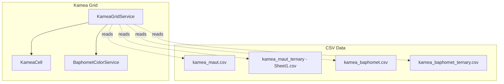
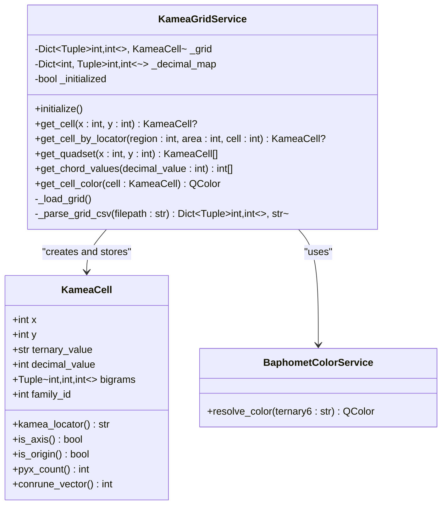
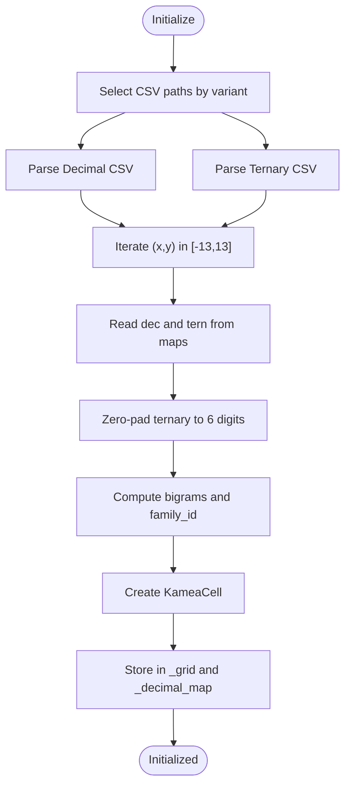
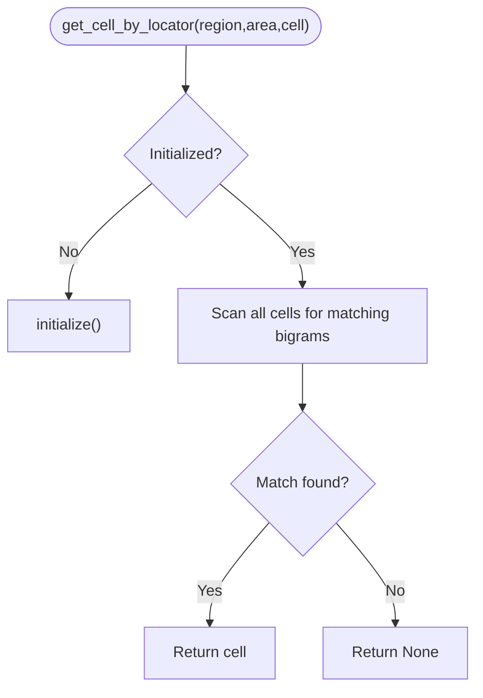
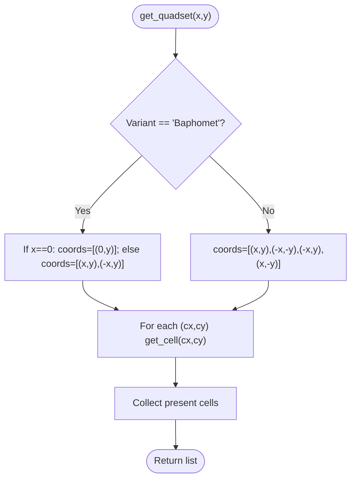
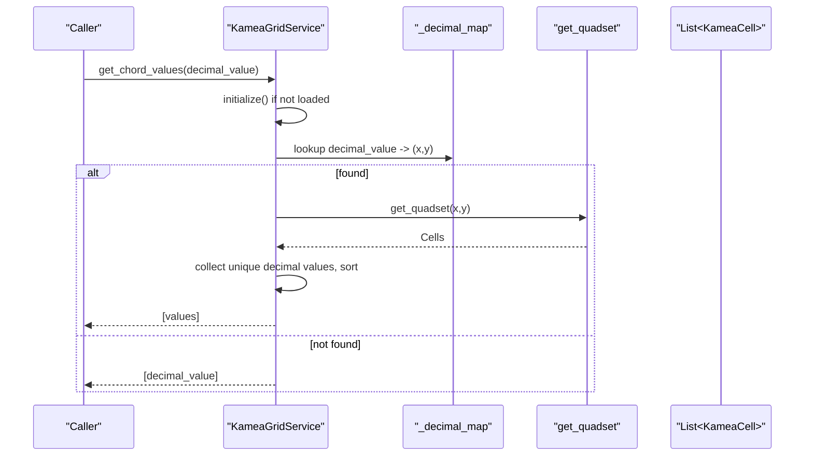
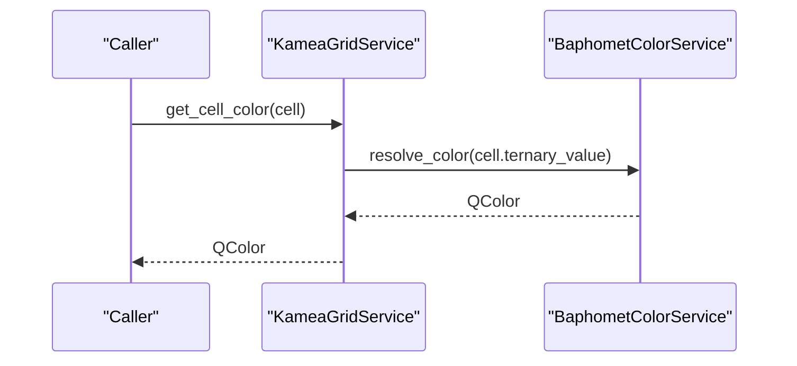
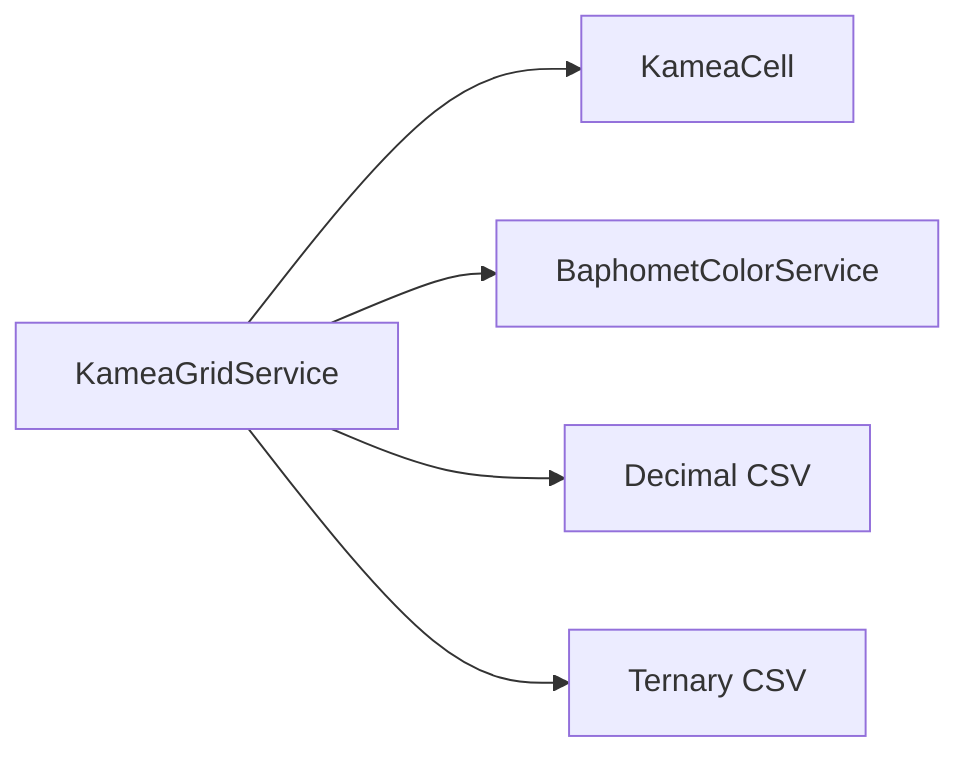

# Kamea Grid Service

<cite>
**Referenced Files in This Document**
- [kamea_grid_service.py](file://src/pillars/tq/services/kamea_grid_service.py)
- [kamea_cell.py](file://src/pillars/tq/models/kamea_cell.py)
- [baphomet_color_service.py](file://src/pillars/tq/services/baphomet_color_service.py)
- [kamea_maut.csv](file://Docs/kamea/kamea_maut.csv)
- [kamea_baphomet.csv](file://Docs/kamea/kamea_baphomet.csv)
- [kamea_maut_ternary - Sheet1.csv](file://Docs/kamea/kamea_maut_ternary - Sheet1.csv)
- [kamea_baphomet_ternary.csv](file://Docs/kamea/kamea_baphomet_ternary.csv)
- [The_Kamea_Doctrine.md](file://Docs/kamea/The_Kamea_Doctrine.md)
- [quadset_engine.py](file://src/pillars/tq/services/quadset_engine.py)
- [temp_verify_kamea.py](file://temp_verify_kamea.py)
</cite>

## Table of Contents
1. [Introduction](#introduction)
2. [Project Structure](#project-structure)
3. [Core Components](#core-components)
4. [Architecture Overview](#architecture-overview)
5. [Detailed Component Analysis](#detailed-component-analysis)
6. [Dependency Analysis](#dependency-analysis)
7. [Performance Considerations](#performance-considerations)
8. [Troubleshooting Guide](#troubleshooting-guide)
9. [Conclusion](#conclusion)
10. [Appendices](#appendices)

## Introduction
This document is the authoritative API reference for the KameaGridService, the central authority for the 27x27 Kamea Grid. It documents initialization from validated CSV sources (Maut and Baphomet variants), coordinate-based and bigram-based lookups, quadset retrieval under symmetry rules, and chord-value computation. It also explains how the grid is parsed from decimal and ternary CSVs into KameaCell objects with proper bigram decomposition (Region, Area, Cell), and how to resolve a cell’s color via BaphometColorService. Error handling for missing CSV data and performance characteristics of O(N) locator lookup are addressed.

## Project Structure
The Kamea Grid Service resides in the TQ pillar and relies on CSV datasets and a color service for visualization. The grid is represented by KameaCell objects and accessed through KameaGridService.

**Diagram sources**
- [kamea_grid_service.py](file://src/pillars/tq/services/kamea_grid_service.py#L1-L220)
- [kamea_cell.py](file://src/pillars/tq/models/kamea_cell.py#L1-L59)
- [baphomet_color_service.py](file://src/pillars/tq/services/baphomet_color_service.py#L1-L62)
- [kamea_maut.csv](file://Docs/kamea/kamea_maut.csv#L1-L28)
- [kamea_baphomet.csv](file://Docs/kamea/kamea_baphomet.csv#L1-L27)
- [kamea_maut_ternary - Sheet1.csv](file://Docs/kamea/kamea_maut_ternary - Sheet1.csv)
- [kamea_baphomet_ternary.csv](file://Docs/kamea/kamea_baphomet_ternary.csv)

**Section sources**
- [kamea_grid_service.py](file://src/pillars/tq/services/kamea_grid_service.py#L1-L220)
- [kamea_cell.py](file://src/pillars/tq/models/kamea_cell.py#L1-L59)
- [baphomet_color_service.py](file://src/pillars/tq/services/baphomet_color_service.py#L1-L62)
- [kamea_maut.csv](file://Docs/kamea/kamea_maut.csv#L1-L28)
- [kamea_baphomet.csv](file://Docs/kamea/kamea_baphomet.csv#L1-L27)

## Core Components
- KameaGridService: Loads CSVs, constructs KameaCell objects, exposes coordinate and locator lookups, computes quadsets, and resolves chord values.
- KameaCell: Immutable data structure representing a grid cell with coordinates, decimal/ternary values, bigrams, and derived properties.
- BaphometColorService: Computes a QColor from a 6-digit ternary string using bigram-derived channels.

Key responsibilities:
- Initialization and lazy loading from CSVs.
- Parsing decimal and ternary CSVs into coordinate-aligned grids.
- Bigram decomposition (Region, Area, Cell) and family assignment.
- Quadset retrieval under variant-specific symmetry rules.
- Chord-value extraction for geometric analysis.
- Color resolution for visualization.

**Section sources**
- [kamea_grid_service.py](file://src/pillars/tq/services/kamea_grid_service.py#L1-L220)
- [kamea_cell.py](file://src/pillars/tq/models/kamea_cell.py#L1-L59)
- [baphomet_color_service.py](file://src/pillars/tq/services/baphomet_color_service.py#L1-L62)

## Architecture Overview
The service orchestrates CSV parsing, cell construction, and lookup. It delegates color resolution to BaphometColorService and uses KameaCell for data representation.

**Diagram sources**
- [kamea_grid_service.py](file://src/pillars/tq/services/kamea_grid_service.py#L1-L220)
- [kamea_cell.py](file://src/pillars/tq/models/kamea_cell.py#L1-L59)
- [baphomet_color_service.py](file://src/pillars/tq/services/baphomet_color_service.py#L1-L62)

## Detailed Component Analysis

### Initialization and CSV Loading
- Variant selection determines which CSV pairs are loaded:
  - Maut variant: Uses Docs/kamea/kamea_maut.csv and Docs/kamea/kamea_maut_ternary - Sheet1.csv.
  - Baphomet variant: Uses Docs/kamea/kamea_baphomet.csv and Docs/kamea/kamea_baphomet_ternary.csv.
- CSV parsing:
  - Header row encodes X coordinates; first column encodes Y coordinates.
  - Values at intersections are stored in a coordinate map.
- Grid construction:
  - Iterates over all (x, y) in [-13, 13].
  - For each coordinate, reads decimal and ternary values.
  - Ensures ternary is 6 digits (zero-padded).
  - Decomposes into bigrams (Region, Area, Cell) and family_id.
  - Creates KameaCell and stores in _grid and _decimal_map.

**Diagram sources**
- [kamea_grid_service.py](file://src/pillars/tq/services/kamea_grid_service.py#L120-L220)
- [kamea_maut.csv](file://Docs/kamea/kamea_maut.csv#L1-L28)
- [kamea_baphomet.csv](file://Docs/kamea/kamea_baphomet.csv#L1-L27)
- [kamea_maut_ternary - Sheet1.csv](file://Docs/kamea/kamea_maut_ternary - Sheet1.csv)
- [kamea_baphomet_ternary.csv](file://Docs/kamea/kamea_baphomet_ternary.csv)

**Section sources**
- [kamea_grid_service.py](file://src/pillars/tq/services/kamea_grid_service.py#L17-L33)
- [kamea_grid_service.py](file://src/pillars/tq/services/kamea_grid_service.py#L120-L220)
- [kamea_maut.csv](file://Docs/kamea/kamea_maut.csv#L1-L28)
- [kamea_baphomet.csv](file://Docs/kamea/kamea_baphomet.csv#L1-L27)

### Coordinate Lookup: get_cell
- Purpose: Retrieve a KameaCell by Cartesian coordinates (x, y).
- Behavior:
  - Lazy initializes if not already loaded.
  - Returns None if coordinate is missing.
- Complexity: O(1) dictionary lookup.

**Section sources**
- [kamea_grid_service.py](file://src/pillars/tq/services/kamea_grid_service.py#L54-L59)

### Bigram-Based Lookup: get_cell_by_locator
- Purpose: Find a cell by its Kamea bigrams (Region, Area, Cell).
- Behavior:
  - Lazy initializes if not already loaded.
  - Performs an O(N) linear scan over all cells to match the triplet.
  - Returns the first matching cell or None.
- Notes:
  - N=729, so negligible in practice.
  - Consider adding a dedicated bigram-to-cell map if frequent locator lookups are required.

**Diagram sources**
- [kamea_grid_service.py](file://src/pillars/tq/services/kamea_grid_service.py#L60-L71)

**Section sources**
- [kamea_grid_service.py](file://src/pillars/tq/services/kamea_grid_service.py#L60-L71)

### Quadset Retrieval: get_quadset
- Purpose: Return related cells based on symmetry rules.
- Variant behavior:
  - Baphomet: Horizontal reflection only. Returns identity if x=0, otherwise (x,y) and (-x,y).
  - Maut: Full Quadset. Returns (x,y), (-x,-y), (-x,y), (x,-y).
- Behavior:
  - Builds a list of coordinate tuples based on variant rules.
  - Retrieves each cell by coordinate and appends to the result list.

**Diagram sources**
- [kamea_grid_service.py](file://src/pillars/tq/services/kamea_grid_service.py#L77-L101)

**Section sources**
- [kamea_grid_service.py](file://src/pillars/tq/services/kamea_grid_service.py#L77-L101)

### Chord Values: get_chord_values
- Purpose: Compute the geometric chord (quadset) values for a given decimal input.
- Steps:
  - Lazy initializes if needed.
  - Looks up coordinates for the decimal value in _decimal_map.
  - Calls get_quadset on those coordinates.
  - Extracts decimal values from the resulting cells, deduplicates, sorts, and returns.

**Diagram sources**
- [kamea_grid_service.py](file://src/pillars/tq/services/kamea_grid_service.py#L103-L118)

**Section sources**
- [kamea_grid_service.py](file://src/pillars/tq/services/kamea_grid_service.py#L103-L118)

### Color Resolution: get_cell_color
- Purpose: Resolve a QColor for a given cell based on Baphomet color physics.
- Behavior:
  - Delegates to BaphometColorService.resolve_color using the cell’s 6-digit ternary value.
  - Returns a PyQt6 QColor.

**Diagram sources**
- [kamea_grid_service.py](file://src/pillars/tq/services/kamea_grid_service.py#L73-L76)
- [baphomet_color_service.py](file://src/pillars/tq/services/baphomet_color_service.py#L1-L62)

**Section sources**
- [kamea_grid_service.py](file://src/pillars/tq/services/kamea_grid_service.py#L73-L76)
- [baphomet_color_service.py](file://src/pillars/tq/services/baphomet_color_service.py#L1-L62)

### Bigram Decomposition Details
- Ternary string indices 0..5 define:
  - Region (Core): indices 2,3
  - Area (Body): indices 1,4
  - Cell (Skin): indices 0,5
- Region/Area/Cell are computed as 3*digit1 + digit2.
- Family_id equals Region.

These rules are documented in The Kamea Doctrine and implemented in the loader.

**Section sources**
- [kamea_grid_service.py](file://src/pillars/tq/services/kamea_grid_service.py#L147-L167)
- [The_Kamea_Doctrine.md](file://Docs/kamea/The_Kamea_Doctrine.md#L64-L81)

## Dependency Analysis
- KameaGridService depends on:
  - KameaCell for data representation.
  - BaphometColorService for color resolution.
  - CSV files for data sources.
- CSV parsing is centralized in _parse_grid_csv, returning a coordinate-to-value map.
- Quadset computation depends on variant selection and coordinate arithmetic.

**Diagram sources**
- [kamea_grid_service.py](file://src/pillars/tq/services/kamea_grid_service.py#L1-L220)
- [kamea_cell.py](file://src/pillars/tq/models/kamea_cell.py#L1-L59)
- [baphomet_color_service.py](file://src/pillars/tq/services/baphomet_color_service.py#L1-L62)

**Section sources**
- [kamea_grid_service.py](file://src/pillars/tq/services/kamea_grid_service.py#L1-L220)
- [kamea_cell.py](file://src/pillars/tq/models/kamea_cell.py#L1-L59)
- [baphomet_color_service.py](file://src/pillars/tq/services/baphomet_color_service.py#L1-L62)

## Performance Considerations
- Coordinate lookup (get_cell): O(1) via dictionary.
- Bigram locator lookup (get_cell_by_locator): O(N) over 729 cells; acceptable for small N.
- Quadset retrieval: O(k) where k is the number of present cells among the reflected coordinates.
- Chord values: O(k) plus sorting unique values; effectively O(1) for small quadsets.
- CSV parsing: O(W) where W is the total number of grid entries processed.
- Recommendations:
  - Add a bigram-to-cell map if frequent locator lookups are required.
  - Precompute and cache color lookups if rendering many cells.

[No sources needed since this section provides general guidance]

## Troubleshooting Guide
Common issues and resolutions:
- Missing CSV data:
  - Symptom: Missing data warnings during load for certain coordinates.
  - Cause: Partial CSV coverage or mismatched headers.
  - Resolution: Verify CSV integrity and header/column alignment; ensure both decimal and ternary CSVs are present for the selected variant.
- Unexpected None from get_cell:
  - Cause: Coordinates outside the grid or missing data.
  - Resolution: Confirm coordinates are within [-13, 13]; re-run initialization.
- Empty quadset:
  - Cause: Coordinates on axes with missing symmetric counterparts.
  - Resolution: Check variant rules and coordinate validity.
- Incorrect bigram interpretation:
  - Cause: Misalignment of indices or non-6-digit ternary values.
  - Resolution: Ensure zero-padding and correct index mapping for Region/Area/Cell.

**Section sources**
- [kamea_grid_service.py](file://src/pillars/tq/services/kamea_grid_service.py#L179-L183)
- [kamea_grid_service.py](file://src/pillars/tq/services/kamea_grid_service.py#L184-L219)

## Conclusion
KameaGridService is the authoritative source for the 27x27 Kamea Grid, providing robust initialization from validated CSVs, fast coordinate-based lookups, flexible bigram-based queries, and variant-aware quadset retrieval. Its design cleanly separates data parsing, cell modeling, and color resolution, enabling efficient numerical analysis and visualization.

[No sources needed since this section summarizes without analyzing specific files]

## Appendices

### API Reference Summary
- KameaGridService
  - initialize(): Loads CSVs and builds the grid.
  - get_cell(x: int, y: int) -> KameaCell?: Retrieve by coordinates.
  - get_cell_by_locator(region: int, area: int, cell: int) -> KameaCell?: Locate by bigrams.
  - get_quadset(x: int, y: int) -> List[KameaCell]: Related cells by symmetry.
  - get_chord_values(decimal_value: int) -> List[int]: Quadset decimal values.
  - get_cell_color(cell: KameaCell) -> QColor: Resolve color via BaphometColorService.
- KameaCell
  - x, y, ternary_value, decimal_value, bigrams, family_id.
  - kamea_locator(), is_axis(), is_origin(), pyx_count(), conrune_vector().
- BaphometColorService
  - resolve_color(ternary6: str) -> QColor.

**Section sources**
- [kamea_grid_service.py](file://src/pillars/tq/services/kamea_grid_service.py#L41-L118)
- [kamea_cell.py](file://src/pillars/tq/models/kamea_cell.py#L1-L59)
- [baphomet_color_service.py](file://src/pillars/tq/services/baphomet_color_service.py#L1-L62)

### Example Workflows

- Loading the grid:
  - Instantiate KameaGridService with desired variant ("Maut" or "Baphomet").
  - Call initialize() or rely on lazy initialization via get_cell/get_cell_by_locator/get_chord_values.
  - Verify by checking a few corner and center cells.

- Querying cells by Cartesian coordinates:
  - Use get_cell(x, y) to retrieve a cell; handle None if missing.

- Resolving a cell’s color via BaphometColorService:
  - Obtain a cell and call get_cell_color(cell); use the returned QColor for visualization.

- Retrieving quadsets for numerical analysis:
  - Use get_quadset(x, y) to get related cells.
  - Use get_chord_values(decimal_value) to compute the geometric chord (sorted unique decimal values).

**Section sources**
- [temp_verify_kamea.py](file://temp_verify_kamea.py#L1-L80)
- [kamea_grid_service.py](file://src/pillars/tq/services/kamea_grid_service.py#L54-L118)
- [baphomet_color_service.py](file://src/pillars/tq/services/baphomet_color_service.py#L1-L62)

### Related Services and Models
- QuadsetEngine: Provides a broader quadset analysis pipeline for ternary transformations and pattern analysis, complementing grid-based quadsets.

**Section sources**
- [quadset_engine.py](file://src/pillars/tq/services/quadset_engine.py#L1-L87)