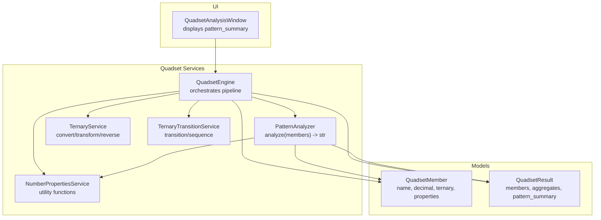
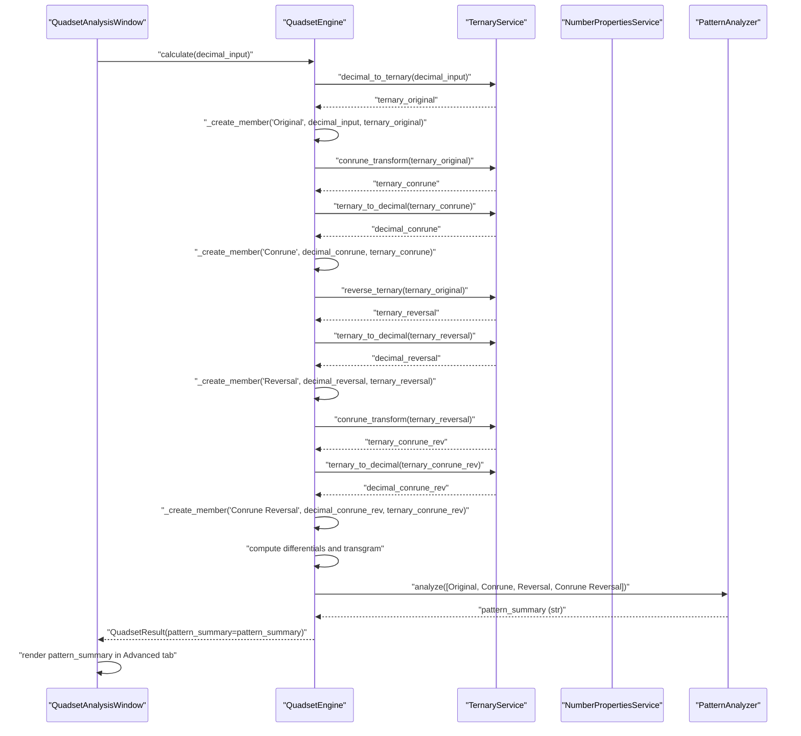
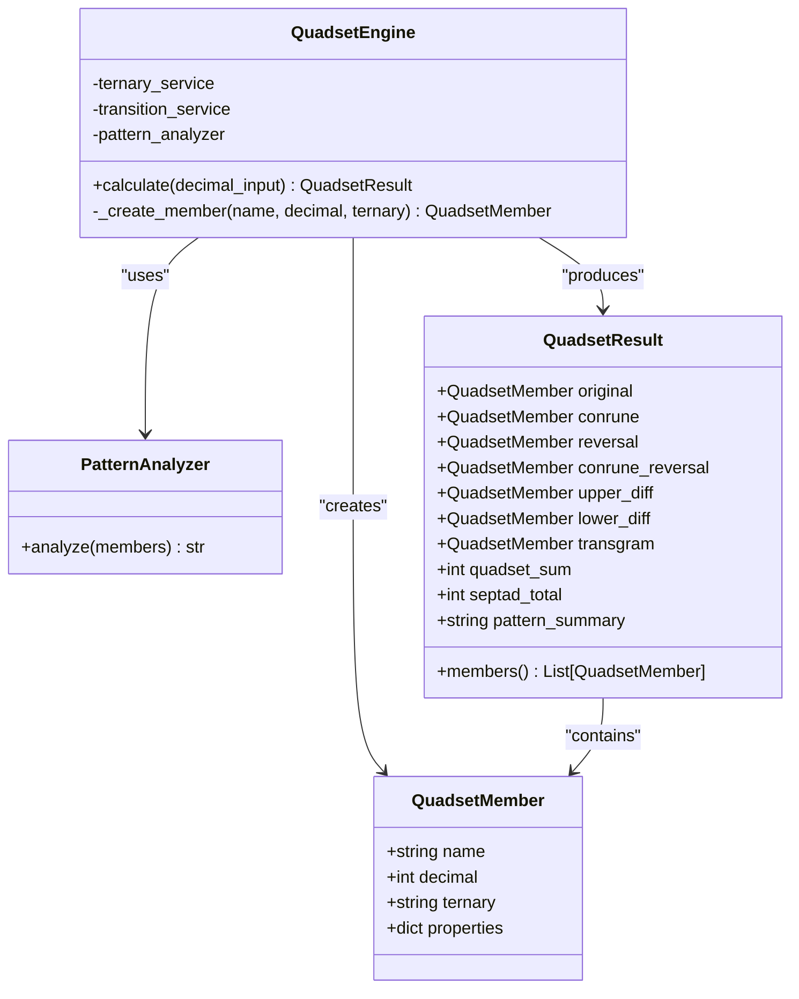
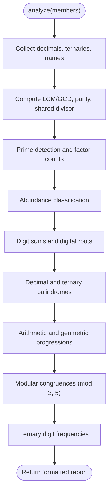
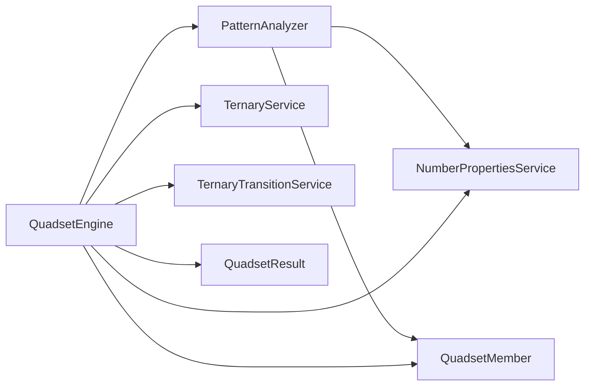

# Pattern Analyzer

<cite>
**Referenced Files in This Document**
- [pattern_analyzer.py](file://src/pillars/tq/services/pattern_analyzer.py)
- [quadset_engine.py](file://src/pillars/tq/services/quadset_engine.py)
- [quadset_models.py](file://src/pillars/tq/models/quadset_models.py)
- [number_properties.py](file://src/pillars/tq/services/number_properties.py)
- [ternary_service.py](file://src/pillars/tq/services/ternary_service.py)
- [ternary_transition_service.py](file://src/pillars/tq/services/ternary_transition_service.py)
- [quadset_analysis_window.py](file://src/pillars/tq/ui/quadset_analysis_window.py)
</cite>

## Table of Contents
1. [Introduction](#introduction)
2. [Project Structure](#project-structure)
3. [Core Components](#core-components)
4. [Architecture Overview](#architecture-overview)
5. [Detailed Component Analysis](#detailed-component-analysis)
6. [Dependency Analysis](#dependency-analysis)
7. [Performance Considerations](#performance-considerations)
8. [Troubleshooting Guide](#troubleshooting-guide)
9. [Conclusion](#conclusion)
10. [Appendices](#appendices)

## Introduction
This document provides API documentation for the PatternAnalyzer, a component responsible for detecting mathematical patterns within Quadset members. It explains the analyze method that accepts a collection of QuadsetMember objects and produces a structured pattern report covering sequences, symmetries, and numerical relationships. The analyzer operates on both decimal and ternary representations of the members and integrates with the QuadsetEngine to provide higher-level insights beyond raw calculations. It also outlines how to interpret the pattern summary in the context of esoteric research and describes extensibility for adding new pattern detection rules, along with performance considerations for large datasets.

## Project Structure
The PatternAnalyzer resides in the TQ pillar under services and collaborates with other services and models to produce a comprehensive Quadset analysis.

**Diagram sources**
- [pattern_analyzer.py](file://src/pillars/tq/services/pattern_analyzer.py#L1-L163)
- [quadset_engine.py](file://src/pillars/tq/services/quadset_engine.py#L1-L87)
- [quadset_models.py](file://src/pillars/tq/models/quadset_models.py#L1-L41)
- [number_properties.py](file://src/pillars/tq/services/number_properties.py#L1-L230)
- [ternary_service.py](file://src/pillars/tq/services/ternary_service.py#L1-L114)
- [ternary_transition_service.py](file://src/pillars/tq/services/ternary_transition_service.py#L1-L70)
- [quadset_analysis_window.py](file://src/pillars/tq/ui/quadset_analysis_window.py#L1-L986)

**Section sources**
- [pattern_analyzer.py](file://src/pillars/tq/services/pattern_analyzer.py#L1-L163)
- [quadset_engine.py](file://src/pillars/tq/services/quadset_engine.py#L1-L87)
- [quadset_models.py](file://src/pillars/tq/models/quadset_models.py#L1-L41)
- [number_properties.py](file://src/pillars/tq/services/number_properties.py#L1-L230)
- [ternary_service.py](file://src/pillars/tq/services/ternary_service.py#L1-L114)
- [ternary_transition_service.py](file://src/pillars/tq/services/ternary_transition_service.py#L1-L70)
- [quadset_analysis_window.py](file://src/pillars/tq/ui/quadset_analysis_window.py#L1-L986)

## Core Components
- PatternAnalyzer: Scans a list of QuadsetMember objects and produces a formatted pattern report string. It focuses on arithmetic/geometric progressions, modular congruences, palindromic structures (decimal and ternary), parity, prime detection, factor counts, abundance, digit sums and digital roots, and ternary digit frequency.
- QuadsetEngine: Orchestrates the Quadset pipeline, computes members and aggregates, and invokes PatternAnalyzer to produce pattern_summary included in QuadsetResult.
- QuadsetMember and QuadsetResult: Data carriers for the four main members, derived values, totals, and the pattern summary.
- NumberPropertiesService: Provides prime checks, factorization, abundance classification, digit sums, polygonal and centered polygonal number checks, and Fibonacci membership.
- TernaryService and TernaryTransitionService: Handle conversions, transformations (Conrune), reversals, and the ternary transition system used elsewhere in the system.

**Section sources**
- [pattern_analyzer.py](file://src/pillars/tq/services/pattern_analyzer.py#L1-L163)
- [quadset_engine.py](file://src/pillars/tq/services/quadset_engine.py#L1-L87)
- [quadset_models.py](file://src/pillars/tq/models/quadset_models.py#L1-L41)
- [number_properties.py](file://src/pillars/tq/services/number_properties.py#L1-L230)
- [ternary_service.py](file://src/pillars/tq/services/ternary_service.py#L1-L114)
- [ternary_transition_service.py](file://src/pillars/tq/services/ternary_transition_service.py#L1-L70)

## Architecture Overview
The QuadsetEngine drives the computation pipeline, transforming the initial decimal input into four primary members and derived values. After computing the members, it delegates pattern analysis to PatternAnalyzer and embeds the resulting report into QuadsetResult for consumption by the UI.

**Diagram sources**
- [quadset_engine.py](file://src/pillars/tq/services/quadset_engine.py#L1-L87)
- [pattern_analyzer.py](file://src/pillars/tq/services/pattern_analyzer.py#L1-L163)
- [ternary_service.py](file://src/pillars/tq/services/ternary_service.py#L1-L114)
- [quadset_analysis_window.py](file://src/pillars/tq/ui/quadset_analysis_window.py#L1-L986)

**Section sources**
- [quadset_engine.py](file://src/pillars/tq/services/quadset_engine.py#L1-L87)
- [pattern_analyzer.py](file://src/pillars/tq/services/pattern_analyzer.py#L1-L163)
- [quadset_analysis_window.py](file://src/pillars/tq/ui/quadset_analysis_window.py#L1-L986)

## Detailed Component Analysis

### PatternAnalyzer API
- Purpose: Produce a human-readable pattern report from a list of QuadsetMember objects.
- Input: List[QuadsetMember] representing the four main members of a Quadset.
- Output: str containing a multi-line report summarizing detected patterns.

Key behaviors implemented by PatternAnalyzer.analyze:
- Global measures: LCM and GCD of decimal values; shared divisor check; parity counts.
- Prime and factor analysis: Prime detection per member; factor counts; abundance classification.
- Digit properties: Decimal digit sums and digital roots.
- Palindromic checks: Decimal palindromes; ternary palindromes.
- Sequences: Arithmetic progression detection among sorted decimals; geometric progression detection among sorted decimals.
- Modular arithmetic: Congruence across members modulo 3 and 5.
- Ternary characteristics: Digits limited to 0/1; digit frequency per member.

Extensibility points:
- Add new pattern categories by appending new sections to the report generation loop.
- Introduce new sequence detectors (e.g., Fibonacci-like progression) by extending the progression checks.
- Incorporate additional number-theoretic properties via NumberPropertiesService.

Interpretation in esoteric context:
- Palindromic structures in ternary and decimal may reflect mirror symmetries or balanced states.
- Arithmetic/geometric progressions can indicate ordered growth or decay patterns.
- Modular congruences suggest periodic or invariant properties across the set.
- Prime density and factor counts inform the “complexity” or “divisibility” profile of the Quadset.

**Section sources**
- [pattern_analyzer.py](file://src/pillars/tq/services/pattern_analyzer.py#L1-L163)
- [number_properties.py](file://src/pillars/tq/services/number_properties.py#L1-L230)

### QuadsetEngine Integration
- The engine constructs QuadsetMember objects for Original, Conrune, Reversal, and Conrune Reversal.
- It computes differentials and the transgram, then calls PatternAnalyzer.analyze on the four main members.
- The resulting pattern_summary is attached to QuadsetResult and rendered by the UI.

**Diagram sources**
- [quadset_engine.py](file://src/pillars/tq/services/quadset_engine.py#L1-L87)
- [pattern_analyzer.py](file://src/pillars/tq/services/pattern_analyzer.py#L1-L163)
- [quadset_models.py](file://src/pillars/tq/models/quadset_models.py#L1-L41)

**Section sources**
- [quadset_engine.py](file://src/pillars/tq/services/quadset_engine.py#L1-L87)
- [quadset_models.py](file://src/pillars/tq/models/quadset_models.py#L1-L41)

### Internal Pattern Detection Algorithms
- Arithmetic progression: Sort decimals and compute pairwise differences; if all differences equal, report common difference.
- Geometric progression: Compute ratios of consecutive sorted decimals (avoiding zero); if all ratios equal, report ratio.
- Palindromic structures:
  - Decimal: Compare string representation to its reverse.
  - Ternary: Compare ternary string to its reverse.
- Modular congruence: Compute sets of remainders modulo 3 and 5; if singleton sets, report uniform remainder.
- Shared divisor: Compute GCD across absolute values; report whether greater than 1.
- Prime detection and factor counts: Use NumberPropertiesService.is_prime and get_factors.
- Abundance: Use NumberPropertiesService.get_properties to classify as Perfect, Deficient, or Abundant.
- Digit sums and digital roots: Sum decimal digits; compute digital root via repeated sum or formula.
- Ternary digit frequency: Count occurrences of 0, 1, 2 per member’s ternary string.

**Diagram sources**
- [pattern_analyzer.py](file://src/pillars/tq/services/pattern_analyzer.py#L1-L163)
- [number_properties.py](file://src/pillars/tq/services/number_properties.py#L1-L230)

**Section sources**
- [pattern_analyzer.py](file://src/pillars/tq/services/pattern_analyzer.py#L1-L163)
- [number_properties.py](file://src/pillars/tq/services/number_properties.py#L1-L230)

### Example Workflows

#### Analyze a Quadset with Fibonacci-like progression
- Use QuadsetEngine.calculate to transform an input decimal into the four main members.
- PatternAnalyzer will sort the four decimals and compute differences and ratios.
- If differences are constant, the report will indicate an arithmetic progression with a common difference.
- If ratios are constant, the report will indicate a geometric progression with a specific ratio.
- Interpretation: A Fibonacci-like progression can be inferred if the ratios approach the golden ratio or if differences approximate Fibonacci differences.

**Section sources**
- [quadset_engine.py](file://src/pillars/tq/services/quadset_engine.py#L1-L87)
- [pattern_analyzer.py](file://src/pillars/tq/services/pattern_analyzer.py#L1-L163)

#### Detect symmetry in ternary reversals
- QuadsetEngine computes Reversal by reversing the ternary string of the Original.
- PatternAnalyzer checks if any member’s ternary equals its reverse and reports ternary palindromes.
- Interpretation: Ternary palindromes reflect mirror symmetry in the ternary representation, which can be meaningful in esoteric contexts.

**Section sources**
- [ternary_service.py](file://src/pillars/tq/services/ternary_service.py#L1-L114)
- [pattern_analyzer.py](file://src/pillars/tq/services/pattern_analyzer.py#L1-L163)

#### Interpreting the pattern summary in esoteric research
- Palindromic structures (decimal and ternary) often symbolize balance or cyclical harmony.
- Arithmetic progressions can represent ordered development; geometric progressions can indicate exponential growth or decay.
- Modular congruences modulo 3 and 5 may reflect periodic cycles or invariant properties across the set.
- Prime density and factor counts help assess the “divisibility” and “complexity” of the Quadset.
- Abundance classification informs whether the set tends toward perfection, deficiency, or excess.

**Section sources**
- [pattern_analyzer.py](file://src/pillars/tq/services/pattern_analyzer.py#L1-L163)
- [number_properties.py](file://src/pillars/tq/services/number_properties.py#L1-L230)

### Extensibility Guide
To add new pattern detection rules:
- Extend PatternAnalyzer.analyze:
  - Add new detection blocks after existing sections.
  - Append new lines to the report list and join them into a single string.
- Leverage NumberPropertiesService for additional number-theoretic properties (e.g., polygonal numbers, centered polygonal numbers).
- Integrate new transformations or checks from TernaryService or TernaryTransitionService as needed.

Best practices:
- Keep detection logic linear-time where possible (e.g., avoid nested loops over member lists).
- Use early exits for zero-value protections (e.g., skip ratios when encountering zero).
- Maintain consistent formatting for readability.

**Section sources**
- [pattern_analyzer.py](file://src/pillars/tq/services/pattern_analyzer.py#L1-L163)
- [number_properties.py](file://src/pillars/tq/services/number_properties.py#L1-L230)

## Dependency Analysis
PatternAnalyzer depends on:
- QuadsetMember for accessing decimal, ternary, and names.
- NumberPropertiesService for prime/factor/abundance/digit-sum utilities.
- Standard library math for GCD/LCM and arithmetic.

QuadsetEngine composes:
- TernaryService for conversions and transformations.
- NumberPropertiesService for member properties.
- PatternAnalyzer for pattern summary.

**Diagram sources**
- [pattern_analyzer.py](file://src/pillars/tq/services/pattern_analyzer.py#L1-L163)
- [quadset_engine.py](file://src/pillars/tq/services/quadset_engine.py#L1-L87)
- [number_properties.py](file://src/pillars/tq/services/number_properties.py#L1-L230)
- [ternary_service.py](file://src/pillars/tq/services/ternary_service.py#L1-L114)
- [ternary_transition_service.py](file://src/pillars/tq/services/ternary_transition_service.py#L1-L70)
- [quadset_models.py](file://src/pillars/tq/models/quadset_models.py#L1-L41)

**Section sources**
- [pattern_analyzer.py](file://src/pillars/tq/services/pattern_analyzer.py#L1-L163)
- [quadset_engine.py](file://src/pillars/tq/services/quadset_engine.py#L1-L87)
- [quadset_models.py](file://src/pillars/tq/models/quadset_models.py#L1-L41)

## Performance Considerations
- Time complexity:
  - Sorting decimals for progressions: O(1) for 4 members.
  - GCD/LCM across decimals: O(1) for 4 members.
  - Prime checks and factorization: O(sqrt(n)) per member; negligible for typical gematria ranges.
  - Palindromic checks: O(d) per member where d is digit count.
  - Ratio computations: O(1) for 4 members.
- Space complexity: O(1) aside from report string construction.
- Recommendations:
  - Avoid recomputing identical properties; reuse NumberPropertiesService outputs where possible.
  - For very large datasets, consider batching and caching repeated computations.
  - Keep the report generation loop single-pass to minimize overhead.

[No sources needed since this section provides general guidance]

## Troubleshooting Guide
Common issues and resolutions:
- Zero values causing division errors:
  - PatternAnalyzer protects against zero in geometric progression by skipping ratios when any member is zero.
- Negative numbers:
  - TernaryService preserves sign during transformations; PatternAnalyzer treats absolute values for palindrome checks and digit sums.
- Unexpected report entries:
  - Verify member decimal and ternary fields are populated by QuadsetEngine before invoking PatternAnalyzer.
- UI display:
  - QuadsetAnalysisWindow expects pattern_summary to be a multi-line string; ensure newline-separated formatting.

**Section sources**
- [pattern_analyzer.py](file://src/pillars/tq/services/pattern_analyzer.py#L1-L163)
- [ternary_service.py](file://src/pillars/tq/services/ternary_service.py#L1-L114)
- [quadset_analysis_window.py](file://src/pillars/tq/ui/quadset_analysis_window.py#L1-L986)

## Conclusion
PatternAnalyzer delivers a concise, structured pattern report that highlights arithmetic/geometric progressions, palindromic symmetries, modular invariants, primality, factorization, and digit properties across Quadset members. Its integration with QuadsetEngine ensures that higher-level insights are seamlessly incorporated into the broader Quadset analysis pipeline. The component is straightforward to extend with new detection rules and remains efficient for typical use cases.

[No sources needed since this section summarizes without analyzing specific files]

## Appendices

### API Reference: PatternAnalyzer.analyze
- Signature: analyze(members: List[QuadsetMember]) -> str
- Behavior:
  - Computes global measures (LCM/GCD, parity, shared divisor).
  - Identifies primes and factor counts per member.
  - Classifies abundance and computes digit sums/digital roots.
  - Detects decimal and ternary palindromes.
  - Checks arithmetic and geometric progressions among sorted decimals.
  - Reports modular congruences modulo 3 and 5.
  - Records ternary digit frequencies and members with digits limited to 0/1.
- Returns: Formatted string report suitable for UI display.

**Section sources**
- [pattern_analyzer.py](file://src/pillars/tq/services/pattern_analyzer.py#L1-L163)

### Integration Points
- QuadsetEngine.calculate invokes PatternAnalyzer.analyze and attaches the result to QuadsetResult.pattern_summary.
- QuadsetAnalysisWindow displays pattern_summary in the Advanced tab.

**Section sources**
- [quadset_engine.py](file://src/pillars/tq/services/quadset_engine.py#L1-L87)
- [quadset_analysis_window.py](file://src/pillars/tq/ui/quadset_analysis_window.py#L1-L986)