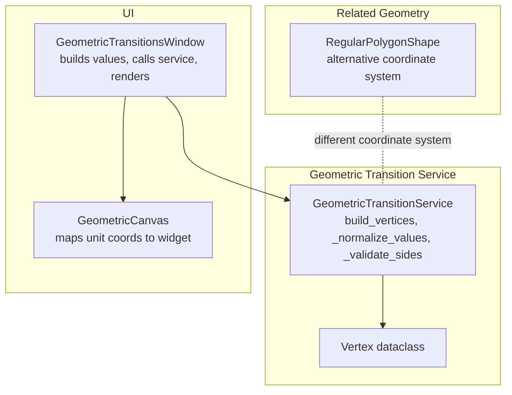
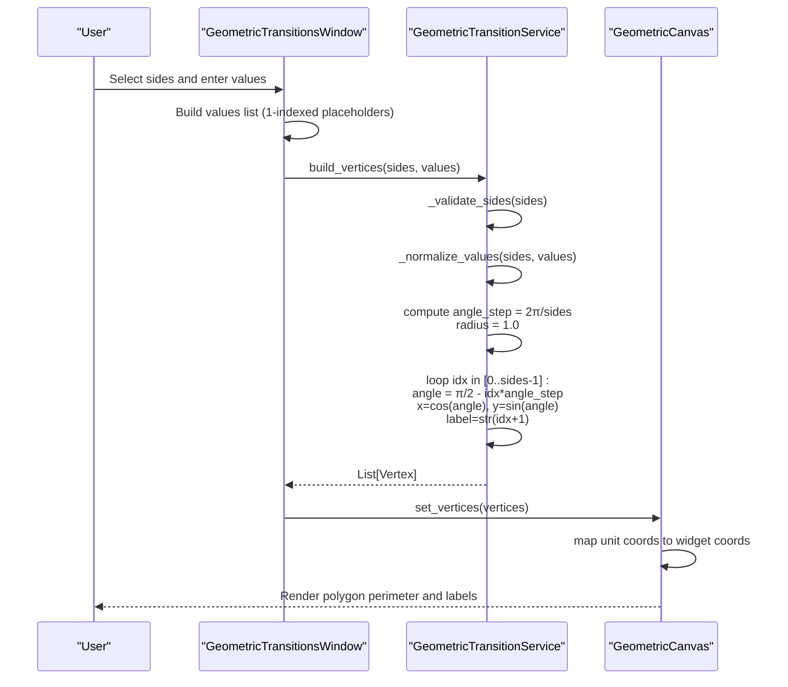
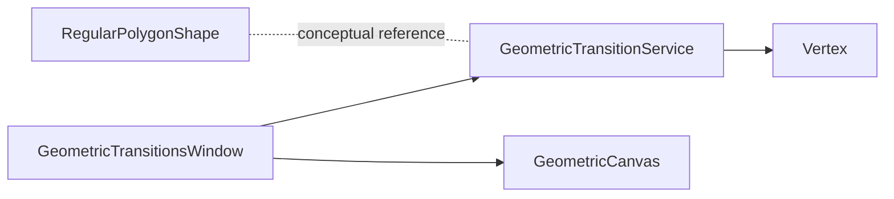

# Polygon Construction

<cite>
**Referenced Files in This Document**
- [geometric_transition_service.py](file://src/pillars/tq/services/geometric_transition_service.py)
- [geometric_transitions_window.py](file://src/pillars/tq/ui/geometric_transitions_window.py)
- [polygon_shape.py](file://src/pillars/geometry/services/polygon_shape.py)
</cite>

## Table of Contents
1. [Introduction](#introduction)
2. [Project Structure](#project-structure)
3. [Core Components](#core-components)
4. [Architecture Overview](#architecture-overview)
5. [Detailed Component Analysis](#detailed-component-analysis)
6. [Dependency Analysis](#dependency-analysis)
7. [Performance Considerations](#performance-considerations)
8. [Troubleshooting Guide](#troubleshooting-guide)
9. [Conclusion](#conclusion)

## Introduction
This document explains the polygon construction functionality within the Geometric Transition Service. It focuses on the build_vertices method that generates coordinate-based vertices for regular polygons with 3 to 27 sides. The coordinate system normalizes radius to 1.0, starts at the top (π/2 radians), and proceeds clockwise. It documents vertex labeling (1-indexed), value assignment (default 1 to N or custom input), and precise floating-point coordinate calculation using trigonometric functions. It also covers internal normalization logic for custom number sequences, guardrails for sides validation, and integration with the UI component that renders the polygon.

## Project Structure
The polygon construction is implemented in the geometric transition service and consumed by the geometric transitions window UI. A separate polygon shape service demonstrates a related but distinct coordinate system for drawing regular polygons.

**Diagram sources**
- [geometric_transition_service.py](file://src/pillars/tq/services/geometric_transition_service.py#L12-L124)
- [geometric_transitions_window.py](file://src/pillars/tq/ui/geometric_transitions_window.py#L127-L320)
- [polygon_shape.py](file://src/pillars/geometry/services/polygon_shape.py#L230-L236)

**Section sources**
- [geometric_transition_service.py](file://src/pillars/tq/services/geometric_transition_service.py#L12-L124)
- [geometric_transitions_window.py](file://src/pillars/tq/ui/geometric_transitions_window.py#L127-L320)
- [polygon_shape.py](file://src/pillars/geometry/services/polygon_shape.py#L230-L236)

## Core Components
- GeometricTransitionService.build_vertices: Computes vertices for a regular polygon with radius 1.0, starting at the top and moving clockwise. Assigns 1-indexed labels and resolves values via _normalize_values. Coordinates are rounded to six decimals.
- GeometricTransitionService._normalize_values: Handles default 1..N values or custom sequences, truncating or padding to match sides.
- GeometricTransitionService._validate_sides: Enforces side count bounds [3, 27].
- GeometricTransitionsWindow: Collects user inputs, builds values, calls build_vertices, and renders the polygon.
- RegularPolygonShape: Demonstrates an alternative coordinate system for drawing regular polygons.

**Section sources**
- [geometric_transition_service.py](file://src/pillars/tq/services/geometric_transition_service.py#L96-L124)
- [geometric_transition_service.py](file://src/pillars/tq/services/geometric_transition_service.py#L280-L323)
- [geometric_transitions_window.py](file://src/pillars/tq/ui/geometric_transitions_window.py#L273-L320)
- [polygon_shape.py](file://src/pillars/geometry/services/polygon_shape.py#L230-L236)

## Architecture Overview
The UI triggers polygon generation by collecting the number of sides and optional per-vertex values. The service validates inputs, normalizes values, computes coordinates, and returns a list of Vertex objects. The UI then maps these unit-circle coordinates to widget pixels and draws the polygon perimeter and labels.

**Diagram sources**
- [geometric_transitions_window.py](file://src/pillars/tq/ui/geometric_transitions_window.py#L273-L320)
- [geometric_transition_service.py](file://src/pillars/tq/services/geometric_transition_service.py#L96-L124)
- [geometric_transition_service.py](file://src/pillars/tq/services/geometric_transition_service.py#L280-L323)

## Detailed Component Analysis

### build_vertices: Coordinate Generation and Value Assignment
- Coordinate system:
  - Radius normalized to 1.0.
  - Starting angle at the top (π/2 radians).
  - Proceeds clockwise by computing angle_step = 2π/sides and angle = π/2 - idx * angle_step.
  - x = cos(angle), y = sin(angle), rounded to six decimals.
- Vertex labeling:
  - 1-indexed labels stored as strings ("1", "2", ...).
- Value assignment:
  - Default values are 1..N when no custom values are provided.
  - Custom values are accepted via a sequence; excess values are truncated, missing values are padded with zeros.
- Output:
  - Ordered list of Vertex objects with index, label, value, x, y.

Examples (exact outputs):
- Hexagon (6 sides):
  - Vertex indices 0..5 map to labels "1".."6".
  - Values default to 1..6 unless overridden.
  - Coordinates computed using angle_step = π/3 and the clockwise rule.
  - Example outputs (rounded to six decimals): (x0, y0), (x1, y1), ..., (x5, y5).
- Dodecagon (12 sides):
  - Vertex indices 0..11 map to labels "1".."12".
  - Values default to 1..12 unless overridden.
  - Coordinates computed using angle_step = π/6 and the clockwise rule.
  - Example outputs (rounded to six decimals): (x0, y0), (x1, y1), ..., (x11, y11).

Integration with UI:
- The window collects per-vertex values from input fields, falling back to 1-indexed defaults when empty or invalid.
- It calls build_vertices and passes the resulting vertices to the canvas for rendering.

**Section sources**
- [geometric_transition_service.py](file://src/pillars/tq/services/geometric_transition_service.py#L96-L124)
- [geometric_transitions_window.py](file://src/pillars/tq/ui/geometric_transitions_window.py#L273-L320)

### Internal Normalization: _normalize_values
Behavior:
- If values is None or empty: returns [1, 2, ..., sides].
- If values provided: takes up to sides entries; if fewer, pads with zeros; if more, truncates to sides.

Complexity:
- O(sides) for both truncate and pad operations.

Edge cases:
- Empty sequence produces default 1..N.
- Non-integers in inputs are ignored by the UI’s conversion; the service expects integers.

**Section sources**
- [geometric_transition_service.py](file://src/pillars/tq/services/geometric_transition_service.py#L280-L323)
- [geometric_transitions_window.py](file://src/pillars/tq/ui/geometric_transitions_window.py#L298-L311)

### Guardrails: _validate_sides
Behavior:
- Raises an error if sides < 3 or sides > 27.
- Used prior to vertex computation to prevent invalid polygons.

**Section sources**
- [geometric_transition_service.py](file://src/pillars/tq/services/geometric_transition_service.py#L293-L323)

### UI Integration: GeometricTransitionsWindow
Responsibilities:
- Builds value inputs dynamically based on selected sides.
- Collects values from QLineEdit widgets, defaulting to 1-indexed placeholders when empty or invalid.
- Calls build_vertices and updates the canvas with the generated vertices.
- Renders the polygon perimeter and vertex labels using mapped coordinates.

Rendering details:
- The canvas maps unit-circle coordinates to widget pixels via a linear transform with margins and scaling.
- Labels are drawn after edges to ensure visibility.

**Section sources**
- [geometric_transitions_window.py](file://src/pillars/tq/ui/geometric_transitions_window.py#L127-L320)
- [geometric_transitions_window.py](file://src/pillars/tq/ui/geometric_transitions_window.py#L60-L125)

### Alternative Coordinate System: RegularPolygonShape
While the geometric transition service uses a clockwise traversal starting at the top with radius 1.0, the polygon shape service demonstrates an alternative approach:
- Uses angle = (2π * i / n) - (π / 2) to place points around a circle.
- This yields the same unit-circle points but with a different indexing convention for drawing.

This illustrates that the same geometric points can be represented with different angular offsets and indexing, but the transition service’s method is tailored for its skip-group and transition computations.

**Section sources**
- [polygon_shape.py](file://src/pillars/geometry/services/polygon_shape.py#L230-L236)

## Dependency Analysis
- GeometricTransitionsWindow depends on GeometricTransitionService for vertex generation and on Vertex for typed data.
- The UI depends on Qt for rendering and mapping unit coordinates to widget coordinates.
- RegularPolygonShape is conceptually related but uses a different coordinate system and is not directly invoked by the transition service.

**Diagram sources**
- [geometric_transitions_window.py](file://src/pillars/tq/ui/geometric_transitions_window.py#L127-L320)
- [geometric_transition_service.py](file://src/pillars/tq/services/geometric_transition_service.py#L12-L124)
- [polygon_shape.py](file://src/pillars/geometry/services/polygon_shape.py#L230-L236)

**Section sources**
- [geometric_transitions_window.py](file://src/pillars/tq/ui/geometric_transitions_window.py#L127-L320)
- [geometric_transition_service.py](file://src/pillars/tq/services/geometric_transition_service.py#L12-L124)
- [polygon_shape.py](file://src/pillars/geometry/services/polygon_shape.py#L230-L236)

## Performance Considerations
- build_vertices performs O(n) trigonometric calculations and list construction.
- Rounding to six decimals ensures stable comparisons and reduces precision artifacts.
- The UI collects values in O(n) and passes them to the service.
- For large n, consider avoiding repeated trigonometric calls by precomputing angle steps and caching cos/sin values if needed.

[No sources needed since this section provides general guidance]

## Troubleshooting Guide
Common issues and resolutions:
- Invalid sides count:
  - Symptom: Error raised during vertex generation.
  - Cause: sides outside [3, 27].
  - Fix: Adjust selection to fall within supported range.
- Unexpected vertex order:
  - Symptom: Edges appear rotated compared to expectations.
  - Cause: Clockwise traversal starting at top; confirm expected orientation aligns with this convention.
- Incorrect value assignment:
  - Symptom: Some vertices have zero values.
  - Cause: _normalize_values pads missing values with zeros when fewer than sides are provided.
  - Fix: Provide exactly sides values or leave blank to use defaults.
- Rendering appears off-center or scaled:
  - Symptom: Polygon not centered or clipped.
  - Cause: Widget-to-unit mapping parameters (margin, scale).
  - Fix: Verify canvas mapping logic and widget size.

**Section sources**
- [geometric_transition_service.py](file://src/pillars/tq/services/geometric_transition_service.py#L293-L323)
- [geometric_transition_service.py](file://src/pillars/tq/services/geometric_transition_service.py#L280-L323)
- [geometric_transitions_window.py](file://src/pillars/tq/ui/geometric_transitions_window.py#L60-L125)

## Conclusion
The polygon construction pipeline in the Geometric Transition Service provides a robust, validated, and predictable way to generate regular polygon vertices with radius normalization, 1-indexed labels, and flexible value assignment. Its integration with the UI enables interactive exploration of skip groups and special patterns. The design balances correctness, readability, and performance, with clear guardrails and normalization logic.