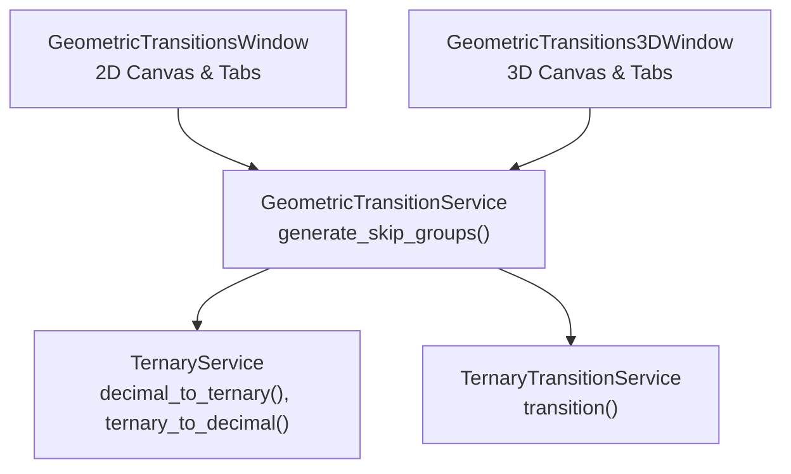
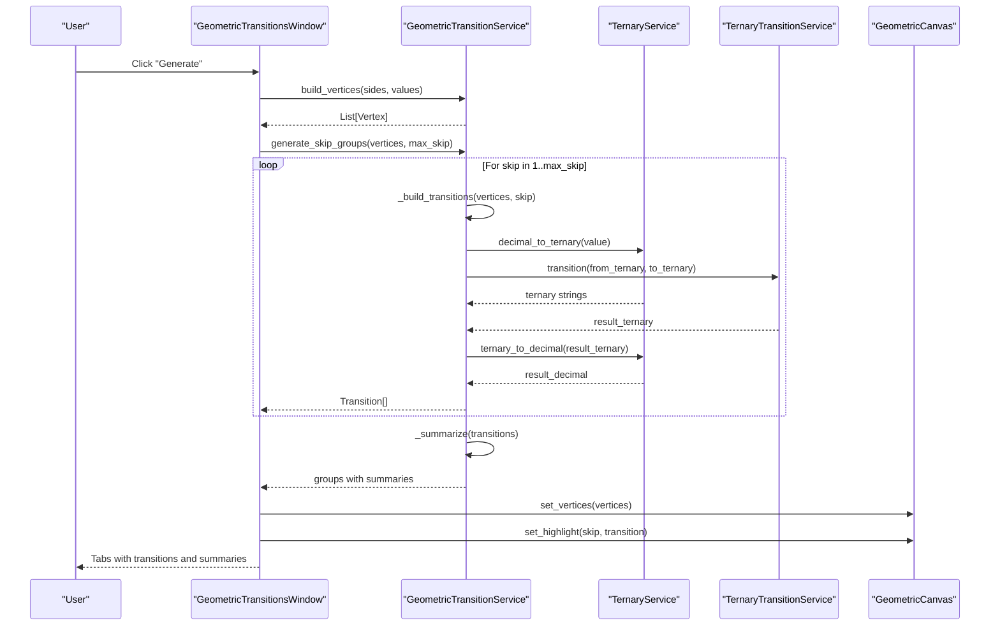
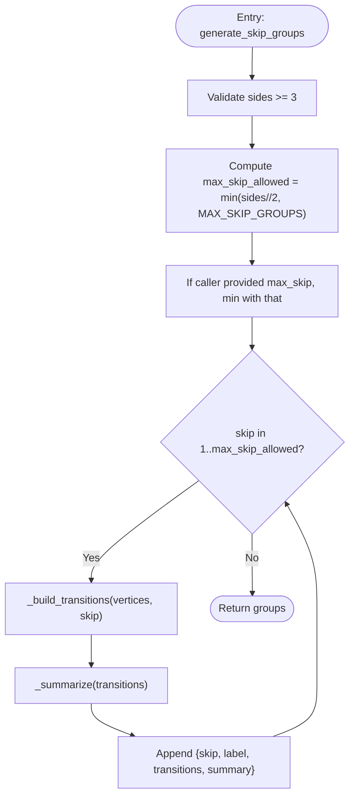
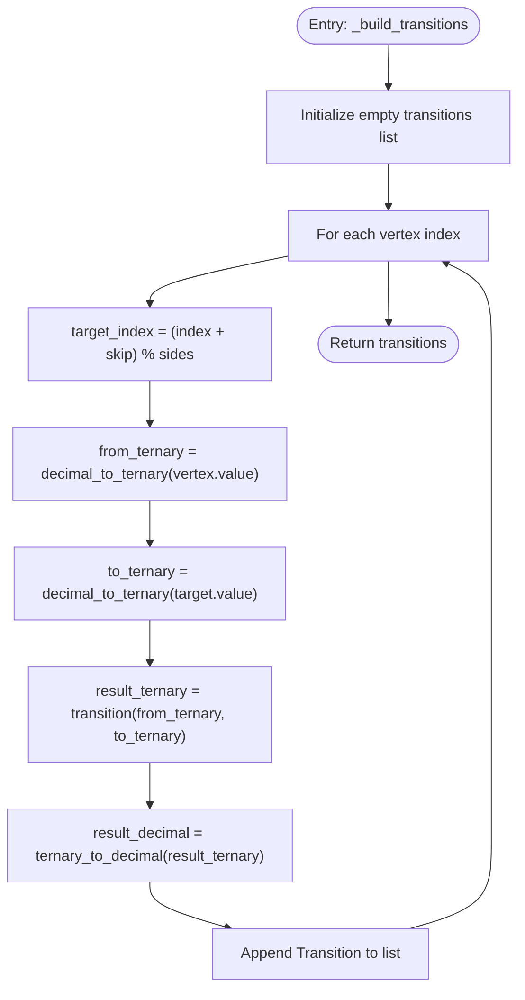
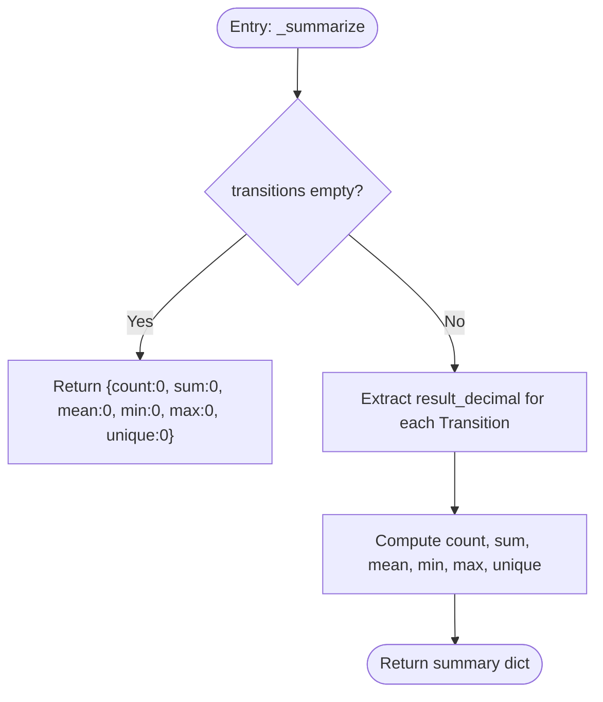
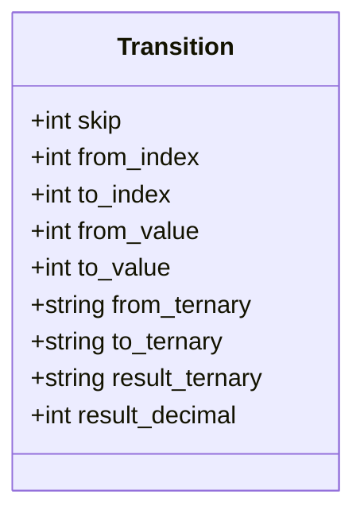
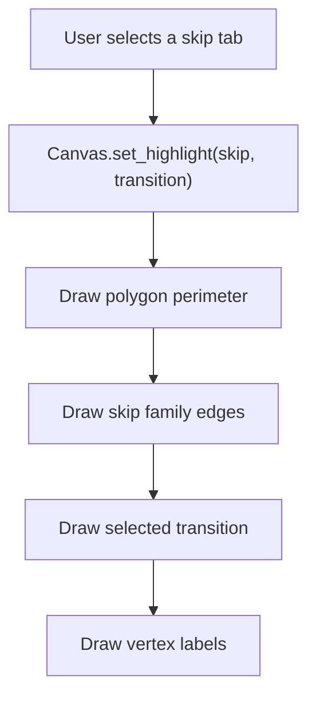
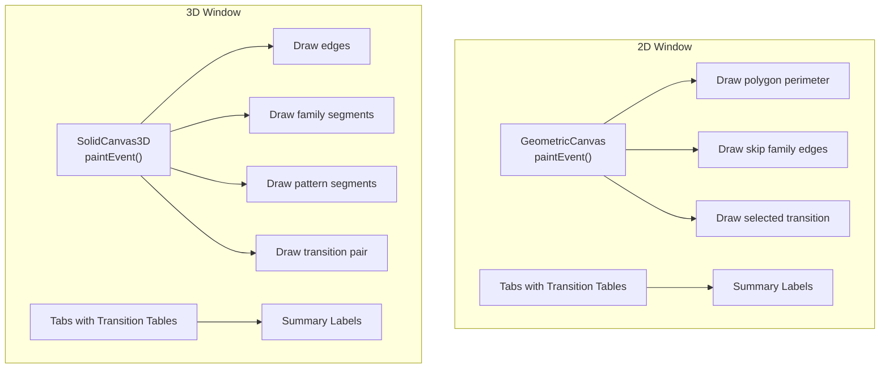
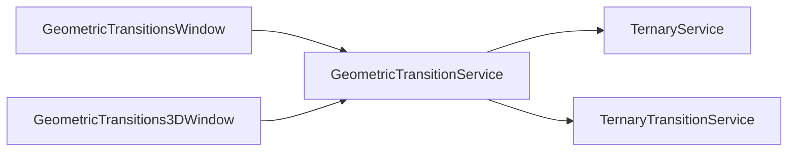

# Skip Groups

<cite>
**Referenced Files in This Document**
- [geometric_transition_service.py](file://src/pillars/tq/services/geometric_transition_service.py)
- [ternary_service.py](file://src/pillars/tq/services/ternary_service.py)
- [ternary_transition_service.py](file://src/pillars/tq/services/ternary_transition_service.py)
- [geometric_transitions_window.py](file://src/pillars/tq/ui/geometric_transitions_window.py)
- [geometric_transitions_3d_window.py](file://src/pillars/tq/ui/geometric_transitions_3d_window.py)
</cite>

## Table of Contents
1. [Introduction](#introduction)
2. [Project Structure](#project-structure)
3. [Core Components](#core-components)
4. [Architecture Overview](#architecture-overview)
5. [Detailed Component Analysis](#detailed-component-analysis)
6. [Dependency Analysis](#dependency-analysis)
7. [Performance Considerations](#performance-considerations)
8. [Troubleshooting Guide](#troubleshooting-guide)
9. [Conclusion](#conclusion)
10. [Appendices](#appendices)

## Introduction
This document explains the skip groups functionality in the Geometric Transition Service. It focuses on how transition sequences across polygon vertices are generated using skip values from 1 to a configurable maximum, how skip=1 corresponds to perimeter connections while higher values create diagonal families, and how the system caps the number of skip families at 13. It also details the internal computation of ternary transitions using dedicated services, the summary statistics produced by the summarization routine, and how UI components visualize these skip patterns.

## Project Structure
The skip groups feature spans a small set of core services and UI windows:
- Services: geometric_transition_service.py defines the skip group generation and summarization logic, and depends on ternary_service.py and ternary_transition_service.py for number system conversions and transitions.
- UI Windows: geometric_transitions_window.py renders 2D polygon views and tabular results for skip groups; geometric_transitions_3d_window.py provides a 3D visualization for Platonic solids and related transition families.

**Diagram sources**
- [geometric_transition_service.py](file://src/pillars/tq/services/geometric_transition_service.py#L126-L216)
- [ternary_service.py](file://src/pillars/tq/services/ternary_service.py#L1-L114)
- [ternary_transition_service.py](file://src/pillars/tq/services/ternary_transition_service.py#L1-L70)
- [geometric_transitions_window.py](file://src/pillars/tq/ui/geometric_transitions_window.py#L127-L200)
- [geometric_transitions_3d_window.py](file://src/pillars/tq/ui/geometric_transitions_3d_window.py#L1-L120)

**Section sources**
- [geometric_transition_service.py](file://src/pillars/tq/services/geometric_transition_service.py#L1-L120)
- [geometric_transitions_window.py](file://src/pillars/tq/ui/geometric_transitions_window.py#L1-L120)

## Core Components
- GeometricTransitionService: Provides polygon vertex construction, skip group generation, special sequence generation, and summary statistics.
- TernaryService: Converts integers to ternary strings and vice versa, and supports transformations.
- TernaryTransitionService: Applies a fixed ternary transition map to pairs of ternary strings.
- GeometricTransitionsWindow: 2D UI that builds vertices, generates skip groups, displays transitions in tabs, and highlights skip families.
- GeometricTransitions3DWindow: 3D UI for Platonic solids; while focused on 3D families, it demonstrates how transition families are visualized and summarized.

Key responsibilities:
- generate_skip_groups: Iterates skip values from 1 up to a computed cap, builds transitions per skip, and attaches summary statistics.
- _build_transitions: Computes ternary transitions between each vertex and its skip-target, producing Transition records.
- _summarize: Produces count, sum, mean, min, max, and unique results for a group’s Transition list.
- UI rendering: Highlights skip families on the polygon canvas and presents tabular results.

**Section sources**
- [geometric_transition_service.py](file://src/pillars/tq/services/geometric_transition_service.py#L126-L272)
- [ternary_service.py](file://src/pillars/tq/services/ternary_service.py#L1-L114)
- [ternary_transition_service.py](file://src/pillars/tq/services/ternary_transition_service.py#L1-L70)
- [geometric_transitions_window.py](file://src/pillars/tq/ui/geometric_transitions_window.py#L298-L341)

## Architecture Overview
The skip groups pipeline connects UI actions to service computations and then to visualization updates.

**Diagram sources**
- [geometric_transitions_window.py](file://src/pillars/tq/ui/geometric_transitions_window.py#L298-L341)
- [geometric_transition_service.py](file://src/pillars/tq/services/geometric_transition_service.py#L126-L216)
- [ternary_service.py](file://src/pillars/tq/services/ternary_service.py#L1-L114)
- [ternary_transition_service.py](file://src/pillars/tq/services/ternary_transition_service.py#L1-L70)

## Detailed Component Analysis

### Skip Groups Generation: generate_skip_groups
- Purpose: Produce a list of transition groups keyed by skip value, from 1 up to a computed cap.
- Cap computation: The maximum allowed skip is the smaller of sides//2 and the constant MAX_SKIP_GROUPS=13. An optional caller-provided max_skip further constrains the range.
- Behavior: For each skip, compute transitions across all vertices and attach a summary dictionary.

**Diagram sources**
- [geometric_transition_service.py](file://src/pillars/tq/services/geometric_transition_service.py#L126-L154)

**Section sources**
- [geometric_transition_service.py](file://src/pillars/tq/services/geometric_transition_service.py#L126-L154)

### Internal Transition Builder: _build_transitions
- Purpose: Compute Transition records for a given skip by iterating over vertices and connecting each vertex to its skip-target.
- Ternary computation: Convert each vertex value and its target value to ternary strings, apply the transition map, convert the result back to decimal.
- Output: A list of Transition objects containing indices, values, ternary representations, and the resulting decimal.

**Diagram sources**
- [geometric_transition_service.py](file://src/pillars/tq/services/geometric_transition_service.py#L186-L216)
- [ternary_service.py](file://src/pillars/tq/services/ternary_service.py#L1-L114)
- [ternary_transition_service.py](file://src/pillars/tq/services/ternary_transition_service.py#L1-L70)

**Section sources**
- [geometric_transition_service.py](file://src/pillars/tq/services/geometric_transition_service.py#L186-L216)
- [ternary_service.py](file://src/pillars/tq/services/ternary_service.py#L1-L114)
- [ternary_transition_service.py](file://src/pillars/tq/services/ternary_transition_service.py#L1-L70)

### Summary Statistics: _summarize
- Purpose: Produce a compact statistical summary for a group of transitions.
- Inputs: A sequence of Transition objects.
- Outputs: A dictionary with keys count, sum_result, mean_result, min_result, max_result, unique_results. Returns zeros for all if the input is empty.

**Diagram sources**
- [geometric_transition_service.py](file://src/pillars/tq/services/geometric_transition_service.py#L250-L272)

**Section sources**
- [geometric_transition_service.py](file://src/pillars/tq/services/geometric_transition_service.py#L250-L272)

### Transition Data Model
The Transition record carries:
- skip: The skip value used to connect the pair.
- from_index, to_index: Indices of the source and target vertices.
- from_value, to_value: Original vertex values.
- from_ternary, to_ternary: Ternary representations of the values.
- result_ternary: Ternary transition result.
- result_decimal: Decimal equivalent of the result_ternary.

**Diagram sources**
- [geometric_transition_service.py](file://src/pillars/tq/services/geometric_transition_service.py#L23-L36)

**Section sources**
- [geometric_transition_service.py](file://src/pillars/tq/services/geometric_transition_service.py#L23-L36)

### Skip Interpretation and Visualization
- skip=1: Perimeter connections linking adjacent vertices.
- skip>1: Diagonal families connecting vertices separated by skip positions around the polygon.
- MAX_SKIP_GROUPS=13: Caps the number of skip families generated for readability and performance.
- UI highlights: The 2D window highlights the selected skip family and the currently selected transition on the polygon canvas.

**Diagram sources**
- [geometric_transitions_window.py](file://src/pillars/tq/ui/geometric_transitions_window.py#L35-L125)
- [geometric_transitions_window.py](file://src/pillars/tq/ui/geometric_transitions_window.py#L557-L580)

**Section sources**
- [geometric_transition_service.py](file://src/pillars/tq/services/geometric_transition_service.py#L273-L323)
- [geometric_transitions_window.py](file://src/pillars/tq/ui/geometric_transitions_window.py#L35-L125)
- [geometric_transitions_window.py](file://src/pillars/tq/ui/geometric_transitions_window.py#L557-L580)

### Example: Diagonal Families in a Dodecagon
- A dodecagon has 12 vertices. The maximum skip allowed is min(12//2, 13)=6.
- Skip families: 1 (perimeter), 2, 3, 4, 5, 6 (diagonals).
- For each skip, the service computes 12 transitions (one per vertex), producing 12 Transition entries per family.
- The UI tabbed interface displays each family’s transitions and summary statistics.

Practical steps:
- Build vertices for 12 sides with default values.
- Call generate_skip_groups with max_skip=6.
- Inspect the “Skip 1” tab for perimeter connections and “Skip 2” through “Skip 6” for diagonal families.
- Use the summary labels to compare sums, means, and unique results across families.

**Section sources**
- [geometric_transition_service.py](file://src/pillars/tq/services/geometric_transition_service.py#L126-L154)
- [geometric_transitions_window.py](file://src/pillars/tq/ui/geometric_transitions_window.py#L298-L341)

### UI Visualization Details
- 2D Window:
  - Canvas draws the polygon, highlights skip families, and overlays the selected transition.
  - Tabs present each skip family with a table of transitions and a summary label.
- 3D Window:
  - Demonstrates how transition families and face circuits are visualized in 3D for Platonic solids, including segment drawing and selection highlighting.

**Diagram sources**
- [geometric_transitions_window.py](file://src/pillars/tq/ui/geometric_transitions_window.py#L60-L125)
- [geometric_transitions_3d_window.py](file://src/pillars/tq/ui/geometric_transitions_3d_window.py#L86-L110)

**Section sources**
- [geometric_transitions_window.py](file://src/pillars/tq/ui/geometric_transitions_window.py#L60-L125)
- [geometric_transitions_3d_window.py](file://src/pillars/tq/ui/geometric_transitions_3d_window.py#L86-L110)

## Dependency Analysis
- GeometricTransitionService depends on:
  - TernaryService for converting between decimal and ternary representations.
  - TernaryTransitionService for applying the ternary transition map.
- UI windows depend on the service to generate data and render it.

**Diagram sources**
- [geometric_transitions_window.py](file://src/pillars/tq/ui/geometric_transitions_window.py#L29-L33)
- [geometric_transition_service.py](file://src/pillars/tq/services/geometric_transition_service.py#L1-L12)
- [ternary_service.py](file://src/pillars/tq/services/ternary_service.py#L1-L114)
- [ternary_transition_service.py](file://src/pillars/tq/services/ternary_transition_service.py#L1-L70)

**Section sources**
- [geometric_transition_service.py](file://src/pillars/tq/services/geometric_transition_service.py#L1-L12)
- [geometric_transitions_window.py](file://src/pillars/tq/ui/geometric_transitions_window.py#L29-L33)

## Performance Considerations
- Complexity:
  - generate_skip_groups iterates up to sides and for each skip iterates sides, yielding O(sides^2) work for all families combined.
  - _build_transitions performs constant-time operations per vertex, so per-skip cost is O(sides).
- Practical limits:
  - MAX_SKIP_GROUPS=13 bounds the number of skip families.
  - The cap sides//2 ensures skip families do not repeat symmetrically.
- UI responsiveness:
  - For large polygons, limit max_skip to keep rendering and tab creation manageable.
  - The 2D canvas draws edges per family; disabling unnecessary tabs reduces redraw overhead.

[No sources needed since this section provides general guidance]

## Troubleshooting Guide
Common issues and resolutions:
- Invalid sides: The service validates sides to be within the supported range and raises an error otherwise.
- Non-positive max_skip: If provided by the caller, a positive constraint is enforced.
- Empty transitions: The summarizer returns neutral statistics when no transitions are present.
- Unexpected results:
  - Verify vertex values and their ternary conversions.
  - Confirm skip values are within the computed cap.

**Section sources**
- [geometric_transition_service.py](file://src/pillars/tq/services/geometric_transition_service.py#L136-L154)
- [geometric_transition_service.py](file://src/pillars/tq/services/geometric_transition_service.py#L250-L272)

## Conclusion
Skip groups provide a structured way to explore polygon transitions using perimeter connections (skip=1) and diagonal families (skip>1), capped at 13 families for clarity. The GeometricTransitionService encapsulates generation, ternary computation, and summarization, while the UI windows offer interactive visualization and analysis. Together, they enable deep exploration of geometric and ternary transition patterns across regular polygons.

## Appendices

### Appendix A: Transition Data Structure Reference
- Transition fields:
  - skip, from_index, to_index, from_value, to_value, from_ternary, to_ternary, result_ternary, result_decimal.

**Section sources**
- [geometric_transition_service.py](file://src/pillars/tq/services/geometric_transition_service.py#L23-L36)

### Appendix B: Summary Statistics Reference
- Keys: count, sum_result, mean_result, min_result, max_result, unique_results.
- Behavior: Returns zeros for all when transitions is empty.

**Section sources**
- [geometric_transition_service.py](file://src/pillars/tq/services/geometric_transition_service.py#L250-L272)