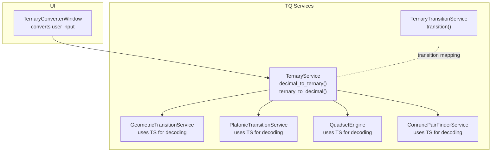
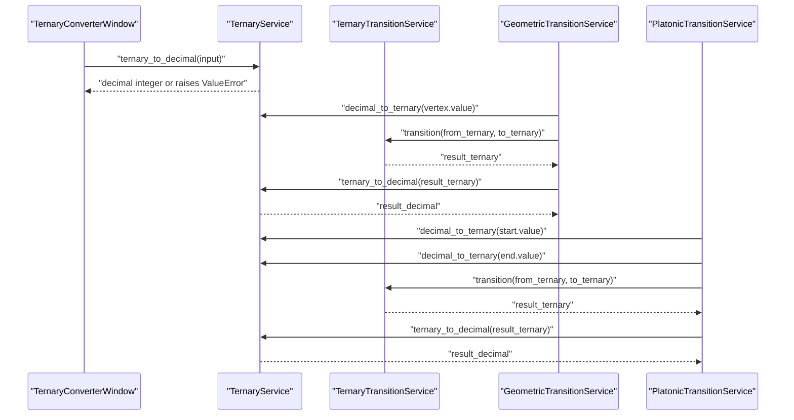
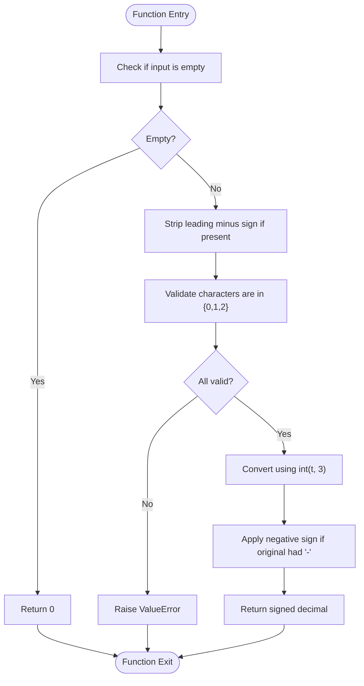
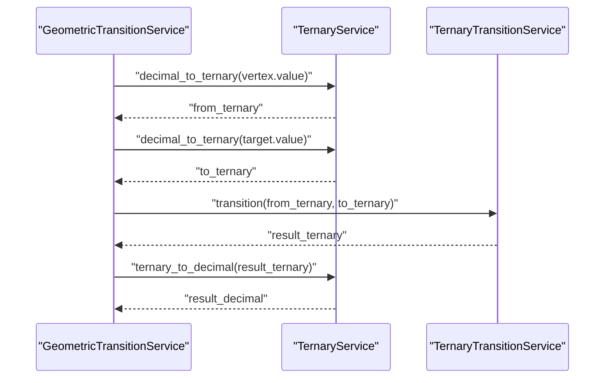
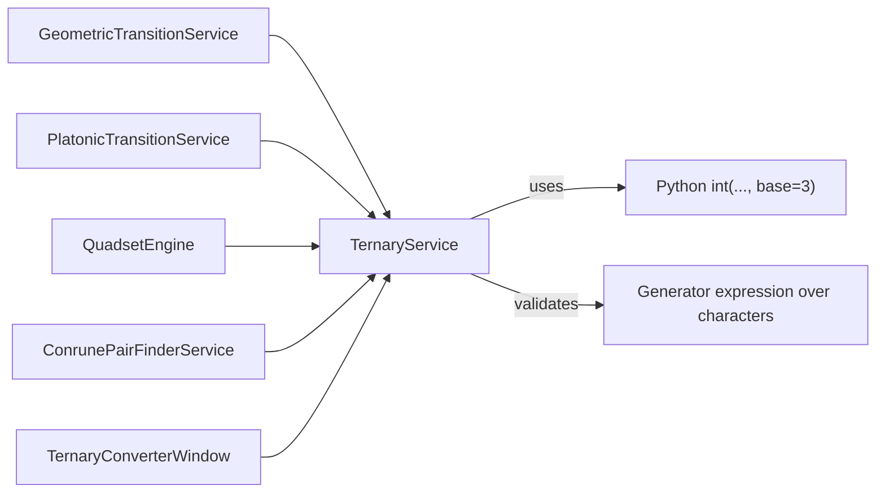

# Ternary to Decimal Conversion

<cite>
**Referenced Files in This Document**
- [ternary_service.py](file://src/pillars/tq/services/ternary_service.py)
- [geometric_transition_service.py](file://src/pillars/tq/services/geometric_transition_service.py)
- [platonic_transition_service.py](file://src/pillars/tq/services/platonic_transition_service.py)
- [ternary_transition_service.py](file://src/pillars/tq/services/ternary_transition_service.py)
- [ternary_converter_window.py](file://src/pillars/tq/ui/ternary_converter_window.py)
- [quadset_engine.py](file://src/pillars/tq/services/quadset_engine.py)
- [conrune_pair_finder_service.py](file://src/pillars/tq/services/conrune_pair_finder_service.py)
</cite>

## Table of Contents
1. [Introduction](#introduction)
2. [Project Structure](#project-structure)
3. [Core Components](#core-components)
4. [Architecture Overview](#architecture-overview)
5. [Detailed Component Analysis](#detailed-component-analysis)
6. [Dependency Analysis](#dependency-analysis)
7. [Performance Considerations](#performance-considerations)
8. [Troubleshooting Guide](#troubleshooting-guide)
9. [Conclusion](#conclusion)

## Introduction
This document provides API documentation for the ternary_to_decimal method in TernaryService. It explains how the method converts a ternary string into a decimal integer, including input validation, sign handling, and the underlying Python int(...) base conversion. It also covers error handling, usage examples, internal logic flow, and integration points within TQ workflows such as geometric transitions and bidirectional encoding.

## Project Structure
The ternary conversion service resides in the TQ (Ternary Quantization) pillar and is used across multiple services and UI components for bidirectional encoding/decoding workflows.

**Diagram sources**
- [ternary_service.py](file://src/pillars/tq/services/ternary_service.py#L1-L114)
- [geometric_transition_service.py](file://src/pillars/tq/services/geometric_transition_service.py#L1-L323)
- [platonic_transition_service.py](file://src/pillars/tq/services/platonic_transition_service.py#L1-L370)
- [ternary_transition_service.py](file://src/pillars/tq/services/ternary_transition_service.py#L1-L70)
- [ternary_converter_window.py](file://src/pillars/tq/ui/ternary_converter_window.py#L1-L154)
- [quadset_engine.py](file://src/pillars/tq/services/quadset_engine.py#L1-L120)
- [conrune_pair_finder_service.py](file://src/pillars/tq/services/conrune_pair_finder_service.py#L1-L120)

**Section sources**
- [ternary_service.py](file://src/pillars/tq/services/ternary_service.py#L1-L114)
- [geometric_transition_service.py](file://src/pillars/tq/services/geometric_transition_service.py#L1-L323)
- [platonic_transition_service.py](file://src/pillars/tq/services/platonic_transition_service.py#L1-L370)
- [ternary_transition_service.py](file://src/pillars/tq/services/ternary_transition_service.py#L1-L70)
- [ternary_converter_window.py](file://src/pillars/tq/ui/ternary_converter_window.py#L1-L154)
- [quadset_engine.py](file://src/pillars/tq/services/quadset_engine.py#L1-L120)
- [conrune_pair_finder_service.py](file://src/pillars/tq/services/conrune_pair_finder_service.py#L1-L120)

## Core Components
- TernaryService.ternary_to_decimal: Converts a ternary string to a decimal integer with validation and sign handling.
- TernaryService.decimal_to_ternary: Converts a decimal integer to a ternary string (used in bidirectional workflows).
- TernaryTransitionService.transition: Applies a transition mapping between two ternary strings (used alongside decoding).
- GeometricTransitionService and PlatonicTransitionService: Generate transitions and decode resulting ternary strings to decimals.
- QuadsetEngine and ConrunePairFinderService: Decode ternary representations to decimal integers for analysis.
- TernaryConverterWindow: UI wrapper around TernaryService for interactive conversion.

**Section sources**
- [ternary_service.py](file://src/pillars/tq/services/ternary_service.py#L1-L114)
- [geometric_transition_service.py](file://src/pillars/tq/services/geometric_transition_service.py#L1-L323)
- [platonic_transition_service.py](file://src/pillars/tq/services/platonic_transition_service.py#L1-L370)
- [ternary_transition_service.py](file://src/pillars/tq/services/ternary_transition_service.py#L1-L70)
- [ternary_converter_window.py](file://src/pillars/tq/ui/ternary_converter_window.py#L1-L154)
- [quadset_engine.py](file://src/pillars/tq/services/quadset_engine.py#L1-L120)
- [conrune_pair_finder_service.py](file://src/pillars/tq/services/conrune_pair_finder_service.py#L1-L120)

## Architecture Overview
The ternary_to_decimal method participates in bidirectional encoding workflows:
- Encoding: decimal_to_ternary converts numeric values to ternary strings.
- Decoding: ternary_to_decimal converts ternary strings back to decimal integers.
- Transition: TernaryTransitionService applies a digit-pair mapping to produce a result ternary string.
- Integration: Services like GeometricTransitionService and PlatonicTransitionService orchestrate transitions and decode results to decimal for statistical summaries and analysis.

**Diagram sources**
- [ternary_converter_window.py](file://src/pillars/tq/ui/ternary_converter_window.py#L100-L148)
- [ternary_service.py](file://src/pillars/tq/services/ternary_service.py#L1-L114)
- [ternary_transition_service.py](file://src/pillars/tq/services/ternary_transition_service.py#L1-L70)
- [geometric_transition_service.py](file://src/pillars/tq/services/geometric_transition_service.py#L186-L248)
- [platonic_transition_service.py](file://src/pillars/tq/services/platonic_transition_service.py#L336-L361)

## Detailed Component Analysis

### TernaryService.ternary_to_decimal API
- Purpose: Convert a ternary string to a decimal integer.
- Input: t (str) representing a ternary number using only digits 0, 1, 2.
- Output: int representing the decimal value.
- Behavior:
  - Handles empty input by returning 0.
  - Strips a leading minus sign to detect negative numbers.
  - Validates that all characters belong to the set {0, 1, 2}.
  - Uses Python’s built-in int(string, base=3) conversion for the core arithmetic.
  - Reconstructs the signed result.
- Errors:
  - Raises ValueError if the input contains any non-ternary characters.

Usage examples:
- Converting "1120" to 42.
- Converting "-21" to -7.

Integration points:
- Used by GeometricTransitionService and PlatonicTransitionService to decode transition results.
- Used by QuadsetEngine and ConrunePairFinderService for numeric analysis.
- Exposed via TernaryConverterWindow for interactive conversion.

**Section sources**
- [ternary_service.py](file://src/pillars/tq/services/ternary_service.py#L34-L63)
- [geometric_transition_service.py](file://src/pillars/tq/services/geometric_transition_service.py#L195-L216)
- [platonic_transition_service.py](file://src/pillars/tq/services/platonic_transition_service.py#L336-L361)
- [quadset_engine.py](file://src/pillars/tq/services/quadset_engine.py#L34-L60)
- [conrune_pair_finder_service.py](file://src/pillars/tq/services/conrune_pair_finder_service.py#L32-L33)
- [ternary_converter_window.py](file://src/pillars/tq/ui/ternary_converter_window.py#L125-L148)

### Internal Logic Flow

**Diagram sources**
- [ternary_service.py](file://src/pillars/tq/services/ternary_service.py#L48-L62)

**Section sources**
- [ternary_service.py](file://src/pillars/tq/services/ternary_service.py#L48-L62)

### Bidirectional Encoding Workflows
- Encoding: decimal_to_ternary is used to convert numeric vertex values to ternary strings prior to applying transitions.
- Decoding: ternary_to_decimal converts the resulting ternary string back to a decimal integer for downstream analysis and statistics.
- Transition mapping: TernaryTransitionService performs digit-wise transformations; the result is then decoded to decimal.

**Diagram sources**
- [geometric_transition_service.py](file://src/pillars/tq/services/geometric_transition_service.py#L195-L216)
- [ternary_service.py](file://src/pillars/tq/services/ternary_service.py#L1-L33)
- [ternary_transition_service.py](file://src/pillars/tq/services/ternary_transition_service.py#L26-L48)

**Section sources**
- [geometric_transition_service.py](file://src/pillars/tq/services/geometric_transition_service.py#L195-L216)
- [platonic_transition_service.py](file://src/pillars/tq/services/platonic_transition_service.py#L336-L361)
- [ternary_transition_service.py](file://src/pillars/tq/services/ternary_transition_service.py#L26-L48)
- [ternary_service.py](file://src/pillars/tq/services/ternary_service.py#L1-L33)

## Dependency Analysis
- TernaryService.ternary_to_decimal depends on:
  - Python’s built-in int(...) with base=3 for fast conversion.
  - Generator expression validation to ensure only ternary digits are accepted.
- Integration dependencies:
  - GeometricTransitionService and PlatonicTransitionService depend on ternary_to_decimal to decode transition results.
  - QuadsetEngine and ConrunePairFinderService depend on ternary_to_decimal for numeric analysis.
  - TernaryConverterWindow wraps TernaryService for UI-driven conversion.

**Diagram sources**
- [ternary_service.py](file://src/pillars/tq/services/ternary_service.py#L48-L62)
- [geometric_transition_service.py](file://src/pillars/tq/services/geometric_transition_service.py#L195-L216)
- [platonic_transition_service.py](file://src/pillars/tq/services/platonic_transition_service.py#L336-L361)
- [quadset_engine.py](file://src/pillars/tq/services/quadset_engine.py#L34-L60)
- [conrune_pair_finder_service.py](file://src/pillars/tq/services/conrune_pair_finder_service.py#L32-L33)
- [ternary_converter_window.py](file://src/pillars/tq/ui/ternary_converter_window.py#L100-L148)

**Section sources**
- [ternary_service.py](file://src/pillars/tq/services/ternary_service.py#L48-L62)
- [geometric_transition_service.py](file://src/pillars/tq/services/geometric_transition_service.py#L195-L216)
- [platonic_transition_service.py](file://src/pillars/tq/services/platonic_transition_service.py#L336-L361)
- [quadset_engine.py](file://src/pillars/tq/services/quadset_engine.py#L34-L60)
- [conrune_pair_finder_service.py](file://src/pillars/tq/services/conrune_pair_finder_service.py#L32-L33)
- [ternary_converter_window.py](file://src/pillars/tq/ui/ternary_converter_window.py#L100-L148)

## Performance Considerations
- Time complexity: O(n) where n is the length of the input ternary string. The validation step iterates over each character, and int(t, 3) is linear in the number of digits.
- Space complexity: O(n) for storing intermediate results during conversion and validation.
- Practical notes:
  - Using Python’s built-in int(..., base=3) ensures efficient conversion compared to manual digit-by-digit computation.
  - Validation via generator expression is concise and readable; it short-circuits on the first invalid character.

[No sources needed since this section provides general guidance]

## Troubleshooting Guide
Common issues and resolutions:
- Invalid characters:
  - Symptom: ValueError raised during conversion.
  - Cause: Input contains characters outside {0, 1, 2}.
  - Resolution: Ensure the input string consists only of ternary digits.
- Leading minus sign:
  - Symptom: Unexpected negative result.
  - Cause: Leading "-" is stripped and the final result is negated.
  - Resolution: Confirm the intended sign; the method preserves sign semantics.
- Empty input:
  - Symptom: Returns 0.
  - Cause: Explicit handling for empty strings.
  - Resolution: Provide a non-empty ternary string.
- UI feedback:
  - The TernaryConverterWindow displays user-friendly error messages when conversion fails.

Debugging tips:
- Verify input characters using the validation rule: all characters must be in {0, 1, 2}.
- Test with known examples: "1120" should yield 42; "-21" should yield -7.
- Inspect integration points: confirm that decimal_to_ternary precedes transition and that ternary_to_decimal follows.

**Section sources**
- [ternary_service.py](file://src/pillars/tq/services/ternary_service.py#L48-L62)
- [ternary_converter_window.py](file://src/pillars/tq/ui/ternary_converter_window.py#L125-L148)

## Conclusion
TernaryService.ternary_to_decimal provides a robust, O(n) conversion from ternary strings to decimal integers with strict validation and sign handling. It integrates seamlessly into bidirectional workflows within TQ operations, enabling geometric transitions and numeric analysis across multiple services. Proper validation and clear error signaling ensure reliable behavior in both programmatic and UI contexts.